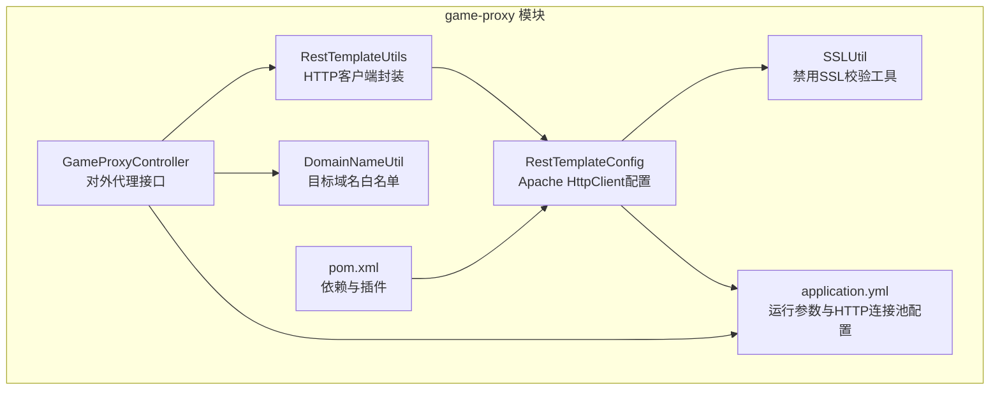
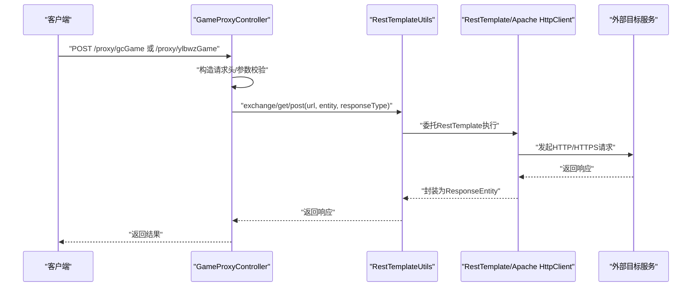
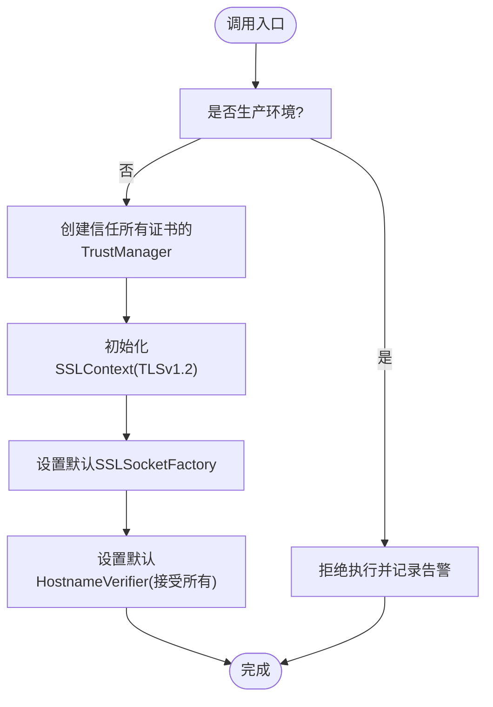
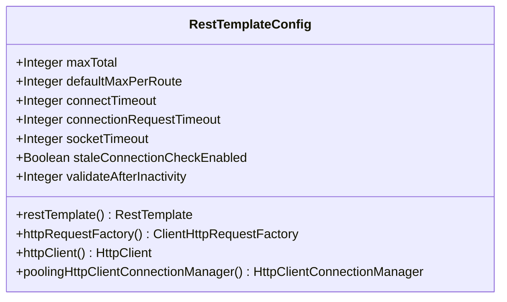
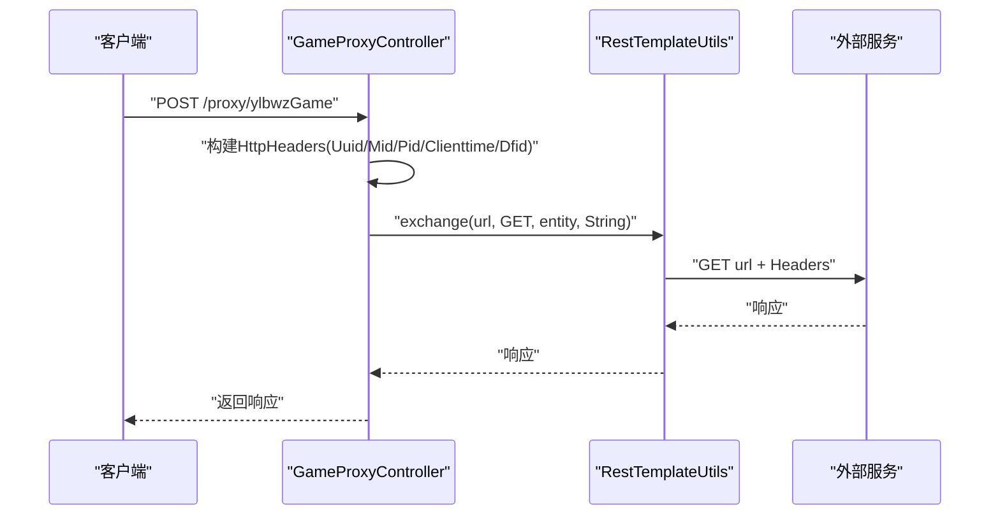
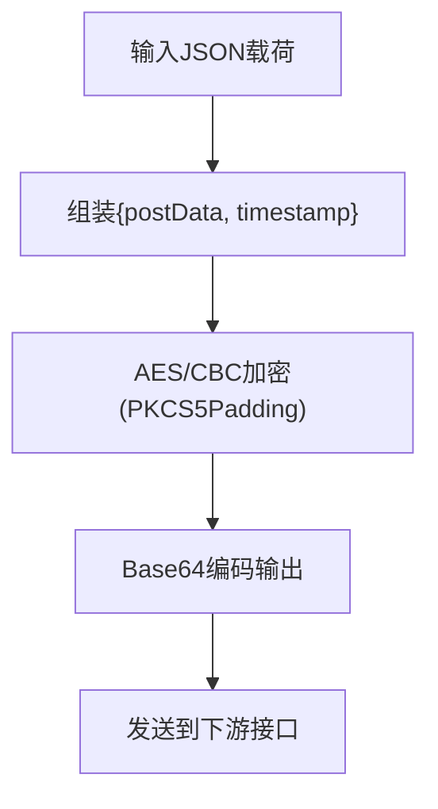
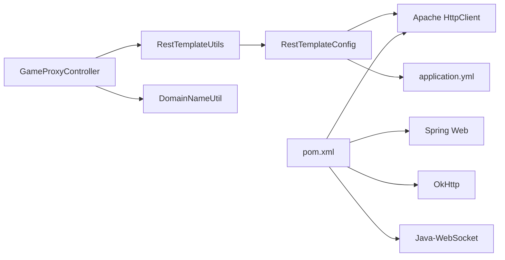

# HTTP安全配置

<cite>
**本文引用的文件**
- [SSLUtil.java](file://game-proxy/src/main/java/com/game/utils/SSLUtil.java)
- [RestTemplateConfig.java](file://game-proxy/src/main/java/com/game/commom/RestTemplateConfig.java)
- [RestTemplateUtils.java](file://game-proxy/src/main/java/com/game/commom/RestTemplateUtils.java)
- [GameProxyController.java](file://game-proxy/src/main/java/com/game/controller/GameProxyController.java)
- [DomainNameUtil.java](file://game-proxy/src/main/java/com/game/utils/DomainNameUtil.java)
- [application.yml](file://game-proxy/src/main/resources/application.yml)
- [pom.xml](file://game-proxy/pom.xml)
- [UuFarmService.java](file://game-proxy/src/main/java/com/game/uc/UuFarmService.java)
- [SafePointDrawWithFishingCN.java](file://game-proxy/src/main/java/com/game/utils/SafePointDrawWithFishingCN.java)
- [SafeWeeklyDrawWithWashSim.java](file://game-proxy/src/main/java/com/game/utils/SafeWeeklyDrawWithWashSim.java)
</cite>

## 目录
1. [引言](#引言)
2. [项目结构](#项目结构)
3. [核心组件](#核心组件)
4. [架构总览](#架构总览)
5. [详细组件分析](#详细组件分析)
6. [依赖关系分析](#依赖关系分析)
7. [性能与安全特性](#性能与安全特性)
8. [故障排查指南](#故障排查指南)
9. [结论](#结论)
10. [附录：配置示例与最佳实践](#附录配置示例与最佳实践)

## 引言
本文件面向HTTP安全配置，围绕HTTPS连接、证书验证与加密套件选择、代理服务器安全、HTTP头部安全策略、网络安全最佳实践等主题，结合代码库中的实现进行系统化梳理，并提供可操作的配置示例与风险防控建议。重点覆盖以下方面：
- HTTPS/TLS安全配置与证书校验
- 自签名证书处理与信任管理器配置
- 代理服务器安全（认证与访问控制）
- CORS与安全响应头、内容类型校验
- 防重放、CSRF防护与敏感数据保护
- 结合代码库中的工具类与配置的实际落地

## 项目结构
本项目采用多模块结构，其中 game-proxy 模块承载HTTP代理与安全相关能力，核心涉及：
- 控制器层：对外暴露代理接口，负责请求转发与响应返回
- 工具与配置层：RestTemplate客户端配置、SSL工具、域名白名单等
- 业务工具：加密与随机性相关工具，辅助敏感数据保护

图表来源
- [GameProxyController.java](file://game-proxy/src/main/java/com/game/controller/GameProxyController.java#L1-L436)
- [RestTemplateUtils.java](file://game-proxy/src/main/java/com/game/commom/RestTemplateUtils.java#L1-L51)
- [RestTemplateConfig.java](file://game-proxy/src/main/java/com/game/commom/RestTemplateConfig.java#L1-L132)
- [SSLUtil.java](file://game-proxy/src/main/java/com/game/utils/SSLUtil.java#L1-L22)
- [DomainNameUtil.java](file://game-proxy/src/main/java/com/game/utils/DomainNameUtil.java#L1-L16)
- [application.yml](file://game-proxy/src/main/resources/application.yml#L1-L58)
- [pom.xml](file://game-proxy/pom.xml#L1-L163)

章节来源
- [GameProxyController.java](file://game-proxy/src/main/java/com/game/controller/GameProxyController.java#L1-L436)
- [RestTemplateConfig.java](file://game-proxy/src/main/java/com/game/commom/RestTemplateConfig.java#L1-L132)
- [application.yml](file://game-proxy/src/main/resources/application.yml#L1-L58)

## 核心组件
- RestTemplateConfig：基于 Apache HttpClient 的连接池与请求配置，统一设置超时、Keep-Alive、重试与默认请求头，支持HTTP/HTTPS连接。
- RestTemplateUtils：对 RestTemplate 的静态封装，提供 GET/POST/exchange 等常用方法。
- SSLUtil：提供禁用SSL证书校验的能力，便于开发环境快速连通，但存在显著安全风险。
- GameProxyController：对外提供代理接口，负责参数校验、请求头注入与响应返回。
- DomainNameUtil：集中维护目标域名白名单，用于限制代理目标范围。
- application.yml：定义HTTP连接池参数、Redis连接、服务端口与上下文路径等。

章节来源
- [RestTemplateConfig.java](file://game-proxy/src/main/java/com/game/commom/RestTemplateConfig.java#L1-L132)
- [RestTemplateUtils.java](file://game-proxy/src/main/java/com/game/commom/RestTemplateUtils.java#L1-L51)
- [SSLUtil.java](file://game-proxy/src/main/java/com/game/utils/SSLUtil.java#L1-L22)
- [GameProxyController.java](file://game-proxy/src/main/java/com/game/controller/GameProxyController.java#L1-L436)
- [DomainNameUtil.java](file://game-proxy/src/main/java/com/game/utils/DomainNameUtil.java#L1-L16)
- [application.yml](file://game-proxy/src/main/resources/application.yml#L1-L58)

## 架构总览
下图展示HTTP代理请求在系统内的流转过程，以及与外部服务的交互：

图表来源
- [GameProxyController.java](file://game-proxy/src/main/java/com/game/controller/GameProxyController.java#L45-L81)
- [RestTemplateUtils.java](file://game-proxy/src/main/java/com/game/commom/RestTemplateUtils.java#L14-L50)
- [RestTemplateConfig.java](file://game-proxy/src/main/java/com/game/commom/RestTemplateConfig.java#L62-L108)

## 详细组件分析

### 组件A：SSLUtil 工具类与自签名证书处理
- 功能概述
  - 提供禁用SSL证书校验的方法，通过安装“信任所有证书”的 TrustManager 与 HostnameVerifier，使HTTPS连接绕过证书链与主机名校验。
  - 该能力仅适用于开发或测试场景，生产环境严禁启用。
- 实现要点
  - 使用 TLSv1.2 上下文初始化，设置默认 SSLSocketFactory 与 HostnameVerifier。
  - 由于未对证书颁发机构进行校验，易受中间人攻击影响。
- 安全风险
  - 易被恶意网络嗅探与劫持，导致敏感数据泄露。
  - 降低TLS整体安全性，破坏端到端加密保障。
- 建议
  - 生产环境不调用该方法；如需对接自签证书，应导入受信CA至JVM信任库或使用自定义 SSLContext 并显式校验证书链与主机名。
  - 如确需临时跳过校验，应在最小范围内使用，并尽快替换为合规方案。

图表来源
- [SSLUtil.java](file://game-proxy/src/main/java/com/game/utils/SSLUtil.java#L7-L20)

章节来源
- [SSLUtil.java](file://game-proxy/src/main/java/com/game/utils/SSLUtil.java#L1-L22)

### 组件B：RestTemplateConfig 与连接池安全配置
- 功能概述
  - 基于 Apache HttpClient 的连接池与请求配置，统一设置超时、Keep-Alive、重试策略与默认请求头。
  - 注册HTTP/HTTPS连接工厂，支持HTTPS连接。
- 关键点
  - 连接池参数：最大连接数、每路由并发、空闲校验与失效阈值。
  - 默认请求头：User-Agent、Accept-Encoding、Accept-Language、Connection、Content-Type。
  - 超时参数：连接超时、连接请求超时、Socket超时、启用陈旧连接检查。
  - 重试策略：默认重试处理器开启，重试次数与回退策略可按需调整。
- 安全建议
  - Content-Type 与 Accept-Language 等头应结合业务进行白名单校验，防止注入与MIME混淆攻击。
  - 在生产环境建议显式配置 HTTPS 信任策略，避免使用默认信任库。
  - 合理设置超时与重试，防止慢连接与资源耗尽。

图表来源
- [RestTemplateConfig.java](file://game-proxy/src/main/java/com/game/commom/RestTemplateConfig.java#L34-L131)

章节来源
- [RestTemplateConfig.java](file://game-proxy/src/main/java/com/game/commom/RestTemplateConfig.java#L1-L132)
- [application.yml](file://game-proxy/src/main/resources/application.yml#L43-L57)

### 组件C：GameProxyController 代理接口与安全头
- 功能概述
  - 提供多个代理接口，转发外部请求并返回响应。
  - 在特定接口中注入自定义请求头（如 Uuid、Mid、Pid、Clienttime、Dfid），用于下游鉴权与审计。
- 安全要点
  - 请求头注入需严格校验来源与格式，避免注入敏感字段。
  - 对外暴露的代理接口应限制来源IP、添加速率限制与访问控制。
  - 建议在控制器层增加CORS与安全响应头配置，防止跨域与XSS等风险。

图表来源
- [GameProxyController.java](file://game-proxy/src/main/java/com/game/controller/GameProxyController.java#L66-L81)
- [RestTemplateUtils.java](file://game-proxy/src/main/java/com/game/commom/RestTemplateUtils.java#L42-L44)

章节来源
- [GameProxyController.java](file://game-proxy/src/main/java/com/game/controller/GameProxyController.java#L45-L81)
- [RestTemplateUtils.java](file://game-proxy/src/main/java/com/game/commom/RestTemplateUtils.java#L1-L51)

### 组件D：DomainNameUtil 与代理目标白名单
- 功能概述
  - 维护目标域名白名单数组，限制代理请求的目标范围，降低误调用与横向越权风险。
- 安全建议
  - 白名单应集中管理，避免硬编码；可在配置中心或运行时动态加载。
  - 对请求URL进行严格匹配与归一化，防止路径遍历与协议相对性攻击。

章节来源
- [DomainNameUtil.java](file://game-proxy/src/main/java/com/game/utils/DomainNameUtil.java#L1-L16)

### 组件E：UuFarmService 敏感数据保护与加密
- 功能概述
  - 提供AES/CBC加密与Base64编码流程，将请求载荷与时间戳组合后加密传输，提升数据在传输层的安全性。
- 安全要点
  - 密钥与IV需妥善保管，建议使用硬件安全模块或密钥管理系统。
  - 时间戳参与加密有助于防重放，但需确保时钟同步与有效期控制。
  - 加解密逻辑应与上游/下游约定一致，避免版本不兼容。

图表来源
- [UuFarmService.java](file://game-proxy/src/main/java/com/game/uc/UuFarmService.java#L46-L61)

章节来源
- [UuFarmService.java](file://game-proxy/src/main/java/com/game/uc/UuFarmService.java#L37-L64)

### 组件F：随机性与防刷工具（安全相关）
- SafePointDrawWithFishingCN 与 SafeWeeklyDrawWithWashSim
  - 提供带权重抽样、水洗返还与补偿逻辑的随机性引擎，有助于在业务侧降低可预测性与刷量倾向。
  - 虽非网络层安全，但其随机性设计可间接降低攻击者利用确定性行为进行批量攻击的可能性。

章节来源
- [SafePointDrawWithFishingCN.java](file://game-proxy/src/main/java/com/game/utils/SafePointDrawWithFishingCN.java#L1-L316)
- [SafeWeeklyDrawWithWashSim.java](file://game-proxy/src/main/java/com/game/utils/SafeWeeklyDrawWithWashSim.java#L1-L133)

## 依赖关系分析
- 组件耦合
  - GameProxyController 依赖 RestTemplateUtils 与 DomainNameUtil，形成“控制器-工具-白名单”的协作。
  - RestTemplateUtils 依赖 RestTemplateConfig 提供的 HttpClient/连接池。
  - RestTemplateConfig 依赖 Apache HttpClient 与 Spring Web 客户端抽象。
- 外部依赖
  - Spring Boot Starter Web、Apache HttpClient、OkHttp、Java-WebSocket、Hutool、Lombok 等。

图表来源
- [GameProxyController.java](file://game-proxy/src/main/java/com/game/controller/GameProxyController.java#L1-L436)
- [RestTemplateUtils.java](file://game-proxy/src/main/java/com/game/commom/RestTemplateUtils.java#L1-L51)
- [RestTemplateConfig.java](file://game-proxy/src/main/java/com/game/commom/RestTemplateConfig.java#L1-L132)
- [application.yml](file://game-proxy/src/main/resources/application.yml#L1-L58)
- [pom.xml](file://game-proxy/pom.xml#L26-L100)

章节来源
- [pom.xml](file://game-proxy/pom.xml#L1-L163)

## 性能与安全特性
- 连接池与超时
  - 连接池参数与超时配置直接影响吞吐与稳定性，建议根据实际QPS与RT进行调优。
- Keep-Alive与重试
  - Keep-Alive减少握手开销；重试策略需谨慎，避免放大下游压力。
- 内容类型与头部
  - 统一 Content-Type 有利于下游解析一致性；建议对 Accept-Language、User-Agent 等进行白名单校验。
- 证书与TLS
  - 生产环境必须启用严格的证书校验与主机名校验，避免使用“信任所有”策略。

[本节为通用指导，无需列出具体文件来源]

## 故障排查指南
- SSL/TLS相关
  - 症状：连接失败、证书校验异常。
  - 排查：确认目标站点证书链有效、主机名匹配；避免在生产使用“信任所有”策略。
- 连接池与超时
  - 症状：连接池耗尽、请求超时。
  - 排查：检查 maxTotal、defaultMaxPerRoute、connectTimeout、socketTimeout；观察 staleConnectionCheckEnabled 与 validateAfterInactivity 的效果。
- 代理目标不可达
  - 症状：代理接口返回异常。
  - 排查：核对 DomainNameUtil 白名单与URL拼接；确认外部服务可达性与鉴权参数。
- 请求头注入问题
  - 症状：下游鉴权失败或参数缺失。
  - 排查：核对 GameProxyController 中的请求头构造逻辑与参数传递。

章节来源
- [SSLUtil.java](file://game-proxy/src/main/java/com/game/utils/SSLUtil.java#L1-L22)
- [RestTemplateConfig.java](file://game-proxy/src/main/java/com/game/commom/RestTemplateConfig.java#L84-L108)
- [GameProxyController.java](file://game-proxy/src/main/java/com/game/controller/GameProxyController.java#L66-L81)
- [DomainNameUtil.java](file://game-proxy/src/main/java/com/game/utils/DomainNameUtil.java#L1-L16)

## 结论
本项目在HTTP代理与客户端配置方面具备良好的工程化基础，但在生产安全层面仍存在若干风险点，尤其是SSL证书校验与代理访问控制方面。建议优先落实以下改进：
- 生产禁用“信任所有”证书策略，采用合规证书与严格校验
- 强化代理目标白名单与来源IP限制
- 增强CORS与安全响应头配置
- 对敏感数据传输引入端到端加密与时间戳防重放
- 对控制器层增加CSRF防护与参数校验

[本节为总结性内容，无需列出具体文件来源]

## 附录：配置示例与最佳实践

### HTTPS/TLS 安全配置要点
- 协议与套件
  - 优先使用 TLSv1.2 及以上版本，禁用 SSLv2/3、TLSv1.0/1.1。
  - 选择前向保密（PFS）套件，避免弱加密与已弃用套件。
- 证书验证
  - 生产环境必须启用证书链校验与主机名匹配。
  - 将受信CA证书导入JVM信任库或使用自定义 SSLContext 并显式校验。
- 自签名证书
  - 仅在开发/测试环境使用；生产环境禁止使用“信任所有”。

章节来源
- [SSLUtil.java](file://game-proxy/src/main/java/com/game/utils/SSLUtil.java#L16-L20)

### 代理服务器安全设置
- 认证机制
  - 在网关或反向代理层启用双向认证（mTLS）或API Key鉴权。
  - 对内部服务间调用强制使用令牌与签名。
- 访问控制
  - 限制代理目标域名白名单，避免任意URL代理。
  - 对外暴露接口增加来源IP白名单与速率限制。

章节来源
- [DomainNameUtil.java](file://game-proxy/src/main/java/com/game/utils/DomainNameUtil.java#L1-L16)
- [GameProxyController.java](file://game-proxy/src/main/java/com/game/controller/GameProxyController.java#L66-L81)

### HTTP 头部安全配置
- CORS
  - 仅允许可信源；精确设置允许的Origin、Methods、Headers与凭据。
- 安全响应头
  - 添加 Content-Security-Policy、X-Frame-Options、X-Content-Type-Options、Referrer-Policy 等。
- 内容类型验证
  - 对 Content-Type 进行白名单校验，防止MIME混淆与注入。

章节来源
- [RestTemplateConfig.java](file://game-proxy/src/main/java/com/game/commom/RestTemplateConfig.java#L94-L100)

### 网络安全最佳实践
- 防重放攻击
  - 为请求附加时间戳与随机nonce，服务端校验时间窗口与去重表。
- CSRF防护
  - 对有状态变更的接口启用CSRF Token校验与SameSite Cookie策略。
- 敏感数据保护
  - 传输层采用TLS；应用层对敏感字段进行加密存储与传输。
  - 使用安全的随机数生成器与不可预测的密钥材料。

章节来源
- [UuFarmService.java](file://game-proxy/src/main/java/com/game/uc/UuFarmService.java#L46-L61)
- [SafePointDrawWithFishingCN.java](file://game-proxy/src/main/java/com/game/utils/SafePointDrawWithFishingCN.java#L1-L316)
- [SafeWeeklyDrawWithWashSim.java](file://game-proxy/src/main/java/com/game/utils/SafeWeeklyDrawWithWashSim.java#L1-L133)

### 配置示例（基于现有配置文件）
- HTTP连接池参数
  - 最大连接数、每路由并发、超时与空闲校验等参数已在配置文件中定义，建议结合压测结果进行调优。
- 服务端口与上下文路径
  - server.port 与 server.servlet.context-path 在配置文件中集中管理，便于部署与运维。

章节来源
- [application.yml](file://game-proxy/src/main/resources/application.yml#L1-L58)