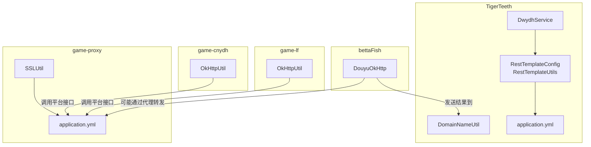
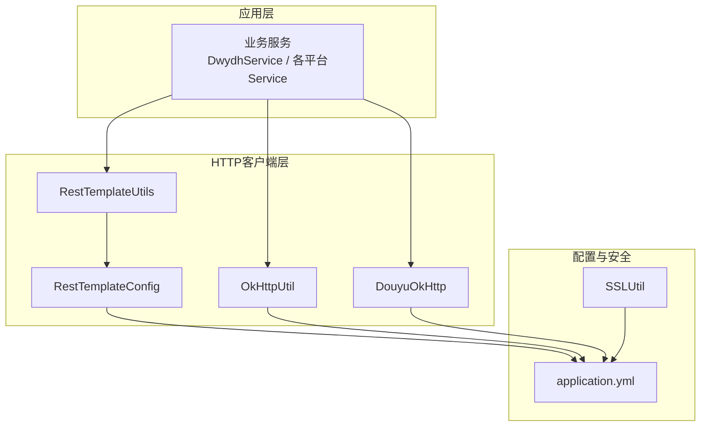
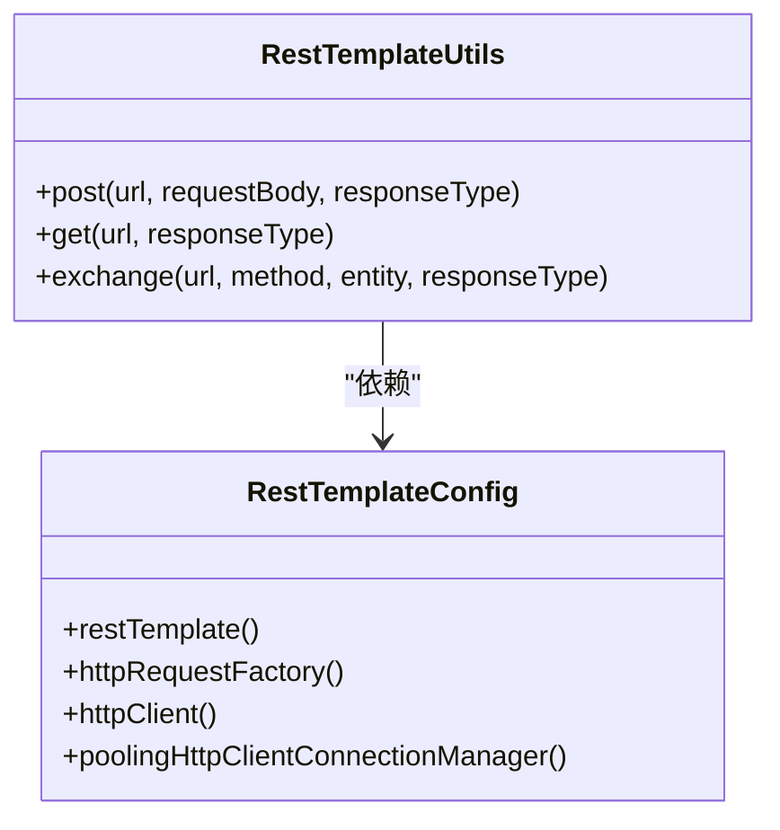
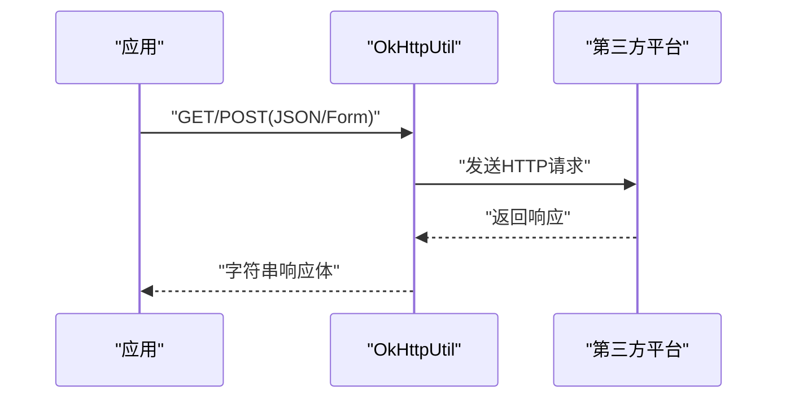
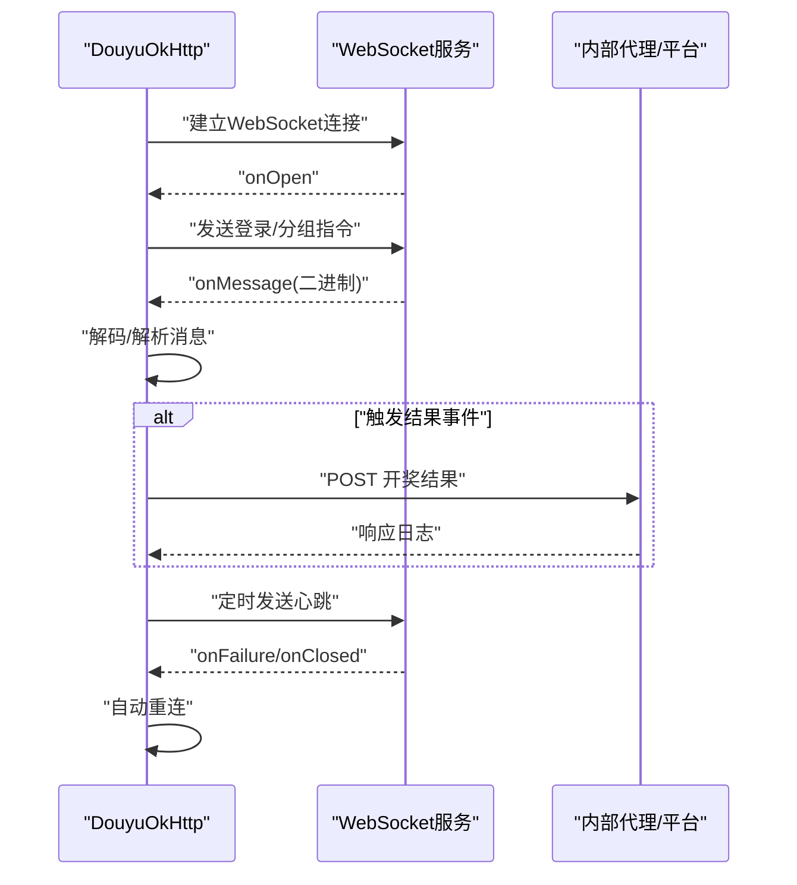
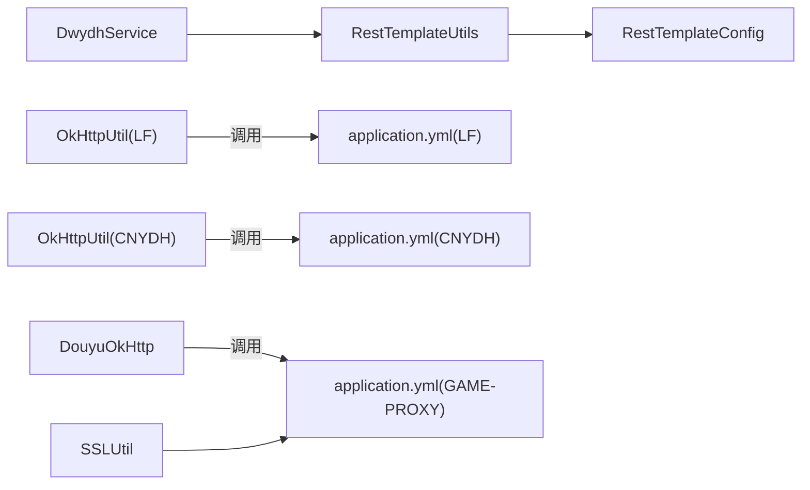

# HTTP客户端集成

<cite>
**本文引用的文件**
- [TigerTeeth/src/main/java/com/commom/RestTemplateConfig.java](file://TigerTeeth/src/main/java/com/commom/RestTemplateConfig.java)
- [TigerTeeth/src/main/java/com/commom/RestTemplateUtils.java](file://TigerTeeth/src/main/java/com/commom/RestTemplateUtils.java)
- [TigerTeeth/src/main/resources/application.yml](file://TigerTeeth/src/main/resources/application.yml)
- [TigerTeeth/src/main/java/com/dwydh/DwydhService.java](file://TigerTeeth/src/main/java/com/dwydh/DwydhService.java)
- [TigerTeeth/src/main/java/com/utils/DomainNameUtil.java](file://TigerTeeth/src/main/java/com/utils/DomainNameUtil.java)
- [bettaFish/src/main/java/com/utils/DouyuOkHttp.java](file://bettaFish/src/main/java/com/utils/DouyuOkHttp.java)
- [game-lf/src/main/java/com/utils/OkHttpUtil.java](file://game-lf/src/main/java/com/utils/OkHttpUtil.java)
- [game-cnydh/src/main/java/com/utils/OkHttpUtil.java](file://game-cnydh/src/main/java/com/utils/OkHttpUtil.java)
- [game-proxy/src/main/resources/application.yml](file://game-proxy/src/main/resources/application.yml)
- [game-proxy/src/main/java/com/game/utils/SSLUtil.java](file://game-proxy/src/main/java/com/game/utils/SSLUtil.java)
</cite>

## 目录
1. [引言](#引言)
2. [项目结构](#项目结构)
3. [核心组件](#核心组件)
4. [架构总览](#架构总览)
5. [详细组件分析](#详细组件分析)
6. [依赖分析](#依赖分析)
7. [性能考虑](#性能考虑)
8. [故障排查指南](#故障排查指南)
9. [结论](#结论)
10. [附录](#附录)

## 引言
本技术文档围绕HTTP客户端集成展开，系统性说明RESTful API调用的实现机制与配置管理，对比并解释Spring RestTemplate与OkHttp两种HTTP客户端的选择依据与适用场景；阐述请求构建、参数传递、响应解析与异常处理流程；给出超时设置、重试机制、连接池配置与性能优化策略；覆盖安全配置（SSL/TLS、认证、代理）与调试技巧；最后结合各游戏平台API的集成方式与兼容性处理，提供可操作的实践建议。

## 项目结构
该仓库包含多个子模块，分别采用不同HTTP客户端实现与平台对接：
- TigerTeeth：基于Spring RestTemplate与Apache HttpClient的配置与封装，用于通用HTTP调用与WebSocket客户端协作。
- bettaFish：基于OkHttp的WebSocket客户端，负责与第三方平台（如斗鱼）的实时数据交互。
- game-lf、game-cnydh：基于OkHttp的工具类封装，提供GET/POST(JSON/Form)等常用HTTP方法。
- game-proxy：统一代理服务，包含HTTP客户端配置、SSL工具与多平台适配。

图表来源
- [TigerTeeth/src/main/java/com/commom/RestTemplateConfig.java](file://TigerTeeth/src/main/java/com/commom/RestTemplateConfig.java#L34-L131)
- [TigerTeeth/src/main/java/com/commom/RestTemplateUtils.java](file://TigerTeeth/src/main/java/com/commom/RestTemplateUtils.java#L14-L30)
- [TigerTeeth/src/main/resources/application.yml](file://TigerTeeth/src/main/resources/application.yml#L16-L30)
- [TigerTeeth/src/main/java/com/dwydh/DwydhService.java](file://TigerTeeth/src/main/java/com/dwydh/DwydhService.java#L14-L38)
- [TigerTeeth/src/main/java/com/utils/DomainNameUtil.java](file://TigerTeeth/src/main/java/com/utils/DomainNameUtil.java#L3-L15)
- [bettaFish/src/main/java/com/utils/DouyuOkHttp.java](file://bettaFish/src/main/java/com/utils/DouyuOkHttp.java#L17-L281)
- [game-lf/src/main/java/com/utils/OkHttpUtil.java](file://game-lf/src/main/java/com/utils/OkHttpUtil.java#L8-L73)
- [game-cnydh/src/main/java/com/utils/OkHttpUtil.java](file://game-cnydh/src/main/java/com/utils/OkHttpUtil.java#L8-L73)
- [game-proxy/src/main/resources/application.yml](file://game-proxy/src/main/resources/application.yml#L43-L57)
- [game-proxy/src/main/java/com/game/utils/SSLUtil.java](file://game-proxy/src/main/java/com/game/utils/SSLUtil.java)

章节来源
- [TigerTeeth/src/main/java/com/commom/RestTemplateConfig.java](file://TigerTeeth/src/main/java/com/commom/RestTemplateConfig.java#L34-L131)
- [TigerTeeth/src/main/resources/application.yml](file://TigerTeeth/src/main/resources/application.yml#L16-L30)
- [bettaFish/src/main/java/com/utils/DouyuOkHttp.java](file://bettaFish/src/main/java/com/utils/DouyuOkHttp.java#L17-L281)
- [game-lf/src/main/java/com/utils/OkHttpUtil.java](file://game-lf/src/main/java/com/utils/OkHttpUtil.java#L8-L73)
- [game-cnydh/src/main/java/com/utils/OkHttpUtil.java](file://game-cnydh/src/main/java/com/utils/OkHttpUtil.java#L8-L73)
- [game-proxy/src/main/resources/application.yml](file://game-proxy/src/main/resources/application.yml#L43-L57)

## 核心组件
- RestTemplate配置与连接池
  - 通过RestTemplateConfig定义HttpClient连接池、超时、Keep-Alive与默认请求头，统一由RestTemplateUtils封装常用GET/POST/exchange方法，便于在业务层以类型化响应进行调用。
- OkHttp工具类
  - 在game-lf与game-cnydh中提供静态OkHttp客户端，支持GET/POST(JSON/Form)，具备连接、读写超时配置，适合轻量级HTTP调用。
- WebSocket客户端
  - bettaFish中的DouyuOkHttp使用OkHttp的WebSocket能力，实现与第三方平台的长连接通信、心跳维持、消息编解码与自动重连。
- 代理与安全
  - game-proxy提供统一的HTTP客户端配置项与SSL工具类，便于集中管理超时、连接池与TLS安全策略。

章节来源
- [TigerTeeth/src/main/java/com/commom/RestTemplateConfig.java](file://TigerTeeth/src/main/java/com/commom/RestTemplateConfig.java#L62-L107)
- [TigerTeeth/src/main/java/com/commom/RestTemplateUtils.java](file://TigerTeeth/src/main/java/com/commom/RestTemplateUtils.java#L14-L30)
- [game-lf/src/main/java/com/utils/OkHttpUtil.java](file://game-lf/src/main/java/com/utils/OkHttpUtil.java#L10-L18)
- [game-cnydh/src/main/java/com/utils/OkHttpUtil.java](file://game-cnydh/src/main/java/com/utils/OkHttpUtil.java#L10-L18)
- [bettaFish/src/main/java/com/utils/DouyuOkHttp.java](file://bettaFish/src/main/java/com/utils/DouyuOkHttp.java#L21-L40)
- [game-proxy/src/main/resources/application.yml](file://game-proxy/src/main/resources/application.yml#L43-L57)
- [game-proxy/src/main/java/com/game/utils/SSLUtil.java](file://game-proxy/src/main/java/com/game/utils/SSLUtil.java)

## 架构总览
下图展示HTTP客户端在各模块中的角色与交互路径，包括RestTemplate与OkHttp两类客户端的职责边界与协作方式。

图表来源
- [TigerTeeth/src/main/java/com/commom/RestTemplateUtils.java](file://TigerTeeth/src/main/java/com/commom/RestTemplateUtils.java#L14-L30)
- [TigerTeeth/src/main/java/com/commom/RestTemplateConfig.java](file://TigerTeeth/src/main/java/com/commom/RestTemplateConfig.java#L62-L107)
- [game-lf/src/main/java/com/utils/OkHttpUtil.java](file://game-lf/src/main/java/com/utils/OkHttpUtil.java#L8-L73)
- [bettaFish/src/main/java/com/utils/DouyuOkHttp.java](file://bettaFish/src/main/java/com/utils/DouyuOkHttp.java#L17-L281)
- [game-proxy/src/main/resources/application.yml](file://game-proxy/src/main/resources/application.yml#L43-L57)
- [game-proxy/src/main/java/com/game/utils/SSLUtil.java](file://game-proxy/src/main/java/com/game/utils/SSLUtil.java)

## 详细组件分析

### RestTemplate配置与使用
- 连接池与超时
  - 通过application.yml中的http.*参数控制连接池容量、并发路由限制、连接超时、连接请求超时与套接字超时；启用陈旧连接检测与空闲校验。
- 默认请求头与Keep-Alive
  - 统一添加User-Agent、编码、语言、连接保持与内容类型等头部，提升兼容性与稳定性。
- 重试策略
  - 默认启用重试处理器，允许在可重试条件下自动重试，降低瞬时网络波动影响。
- 类型化响应
  - RestTemplateUtils提供泛型响应封装，便于业务按目标类型接收响应体，减少手动转换成本。

图表来源
- [TigerTeeth/src/main/java/com/commom/RestTemplateConfig.java](file://TigerTeeth/src/main/java/com/commom/RestTemplateConfig.java#L62-L107)
- [TigerTeeth/src/main/java/com/commom/RestTemplateUtils.java](file://TigerTeeth/src/main/java/com/commom/RestTemplateUtils.java#L14-L30)

章节来源
- [TigerTeeth/src/main/resources/application.yml](file://TigerTeeth/src/main/resources/application.yml#L16-L30)
- [TigerTeeth/src/main/java/com/commom/RestTemplateConfig.java](file://TigerTeeth/src/main/java/com/commom/RestTemplateConfig.java#L84-L129)
- [TigerTeeth/src/main/java/com/commom/RestTemplateUtils.java](file://TigerTeeth/src/main/java/com/commom/RestTemplateUtils.java#L14-L30)

### OkHttp工具类与WebSocket客户端
- OkHttpUtil（LF/CNYDH）
  - 提供静态OkHttpClient，统一设置连接/读/写超时；封装GET/POST(JSON)/POST(Form)三类常用请求，返回字符串响应体，适合快速集成与轻量调用。
- DouyuOkHttp（bettaFish）
  - 使用OkHttp的WebSocket能力，建立与第三方平台的长连接；实现登录、分组加入、心跳保活、二进制消息解码与自动重连；在特定事件触发时向内部代理或平台发起结果同步请求。

图表来源
- [game-lf/src/main/java/com/utils/OkHttpUtil.java](file://game-lf/src/main/java/com/utils/OkHttpUtil.java#L23-L51)
- [game-cnydh/src/main/java/com/utils/OkHttpUtil.java](file://game-cnydh/src/main/java/com/utils/OkHttpUtil.java#L23-L51)

图表来源
- [bettaFish/src/main/java/com/utils/DouyuOkHttp.java](file://bettaFish/src/main/java/com/utils/DouyuOkHttp.java#L43-L166)
- [bettaFish/src/main/java/com/utils/DouyuOkHttp.java](file://bettaFish/src/main/java/com/utils/DouyuOkHttp.java#L170-L182)
- [bettaFish/src/main/java/com/utils/DouyuOkHttp.java](file://bettaFish/src/main/java/com/utils/DouyuOkHttp.java#L31-L40)

章节来源
- [game-lf/src/main/java/com/utils/OkHttpUtil.java](file://game-lf/src/main/java/com/utils/OkHttpUtil.java#L8-L73)
- [game-cnydh/src/main/java/com/utils/OkHttpUtil.java](file://game-cnydh/src/main/java/com/utils/OkHttpUtil.java#L8-L73)
- [bettaFish/src/main/java/com/utils/DouyuOkHttp.java](file://bettaFish/src/main/java/com/utils/DouyuOkHttp.java#L17-L281)

### 请求构建、参数传递与响应解析
- RestTemplate
  - 通过HttpEntity封装请求体与头部，exchange/postForEntity/getForEntity实现类型化响应；适用于JSON对象、表单与自定义实体。
- OkHttp
  - GET支持传入headers；POST(JSON/Form)分别构造RequestBody与FormBody；统一从Response.body().string()读取响应文本，便于后续解析。
- WebSocket
  - 二进制消息按固定格式解析为键值对集合，再根据消息类型执行相应业务逻辑（如触发结果同步）。

章节来源
- [TigerTeeth/src/main/java/com/commom/RestTemplateUtils.java](file://TigerTeeth/src/main/java/com/commom/RestTemplateUtils.java#L19-L29)
- [game-lf/src/main/java/com/utils/OkHttpUtil.java](file://game-lf/src/main/java/com/utils/OkHttpUtil.java#L23-L72)
- [bettaFish/src/main/java/com/utils/DouyuOkHttp.java](file://bettaFish/src/main/java/com/utils/DouyuOkHttp.java#L205-L233)

### 异常处理与重试机制
- 自动重连（WebSocket）
  - 断线后延迟重连，避免频繁抖动；心跳定时器确保长连接存活。
- HTTP重试（RestTemplate）
  - 默认启用重试处理器，可在配置中调整重试次数与幂等性策略。
- 错误日志
  - 对非成功响应与异常进行记录，便于定位问题。

章节来源
- [bettaFish/src/main/java/com/utils/DouyuOkHttp.java](file://bettaFish/src/main/java/com/utils/DouyuOkHttp.java#L31-L40)
- [bettaFish/src/main/java/com/utils/DouyuOkHttp.java](file://bettaFish/src/main/java/com/utils/DouyuOkHttp.java#L155-L165)
- [TigerTeeth/src/main/java/com/commom/RestTemplateConfig.java](file://TigerTeeth/src/main/java/com/commom/RestTemplateConfig.java#L106-L107)

### 超时设置、连接池与性能优化
- 连接池
  - 通过maxTotal与defaultMaxPerRoute控制总体与路由并发；validateAfterInactivity与staleConnectionCheckEnabled提升连接复用效率与稳定性。
- 超时
  - connectTimeout、connectionRequestTimeout、socketTimeout分别控制连接建立、从池获取与读取响应的超时；OkHttpUtil中亦有统一的连接/读/写超时配置。
- Keep-Alive与默认头
  - 统一默认头与Keep-Alive策略，减少握手开销，提高吞吐。

章节来源
- [TigerTeeth/src/main/resources/application.yml](file://TigerTeeth/src/main/resources/application.yml#L16-L30)
- [TigerTeeth/src/main/java/com/commom/RestTemplateConfig.java](file://TigerTeeth/src/main/java/com/commom/RestTemplateConfig.java#L84-L107)
- [game-lf/src/main/java/com/utils/OkHttpUtil.java](file://game-lf/src/main/java/com/utils/OkHttpUtil.java#L12-L18)
- [game-cnydh/src/main/java/com/utils/OkHttpUtil.java](file://game-cnydh/src/main/java/com/utils/OkHttpUtil.java#L12-L18)

### 安全配置（SSL/TLS、认证、代理）
- TLS/SSL
  - RestTemplateConfig注册HTTPS Socket工厂，确保HTTPS站点访问；game-proxy提供SSL工具类，便于扩展证书校验与信任策略。
- 认证与代理
  - 可在OkHttp或RestTemplate层面增加认证头或拦截器；代理可通过OkHttp Builder配置，或在RestTemplate的RequestFactory中设置。
- 证书校验
  - 建议在生产环境禁用不安全的主机名校验与信任所有证书策略，优先使用受信CA链与精确主机名校验。

章节来源
- [TigerTeeth/src/main/java/com/commom/RestTemplateConfig.java](file://TigerTeeth/src/main/java/com/commom/RestTemplateConfig.java#L116-L129)
- [game-proxy/src/main/resources/application.yml](file://game-proxy/src/main/resources/application.yml#L43-L57)
- [game-proxy/src/main/java/com/game/utils/SSLUtil.java](file://game-proxy/src/main/java/com/game/utils/SSLUtil.java)

### 与各游戏平台API的集成与兼容性
- TigerTeeth
  - 通过RestTemplateUtils与application.yml中的HTTP参数，统一管理与平台的HTTP交互；DomainNameUtil提供代理/中转URL集合，便于灰度与多地域部署。
- bettaFish
  - 以WebSocket直连第三方平台，同时在特定事件触发时向内部代理/平台发起结果同步请求，形成“实时+回推”的双通道模式。
- game-lf / game-cnydh
  - 以OkHttpUtil封装平台接口调用，统一超时与头部策略，便于快速扩展新平台。

章节来源
- [TigerTeeth/src/main/java/com/utils/DomainNameUtil.java](file://TigerTeeth/src/main/java/com/utils/DomainNameUtil.java#L3-L15)
- [TigerTeeth/src/main/java/com/dwydh/DwydhService.java](file://TigerTeeth/src/main/java/com/dwydh/DwydhService.java#L21-L36)
- [bettaFish/src/main/java/com/utils/DouyuOkHttp.java](file://bettaFish/src/main/java/com/utils/DouyuOkHttp.java#L112-L143)

## 依赖分析
- 组件耦合
  - DwydhService依赖RestTemplateUtils与线程池，体现业务调度与HTTP调用的分离。
  - OkHttpUtil为静态工具类，低耦合、易复用；DouyuOkHttp内聚了WebSocket生命周期与业务逻辑。
- 外部依赖
  - RestTemplate基于Apache HttpClient；OkHttp为独立HTTP/2与WebSocket实现；两者在本仓库中并存，满足不同场景需求。

图表来源
- [TigerTeeth/src/main/java/com/dwydh/DwydhService.java](file://TigerTeeth/src/main/java/com/dwydh/DwydhService.java#L14-L38)
- [TigerTeeth/src/main/java/com/commom/RestTemplateUtils.java](file://TigerTeeth/src/main/java/com/commom/RestTemplateUtils.java#L14-L30)
- [TigerTeeth/src/main/java/com/commom/RestTemplateConfig.java](file://TigerTeeth/src/main/java/com/commom/RestTemplateConfig.java#L62-L107)
- [game-lf/src/main/java/com/utils/OkHttpUtil.java](file://game-lf/src/main/java/com/utils/OkHttpUtil.java#L8-L73)
- [game-cnydh/src/main/java/com/utils/OkHttpUtil.java](file://game-cnydh/src/main/java/com/utils/OkHttpUtil.java#L8-L73)
- [bettaFish/src/main/java/com/utils/DouyuOkHttp.java](file://bettaFish/src/main/java/com/utils/DouyuOkHttp.java#L17-L281)
- [game-proxy/src/main/resources/application.yml](file://game-proxy/src/main/resources/application.yml#L43-L57)
- [game-proxy/src/main/java/com/game/utils/SSLUtil.java](file://game-proxy/src/main/java/com/game/utils/SSLUtil.java)

章节来源
- [TigerTeeth/src/main/java/com/dwydh/DwydhService.java](file://TigerTeeth/src/main/java/com/dwydh/DwydhService.java#L14-L38)
- [bettaFish/src/main/java/com/utils/DouyuOkHttp.java](file://bettaFish/src/main/java/com/utils/DouyuOkHttp.java#L17-L281)

## 性能考虑
- 连接池与并发
  - 合理设置maxTotal与defaultMaxPerRoute，避免过度占用资源；结合业务QPS评估并发路由上限。
- 超时策略
  - 根据平台特性调整connectTimeout、connectionRequestTimeout与socketTimeout；对长轮询或WebSocket场景适当放宽读超时。
- Keep-Alive与压缩
  - 启用Keep-Alive与GZIP压缩可显著降低握手与传输开销；注意服务端对压缩的支持与兼容性。
- 缓存与幂等
  - 对只读接口启用缓存；对非幂等写操作做好去重与重试控制，避免重复提交。
- 监控与告警
  - 建议埋点统计成功率、RT、错误码分布与超时率，及时发现异常波动。

## 故障排查指南
- 常见问题定位
  - 连接超时：检查connectTimeout与网络连通性；必要时开启staleConnectionCheckEnabled。
  - 响应超时：增大socketTimeout或优化服务端处理；对批量任务拆分。
  - 4xx/5xx错误：查看响应体与状态码，结合日志定位业务参数或鉴权问题。
  - WebSocket断连：确认心跳周期与自动重连逻辑；检查平台侧封禁或限流。
- 日志与追踪
  - 对关键请求记录URL、耗时、状态码与响应摘要；在异常分支打印堆栈与上下文参数。
- 重试与熔断
  - 对瞬时性错误启用指数退避重试；对持续性错误引入熔断与降级策略。

## 结论
本项目在不同模块中分别采用RestTemplate与OkHttp两类HTTP客户端，既保证了Spring生态下的统一配置与类型化响应，又满足了WebSocket与轻量HTTP调用的灵活性。通过合理的连接池、超时与重试策略，以及统一的安全与代理配置，能够稳定支撑多平台API集成与高并发场景。建议在生产环境中进一步完善监控、日志与安全策略，持续优化性能与可靠性。

## 附录
- API调用示例（路径参考）
  - RestTemplate调用：[TigerTeeth/src/main/java/com/commom/RestTemplateUtils.java](file://TigerTeeth/src/main/java/com/commom/RestTemplateUtils.java#L19-L29)
  - OkHttp GET/POST(JSON/Form)：[game-lf/src/main/java/com/utils/OkHttpUtil.java](file://game-lf/src/main/java/com/utils/OkHttpUtil.java#L23-L72)
  - WebSocket连接与心跳：[bettaFish/src/main/java/com/utils/DouyuOkHttp.java](file://bettaFish/src/main/java/com/utils/DouyuOkHttp.java#L43-L182)
- 配置参考
  - RestTemplate连接池与超时：[TigerTeeth/src/main/resources/application.yml](file://TigerTeeth/src/main/resources/application.yml#L16-L30)
  - 代理与SSL配置：[game-proxy/src/main/resources/application.yml](file://game-proxy/src/main/resources/application.yml#L43-L57)
  - SSL工具类：[game-proxy/src/main/java/com/game/utils/SSLUtil.java](file://game-proxy/src/main/java/com/game/utils/SSLUtil.java)