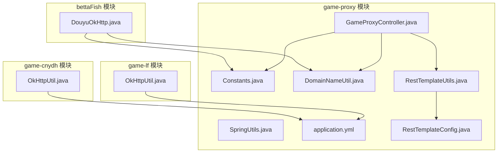
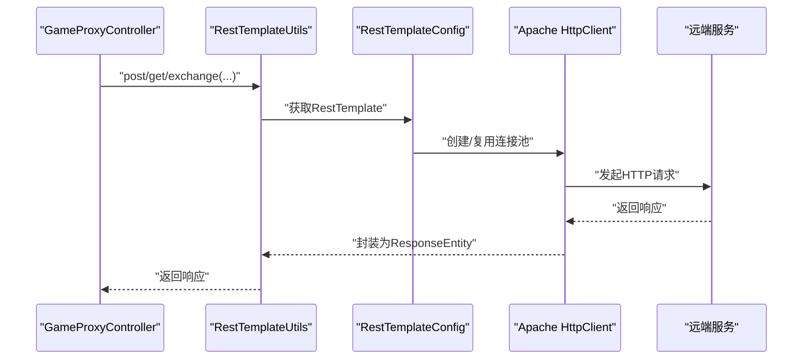
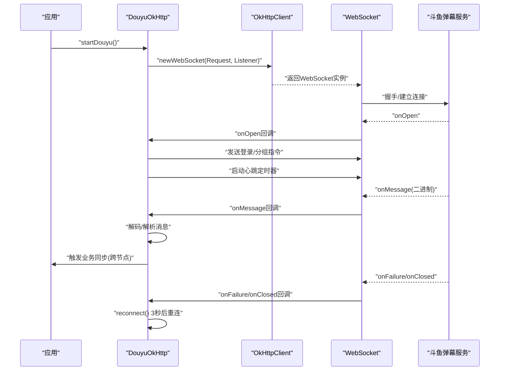
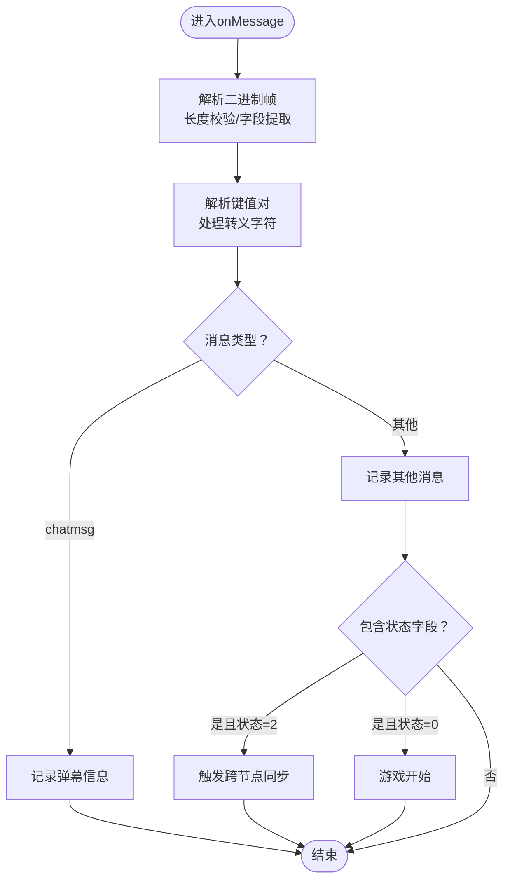
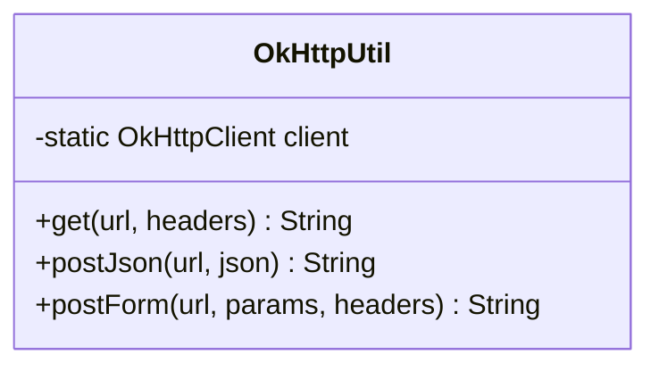
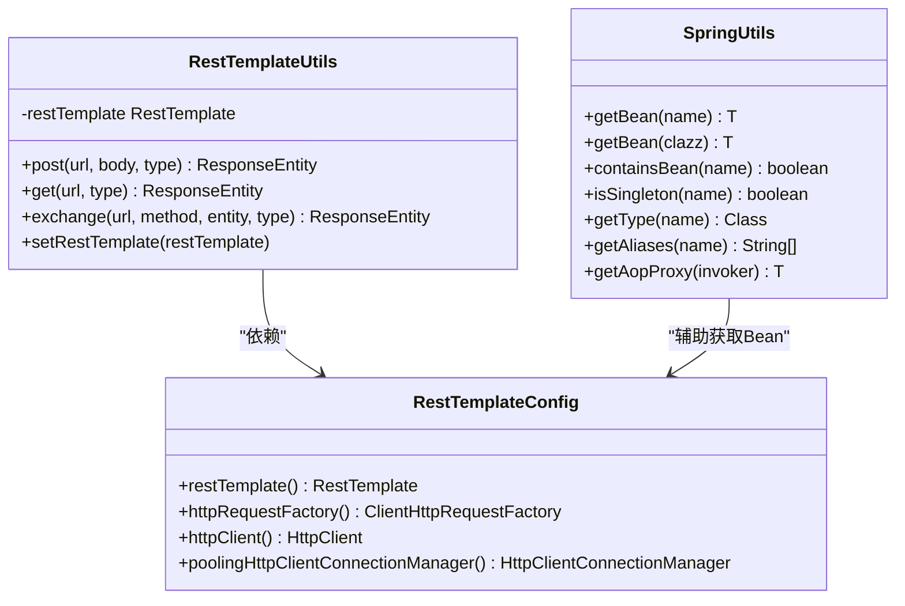
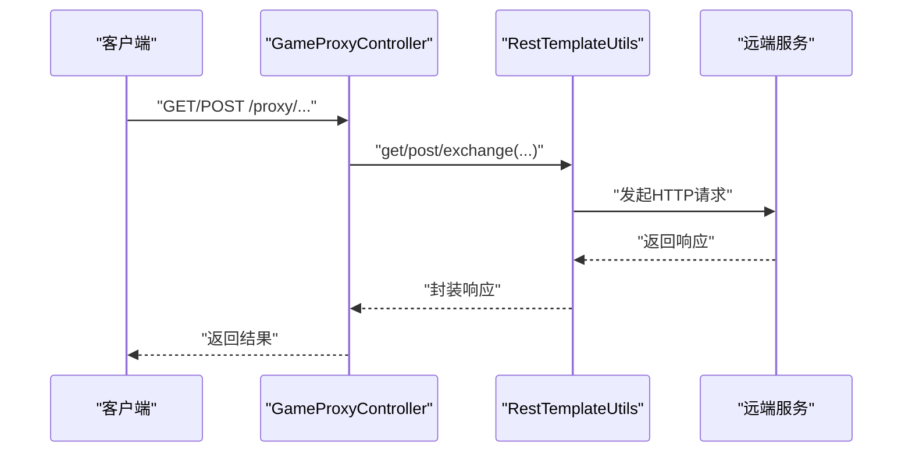
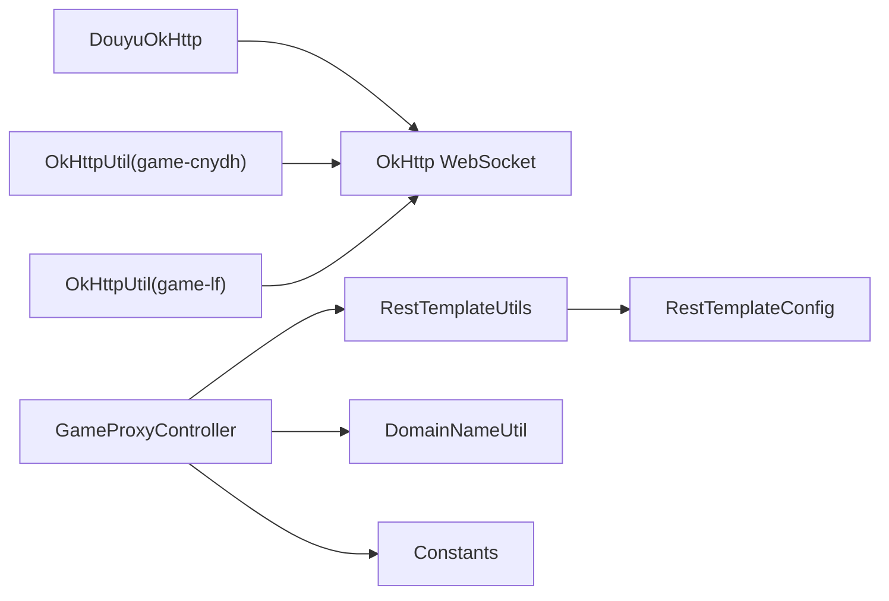

# OkHttp客户端集成

<cite>
**本文引用的文件**
- [DouyuOkHttp.java](file://bettaFish/src/main/java/com/utils/DouyuOkHttp.java)
- [OkHttpUtil.java（game-cnydh）](file://game-cnydh/src/main/java/com/utils/OkHttpUtil.java)
- [OkHttpUtil.java（game-lf）](file://game-lf/src/main/java/com/utils/OkHttpUtil.java)
- [SpringUtils.java](file://game-proxy/src/main/java/com/game/utils/SpringUtils.java)
- [DouyuService.java](file://game-proxy/src/main/java/com/game/douyu/DouyuService.java)
- [GameProxyController.java](file://game-proxy/src/main/java/com/game/controller/GameProxyController.java)
- [application.yml](file://game-proxy/src/main/resources/application.yml)
- [DomainNameUtil.java](file://game-proxy/src/main/java/com/game/utils/DomainNameUtil.java)
- [Constants.java](file://game-proxy/src/main/java/com/game/commom/Constants.java)
- [RestTemplateConfig.java](file://game-proxy/src/main/java/com/game/commom/RestTemplateConfig.java)
- [RestTemplateUtils.java](file://game-proxy/src/main/java/com/game/commom/RestTemplateUtils.java)
</cite>

## 目录
1. [引言](#引言)
2. [项目结构](#项目结构)
3. [核心组件](#核心组件)
4. [架构总览](#架构总览)
5. [详细组件分析](#详细组件分析)
6. [依赖关系分析](#依赖关系分析)
7. [性能考量](#性能考量)
8. [故障排查指南](#故障排查指南)
9. [结论](#结论)
10. [附录](#附录)

## 引言
本技术文档围绕OkHttp客户端在游戏代理系统中的集成与应用展开，重点说明以下内容：
- 在游戏代理场景中OkHttp的应用价值与优势
- DouyuOkHttp与OkHttpUtil两类实现的职责边界与工作机制
- 客户端初始化、请求构建、响应处理与连接池管理
- HTTP/2支持现状与拦截器扩展点
- 异步请求处理、超时配置与重试策略
- 不同HTTP方法（GET、POST、PUT、DELETE）的使用范式
- 与Spring框架的集成与依赖注入配置
- 性能优化建议与常见问题解决方案

## 项目结构
本仓库包含多个子模块，其中与OkHttp集成直接相关的核心文件分布如下：
- bettaFish模块：提供基于OkHttp的WebSocket斗鱼弹幕监听与心跳维持能力
- game-cnydh与game-lf模块：提供通用OkHttp工具类，封装GET/POST(JSON/Form)请求
- game-proxy模块：提供Spring集成、配置与控制器，承载业务代理与数据同步

图表来源
- [DouyuOkHttp.java](file://bettaFish/src/main/java/com/utils/DouyuOkHttp.java#L1-L282)
- [OkHttpUtil.java（game-cnydh）](file://game-cnydh/src/main/java/com/utils/OkHttpUtil.java#L1-L74)
- [OkHttpUtil.java（game-lf）](file://game-lf/src/main/java/com/utils/OkHttpUtil.java#L1-L74)
- [GameProxyController.java](file://game-proxy/src/main/java/com/game/controller/GameProxyController.java#L1-L436)
- [SpringUtils.java](file://game-proxy/src/main/java/com/game/utils/SpringUtils.java#L1-L103)
- [Constants.java](file://game-proxy/src/main/java/com/game/commom/Constants.java#L1-L14)
- [DomainNameUtil.java](file://game-proxy/src/main/java/com/game/utils/DomainNameUtil.java#L1-L16)
- [application.yml](file://game-proxy/src/main/resources/application.yml#L1-L58)
- [RestTemplateConfig.java](file://game-proxy/src/main/java/com/game/commom/RestTemplateConfig.java#L1-L131)
- [RestTemplateUtils.java](file://game-proxy/src/main/java/com/game/commom/RestTemplateUtils.java#L1-L51)

章节来源
- [DouyuOkHttp.java](file://bettaFish/src/main/java/com/utils/DouyuOkHttp.java#L1-L282)
- [OkHttpUtil.java（game-cnydh）](file://game-cnydh/src/main/java/com/utils/OkHttpUtil.java#L1-L74)
- [OkHttpUtil.java（game-lf）](file://game-lf/src/main/java/com/utils/OkHttpUtil.java#L1-L74)
- [GameProxyController.java](file://game-proxy/src/main/java/com/game/controller/GameProxyController.java#L1-L436)
- [application.yml](file://game-proxy/src/main/resources/application.yml#L1-L58)

## 核心组件
- DouyuOkHttp：基于OkHttp的WebSocket客户端，负责与斗鱼弹幕服务建立长连接、发送登录与心跳、解析二进制协议并触发业务同步
- OkHttpUtil（多处存在）：静态OkHttpClient封装，提供GET/POST(JSON)/POST(Form)等常用HTTP方法的便捷调用
- GameProxyController：Spring控制器，承载业务代理与数据同步，内部通过RestTemplateUtils调用远程接口
- SpringUtils：非Spring管理环境下获取Bean的工具类
- RestTemplateConfig/RestTemplateUtils：基于Apache HttpClient的连接池配置与封装，用于Spring环境下的HTTP调用
- DomainNameUtil/Constants：域名与常量配置，支撑跨节点同步与API地址管理

章节来源
- [DouyuOkHttp.java](file://bettaFish/src/main/java/com/utils/DouyuOkHttp.java#L17-L282)
- [OkHttpUtil.java（game-cnydh）](file://game-cnydh/src/main/java/com/utils/OkHttpUtil.java#L8-L74)
- [OkHttpUtil.java（game-lf）](file://game-lf/src/main/java/com/utils/OkHttpUtil.java#L8-L74)
- [GameProxyController.java](file://game-proxy/src/main/java/com/game/controller/GameProxyController.java#L1-L436)
- [SpringUtils.java](file://game-proxy/src/main/java/com/game/utils/SpringUtils.java#L1-L103)
- [RestTemplateConfig.java](file://game-proxy/src/main/java/com/game/commom/RestTemplateConfig.java#L1-L131)
- [RestTemplateUtils.java](file://game-proxy/src/main/java/com/game/commom/RestTemplateUtils.java#L1-L51)
- [DomainNameUtil.java](file://game-proxy/src/main/java/com/game/utils/DomainNameUtil.java#L1-L16)
- [Constants.java](file://game-proxy/src/main/java/com/game/commom/Constants.java#L1-L14)

## 架构总览
OkHttp在本项目中的角色定位：
- WebSocket长连接：bettaFish模块通过OkHttp的WebSocket能力实现实时弹幕监听与心跳维持
- HTTP短连接：game-cnydh与game-lf模块通过静态OkHttp客户端封装简化HTTP调用
- Spring集成：game-proxy模块通过RestTemplateConfig/RestTemplateUtils提供连接池化与统一调用入口

图表来源
- [GameProxyController.java](file://game-proxy/src/main/java/com/game/controller/GameProxyController.java#L1-L436)
- [RestTemplateUtils.java](file://game-proxy/src/main/java/com/game/commom/RestTemplateUtils.java#L1-L51)
- [RestTemplateConfig.java](file://game-proxy/src/main/java/com/game/commom/RestTemplateConfig.java#L1-L131)

## 详细组件分析

### DouyuOkHttp 组件分析
职责与流程
- 初始化：创建全局OkHttpClient实例，设置WebSocket连接参数
- 连接：构造WebSocket请求，添加必要头部，注册回调处理
- 登录与分组：连接成功后发送登录与加入分组指令
- 心跳：定时发送心跳包维持连接活跃
- 协议解析：解析二进制协议，提取业务字段并触发后续同步
- 自动重连：断线或异常时延迟重连

图表来源
- [DouyuOkHttp.java](file://bettaFish/src/main/java/com/utils/DouyuOkHttp.java#L25-L167)

实现要点
- 客户端初始化：使用默认OkHttpClient.Builder构建，未显式配置连接池与超时
- WebSocket回调：onOpen、onMessage、onFailure、onClosed分别处理登录、消息解析、异常与断开
- 心跳机制：使用Timer每30秒发送心跳包
- 自动重连：断线或异常时延迟3秒后重连
- 协议编解码：对二进制帧进行长度校验与字段解析，支持转义字符处理

图表来源
- [DouyuOkHttp.java](file://bettaFish/src/main/java/com/utils/DouyuOkHttp.java#L65-L153)

章节来源
- [DouyuOkHttp.java](file://bettaFish/src/main/java/com/utils/DouyuOkHttp.java#L17-L282)

### OkHttpUtil 组件分析（game-cnydh）
职责与流程
- 提供静态OkHttpClient实例，集中配置连接/读/写超时
- 封装GET/POST(JSON)/POST(Form)请求，简化调用方代码

图表来源
- [OkHttpUtil.java（game-cnydh）](file://game-cnydh/src/main/java/com/utils/OkHttpUtil.java#L8-L74)

实现要点
- 超时配置：连接/读/写均为10秒
- 请求构建：根据方法选择Body类型，支持自定义Headers
- 响应处理：直接读取字符串响应体

章节来源
- [OkHttpUtil.java（game-cnydh）](file://game-cnydh/src/main/java/com/utils/OkHttpUtil.java#L8-L74)

### OkHttpUtil 组件分析（game-lf）
职责与流程
- 与game-cnydh版本一致，提供静态OkHttpClient与常用HTTP方法封装

章节来源
- [OkHttpUtil.java（game-lf）](file://game-lf/src/main/java/com/utils/OkHttpUtil.java#L8-L74)

### Spring 集成与依赖注入
- RestTemplateConfig：基于Apache HttpClient的连接池配置，包含连接总数、路由并发、超时与保活策略
- RestTemplateUtils：静态封装RestTemplate的GET/POST/EXCHANGE方法，通过@Resource注入RestTemplate
- SpringUtils：在非Spring管理环境中获取Bean的工具类

图表来源
- [RestTemplateConfig.java](file://game-proxy/src/main/java/com/game/commom/RestTemplateConfig.java#L1-L131)
- [RestTemplateUtils.java](file://game-proxy/src/main/java/com/game/commom/RestTemplateUtils.java#L1-L51)
- [SpringUtils.java](file://game-proxy/src/main/java/com/game/utils/SpringUtils.java#L1-L103)

章节来源
- [RestTemplateConfig.java](file://game-proxy/src/main/java/com/game/commom/RestTemplateConfig.java#L1-L131)
- [RestTemplateUtils.java](file://game-proxy/src/main/java/com/game/commom/RestTemplateUtils.java#L1-L51)
- [SpringUtils.java](file://game-proxy/src/main/java/com/game/utils/SpringUtils.java#L1-L103)

### 控制器与业务代理
- GameProxyController：提供多种游戏代理接口，内部通过RestTemplateUtils调用远端服务，并将结果返回
- DomainNameUtil/Constants：提供多域名列表与API地址常量，支撑跨节点同步

图表来源
- [GameProxyController.java](file://game-proxy/src/main/java/com/game/controller/GameProxyController.java#L1-L436)
- [RestTemplateUtils.java](file://game-proxy/src/main/java/com/game/commom/RestTemplateUtils.java#L1-L51)
- [DomainNameUtil.java](file://game-proxy/src/main/java/com/game/utils/DomainNameUtil.java#L1-L16)
- [Constants.java](file://game-proxy/src/main/java/com/game/commom/Constants.java#L1-L14)

章节来源
- [GameProxyController.java](file://game-proxy/src/main/java/com/game/controller/GameProxyController.java#L1-L436)
- [DomainNameUtil.java](file://game-proxy/src/main/java/com/game/utils/DomainNameUtil.java#L1-L16)
- [Constants.java](file://game-proxy/src/main/java/com/game/commom/Constants.java#L1-L14)

## 依赖关系分析
- bettaFish模块的DouyuOkHttp依赖于OkHttp的WebSocket能力，负责实时弹幕与心跳
- game-cnydh与game-lf模块的OkHttpUtil提供静态OkHttpClient，简化HTTP调用
- game-proxy模块通过RestTemplateConfig/RestTemplateUtils实现连接池化与统一调用
- DomainNameUtil/Constants为跨节点同步与API地址提供配置支撑

图表来源
- [DouyuOkHttp.java](file://bettaFish/src/main/java/com/utils/DouyuOkHttp.java#L1-L282)
- [OkHttpUtil.java（game-cnydh）](file://game-cnydh/src/main/java/com/utils/OkHttpUtil.java#L1-L74)
- [OkHttpUtil.java（game-lf）](file://game-lf/src/main/java/com/utils/OkHttpUtil.java#L1-L74)
- [GameProxyController.java](file://game-proxy/src/main/java/com/game/controller/GameProxyController.java#L1-L436)
- [RestTemplateUtils.java](file://game-proxy/src/main/java/com/game/commom/RestTemplateUtils.java#L1-L51)
- [RestTemplateConfig.java](file://game-proxy/src/main/java/com/game/commom/RestTemplateConfig.java#L1-L131)
- [DomainNameUtil.java](file://game-proxy/src/main/java/com/game/utils/DomainNameUtil.java#L1-L16)
- [Constants.java](file://game-proxy/src/main/java/com/game/commom/Constants.java#L1-L14)

章节来源
- [DouyuOkHttp.java](file://bettaFish/src/main/java/com/utils/DouyuOkHttp.java#L1-L282)
- [OkHttpUtil.java（game-cnydh）](file://game-cnydh/src/main/java/com/utils/OkHttpUtil.java#L1-L74)
- [OkHttpUtil.java（game-lf）](file://game-lf/src/main/java/com/utils/OkHttpUtil.java#L1-L74)
- [GameProxyController.java](file://game-proxy/src/main/java/com/game/controller/GameProxyController.java#L1-L436)
- [RestTemplateUtils.java](file://game-proxy/src/main/java/com/game/commom/RestTemplateUtils.java#L1-L51)
- [RestTemplateConfig.java](file://game-proxy/src/main/java/com/game/commom/RestTemplateConfig.java#L1-L131)
- [DomainNameUtil.java](file://game-proxy/src/main/java/com/game/utils/DomainNameUtil.java#L1-L16)
- [Constants.java](file://game-proxy/src/main/java/com/game/commom/Constants.java#L1-L14)

## 性能考量
- 连接池与超时
  - game-proxy模块采用Apache HttpClient连接池配置，具备连接总数、路由并发、超时与保活策略，适合高并发场景
  - bettaFish模块的DouyuOkHttp使用默认OkHttpClient，未显式配置连接池；如需提升吞吐，可考虑定制Builder
  - game-cnydh与game-lf模块的OkHttpUtil设置了统一的连接/读/写超时，避免阻塞
- HTTP/2支持
  - 当前代码未显式启用HTTP/2；若目标服务支持HTTP/2，可在OkHttpClient.Builder中开启以获得更好的性能
- 异步请求
  - game-proxy模块未使用OkHttp异步；如需异步，可在OkHttp中使用Dispatcher与enqueue，结合线程池控制并发
- 重试策略
  - game-proxy模块通过Apache HttpClient的DefaultHttpRequestRetryHandler实现重试；OkHttp可使用RetryInterceptor或自定义拦截器实现
- 心跳与保活
  - DouyuOkHttp的心跳定时器有助于维持长连接稳定；建议结合连接池与保活策略优化资源占用

[本节为通用性能建议，不直接分析具体文件]

## 故障排查指南
- 断线重连
  - DouyuOkHttp在onFailure/onClosed中触发reconnect()，建议增加指数退避与最大重试次数限制
- 响应异常
  - game-proxy模块在跨节点同步时捕获异常并记录日志；建议补充重试与降级策略
- 超时问题
  - game-cnydh与game-lf模块的OkHttpUtil超时均为10秒；可根据实际网络状况调整
  - game-proxy模块的RestTemplateConfig超时由application.yml配置，需确保与业务需求匹配
- 日志与监控
  - 建议在关键路径增加埋点与指标采集，便于定位性能瓶颈与异常

章节来源
- [DouyuOkHttp.java](file://bettaFish/src/main/java/com/utils/DouyuOkHttp.java#L155-L166)
- [GameProxyController.java](file://game-proxy/src/main/java/com/game/controller/GameProxyController.java#L398-L407)
- [application.yml](file://game-proxy/src/main/resources/application.yml#L43-L58)

## 结论
- OkHttp在本项目中承担了WebSocket长连接与HTTP短连接两类关键职责
- 通过静态OkHttpUtil封装简化了HTTP调用，配合Spring的RestTemplateConfig/RestTemplateUtils实现了连接池化与统一调用
- DouyuOkHttp展示了在游戏代理场景中实时数据同步与自动重连的实践
- 建议在现有基础上引入HTTP/2、异步请求与更完善的重试/熔断策略，进一步提升性能与稳定性

[本节为总结性内容，不直接分析具体文件]

## 附录

### API调用示例（路径指引）
- GET请求
  - [OkHttpUtil.get](file://game-cnydh/src/main/java/com/utils/OkHttpUtil.java#L23-L34)
  - [OkHttpUtil.get](file://game-lf/src/main/java/com/utils/OkHttpUtil.java#L23-L34)
- POST(JSON)
  - [OkHttpUtil.postJson](file://game-cnydh/src/main/java/com/utils/OkHttpUtil.java#L40-L51)
  - [OkHttpUtil.postJson](file://game-lf/src/main/java/com/utils/OkHttpUtil.java#L40-L51)
- POST(Form)
  - [OkHttpUtil.postForm](file://game-cnydh/src/main/java/com/utils/OkHttpUtil.java#L56-L72)
  - [OkHttpUtil.postForm](file://game-lf/src/main/java/com/utils/OkHttpUtil.java#L56-L72)
- WebSocket（斗鱼）
  - [DouyuOkHttp.startDouyu/connect/sendDouyuCmd](file://bettaFish/src/main/java/com/utils/DouyuOkHttp.java#L25-L202)
- 跨节点同步（POST）
  - [GameProxyController.shmjGameImageRecog](file://game-proxy/src/main/java/com/game/controller/GameProxyController.java#L398-L407)

### 与Spring集成配置（路径指引）
- RestTemplate配置
  - [RestTemplateConfig](file://game-proxy/src/main/java/com/game/commom/RestTemplateConfig.java#L34-L131)
- RestTemplate工具
  - [RestTemplateUtils](file://game-proxy/src/main/java/com/game/commom/RestTemplateUtils.java#L14-L51)
- 非Spring环境获取Bean
  - [SpringUtils](file://game-proxy/src/main/java/com/game/utils/SpringUtils.java#L16-L103)
- 应用配置
  - [application.yml](file://game-proxy/src/main/resources/application.yml#L1-L58)