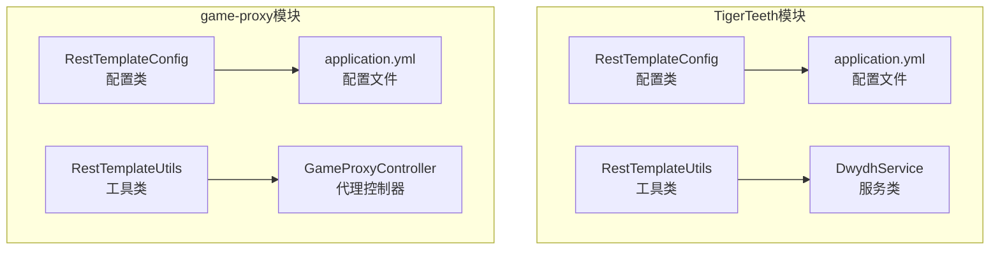
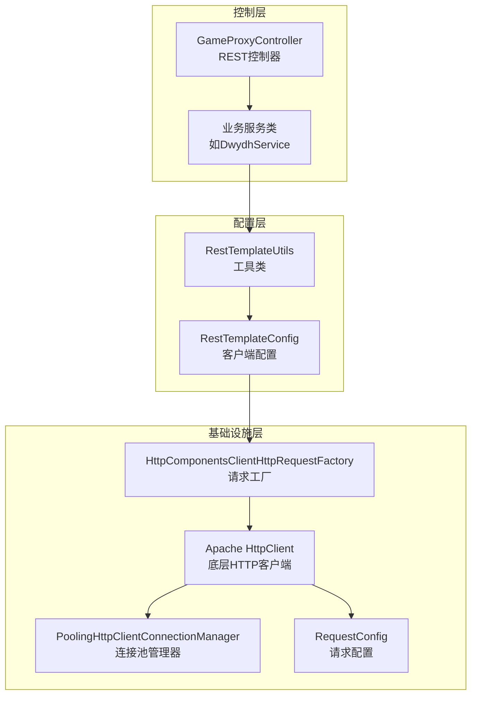
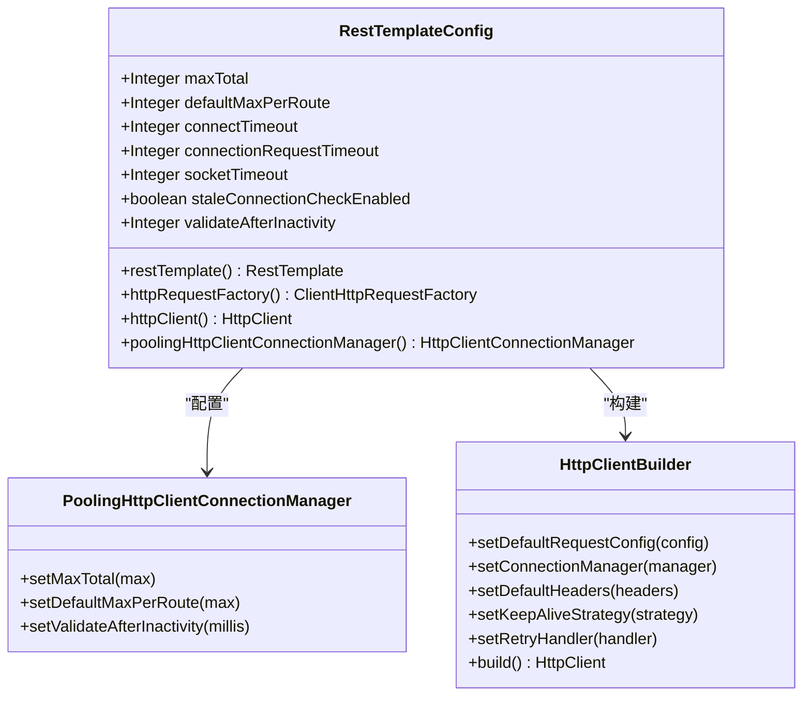
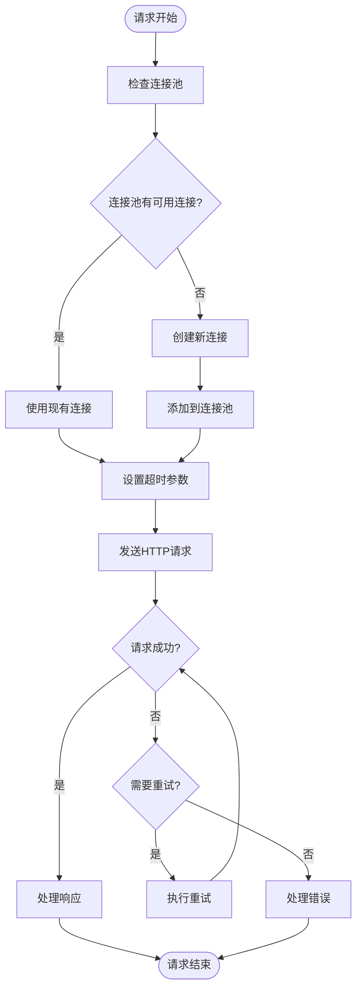
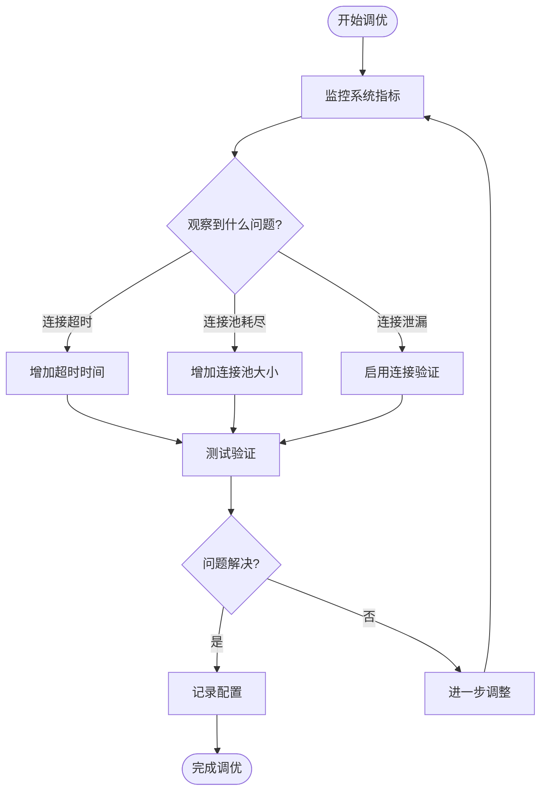
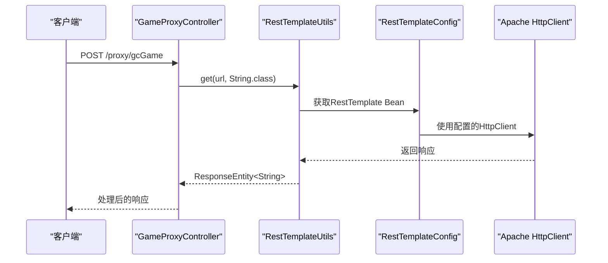
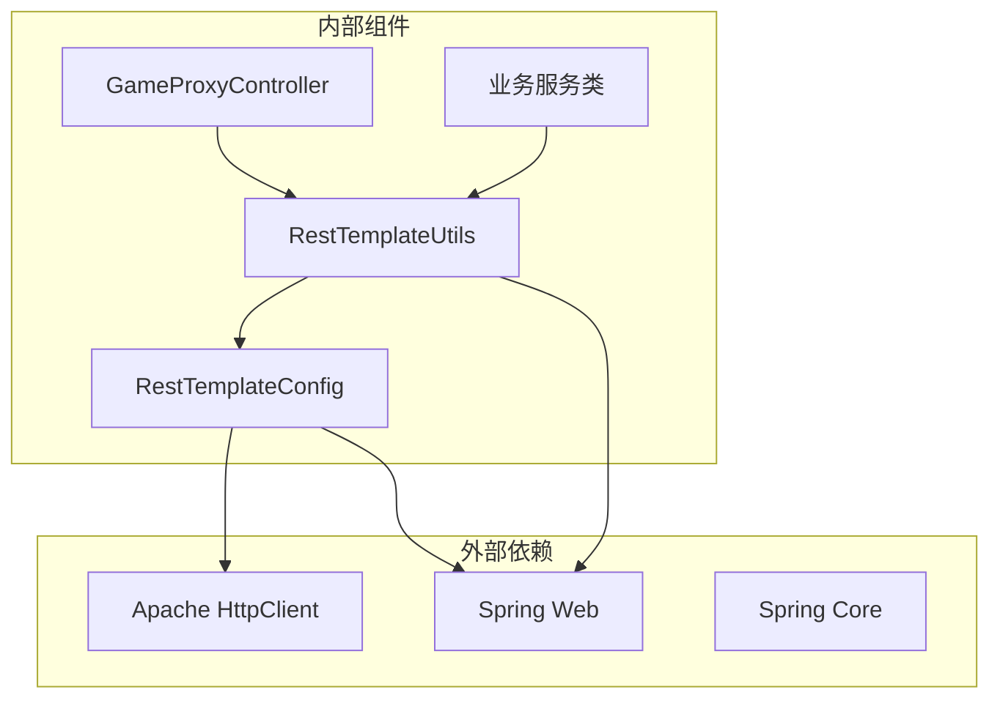
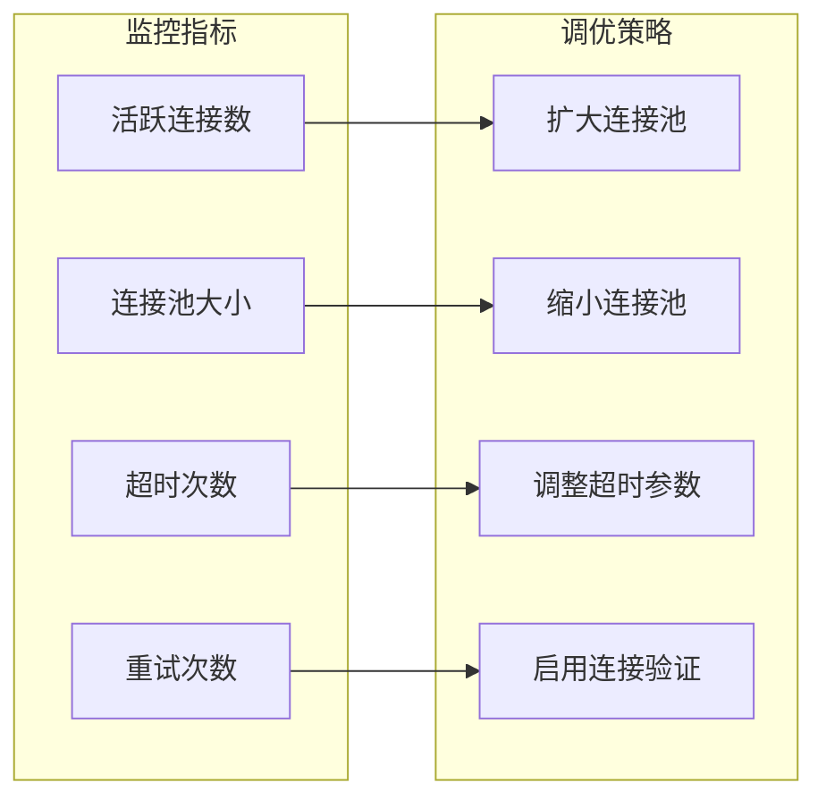

# RESTful API客户端配置

<cite>
**本文档引用的文件**
- [RestTemplateConfig.java](file://TigerTeeth/src/main/java/com/commom/RestTemplateConfig.java)
- [RestTemplateConfig.java](file://game-proxy/src/main/java/com/game/commom/RestTemplateConfig.java)
- [RestTemplateUtils.java](file://TigerTeeth/src/main/java/com/commom/RestTemplateUtils.java)
- [RestTemplateUtils.java](file://game-proxy/src/main/java/com/game/commom/RestTemplateUtils.java)
- [application.yml](file://TigerTeeth/src/main/resources/application.yml)
- [application.yml](file://game-proxy/src/main/resources/application.yml)
- [GameProxyController.java](file://game-proxy/src/main/java/com/game/controller/GameProxyController.java)
- [DwydhService.java](file://TigerTeeth/src/main/java/com/dwydh/DwydhService.java)
- [DomainNameUtil.java](file://TigerTeeth/src/main/java/com/utils/DomainNameUtil.java)
</cite>

## 目录
1. [简介](#简介)
2. [项目结构](#项目结构)
3. [核心组件](#核心组件)
4. [架构概览](#架构概览)
5. [详细组件分析](#详细组件分析)
6. [依赖关系分析](#依赖关系分析)
7. [性能考量](#性能考量)
8. [故障排除指南](#故障排除指南)
9. [结论](#结论)

## 简介
本文件为RESTful API客户端配置的技术文档，深入解析RestTemplateConfig类的配置机制，涵盖连接池管理、超时设置、重试策略和请求头配置。文档详细说明HttpComponentsClientHttpRequestFactory的实现原理与性能优化配置，阐述PoolingHttpClientConnectionManager的参数设置，解释RequestConfig的各项参数含义及调优方法，并提供具体的配置示例与最佳实践，包括生产环境推荐配置和性能调优建议。

## 项目结构
该项目采用多模块结构，包含多个游戏相关的子模块。RESTful API客户端配置主要集中在以下两个模块：
- TigerTeeth模块：包含基础的RestTemplate配置与工具类
- game-proxy模块：包含代理控制器与更完整的配置示例

**图表来源**
- [RestTemplateConfig.java](file://TigerTeeth/src/main/java/com/commom/RestTemplateConfig.java#L1-L132)
- [RestTemplateConfig.java](file://game-proxy/src/main/java/com/game/commom/RestTemplateConfig.java#L1-L132)
- [application.yml](file://TigerTeeth/src/main/resources/application.yml#L1-L31)

**章节来源**
- [RestTemplateConfig.java](file://TigerTeeth/src/main/java/com/commom/RestTemplateConfig.java#L1-L132)
- [RestTemplateConfig.java](file://game-proxy/src/main/java/com/game/commom/RestTemplateConfig.java#L1-L132)
- [application.yml](file://TigerTeeth/src/main/resources/application.yml#L1-L31)

## 核心组件
本项目的核心组件围绕Spring RestTemplate展开，通过自定义配置类实现高性能的HTTP客户端。

### RestTemplateConfig配置类
RestTemplateConfig是整个REST客户端配置的核心，负责：
- 定义全局的RestTemplate Bean
- 配置HttpComponentsClientHttpRequestFactory
- 构建Apache HttpClient实例
- 设置连接池管理器
- 配置请求超时参数
- 定义默认请求头

### RestTemplateUtils工具类
提供简化的REST客户端调用接口：
- 支持GET、POST、EXCHANGE三种基本HTTP方法
- 统一的响应处理机制
- 错误异常处理

**章节来源**
- [RestTemplateConfig.java](file://TigerTeeth/src/main/java/com/commom/RestTemplateConfig.java#L34-L131)
- [RestTemplateUtils.java](file://TigerTeeth/src/main/java/com/commom/RestTemplateUtils.java#L14-L30)

## 架构概览
系统采用分层架构设计，从上到下分别为控制层、服务层、配置层和基础设施层。

**图表来源**
- [GameProxyController.java](file://game-proxy/src/main/java/com/game/controller/GameProxyController.java#L36-L436)
- [RestTemplateConfig.java](file://game-proxy/src/main/java/com/game/commom/RestTemplateConfig.java#L62-L129)

## 详细组件分析

### RestTemplateConfig类深度解析

#### 连接池管理配置
RestTemplateConfig通过PoolingHttpClientConnectionManager实现高效的连接池管理：

**图表来源**
- [RestTemplateConfig.java](file://TigerTeeth/src/main/java/com/commom/RestTemplateConfig.java#L34-L129)

#### 超时设置详解
系统提供了多层次的超时配置：

| 参数名称 | 默认值 | 含义 | 影响范围 |
|---------|--------|------|----------|
| connectTimeout | 10000ms | 建立连接的超时时间 | TCP连接建立阶段 |
| connectionRequestTimeout | 500ms | 从连接池获取连接的超时时间 | 连接池资源分配 |
| socketTimeout | 30000ms | 数据传输的超时时间 | 读写操作完成 |

#### 重试策略配置
系统采用DefaultHttpRequestRetryHandler实现自动重试：
- 重试次数：2次
- 是否重试可重复请求：true
- 适用场景：网络瞬断、服务器临时不可用

#### 请求头配置
系统设置了标准化的HTTP请求头：
- User-Agent：模拟真实浏览器
- Accept-Encoding：支持gzip压缩
- Content-Type：application/json;charset=UTF-8
- Connection：Keep-Alive

**章节来源**
- [RestTemplateConfig.java](file://TigerTeeth/src/main/java/com/commom/RestTemplateConfig.java#L84-L107)
- [RestTemplateConfig.java](file://game-proxy/src/main/java/com/game/commom/RestTemplateConfig.java#L84-L107)

### HttpComponentsClientHttpRequestFactory实现原理

#### 工厂模式设计
HttpComponentsClientHttpRequestFactory作为Spring RestTemplate的请求工厂，实现了以下功能：
- 将Apache HttpClient集成到Spring框架
- 提供统一的HTTP请求抽象
- 支持连接池复用和超时管理

#### 性能优化配置

**图表来源**
- [RestTemplateConfig.java](file://TigerTeeth/src/main/java/com/commom/RestTemplateConfig.java#L74-L76)

**章节来源**
- [RestTemplateConfig.java](file://TigerTeeth/src/main/java/com/commom/RestTemplateConfig.java#L74-L76)

### PoolingHttpClientConnectionManager参数详解

#### 核心参数配置
- **maxTotal (100)**：连接池最大连接数
  - 生产环境建议：根据并发量和服务器承载能力调整
  - 过小会导致连接等待，过大可能导致服务器压力
- **defaultMaxPerRoute (20)**：每个路由的最大连接数
  - 用于限制特定域名的并发连接
  - 建议设置为maxTotal的10-20%

#### 连接验证策略
- **validateAfterInactivity (3000000ms)**：空闲连接验证间隔
- **staleConnectionCheckEnabled (true)**：启用陈旧连接检查
- 作用：防止长时间空闲导致的连接失效问题

**章节来源**
- [RestTemplateConfig.java](file://TigerTeeth/src/main/java/com/commom/RestTemplateConfig.java#L117-L129)
- [application.yml](file://TigerTeeth/src/main/resources/application.yml#L17-L30)

### RequestConfig参数调优方法

#### 参数含义与调优建议

| 参数 | 含义 | 调优建议 | 生产环境参考值 |
|------|------|----------|----------------|
| socketTimeout | 读写超时 | 根据业务响应时间设置 | 30000-60000ms |
| connectTimeout | 连接建立超时 | 网络环境较差时适当增大 | 10000-30000ms |
| connectionRequestTimeout | 获取连接超时 | 避免长时间阻塞 | 500-2000ms |
| staleConnectionCheckEnabled | 陈旧连接检查 | 高并发场景建议开启 | true |

#### 调优流程

**图表来源**
- [RestTemplateConfig.java](file://TigerTeeth/src/main/java/com/commom/RestTemplateConfig.java#L86-L91)

**章节来源**
- [RestTemplateConfig.java](file://TigerTeeth/src/main/java/com/commom/RestTemplateConfig.java#L86-L91)

### 实际使用示例

#### 控制器层使用
GameProxyController展示了如何在实际业务中使用RestTemplate：

**图表来源**
- [GameProxyController.java](file://game-proxy/src/main/java/com/game/controller/GameProxyController.java#L51-L58)
- [RestTemplateUtils.java](file://game-proxy/src/main/java/com/game/commom/RestTemplateUtils.java#L26-L29)

#### 服务层集成
DwydhService展示了异步任务中使用RestTemplate的方式：

**章节来源**
- [GameProxyController.java](file://game-proxy/src/main/java/com/game/controller/GameProxyController.java#L51-L58)
- [DwydhService.java](file://TigerTeeth/src/main/java/com/dwydh/DwydhService.java#L14-L38)

## 依赖关系分析

**图表来源**
- [RestTemplateConfig.java](file://TigerTeeth/src/main/java/com/commom/RestTemplateConfig.java#L1-L22)
- [RestTemplateUtils.java](file://TigerTeeth/src/main/java/com/commom/RestTemplateUtils.java#L1-L12)

**章节来源**
- [RestTemplateConfig.java](file://TigerTeeth/src/main/java/com/commom/RestTemplateConfig.java#L1-L22)
- [RestTemplateUtils.java](file://TigerTeeth/src/main/java/com/commom/RestTemplateUtils.java#L1-L12)

## 性能考量

### 连接池优化建议
1. **合理设置maxTotal**
   - 基于并发请求数量和服务器承载能力
   - 建议：CPU核心数 × 10 × 期望并发数

2. **路由级别限制**
   - defaultMaxPerRoute应小于maxTotal
   - 建议比例：1:5到1:10

3. **连接验证策略**
   - validateAfterInactivity设置为合理的空闲时间
   - staleConnectionCheckEnabled建议开启

### 超时参数调优
1. **socketTimeout设置**
   - 根据业务响应时间设置
   - 建议：业务平均响应时间 × 3

2. **connectTimeout设置**
   - 考虑网络延迟和DNS解析时间
   - 建议：10000-30000ms

3. **connectionRequestTimeout设置**
   - 避免长时间阻塞线程
   - 建议：500-2000ms

### 监控与调优

## 故障排除指南

### 常见问题与解决方案

#### 连接池耗尽
**现象**：请求超时或连接获取失败
**原因**：maxTotal设置过小
**解决方案**：
- 增大maxTotal值
- 优化业务逻辑减少并发
- 调整defaultMaxPerRoute

#### 连接泄漏
**现象**：连接池持续增长
**原因**：未正确关闭HTTP连接
**解决方案**：
- 确保正确使用RestTemplate
- 启用连接验证策略
- 监控连接池使用情况

#### 超时问题
**现象**：请求长时间无响应
**原因**：socketTimeout或connectTimeout设置不当
**解决方案**：
- 分析业务响应时间
- 适当增大超时时间
- 优化后端服务性能

#### 陈旧连接错误
**现象**：连接建立失败
**原因**：连接长时间空闲导致失效
**解决方案**：
- 启用staleConnectionCheckEnabled
- 调整validateAfterInactivity参数
- 定期清理无效连接

**章节来源**
- [RestTemplateConfig.java](file://TigerTeeth/src/main/java/com/commom/RestTemplateConfig.java#L50-L54)

## 结论

本RESTful API客户端配置方案通过精心设计的连接池管理和超时策略，为高并发场景提供了稳定可靠的HTTP客户端解决方案。核心优势包括：

1. **模块化设计**：RestTemplateConfig独立配置，便于维护和扩展
2. **性能优化**：合理的连接池参数和超时设置
3. **可靠性保障**：自动重试和连接验证机制
4. **易用性**：简化的工具类接口

建议在生产环境中根据实际业务负载进行参数调优，并建立完善的监控体系来确保系统的稳定运行。