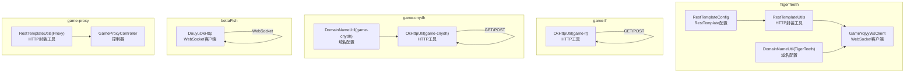
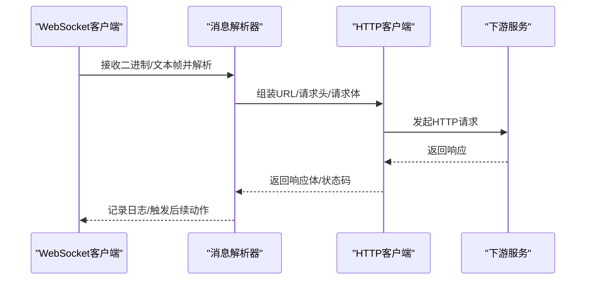
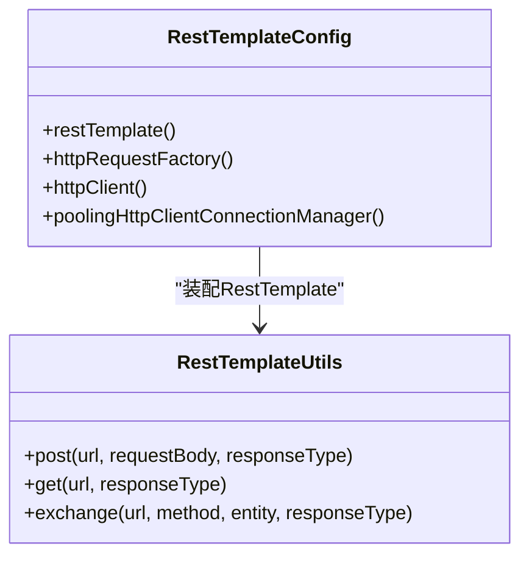
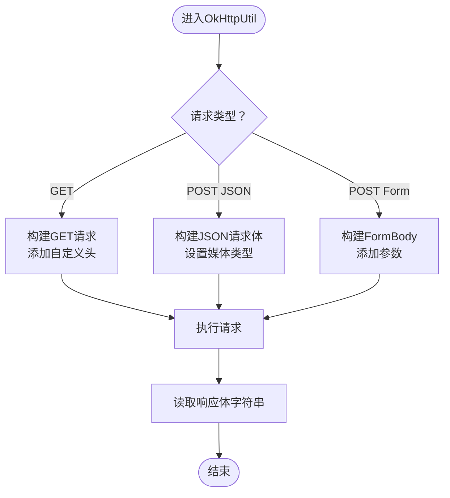
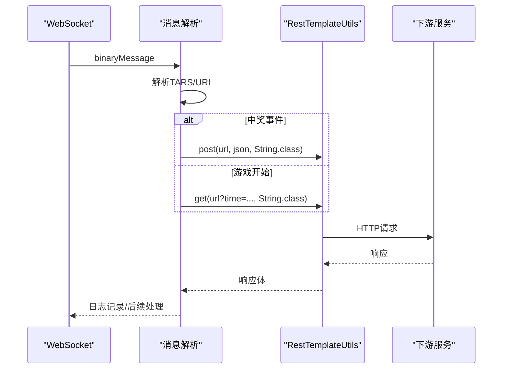
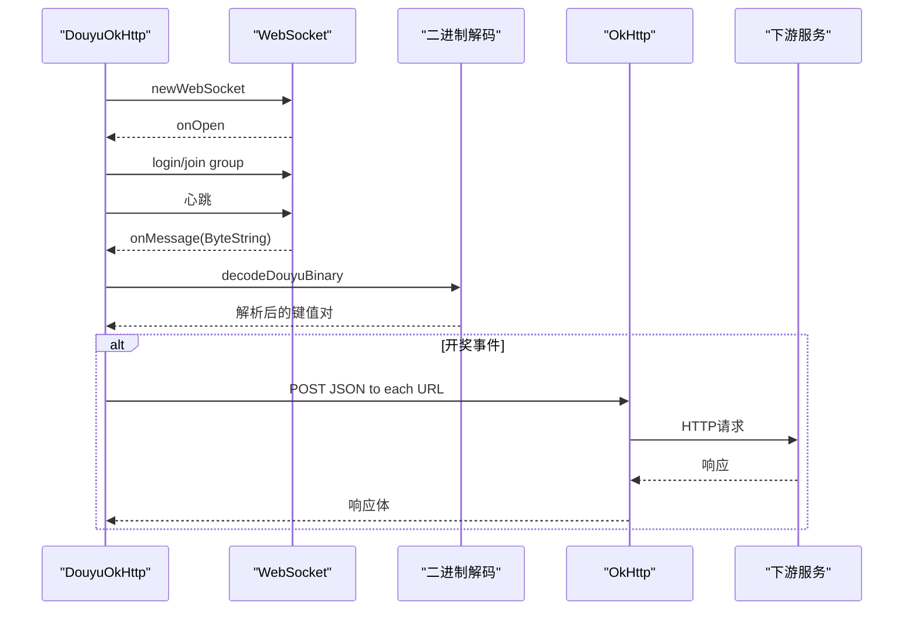
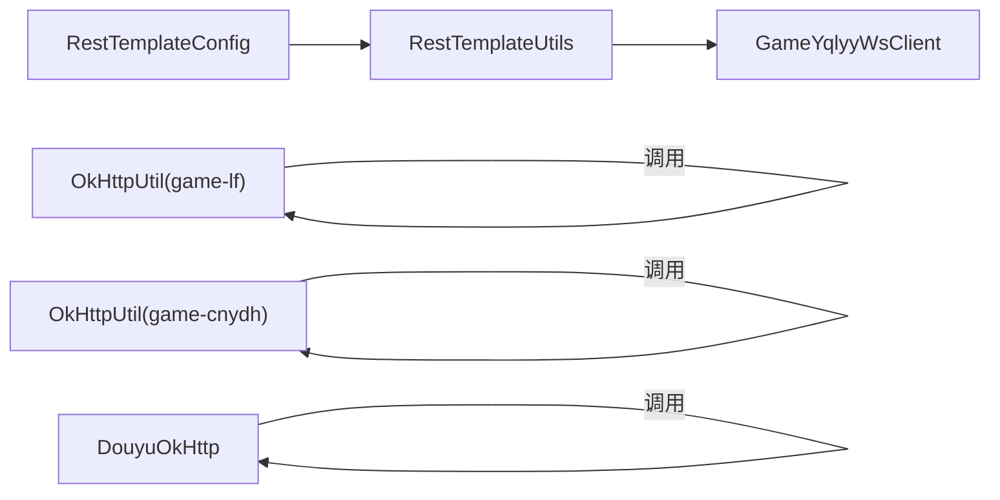

# 请求响应处理机制

<cite>
**本文引用的文件**
- [RestTemplateConfig.java](file://TigerTeeth/src/main/java/com/commom/RestTemplateConfig.java)
- [RestTemplateUtils.java](file://TigerTeeth/src/main/java/com/commom/RestTemplateUtils.java)
- [OkHttpUtil.java（game-lf）](file://game-lf/src/main/java/com/utils/OkHttpUtil.java)
- [OkHttpUtil.java（game-cnydh）](file://game-cnydh/src/main/java/com/utils/OkHttpUtil.java)
- [DouyuOkHttp.java](file://bettaFish/src/main/java/com/utils/DouyuOkHttp.java)
- [GameYqlyyWsClient.java](file://TigerTeeth/src/main/java/com/yqlyy/GameYqlyyWsClient.java)
- [DwydhService.java](file://TigerTeeth/src/main/java/com/dwydh/DwydhService.java)
- [DomainNameUtil.java（TigerTeeth）](file://TigerTeeth/src/main/java/com/utils/DomainNameUtil.java)
- [DomainNameUtil.java（game-cnydh）](file://game-cnydh/src/main/java/com/utils/DomainNameUtil.java)
- [application.yml](file://TigerTeeth/src/main/resources/application.yml)
</cite>

## 目录
1. [引言](#引言)
2. [项目结构](#项目结构)
3. [核心组件](#核心组件)
4. [架构总览](#架构总览)
5. [详细组件分析](#详细组件分析)
6. [依赖关系分析](#依赖关系分析)
7. [性能考量](#性能考量)
8. [故障排查指南](#故障排查指南)
9. [结论](#结论)
10. [附录](#附录)

## 引言
本技术文档围绕请求与响应处理机制展开，系统性梳理了两类主流HTTP客户端的实现与使用方式：基于Spring的RestTemplate与基于OkHttp的工具类。内容涵盖请求构建（URL组装、参数编码、请求头设置、请求体构造）、响应解析（状态码处理、响应体解析、异常转换）、不同客户端的差异与统一策略、JSON序列化与反序列化机制、以及错误处理最佳实践与调试技巧。目标是帮助开发者在多游戏场景下高效、稳定地完成HTTP通信。

## 项目结构
该项目由多个子模块组成，分别承载不同游戏或业务线的HTTP通信逻辑：
- TigerTeeth：包含RestTemplate配置与WebSocket客户端，负责与虎牙等游戏服务交互。
- game-lf：提供OkHttp通用工具类，支持GET/POST JSON/Form请求。
- game-cnydh：提供OkHttp通用工具类与域名配置，用于同步游戏时间等。
- bettaFish：提供OkHttp WebSocket客户端，用于斗鱼弹幕与开奖结果的实时推送。
- game-proxy：包含控制器与通用配置，提供代理与定时任务能力（与本文主题相关部分见“架构总览”与“详细组件分析”）。

图表来源
- [RestTemplateConfig.java](file://TigerTeeth/src/main/java/com/commom/RestTemplateConfig.java#L34-L131)
- [RestTemplateUtils.java](file://TigerTeeth/src/main/java/com/commom/RestTemplateUtils.java#L14-L30)
- [GameYqlyyWsClient.java](file://TigerTeeth/src/main/java/com/yqlyy/GameYqlyyWsClient.java#L30-L327)
- [OkHttpUtil.java（game-lf）](file://game-lf/src/main/java/com/utils/OkHttpUtil.java#L8-L73)
- [OkHttpUtil.java（game-cnydh）](file://game-cnydh/src/main/java/com/utils/OkHttpUtil.java#L8-L73)
- [DouyuOkHttp.java](file://bettaFish/src/main/java/com/utils/DouyuOkHttp.java#L17-L281)
- [DomainNameUtil.java（TigerTeeth）](file://TigerTeeth/src/main/java/com/utils/DomainNameUtil.java#L3-L15)
- [DomainNameUtil.java（game-cnydh）](file://game-cnydh/src/main/java/com/utils/DomainNameUtil.java#L3-L11)

章节来源
- [application.yml](file://TigerTeeth/src/main/resources/application.yml#L16-L30)

## 核心组件
- RestTemplate配置与工厂
  - 通过RestTemplateConfig集中配置连接池、超时、默认请求头与重试策略，确保HTTP客户端具备高并发与稳定性。
  - RestTemplateUtils对RestTemplate进行轻量封装，提供GET/POST/exchange等常用方法，便于业务层统一调用。
- OkHttp工具类
  - 在game-lf与game-cnydh中提供静态工具方法，支持GET/POST JSON/Form请求，统一设置超时与媒体类型。
- WebSocket客户端
  - GameYqlyyWsClient通过WebSocket接收游戏事件，解析二进制帧后，按业务URI分发并调用HTTP接口同步开奖结果或时间。
  - bettaFish的DouyuOkHttp通过WebSocket订阅弹幕与开奖结果，解析后以HTTP POST同步至下游服务。
- 域名与中转配置
  - DomainNameUtil提供上游/中转域名数组，便于批量同步与灰度切换。

章节来源
- [RestTemplateConfig.java](file://TigerTeeth/src/main/java/com/commom/RestTemplateConfig.java#L34-L131)
- [RestTemplateUtils.java](file://TigerTeeth/src/main/java/com/commom/RestTemplateUtils.java#L14-L30)
- [OkHttpUtil.java（game-lf）](file://game-lf/src/main/java/com/utils/OkHttpUtil.java#L8-L73)
- [OkHttpUtil.java（game-cnydh）](file://game-cnydh/src/main/java/com/utils/OkHttpUtil.java#L8-L73)
- [GameYqlyyWsClient.java](file://TigerTeeth/src/main/java/com/yqlyy/GameYqlyyWsClient.java#L30-L327)
- [DouyuOkHttp.java](file://bettaFish/src/main/java/com/utils/DouyuOkHttp.java#L17-L281)
- [DomainNameUtil.java（TigerTeeth）](file://TigerTeeth/src/main/java/com/utils/DomainNameUtil.java#L3-L15)
- [DomainNameUtil.java（game-cnydh）](file://game-cnydh/src/main/java/com/utils/DomainNameUtil.java#L3-L11)

## 架构总览
下图展示了从WebSocket接收消息到HTTP同步的整体流程，以及两种HTTP客户端的使用位置与职责边界。

图表来源
- [GameYqlyyWsClient.java](file://TigerTeeth/src/main/java/com/yqlyy/GameYqlyyWsClient.java#L52-L219)
- [DouyuOkHttp.java](file://bettaFish/src/main/java/com/utils/DouyuOkHttp.java#L43-L166)
- [RestTemplateUtils.java](file://TigerTeeth/src/main/java/com/commom/RestTemplateUtils.java#L19-L29)
- [OkHttpUtil.java（game-lf）](file://game-lf/src/main/java/com/utils/OkHttpUtil.java#L23-L51)

## 详细组件分析

### RestTemplate配置与统一调用
- 配置要点
  - 连接池：最大总连接、每路由并发、空闲校验与重用阈值。
  - 超时：连接超时、连接池获取超时、Socket超时。
  - 默认请求头：User-Agent、Accept-Encoding、Accept-Language、Keep-Alive、Content-Type等。
  - 重试策略：启用默认重试处理器，提升弱网环境下的成功率。
- 统一调用
  - RestTemplateUtils提供泛型返回值的GET/POST/exchange方法，简化业务层调用。

图表来源
- [RestTemplateConfig.java](file://TigerTeeth/src/main/java/com/commom/RestTemplateConfig.java#L62-L129)
- [RestTemplateUtils.java](file://TigerTeeth/src/main/java/com/commom/RestTemplateUtils.java#L14-L30)

章节来源
- [RestTemplateConfig.java](file://TigerTeeth/src/main/java/com/commom/RestTemplateConfig.java#L34-L131)
- [RestTemplateUtils.java](file://TigerTeeth/src/main/java/com/commom/RestTemplateUtils.java#L14-L30)
- [application.yml](file://TigerTeeth/src/main/resources/application.yml#L16-L30)

### OkHttp工具类（game-lf）
- 支持GET/POST JSON/POST Form四种典型场景
- 统一设置连接、读写超时
- JSON请求体使用application/json; charset=utf-8媒体类型
- Form表单使用FormBody自动编码

图表来源
- [OkHttpUtil.java（game-lf）](file://game-lf/src/main/java/com/utils/OkHttpUtil.java#L23-L72)

章节来源
- [OkHttpUtil.java（game-lf）](file://game-lf/src/main/java/com/utils/OkHttpUtil.java#L8-L73)

### OkHttp工具类（game-cnydh）
- 与game-lf一致的超时与媒体类型策略
- 提供域名常量，便于集中管理上游地址

章节来源
- [OkHttpUtil.java（game-cnydh）](file://game-cnydh/src/main/java/com/utils/OkHttpUtil.java#L8-L73)
- [DomainNameUtil.java（game-cnydh）](file://game-cnydh/src/main/java/com/utils/DomainNameUtil.java#L3-L11)

### WebSocket客户端（虎牙）
- 接收二进制帧，解析TARS协议，根据iUri区分业务事件
- 中奖事件：构造JSON数组，遍历域名列表，使用RestTemplateUtils POST同步
- 游戏开始事件：拼接查询参数，使用RestTemplateUtils GET同步时间

图表来源
- [GameYqlyyWsClient.java](file://TigerTeeth/src/main/java/com/yqlyy/GameYqlyyWsClient.java#L52-L219)
- [RestTemplateUtils.java](file://TigerTeeth/src/main/java/com/commom/RestTemplateUtils.java#L19-L29)
- [DomainNameUtil.java（TigerTeeth）](file://TigerTeeth/src/main/java/com/utils/DomainNameUtil.java#L3-L15)

章节来源
- [GameYqlyyWsClient.java](file://TigerTeeth/src/main/java/com/yqlyy/GameYqlyyWsClient.java#L30-L327)
- [RestTemplateUtils.java](file://TigerTeeth/src/main/java/com/commom/RestTemplateUtils.java#L14-L30)
- [DomainNameUtil.java（TigerTeeth）](file://TigerTeeth/src/main/java/com/utils/DomainNameUtil.java#L3-L15)

### WebSocket客户端（斗鱼）
- 建立WebSocket连接，登录与加入分组
- 心跳保活，解析二进制消息，识别开奖结果
- 使用OkHttp逐个域名POST JSON同步

图表来源
- [DouyuOkHttp.java](file://bettaFish/src/main/java/com/utils/DouyuOkHttp.java#L43-L166)
- [DouyuOkHttp.java](file://bettaFish/src/main/java/com/utils/DouyuOkHttp.java#L205-L275)

章节来源
- [DouyuOkHttp.java](file://bettaFish/src/main/java/com/utils/DouyuOkHttp.java#L17-L281)

### JSON序列化与反序列化机制
- 虎牙WebSocket侧
  - 使用第三方JSON库（如Hutool）将对象序列化为JSON字符串，再通过HTTP发送。
  - 业务层直接传入JSON字符串，避免额外的Jackson/Gson配置。
- 斗鱼WebSocket侧
  - 使用FastJSON2将开奖号等字段封装为JSON对象，再POST到下游。
- RestTemplate侧
  - 通过HttpEntity携带JSON字符串作为请求体，由RestTemplate自动设置Content-Type为application/json。
- OkHttp侧
  - 显式设置MediaType为application/json; charset=utf-8，确保下游正确解析。

章节来源
- [GameYqlyyWsClient.java](file://TigerTeeth/src/main/java/com/yqlyy/GameYqlyyWsClient.java#L95-L114)
- [DouyuOkHttp.java](file://bettaFish/src/main/java/com/utils/DouyuOkHttp.java#L112-L143)
- [RestTemplateConfig.java](file://TigerTeeth/src/main/java/com/commom/RestTemplateConfig.java#L94-L106)
- [OkHttpUtil.java（game-lf）](file://game-lf/src/main/java/com/utils/OkHttpUtil.java#L40-L51)

### 请求构建与参数编码
- URL组装
  - 虎牙：在业务逻辑中拼接查询参数（如时间同步），或直接拼接路径（如开奖结果）。
  - 斗鱼：固定WebSocket地址，HTTP请求独立构建。
- 参数编码
  - Form表单：OkHttpUtil使用FormBody自动编码。
  - JSON：显式设置媒体类型；RestTemplate使用默认Content-Type。
- 请求头设置
  - RestTemplate：统一设置Content-Type、User-Agent等默认头。
  - OkHttp：显式设置媒体类型与自定义头。
- 请求体构造
  - RestTemplate：传入JSON字符串或对象，由底层框架处理。
  - OkHttp：使用RequestBody.create创建JSON或FormBody。

章节来源
- [GameYqlyyWsClient.java](file://TigerTeeth/src/main/java/com/yqlyy/GameYqlyyWsClient.java#L103-L147)
- [OkHttpUtil.java（game-lf）](file://game-lf/src/main/java/com/utils/OkHttpUtil.java#L23-L72)
- [RestTemplateConfig.java](file://TigerTeeth/src/main/java/com/commom/RestTemplateConfig.java#L94-L106)

### 响应解析与异常转换
- 状态码处理
  - 斗鱼：显式判断response.isSuccessful()，非成功状态记录日志并继续下一个域名。
  - OkHttp工具类：直接读取响应体字符串，未做显式的HTTP状态码分支。
  - RestTemplate：通过ResponseEntity封装响应，业务层可读取状态码与响应体。
- 响应体解析
  - 斗鱼：读取response.body().string()，记录日志。
  - OkHttp工具类：读取response.body().string()。
  - RestTemplate：通过泛型返回值自动映射。
- 异常转换
  - 斗鱼：捕获异常并记录，继续循环其他域名。
  - 虎牙：捕获RestClientException与通用异常，记录日志并继续。
  - OkHttp工具类：直接抛出IOException，由调用方处理。

章节来源
- [DouyuOkHttp.java](file://bettaFish/src/main/java/com/utils/DouyuOkHttp.java#L129-L143)
- [GameYqlyyWsClient.java](file://TigerTeeth/src/main/java/com/yqlyy/GameYqlyyWsClient.java#L109-L114)
- [RestTemplateUtils.java](file://TigerTeeth/src/main/java/com/commom/RestTemplateUtils.java#L19-L29)

### 不同HTTP客户端的差异与统一策略
- 差异点
  - RestTemplate：基于Apache HttpClient，具备连接池、默认头、重试策略；适合Spring生态集成。
  - OkHttp：更轻量，超时与媒体类型需显式设置；适合简单场景与高性能需求。
- 统一策略
  - 统一超时配置：在各自静态块中设置连接/读/写超时。
  - 统一媒体类型：JSON请求均设置application/json; charset=utf-8。
  - 统一域名管理：通过DomainNameUtil集中维护上游/中转域名。
  - 统一异常处理：捕获并记录异常，必要时进行重试或降级。

章节来源
- [RestTemplateConfig.java](file://TigerTeeth/src/main/java/com/commom/RestTemplateConfig.java#L84-L107)
- [OkHttpUtil.java（game-lf）](file://game-lf/src/main/java/com/utils/OkHttpUtil.java#L12-L18)
- [OkHttpUtil.java（game-cnydh）](file://game-cnydh/src/main/java/com/utils/OkHttpUtil.java#L12-L18)
- [DomainNameUtil.java（TigerTeeth）](file://TigerTeeth/src/main/java/com/utils/DomainNameUtil.java#L3-L15)
- [DomainNameUtil.java（game-cnydh）](file://game-cnydh/src/main/java/com/utils/DomainNameUtil.java#L3-L11)

## 依赖关系分析
- 组件耦合
  - RestTemplateConfig与RestTemplateUtils强耦合，前者提供客户端，后者提供调用入口。
  - WebSocket客户端依赖RestTemplateUtils进行HTTP同步。
  - OkHttp工具类独立于Spring容器，适合跨模块复用。
- 外部依赖
  - Apache HttpClient（RestTemplate底层）
  - OkHttp（独立HTTP客户端）
  - WebSocket容器（TigerTeeth）

图表来源
- [RestTemplateConfig.java](file://TigerTeeth/src/main/java/com/commom/RestTemplateConfig.java#L62-L129)
- [RestTemplateUtils.java](file://TigerTeeth/src/main/java/com/commom/RestTemplateUtils.java#L14-L30)
- [GameYqlyyWsClient.java](file://TigerTeeth/src/main/java/com/yqlyy/GameYqlyyWsClient.java#L30-L327)
- [OkHttpUtil.java（game-lf）](file://game-lf/src/main/java/com/utils/OkHttpUtil.java#L8-L73)
- [OkHttpUtil.java（game-cnydh）](file://game-cnydh/src/main/java/com/utils/OkHttpUtil.java#L8-L73)
- [DouyuOkHttp.java](file://bettaFish/src/main/java/com/utils/DouyuOkHttp.java#L17-L281)

章节来源
- [DwydhService.java](file://TigerTeeth/src/main/java/com/dwydh/DwydhService.java#L12-L38)

## 性能考量
- 连接池与超时
  - 合理设置maxTotal、defaultMaxPerRoute、connectTimeout、socketTimeout，避免阻塞与资源耗尽。
  - staleConnectionCheckEnabled与validateAfterInactivity有助于复用健康连接。
- 压测建议
  - 对高频接口进行并发压测，观察连接池占用与失败率。
  - 对WebSocket长链与HTTP短链分别评估吞吐与延迟。
- 传输优化
  - 优先使用压缩（如GZIP）与Keep-Alive减少握手开销。
  - 控制请求体大小，避免超大JSON导致内存压力。

章节来源
- [application.yml](file://TigerTeeth/src/main/resources/application.yml#L16-L30)
- [RestTemplateConfig.java](file://TigerTeeth/src/main/java/com/commom/RestTemplateConfig.java#L117-L129)

## 故障排查指南
- 网络异常
  - 检查connectTimeout与socketTimeout是否过短；观察连接池是否耗尽。
  - 斗鱼场景中，若单域名失败，继续循环其他域名，确认是否存在部分可用性。
- 业务异常
  - 虎牙场景中，捕获RestClientException并记录URL与异常信息，定位具体下游服务。
  - 斗鱼场景中，捕获异常并记录，避免中断整个同步流程。
- 超时异常
  - 调整OkHttp与RestTemplate的超时配置，结合业务重试策略。
- 调试技巧
  - 打印请求URL、请求头与请求体（注意敏感信息脱敏）。
  - 记录响应状态码与响应体，便于快速定位问题。
  - 对WebSocket事件进行分段日志输出，区分登录、心跳、开奖结果等阶段。

章节来源
- [DouyuOkHttp.java](file://bettaFish/src/main/java/com/utils/DouyuOkHttp.java#L129-L143)
- [GameYqlyyWsClient.java](file://TigerTeeth/src/main/java/com/yqlyy/GameYqlyyWsClient.java#L109-L114)

## 结论
本项目通过RestTemplate与OkHttp两类HTTP客户端实现了稳定的请求响应处理机制。RestTemplate侧重于Spring生态与连接池管理，OkHttp侧重于简洁与高性能。配合统一的超时、媒体类型与域名管理策略，以及完善的异常处理与日志记录，能够在多游戏场景下可靠地完成数据同步与事件推送。建议在生产环境中持续监控连接池使用情况与响应延迟，结合业务特性优化超时与重试策略。

## 附录
- 关键配置项参考
  - 连接池与超时：maxTotal、defaultMaxPerRoute、connectTimeout、connectionRequestTimeout、socketTimeout、staleConnectionCheckEnabled、validateAfterInactivity
- 常见问题速查
  - 响应体为空：确认下游服务是否返回空体或异常；检查Content-Type是否匹配。
  - 跨域问题：OkHttp不涉及浏览器跨域，但服务端需正确配置CORS。
  - 字符集问题：统一使用UTF-8，确保JSON与表单编码一致。

章节来源
- [application.yml](file://TigerTeeth/src/main/resources/application.yml#L16-L30)