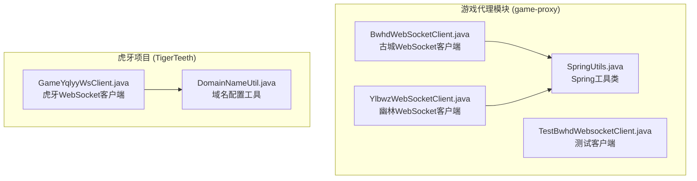
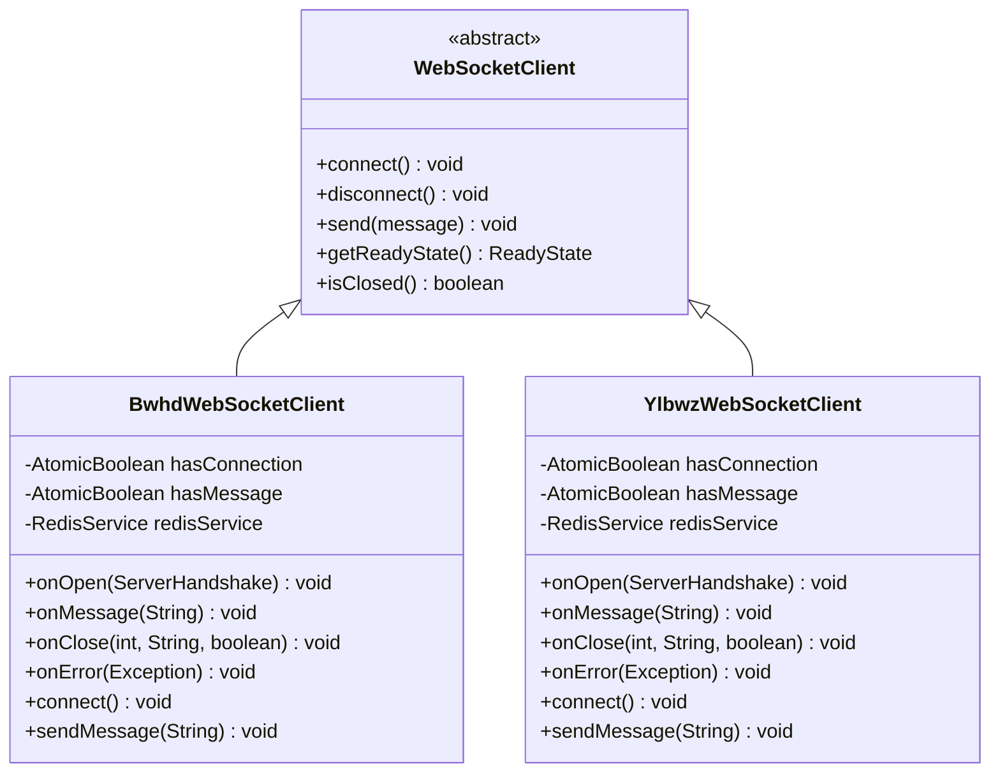
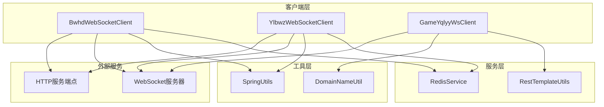
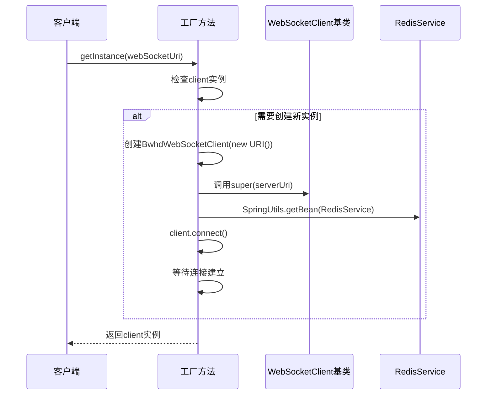
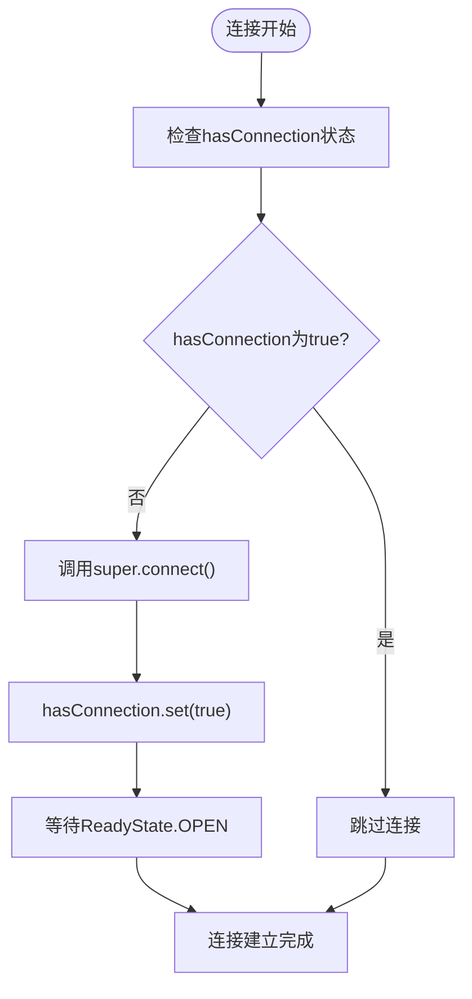
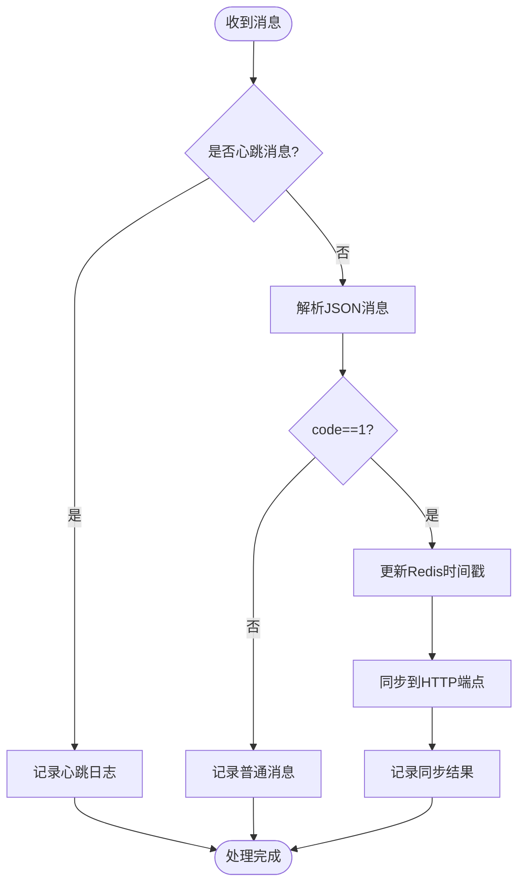
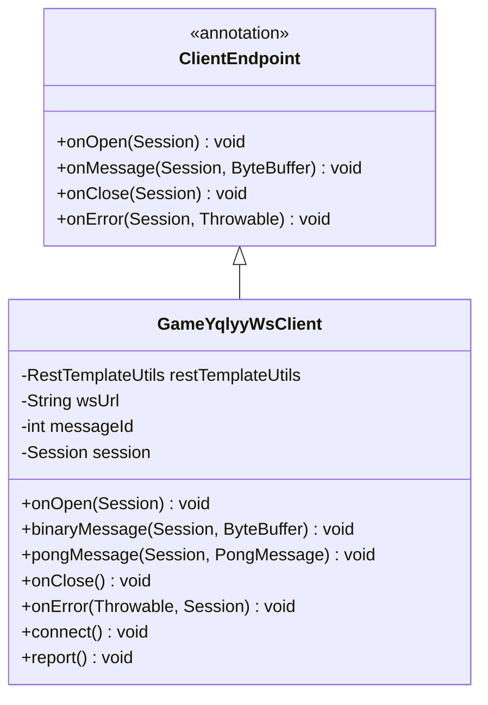
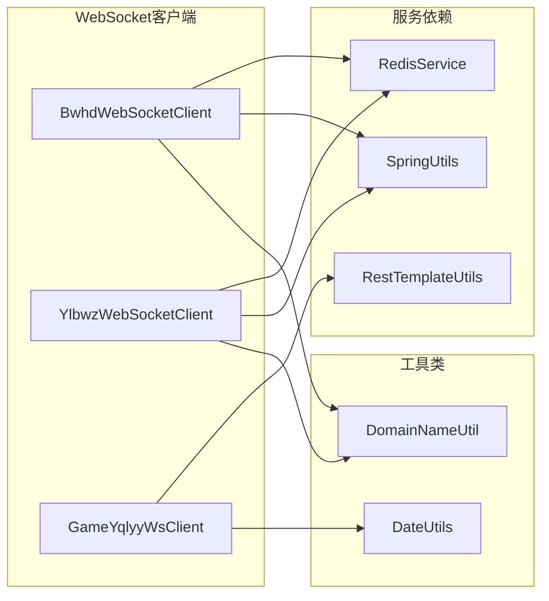

# WebSocket客户端实现

<cite>
**本文档引用的文件**
- [BwhdWebSocketClient.java](file://game-proxy/src/main/java/com/game/gcbwz/BwhdWebSocketClient.java)
- [YlbwzWebSocketClient.java](file://game-proxy/src/main/java/com/game/ylbwz/YlbwzWebSocketClient.java)
- [GameYqlyyWsClient.java](file://TigerTeeth/src/main/java/com/yqlyy/GameYqlyyWsClient.java)
- [SpringUtils.java](file://game-proxy/src/main/java/com/game/utils/SpringUtils.java)
- [DomainNameUtil.java](file://TigerTeeth/src/main/java/com/utils/DomainNameUtil.java)
- [TestBwhdWebsocketClient.java](file://game-proxy/src/main/java/com/game/gcbwz/TestBwhdWebsocketClient.java)
</cite>

## 目录
1. [简介](#简介)
2. [项目结构](#项目结构)
3. [核心组件](#核心组件)
4. [架构概览](#架构概览)
5. [详细组件分析](#详细组件分析)
6. [依赖关系分析](#依赖关系分析)
7. [性能考虑](#性能考虑)
8. [故障排除指南](#故障排除指南)
9. [结论](#结论)

## 简介

本文档深入分析了基于Java-WebSocket库的WebSocket客户端实现，重点介绍了两个核心WebSocket客户端类的设计与实现原理。这些客户端用于与WebSocket服务器建立实时通信连接，处理异步消息传递，并实现线程安全的状态管理。

系统采用工厂模式和单例模式相结合的方式，通过静态工厂方法提供客户端实例，确保连接状态的一致性和线程安全性。客户端继承自org.java_websocket.client.WebSocketClient类，重写了关键的回调方法来处理连接建立、消息接收、连接关闭和错误处理等场景。

## 项目结构

该项目采用模块化的项目结构，主要包含以下关键目录：

**图表来源**
- [BwhdWebSocketClient.java](file://game-proxy/src/main/java/com/game/gcbwz/BwhdWebSocketClient.java#L1-L192)
- [YlbwzWebSocketClient.java](file://game-proxy/src/main/java/com/game/ylbwz/YlbwzWebSocketClient.java#L1-L193)
- [GameYqlyyWsClient.java](file://TigerTeeth/src/main/java/com/yqlyy/GameYqlyyWsClient.java#L1-L328)

**章节来源**
- [BwhdWebSocketClient.java](file://game-proxy/src/main/java/com/game/gcbwz/BwhdWebSocketClient.java#L1-L50)
- [YlbwzWebSocketClient.java](file://game-proxy/src/main/java/com/game/ylbwz/YlbwzWebSocketClient.java#L1-L50)

## 核心组件

### WebSocket客户端基类继承关系

所有自定义WebSocket客户端都继承自org.java_websocket.client.WebSocketClient类，该基类提供了WebSocket连接的核心功能：

**图表来源**
- [BwhdWebSocketClient.java](file://game-proxy/src/main/java/com/game/gcbwz/BwhdWebSocketClient.java#L27-L56)
- [YlbwzWebSocketClient.java](file://game-proxy/src/main/java/com/game/ylbwz/YlbwzWebSocketClient.java#L29-L58)

### 线程安全状态管理

两个客户端都使用AtomicBoolean变量来确保连接状态的线程安全：

- `hasConnection`: 标识客户端是否已建立连接
- `hasMessage`: 标识是否有新消息到达

这种设计避免了多线程环境下状态检查和更新的竞态条件问题。

**章节来源**
- [BwhdWebSocketClient.java](file://game-proxy/src/main/java/com/game/gcbwz/BwhdWebSocketClient.java#L44-L44)
- [YlbwzWebSocketClient.java](file://game-proxy/src/main/java/com/game/ylbwz/YlbwzWebSocketClient.java#L48-L48)

## 架构概览

系统采用分层架构设计，各组件职责明确：

**图表来源**
- [BwhdWebSocketClient.java](file://game-proxy/src/main/java/com/game/gcbwz/BwhdWebSocketClient.java#L34-L34)
- [YlbwzWebSocketClient.java](file://game-proxy/src/main/java/com/game/ylbwz/YlbwzWebSocketClient.java#L38-L38)
- [GameYqlyyWsClient.java](file://TigerTeeth/src/main/java/com/yqlyy/GameYqlyyWsClient.java#L32-L32)

## 详细组件分析

### BwhdWebSocketClient 分析

#### 初始化过程

BwhdWebSocketClient的初始化过程体现了完整的生命周期管理：

**图表来源**
- [BwhdWebSocketClient.java](file://game-proxy/src/main/java/com/game/gcbwz/BwhdWebSocketClient.java#L153-L172)

#### 回调方法实现

每个回调方法都有特定的业务逻辑：

**onOpen回调**：
- 记录连接建立的日志
- 准备接收服务器消息

**onMessage回调**：
- 设置hasMessage标志位
- 解析JSON消息内容
- 处理开奖消息（code=1）
- 更新Redis缓存时间戳
- 同步消息到多个HTTP端点

**onClose回调**：
- 清理连接状态
- 重置消息标志位

**onError回调**：
- 记录异常信息

**章节来源**
- [BwhdWebSocketClient.java](file://game-proxy/src/main/java/com/game/gcbwz/BwhdWebSocketClient.java#L64-L131)

### YlbwzWebSocketClient 分析

#### 连接参数设置

YlbwzWebSocketClient展示了更复杂的连接参数配置：

**图表来源**
- [YlbwzWebSocketClient.java](file://game-proxy/src/main/java/com/game/ylbwz/YlbwzWebSocketClient.java#L141-L146)

#### 消息处理流程

消息处理采用了条件判断和业务逻辑分离：

**图表来源**
- [YlbwzWebSocketClient.java](file://game-proxy/src/main/java/com/game/ylbwz/YlbwzWebSocketClient.java#L77-L105)

**章节来源**
- [YlbwzWebSocketClient.java](file://game-proxy/src/main/java/com/game/ylbwz/YlbwzWebSocketClient.java#L76-L138)

### GameYqlyyWsClient 分析

#### 不同实现方式

GameYqlyyWsClient展示了另一种WebSocket实现方式，使用javax.websocket.ClientEndpoint注解：

**图表来源**
- [GameYqlyyWsClient.java](file://TigerTeeth/src/main/java/com/yqlyy/GameYqlyyWsClient.java#L29-L44)

**章节来源**
- [GameYqlyyWsClient.java](file://TigerTeeth/src/main/java/com/yqlyy/GameYqlyyWsClient.java#L221-L272)

## 依赖关系分析

### 组件耦合度分析

**图表来源**
- [BwhdWebSocketClient.java](file://game-proxy/src/main/java/com/game/gcbwz/BwhdWebSocketClient.java#L3-L11)
- [YlbwzWebSocketClient.java](file://game-proxy/src/main/java/com/game/ylbwz/YlbwzWebSocketClient.java#L3-L11)

### 外部依赖关系

系统依赖的关键外部库包括：

- **org.java_websocket**: 提供WebSocket协议支持
- **Spring Framework**: 提供依赖注入和AOP功能
- **FastJSON**: 提供JSON解析功能
- **Hutool**: 提供HTTP请求和工具函数

**章节来源**
- [BwhdWebSocketClient.java](file://game-proxy/src/main/java/com/game/gcbwz/BwhdWebSocketClient.java#L3-L17)
- [YlbwzWebSocketClient.java](file://game-proxy/src/main/java/com/game/ylbwz/YlbwzWebSocketClient.java#L3-L18)

## 性能考虑

### 线程安全优化

1. **AtomicBoolean使用**: 避免了synchronized关键字带来的性能开销
2. **无阻塞状态检查**: 原子操作比锁机制更高效
3. **连接复用**: 单例模式减少连接建立的开销

### 内存管理

1. **消息缓冲区**: 使用String类型存储消息，便于垃圾回收
2. **连接池**: 复用WebSocket连接，减少资源消耗
3. **异步处理**: 非阻塞的消息处理机制

### 网络性能

1. **心跳机制**: 定期发送心跳包保持连接活跃
2. **批量同步**: 将消息同步到多个端点提高效率
3. **超时控制**: 合理设置连接和读取超时时间

## 故障排除指南

### 常见问题及解决方案

#### 连接失败问题

**症状**: 客户端无法连接到WebSocket服务器

**可能原因**:
1. WebSocket服务器地址配置错误
2. 网络连接不稳定
3. 服务器端口被防火墙阻止

**解决方法**:
- 验证WebSocket URI格式
- 检查网络连通性
- 确认服务器端口开放

#### 消息丢失问题

**症状**: 客户端接收不到服务器推送的消息

**可能原因**:
1. 心跳包未正确处理
2. 连接意外断开
3. 消息解析错误

**解决方法**:
- 实现心跳包处理逻辑
- 添加连接重试机制
- 增强消息解析容错性

#### 内存泄漏问题

**症状**: 应用程序内存持续增长

**可能原因**:
1. WebSocket连接未正确关闭
2. 消息缓冲区未及时清理
3. 静态引用导致对象无法回收

**解决方法**:
- 实现连接清理逻辑
- 及时清理消息缓冲区
- 避免不必要的静态引用

**章节来源**
- [BwhdWebSocketClient.java](file://game-proxy/src/main/java/com/game/gcbwz/BwhdWebSocketClient.java#L117-L131)
- [YlbwzWebSocketClient.java](file://game-proxy/src/main/java/com/game/ylbwz/YlbwzWebSocketClient.java#L124-L138)

## 结论

本WebSocket客户端实现展现了现代Java WebSocket开发的最佳实践：

1. **架构设计**: 采用继承模式，充分利用基类功能，同时提供业务定制能力
2. **线程安全**: 使用AtomicBoolean确保状态管理的原子性和一致性
3. **生命周期管理**: 通过工厂方法和单例模式实现连接的统一管理
4. **异常处理**: 完善的回调机制处理各种异常情况
5. **性能优化**: 原子操作、异步处理和连接复用提升系统性能

这些客户端为实时消息推送、游戏状态同步和数据传输提供了可靠的技术基础，可以作为其他WebSocket项目的参考实现。