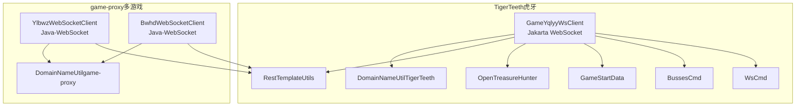
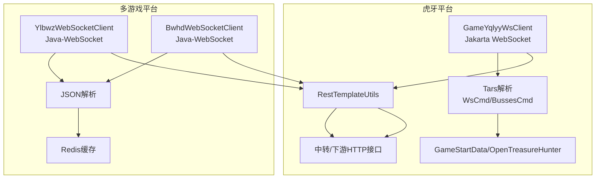
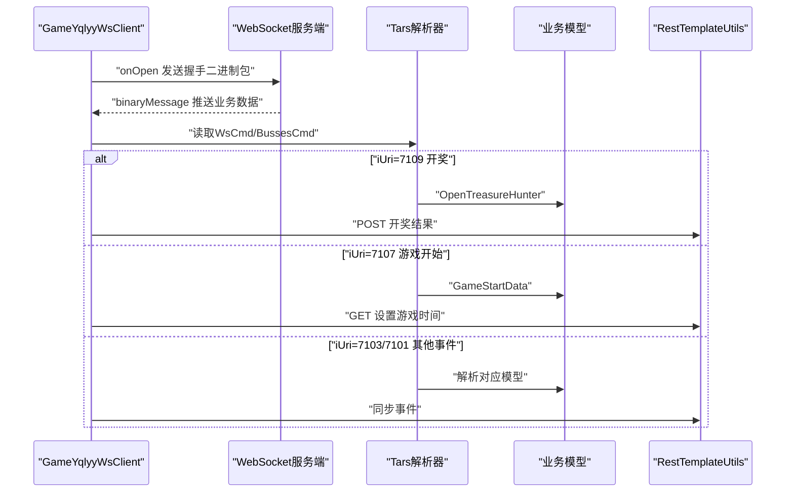
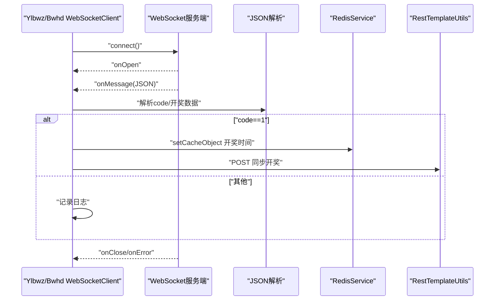
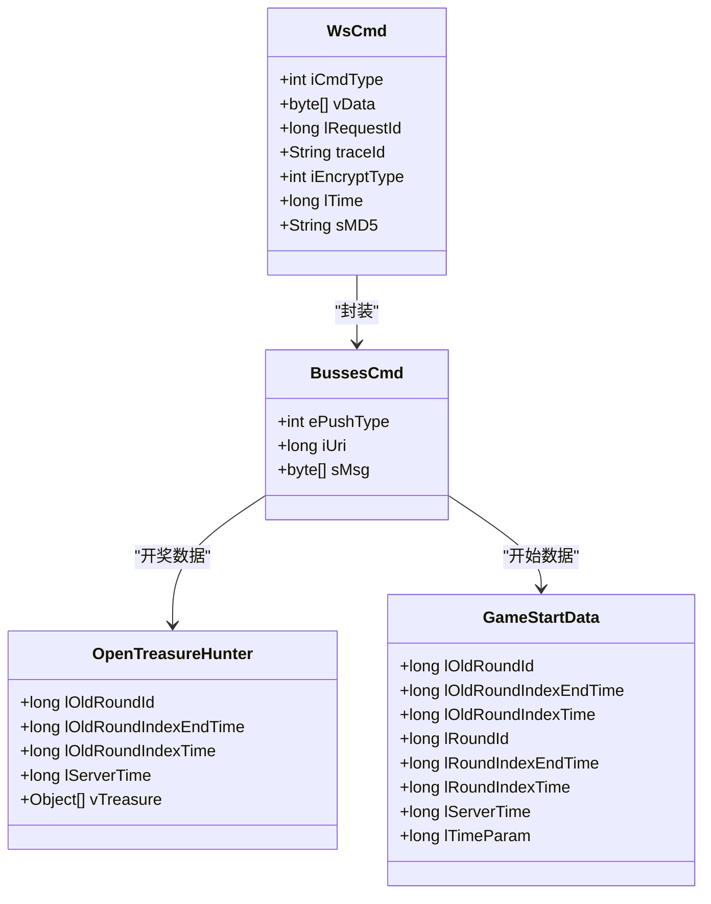
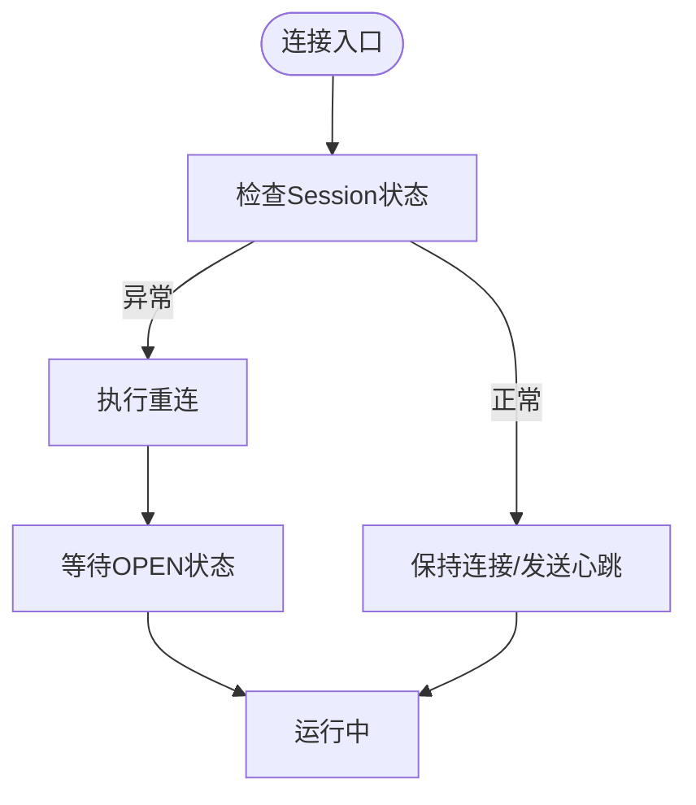
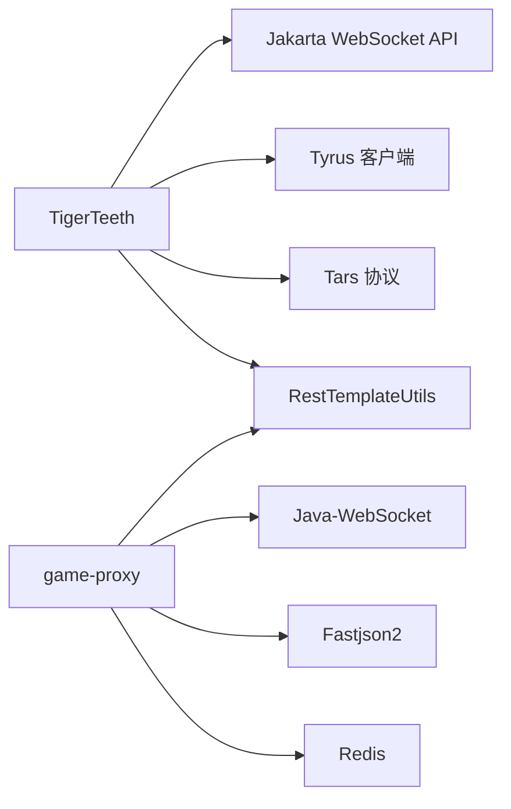

# WebSocket通信机制

<cite>
**本文引用的文件**   
- [GameYqlyyWsClient.java](file://TigerTeeth/src/main/java/com/yqlyy/GameYqlyyWsClient.java)
- [YlbwzWebSocketClient.java](file://game-proxy/src/main/java/com/game/ylbwz/YlbwzWebSocketClient.java)
- [BwhdWebSocketClient.java](file://game-proxy/src/main/java/com/game/gcbwz/BwhdWebSocketClient.java)
- [WsCmd.java](file://TigerTeeth/src/main/java/com/entity/WsCmd.java)
- [BussesCmd.java](file://TigerTeeth/src/main/java/com/entity/BussesCmd.java)
- [GameStartData.java](file://TigerTeeth/src/main/java/com/entity/GameStartData.java)
- [OpenTreasureHunter.java](file://TigerTeeth/src/main/java/com/entity/AccountedNotify/OpenTreasureHunter.java)
- [RestTemplateUtils.java](file://TigerTeeth/src/main/java/com/commom/RestTemplateUtils.java)
- [DomainNameUtil.java（TigerTeeth）](file://TigerTeeth/src/main/java/com/utils/DomainNameUtil.java)
- [DomainNameUtil.java（game-proxy）](file://game-proxy/src/main/java/com/game/utils/DomainNameUtil.java)
- [application.yml（TigerTeeth）](file://TigerTeeth/src/main/resources/application.yml)
- [application.yml（game-proxy）](file://game-proxy/src/main/resources/application.yml)
- [pom.xml（TigerTeeth）](file://TigerTeeth/pom.xml)
- [pom.xml（game-proxy）](file://game-proxy/pom.xml)
</cite>

## 目录
1. [引言](#引言)
2. [项目结构](#项目结构)
3. [核心组件](#核心组件)
4. [架构总览](#架构总览)
5. [详细组件分析](#详细组件分析)
6. [依赖关系分析](#依赖关系分析)
7. [性能与并发](#性能与并发)
8. [故障排查指南](#故障排查指南)
9. [结论](#结论)
10. [附录](#附录)

## 引言
本技术文档围绕仓库中的WebSocket通信机制展开，系统性梳理了两类WebSocket客户端实现、消息解析与事件分发、连接管理与维护策略、以及跨平台协议差异与适配方案。文档同时给出消息格式规范、事件类型定义、状态管理策略、性能优化建议、并发控制与资源管理最佳实践，并提供连接示例与调试方法，帮助读者快速理解并高效集成。

## 项目结构
本仓库包含两个子模块，分别承载不同游戏平台的WebSocket接入与消息处理逻辑：
- TigerTeeth：基于Jakarta WebSocket API的实现，负责虎牙平台的实时数据推送与解析。
- game-proxy：基于Java-WebSocket库的实现，负责多个游戏（如幽林保卫战、古城保卫战）的WebSocket接入与消息同步。

**图表来源**
- [GameYqlyyWsClient.java](file://TigerTeeth/src/main/java/com/yqlyy/GameYqlyyWsClient.java#L29-L328)
- [YlbwzWebSocketClient.java](file://game-proxy/src/main/java/com/game/ylbwz/YlbwzWebSocketClient.java#L29-L193)
- [BwhdWebSocketClient.java](file://game-proxy/src/main/java/com/game/gcbwz/BwhdWebSocketClient.java#L27-L192)
- [WsCmd.java](file://TigerTeeth/src/main/java/com/entity/WsCmd.java#L1-L69)
- [BussesCmd.java](file://TigerTeeth/src/main/java/com/entity/BussesCmd.java#L1-L10)
- [GameStartData.java](file://TigerTeeth/src/main/java/com/entity/GameStartData.java#L1-L79)
- [OpenTreasureHunter.java](file://TigerTeeth/src/main/java/com/entity/AccountedNotify/OpenTreasureHunter.java#L1-L83)
- [RestTemplateUtils.java](file://TigerTeeth/src/main/java/com/commom/RestTemplateUtils.java#L1-L31)
- [DomainNameUtil.java（TigerTeeth）](file://TigerTeeth/src/main/java/com/utils/DomainNameUtil.java#L1-L16)
- [DomainNameUtil.java（game-proxy）](file://game-proxy/src/main/java/com/game/utils/DomainNameUtil.java#L1-L16)

**章节来源**
- [pom.xml（TigerTeeth）](file://TigerTeeth/pom.xml#L26-L111)
- [pom.xml（game-proxy）](file://game-proxy/pom.xml#L26-L101)

## 核心组件
- 虎牙WebSocket客户端（GameYqlyyWsClient）
  - 基于Jakarta WebSocket API，使用ClientEndpoint注解处理连接生命周期回调。
  - 处理二进制消息，解析Tars协议封装的消息体，按iUri区分不同业务事件。
  - 将开奖与游戏开始等事件通过HTTP同步至中转服务与下游系统。
- 幽林/古城WebSocket客户端（YlbwzWebSocketClient、BwhdWebSocketClient）
  - 基于Java-WebSocket库，继承WebSocketClient，覆盖onOpen/onMessage/onClose/onError等回调。
  - 解析JSON消息，识别code字段判断是否为开奖事件，写入Redis并同步HTTP通知。
- 消息模型与工具
  - WsCmd：通用命令头，包含iCmdType、vData等字段。
  - BussesCmd：业务推送命令，包含iUri（事件标识）、sMsg（消息体）等。
  - GameStartData：游戏开始/轮次时间信息。
  - OpenTreasureHunter：虎牙“千与千寻”等游戏的开奖实体。
  - RestTemplateUtils：统一HTTP调用封装，支持GET/POST/exchange。
  - DomainNameUtil：目标域名列表，用于HTTP同步。

**章节来源**
- [GameYqlyyWsClient.java](file://TigerTeeth/src/main/java/com/yqlyy/GameYqlyyWsClient.java#L29-L328)
- [YlbwzWebSocketClient.java](file://game-proxy/src/main/java/com/game/ylbwz/YlbwzWebSocketClient.java#L29-L193)
- [BwhdWebSocketClient.java](file://game-proxy/src/main/java/com/game/gcbwz/BwhdWebSocketClient.java#L27-L192)
- [WsCmd.java](file://TigerTeeth/src/main/java/com/entity/WsCmd.java#L1-L69)
- [BussesCmd.java](file://TigerTeeth/src/main/java/com/entity/BussesCmd.java#L1-L10)
- [GameStartData.java](file://TigerTeeth/src/main/java/com/entity/GameStartData.java#L1-L79)
- [OpenTreasureHunter.java](file://TigerTeeth/src/main/java/com/entity/AccountedNotify/OpenTreasureHunter.java#L1-L83)
- [RestTemplateUtils.java](file://TigerTeeth/src/main/java/com/commom/RestTemplateUtils.java#L1-L31)
- [DomainNameUtil.java（TigerTeeth）](file://TigerTeeth/src/main/java/com/utils/DomainNameUtil.java#L1-L16)
- [DomainNameUtil.java（game-proxy）](file://game-proxy/src/main/java/com/game/utils/DomainNameUtil.java#L1-L16)

## 架构总览
下图展示了两类WebSocket客户端在系统中的位置与交互关系，以及消息流转路径。

**图表来源**
- [GameYqlyyWsClient.java](file://TigerTeeth/src/main/java/com/yqlyy/GameYqlyyWsClient.java#L46-L219)
- [YlbwzWebSocketClient.java](file://game-proxy/src/main/java/com/game/ylbwz/YlbwzWebSocketClient.java#L76-L105)
- [BwhdWebSocketClient.java](file://game-proxy/src/main/java/com/game/gcbwz/BwhdWebSocketClient.java#L73-L102)
- [RestTemplateUtils.java](file://TigerTeeth/src/main/java/com/commom/RestTemplateUtils.java#L19-L29)

## 详细组件分析

### 虎牙WebSocket客户端（GameYqlyyWsClient）
- 连接建立与参数
  - 使用WebSocketContainer创建连接，设置默认消息缓冲区大小与会话超时、异步发送超时等参数。
  - 在onOpen中发送预置的二进制握手包，随后进入消息监听。
- 消息解析与事件分发
  - onMessage接收ByteBuffer，使用TarsInputStream读取WsCmd，再根据BussesCmd.iUri分发处理：
    - iUri=7109：解析OpenTreasureHunter，提取怪物ID与名称，构造JSON并通过RestTemplateUtils同步至下游。
    - iUri=7107：解析GameStartData，读取旧轮次结束时间，同步至中转服务设置游戏时间。
    - iUri=7103：宠物马拉松游戏开局事件，同步首个怪物信息。
    - iUri=7101：宠物马拉松游戏开始事件，同步轮次时间。
- 连接维护
  - 提供report方法定期上报进入游戏的二进制消息；若session为空或关闭则触发重连。
  - 内置同步方法用于AES/CBC加密（未在当前流程直接使用）。

**图表来源**
- [GameYqlyyWsClient.java](file://TigerTeeth/src/main/java/com/yqlyy/GameYqlyyWsClient.java#L46-L219)
- [WsCmd.java](file://TigerTeeth/src/main/java/com/entity/WsCmd.java#L1-L69)
- [BussesCmd.java](file://TigerTeeth/src/main/java/com/entity/BussesCmd.java#L1-L10)
- [OpenTreasureHunter.java](file://TigerTeeth/src/main/java/com/entity/AccountedNotify/OpenTreasureHunter.java#L72-L81)
- [GameStartData.java](file://TigerTeeth/src/main/java/com/entity/GameStartData.java#L1-L79)
- [RestTemplateUtils.java](file://TigerTeeth/src/main/java/com/commom/RestTemplateUtils.java#L19-L29)

**章节来源**
- [GameYqlyyWsClient.java](file://TigerTeeth/src/main/java/com/yqlyy/GameYqlyyWsClient.java#L221-L290)

### 幽林/古城WebSocket客户端（YlbwzWebSocketClient、BwhdWebSocketClient）
- 连接与状态
  - 继承WebSocketClient，覆盖onOpen/onMessage/onClose/onError；使用AtomicBoolean标记连接与消息到达状态。
  - getInstance静态工厂确保单例与连接状态一致性，等待ReadyState.OPEN后再返回。
- 消息处理
  - onMessage解析JSON，识别code=1为开奖事件，写入Redis缓存开奖时间戳，并通过RestTemplateUtils同步至下游。
  - 对非心跳消息记录日志，便于监控与排障。
- 登录与会话
  - 提供login方法通过HTTP获取SESSION，便于后续业务操作（示例中未在客户端内直接使用）。

**图表来源**
- [YlbwzWebSocketClient.java](file://game-proxy/src/main/java/com/game/ylbwz/YlbwzWebSocketClient.java#L66-L138)
- [BwhdWebSocketClient.java](file://game-proxy/src/main/java/com/game/gcbwz/BwhdWebSocketClient.java#L63-L131)
- [RestTemplateUtils.java](file://TigerTeeth/src/main/java/com/commom/RestTemplateUtils.java#L19-L29)

**章节来源**
- [YlbwzWebSocketClient.java](file://game-proxy/src/main/java/com/game/ylbwz/YlbwzWebSocketClient.java#L140-L191)
- [BwhdWebSocketClient.java](file://game-proxy/src/main/java/com/game/gcbwz/BwhdWebSocketClient.java#L133-L190)

### 数据模型与消息格式规范
- WsCmd（通用命令头）
  - 字段：iCmdType（命令类型）、vData（负载字节流）、lRequestId（请求ID）、traceId（追踪ID）、iEncryptType（加密类型）、lTime（时间戳）、sMD5（校验值）。
- BussesCmd（业务推送命令）
  - 字段：ePushType（推送类型）、iUri（事件标识）、sMsg（消息体）。
- GameStartData（游戏开始/轮次时间）
  - 字段：lOldRoundId、lOldRoundIndexEndTime、lOldRoundIndexTime、lRoundId、lRoundIndexEndTime、lRoundIndexTime、lServerTime、lTimeParam。
- OpenTreasureHunter（虎牙开奖实体）
  - 字段：lOldRoundId、lOldRoundIndexEndTime、lOldRoundIndexTime、lServerTime、vTreasure（列表，含怪物信息项）。
- 消息格式与事件类型
  - 虎牙：二进制Tars消息，通过iUri区分事件（如7109开奖、7107游戏开始、7103/7101宠物马拉松事件）。
  - 幽林/古城：文本JSON消息，通过code字段区分是否为开奖事件。

**图表来源**
- [WsCmd.java](file://TigerTeeth/src/main/java/com/entity/WsCmd.java#L1-L69)
- [BussesCmd.java](file://TigerTeeth/src/main/java/com/entity/BussesCmd.java#L1-L10)
- [GameStartData.java](file://TigerTeeth/src/main/java/com/entity/GameStartData.java#L1-L79)
- [OpenTreasureHunter.java](file://TigerTeeth/src/main/java/com/entity/AccountedNotify/OpenTreasureHunter.java#L10-L83)

**章节来源**
- [WsCmd.java](file://TigerTeeth/src/main/java/com/entity/WsCmd.java#L1-L69)
- [BussesCmd.java](file://TigerTeeth/src/main/java/com/entity/BussesCmd.java#L1-L10)
- [GameStartData.java](file://TigerTeeth/src/main/java/com/entity/GameStartData.java#L1-L79)
- [OpenTreasureHunter.java](file://TigerTeeth/src/main/java/com/entity/AccountedNotify/OpenTreasureHunter.java#L10-L83)

### 连接管理、心跳与断线重连
- 虎牙客户端
  - onOpen发送握手二进制包；report周期性上报进入游戏消息；当session为空或关闭时触发connect重连。
  - WebSocketContainer参数：默认二进制/文本缓冲区大小、会话空闲超时、异步发送超时。
- 幽林/古城客户端
  - getInstance确保单例且等待ReadyState.OPEN；onClose/onError记录状态变化。
  - 通过RedisService缓存开奖时间，作为事件确认依据。

**图表来源**
- [GameYqlyyWsClient.java](file://TigerTeeth/src/main/java/com/yqlyy/GameYqlyyWsClient.java#L250-L272)
- [YlbwzWebSocketClient.java](file://game-proxy/src/main/java/com/game/ylbwz/YlbwzWebSocketClient.java#L140-L179)
- [BwhdWebSocketClient.java](file://game-proxy/src/main/java/com/game/gcbwz/BwhdWebSocketClient.java#L133-L171)

**章节来源**
- [GameYqlyyWsClient.java](file://TigerTeeth/src/main/java/com/yqlyy/GameYqlyyWsClient.java#L250-L272)
- [YlbwzWebSocketClient.java](file://game-proxy/src/main/java/com/game/ylbwz/YlbwzWebSocketClient.java#L140-L179)
- [BwhdWebSocketClient.java](file://game-proxy/src/main/java/com/game/gcbwz/BwhdWebSocketClient.java#L133-L171)

### 协议差异与适配方案
- 协议差异
  - 虎牙：二进制Tars协议，需解析WsCmd/BussesCmd；事件通过iUri区分。
  - 幽林/古城：文本JSON协议，事件通过code字段区分。
- 适配方案
  - 针对不同协议在onMessage中采用不同的解析器（Tars vs JSON）。
  - 通过统一的HTTP同步层（RestTemplateUtils）屏蔽上游协议差异，保证下游系统一致消费。

**章节来源**
- [GameYqlyyWsClient.java](file://TigerTeeth/src/main/java/com/yqlyy/GameYqlyyWsClient.java#L51-L219)
- [YlbwzWebSocketClient.java](file://game-proxy/src/main/java/com/game/ylbwz/YlbwzWebSocketClient.java#L76-L105)
- [BwhdWebSocketClient.java](file://game-proxy/src/main/java/com/game/gcbwz/BwhdWebSocketClient.java#L73-L102)

## 依赖关系分析
- TigerTeeth模块
  - 依赖Jakarta WebSocket API与Tyrus客户端，使用Tars协议解析二进制消息。
  - 通过RestTemplateUtils发起HTTP同步，配置HTTP连接池参数。
- game-proxy模块
  - 依赖Java-WebSocket库，使用Fastjson2解析JSON，Redis缓存开奖时间。
  - 通过RestTemplateUtils与下游系统交互。

**图表来源**
- [pom.xml（TigerTeeth）](file://TigerTeeth/pom.xml#L59-L70)
- [pom.xml（game-proxy）](file://game-proxy/pom.xml#L62-L66)
- [RestTemplateUtils.java](file://TigerTeeth/src/main/java/com/commom/RestTemplateUtils.java#L1-L31)

**章节来源**
- [pom.xml（TigerTeeth）](file://TigerTeeth/pom.xml#L26-L111)
- [pom.xml（game-proxy）](file://game-proxy/pom.xml#L26-L101)

## 性能与并发
- 连接与缓冲
  - 设置默认二进制/文本消息缓冲上限，避免内存压力。
  - 控制会话空闲超时与异步发送超时，提升连接稳定性。
- HTTP同步
  - 使用RestTemplate统一发起同步请求，结合连接池参数（最大连接数、并发数、超时）保障吞吐。
- 并发控制
  - Java-WebSocket客户端内部线程模型由库管理；自定义客户端使用AtomicBoolean标记状态，避免重复连接。
- 资源管理
  - 关闭连接时清理状态标志位，防止资源泄漏。
  - Redis缓存仅存储必要键值，降低持久化压力。

**章节来源**
- [GameYqlyyWsClient.java](file://TigerTeeth/src/main/java/com/yqlyy/GameYqlyyWsClient.java#L254-L257)
- [application.yml（TigerTeeth）](file://TigerTeeth/src/main/resources/application.yml#L16-L30)
- [application.yml（game-proxy）](file://game-proxy/src/main/resources/application.yml#L43-L57)
- [YlbwzWebSocketClient.java](file://game-proxy/src/main/java/com/game/ylbwz/YlbwzWebSocketClient.java#L123-L128)
- [BwhdWebSocketClient.java](file://game-proxy/src/main/java/com/game/gcbwz/BwhdWebSocketClient.java#L116-L121)

## 故障排查指南
- 常见问题定位
  - 连接失败：检查WebSocketContainer参数与URL有效性；查看onError日志。
  - 消息解析异常：确认iUri与消息体长度；核对Tars字段索引与数据类型。
  - HTTP同步失败：检查DomainNameUtil中的目标地址与网络可达性；查看RestClientException。
- 日志与监控
  - onOpen/onMessage/onClose/onError均输出详细日志，便于定位阶段与原因。
  - Redis缓存开奖时间可用于事件确认与回放验证。
- 重连策略
  - 虎牙：report中检测session状态并触发connect。
  - 幽林/古城：getInstance等待OPEN状态，避免重复连接。

**章节来源**
- [GameYqlyyWsClient.java](file://TigerTeeth/src/main/java/com/yqlyy/GameYqlyyWsClient.java#L240-L248)
- [YlbwzWebSocketClient.java](file://game-proxy/src/main/java/com/game/ylbwz/YlbwzWebSocketClient.java#L123-L138)
- [BwhdWebSocketClient.java](file://game-proxy/src/main/java/com/game/gcbwz/BwhdWebSocketClient.java#L116-L131)

## 结论
本仓库提供了两类WebSocket客户端的完整实现与配套消息模型，覆盖了二进制Tars协议与JSON协议的不同场景。通过统一的HTTP同步层与Redis缓存，实现了跨平台事件的标准化处理。建议在生产环境中进一步完善心跳策略、断线重试与幂等设计，并持续优化连接池与消息解析性能。

## 附录
- 连接示例
  - 虎牙：在onOpen中发送握手二进制包；通过report周期上报进入游戏消息。
  - 幽林/古城：通过getInstance获取单例客户端，等待ReadyState.OPEN后进行业务操作。
- 调试方法
  - 打印消息体Base64编码与关键字段，核对协议解析。
  - 使用日志级别调整与Redis键值核对，验证事件顺序与时序。