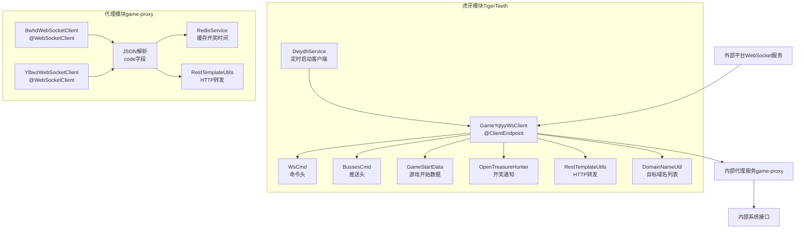
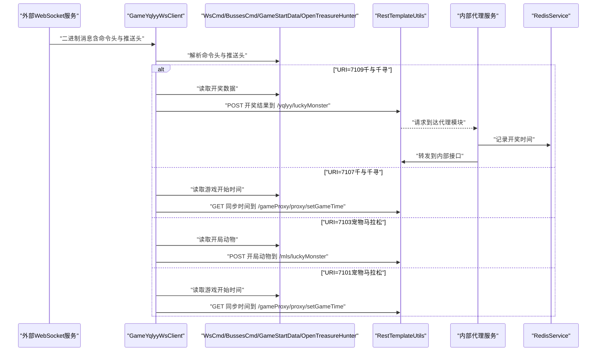
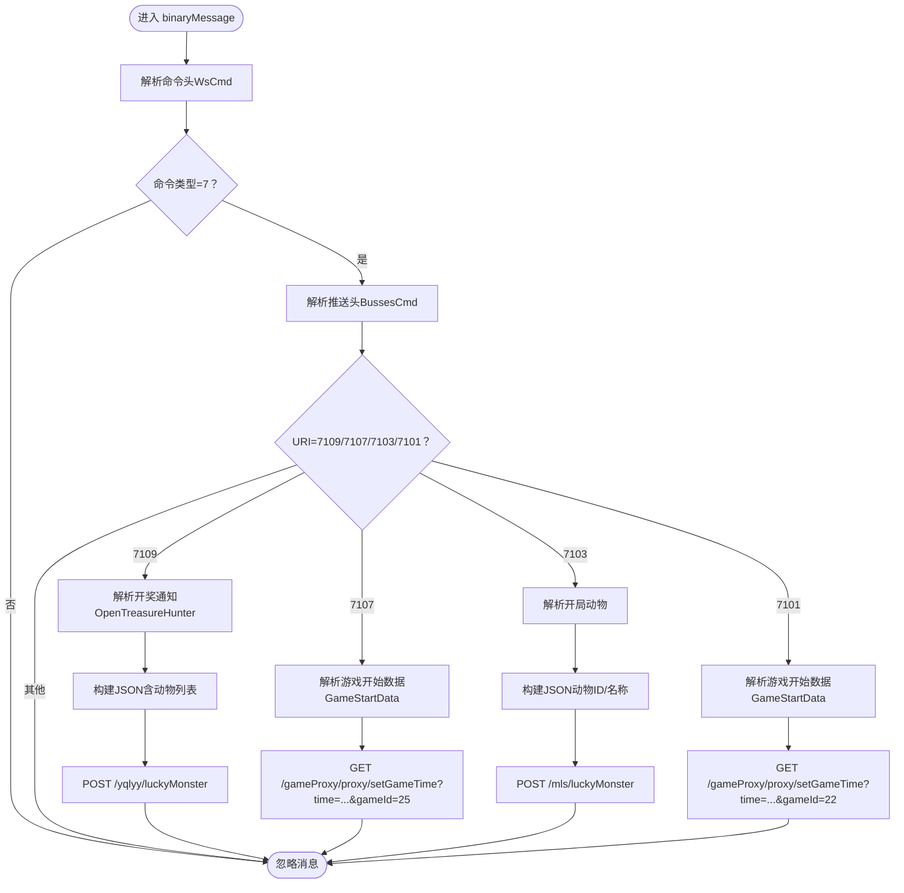
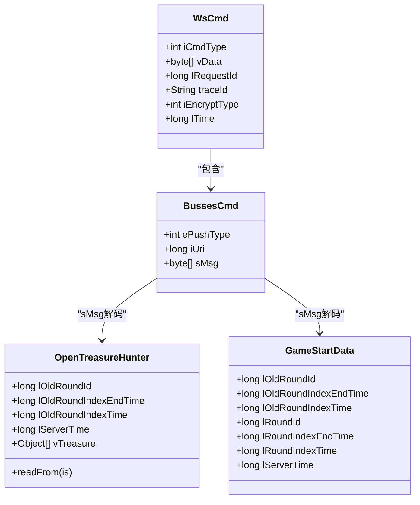
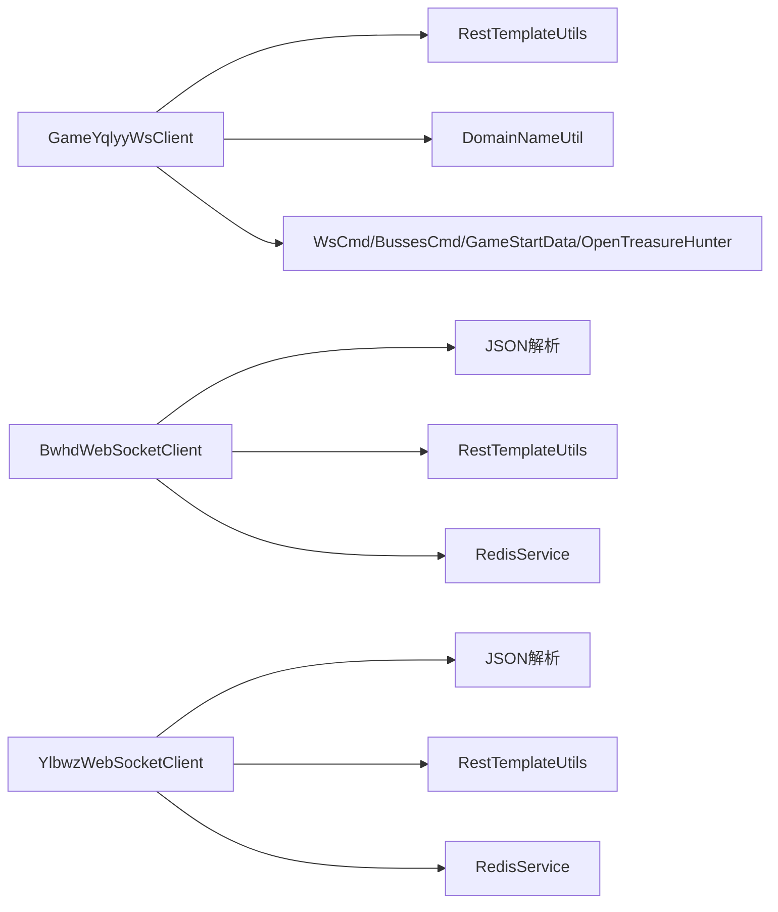

# 消息处理机制

<cite>
**本文引用的文件**
- [GameYqlyyWsClient.java](file://TigerTeeth/src/main/java/com/yqlyy/GameYqlyyWsClient.java)
- [DwydhService.java](file://TigerTeeth/src/main/java/com/dwydh/DwydhService.java)
- [ApplicationRunnerImpl.java](file://TigerTeeth/src/main/java/com/listener/ApplicationRunnerImpl.java)
- [WsCmd.java](file://TigerTeeth/src/main/java/com/entity/WsCmd.java)
- [BussesCmd.java](file://TigerTeeth/src/main/java/com/entity/BussesCmd.java)
- [GameStartData.java](file://TigerTeeth/src/main/java/com/entity/GameStartData.java)
- [OpenTreasureHunter.java](file://TigerTeeth/src/main/java/com/entity/AccountedNotify/OpenTreasureHunter.java)
- [RestTemplateUtils.java](file://TigerTeeth/src/main/java/com/commom/RestTemplateUtils.java)
- [DomainNameUtil.java](file://TigerTeeth/src/main/java/com/utils/DomainNameUtil.java)
- [application.yml（虎牙模块）](file://TigerTeeth/src/main/resources/application.yml)
- [BwhdWebSocketClient.java](file://game-proxy/src/main/java/com/game/gcbwz/BwhdWebSocketClient.java)
- [YlbwzWebSocketClient.java](file://game-proxy/src/main/java/com/game/ylbwz/YlbwzWebSocketClient.java)
- [RedisService.java](file://game-proxy/src/main/java/com/game/redis/RedisService.java)
- [application.yml（代理模块）](file://game-proxy/src/main/resources/application.yml)
</cite>

## 目录
1. [引言](#引言)
2. [项目结构](#项目结构)
3. [核心组件](#核心组件)
4. [架构总览](#架构总览)
5. [详细组件分析](#详细组件分析)
6. [依赖分析](#依赖分析)
7. [性能考虑](#性能考虑)
8. [故障排查指南](#故障排查指南)
9. [结论](#结论)
10. [附录](#附录)

## 引言
本文件围绕WebSocket消息处理机制展开，重点解释onMessage回调的消息解析与处理流程，涵盖：
- JSON消息格式解析（code字段判断与业务分支）
- 不同类型消息的处理策略（开奖消息、普通消息、错误消息）
- 消息转发至其他游戏平台的同步机制
- 消息缓存、消息队列与异步处理的实现思路
- 消息格式规范、字段定义与数据校验规则
- 性能优化技巧与错误处理最佳实践

## 项目结构
本仓库包含两个主要模块：
- 虎牙模块（TigerTeeth）：负责订阅虎牙WebSocket，解析二进制消息，识别不同业务URI并触发相应处理与转发。
- 代理模块（game-proxy）：负责接收来自其他平台的WebSocket消息，解析JSON，按code字段区分开奖与普通消息，并同步到内部系统。



图表来源
- [GameYqlyyWsClient.java](file://TigerTeeth/src/main/java/com/yqlyy/GameYqlyyWsClient.java#L29-L328)
- [DwydhService.java](file://TigerTeeth/src/main/java/com/dwydh/DwydhService.java#L12-L38)
- [ApplicationRunnerImpl.java](file://TigerTeeth/src/main/java/com/listener/ApplicationRunnerImpl.java#L21-L33)
- [WsCmd.java](file://TigerTeeth/src/main/java/com/entity/WsCmd.java#L3-L68)
- [BussesCmd.java](file://TigerTeeth/src/main/java/com/entity/BussesCmd.java#L3-L9)
- [GameStartData.java](file://TigerTeeth/src/main/java/com/entity/GameStartData.java#L3-L78)
- [OpenTreasureHunter.java](file://TigerTeeth/src/main/java/com/entity/AccountedNotify/OpenTreasureHunter.java#L10-L82)
- [RestTemplateUtils.java](file://TigerTeeth/src/main/java/com/commom/RestTemplateUtils.java#L14-L30)
- [DomainNameUtil.java](file://TigerTeeth/src/main/java/com/utils/DomainNameUtil.java#L3-L15)
- [BwhdWebSocketClient.java](file://game-proxy/src/main/java/com/game/gcbwz/BwhdWebSocketClient.java#L27-L131)
- [YlbwzWebSocketClient.java](file://game-proxy/src/main/java/com/game/ylbwz/YlbwzWebSocketClient.java#L29-L138)
- [RedisService.java](file://game-proxy/src/main/java/com/game/redis/RedisService.java#L20-L243)

章节来源
- [application.yml（虎牙模块）](file://TigerTeeth/src/main/resources/application.yml#L1-L31)
- [application.yml（代理模块）](file://game-proxy/src/main/resources/application.yml#L1-L58)

## 核心组件
- 虎牙WebSocket客户端：负责建立连接、接收二进制消息、解析命令头与推送头、根据URI分发处理并转发到代理模块。
- 代理WebSocket客户端：负责接收来自其他平台的WebSocket消息，解析JSON，按code字段区分开奖与普通消息，并写入缓存与转发。
- 实体模型：封装命令头、推送头、游戏开始数据、开奖通知等结构化数据。
- HTTP工具：统一发起POST/GET请求，用于消息转发与状态同步。
- 配置与缓存：通过Redis存储开奖时间等状态，通过配置文件管理域名列表与HTTP连接参数。

章节来源
- [GameYqlyyWsClient.java](file://TigerTeeth/src/main/java/com/yqlyy/GameYqlyyWsClient.java#L30-L327)
- [BwhdWebSocketClient.java](file://game-proxy/src/main/java/com/game/gcbwz/BwhdWebSocketClient.java#L27-L131)
- [YlbwzWebSocketClient.java](file://game-proxy/src/main/java/com/game/ylbwz/YlbwzWebSocketClient.java#L29-L138)
- [WsCmd.java](file://TigerTeeth/src/main/java/com/entity/WsCmd.java#L3-L68)
- [BussesCmd.java](file://TigerTeeth/src/main/java/com/entity/BussesCmd.java#L3-L9)
- [GameStartData.java](file://TigerTeeth/src/main/java/com/entity/GameStartData.java#L3-L78)
- [OpenTreasureHunter.java](file://TigerTeeth/src/main/java/com/entity/AccountedNotify/OpenTreasureHunter.java#L10-L82)
- [RestTemplateUtils.java](file://TigerTeeth/src/main/java/com/commom/RestTemplateUtils.java#L14-L30)
- [RedisService.java](file://game-proxy/src/main/java/com/game/redis/RedisService.java#L20-L243)

## 架构总览
下图展示虎牙WebSocket消息从接入到转发的全链路：



图表来源
- [GameYqlyyWsClient.java](file://TigerTeeth/src/main/java/com/yqlyy/GameYqlyyWsClient.java#L46-L219)
- [WsCmd.java](file://TigerTeeth/src/main/java/com/entity/WsCmd.java#L3-L68)
- [BussesCmd.java](file://TigerTeeth/src/main/java/com/entity/BussesCmd.java#L3-L9)
- [GameStartData.java](file://TigerTeeth/src/main/java/com/entity/GameStartData.java#L3-L78)
- [OpenTreasureHunter.java](file://TigerTeeth/src/main/java/com/entity/AccountedNotify/OpenTreasureHunter.java#L10-L82)
- [RestTemplateUtils.java](file://TigerTeeth/src/main/java/com/commom/RestTemplateUtils.java#L19-L25)

## 详细组件分析

### 虎牙WebSocket消息处理（onMessage）
- 接收二进制消息，解析命令头与推送头，仅处理特定命令类型。
- 根据推送URI分发处理：
  - URI=7109：解析开奖通知，构造JSON并转发到代理模块的“千与千寻”接口。
  - URI=7107：解析游戏开始时间，调用代理模块的时间同步接口。
  - URI=7103：解析开局动物，转发到代理模块的“宠物马拉松”接口。
  - URI=7101：解析游戏开始时间，调用代理模块的时间同步接口。
- 使用HTTP工具统一发起请求，日志记录异常与响应。



图表来源
- [GameYqlyyWsClient.java](file://TigerTeeth/src/main/java/com/yqlyy/GameYqlyyWsClient.java#L51-L219)
- [OpenTreasureHunter.java](file://TigerTeeth/src/main/java/com/entity/AccountedNotify/OpenTreasureHunter.java#L73-L81)
- [GameStartData.java](file://TigerTeeth/src/main/java/com/entity/GameStartData.java#L52-L66)

章节来源
- [GameYqlyyWsClient.java](file://TigerTeeth/src/main/java/com/yqlyy/GameYqlyyWsClient.java#L46-L219)
- [WsCmd.java](file://TigerTeeth/src/main/java/com/entity/WsCmd.java#L3-L68)
- [BussesCmd.java](file://TigerTeeth/src/main/java/com/entity/BussesCmd.java#L3-L9)
- [OpenTreasureHunter.java](file://TigerTeeth/src/main/java/com/entity/AccountedNotify/OpenTreasureHunter.java#L10-L82)
- [GameStartData.java](file://TigerTeeth/src/main/java/com/entity/GameStartData.java#L3-L78)

### 代理模块WebSocket消息处理（onMessage）
- 接收字符串消息，解析JSON，提取code字段。
- code=1：视为开奖消息，记录当前时间到缓存，并将原始JSON转发到内部接口。
- 其他：视为普通消息，直接记录日志。
- 心跳消息“heart”被特殊处理，避免误判为开奖。

```mermaid
flowchart TD
S(["进入 onMessage"]) --> Heart{"消息==\"heart\"？"}
Heart -- 是 --> LogH["记录心跳日志"] --> End(["结束"])
Heart -- 否 --> Parse["解析JSON"]
Parse --> Code{"code==1？"}
Code -- 是 --> Cache["写入Redis：lottery_open_time_*"]
Cache --> Forward["POST 内部接口 /.../luckyMonster"]
Forward --> LogWin["记录开奖日志"] --> End
Code -- 否 --> LogMsg["记录普通消息日志"] --> End
```

图表来源
- [BwhdWebSocketClient.java](file://game-proxy/src/main/java/com/game/gcbwz/BwhdWebSocketClient.java#L74-L102)
- [YlbwzWebSocketClient.java](file://game-proxy/src/main/java/com/game/ylbwz/YlbwzWebSocketClient.java#L77-L105)
- [RedisService.java](file://game-proxy/src/main/java/com/game/redis/RedisService.java#L95-L98)

章节来源
- [BwhdWebSocketClient.java](file://game-proxy/src/main/java/com/game/gcbwz/BwhdWebSocketClient.java#L74-L102)
- [YlbwzWebSocketClient.java](file://game-proxy/src/main/java/com/game/ylbwz/YlbwzWebSocketClient.java#L77-L105)
- [RedisService.java](file://game-proxy/src/main/java/com/game/redis/RedisService.java#L95-L98)

### 类关系与数据模型


图表来源
- [WsCmd.java](file://TigerTeeth/src/main/java/com/entity/WsCmd.java#L3-L68)
- [BussesCmd.java](file://TigerTeeth/src/main/java/com/entity/BussesCmd.java#L3-L9)
- [GameStartData.java](file://TigerTeeth/src/main/java/com/entity/GameStartData.java#L3-L78)
- [OpenTreasureHunter.java](file://TigerTeeth/src/main/java/com/entity/AccountedNotify/OpenTreasureHunter.java#L10-L82)

## 依赖分析
- 虎牙模块依赖：
  - WebSocket客户端注解驱动的消息回调
  - 实体模型用于结构化解析
  - HTTP工具用于跨服务转发
  - 域名工具用于多目标广播
- 代理模块依赖：
  - WebSocket客户端库
  - JSON解析库
  - Redis服务用于状态缓存
  - HTTP工具用于转发



图表来源
- [GameYqlyyWsClient.java](file://TigerTeeth/src/main/java/com/yqlyy/GameYqlyyWsClient.java#L30-L327)
- [RestTemplateUtils.java](file://TigerTeeth/src/main/java/com/commom/RestTemplateUtils.java#L14-L30)
- [DomainNameUtil.java](file://TigerTeeth/src/main/java/com/utils/DomainNameUtil.java#L3-L15)
- [BwhdWebSocketClient.java](file://game-proxy/src/main/java/com/game/gcbwz/BwhdWebSocketClient.java#L27-L131)
- [YlbwzWebSocketClient.java](file://game-proxy/src/main/java/com/game/ylbwz/YlbwzWebSocketClient.java#L29-L138)
- [RedisService.java](file://game-proxy/src/main/java/com/game/redis/RedisService.java#L20-L243)

## 性能考虑
- 连接与缓冲区配置：合理设置默认文本/二进制消息缓冲区大小与会话空闲超时，避免内存占用过高或频繁重建连接。
- 异步与并发：使用线程池执行长耗时任务（如HTTP转发），避免阻塞WebSocket回调线程。
- 日志与监控：对高频消息进行采样记录，减少IO压力；对异常进行分级记录，便于定位问题。
- 缓存策略：利用Redis缓存开奖时间等状态，降低重复计算与网络往返。
- 超时与重试：为HTTP请求设置合理的超时与重试策略，提升稳定性。

章节来源
- [application.yml（虎牙模块）](file://TigerTeeth/src/main/resources/application.yml#L16-L31)
- [application.yml（代理模块）](file://game-proxy/src/main/resources/application.yml#L43-L58)
- [RedisService.java](file://game-proxy/src/main/java/com/game/redis/RedisService.java#L20-L243)

## 故障排查指南
- WebSocket连接失败
  - 检查URL是否为空或不可达
  - 查看容器默认缓冲区与超时配置
  - 观察onError回调日志
- 消息未被处理
  - 确认命令类型与推送URI是否匹配
  - 核对JSON字段（如code）是否正确
- HTTP转发异常
  - 检查域名列表与目标路径
  - 关注RestClientException与通用异常日志
- 缓存未更新
  - 确认Redis连接参数与键名
  - 校验写入与读取逻辑

章节来源
- [GameYqlyyWsClient.java](file://TigerTeeth/src/main/java/com/yqlyy/GameYqlyyWsClient.java#L250-L272)
- [BwhdWebSocketClient.java](file://game-proxy/src/main/java/com/game/gcbwz/BwhdWebSocketClient.java#L87-L94)
- [YlbwzWebSocketClient.java](file://game-proxy/src/main/java/com/game/ylbwz/YlbwzWebSocketClient.java#L90-L97)
- [RedisService.java](file://game-proxy/src/main/java/com/game/redis/RedisService.java#L95-L98)

## 结论
该消息处理机制以虎牙WebSocket为入口，通过结构化解析与路由分发，将开奖与时间类消息同步至代理模块，并进一步转发到内部系统。代理模块则以JSON消息为核心，基于code字段进行差异化处理，并结合Redis实现状态缓存。整体设计具备清晰的职责分离与良好的扩展性，建议在生产环境中强化异步化与限流策略，确保高并发下的稳定性与性能。

## 附录

### 消息格式规范与字段定义
- 虎牙WebSocket（二进制）
  - 命令头（WsCmd）：包含命令类型、数据体、请求ID、追踪ID、加密类型、时间戳等字段。
  - 推送头（BussesCmd）：包含推送类型、URI、消息体等字段。
  - 游戏开始数据（GameStartData）：包含轮次ID、开始/结束时间等字段。
  - 开奖通知（OpenTreasureHunter）：包含历史轮次ID、时间与动物列表等字段。
- 代理模块WebSocket（JSON）
  - code：1表示开奖消息，其他为普通消息。
  - data：开奖动物信息（示例字段：animalId、animalName）。
  - heart：心跳消息，不参与开奖判定。

章节来源
- [WsCmd.java](file://TigerTeeth/src/main/java/com/entity/WsCmd.java#L3-L68)
- [BussesCmd.java](file://TigerTeeth/src/main/java/com/entity/BussesCmd.java#L3-L9)
- [GameStartData.java](file://TigerTeeth/src/main/java/com/entity/GameStartData.java#L3-L78)
- [OpenTreasureHunter.java](file://TigerTeeth/src/main/java/com/entity/AccountedNotify/OpenTreasureHunter.java#L10-L82)
- [BwhdWebSocketClient.java](file://game-proxy/src/main/java/com/game/gcbwz/BwhdWebSocketClient.java#L77-L101)
- [YlbwzWebSocketClient.java](file://game-proxy/src/main/java/com/game/ylbwz/YlbwzWebSocketClient.java#L80-L104)