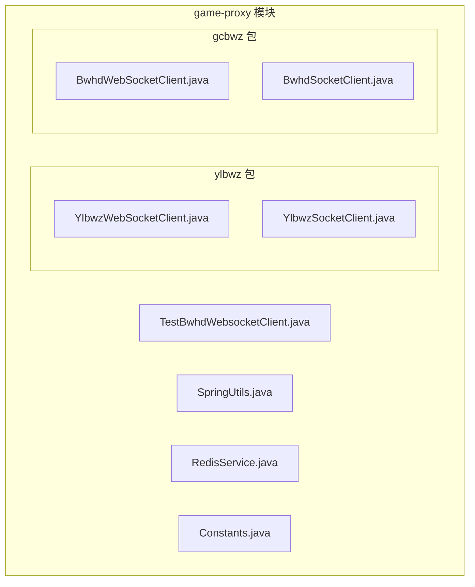
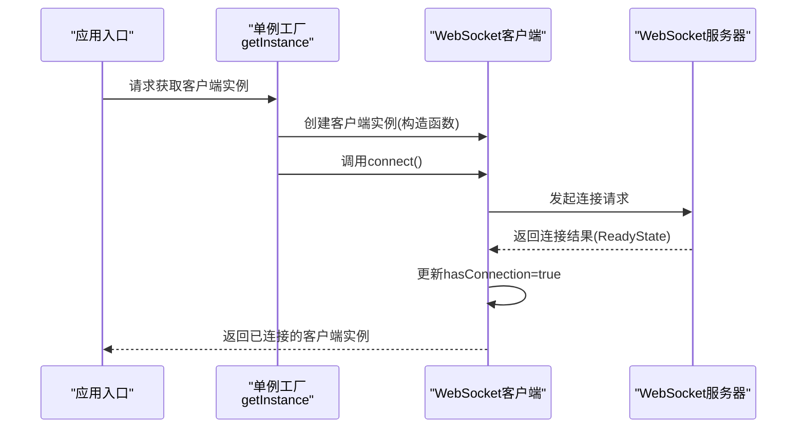
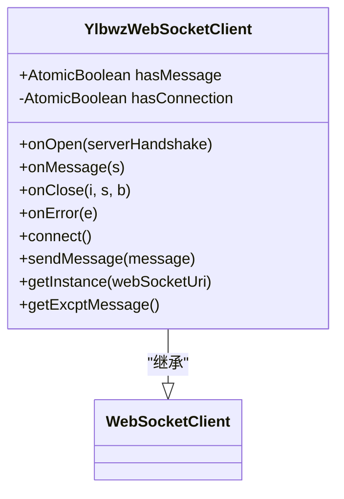
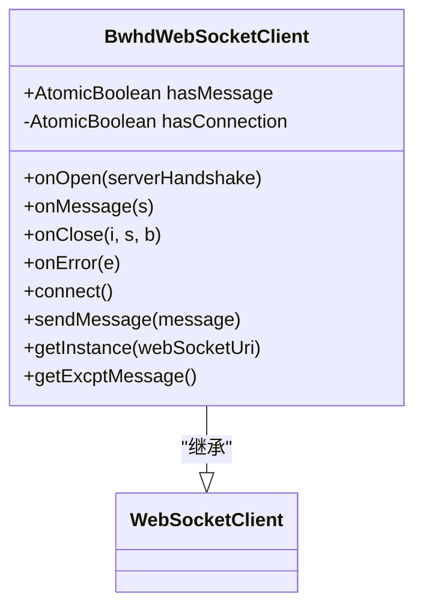
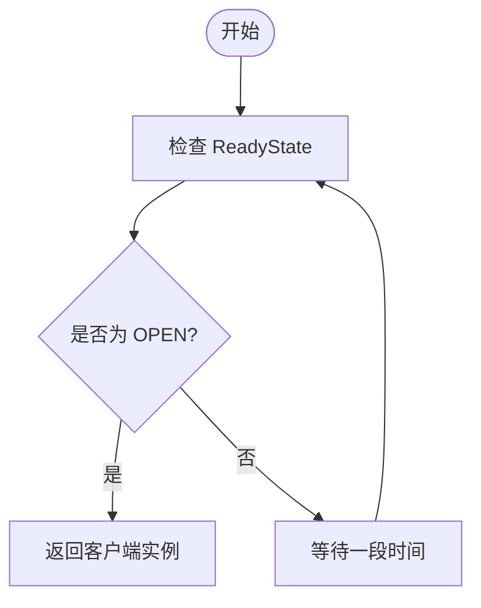
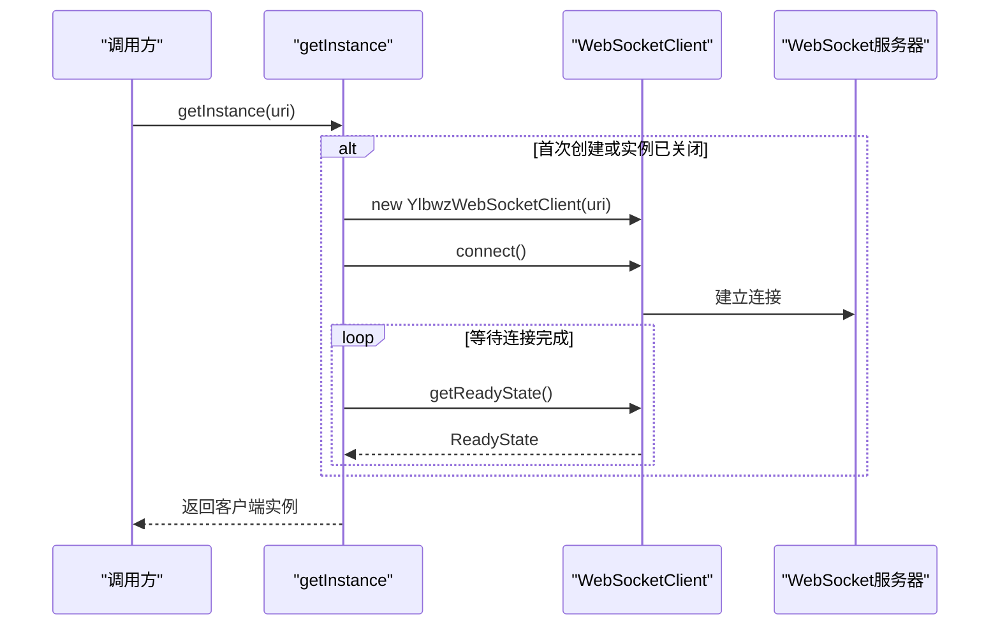
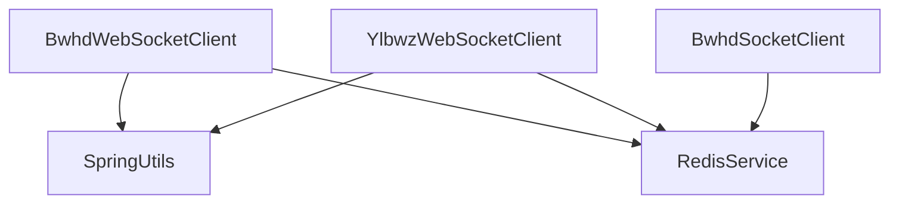

# 连接管理策略

<cite>
**本文引用的文件**
- [YlbwzWebSocketClient.java](file://game-proxy/src/main/java/com/game/ylbwz/YlbwzWebSocketClient.java)
- [BwhdWebSocketClient.java](file://game-proxy/src/main/java/com/game/gcbwz/BwhdWebSocketClient.java)
- [TestBwhdWebsocketClient.java](file://game-proxy/src/main/java/com/game/gcbwz/TestBwhdWebsocketClient.java)
- [SpringUtils.java](file://game-proxy/src/main/java/com/game/utils/SpringUtils.java)
- [RedisService.java](file://game-proxy/src/main/java/com/game/redis/RedisService.java)
- [Constants.java](file://game-proxy/src/main/java/com/game/commom/Constants.java)
- [BwhdSocketClient.java](file://game-proxy/src/main/java/com/game/gcbwz/BwhdSocketClient.java)
- [YlbwzSocketClient.java](file://game-proxy/src/main/java/com/game/ylbwz/YlbwzSocketClient.java)
</cite>

## 目录
1. [简介](#简介)
2. [项目结构](#项目结构)
3. [核心组件](#核心组件)
4. [架构总览](#架构总览)
5. [详细组件分析](#详细组件分析)
6. [依赖关系分析](#依赖关系分析)
7. [性能考量](#性能考量)
8. [故障排查指南](#故障排查指南)
9. [结论](#结论)
10. [附录](#附录)

## 简介
本技术文档围绕游戏代理模块中的WebSocket连接管理策略展开，重点解释以下内容：
- 连接状态管理机制：hasConnection与hasMessage两个AtomicBoolean变量的作用与使用场景
- 连接建立流程：从单例工厂方法getInstance到connect方法的连接尝试过程
- ReadyState枚举值的判断与处理逻辑
- 连接超时、连接失败与连接中断的处理策略
- 连接状态检查、连接重试与连接池管理的实现方案
- 连接资源生命周期管理与内存泄漏防护措施
- 具体连接示例与调试方法

## 项目结构
本项目采用按功能域划分的多模块结构，WebSocket相关代码主要集中在game-proxy模块下，分别针对不同业务场景提供了两种WebSocket客户端实现：
- 基于org.java_websocket的客户端：YlbwzWebSocketClient、BwhdWebSocketClient
- 基于OkHttp的客户端：BwhdSocketClient、YlbwzSocketClient

图表来源
- [YlbwzWebSocketClient.java](file://game-proxy/src/main/java/com/game/ylbwz/YlbwzWebSocketClient.java#L1-L193)
- [BwhdWebSocketClient.java](file://game-proxy/src/main/java/com/game/gcbwz/BwhdWebSocketClient.java#L1-L192)
- [YlbwzSocketClient.java](file://game-proxy/src/main/java/com/game/ylbwz/YlbwzSocketClient.java#L85-L102)
- [BwhdSocketClient.java](file://game-proxy/src/main/java/com/game/gcbwz/BwhdSocketClient.java#L1-L87)
- [TestBwhdWebsocketClient.java](file://game-proxy/src/main/java/com/game/gcbwz/TestBwhdWebsocketClient.java#L1-L16)
- [SpringUtils.java](file://game-proxy/src/main/java/com/game/utils/SpringUtils.java#L1-L103)
- [RedisService.java](file://game-proxy/src/main/java/com/game/redis/RedisService.java#L1-L244)
- [Constants.java](file://game-proxy/src/main/java/com/game/commom/Constants.java#L1-L14)

章节来源
- [YlbwzWebSocketClient.java](file://game-proxy/src/main/java/com/game/ylbwz/YlbwzWebSocketClient.java#L1-L193)
- [BwhdWebSocketClient.java](file://game-proxy/src/main/java/com/game/gcbwz/BwhdWebSocketClient.java#L1-L192)
- [YlbwzSocketClient.java](file://game-proxy/src/main/java/com/game/ylbwz/YlbwzSocketClient.java#L85-L102)
- [BwhdSocketClient.java](file://game-proxy/src/main/java/com/game/gcbwz/BwhdSocketClient.java#L1-L87)
- [TestBwhdWebsocketClient.java](file://game-proxy/src/main/java/com/game/gcbwz/TestBwhdWebsocketClient.java#L1-L16)
- [SpringUtils.java](file://game-proxy/src/main/java/com/game/utils/SpringUtils.java#L1-L103)
- [RedisService.java](file://game-proxy/src/main/java/com/game/redis/RedisService.java#L1-L244)
- [Constants.java](file://game-proxy/src/main/java/com/game/commom/Constants.java#L1-L14)

## 核心组件
本节聚焦于连接状态管理的核心组件与关键字段：
- hasMessage：线程安全的布尔标志，用于标记是否收到过消息
- hasConnection：线程安全的布尔标志，用于标记是否已建立连接
- ReadyState：WebSocket连接状态枚举，用于判断连接是否处于OPEN状态
- 单例工厂方法：getInstance，负责创建并初始化WebSocket客户端实例
- 连接尝试方法：connect，封装连接发起与状态更新逻辑

章节来源
- [YlbwzWebSocketClient.java](file://game-proxy/src/main/java/com/game/ylbwz/YlbwzWebSocketClient.java#L43-L48)
- [BwhdWebSocketClient.java](file://game-proxy/src/main/java/com/game/gcbwz/BwhdWebSocketClient.java#L39-L44)
- [YlbwzWebSocketClient.java](file://game-proxy/src/main/java/com/game/ylbwz/YlbwzWebSocketClient.java#L160-L179)
- [BwhdWebSocketClient.java](file://game-proxy/src/main/java/com/game/gcbwz/BwhdWebSocketClient.java#L153-L172)

## 架构总览
WebSocket连接管理的整体架构由“客户端实现 + 状态管理 + 工厂方法 + 事件回调”构成。客户端继承自对应的WebSocket库基类，通过覆盖onOpen/onMessage/onClose/onError等回调方法实现业务逻辑，并利用AtomicBoolean进行状态管理。

图表来源
- [YlbwzWebSocketClient.java](file://game-proxy/src/main/java/com/game/ylbwz/YlbwzWebSocketClient.java#L160-L179)
- [BwhdWebSocketClient.java](file://game-proxy/src/main/java/com/game/gcbwz/BwhdWebSocketClient.java#L153-L172)
- [YlbwzWebSocketClient.java](file://game-proxy/src/main/java/com/game/ylbwz/YlbwzWebSocketClient.java#L140-L146)
- [BwhdWebSocketClient.java](file://game-proxy/src/main/java/com/game/gcbwz/BwhdWebSocketClient.java#L133-L139)

## 详细组件分析

### YlbwzWebSocketClient 组件分析
YlbwzWebSocketClient基于org.java_websocket实现，具备以下特性：
- 使用hasMessage与hasConnection两个AtomicBoolean进行状态标记
- 在onOpen/onMessage/onClose/onError中维护状态
- 提供sendMessage方法用于发送消息
- 通过getInstance实现单例模式，并在连接建立后等待ReadyState变为OPEN

图表来源
- [YlbwzWebSocketClient.java](file://game-proxy/src/main/java/com/game/ylbwz/YlbwzWebSocketClient.java#L29-L193)

章节来源
- [YlbwzWebSocketClient.java](file://game-proxy/src/main/java/com/game/ylbwz/YlbwzWebSocketClient.java#L43-L48)
- [YlbwzWebSocketClient.java](file://game-proxy/src/main/java/com/game/ylbwz/YlbwzWebSocketClient.java#L66-L138)
- [YlbwzWebSocketClient.java](file://game-proxy/src/main/java/com/game/ylbwz/YlbwzWebSocketClient.java#L140-L146)
- [YlbwzWebSocketClient.java](file://game-proxy/src/main/java/com/game/ylbwz/YlbwzWebSocketClient.java#L160-L179)

### BwhdWebSocketClient 组件分析
BwhdWebSocketClient同样基于org.java_websocket实现，功能与YlbwzWebSocketClient类似，但消息处理逻辑侧重于开奖信息的同步与Redis缓存写入：
- 在onMessage中解析消息并根据code=1触发后续HTTP同步请求
- 通过RedisService写入开奖时间缓存
- 同样提供单例工厂方法与连接状态管理

图表来源
- [BwhdWebSocketClient.java](file://game-proxy/src/main/java/com/game/gcbwz/BwhdWebSocketClient.java#L27-L192)

章节来源
- [BwhdWebSocketClient.java](file://game-proxy/src/main/java/com/game/gcbwz/BwhdWebSocketClient.java#L39-L44)
- [BwhdWebSocketClient.java](file://game-proxy/src/main/java/com/game/gcbwz/BwhdWebSocketClient.java#L73-L102)
- [BwhdWebSocketClient.java](file://game-proxy/src/main/java/com/game/gcbwz/BwhdWebSocketClient.java#L133-L139)
- [BwhdWebSocketClient.java](file://game-proxy/src/main/java/com/game/gcbwz/BwhdWebSocketClient.java#L153-L172)

### ReadyState 枚举与连接状态判断
两类客户端均使用org.java_websocket.enums.ReadyState枚举来判断连接状态：
- OPEN：连接已建立，可进行消息收发
- CONNECTING：正在建立连接
- CLOSING：连接正在关闭
- CLOSED：连接已关闭

在单例工厂方法中，通过轮询getReadyState()并与OPEN比较，确保在返回客户端实例前连接已处于OPEN状态。

图表来源
- [YlbwzWebSocketClient.java](file://game-proxy/src/main/java/com/game/ylbwz/YlbwzWebSocketClient.java#L167-L170)
- [BwhdWebSocketClient.java](file://game-proxy/src/main/java/com/game/gcbwz/BwhdWebSocketClient.java#L160-L163)

章节来源
- [YlbwzWebSocketClient.java](file://game-proxy/src/main/java/com/game/ylbwz/YlbwzWebSocketClient.java#L160-L179)
- [BwhdWebSocketClient.java](file://game-proxy/src/main/java/com/game/gcbwz/BwhdWebSocketClient.java#L153-L172)

### 连接建立流程与单例模式
- 单例工厂方法：getInstance负责创建或复用客户端实例，并在必要时调用connect发起连接
- 连接尝试：connect方法内部先检查hasConnection，若未连接则调用父类super.connect()并设置hasConnection=true
- 状态等待：在getInstance中循环等待ReadyState变为OPEN，确保后续操作可用

图表来源
- [YlbwzWebSocketClient.java](file://game-proxy/src/main/java/com/game/ylbwz/YlbwzWebSocketClient.java#L160-L179)
- [BwhdWebSocketClient.java](file://game-proxy/src/main/java/com/game/gcbwz/BwhdWebSocketClient.java#L153-L172)
- [YlbwzWebSocketClient.java](file://game-proxy/src/main/java/com/game/ylbwz/YlbwzWebSocketClient.java#L140-L146)
- [BwhdWebSocketClient.java](file://game-proxy/src/main/java/com/game/gcbwz/BwhdWebSocketClient.java#L133-L139)

章节来源
- [YlbwzWebSocketClient.java](file://game-proxy/src/main/java/com/game/ylbwz/YlbwzWebSocketClient.java#L160-L179)
- [BwhdWebSocketClient.java](file://game-proxy/src/main/java/com/game/gcbwz/BwhdWebSocketClient.java#L153-L172)

### 连接超时、连接失败与连接中断处理策略
- 连接超时：当前实现通过轮询ReadyState等待OPEN，未显式设置超时阈值。建议在实际部署中增加超时控制与重试上限
- 连接失败：onError回调记录异常日志；对于基于OkHttp的客户端，onFailure中会重新建立WebSocket连接
- 连接中断：onClose回调中将hasConnection与hasMessage置为false，确保后续能正确发起重连

章节来源
- [YlbwzWebSocketClient.java](file://game-proxy/src/main/java/com/game/ylbwz/YlbwzWebSocketClient.java#L123-L138)
- [BwhdWebSocketClient.java](file://game-proxy/src/main/java/com/game/gcbwz/BwhdWebSocketClient.java#L116-L131)
- [BwhdSocketClient.java](file://game-proxy/src/main/java/com/game/gcbwz/BwhdSocketClient.java#L68-L72)

### 连接状态检查、连接重试与连接池管理
- 状态检查：hasConnection与hasMessage用于快速判断连接状态与消息接收情况
- 连接重试：基于OkHttp的客户端在onFailure中自动重建连接；基于org.java_websocket的客户端可通过外部逻辑在连接断开后重新调用connect
- 连接池管理：当前实现未见连接池管理，建议引入连接池以提升资源利用率与稳定性

章节来源
- [YlbwzWebSocketClient.java](file://game-proxy/src/main/java/com/game/ylbwz/YlbwzWebSocketClient.java#L43-L48)
- [BwhdWebSocketClient.java](file://game-proxy/src/main/java/com/game/gcbwz/BwhdWebSocketClient.java#L39-L44)
- [BwhdSocketClient.java](file://game-proxy/src/main/java/com/game/gcbwz/BwhdSocketClient.java#L68-L72)

### 连接资源生命周期管理与内存泄漏防护
- 生命周期管理：客户端实例通过SpringUtils获取RedisService等依赖，确保在应用上下文中正确管理
- 内存泄漏防护：onClose中重置hasConnection与hasMessage，避免状态残留导致的误判；建议在应用关闭时显式调用closeClient释放资源

章节来源
- [YlbwzWebSocketClient.java](file://game-proxy/src/main/java/com/game/ylbwz/YlbwzWebSocketClient.java#L123-L128)
- [BwhdWebSocketClient.java](file://game-proxy/src/main/java/com/game/gcbwz/BwhdWebSocketClient.java#L116-L121)
- [SpringUtils.java](file://game-proxy/src/main/java/com/game/utils/SpringUtils.java#L1-L103)
- [RedisService.java](file://game-proxy/src/main/java/com/game/redis/RedisService.java#L1-L244)

## 依赖关系分析
WebSocket客户端依赖于Spring上下文中的RedisService与工具类，通过SpringUtils实现非Spring环境下的Bean获取。

图表来源
- [YlbwzWebSocketClient.java](file://game-proxy/src/main/java/com/game/ylbwz/YlbwzWebSocketClient.java#L56-L58)
- [BwhdWebSocketClient.java](file://game-proxy/src/main/java/com/game/gcbwz/BwhdWebSocketClient.java#L52-L54)
- [SpringUtils.java](file://game-proxy/src/main/java/com/game/utils/SpringUtils.java#L1-L103)
- [RedisService.java](file://game-proxy/src/main/java/com/game/redis/RedisService.java#L1-L244)

章节来源
- [YlbwzWebSocketClient.java](file://game-proxy/src/main/java/com/game/ylbwz/YlbwzWebSocketClient.java#L56-L58)
- [BwhdWebSocketClient.java](file://game-proxy/src/main/java/com/game/gcbwz/BwhdWebSocketClient.java#L52-L54)
- [SpringUtils.java](file://game-proxy/src/main/java/com/game/utils/SpringUtils.java#L1-L103)
- [RedisService.java](file://game-proxy/src/main/java/com/game/redis/RedisService.java#L1-L244)

## 性能考量
- 连接等待轮询：当前实现通过Thread.sleep(1000)等待ReadyState，建议引入指数退避与超时控制
- 消息处理：对心跳消息进行过滤，减少不必要的处理开销
- 异步与并发：使用AtomicBoolean保证状态更新的原子性，避免锁竞争

[本节为通用性能建议，不直接分析具体文件]

## 故障排查指南
- 连接无法建立：检查URI格式与网络连通性；查看onError日志定位异常原因
- ReadyState长时间非OPEN：确认服务端是否正常；考虑增加超时与重试逻辑
- 消息未到达：检查hasMessage状态与onMessage处理逻辑；验证心跳消息过滤条件
- 断线重连：基于OkHttp的客户端会在onFailure中自动重建连接；基于org.java_websocket的客户端需手动触发重连

章节来源
- [YlbwzWebSocketClient.java](file://game-proxy/src/main/java/com/game/ylbwz/YlbwzWebSocketClient.java#L135-L138)
- [BwhdWebSocketClient.java](file://game-proxy/src/main/java/com/game/gcbwz/BwhdWebSocketClient.java#L128-L131)
- [BwhdSocketClient.java](file://game-proxy/src/main/java/com/game/gcbwz/BwhdSocketClient.java#L68-L72)

## 结论
本项目的WebSocket连接管理策略通过AtomicBoolean实现了轻量级的状态跟踪，并结合单例工厂与ReadyState判断确保连接的可用性。基于OkHttp的客户端在断线时具备自动重连能力，而基于org.java_websocket的客户端则需要在上层逻辑中补充重试与超时控制。建议在未来版本中引入连接池、超时与重试上限、以及更完善的生命周期管理，以进一步提升系统的稳定性与可维护性。

[本节为总结性内容，不直接分析具体文件]

## 附录

### 连接示例与调试方法
- 示例入口：TestBwhdWebsocketClient展示了如何通过getInstance获取客户端并循环发送消息
- 调试要点：关注onOpen/onMessage/onClose/onError回调的日志输出；在连接阶段留意ReadyState变化

章节来源
- [TestBwhdWebsocketClient.java](file://game-proxy/src/main/java/com/game/gcbwz/TestBwhdWebsocketClient.java#L1-L16)
- [YlbwzWebSocketClient.java](file://game-proxy/src/main/java/com/game/ylbwz/YlbwzWebSocketClient.java#L66-L138)
- [BwhdWebSocketClient.java](file://game-proxy/src/main/java/com/game/gcbwz/BwhdWebSocketClient.java#L63-L131)