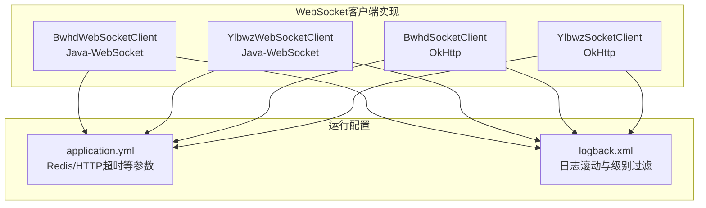
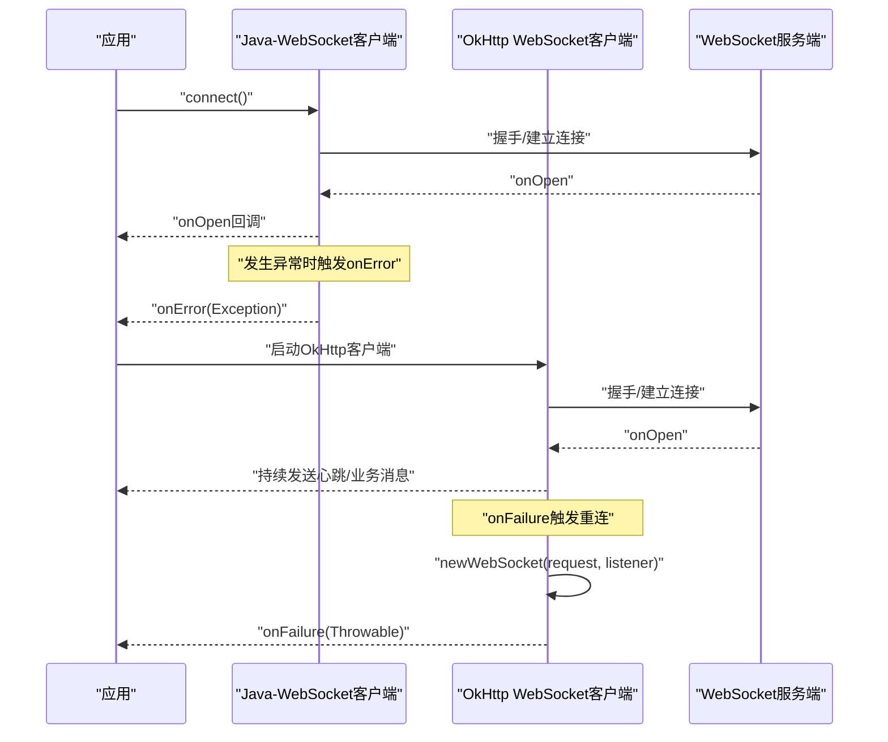
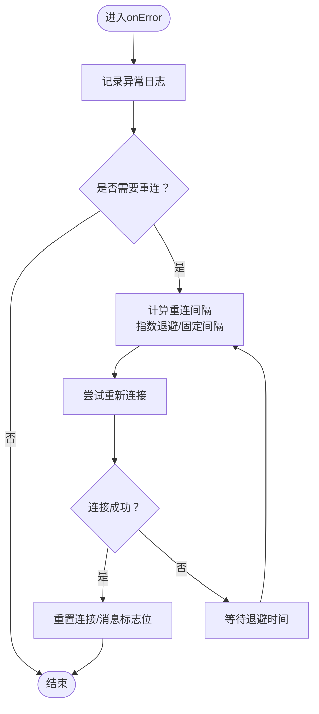
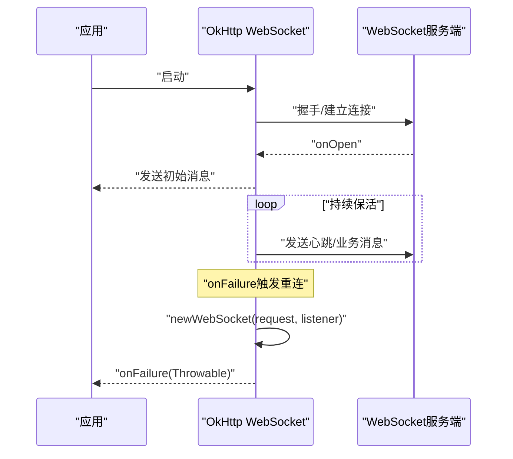
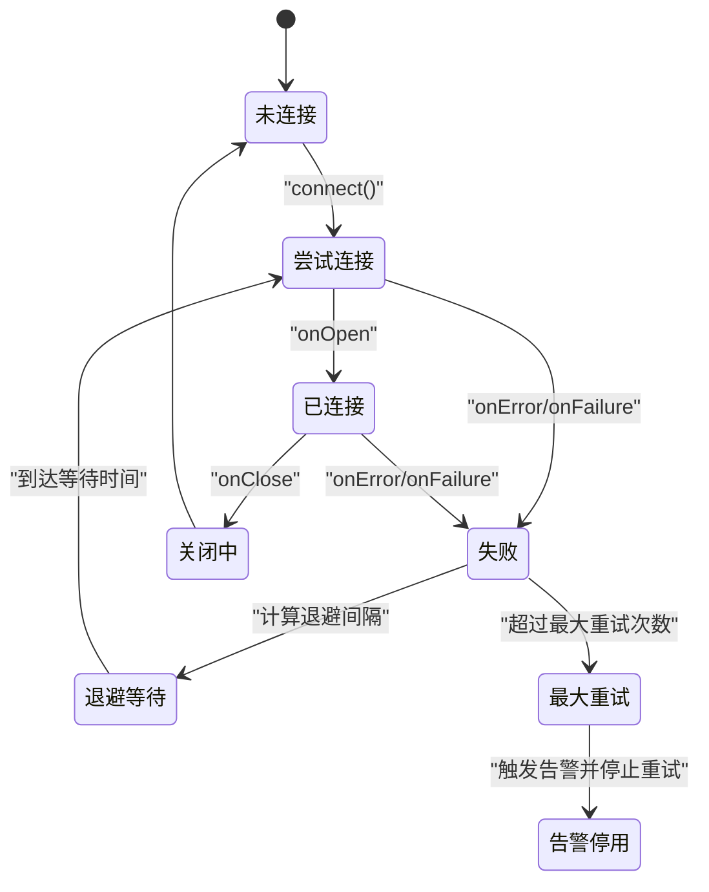
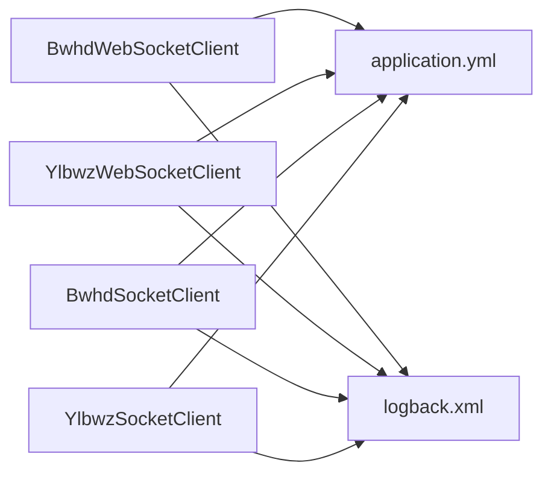

# 错误恢复机制

<cite>
**本文引用的文件**
- [BwhdWebSocketClient.java](file://game-proxy/src/main/java/com/game/gcbwz/BwhdWebSocketClient.java)
- [YlbwzWebSocketClient.java](file://game-proxy/src/main/java/com/game/ylbwz/YlbwzWebSocketClient.java)
- [BwhdSocketClient.java](file://game-proxy/src/main/java/com/game/gcbwz/BwhdSocketClient.java)
- [YlbwzSocketClient.java](file://game-proxy/src/main/java/com/game/ylbwz/YlbwzSocketClient.java)
- [application.yml](file://game-proxy/src/main/resources/application.yml)
- [logback.xml](file://game-proxy/src/main/resources/logback.xml)
</cite>

## 目录
1. [引言](#引言)
2. [项目结构](#项目结构)
3. [核心组件](#核心组件)
4. [架构总览](#架构总览)
5. [组件详细分析](#组件详细分析)
6. [依赖关系分析](#依赖关系分析)
7. [性能考量](#性能考量)
8. [故障排查指南](#故障排查指南)
9. [结论](#结论)
10. [附录](#附录)

## 引言
本文件聚焦于代码库中的WebSocket错误恢复机制，围绕onError回调的错误捕获与处理逻辑展开，系统性阐述连接异常、消息解析异常与网络异常的差异化处理策略；同时给出断线重连的实现现状、可扩展的重连间隔与退避策略建议；并提供连接状态错误恢复流程、错误日志记录与统计、告警机制的落地方案，以及异常分类、错误码定义与故障诊断方法。

## 项目结构
本项目在game-proxy模块中提供了两套WebSocket客户端实现：
- 基于Java-WebSocket库的客户端：古城与幽林两个业务分别实现了自定义WebSocketClient子类，覆盖onOpen/onMessage/onClose/onError等生命周期回调。
- 基于OkHttp的客户端：古城与幽林同样提供了基于OkHttp WebSocket的实现，具备onFailure自动重建连接的能力。

图表来源
- [BwhdWebSocketClient.java](file://game-proxy/src/main/java/com/game/gcbwz/BwhdWebSocketClient.java#L1-L192)
- [YlbwzWebSocketClient.java](file://game-proxy/src/main/java/com/game/ylbwz/YlbwzWebSocketClient.java#L1-L193)
- [BwhdSocketClient.java](file://game-proxy/src/main/java/com/game/gcbwz/BwhdSocketClient.java#L1-L88)
- [YlbwzSocketClient.java](file://game-proxy/src/main/java/com/game/ylbwz/YlbwzSocketClient.java#L1-L103)
- [application.yml](file://game-proxy/src/main/resources/application.yml#L1-L58)
- [logback.xml](file://game-proxy/src/main/resources/logback.xml#L32-L74)

章节来源
- [BwhdWebSocketClient.java](file://game-proxy/src/main/java/com/game/gcbwz/BwhdWebSocketClient.java#L1-L192)
- [YlbwzWebSocketClient.java](file://game-proxy/src/main/java/com/game/ylbwz/YlbwzWebSocketClient.java#L1-L193)
- [BwhdSocketClient.java](file://game-proxy/src/main/java/com/game/gcbwz/BwhdSocketClient.java#L1-L88)
- [YlbwzSocketClient.java](file://game-proxy/src/main/java/com/game/ylbwz/YlbwzSocketClient.java#L1-L103)
- [application.yml](file://game-proxy/src/main/resources/application.yml#L1-L58)
- [logback.xml](file://game-proxy/src/main/resources/logback.xml#L32-L74)

## 核心组件
- 古城WebSocket客户端（Java-WebSocket）
  - 覆盖onOpen/onMessage/onClose/onError等回调，当前onError仅记录日志。
  - 提供connect去重与静态单例获取实例的便捷方法。
- 幽林WebSocket客户端（Java-WebSocket）
  - 同样覆盖关键回调，onError仅记录日志。
  - 提供心跳过滤、开奖消息同步至下游接口的逻辑。
- 古城/幽林OkHttp WebSocket客户端
  - 在onFailure中主动重建WebSocket连接，形成基础的自动重连能力。
  - 持续发送心跳或业务消息维持连接活跃。

章节来源
- [BwhdWebSocketClient.java](file://game-proxy/src/main/java/com/game/gcbwz/BwhdWebSocketClient.java#L64-L131)
- [YlbwzWebSocketClient.java](file://game-proxy/src/main/java/com/game/ylbwz/YlbwzWebSocketClient.java#L67-L138)
- [BwhdSocketClient.java](file://game-proxy/src/main/java/com/game/gcbwz/BwhdSocketClient.java#L69-L72)
- [YlbwzSocketClient.java](file://game-proxy/src/main/java/com/game/ylbwz/YlbwzSocketClient.java#L84-L87)

## 架构总览
下图展示两类客户端的错误恢复路径：Java-WebSocket客户端通过onError记录错误；OkHttp客户端通过onFailure触发重连。

图表来源
- [BwhdWebSocketClient.java](file://game-proxy/src/main/java/com/game/gcbwz/BwhdWebSocketClient.java#L64-L131)
- [YlbwzWebSocketClient.java](file://game-proxy/src/main/java/com/game/ylbwz/YlbwzWebSocketClient.java#L67-L138)
- [BwhdSocketClient.java](file://game-proxy/src/main/java/com/game/gcbwz/BwhdSocketClient.java#L69-L72)
- [YlbwzSocketClient.java](file://game-proxy/src/main/java/com/game/ylbwz/YlbwzSocketClient.java#L84-L87)

## 组件详细分析

### Java-WebSocket客户端（古城/幽林）
- 连接生命周期
  - onOpen：连接建立成功，用于记录状态。
  - onMessage：解析消息，区分心跳与开奖消息；开奖时写入Redis并同步通知下游。
  - onClose：连接关闭，重置连接/消息标志位。
  - onError：当前实现仅记录异常日志，未进行断线重连。
- 断线重连现状
  - 未实现onError后的自动重连逻辑；需在onError中补充重连策略。
- 错误处理要点
  - 心跳消息过滤避免误判为业务消息。
  - 解析异常应捕获并记录，防止影响后续消息处理。
  - 下游同步调用使用RestClientException捕获网络异常。

图表来源
- [BwhdWebSocketClient.java](file://game-proxy/src/main/java/com/game/gcbwz/BwhdWebSocketClient.java#L129-L131)
- [YlbwzWebSocketClient.java](file://game-proxy/src/main/java/com/game/ylbwz/YlbwzWebSocketClient.java#L136-L138)

章节来源
- [BwhdWebSocketClient.java](file://game-proxy/src/main/java/com/game/gcbwz/BwhdWebSocketClient.java#L64-L131)
- [YlbwzWebSocketClient.java](file://game-proxy/src/main/java/com/game/ylbwz/YlbwzWebSocketClient.java#L67-L138)

### OkHttp WebSocket客户端（古城/幽林）
- 连接生命周期
  - onOpen：发送初始业务消息。
  - onMessage：解析消息并执行业务逻辑（心跳过滤、开奖同步）。
  - onClosing：连接关闭阶段。
  - onFailure：发生网络异常时，主动重建WebSocket连接。
- 断线重连现状
  - 在onFailure中通过client.newWebSocket(request, this)实现自动重连，具备基础的错误恢复能力。
- 错误处理要点
  - 通过while循环持续发送心跳或业务消息，维持连接活跃。
  - 失败时重试，无需上层干预。

图表来源
- [BwhdSocketClient.java](file://game-proxy/src/main/java/com/game/gcbwz/BwhdSocketClient.java#L69-L72)
- [YlbwzSocketClient.java](file://game-proxy/src/main/java/com/game/ylbwz/YlbwzSocketClient.java#L84-L87)

章节来源
- [BwhdSocketClient.java](file://game-proxy/src/main/java/com/game/gcbwz/BwhdSocketClient.java#L27-L82)
- [YlbwzSocketClient.java](file://game-proxy/src/main/java/com/game/ylbwz/YlbwzSocketClient.java#L31-L99)

### 错误分类与处理策略
- 连接异常
  - 表现：握手失败、连接被拒、网络不可达。
  - 处理：记录日志；对Java-WebSocket客户端，在onError中实现指数退避重连；对OkHttp客户端，利用onFailure自动重连。
- 消息解析异常
  - 表现：JSON解析失败、字段缺失、类型不匹配。
  - 处理：捕获解析异常，记录上下文信息，丢弃异常消息，避免影响后续消息处理。
- 网络异常
  - 表现：连接中断、心跳超时、发送失败。
  - 处理：对Java-WebSocket客户端在onError中触发重连；对OkHttp客户端在onFailure中重建连接；必要时增加最大重试次数与退避上限。

章节来源
- [BwhdWebSocketClient.java](file://game-proxy/src/main/java/com/game/gcbwz/BwhdWebSocketClient.java#L74-L102)
- [YlbwzWebSocketClient.java](file://game-proxy/src/main/java/com/game/ylbwz/YlbwzWebSocketClient.java#L77-L105)
- [BwhdSocketClient.java](file://game-proxy/src/main/java/com/game/gcbwz/BwhdSocketClient.java#L69-L72)
- [YlbwzSocketClient.java](file://game-proxy/src/main/java/com/game/ylbwz/YlbwzSocketClient.java#L84-L87)

### 断线重连机制设计（建议）
- 重连间隔设置
  - 固定间隔：适用于快速恢复场景，降低复杂度。
  - 指数退避：逐步延长重连间隔，减轻服务端压力；建议上限阈值。
- 最大重试次数
  - 配置化上限，超过后触发告警并停止重试，避免资源浪费。
- 退避算法
  - 建议采用“基础间隔 + 指数增长 + 抖动”策略，避免雪崩效应。
- 状态管理
  - 使用原子布尔位标记连接状态，避免重复连接。
  - 在onClose/onError/onFailure中统一重置状态，确保幂等。

章节来源
- [BwhdWebSocketClient.java](file://game-proxy/src/main/java/com/game/gcbwz/BwhdWebSocketClient.java#L134-L139)
- [YlbwzWebSocketClient.java](file://game-proxy/src/main/java/com/game/ylbwz/YlbwzWebSocketClient.java#L141-L146)

### 连接状态错误恢复流程（建议）

图表来源
- [BwhdWebSocketClient.java](file://game-proxy/src/main/java/com/game/gcbwz/BwhdWebSocketClient.java#L117-L131)
- [YlbwzWebSocketClient.java](file://game-proxy/src/main/java/com/game/ylbwz/YlbwzWebSocketClient.java#L124-L138)
- [BwhdSocketClient.java](file://game-proxy/src/main/java/com/game/gcbwz/BwhdSocketClient.java#L69-L72)
- [YlbwzSocketClient.java](file://game-proxy/src/main/java/com/game/ylbwz/YlbwzSocketClient.java#L84-L87)

## 依赖关系分析
- 配置依赖
  - Redis连接与超时、HTTP客户端超时参数由application.yml集中配置，直接影响WebSocket客户端的稳定性与性能。
- 日志依赖
  - logback.xml配置了INFO/ERROR级别的日志输出与滚动策略，onError/onFailure均通过日志记录，便于问题定位。
- 组件耦合
  - Java-WebSocket客户端与OkHttp客户端在功能层面互补：前者更易扩展业务回调，后者具备自动重连能力。

图表来源
- [application.yml](file://game-proxy/src/main/resources/application.yml#L15-L57)
- [logback.xml](file://game-proxy/src/main/resources/logback.xml#L32-L74)
- [BwhdWebSocketClient.java](file://game-proxy/src/main/java/com/game/gcbwz/BwhdWebSocketClient.java#L1-L192)
- [YlbwzWebSocketClient.java](file://game-proxy/src/main/java/com/game/ylbwz/YlbwzWebSocketClient.java#L1-L193)
- [BwhdSocketClient.java](file://game-proxy/src/main/java/com/game/gcbwz/BwhdSocketClient.java#L1-L88)
- [YlbwzSocketClient.java](file://game-proxy/src/main/java/com/game/ylbwz/YlbwzSocketClient.java#L1-L103)

章节来源
- [application.yml](file://game-proxy/src/main/resources/application.yml#L15-L57)
- [logback.xml](file://game-proxy/src/main/resources/logback.xml#L32-L74)

## 性能考量
- 连接池与超时
  - HTTP客户端超时参数（连接超时、Socket超时、连接请求超时）影响WebSocket初始化与消息同步的稳定性。
- 日志级别与滚动
  - ERROR级别日志单独落盘，有助于快速定位异常；INFO日志过多可能带来IO压力。
- 重连策略
  - 合理设置退避上限与最大重试次数，避免频繁重连导致CPU与网络抖动。

章节来源
- [application.yml](file://game-proxy/src/main/resources/application.yml#L44-L57)
- [logback.xml](file://game-proxy/src/main/resources/logback.xml#L32-L74)

## 故障排查指南
- 常见症状与定位
  - 连接无法建立：检查onError日志与握手参数；确认服务端可达与证书/域名配置。
  - 连接偶发中断：关注onFailure日志；评估网络波动与心跳发送频率。
  - 消息解析失败：检查JSON结构变化；在onError中补充解析异常捕获与上下文记录。
- 日志与监控
  - 使用ERROR级别日志定位异常；结合业务日志（如“设置开奖时间”）判断消息处理链路。
  - 建议在onError/onFailure中增加错误计数器与告警上报（例如上报到监控系统或钉钉机器人）。
- 重试与退避
  - 对Java-WebSocket客户端补充onError中的重连逻辑；对OkHttp客户端验证onFailure重连是否生效。
  - 设置最大重试次数与退避上限，避免无限重试造成资源耗尽。

章节来源
- [BwhdWebSocketClient.java](file://game-proxy/src/main/java/com/game/gcbwz/BwhdWebSocketClient.java#L129-L131)
- [YlbwzWebSocketClient.java](file://game-proxy/src/main/java/com/game/ylbwz/YlbwzWebSocketClient.java#L136-L138)
- [BwhdSocketClient.java](file://game-proxy/src/main/java/com/game/gcbwz/BwhdSocketClient.java#L69-L72)
- [YlbwzSocketClient.java](file://game-proxy/src/main/java/com/game/ylbwz/YlbwzSocketClient.java#L84-L87)

## 结论
当前代码库在OkHttp WebSocket客户端上已具备基础的自动重连能力，而在Java-WebSocket客户端上，onError回调仅记录日志，尚未实现断线重连。建议在Java-WebSocket客户端的onError中引入指数退避重连策略，并完善消息解析异常与网络异常的分类处理；同时结合配置与日志体系，构建完善的错误统计与告警机制，以提升系统的鲁棒性与可观测性。

## 附录

### 错误日志记录与统计（建议）
- 日志记录
  - 在onError/onFailure中记录异常堆栈、连接状态、消息上下文。
- 错误统计
  - 统计各类异常数量与占比，输出到指标系统或文件。
- 告警机制
  - 当连续失败次数超过阈值或累计错误率过高时触发告警。

章节来源
- [logback.xml](file://game-proxy/src/main/resources/logback.xml#L32-L74)

### 错误码定义（建议）
- 连接异常
  - 1001：握手失败
  - 1002：连接被拒
  - 1003：网络不可达
- 消息解析异常
  - 2001：JSON解析失败
  - 2002：字段缺失
- 网络异常
  - 3001：心跳超时
  - 3002：发送失败
  - 3003：连接中断

章节来源
- [BwhdWebSocketClient.java](file://game-proxy/src/main/java/com/game/gcbwz/BwhdWebSocketClient.java#L74-L102)
- [YlbwzWebSocketClient.java](file://game-proxy/src/main/java/com/game/ylbwz/YlbwzWebSocketClient.java#L77-L105)