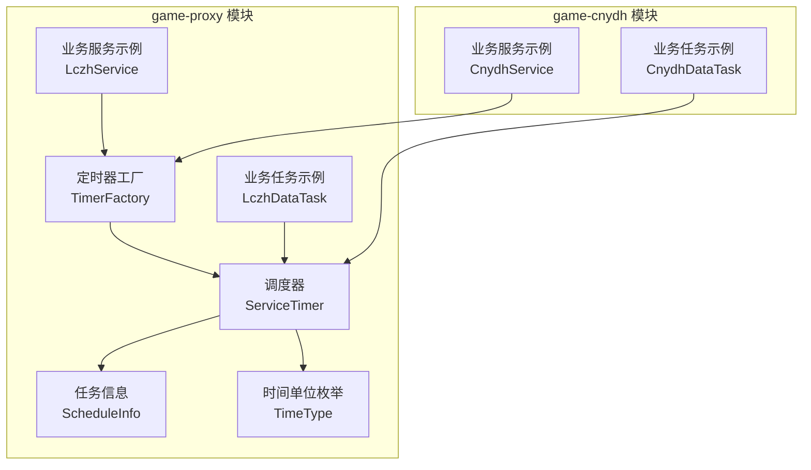
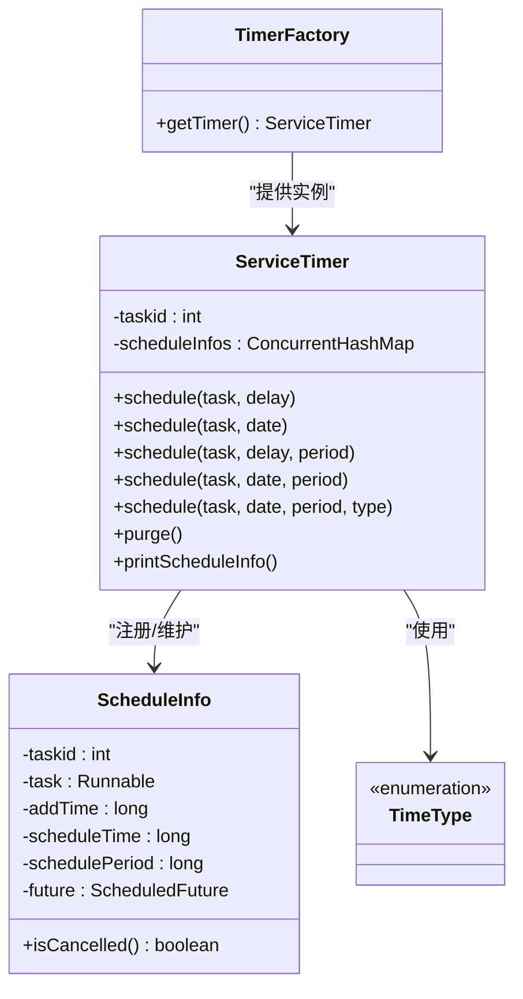
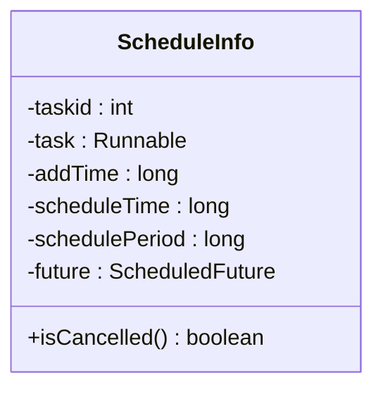
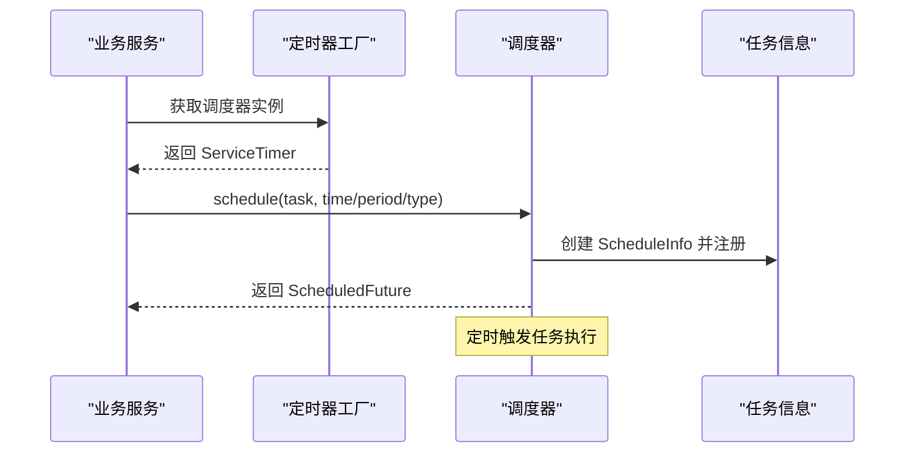
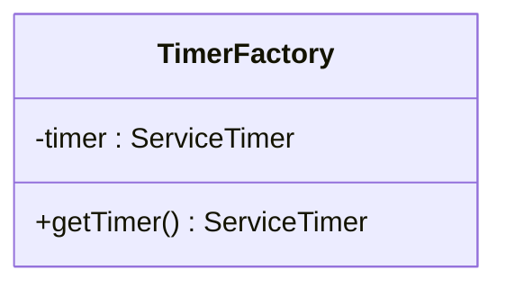
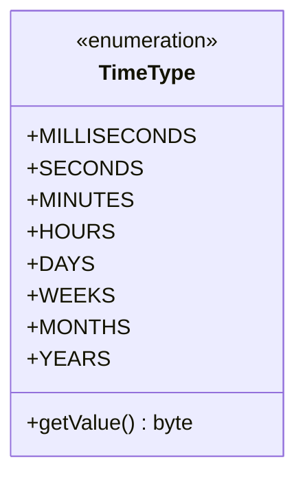
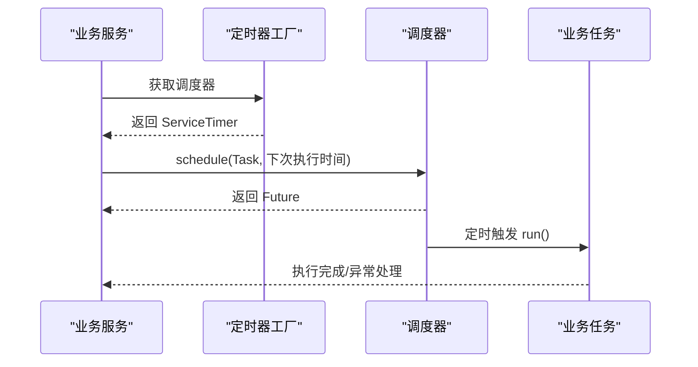
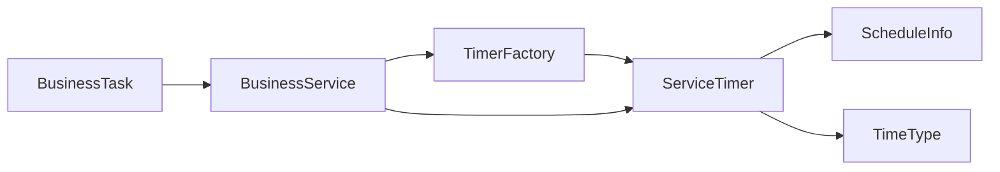

# 任务扩展机制

<cite>
**本文引用的文件**
- [ScheduleInfo.java](file://game-proxy/src/main/java/com/game/timer/ScheduleInfo.java)
- [ServiceTimer.java](file://game-proxy/src/main/java/com/game/timer/ServiceTimer.java)
- [TimerFactory.java](file://game-proxy/src/main/java/com/game/timer/TimerFactory.java)
- [TimeType.java](file://game-proxy/src/main/java/com/game/timer/TimeType.java)
- [ScheduleInfo.java](file://game-cnydh/src/main/java/com/utils/ScheduleInfo.java)
- [ServiceTimer.java](file://game-cnydh/src/main/java/com/utils/ServiceTimer.java)
- [TimerFactory.java](file://game-cnydh/src/main/java/com/utils/TimerFactory.java)
- [CnydhDataTask.java](file://game-cnydh/src/main/java/com/cnydh/cnydh/CnydhDataTask.java)
- [CnydhService.java](file://game-cnydh/src/main/java/com/cnydh/cnydh/CnydhService.java)
- [LczhDataTask.java](file://game-proxy/src/main/java/com/game/ympd/lczh/LczhDataTask.java)
- [LczhService.java](file://game-proxy/src/main/java/com/game/ympd/lczh/LczhService.java)
</cite>

## 目录
1. [引言](#引言)
2. [项目结构](#项目结构)
3. [核心组件](#核心组件)
4. [架构总览](#架构总览)
5. [详细组件分析](#详细组件分析)
6. [依赖关系分析](#依赖关系分析)
7. [性能与资源控制](#性能与资源控制)
8. [监控与诊断](#监控与诊断)
9. [扩展开发指南](#扩展开发指南)
10. [安全与最佳实践](#安全与最佳实践)
11. [结论](#结论)

## 引言
本文件面向需要在现有定时任务系统上进行扩展与二次开发的工程师，系统性阐述定时任务扩展机制的设计与实现要点，包括：
- 如何创建自定义任务类型并集成到系统中
- ScheduleInfo 模型的扩展点（新增自定义任务属性与行为）
- 任务优先级管理机制与调度策略
- 任务资源控制与限制（最大任务数、内存与CPU占用）
- 任务监控与诊断工具的使用方法
- 从简单任务到复杂业务逻辑的扩展开发流程
- 安全考虑与最佳实践

## 项目结构
定时任务系统主要分布在两个模块中：
- game-proxy 模块：提供统一的任务调度器、任务信息封装与工厂类
- game-cnydh 模块：提供基于统一调度器的具体业务任务与服务

图表来源
- [TimerFactory.java](file://game-proxy/src/main/java/com/game/timer/TimerFactory.java#L1-L11)
- [ServiceTimer.java](file://game-proxy/src/main/java/com/game/timer/ServiceTimer.java#L1-L164)
- [ScheduleInfo.java](file://game-proxy/src/main/java/com/game/timer/ScheduleInfo.java#L1-L66)
- [TimeType.java](file://game-proxy/src/main/java/com/game/timer/TimeType.java#L1-L24)
- [LczhDataTask.java](file://game-proxy/src/main/java/com/game/ympd/lczh/LczhDataTask.java#L1-L37)
- [LczhService.java](file://game-proxy/src/main/java/com/game/ympd/lczh/LczhService.java#L1-L137)
- [CnydhDataTask.java](file://game-cnydh/src/main/java/com/cnydh/cnydh/CnydhDataTask.java#L1-L36)
- [CnydhService.java](file://game-cnydh/src/main/java/com/cnydh/cnydh/CnydhService.java#L1-L143)

章节来源
- [TimerFactory.java](file://game-proxy/src/main/java/com/game/timer/TimerFactory.java#L1-L11)
- [ServiceTimer.java](file://game-proxy/src/main/java/com/game/timer/ServiceTimer.java#L1-L164)
- [ScheduleInfo.java](file://game-proxy/src/main/java/com/game/timer/ScheduleInfo.java#L1-L66)
- [TimeType.java](file://game-proxy/src/main/java/com/game/timer/TimeType.java#L1-L24)
- [CnydhDataTask.java](file://game-cnydh/src/main/java/com/cnydh/cnydh/CnydhDataTask.java#L1-L36)
- [CnydhService.java](file://game-cnydh/src/main/java/com/cnydh/cnydh/CnydhService.java#L1-L143)
- [LczhDataTask.java](file://game-proxy/src/main/java/com/game/ympd/lczh/LczhDataTask.java#L1-L37)
- [LczhService.java](file://game-proxy/src/main/java/com/game/ympd/lczh/LczhService.java#L1-L137)

## 核心组件
- TimerFactory：全局单例的定时器工厂，提供统一的 ServiceTimer 获取入口
- ServiceTimer：基于 ScheduledThreadPoolExecutor 的扩展调度器，负责任务注册、周期调度与清理
- ScheduleInfo：任务信息载体，记录任务标识、执行体、入队时间、计划执行时间、周期等
- TimeType：时间单位枚举，支持毫秒至年级别的周期转换
- 业务任务与服务：通过实现 Runnable 并由业务服务触发调度

章节来源
- [TimerFactory.java](file://game-proxy/src/main/java/com/game/timer/TimerFactory.java#L1-L11)
- [ServiceTimer.java](file://game-proxy/src/main/java/com/game/timer/ServiceTimer.java#L1-L164)
- [ScheduleInfo.java](file://game-proxy/src/main/java/com/game/timer/ScheduleInfo.java#L1-L66)
- [TimeType.java](file://game-proxy/src/main/java/com/game/timer/TimeType.java#L1-L24)

## 架构总览
定时任务系统采用“工厂 + 调度器 + 任务信息 + 业务任务”的分层架构：
- 工厂层：提供全局唯一调度器实例
- 调度层：封装 ScheduledThreadPoolExecutor，提供多种 schedule 重载与周期任务支持
- 数据层：以 ScheduleInfo 封装任务元数据，便于查询与清理
- 业务层：业务服务通过工厂获取调度器，提交 Runnable 任务

图表来源
- [TimerFactory.java](file://game-proxy/src/main/java/com/game/timer/TimerFactory.java#L1-L11)
- [ServiceTimer.java](file://game-proxy/src/main/java/com/game/timer/ServiceTimer.java#L1-L164)
- [ScheduleInfo.java](file://game-proxy/src/main/java/com/game/timer/ScheduleInfo.java#L1-L66)
- [TimeType.java](file://game-proxy/src/main/java/com/game/timer/TimeType.java#L1-L24)

## 详细组件分析

### ScheduleInfo 组件分析
- 角色定位：承载单个任务的元信息，包括任务标识、执行体、入队时间、计划执行时间、周期与 Future 句柄
- 关键字段与方法：
  - 任务标识与执行体：用于区分不同任务与定位执行逻辑
  - 时间戳：入队时间与计划执行时间，便于统计与诊断
  - 周期：支持固定频率重复执行
  - Future：与底层 ScheduledFuture 绑定，用于判断取消与完成状态
- 扩展点建议：
  - 新增自定义任务属性：如任务来源、优先级、重试次数上限、标签等
  - 新增行为：如任务执行前后的钩子、统计上报、熔断保护等

图表来源
- [ScheduleInfo.java](file://game-proxy/src/main/java/com/game/timer/ScheduleInfo.java#L1-L66)

章节来源
- [ScheduleInfo.java](file://game-proxy/src/main/java/com/game/timer/ScheduleInfo.java#L1-L66)

### ServiceTimer 组件分析
- 角色定位：调度器核心，继承 ScheduledThreadPoolExecutor，提供多重重载的 schedule 方法与周期任务支持
- 关键能力：
  - 多种 schedule 重载：支持按延迟、绝对时间、固定周期、带时间单位的周期
  - 元信息维护：将 ScheduleInfo 注册到并发映射表，便于查询与清理
  - 自动清理：定期扫描并移除已取消或已完成的任务
  - 统计输出：提供 printScheduleInfo 输出当前所有任务的基本信息
- 线程池大小：构造函数中设置固定大小的线程池，用于统一调度

图表来源
- [ServiceTimer.java](file://game-proxy/src/main/java/com/game/timer/ServiceTimer.java#L1-L164)
- [TimerFactory.java](file://game-proxy/src/main/java/com/game/timer/TimerFactory.java#L1-L11)

章节来源
- [ServiceTimer.java](file://game-proxy/src/main/java/com/game/timer/ServiceTimer.java#L1-L164)
- [TimerFactory.java](file://game-proxy/src/main/java/com/game/timer/TimerFactory.java#L1-L11)

### TimerFactory 组件分析
- 角色定位：全局单例，提供统一的 ServiceTimer 获取入口
- 设计要点：避免多实例导致的调度混乱；集中管理线程池配置

图表来源
- [TimerFactory.java](file://game-proxy/src/main/java/com/game/timer/TimerFactory.java#L1-L11)

章节来源
- [TimerFactory.java](file://game-proxy/src/main/java/com/game/timer/TimerFactory.java#L1-L11)

### TimeType 组件分析
- 角色定位：时间单位枚举，提供从相对单位到毫秒的转换
- 支持单位：毫秒、秒、分钟、小时、天、周、月、年
- 使用场景：配合 schedule 的周期参数，实现灵活的周期任务

图表来源
- [TimeType.java](file://game-proxy/src/main/java/com/game/timer/TimeType.java#L1-L24)

章节来源
- [TimeType.java](file://game-proxy/src/main/java/com/game/timer/TimeType.java#L1-L24)

### 业务任务与服务示例分析
- CnydhDataTask：根据类型选择调用不同业务方法，并处理异常
- LczhDataTask：支持带次数的循环尝试，直到成功或达到上限
- 业务服务：通过 TimerFactory 获取调度器，按业务逻辑计算下次执行时间并提交任务

图表来源
- [CnydhService.java](file://game-cnydh/src/main/java/com/cnydh/cnydh/CnydhService.java#L1-L143)
- [CnydhDataTask.java](file://game-cnydh/src/main/java/com/cnydh/cnydh/CnydhDataTask.java#L1-L36)
- [LczhService.java](file://game-proxy/src/main/java/com/game/ympd/lczh/LczhService.java#L1-L137)
- [LczhDataTask.java](file://game-proxy/src/main/java/com/game/ympd/lczh/LczhDataTask.java#L1-L37)

章节来源
- [CnydhService.java](file://game-cnydh/src/main/java/com/cnydh/cnydh/CnydhService.java#L1-L143)
- [CnydhDataTask.java](file://game-cnydh/src/main/java/com/cnydh/cnydh/CnydhDataTask.java#L1-L36)
- [LczhService.java](file://game-proxy/src/main/java/com/game/ympd/lczh/LczhService.java#L1-L137)
- [LczhDataTask.java](file://game-proxy/src/main/java/com/game/ympd/lczh/LczhDataTask.java#L1-L37)

## 依赖关系分析
- TimerFactory 依赖 ServiceTimer，提供全局唯一实例
- ServiceTimer 依赖 ScheduleInfo 维护任务元信息，依赖 TimeType 进行周期换算
- 业务服务通过 TimerFactory 获取调度器，提交 Runnable 任务
- 业务任务实现 Runnable 接口，持有业务服务引用以执行具体逻辑

图表来源
- [TimerFactory.java](file://game-proxy/src/main/java/com/game/timer/TimerFactory.java#L1-L11)
- [ServiceTimer.java](file://game-proxy/src/main/java/com/game/timer/ServiceTimer.java#L1-L164)
- [ScheduleInfo.java](file://game-proxy/src/main/java/com/game/timer/ScheduleInfo.java#L1-L66)
- [TimeType.java](file://game-proxy/src/main/java/com/game/timer/TimeType.java#L1-L24)

章节来源
- [TimerFactory.java](file://game-proxy/src/main/java/com/game/timer/TimerFactory.java#L1-L11)
- [ServiceTimer.java](file://game-proxy/src/main/java/com/game/timer/ServiceTimer.java#L1-L164)
- [ScheduleInfo.java](file://game-proxy/src/main/java/com/game/timer/ScheduleInfo.java#L1-L66)
- [TimeType.java](file://game-proxy/src/main/java/com/game/timer/TimeType.java#L1-L24)

## 性能与资源控制
- 线程池规模：调度器构造函数中固定线程池大小，统一控制并发度
- 任务清理：定期清理已取消或已完成的任务，避免内存泄漏
- 周期任务：通过 scheduleAtFixedRate 实现固定周期任务，注意任务执行耗时对周期的影响
- 资源限制建议：
  - 最大任务数量：可在业务层引入队列与令牌桶限流，避免瞬时爆发
  - 内存使用：避免在 Runnable 中持有过大的对象引用，及时释放
  - CPU 占用：对长耗时任务拆分、异步化，必要时引入降级策略

章节来源
- [ServiceTimer.java](file://game-proxy/src/main/java/com/game/timer/ServiceTimer.java#L1-L164)

## 监控与诊断
- 任务统计：ServiceTimer 提供 printScheduleInfo 输出任务基本信息，可用于日志采集与可视化
- 清理机制：purge 方法定期清理无效任务，降低内存压力
- 业务层监控：业务服务可记录任务执行时间、成功率、异常堆栈等指标

章节来源
- [ServiceTimer.java](file://game-proxy/src/main/java/com/game/timer/ServiceTimer.java#L142-L162)

## 扩展开发指南

### 1. 创建自定义任务类型
- 步骤
  - 实现 Runnable 接口，编写 run() 逻辑
  - 在业务服务中通过 TimerFactory.getTimer() 获取调度器
  - 计算下次执行时间或周期，调用 schedule 提交任务
- 示例参考
  - CnydhDataTask 与 LczhDataTask 的实现模式
  - 业务服务中对 schedule 的调用方式

章节来源
- [CnydhDataTask.java](file://game-cnydh/src/main/java/com/cnydh/cnydh/CnydhDataTask.java#L1-L36)
- [LczhDataTask.java](file://game-proxy/src/main/java/com/game/ympd/lczh/LczhDataTask.java#L1-L37)
- [CnydhService.java](file://game-cnydh/src/main/java/com/cnydh/cnydh/CnydhService.java#L69-L70)
- [LczhService.java](file://game-proxy/src/main/java/com/game/ympd/lczh/LczhService.java#L68-L69)

### 2. 扩展 ScheduleInfo 模型
- 新增自定义属性
  - 在 ScheduleInfo 中增加字段（如优先级、来源、标签等）
  - 在 ServiceTimer 的 schedule 重载中初始化该字段
- 新增行为
  - 在 run() 前后加入钩子，如统计上报、熔断保护
  - 对异常进行分类处理与重试策略

章节来源
- [ScheduleInfo.java](file://game-proxy/src/main/java/com/game/timer/ScheduleInfo.java#L1-L66)
- [ServiceTimer.java](file://game-proxy/src/main/java/com/game/timer/ServiceTimer.java#L26-L81)

### 3. 任务优先级管理与调度策略
- 当前实现
  - 未内置优先级队列，所有任务共享同一线程池
- 建议策略
  - 业务层在提交任务时按优先级分组，分别调度
  - 或引入多个调度器实例，按优先级隔离执行
  - 对高优先级任务采用更短的周期与更少的重试延迟

章节来源
- [ServiceTimer.java](file://game-proxy/src/main/java/com/game/timer/ServiceTimer.java#L1-L164)

### 4. 任务资源控制与限制
- 最大任务数量
  - 在业务层维护任务队列长度，超过阈值拒绝或降级
- 内存使用
  - 避免在任务中持有大对象，及时释放
- CPU 占用
  - 将长耗时操作异步化，拆分为多个小任务
  - 对周期任务进行抖动处理，避免同时触发

章节来源
- [ServiceTimer.java](file://game-proxy/src/main/java/com/game/timer/ServiceTimer.java#L100-L113)

### 5. 任务监控与诊断
- 使用 printScheduleInfo 输出任务列表，结合日志系统进行可视化
- 在业务服务中记录任务执行耗时、异常次数与成功率
- 定期巡检 scheduleInfos 映射表，发现异常任务及时处理

章节来源
- [ServiceTimer.java](file://game-proxy/src/main/java/com/game/timer/ServiceTimer.java#L142-L162)

### 6. 代码示例路径
- 自定义任务实现：参见 [CnydhDataTask.java](file://game-cnydh/src/main/java/com/cnydh/cnydh/CnydhDataTask.java#L1-L36)、[LczhDataTask.java](file://game-proxy/src/main/java/com/game/ympd/lczh/LczhDataTask.java#L1-L37)
- 业务服务调度：参见 [CnydhService.java](file://game-cnydh/src/main/java/com/cnydh/cnydh/CnydhService.java#L69-L70)、[LczhService.java](file://game-proxy/src/main/java/com/game/ympd/lczh/LczhService.java#L68-L69)
- 调度器与工厂：参见 [ServiceTimer.java](file://game-proxy/src/main/java/com/game/timer/ServiceTimer.java#L1-L164)、[TimerFactory.java](file://game-proxy/src/main/java/com/game/timer/TimerFactory.java#L1-L11)

## 安全与最佳实践
- 安全考虑
  - 任务输入校验：对来自外部的参数进行严格校验与限流
  - 权限控制：确保任务执行具备必要的访问权限
  - 日志脱敏：避免在日志中打印敏感信息
- 最佳实践
  - 任务幂等：保证重复执行不会产生副作用
  - 超时与重试：为任务设置合理的超时与重试策略
  - 分批与抖动：对批量任务进行分批与随机抖动，避免瞬时峰值
  - 监控告警：建立完善的监控与告警体系，及时发现异常

## 结论
该定时任务系统以统一的调度器与任务信息模型为核心，提供了清晰的扩展点与良好的可维护性。通过业务服务与任务实现的解耦，开发者可以快速扩展新的任务类型并集成到现有调度框架中。建议在实际生产环境中进一步完善优先级调度、资源限制与监控告警体系，以满足更高性能与可靠性要求。