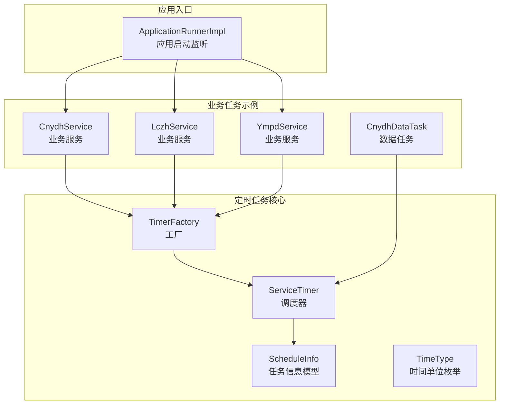
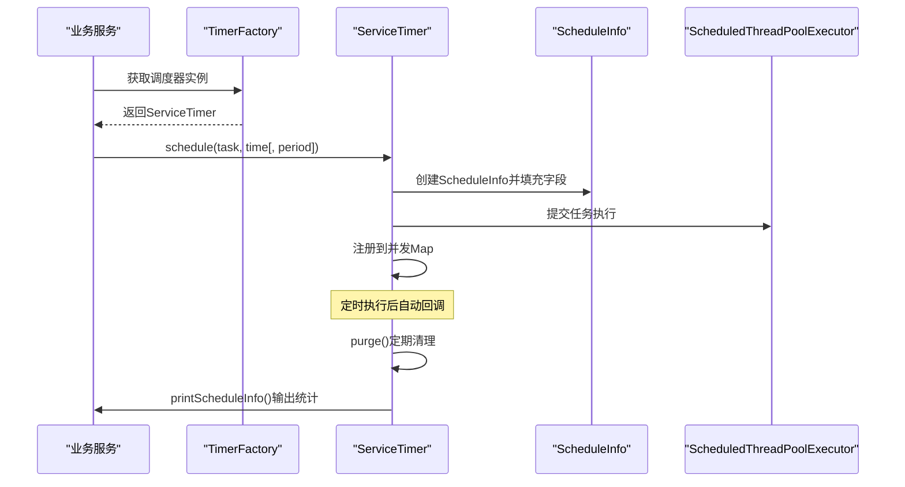
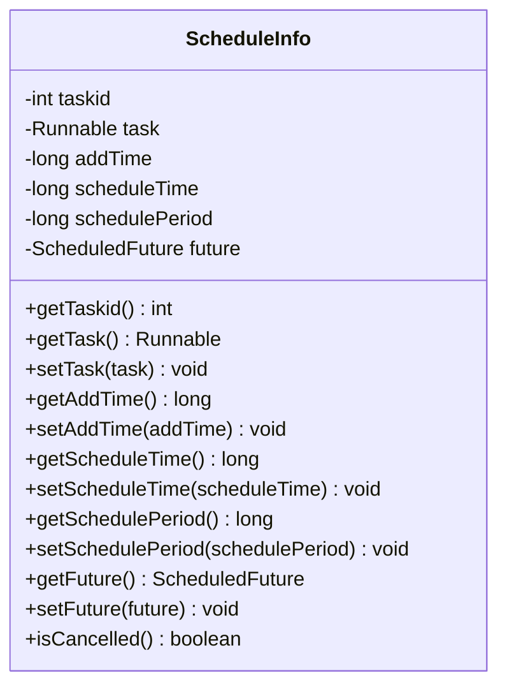
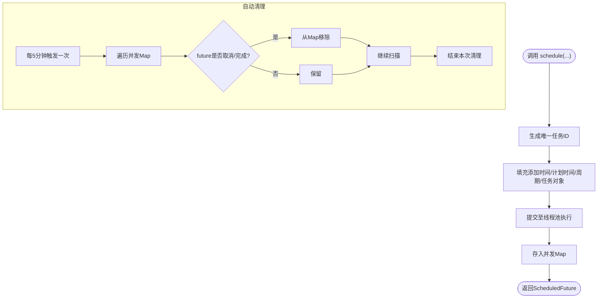
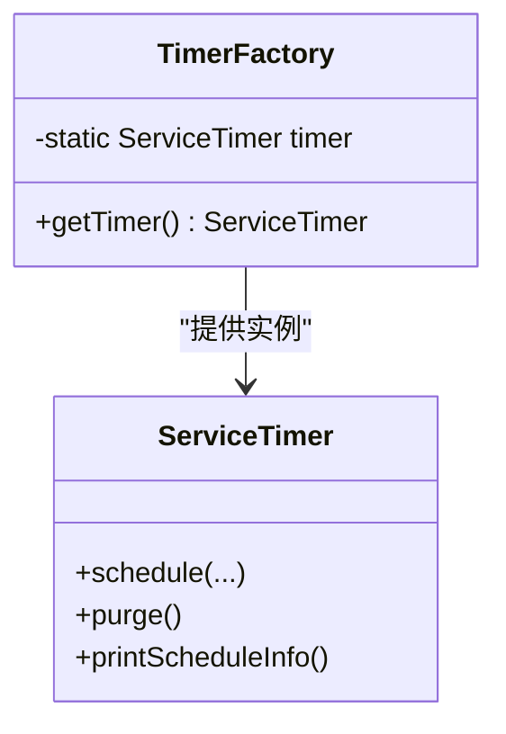
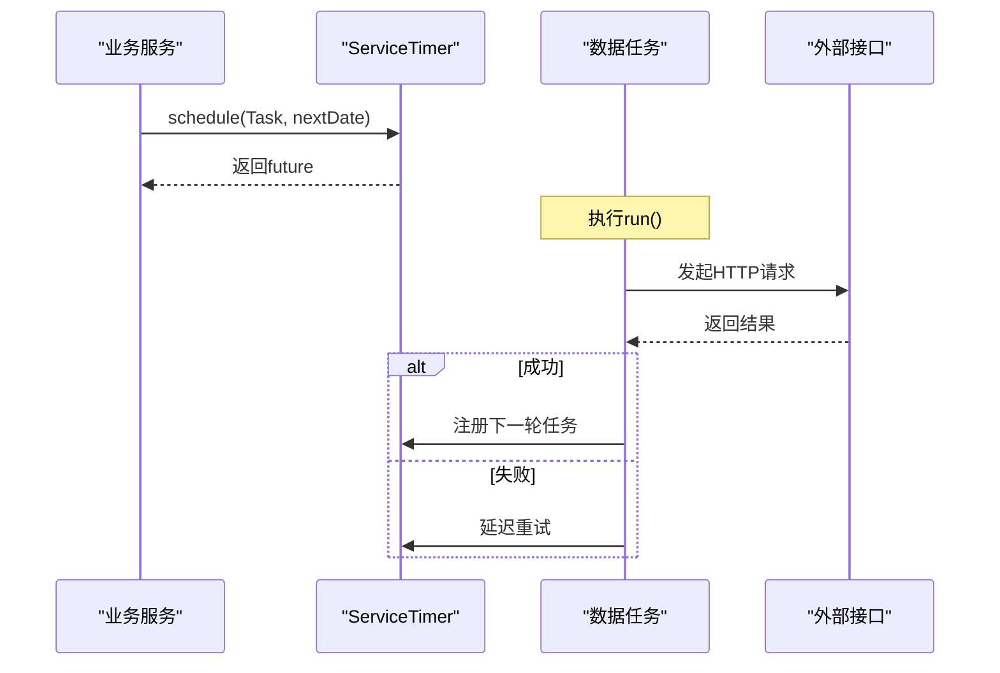
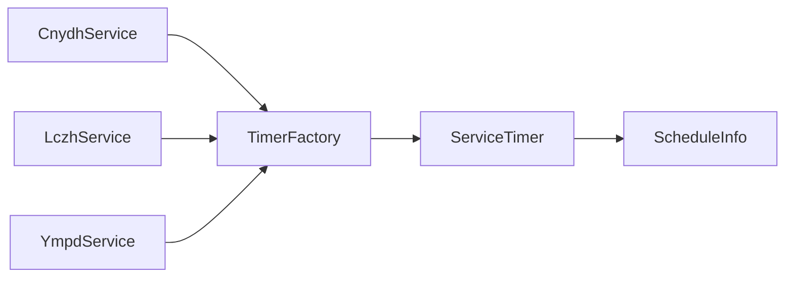

# 任务生命周期管理

<cite>
**本文引用的文件**
- [ScheduleInfo.java](file://game-proxy/src/main/java/com/game/timer/ScheduleInfo.java)
- [ServiceTimer.java](file://game-proxy/src/main/java/com/game/timer/ServiceTimer.java)
- [TimerFactory.java](file://game-proxy/src/main/java/com/game/timer/TimerFactory.java)
- [TimeType.java](file://game-proxy/src/main/java/com/game/timer/TimeType.java)
- [CnydhDataTask.java](file://game-cnydh/src/main/java/com/cnydh/cnydh/CnydhDataTask.java)
- [CnydhService.java](file://game-cnydh/src/main/java/com/cnydh/cnydh/CnydhService.java)
- [LczhService.java](file://game-proxy/src/main/java/com/game/ympd/lczh/LczhService.java)
- [YmpdService.java](file://game-proxy/src/main/java/com/game/ympd/YmpdService.java)
- [ApplicationRunnerImpl.java](file://game-proxy/src/main/java/com/game/listener/ApplicationRunnerImpl.java)
</cite>

## 目录
1. [引言](#引言)
2. [项目结构](#项目结构)
3. [核心组件](#核心组件)
4. [架构总览](#架构总览)
5. [详细组件分析](#详细组件分析)
6. [依赖关系分析](#依赖关系分析)
7. [性能考量](#性能考量)
8. [故障排查指南](#故障排查指南)
9. [结论](#结论)

## 引言
本文件围绕定时任务的完整生命周期进行系统化技术文档编写，涵盖任务从创建、注册、执行、监控到清理的全过程。重点解析任务信息模型ScheduleInfo的设计与职责，阐述任务状态管理（未执行、执行中、已完成、已取消）及状态转换逻辑；详细说明任务执行监控与统计能力（printScheduleInfo方法），并给出任务取消与自动清理策略（手动取消与自动清理）。最后提供异常处理与故障恢复建议，帮助读者在复杂业务场景下安全、稳定地使用定时任务框架。

## 项目结构
该仓库包含多个子模块，其中与定时任务生命周期管理直接相关的核心位于game-proxy模块的timer包，以及game-cnydh模块中的具体业务任务实现。整体结构如下：

图表来源
- [ServiceTimer.java](file://game-proxy/src/main/java/com/game/timer/ServiceTimer.java#L16-L24)
- [TimerFactory.java](file://game-proxy/src/main/java/com/game/timer/TimerFactory.java#L3-L10)
- [ScheduleInfo.java](file://game-proxy/src/main/java/com/game/timer/ScheduleInfo.java#L5-L16)
- [TimeType.java](file://game-proxy/src/main/java/com/game/timer/TimeType.java#L3-L23)
- [CnydhService.java](file://game-cnydh/src/main/java/com/cnydh/cnydh/CnydhService.java#L36-L82)
- [CnydhDataTask.java](file://game-cnydh/src/main/java/com/cnydh/cnydh/CnydhDataTask.java#L6-L35)
- [LczhService.java](file://game-proxy/src/main/java/com/game/ympd/lczh/LczhService.java#L40-L77)
- [YmpdService.java](file://game-proxy/src/main/java/com/game/ympd/YmpdService.java#L58-L77)
- [ApplicationRunnerImpl.java](file://game-proxy/src/main/java/com/game/listener/ApplicationRunnerImpl.java#L64-L145)

章节来源
- [ServiceTimer.java](file://game-proxy/src/main/java/com/game/timer/ServiceTimer.java#L16-L24)
- [TimerFactory.java](file://game-proxy/src/main/java/com/game/timer/TimerFactory.java#L3-L10)
- [ApplicationRunnerImpl.java](file://game-proxy/src/main/java/com/game/listener/ApplicationRunnerImpl.java#L64-L145)

## 核心组件
- ScheduleInfo：封装单个定时任务的关键信息，包括任务ID、任务对象、添加时间、计划执行时间、执行周期、以及底层ScheduledFuture句柄，用于后续状态查询与清理。
- ServiceTimer：基于ScheduledThreadPoolExecutor扩展的调度器，负责任务注册、周期性调度、自动清理与监控打印。
- TimerFactory：提供全局唯一调度器实例的访问入口，确保各业务模块共享同一调度资源。
- TimeType：定义时间单位枚举，支持毫秒、秒、分、时、日、周、月、年等，便于统一换算为毫秒。

章节来源
- [ScheduleInfo.java](file://game-proxy/src/main/java/com/game/timer/ScheduleInfo.java#L5-L65)
- [ServiceTimer.java](file://game-proxy/src/main/java/com/game/timer/ServiceTimer.java#L16-L163)
- [TimerFactory.java](file://game-proxy/src/main/java/com/game/timer/TimerFactory.java#L3-L10)
- [TimeType.java](file://game-proxy/src/main/java/com/game/timer/TimeType.java#L3-L23)

## 架构总览
定时任务生命周期由“业务服务”触发，经由“调度器”注册到“任务信息模型”，再由JVM线程池执行。调度器内置自动清理与监控打印能力，并通过工厂模式提供全局实例。

图表来源
- [ServiceTimer.java](file://game-proxy/src/main/java/com/game/timer/ServiceTimer.java#L26-L81)
- [ServiceTimer.java](file://game-proxy/src/main/java/com/game/timer/ServiceTimer.java#L101-L113)
- [ServiceTimer.java](file://game-proxy/src/main/java/com/game/timer/ServiceTimer.java#L142-L162)
- [TimerFactory.java](file://game-proxy/src/main/java/com/game/timer/TimerFactory.java#L7-L9)

## 详细组件分析

### ScheduleInfo任务信息模型
- 关键属性
  - 任务ID：唯一标识任务，便于追踪与清理。
  - 任务对象：Runnable实现，承载实际业务逻辑。
  - 添加时间：记录任务注册到调度器的时间点。
  - 计划执行时间：任务应被执行的绝对时间。
  - 执行周期：周期性任务的间隔（毫秒），非周期任务为0。
  - Future句柄：底层ScheduledFuture，用于查询任务状态（取消/完成）。
- 状态判定
  - isCancelled：当future处于取消或完成状态时，认为任务已不可用，可触发清理。
- 设计意义
  - 将任务元数据与执行句柄绑定，便于统一管理与监控。
  - 通过并发Map维护任务集合，支持快速查询与批量清理。

图表来源
- [ScheduleInfo.java](file://game-proxy/src/main/java/com/game/timer/ScheduleInfo.java#L5-L65)

章节来源
- [ScheduleInfo.java](file://game-proxy/src/main/java/com/game/timer/ScheduleInfo.java#L5-L65)

### ServiceTimer调度器
- 任务注册
  - 支持按延迟、绝对时间、周期性等多种方式注册任务。
  - 每次注册生成唯一任务ID，记录添加时间、计划时间、周期与future句柄，并存入并发Map。
- 执行与状态
  - 继承自ScheduledThreadPoolExecutor，复用JDK线程池能力。
  - 任务执行完成后仍需通过purge()清理已取消/已完成的任务。
- 自动清理
  - 固定频率（每5分钟）扫描并发Map，移除future处于取消/完成状态的任务。
- 监控打印
  - printScheduleInfo()遍历当前所有任务，拼接任务ID、任务类型、添加时间、计划时间、周期（秒）等信息，便于运维观察。
- 时间换算
  - getMilliseconds()根据TimeType将period换算为毫秒，统一调度器内部时间单位。

图表来源
- [ServiceTimer.java](file://game-proxy/src/main/java/com/game/timer/ServiceTimer.java#L26-L81)
- [ServiceTimer.java](file://game-proxy/src/main/java/com/game/timer/ServiceTimer.java#L101-L113)
- [ServiceTimer.java](file://game-proxy/src/main/java/com/game/timer/ServiceTimer.java#L116-L136)
- [ServiceTimer.java](file://game-proxy/src/main/java/com/game/timer/ServiceTimer.java#L142-L162)

章节来源
- [ServiceTimer.java](file://game-proxy/src/main/java/com/game/timer/ServiceTimer.java#L16-L163)

### TimerFactory工厂
- 单例调度器
  - 提供静态方法获取全局唯一的ServiceTimer实例，避免多处重复创建线程池带来的资源浪费。
- 使用建议
  - 各业务模块通过工厂获取调度器，集中管理任务生命周期。

图表来源
- [TimerFactory.java](file://game-proxy/src/main/java/com/game/timer/TimerFactory.java#L3-L10)
- [ServiceTimer.java](file://game-proxy/src/main/java/com/game/timer/ServiceTimer.java#L16-L24)

章节来源
- [TimerFactory.java](file://game-proxy/src/main/java/com/game/timer/TimerFactory.java#L3-L10)

### TimeType时间单位
- 定义了多种时间单位（毫秒、秒、分、时、日、周、月、年），并提供换算为毫秒的方法，保证调度器内部时间一致性。

章节来源
- [TimeType.java](file://game-proxy/src/main/java/com/game/timer/TimeType.java#L3-L23)

### 业务任务与生命周期实践
- CnydhService
  - 通过定时任务实现“游戏开始时间同步”和“开奖结果同步”的闭环。
  - 在gameInfo()中解析远端状态，计算下次执行时间并注册任务；在luckMonster()中轮询开奖结果，成功后注册下一轮任务。
- LczhService
  - 定时拉取期号与开奖信息，成功后同步结果并注册下一轮任务。
- YmpdService
  - 通过定时任务进行健康检查与服务重启校验，保障长时间运行稳定性。

图表来源
- [CnydhService.java](file://game-cnydh/src/main/java/com/cnydh/cnydh/CnydhService.java#L69-L71)
- [CnydhService.java](file://game-cnydh/src/main/java/com/cnydh/cnydh/CnydhService.java#L138-L140)
- [LczhService.java](file://game-proxy/src/main/java/com/game/ympd/lczh/LczhService.java#L68-L76)
- [ServiceTimer.java](file://game-proxy/src/main/java/com/game/timer/ServiceTimer.java#L26-L81)

章节来源
- [CnydhService.java](file://game-cnydh/src/main/java/com/cnydh/cnydh/CnydhService.java#L36-L140)
- [LczhService.java](file://game-proxy/src/main/java/com/game/ympd/lczh/LczhService.java#L40-L131)

### 任务状态管理与转换
- 未执行：任务已注册但尚未到达计划执行时间。
- 执行中：任务正在线程池中执行。
- 已完成：任务正常执行完毕且未被周期性重复。
- 已取消：任务被显式取消或自动清理流程判定为无效。
- 状态判定依据
  - 通过ScheduleInfo.isCancelled()判断future是否处于取消或完成状态。
  - 自动清理周期性扫描并发Map，移除已取消/完成的任务，释放内存与资源。

章节来源
- [ScheduleInfo.java](file://game-proxy/src/main/java/com/game/timer/ScheduleInfo.java#L62-L64)
- [ServiceTimer.java](file://game-proxy/src/main/java/com/game/timer/ServiceTimer.java#L101-L113)

### 任务执行监控与统计
- printScheduleInfo()输出格式
  - 字段顺序：任务ID | 任务类型全名 | 添加时间 | 计划执行时间 | 周期（秒）
  - 用途：便于运维查看当前活跃任务、周期配置与执行时间分布。
- 输出位置
  - 当前实现为控制台输出，生产环境建议接入日志系统或指标采集平台。

章节来源
- [ServiceTimer.java](file://game-proxy/src/main/java/com/game/timer/ServiceTimer.java#L142-L162)

### 任务取消与清理策略
- 手动取消
  - 通过获取ScheduleInfo持有的future，调用其取消方法以中断任务执行。
- 自动清理
  - 定时清理：每5分钟扫描一次并发Map，移除future处于取消/完成状态的任务。
  - 清理条件：future.isCancelled()或future.isDone()为真。
- 资源回收
  - 清理后释放Map占用，避免长期运行导致的内存泄漏。

章节来源
- [ServiceTimer.java](file://game-proxy/src/main/java/com/game/timer/ServiceTimer.java#L101-L113)
- [ScheduleInfo.java](file://game-proxy/src/main/java/com/game/timer/ScheduleInfo.java#L62-L64)

### 异常处理与故障恢复
- 注册异常
  - schedule()内部对异常进行捕获并记录日志，返回空future，避免影响调用方。
- 执行异常
  - 业务任务内部对网络请求异常进行捕获与告警，必要时进行延迟重试。
- 健康检查
  - YmpdService通过定时任务检测业务服务最近一次执行时间，超时则触发服务初始化，实现故障自愈。
- 建议
  - 对printScheduleInfo()输出进行结构化采集，结合监控面板展示任务健康度。
  - 对频繁失败的任务增加退避重试与熔断保护。

章节来源
- [ServiceTimer.java](file://game-proxy/src/main/java/com/game/timer/ServiceTimer.java#L37-L40)
- [CnydhService.java](file://game-cnydh/src/main/java/com/cnydh/cnydh/CnydhService.java#L73-L81)
- [YmpdService.java](file://game-proxy/src/main/java/com/game/ympd/YmpdService.java#L58-L77)

## 依赖关系分析
- 业务服务依赖工厂获取调度器，统一注册任务。
- 调度器持有ScheduleInfo集合，维护任务元数据与future句柄。
- 业务任务通过future进行取消控制，配合自动清理实现资源回收。

图表来源
- [TimerFactory.java](file://game-proxy/src/main/java/com/game/timer/TimerFactory.java#L7-L9)
- [ServiceTimer.java](file://game-proxy/src/main/java/com/game/timer/ServiceTimer.java#L18-L24)
- [ScheduleInfo.java](file://game-proxy/src/main/java/com/game/timer/ScheduleInfo.java#L5-L16)

章节来源
- [TimerFactory.java](file://game-proxy/src/main/java/com/game/timer/TimerFactory.java#L3-L10)
- [ServiceTimer.java](file://game-proxy/src/main/java/com/game/timer/ServiceTimer.java#L16-L24)

## 性能考量
- 线程池规模：默认大小为12，适合中等并发的定时任务场景；如任务数量激增，需评估线程池容量与队列长度。
- 任务数量控制：通过自动清理降低Map体积，减少遍历开销。
- I/O密集型：业务任务多为HTTP请求，注意连接池与超时设置，避免阻塞线程。
- 监控成本：printScheduleInfo()会遍历当前任务集合，建议在低频或仅运维场景下调用。

## 故障排查指南
- 任务未执行
  - 检查计划执行时间是否正确，确认schedule()返回的future不为空。
  - 查看自动清理是否过早移除了任务。
- 任务重复执行
  - 检查是否存在多个相同周期的任务注册，或业务逻辑中重复schedule()。
- 内存增长
  - 观察printScheduleInfo()输出与清理频率，确认future状态是否为取消/完成。
- 业务异常
  - 查看业务服务的日志，定位网络请求异常与重试策略。

章节来源
- [ServiceTimer.java](file://game-proxy/src/main/java/com/game/timer/ServiceTimer.java#L101-L113)
- [ServiceTimer.java](file://game-proxy/src/main/java/com/game/timer/ServiceTimer.java#L142-L162)
- [CnydhService.java](file://game-cnydh/src/main/java/com/cnydh/cnydh/CnydhService.java#L73-L81)

## 结论
该定时任务生命周期管理方案以ScheduleInfo为核心，ServiceTimer提供统一调度与清理能力，TimerFactory实现资源集中管理。通过明确的状态判定、自动清理与监控打印，能够有效支撑业务任务的稳定运行。结合异常处理与健康检查机制，可在复杂环境中实现高可用的定时任务体系。