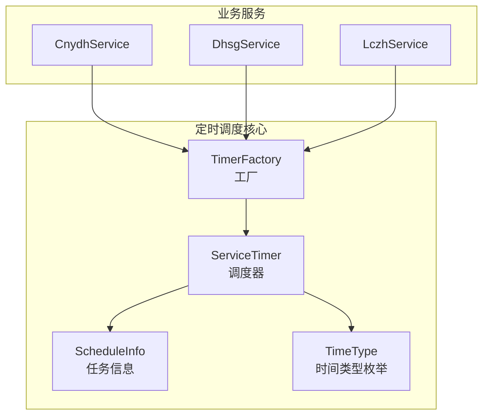
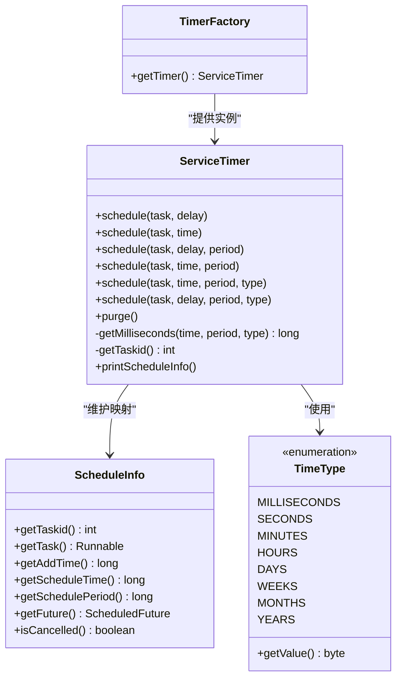
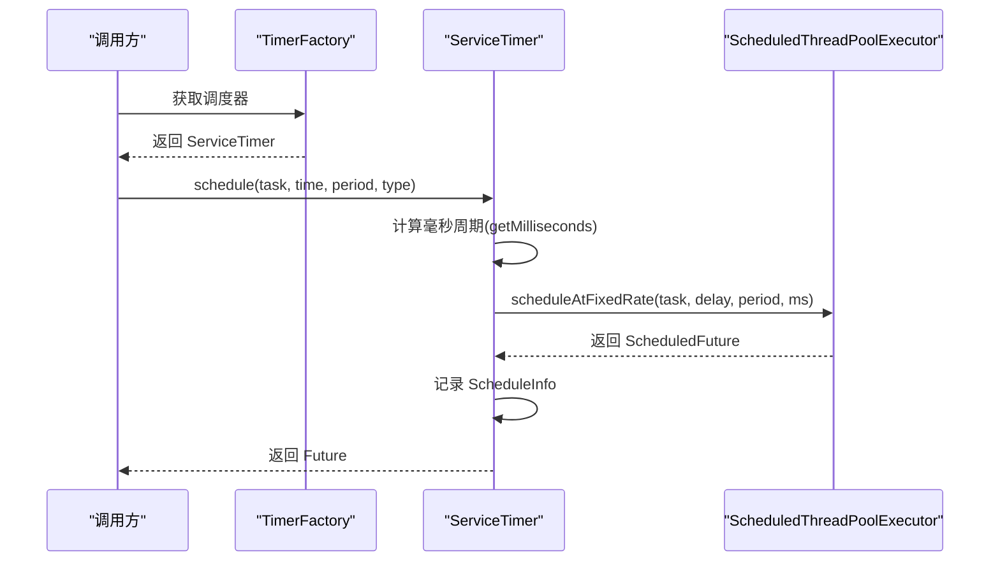
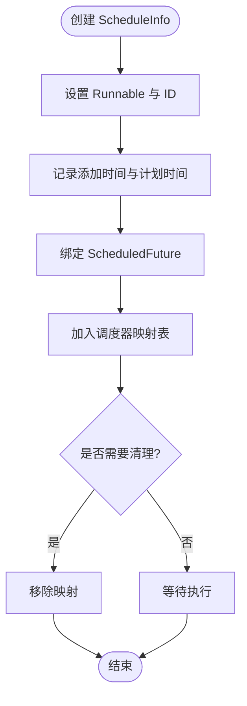
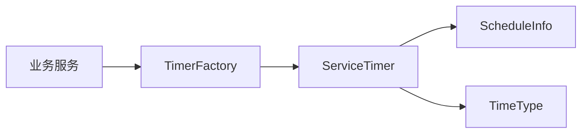

# 定时任务调度系统

<cite>
**本文引用的文件**
- [ServiceTimer.java](file://game-proxy/src/main/java/com/game/timer/ServiceTimer.java)
- [ScheduleInfo.java](file://game-proxy/src/main/java/com/game/timer/ScheduleInfo.java)
- [TimeType.java](file://game-proxy/src/main/java/com/game/timer/TimeType.java)
- [TimerFactory.java](file://game-proxy/src/main/java/com/game/timer/TimerFactory.java)
- [ServiceTimer.java](file://game-cnydh/src/main/java/com/utils/ServiceTimer.java)
- [ScheduleInfo.java](file://game-cnydh/src/main/java/com/utils/ScheduleInfo.java)
- [TimeType.java](file://game-cnydh/src/main/java/com/utils/TimeType.java)
- [TimerFactory.java](file://game-cnydh/src/main/java/com/utils/TimerFactory.java)
- [CnydhService.java](file://game-cnydh/src/main/java/com/cnydh/cnydh/CnydhService.java)
- [DhsgService.java](file://game-proxy/src/main/java/com/game/douyu/dahsg/DhsgService.java)
- [LczhService.java](file://game-proxy/src/main/java/com/game/ympd/lczh/LczhService.java)
</cite>

## 目录
1. [简介](#简介)
2. [项目结构](#项目结构)
3. [核心组件](#核心组件)
4. [架构总览](#架构总览)
5. [详细组件分析](#详细组件分析)
6. [依赖关系分析](#依赖关系分析)
7. [性能与资源控制](#性能与资源控制)
8. [故障排查指南](#故障排查指南)
9. [结论](#结论)
10. [附录：配置示例与最佳实践](#附录配置示例与最佳实践)

## 简介
本项目为多游戏模块提供统一的定时任务调度能力，基于 Java 的 ScheduledThreadPoolExecutor 实现高性能、可扩展的调度器。系统通过工厂模式统一对外暴露调度器实例，提供多种调度接口（一次性与周期性），支持毫秒到年的多粒度时间单位转换，并内置任务生命周期管理与自动清理机制。

## 项目结构
- 定时调度核心位于两个包中：
  - game-proxy 模块：com.game.timer（推荐使用）
  - game-cnydh 模块：com.utils（兼容旧版本）
- 各业务服务通过 TimerFactory 获取调度器实例，按需调度数据采集、开奖结果同步等任务。

图表来源
- [ServiceTimer.java](file://game-proxy/src/main/java/com/game/timer/ServiceTimer.java#L16-L24)
- [TimerFactory.java](file://game-proxy/src/main/java/com/game/timer/TimerFactory.java#L3-L9)
- [ScheduleInfo.java](file://game-proxy/src/main/java/com/game/timer/ScheduleInfo.java#L5-L65)
- [TimeType.java](file://game-proxy/src/main/java/com/game/timer/TimeType.java#L3-L23)
- [CnydhService.java](file://game-cnydh/src/main/java/com/cnydh/cnydh/CnydhService.java#L69-L70)
- [DhsgService.java](file://game-proxy/src/main/java/com/game/douyu/dahsg/DhsgService.java#L67-L67)
- [LczhService.java](file://game-proxy/src/main/java/com/game/ympd/lczh/LczhService.java#L68-L68)

章节来源
- [ServiceTimer.java](file://game-proxy/src/main/java/com/game/timer/ServiceTimer.java#L16-L24)
- [TimerFactory.java](file://game-proxy/src/main/java/com/game/timer/TimerFactory.java#L3-L9)

## 核心组件
- ServiceTimer：继承 ScheduledThreadPoolExecutor，提供统一调度入口，维护任务映射表，内置周期清理。
- ScheduleInfo：封装单个任务的元数据（任务ID、Runnable、添加时间、计划执行时间、周期、Future）。
- TimeType：时间类型枚举，支持毫秒至年，用于周期任务的单位转换。
- TimerFactory：静态工厂，提供全局唯一调度器实例。

章节来源
- [ServiceTimer.java](file://game-proxy/src/main/java/com/game/timer/ServiceTimer.java#L16-L164)
- [ScheduleInfo.java](file://game-proxy/src/main/java/com/game/timer/ScheduleInfo.java#L5-L65)
- [TimeType.java](file://game-proxy/src/main/java/com/game/timer/TimeType.java#L3-L23)
- [TimerFactory.java](file://game-proxy/src/main/java/com/game/timer/TimerFactory.java#L3-L9)

## 架构总览
系统采用“工厂 + 继承 + 元信息”的架构设计：
- 工厂模式：统一获取调度器实例，隐藏线程池大小与清理策略细节。
- 继承模式：直接复用 ScheduledThreadPoolExecutor 的调度能力，扩展生命周期管理。
- 元信息模式：通过 ScheduleInfo 记录任务状态，便于查询与清理。

图表来源
- [ServiceTimer.java](file://game-proxy/src/main/java/com/game/timer/ServiceTimer.java#L16-L164)
- [ScheduleInfo.java](file://game-proxy/src/main/java/com/game/timer/ScheduleInfo.java#L5-L65)
- [TimeType.java](file://game-proxy/src/main/java/com/game/timer/TimeType.java#L3-L23)
- [TimerFactory.java](file://game-proxy/src/main/java/com/game/timer/TimerFactory.java#L3-L9)

## 详细组件分析

### ServiceTimer 组件
- 线程池初始化：默认核心池大小为固定常量，保证调度吞吐稳定。
- 任务调度接口：
  - 延迟执行：支持毫秒延迟的一次性任务。
  - 指定时间执行：支持 Date 类型的绝对时间一次性任务。
  - 固定频率周期：支持毫秒级周期的重复任务。
  - 指定时间+周期：支持从指定时间开始的周期任务。
  - 周期带单位：支持以毫秒/秒/分/时/日/周/月/年为单位的周期任务。
- 生命周期管理：
  - 生成自增任务ID，记录任务添加时间、计划执行时间、周期与 Future。
  - 提供打印方法输出当前所有任务的基本信息。
- 自动清理：每5分钟扫描一次，移除已取消或已完成的任务，避免内存泄漏。
- 单位转换：根据 TimeType 将周期转换为毫秒，确保与底层调度器一致。

图表来源
- [ServiceTimer.java](file://game-proxy/src/main/java/com/game/timer/ServiceTimer.java#L83-L99)
- [ServiceTimer.java](file://game-proxy/src/main/java/com/game/timer/ServiceTimer.java#L116-L136)
- [TimerFactory.java](file://game-proxy/src/main/java/com/game/timer/TimerFactory.java#L7-L9)

章节来源
- [ServiceTimer.java](file://game-proxy/src/main/java/com/game/timer/ServiceTimer.java#L21-L24)
- [ServiceTimer.java](file://game-proxy/src/main/java/com/game/timer/ServiceTimer.java#L26-L99)
- [ServiceTimer.java](file://game-proxy/src/main/java/com/game/timer/ServiceTimer.java#L100-L113)
- [ServiceTimer.java](file://game-proxy/src/main/java/com/game/timer/ServiceTimer.java#L116-L136)
- [ServiceTimer.java](file://game-proxy/src/main/java/com/game/timer/ServiceTimer.java#L142-L162)

### ScheduleInfo 组件
- 作用：承载单个任务的完整元信息，便于查询、统计与清理。
- 关键字段：任务ID、Runnable、添加时间、计划执行时间、周期、Future。
- 辅助方法：判断任务是否已取消或完成，便于自动清理。

图表来源
- [ScheduleInfo.java](file://game-proxy/src/main/java/com/game/timer/ScheduleInfo.java#L5-L65)
- [ServiceTimer.java](file://game-proxy/src/main/java/com/game/timer/ServiceTimer.java#L29-L35)
- [ServiceTimer.java](file://game-proxy/src/main/java/com/game/timer/ServiceTimer.java#L100-L113)

章节来源
- [ScheduleInfo.java](file://game-proxy/src/main/java/com/game/timer/ScheduleInfo.java#L5-L65)

### TimeType 组件
- 设计：以枚举形式提供时间单位，统一转换逻辑。
- 支持：毫秒、秒、分、时、日、周、月、年。
- 使用：在周期任务中将用户输入的周期数转换为毫秒，确保与底层调度器一致。

章节来源
- [TimeType.java](file://game-proxy/src/main/java/com/game/timer/TimeType.java#L3-L23)
- [ServiceTimer.java](file://game-proxy/src/main/java/com/game/timer/ServiceTimer.java#L116-L136)

### TimerFactory 组件
- 设计：提供静态工厂方法，返回全局唯一的 ServiceTimer 实例。
- 优势：集中管理调度器生命周期，避免多实例导致的资源浪费与状态不一致。

章节来源
- [TimerFactory.java](file://game-proxy/src/main/java/com/game/timer/TimerFactory.java#L3-L9)

### 业务服务中的调度使用示例
- CnydhService：在获取到下一期开始时间后，使用一次性调度在指定时间点执行数据任务。
- DhsgService：在获取到下一期开始时间后，使用一次性调度；在开奖结果未就绪时，使用延迟调度重试。
- LczhService：在获取到下一期开始时间后，使用一次性调度；在开奖结果未就绪时，使用延迟调度重试。

章节来源
- [CnydhService.java](file://game-cnydh/src/main/java/com/cnydh/cnydh/CnydhService.java#L69-L70)
- [DhsgService.java](file://game-proxy/src/main/java/com/game/douyu/dahsg/DhsgService.java#L67-L67)
- [DhsgService.java](file://game-proxy/src/main/java/com/game/douyu/dahsg/DhsgService.java#L106-L106)
- [LczhService.java](file://game-proxy/src/main/java/com/game/ympd/lczh/LczhService.java#L68-L68)
- [LczhService.java](file://game-proxy/src/main/java/com/game/ympd/lczh/LczhService.java#L72-L76)

## 依赖关系分析
- 组件耦合：
  - ServiceTimer 与 ScheduleInfo 强耦合，通过 ConcurrentHashMap 维护任务映射。
  - ServiceTimer 与 TimeType 弱耦合，仅在周期转换时使用。
  - TimerFactory 与 ServiceTimer 弱耦合，提供全局访问入口。
- 外部依赖：
  - 基于 ScheduledThreadPoolExecutor，具备标准线程池的特性与行为。
  - 日志框架用于清理与异常信息输出。

图表来源
- [TimerFactory.java](file://game-proxy/src/main/java/com/game/timer/TimerFactory.java#L3-L9)
- [ServiceTimer.java](file://game-proxy/src/main/java/com/game/timer/ServiceTimer.java#L16-L24)
- [ScheduleInfo.java](file://game-proxy/src/main/java/com/game/timer/ScheduleInfo.java#L5-L65)
- [TimeType.java](file://game-proxy/src/main/java/com/game/timer/TimeType.java#L3-L23)

章节来源
- [TimerFactory.java](file://game-proxy/src/main/java/com/game/timer/TimerFactory.java#L3-L9)
- [ServiceTimer.java](file://game-proxy/src/main/java/com/game/timer/ServiceTimer.java#L16-L24)

## 性能与资源控制
- 线程池规模：固定核心池大小，避免动态扩容带来的抖动。
- 清理策略：定期清理已取消/完成任务，降低内存占用。
- 周期转换：统一以毫秒为单位，减少计算误差与类型转换开销。
- 建议：
  - 控制并发任务数量，避免长时间阻塞任务影响其他任务。
  - 对耗时任务进行拆分或异步化处理。
  - 监控线程池活跃度与任务堆积情况，必要时调整线程池大小。

[本节为通用建议，无需特定文件引用]

## 故障排查指南
- 任务未执行：
  - 检查调度时间是否正确，确认传入的 Date 或延迟毫秒值。
  - 查看日志中是否有异常信息。
- 任务重复执行：
  - 确认是否误用一次性与周期性接口。
  - 检查是否存在多个相同任务被重复调度。
- 内存增长：
  - 触发清理流程，检查是否存在大量已取消任务未被移除。
  - 使用打印方法核对当前任务列表。
- 异常处理：
  - 调度过程中出现异常会记录日志，需关注异常堆栈定位问题。

章节来源
- [ServiceTimer.java](file://game-proxy/src/main/java/com/game/timer/ServiceTimer.java#L37-L40)
- [ServiceTimer.java](file://game-proxy/src/main/java/com/game/timer/ServiceTimer.java#L100-L113)
- [ServiceTimer.java](file://game-proxy/src/main/java/com/game/timer/ServiceTimer.java#L142-L162)

## 结论
该定时任务调度系统以工厂模式统一调度器实例，以继承方式复用标准线程池能力，并通过元信息模型实现任务生命周期的可视化与可控化。系统提供了灵活的调度接口与单位转换，结合自动清理机制，满足多业务场景下的定时任务需求。建议在实际使用中遵循最佳实践，持续监控与优化性能。

[本节为总结，无需特定文件引用]

## 附录：配置示例与最佳实践
- 配置示例（一次性任务）
  - 在业务服务中获取调度器并调度一次性任务：
    - 参考路径：[CnydhService.java](file://game-cnydh/src/main/java/com/cnydh/cnydh/CnydhService.java#L69-L70)
    - 参考路径：[DhsgService.java](file://game-proxy/src/main/java/com/game/douyu/dahsg/DhsgService.java#L67-L67)
    - 参考路径：[LczhService.java](file://game-proxy/src/main/java/com/game/ympd/lczh/LczhService.java#L68-L68)
- 配置示例（周期任务）
  - 使用周期+单位的方式调度：
    - 参考路径：[ServiceTimer.java](file://game-proxy/src/main/java/com/game/timer/ServiceTimer.java#L83-L99)
    - 参考路径：[TimeType.java](file://game-proxy/src/main/java/com/game/timer/TimeType.java#L3-L23)
- 最佳实践
  - 明确任务粒度：将长耗时任务拆分为多个短任务，避免阻塞线程池。
  - 统一时间管理：使用 Date 或延迟毫秒统一时间表达，避免时区与精度问题。
  - 监控与告警：结合打印方法与日志，建立任务执行监控与异常告警。
  - 资源隔离：不同业务线可考虑独立调度器实例，避免相互影响。

[本节为通用指导，无需特定文件引用]