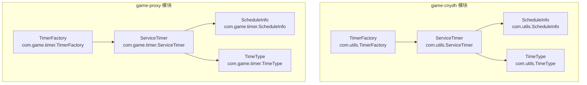
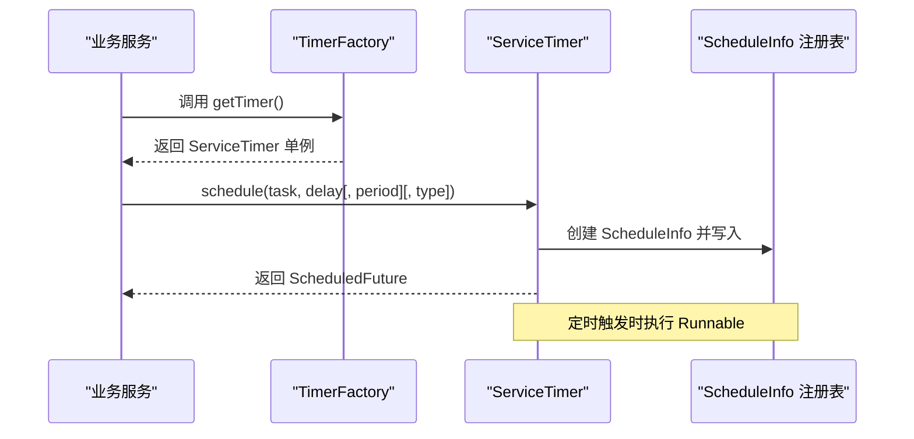
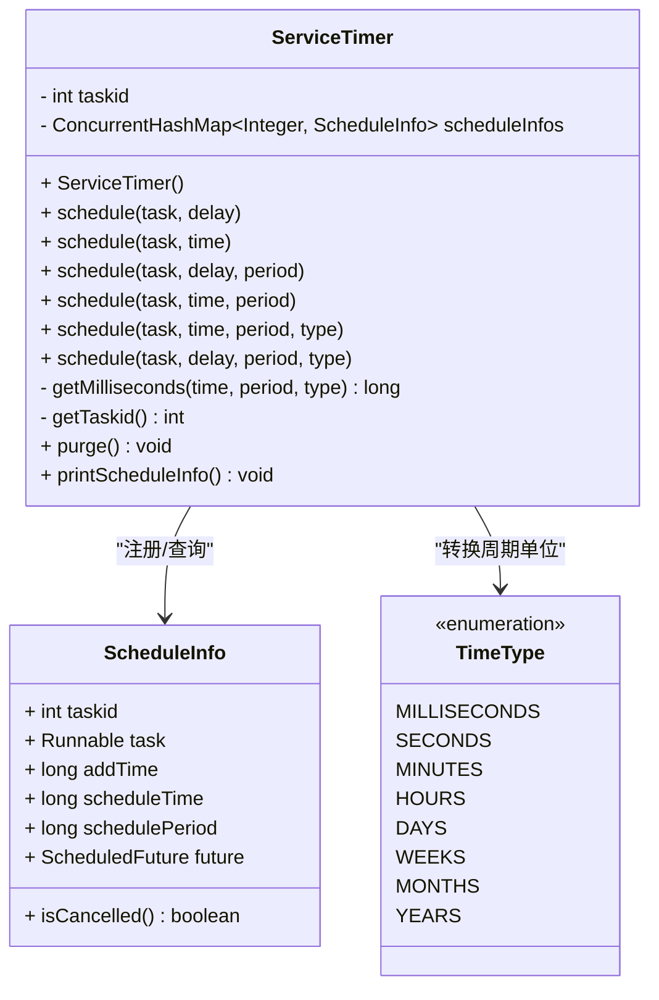
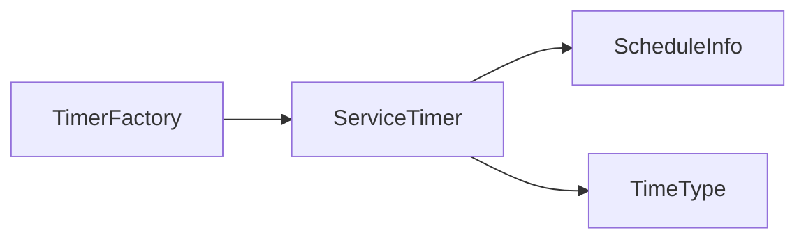

# 工厂模式应用

<cite>
**本文引用的文件**
- [TimerFactory.java](file://game-cnydh/src/main/java/com/utils/TimerFactory.java)
- [ServiceTimer.java](file://game-cnydh/src/main/java/com/utils/ServiceTimer.java)
- [ScheduleInfo.java](file://game-cnydh/src/main/java/com/utils/ScheduleInfo.java)
- [TimeType.java](file://game-cnydh/src/main/java/com/utils/TimeType.java)
- [TimerFactory.java](file://game-proxy/src/main/java/com/game/timer/TimerFactory.java)
- [ServiceTimer.java](file://game-proxy/src/main/java/com/game/timer/ServiceTimer.java)
- [ScheduleInfo.java](file://game-proxy/src/main/java/com/game/timer/ScheduleInfo.java)
- [TimeType.java](file://game-proxy/src/main/java/com/game/timer/TimeType.java)
</cite>

## 目录
1. [引言](#引言)
2. [项目结构](#项目结构)
3. [核心组件](#核心组件)
4. [架构总览](#架构总览)
5. [详细组件分析](#详细组件分析)
6. [依赖分析](#依赖分析)
7. [性能考虑](#性能考虑)
8. [故障排查指南](#故障排查指南)
9. [结论](#结论)
10. [附录：使用示例与最佳实践](#附录使用示例与最佳实践)

## 引言
本文件围绕“工厂模式在定时任务调度中的应用”展开，重点剖析 TimerFactory 工厂类的设计理念与实现原理，说明其如何通过统一入口创建与管理不同类型的定时任务；阐述工厂模式在任务类型抽象、创建流程标准化与扩展性方面的优势；并结合 ServiceTimer 调度器与 ScheduleInfo 配置模型，给出工厂方法的实现细节（参数校验、默认值、异常处理）、与调度器的协作关系、最佳实践与扩展指南。

## 项目结构
本次分析聚焦于两个模块中相同的定时任务基础设施：
- game-cnydh 模块：com.utils 包下的定时相关类
- game-proxy 模块：com.game.timer 包下的定时相关类

二者在包名与职责上保持一致，均包含：
- TimerFactory：单例工厂，提供全局唯一的 ServiceTimer 获取入口
- ServiceTimer：基于 ScheduledThreadPoolExecutor 的调度器，负责任务注册、周期执行与清理
- ScheduleInfo：任务配置信息载体，记录任务标识、添加时间、计划执行时间、周期与 Future 句柄
- TimeType：时间单位枚举，用于将人类可读的时间粒度转换为毫秒

图表来源
- [TimerFactory.java](file://game-cnydh/src/main/java/com/utils/TimerFactory.java#L1-L11)
- [ServiceTimer.java](file://game-cnydh/src/main/java/com/utils/ServiceTimer.java#L1-L164)
- [ScheduleInfo.java](file://game-cnydh/src/main/java/com/utils/ScheduleInfo.java#L1-L66)
- [TimeType.java](file://game-cnydh/src/main/java/com/utils/TimeType.java#L1-L24)
- [TimerFactory.java](file://game-proxy/src/main/java/com/game/timer/TimerFactory.java#L1-L11)
- [ServiceTimer.java](file://game-proxy/src/main/java/com/game/timer/ServiceTimer.java#L1-L164)
- [ScheduleInfo.java](file://game-proxy/src/main/java/com/game/timer/ScheduleInfo.java#L1-L66)
- [TimeType.java](file://game-proxy/src/main/java/com/game/timer/TimeType.java#L1-L24)

章节来源
- [TimerFactory.java](file://game-cnydh/src/main/java/com/utils/TimerFactory.java#L1-L11)
- [ServiceTimer.java](file://game-cnydh/src/main/java/com/utils/ServiceTimer.java#L1-L164)
- [ScheduleInfo.java](file://game-cnydh/src/main/java/com/utils/ScheduleInfo.java#L1-L66)
- [TimeType.java](file://game-cnydh/src/main/java/com/utils/TimeType.java#L1-L24)
- [TimerFactory.java](file://game-proxy/src/main/java/com/game/timer/TimerFactory.java#L1-L11)
- [ServiceTimer.java](file://game-proxy/src/main/java/com/game/timer/ServiceTimer.java#L1-L164)
- [ScheduleInfo.java](file://game-proxy/src/main/java/com/game/timer/ScheduleInfo.java#L1-L66)
- [TimeType.java](file://game-proxy/src/main/java/com/game/timer/TimeType.java#L1-L24)

## 核心组件
- TimerFactory：提供静态工厂方法获取全局唯一的 ServiceTimer 实例，实现简单、稳定且便于集中管理
- ServiceTimer：继承 ScheduledThreadPoolExecutor，封装多种 schedule 重载，统一记录 ScheduleInfo 并支持周期任务与按时间点执行
- ScheduleInfo：承载任务元数据（任务标识、添加时间、计划时间、周期、Future），用于查询与清理
- TimeType：将人类可读的时间单位映射为毫秒，作为周期参数的输入

章节来源
- [TimerFactory.java](file://game-cnydh/src/main/java/com/utils/TimerFactory.java#L1-L11)
- [ServiceTimer.java](file://game-cnydh/src/main/java/com/utils/ServiceTimer.java#L1-L164)
- [ScheduleInfo.java](file://game-cnydh/src/main/java/com/utils/ScheduleInfo.java#L1-L66)
- [TimeType.java](file://game-cnydh/src/main/java/com/utils/TimeType.java#L1-L24)

## 架构总览
下图展示了工厂与调度器之间的协作关系：业务层通过工厂获取调度器实例，再由调度器完成任务注册、周期控制与资源清理。

图表来源
- [TimerFactory.java](file://game-cnydh/src/main/java/com/utils/TimerFactory.java#L1-L11)
- [ServiceTimer.java](file://game-cnydh/src/main/java/com/utils/ServiceTimer.java#L26-L99)
- [ScheduleInfo.java](file://game-cnydh/src/main/java/com/utils/ScheduleInfo.java#L14-L65)

## 详细组件分析

### TimerFactory 工厂类
- 设计要点
  - 单例持有：内部维护一个静态的 ServiceTimer 实例，避免重复创建线程池
  - 统一入口：对外暴露静态工厂方法，屏蔽具体实现细节
- 使用方式
  - 业务层直接调用工厂方法获取调度器，无需关心线程池大小与生命周期管理
- 扩展建议
  - 若需多实例或多策略，可在工厂内引入键控或策略选择逻辑，但当前实现强调“单一实例”的简洁性

章节来源
- [TimerFactory.java](file://game-cnydh/src/main/java/com/utils/TimerFactory.java#L1-L11)
- [TimerFactory.java](file://game-proxy/src/main/java/com/game/timer/TimerFactory.java#L1-L11)

### ServiceTimer 调度器
- 继承与初始化
  - 继承 ScheduledThreadPoolExecutor，构造函数传入固定线程池大小
  - 启动定期清理任务，周期性移除已取消或已完成的任务条目
- 任务注册与配置
  - 提供多种 schedule 重载，支持按延迟、指定时间、固定周期与组合参数
  - 对每次注册生成唯一任务标识，并将 ScheduleInfo 写入并发注册表
- 时间单位转换
  - 通过 TimeType 将人类可读单位转换为毫秒，统一调度器内部时间语义
- 异常处理
  - 在任务注册过程中捕获异常并记录日志，保证工厂与调度器的稳定性
- 清理机制
  - purge 方法遍历注册表，移除已取消或已完成的任务，降低内存占用

图表来源
- [ServiceTimer.java](file://game-cnydh/src/main/java/com/utils/ServiceTimer.java#L16-L164)
- [ScheduleInfo.java](file://game-cnydh/src/main/java/com/utils/ScheduleInfo.java#L5-L66)
- [TimeType.java](file://game-cnydh/src/main/java/com/utils/TimeType.java#L3-L24)

章节来源
- [ServiceTimer.java](file://game-cnydh/src/main/java/com/utils/ServiceTimer.java#L16-L164)
- [ScheduleInfo.java](file://game-cnydh/src/main/java/com/utils/ScheduleInfo.java#L5-L66)
- [TimeType.java](file://game-cnydh/src/main/java/com/utils/TimeType.java#L3-L24)

### ScheduleInfo 任务配置
- 字段说明
  - 任务标识：唯一 ID，用于关联与查询
  - 任务对象：Runnable 实现，实际执行体
  - 添加时间与计划时间：用于统计与调试
  - 周期：固定周期（毫秒）
  - Future：调度器返回句柄，用于取消与状态判断
- 状态判定
  - isCancelled：综合 Future 的取消与完成状态，用于清理流程

章节来源
- [ScheduleInfo.java](file://game-cnydh/src/main/java/com/utils/ScheduleInfo.java#L5-L66)

### TimeType 时间单位
- 提供从人类可读到毫秒的映射，覆盖毫秒至年等常用粒度
- 作为周期参数的输入，确保调度器内部时间语义一致

章节来源
- [TimeType.java](file://game-cnydh/src/main/java/com/utils/TimeType.java#L3-L24)

## 依赖分析
- 组件耦合
  - TimerFactory 仅依赖 ServiceTimer，耦合度低，职责清晰
  - ServiceTimer 依赖 ScheduleInfo 进行任务登记，依赖 TimeType 进行周期换算
- 外部依赖
  - 基于 JDK 并发包的 ScheduledThreadPoolExecutor，具备良好的线程池管理能力
- 循环依赖
  - 无循环依赖，结构清晰

图表来源
- [TimerFactory.java](file://game-cnydh/src/main/java/com/utils/TimerFactory.java#L1-L11)
- [ServiceTimer.java](file://game-cnydh/src/main/java/com/utils/ServiceTimer.java#L16-L164)
- [ScheduleInfo.java](file://game-cnydh/src/main/java/com/utils/ScheduleInfo.java#L5-L66)
- [TimeType.java](file://game-cnydh/src/main/java/com/utils/TimeType.java#L3-L24)

章节来源
- [TimerFactory.java](file://game-cnydh/src/main/java/com/utils/TimerFactory.java#L1-L11)
- [ServiceTimer.java](file://game-cnydh/src/main/java/com/utils/ServiceTimer.java#L16-L164)
- [ScheduleInfo.java](file://game-cnydh/src/main/java/com/utils/ScheduleInfo.java#L5-L66)
- [TimeType.java](file://game-cnydh/src/main/java/com/utils/TimeType.java#L3-L24)

## 性能考虑
- 线程池规模：固定大小的线程池有助于限制资源占用，适合定时任务场景
- 注册与清理：定期清理已取消任务，避免注册表膨胀
- 时间换算：统一使用毫秒，减少重复换算开销
- 异常兜底：在注册阶段捕获异常，避免影响其他任务

## 故障排查指南
- 任务未执行
  - 检查是否正确通过工厂获取调度器实例
  - 确认 schedule 参数（延迟/时间/周期）是否合理
- 任务重复或堆积
  - 查看注册表中是否存在大量已取消任务，确认清理流程是否正常
- 资源泄漏
  - 确保任务完成后及时取消或让其自然结束，避免 Future 长期持有
- 日志定位
  - 关注调度器日志输出，定位异常发生点

章节来源
- [ServiceTimer.java](file://game-cnydh/src/main/java/com/utils/ServiceTimer.java#L101-L113)
- [ServiceTimer.java](file://game-cnydh/src/main/java/com/utils/ServiceTimer.java#L26-L41)

## 结论
通过将调度器封装在工厂中，系统实现了对定时任务创建与管理的统一抽象：任务类型被抽象为 Runnable，创建流程标准化，异常处理与资源清理得到集中管理。该设计提升了扩展性与可维护性，便于在不改变业务调用方式的前提下替换或增强调度器行为。

## 附录：使用示例与最佳实践

### 工厂使用示例（步骤说明）
- 获取调度器
  - 通过工厂方法获取全局唯一的调度器实例
- 注册任务
  - 选择合适的 schedule 重载（按延迟、按时间、带周期等）
  - 传入 Runnable 任务与时间参数（可选周期单位）
- 记录与跟踪
  - 保存返回的 Future，以便后续取消或状态查询
  - 可选：打印任务信息用于调试

章节来源
- [TimerFactory.java](file://game-cnydh/src/main/java/com/utils/TimerFactory.java#L7-L9)
- [ServiceTimer.java](file://game-cnydh/src/main/java/com/utils/ServiceTimer.java#L26-L99)

### 工厂方法实现细节
- 参数验证
  - 通过 schedule 重载约束参数组合，避免非法输入
- 默认值设置
  - 周期默认为 0，表示一次性任务
- 异常处理
  - 在注册阶段捕获异常并记录日志，保证系统稳定性

章节来源
- [ServiceTimer.java](file://game-cnydh/src/main/java/com/utils/ServiceTimer.java#L26-L41)
- [ServiceTimer.java](file://game-cnydh/src/main/java/com/utils/ServiceTimer.java#L56-L67)
- [ServiceTimer.java](file://game-cnydh/src/main/java/com/utils/ServiceTimer.java#L69-L81)
- [ServiceTimer.java](file://game-cnydh/src/main/java/com/utils/ServiceTimer.java#L83-L99)

### 工厂与调度器协作关系
- 工厂负责提供调度器实例
- 调度器负责任务注册、周期执行与清理
- ScheduleInfo 作为配置与状态载体贯穿整个生命周期

章节来源
- [TimerFactory.java](file://game-cnydh/src/main/java/com/utils/TimerFactory.java#L5-L9)
- [ServiceTimer.java](file://game-cnydh/src/main/java/com/utils/ServiceTimer.java#L18-L24)
- [ScheduleInfo.java](file://game-cnydh/src/main/java/com/utils/ScheduleInfo.java#L14-L65)

### 最佳实践与扩展指南
- 最佳实践
  - 统一通过工厂获取调度器，避免多实例导致的资源竞争
  - 明确任务生命周期，及时取消不再需要的任务
  - 使用 TimeType 明确周期单位，避免歧义
- 扩展指南
  - 如需多实例或多策略，可在工厂中引入键控或策略选择
  - 可在 ServiceTimer 中增加更多调度策略（如优先级、限流、熔断）

章节来源
- [TimerFactory.java](file://game-cnydh/src/main/java/com/utils/TimerFactory.java#L1-L11)
- [ServiceTimer.java](file://game-cnydh/src/main/java/com/utils/ServiceTimer.java#L116-L136)