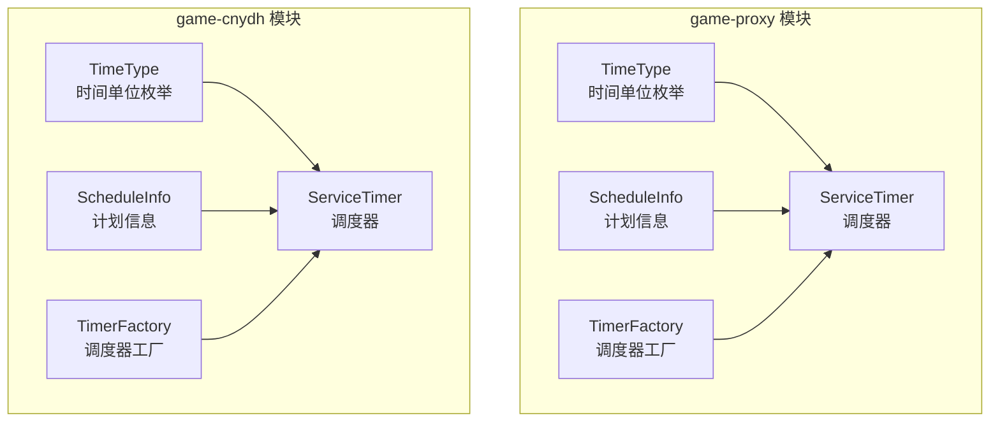
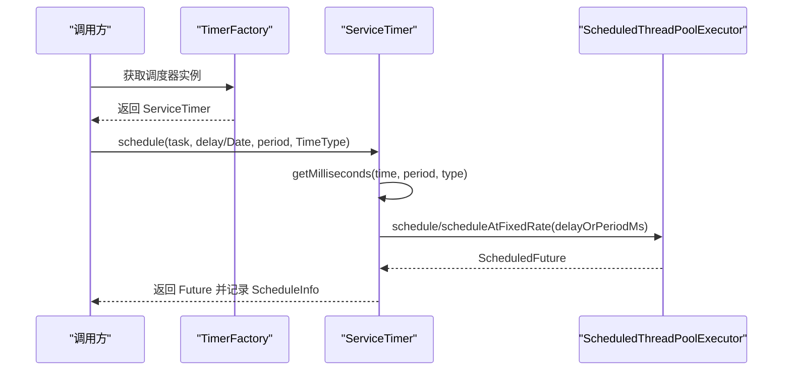
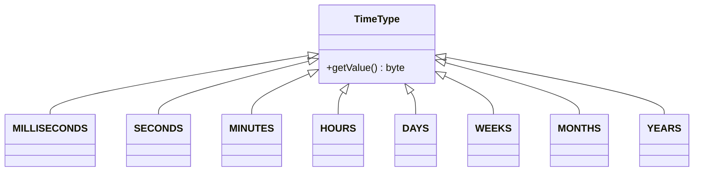
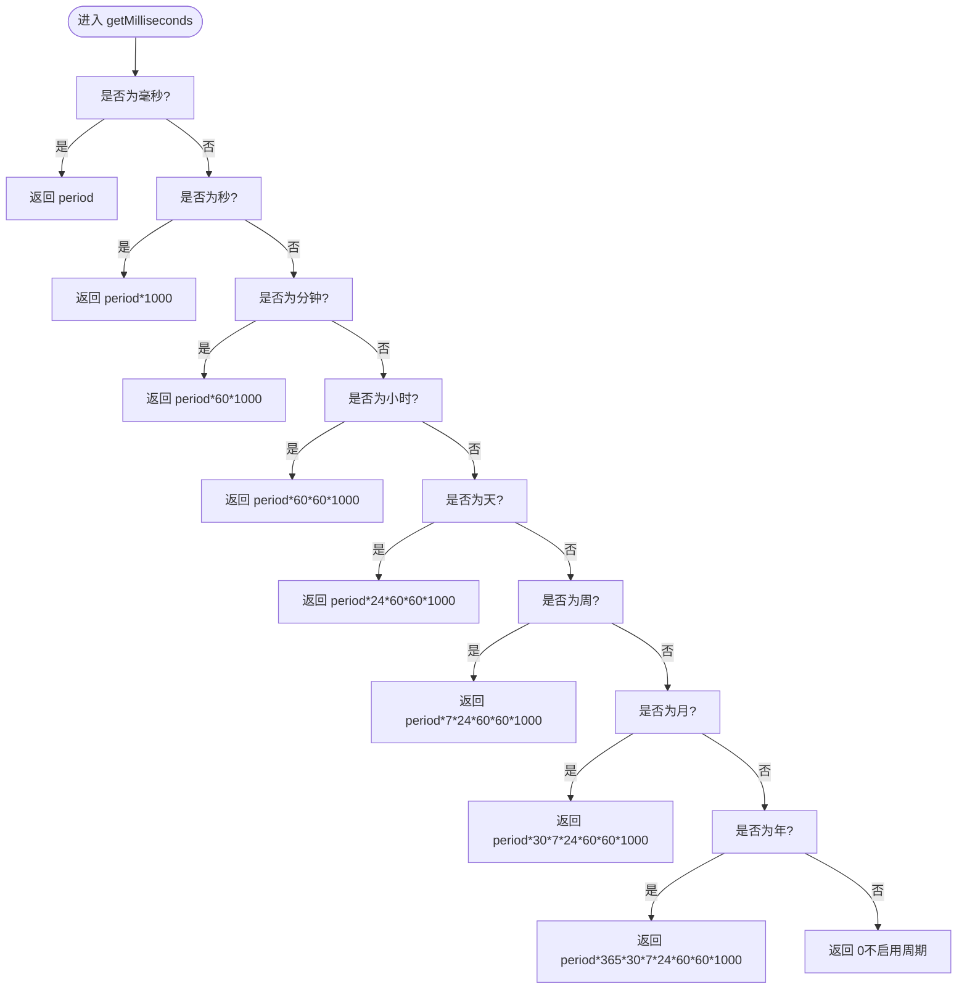
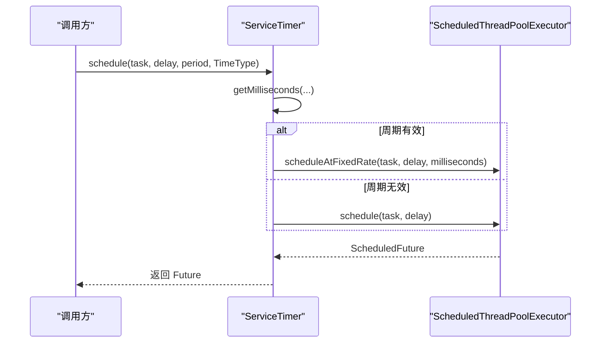
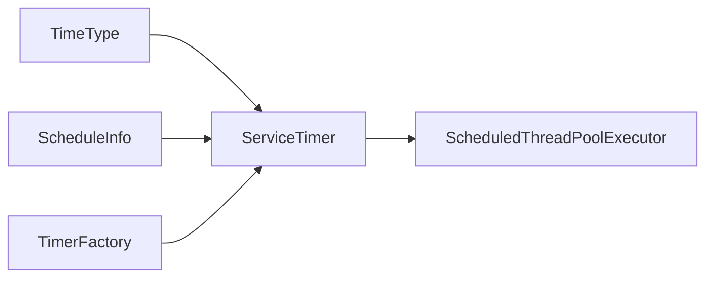

# 时间类型配置

<cite>
**本文引用的文件**
- [TimeType.java](file://game-proxy/src/main/java/com/game/timer/TimeType.java)
- [ServiceTimer.java](file://game-proxy/src/main/java/com/game/timer/ServiceTimer.java)
- [ScheduleInfo.java](file://game-proxy/src/main/java/com/game/timer/ScheduleInfo.java)
- [TimerFactory.java](file://game-proxy/src/main/java/com/game/timer/TimerFactory.java)
- [TimeType.java](file://game-cnydh/src/main/java/com/utils/TimeType.java)
- [ServiceTimer.java](file://game-cnydh/src/main/java/com/utils/ServiceTimer.java)
- [ScheduleInfo.java](file://game-cnydh/src/main/java/com/utils/ScheduleInfo.java)
- [TimerFactory.java](file://game-cnydh/src/main/java/com/utils/TimerFactory.java)
</cite>

## 目录
1. [简介](#简介)
2. [项目结构](#项目结构)
3. [核心组件](#核心组件)
4. [架构总览](#架构总览)
5. [详细组件分析](#详细组件分析)
6. [依赖关系分析](#依赖关系分析)
7. [性能考量](#性能考量)
8. [故障排查指南](#故障排查指南)
9. [结论](#结论)
10. [附录](#附录)

## 简介
本技术文档围绕“时间类型配置”展开，系统性解析 TimeType 枚举的设计与实现、各时间单位的定义与换算规则、以及在定时任务中的应用方式（一次性执行、固定延迟执行、周期性执行）。文档还提供最佳实践建议、性能与内存影响分析、常见错误规避方法，并解释时间类型与任务调度精度之间的关系与限制。

## 项目结构
本仓库包含两个模块均实现了相同的时间调度能力：
- game-proxy 模块：位于 com.game.timer 包下，包含时间类型、调度器、计划信息与工厂类。
- game-cnydh 模块：位于 com.utils 包下，提供与 game-proxy 同构的实现，便于跨模块复用。

二者在功能上完全一致，差异仅在于包名与命名空间。

图表来源
- [TimeType.java](file://game-proxy/src/main/java/com/game/timer/TimeType.java#L1-L24)
- [ServiceTimer.java](file://game-proxy/src/main/java/com/game/timer/ServiceTimer.java#L1-L164)
- [ScheduleInfo.java](file://game-proxy/src/main/java/com/game/timer/ScheduleInfo.java#L1-L66)
- [TimerFactory.java](file://game-proxy/src/main/java/com/game/timer/TimerFactory.java#L1-L11)
- [TimeType.java](file://game-cnydh/src/main/java/com/utils/TimeType.java#L1-L24)
- [ServiceTimer.java](file://game-cnydh/src/main/java/com/utils/ServiceTimer.java#L1-L163)
- [ScheduleInfo.java](file://game-cnydh/src/main/java/com/utils/ScheduleInfo.java#L1-L66)
- [TimerFactory.java](file://game-cnydh/src/main/java/com/utils/TimerFactory.java#L1-L10)

章节来源
- [TimeType.java](file://game-proxy/src/main/java/com/game/timer/TimeType.java#L1-L24)
- [ServiceTimer.java](file://game-proxy/src/main/java/com/game/timer/ServiceTimer.java#L1-L164)
- [ScheduleInfo.java](file://game-proxy/src/main/java/com/game/timer/ScheduleInfo.java#L1-L66)
- [TimerFactory.java](file://game-proxy/src/main/java/com/game/timer/TimerFactory.java#L1-L11)
- [TimeType.java](file://game-cnydh/src/main/java/com/utils/TimeType.java#L1-L24)
- [ServiceTimer.java](file://game-cnydh/src/main/java/com/utils/ServiceTimer.java#L1-L163)
- [ScheduleInfo.java](file://game-cnydh/src/main/java/com/utils/ScheduleInfo.java#L1-L66)
- [TimerFactory.java](file://game-cnydh/src/main/java/com/utils/TimerFactory.java#L1-L10)

## 核心组件
- TimeType：定义时间单位常量（毫秒、秒、分钟、小时、天、周、月、年），并提供数值标识与访问器。
- ServiceTimer：基于 ScheduledThreadPoolExecutor 的调度器，支持一次性与周期性任务；内部通过 getMilliseconds 将 TimeType 转换为毫秒。
- ScheduleInfo：封装单个任务的元数据（任务 ID、添加时间、计划执行时间、周期、Future 引用）。
- TimerFactory：提供全局唯一调度器实例的获取入口。

章节来源
- [TimeType.java](file://game-proxy/src/main/java/com/game/timer/TimeType.java#L1-L24)
- [ServiceTimer.java](file://game-proxy/src/main/java/com/game/timer/ServiceTimer.java#L15-L164)
- [ScheduleInfo.java](file://game-proxy/src/main/java/com/game/timer/ScheduleInfo.java#L1-L66)
- [TimerFactory.java](file://game-proxy/src/main/java/com/game/timer/TimerFactory.java#L1-L11)

## 架构总览
调度器采用线程池 + 计划信息管理的方式，统一将用户传入的周期参数按 TimeType 转换为毫秒后提交给底层 ScheduledThreadPoolExecutor 执行。同时内置定期清理机制，移除已取消或已完成的任务条目，降低内存占用。

图表来源
- [TimerFactory.java](file://game-proxy/src/main/java/com/game/timer/TimerFactory.java#L1-L11)
- [ServiceTimer.java](file://game-proxy/src/main/java/com/game/timer/ServiceTimer.java#L26-L99)
- [ServiceTimer.java](file://game-proxy/src/main/java/com/game/timer/ServiceTimer.java#L116-L136)

## 详细组件分析

### TimeType 设计与时间单位定义
- 单位覆盖：毫秒、秒、分钟、小时、天、周、月、年。
- 数值标识：每个枚举项携带一个整型标识，可通过访问器获取，用于兼容不同模块或扩展场景。
- 设计要点：以枚举形式约束合法输入，避免魔法数字；通过统一的 getMilliseconds 转换逻辑保证一致性。

图表来源
- [TimeType.java](file://game-proxy/src/main/java/com/game/timer/TimeType.java#L3-L23)
- [TimeType.java](file://game-cnydh/src/main/java/com/utils/TimeType.java#L3-L23)

章节来源
- [TimeType.java](file://game-proxy/src/main/java/com/game/timer/TimeType.java#L1-L24)
- [TimeType.java](file://game-cnydh/src/main/java/com/utils/TimeType.java#L1-L24)

### getMilliseconds 实现原理与换算算法
- 输入：目标时间点、周期数、时间单位类型。
- 输出：毫秒数（若为 0 则表示不启用周期性）。
- 算法流程：
  - 若类型为毫秒，直接返回周期数；
  - 若类型为秒，乘以 1000；
  - 若类型为分钟，乘以 60×1000；
  - 若类型为小时，乘以 60×60×1000；
  - 若类型为天，乘以 24×60×60×1000；
  - 若类型为周，乘以 7×24×60×60×1000；
  - 若类型为月，乘以 30×7×24×60×60×1000；
  - 若类型为年，乘以 365×30×7×24×60×60×1000。
- 特别说明：
  - 月与年的换算采用固定近似值（30 天/月、365 天/年），不考虑闰年与大小月差异，因此在涉及日级别精确度时需谨慎使用 MONTHS/YEARS。

图表来源
- [ServiceTimer.java](file://game-proxy/src/main/java/com/game/timer/ServiceTimer.java#L116-L136)
- [ServiceTimer.java](file://game-cnydh/src/main/java/com/utils/ServiceTimer.java#L116-L136)

章节来源
- [ServiceTimer.java](file://game-proxy/src/main/java/com/game/timer/ServiceTimer.java#L116-L136)
- [ServiceTimer.java](file://game-cnydh/src/main/java/com/utils/ServiceTimer.java#L116-L136)

### 调度器与任务生命周期
- 一次性执行：传入 delay 或指定绝对时间 time，不传入周期参数。
- 固定延迟执行：传入 delay 与 period，period 由 TimeType 转换为毫秒。
- 周期性执行：传入 time 与 period，period 由 TimeType 转换为毫秒。
- 清理策略：每 5 分钟触发一次 purge，遍历计划信息集合，移除已取消或已完成的任务，降低内存占用。

图表来源
- [ServiceTimer.java](file://game-proxy/src/main/java/com/game/timer/ServiceTimer.java#L83-L99)
- [ServiceTimer.java](file://game-proxy/src/main/java/com/game/timer/ServiceTimer.java#L116-L136)

章节来源
- [ServiceTimer.java](file://game-proxy/src/main/java/com/game/timer/ServiceTimer.java#L26-L99)
- [ServiceTimer.java](file://game-proxy/src/main/java/com/game/timer/ServiceTimer.java#L100-L113)

### 计划信息与工厂模式
- ScheduleInfo：保存任务元数据，便于查询与统计；提供 isCancelled 判断任务状态。
- TimerFactory：提供静态方法获取全局唯一调度器实例，简化调用方使用。

章节来源
- [ScheduleInfo.java](file://game-proxy/src/main/java/com/game/timer/ScheduleInfo.java#L1-L66)
- [TimerFactory.java](file://game-proxy/src/main/java/com/game/timer/TimerFactory.java#L1-L11)
- [ScheduleInfo.java](file://game-cnydh/src/main/java/com/utils/ScheduleInfo.java#L1-L66)
- [TimerFactory.java](file://game-cnydh/src/main/java/com/utils/TimerFactory.java#L1-L10)

## 依赖关系分析
- TimeType 作为调度器的输入参数之一，被 schedule 方法链路广泛使用。
- ServiceTimer 组合 ScheduleInfo 进行任务状态跟踪，并通过 ScheduledThreadPoolExecutor 提交任务。
- TimerFactory 作为门面，屏蔽具体实现细节，便于跨模块共享。

图表来源
- [ServiceTimer.java](file://game-proxy/src/main/java/com/game/timer/ServiceTimer.java#L15-L164)
- [ScheduleInfo.java](file://game-proxy/src/main/java/com/game/timer/ScheduleInfo.java#L1-L66)
- [TimerFactory.java](file://game-proxy/src/main/java/com/game/timer/TimerFactory.java#L1-L11)

章节来源
- [ServiceTimer.java](file://game-proxy/src/main/java/com/game/timer/ServiceTimer.java#L15-L164)
- [ScheduleInfo.java](file://game-proxy/src/main/java/com/game/timer/ScheduleInfo.java#L1-L66)
- [TimerFactory.java](file://game-proxy/src/main/java/com/game/timer/TimerFactory.java#L1-L11)

## 性能考量
- 精度与开销：
  - 使用更小的时间单位（如毫秒）可提升调度精度，但会增加线程池任务频率与上下文切换成本。
  - 使用较大的时间单位（如分钟/小时）可降低调度频率，减少 CPU 开销，但会牺牲精度。
- 内存占用：
  - 每个任务都会创建 ScheduleInfo 并持有 Future 引用，长期运行的大量任务会累积内存压力。
  - purge 定期清理机制可移除已取消/完成的任务，缓解内存增长。
- 周期换算误差：
  - 月与年的换算采用固定近似值，可能导致跨月/跨年场景下的累计偏差。若对日级精度敏感，建议使用 DAYS 或自定义策略替代 MONTHS/YEARS。

[本节为通用性能讨论，无需特定文件引用]

## 故障排查指南
- 任务未执行：
  - 检查周期换算是否为 0（当 period 为 0 或类型不匹配时可能返回 0），导致未启用周期性执行。
  - 确认传入的绝对时间是否早于当前时间，若是则不会按预期执行。
- 任务频繁失败：
  - 检查任务执行体是否抛出未捕获异常，导致线程池中断或任务被移除。
  - 关注线程池容量与任务队列长度，避免积压导致超时或拒绝。
- 内存泄漏：
  - 确保不再使用的任务及时取消或等待其自然结束，避免 ScheduleInfo 长期驻留。
  - 定期调用 printScheduleInfo 或监控 scheduleInfos 集合规模，配合 purge 机制进行清理。

章节来源
- [ServiceTimer.java](file://game-proxy/src/main/java/com/game/timer/ServiceTimer.java#L100-L113)
- [ScheduleInfo.java](file://game-proxy/src/main/java/com/game/timer/ScheduleInfo.java#L62-L64)

## 结论
TimeType 通过标准化的时间单位与统一的换算逻辑，为定时任务提供了清晰、可维护的配置方式。结合 ServiceTimer 的周期性调度与清理机制，可在保证一定精度的同时控制资源消耗。实际使用中应根据业务需求选择合适的时间单位，并注意 MONTHS/YEARS 的换算近似带来的潜在偏差。

[本节为总结性内容，无需特定文件引用]

## 附录

### 时间类型与调度场景映射
- 一次性执行：传入 delay 或 time，不传入周期参数。
- 固定延迟执行：传入 delay 与 period 及 TimeType，适用于心跳、重试等场景。
- 周期性执行：传入 time 与 period 及 TimeType，适用于定时统计、刷新缓存等场景。

章节来源
- [ServiceTimer.java](file://game-proxy/src/main/java/com/game/timer/ServiceTimer.java#L26-L99)

### 最佳实践清单
- 精度选择：优先使用满足需求的最小单位，避免过度频繁的调度。
- 周期换算：涉及日级精确度时，尽量使用 DAYS；对跨月/跨年场景敏感时，避免使用 MONTHS/YEARS。
- 资源控制：合理设置线程池大小与任务数量，关注 purge 清理效果。
- 错误处理：确保任务执行体健壮，必要时包装异常并记录日志。
- 监控与可观测性：利用 printScheduleInfo 或外部指标系统观察任务状态与堆积情况。

[本节为通用实践建议，无需特定文件引用]