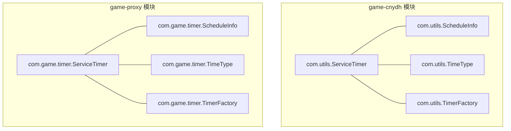
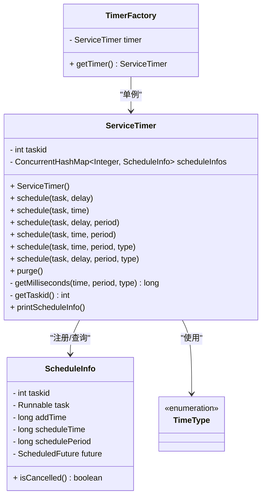
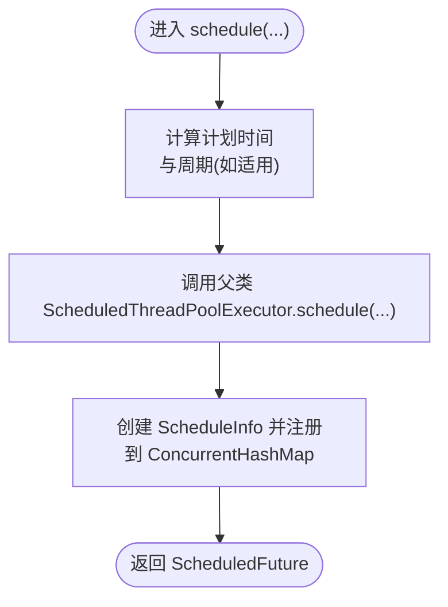
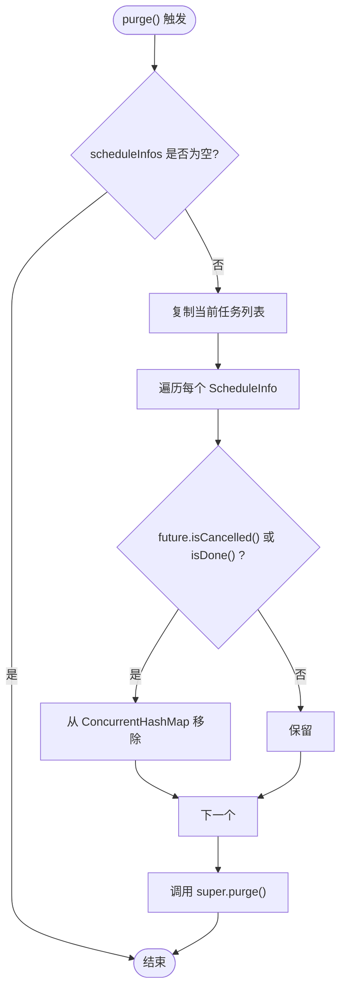
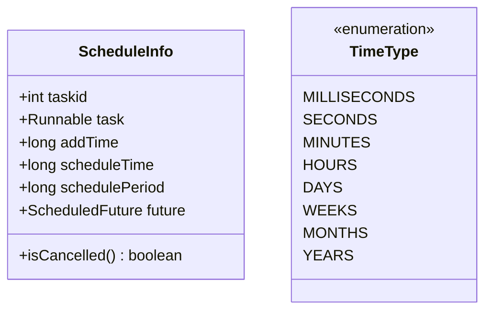
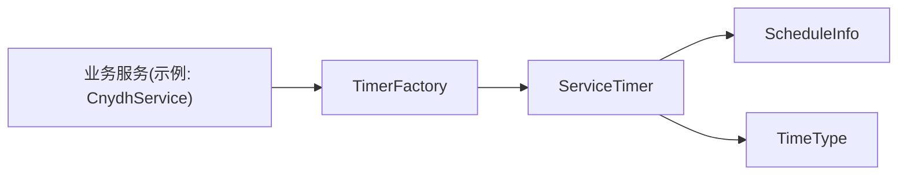

# 调度器实现原理

<cite>
**本文引用的文件**
- [ServiceTimer.java](file://game-cnydh/src/main/java/com/utils/ServiceTimer.java)
- [ScheduleInfo.java](file://game-cnydh/src/main/java/com/utils/ScheduleInfo.java)
- [TimeType.java](file://game-cnydh/src/main/java/com/utils/TimeType.java)
- [TimerFactory.java](file://game-cnydh/src/main/java/com/utils/TimerFactory.java)
- [CnydhService.java](file://game-cnydh/src/main/java/com/cnydh/cnydh/CnydhService.java)
- [ServiceTimer.java](file://game-proxy/src/main/java/com/game/timer/ServiceTimer.java)
- [ScheduleInfo.java](file://game-proxy/src/main/java/com/game/timer/ScheduleInfo.java)
- [TimeType.java](file://game-proxy/src/main/java/com/game/timer/TimeType.java)
- [TimerFactory.java](file://game-proxy/src/main/java/com/game/timer/TimerFactory.java)
</cite>

## 目录
1. [引言](#引言)
2. [项目结构](#项目结构)
3. [核心组件](#核心组件)
4. [架构总览](#架构总览)
5. [详细组件分析](#详细组件分析)
6. [依赖关系分析](#依赖关系分析)
7. [性能考量](#性能考量)
8. [故障排查指南](#故障排查指南)
9. [结论](#结论)
10. [附录](#附录)

## 引言
本文件系统性解析调度器实现原理，重点围绕 ServiceTimer 类对 ScheduledThreadPoolExecutor 的继承设计与扩展，覆盖线程池规模配置、调度方法族（延迟/指定时间/固定频率/带时间类型）、任务 ID 生成与并发安全、自动清理策略 purge()、配置参数与性能优化建议，并给出使用示例与最佳实践。

## 项目结构
- 两个模块均包含定时调度相关实现，包名不同但类结构一致：
  - game-cnydh 模块：com.utils 包下的 ServiceTimer、ScheduleInfo、TimeType、TimerFactory
  - game-proxy 模块：com.game.timer 包下的同名类
- 二者在功能上完全等价，差异仅在于包名与日志输出细节

**图表来源**
- [ServiceTimer.java](file://game-cnydh/src/main/java/com/utils/ServiceTimer.java#L1-L164)
- [ScheduleInfo.java](file://game-cnydh/src/main/java/com/utils/ScheduleInfo.java#L1-L66)
- [TimeType.java](file://game-cnydh/src/main/java/com/utils/TimeType.java#L1-L24)
- [TimerFactory.java](file://game-cnydh/src/main/java/com/utils/TimerFactory.java#L1-L11)
- [ServiceTimer.java](file://game-proxy/src/main/java/com/game/timer/ServiceTimer.java#L1-L164)
- [ScheduleInfo.java](file://game-proxy/src/main/java/com/game/timer/ScheduleInfo.java#L1-L66)
- [TimeType.java](file://game-proxy/src/main/java/com/game/timer/TimeType.java#L1-L24)
- [TimerFactory.java](file://game-proxy/src/main/java/com/game/timer/TimerFactory.java#L1-L11)

**章节来源**
- [ServiceTimer.java](file://game-cnydh/src/main/java/com/utils/ServiceTimer.java#L1-L164)
- [ServiceTimer.java](file://game-proxy/src/main/java/com/game/timer/ServiceTimer.java#L1-L164)

## 核心组件
- ServiceTimer：继承 ScheduledThreadPoolExecutor，提供统一的任务注册与管理能力
- ScheduleInfo：封装单个定时任务的元数据（任务 ID、添加时间、计划执行时间、周期、Future）
- TimeType：时间单位枚举（毫秒、秒、分、时、日、周、月、年）
- TimerFactory：全局单例工厂，提供共享的 ServiceTimer 实例

关键点
- 线程池大小：构造函数传入固定大小 12，用于平衡并发任务执行与资源占用
- 自动清理：每 5 分钟触发一次 purge()，清理已取消或已完成的任务记录
- 任务登记：所有通过 schedule() 提交的任务都会写入 ConcurrentHashMap，便于后续查询与统计

**章节来源**
- [ServiceTimer.java](file://game-cnydh/src/main/java/com/utils/ServiceTimer.java#L16-L24)
- [ScheduleInfo.java](file://game-cnydh/src/main/java/com/utils/ScheduleInfo.java#L5-L66)
- [TimeType.java](file://game-cnydh/src/main/java/com/utils/TimeType.java#L3-L24)
- [TimerFactory.java](file://game-cnydh/src/main/java/com/utils/TimerFactory.java#L3-L10)

## 架构总览
ServiceTimer 在 ScheduledThreadPoolExecutor 基础上扩展了任务生命周期管理与自动清理能力，形成“任务注册 + 线程池执行 + 定期清理”的闭环。

**图表来源**
- [ServiceTimer.java](file://game-cnydh/src/main/java/com/utils/ServiceTimer.java#L16-L164)
- [ScheduleInfo.java](file://game-cnydh/src/main/java/com/utils/ScheduleInfo.java#L5-L66)
- [TimeType.java](file://game-cnydh/src/main/java/com/utils/TimeType.java#L3-L24)
- [TimerFactory.java](file://game-cnydh/src/main/java/com/utils/TimerFactory.java#L3-L10)

## 详细组件分析

### 继承设计与线程池配置
- 继承 ScheduledThreadPoolExecutor 并在构造函数中设置核心线程数为 12
- 启动固定频率的 purge() 调度，周期 5 分钟，用于清理无效任务记录
- 该配置在多任务场景下可提供稳定吞吐，同时避免过多线程导致上下文切换开销

性能考量
- 线程池大小 12 是经验值，适合中小规模定时任务；若任务数量激增，需评估是否提升线程数或拆分任务域
- 5 分钟清理间隔兼顾内存占用与清理效率，可根据业务峰值调整

**章节来源**
- [ServiceTimer.java](file://game-cnydh/src/main/java/com/utils/ServiceTimer.java#L21-L24)

### 任务 ID 生成与并发安全
- 使用自增整型作为任务 ID，通过 synchronized 方法确保并发安全
- 每次提交任务前先分配 ID，再将 ScheduleInfo 写入 ConcurrentHashMap
- 该机制保证任务 ID 全局唯一且线程安全

并发注意
- 若存在大量高并发任务提交，建议评估 ID 分配热点；当前实现简单可靠，满足一般场景

**章节来源**
- [ServiceTimer.java](file://game-cnydh/src/main/java/com/utils/ServiceTimer.java#L18-L19)
- [ServiceTimer.java](file://game-cnydh/src/main/java/com/utils/ServiceTimer.java#L138-L140)

### 调度方法族与实现要点
- 延迟执行：schedule(task, delay)
  - 计算计划执行时间并提交到 ScheduledThreadPoolExecutor
  - 将 ScheduleInfo 注册到 ConcurrentHashMap
- 指定时间执行：schedule(task, time)
  - 将距离当前时间的差值作为延迟提交
- 固定频率执行：schedule(task, delay, period) 与 schedule(task, time, period)
  - 使用 scheduleAtFixedRate，周期以毫秒为单位
- 带时间类型的执行：schedule(task, time, period, type) 与 schedule(task, delay, period, type)
  - 通过 getMilliseconds() 将 Period 转换为毫秒，再委托到上述重载

复杂度与边界
- 时间转换逻辑为 O(1)，无额外数据结构开销
- 周期参数 period 必须为正数，否则固定频率模式退化为一次性执行

**图表来源**
- [ServiceTimer.java](file://game-cnydh/src/main/java/com/utils/ServiceTimer.java#L26-L81)
- [ServiceTimer.java](file://game-cnydh/src/main/java/com/utils/ServiceTimer.java#L116-L136)

**章节来源**
- [ServiceTimer.java](file://game-cnydh/src/main/java/com/utils/ServiceTimer.java#L26-L99)

### purge() 自动清理策略
- 遍历当前所有任务记录，检查 future 的取消/完成状态
- 对于已取消或已完成的任务，从 ConcurrentHashMap 中移除对应记录
- 最后调用父类 purge() 进行底层资源回收

清理时机
- 每 5 分钟自动触发，避免任务记录无限增长
- 清理粒度为“记录层”，不影响仍在执行中的任务

**图表来源**
- [ServiceTimer.java](file://game-cnydh/src/main/java/com/utils/ServiceTimer.java#L100-L113)

**章节来源**
- [ServiceTimer.java](file://game-cnydh/src/main/java/com/utils/ServiceTimer.java#L100-L113)

### 数据模型与工具类
- ScheduleInfo：承载任务元数据，提供 isCancelled() 判断
- TimeType：提供多种时间单位映射，getMilliseconds() 将周期转换为毫秒
- TimerFactory：提供全局单例 ServiceTimer，简化调用方接入

**图表来源**
- [ScheduleInfo.java](file://game-cnydh/src/main/java/com/utils/ScheduleInfo.java#L5-L66)
- [TimeType.java](file://game-cnydh/src/main/java/com/utils/TimeType.java#L3-L24)

**章节来源**
- [ScheduleInfo.java](file://game-cnydh/src/main/java/com/utils/ScheduleInfo.java#L5-L66)
- [TimeType.java](file://game-cnydh/src/main/java/com/utils/TimeType.java#L3-L24)
- [TimerFactory.java](file://game-cnydh/src/main/java/com/utils/TimerFactory.java#L3-L10)

### 使用示例与最佳实践
- 示例：在服务初始化或业务流程中，通过 TimerFactory 获取全局调度器实例，按需提交一次性或周期性任务
- 最佳实践
  - 一次性任务优先使用指定时间或延迟执行重载
  - 周期性任务明确 period 单位（毫秒），避免误解
  - 大量任务场景下，建议分组或拆分调度器，降低竞争
  - 定期调用 printScheduleInfo() 辅助排查任务堆积与执行情况

参考示例路径
- [CnydhService.java](file://game-cnydh/src/main/java/com/cnydh/cnydh/CnydhService.java#L69-L70)
- [CnydhService.java](file://game-cnydh/src/main/java/com/cnydh/cnydh/CnydhService.java#L138-L138)

**章节来源**
- [CnydhService.java](file://game-cnydh/src/main/java/com/cnydh/cnydh/CnydhService.java#L69-L70)
- [CnydhService.java](file://game-cnydh/src/main/java/com/cnydh/cnydh/CnydhService.java#L138-L138)

## 依赖关系分析
- ServiceTimer 依赖 ScheduleInfo 存储任务元数据，依赖 TimeType 进行周期转换
- TimerFactory 依赖 ServiceTimer 提供单例
- 业务服务（如 CnydhService）通过 TimerFactory 调用调度器

**图表来源**
- [TimerFactory.java](file://game-cnydh/src/main/java/com/utils/TimerFactory.java#L3-L10)
- [ServiceTimer.java](file://game-cnydh/src/main/java/com/utils/ServiceTimer.java#L16-L164)
- [ScheduleInfo.java](file://game-cnydh/src/main/java/com/utils/ScheduleInfo.java#L5-L66)
- [TimeType.java](file://game-cnydh/src/main/java/com/utils/TimeType.java#L3-L24)
- [CnydhService.java](file://game-cnydh/src/main/java/com/cnydh/cnydh/CnydhService.java#L69-L70)

**章节来源**
- [TimerFactory.java](file://game-cnydh/src/main/java/com/utils/TimerFactory.java#L3-L10)
- [ServiceTimer.java](file://game-cnydh/src/main/java/com/utils/ServiceTimer.java#L16-L164)
- [CnydhService.java](file://game-cnydh/src/main/java/com/cnydh/cnydh/CnydhService.java#L69-L70)

## 性能考量
- 线程池规模：12 个线程适中，适用于中小并发定时任务；若任务执行时间长或阻塞 IO 密集，建议评估扩容
- 清理策略：5 分钟一次的 purge() 可有效控制内存占用；若任务取消频繁，可考虑更短周期
- 任务注册：ConcurrentHashMap 的 put 操作为 O(1) 平均复杂度，整体开销可控
- 周期任务：scheduleAtFixedRate 会受任务执行耗时影响，可能导致“错过”下一次执行；如需严格间隔，请改用 scheduleWithFixedDelay

[本节为通用性能建议，不直接分析具体文件]

## 故障排查指南
- 任务未执行
  - 检查提交时的 delay/time 是否为正值
  - 确认任务未被提前取消（isCancelled() 返回 true）
- 任务堆积
  - 使用 printScheduleInfo() 查看任务列表与周期
  - 关注 purge() 是否正常运行，确认 scheduleInfos 是否持续增长
- 线程池饱和
  - 适当增加线程池大小或拆分任务域
  - 优化任务执行逻辑，减少阻塞与长耗时操作

**章节来源**
- [ServiceTimer.java](file://game-cnydh/src/main/java/com/utils/ServiceTimer.java#L100-L113)
- [ScheduleInfo.java](file://game-cnydh/src/main/java/com/utils/ScheduleInfo.java#L62-L64)

## 结论
ServiceTimer 通过对 ScheduledThreadPoolExecutor 的轻量扩展，提供了统一的任务注册、周期转换与定期清理能力。其 12 线程池与 5 分钟清理策略在多数业务场景下具备良好平衡。通过规范的调度方法族与并发安全的任务 ID 生成，开发者可以以较低心智成本构建稳定的定时任务体系。

[本节为总结性内容，不直接分析具体文件]

## 附录

### 配置参数与说明
- 线程池大小：12（固定）
- 自动清理周期：每 5 分钟
- 周期单位：毫秒（scheduleAtFixedRate 使用）
- 时间类型映射：由 TimeType 提供，支持毫秒至年的转换

**章节来源**
- [ServiceTimer.java](file://game-cnydh/src/main/java/com/utils/ServiceTimer.java#L21-L24)
- [ServiceTimer.java](file://game-cnydh/src/main/java/com/utils/ServiceTimer.java#L116-L136)
- [TimeType.java](file://game-cnydh/src/main/java/com/utils/TimeType.java#L3-L24)