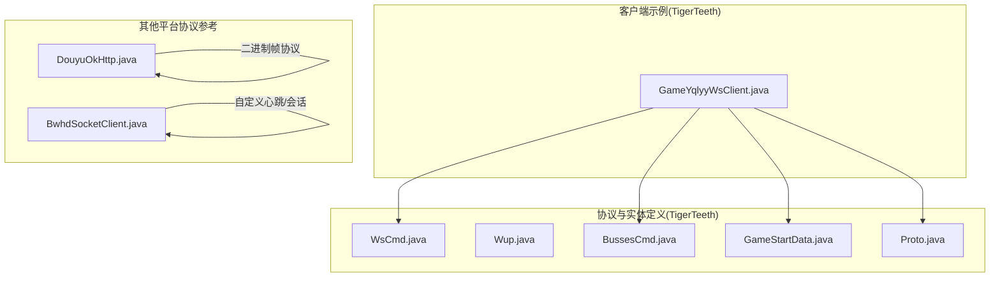
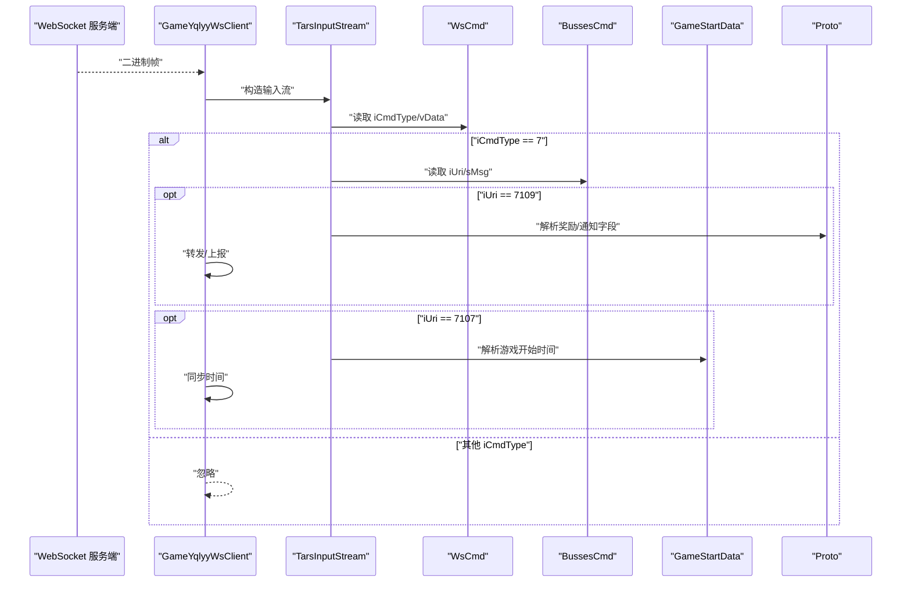
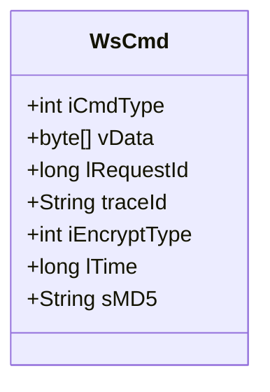
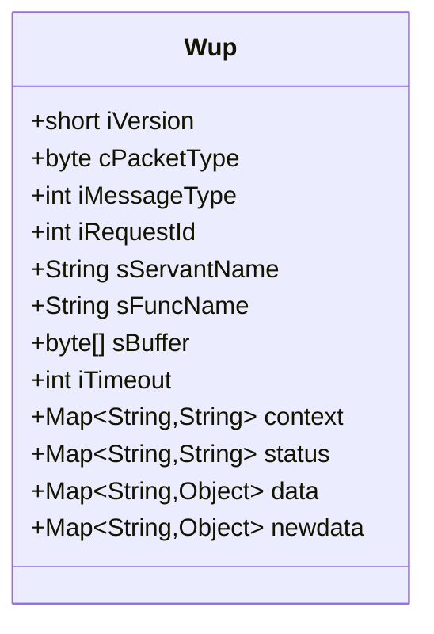
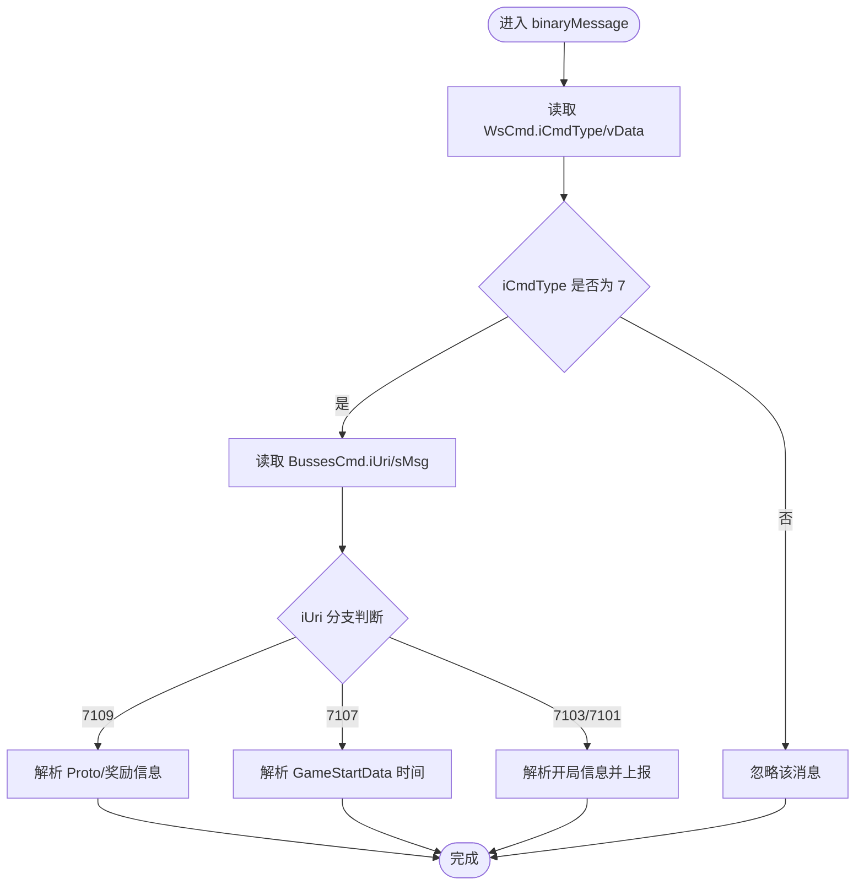
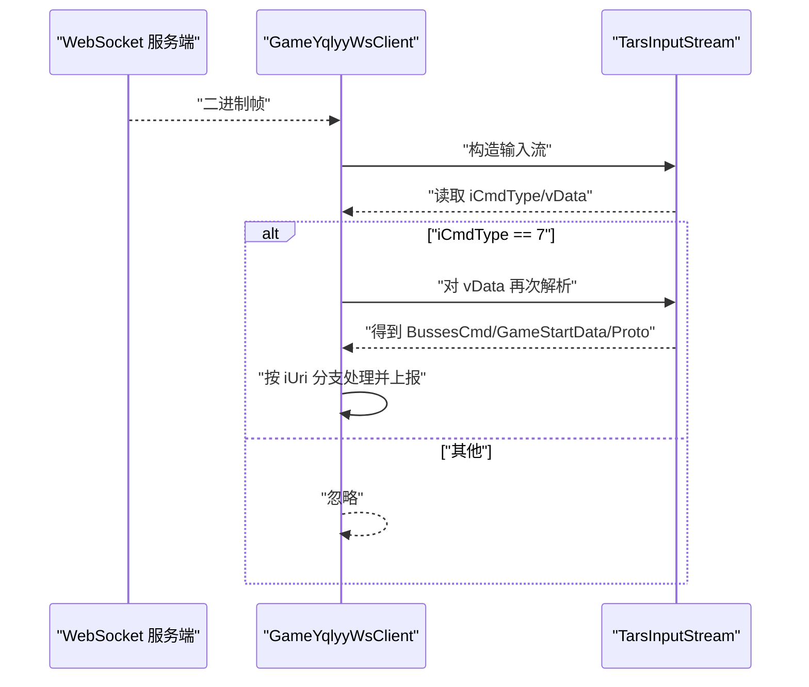
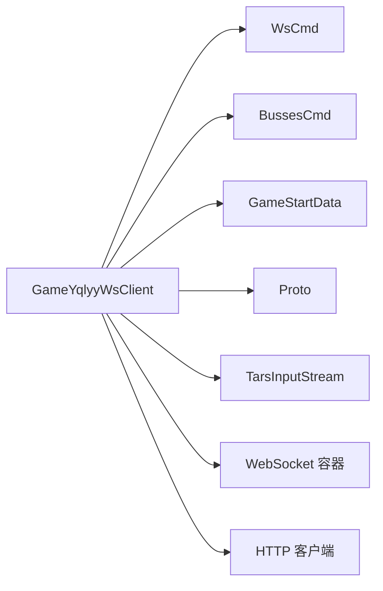

# 协议定义

<cite>
**本文引用的文件**
- [WsCmd.java](file://TigerTeeth/src/main/java/com/entity/WsCmd.java)
- [Wup.java](file://TigerTeeth/src/main/java/com/entity/Wup.java)
- [BussesCmd.java](file://TigerTeeth/src/main/java/com/entity/BussesCmd.java)
- [GameStartData.java](file://TigerTeeth/src/main/java/com/entity/GameStartData.java)
- [Proto.java](file://TigerTeeth/src/main/java/com/entity/AccountedNotify/Proto.java)
- [GameYqlyyWsClient.java](file://TigerTeeth/src/main/java/com/yqlyy/GameYqlyyWsClient.java)
- [DouyuOkHttp.java](file://bettaFish/src/main/java/com/utils/DouyuOkHttp.java)
- [BwhdSocketClient.java](file://game-proxy/src/main/java/com/game/gcbwz/BwhdSocketClient.java)
</cite>

## 目录
1. [引言](#引言)
2. [项目结构](#项目结构)
3. [核心组件](#核心组件)
4. [架构总览](#架构总览)
5. [详细组件分析](#详细组件分析)
6. [依赖关系分析](#依赖关系分析)
7. [性能与可靠性考量](#性能与可靠性考量)
8. [故障排查指南](#故障排查指南)
9. [结论](#结论)
10. [附录](#附录)

## 引言
本文件面向协议层与跨平台适配场景，系统性梳理并解释以下协议与实体模型的设计与用法：
- WebSocket 命令封装模型：WsCmd
- TARS 协议承载模型：Wup
- 推送/业务命令载体：BussesCmd
- 游戏时间与状态数据：GameStartData
- 通知/礼物等业务字段：Proto
- 实际协议使用示例：GameYqlyyWsClient（虎牙 WebSocket 客户端）
- 其他平台协议参考：DouyuOkHttp（斗鱼）、BwhdSocketClient（古城）

目标是帮助开发者理解协议头、消息类型、载荷结构、版本与扩展策略、编解码流程、错误处理与连接管理，从而在多游戏平台间实现稳定可靠的协议适配。

## 项目结构
围绕协议定义与使用的关键目录与文件如下：
- 协议与实体定义位于 TigerTeeth 模块的 entity 包
- WebSocket 客户端示例位于 TigerTeeth 的 yqlyy 包
- 其他平台协议参考位于 bettaFish 与 game-proxy 模块

图表来源
- [WsCmd.java](file://TigerTeeth/src/main/java/com/entity/WsCmd.java#L1-L68)
- [Wup.java](file://TigerTeeth/src/main/java/com/entity/Wup.java#L1-L28)
- [BussesCmd.java](file://TigerTeeth/src/main/java/com/entity/BussesCmd.java#L1-L9)
- [GameStartData.java](file://TigerTeeth/src/main/java/com/entity/GameStartData.java#L1-L79)
- [Proto.java](file://TigerTeeth/src/main/java/com/entity/AccountedNotify/Proto.java#L1-L8)
- [GameYqlyyWsClient.java](file://TigerTeeth/src/main/java/com/yqlyy/GameYqlyyWsClient.java#L1-L328)
- [DouyuOkHttp.java](file://bettaFish/src/main/java/com/utils/DouyuOkHttp.java#L178-L222)
- [BwhdSocketClient.java](file://game-proxy/src/main/java/com/game/gcbwz/BwhdSocketClient.java#L56-L87)

章节来源
- [WsCmd.java](file://TigerTeeth/src/main/java/com/entity/WsCmd.java#L1-L68)
- [Wup.java](file://TigerTeeth/src/main/java/com/entity/Wup.java#L1-L28)
- [BussesCmd.java](file://TigerTeeth/src/main/java/com/entity/BussesCmd.java#L1-L9)
- [GameStartData.java](file://TigerTeeth/src/main/java/com/entity/GameStartData.java#L1-L79)
- [Proto.java](file://TigerTeeth/src/main/java/com/entity/AccountedNotify/Proto.java#L1-L8)
- [GameYqlyyWsClient.java](file://TigerTeeth/src/main/java/com/yqlyy/GameYqlyyWsClient.java#L1-L328)
- [DouyuOkHttp.java](file://bettaFish/src/main/java/com/utils/DouyuOkHttp.java#L178-L222)
- [BwhdSocketClient.java](file://game-proxy/src/main/java/com/game/gcbwz/BwhdSocketClient.java#L56-L87)

## 核心组件
本节聚焦协议与实体模型的职责与字段含义，帮助快速建立对协议层的整体认知。

- WsCmd：WebSocket 层面的命令封装，包含命令类型、请求 ID、追踪 ID、时间戳、加密类型与数据载荷等，用于承载上层业务或 TARS 协议数据。
- Wup：TARS 协议承载对象，包含版本号、包类型、消息类型、请求 ID、服务名、函数名、缓冲区、超时、上下文与状态等，用于跨语言/跨进程的 RPC/消息传输。
- BussesCmd：推送/业务命令载体，包含推送类型、URI、消息体等，常作为 WsCmd 的 vData 内容进一步解析。
- GameStartData：游戏开始相关的时间与轮次信息，用于同步游戏状态。
- Proto：通知/礼物等业务字段的基础结构，常与其他实体组合使用。

章节来源
- [WsCmd.java](file://TigerTeeth/src/main/java/com/entity/WsCmd.java#L1-L68)
- [Wup.java](file://TigerTeeth/src/main/java/com/entity/Wup.java#L1-L28)
- [BussesCmd.java](file://TigerTeeth/src/main/java/com/entity/BussesCmd.java#L1-L9)
- [GameStartData.java](file://TigerTeeth/src/main/java/com/entity/GameStartData.java#L1-L79)
- [Proto.java](file://TigerTeeth/src/main/java/com/entity/AccountedNotify/Proto.java#L1-L8)

## 架构总览
下图展示了 WebSocket 接收路径中，从原始二进制到业务实体的解包与分发过程，体现协议层的抽象与适配思路。

图表来源
- [GameYqlyyWsClient.java](file://TigerTeeth/src/main/java/com/yqlyy/GameYqlyyWsClient.java#L51-L219)
- [WsCmd.java](file://TigerTeeth/src/main/java/com/entity/WsCmd.java#L1-L68)
- [BussesCmd.java](file://TigerTeeth/src/main/java/com/entity/BussesCmd.java#L1-L9)
- [GameStartData.java](file://TigerTeeth/src/main/java/com/entity/GameStartData.java#L1-L79)
- [Proto.java](file://TigerTeeth/src/main/java/com/entity/AccountedNotify/Proto.java#L1-L8)

## 详细组件分析

### WsCmd 设计与协议规范
- 字段与语义
  - iCmdType：命令/消息类型标识，决定后续解析分支
  - vData：数据载荷，通常为嵌套协议（如 TARS）序列化后的字节数组
  - lRequestId：请求 ID，便于请求-响应关联与追踪
  - traceId：链路追踪 ID，便于跨系统定位问题
  - iEncryptType：加密类型标识，指示载荷是否加密及采用何种算法
  - lTime：时间戳，用于校准与排序
  - sMD5：可选校验字段，用于完整性校验
- 抽象与适配
  - 作为 WebSocket 层的统一命令载体，WsCmd 将底层二进制帧抽象为结构化对象，屏蔽不同平台的帧格式差异
  - 通过 iCmdType 与 vData 的组合，可承载多种上层协议（如 Wup），实现“协议适配器”式的设计
- 版本与扩展
  - 当前未见明确的版本字段；建议在新增字段时采用“可选字段 + 默认值”的方式，以保证向后兼容
- 错误处理与健壮性
  - 若 iCmdType 非预期，应直接忽略并记录日志，避免影响后续消息处理

图表来源
- [WsCmd.java](file://TigerTeeth/src/main/java/com/entity/WsCmd.java#L1-L68)

章节来源
- [WsCmd.java](file://TigerTeeth/src/main/java/com/entity/WsCmd.java#L1-L68)

### Wup 设计与协议规范
- 字段与语义
  - iVersion：协议版本号，默认 3，用于版本协商与兼容控制
  - cPacketType：包类型，区分请求/响应/单向等
  - iMessageType：消息类型，用于路由与处理
  - iRequestId：请求 ID，配合响应匹配
  - sServantName/sFuncName：服务与函数名，用于定位调用目标
  - sBuffer：消息缓冲区，承载序列化后的消息体
  - iTimeout/context/status/data/newdata：超时、上下文、状态与数据容器，支持扩展
- 抽象与适配
  - Wup 作为 TARS 协议的承载对象，将跨语言/跨进程的消息标准化，便于在不同平台复用
  - 通过 context/status 可扩展协议元数据，如协议标识、版本等
- 版本与扩展
  - iVersion 明确为 3，若后续升级，建议在保持默认值的同时，通过新字段或新包类型实现向后兼容
- 错误处理与健壮性
  - 对缺失字段或不匹配的版本，应在解析前进行校验并返回错误或忽略

图表来源
- [Wup.java](file://TigerTeeth/src/main/java/com/entity/Wup.java#L1-L28)

章节来源
- [Wup.java](file://TigerTeeth/src/main/java/com/entity/Wup.java#L1-L28)

### BussesCmd 与 GameStartData：推送与状态
- BussesCmd
  - ePushType：推送类型，用于区分推送类别
  - iUri：业务 URI，用于标识具体业务域或事件
  - sMsg：消息体，通常为结构化数据（如 TARS 序列化）
- GameStartData
  - 记录旧/新轮次 ID、索引开始/结束时间、服务器时间等，用于同步游戏状态
- 在客户端示例中，根据 iUri 分支解析并执行相应动作（如同步时间、上报开奖结果）

图表来源
- [GameYqlyyWsClient.java](file://TigerTeeth/src/main/java/com/yqlyy/GameYqlyyWsClient.java#L51-L219)
- [BussesCmd.java](file://TigerTeeth/src/main/java/com/entity/BussesCmd.java#L1-L9)
- [GameStartData.java](file://TigerTeeth/src/main/java/com/entity/GameStartData.java#L1-L79)
- [Proto.java](file://TigerTeeth/src/main/java/com/entity/AccountedNotify/Proto.java#L1-L8)

章节来源
- [GameYqlyyWsClient.java](file://TigerTeeth/src/main/java/com/yqlyy/GameYqlyyWsClient.java#L51-L219)
- [BussesCmd.java](file://TigerTeeth/src/main/java/com/entity/BussesCmd.java#L1-L9)
- [GameStartData.java](file://TigerTeeth/src/main/java/com/entity/GameStartData.java#L1-L79)
- [Proto.java](file://TigerTeeth/src/main/java/com/entity/AccountedNotify/Proto.java#L1-L8)

### 协议在 WebSocket 中的作用与编解码
- 编解码流程
  - 二进制帧到达后，先按 WebSocket 规范解析为 ByteBuffer
  - 使用 TARS 输入流解析出 WsCmd 的 iCmdType 与 vData
  - 若 iCmdType 符合预期，则对 vData 再次用 TARS 流解析为 BussesCmd 或其他业务实体
- 错误处理
  - 非预期 iCmdType 直接忽略
  - 解析失败或字段缺失时记录日志并继续处理后续消息
- 连接管理
  - 客户端维护 Session，异常时重连
  - 设置合理的最大消息大小、空闲超时与异步发送超时，提升稳定性

图表来源
- [GameYqlyyWsClient.java](file://TigerTeeth/src/main/java/com/yqlyy/GameYqlyyWsClient.java#L51-L219)

章节来源
- [GameYqlyyWsClient.java](file://TigerTeeth/src/main/java/com/yqlyy/GameYqlyyWsClient.java#L51-L219)

### 其他平台协议参考
- 斗鱼（DouyuOkHttp）
  - 自定义二进制帧格式：长度、长度、固定短整型、两个字节、文本内容
  - 通过 ByteBuffer 组装并发送，体现协议层对帧格式的严格控制
- 古城（BwhdSocketClient）
  - 自定义心跳与会话参数，通过 JSON 控制连接行为，展示协议层对会话与心跳的定制能力

章节来源
- [DouyuOkHttp.java](file://bettaFish/src/main/java/com/utils/DouyuOkHttp.java#L178-L222)
- [BwhdSocketClient.java](file://game-proxy/src/main/java/com/game/gcbwz/BwhdSocketClient.java#L56-L87)

## 依赖关系分析
- 组件耦合
  - GameYqlyyWsClient 依赖 WsCmd、BussesCmd、GameStartData、Proto 等实体进行解析与处理
  - WsCmd 与 BussesCmd 形成“外层命令 + 内层业务”的分层设计，降低耦合度
- 外部依赖
  - TARS 输入流用于二进制解析
  - WebSocket 容器负责连接与消息分发
  - HTTP 客户端用于将解析结果上报至中转服务

图表来源
- [GameYqlyyWsClient.java](file://TigerTeeth/src/main/java/com/yqlyy/GameYqlyyWsClient.java#L1-L328)
- [WsCmd.java](file://TigerTeeth/src/main/java/com/entity/WsCmd.java#L1-L68)
- [BussesCmd.java](file://TigerTeeth/src/main/java/com/entity/BussesCmd.java#L1-L9)
- [GameStartData.java](file://TigerTeeth/src/main/java/com/entity/GameStartData.java#L1-L79)
- [Proto.java](file://TigerTeeth/src/main/java/com/entity/AccountedNotify/Proto.java#L1-L8)

章节来源
- [GameYqlyyWsClient.java](file://TigerTeeth/src/main/java/com/yqlyy/GameYqlyyWsClient.java#L1-L328)
- [WsCmd.java](file://TigerTeeth/src/main/java/com/entity/WsCmd.java#L1-L68)
- [BussesCmd.java](file://TigerTeeth/src/main/java/com/entity/BussesCmd.java#L1-L9)
- [GameStartData.java](file://TigerTeeth/src/main/java/com/entity/GameStartData.java#L1-L79)
- [Proto.java](file://TigerTeeth/src/main/java/com/entity/AccountedNotify/Proto.java#L1-L8)

## 性能与可靠性考量
- 消息缓冲区与超时
  - 合理设置 WebSocket 容器的最大消息缓冲区与空闲超时，避免内存占用过高或连接被意外断开
- 解析健壮性
  - 对缺失字段与非法字段进行防御性处理，避免解析异常导致整体流程中断
- 上报与重试
  - 对外部 HTTP 上报失败进行重试与降级，确保关键事件不丢失
- 加密与校验
  - 对敏感字段启用加密与完整性校验（如 sMD5），并在解析阶段进行校验

## 故障排查指南
- 常见问题
  - iCmdType 不匹配：确认上游是否变更命令类型或存在多协议混用
  - vData 解析失败：检查 TARS 字段顺序与版本一致性
  - 连接异常：查看 onError 日志，必要时触发重连逻辑
  - 上报失败：检查中转服务地址与网络连通性
- 建议步骤
  - 打印原始二进制与解析后的结构化对象，定位问题字段
  - 对关键分支添加日志埋点，覆盖成功与失败路径
  - 对异常进行分类统计，形成可观测性指标

章节来源
- [GameYqlyyWsClient.java](file://TigerTeeth/src/main/java/com/yqlyy/GameYqlyyWsClient.java#L245-L248)
- [GameYqlyyWsClient.java](file://TigerTeeth/src/main/java/com/yqlyy/GameYqlyyWsClient.java#L250-L272)

## 结论
- WsCmd 提供了 WebSocket 层的统一命令抽象，通过 iCmdType 与 vData 实现对多协议的承载
- Wup 作为 TARS 协议承载对象，明确了版本、消息类型与服务接口，便于跨平台复用
- BussesCmd 与 GameStartData 将业务事件与状态同步标准化，配合 Proto 等实体实现丰富的业务表达
- 在实际客户端中，通过严格的解析流程、错误处理与连接管理，实现了对多游戏平台协议的稳定适配

## 附录
- 最佳实践
  - 新增字段时采用可选字段与默认值，确保向后兼容
  - 对所有外部输入进行校验与限流，防止异常流量冲击
  - 对关键路径增加监控与告警，保障线上稳定性
  - 文档化协议字段含义与版本演进历史，便于团队协作与知识沉淀