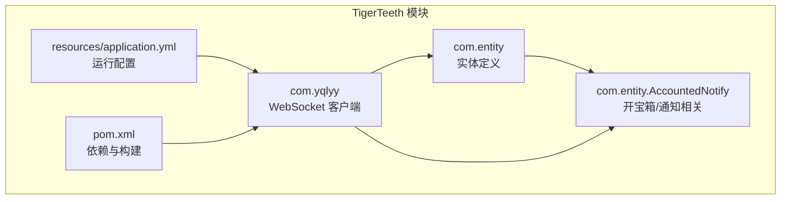
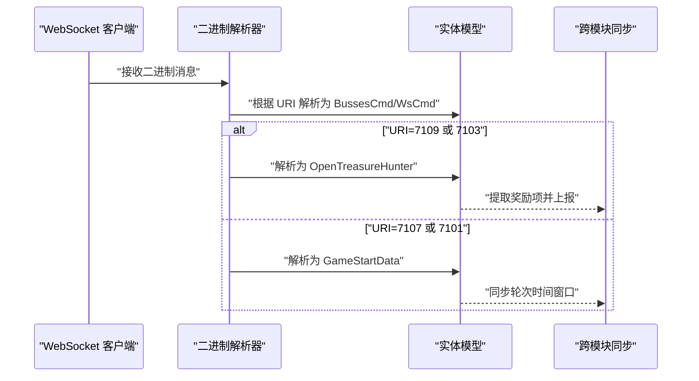
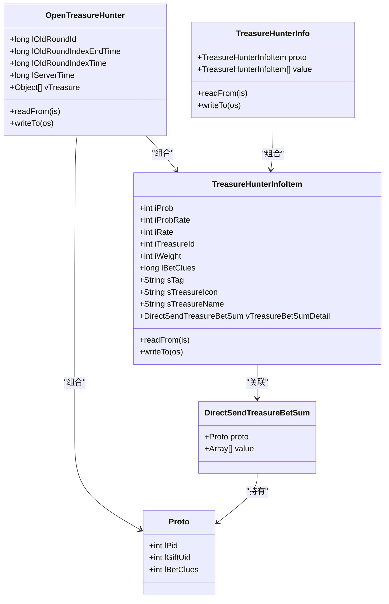
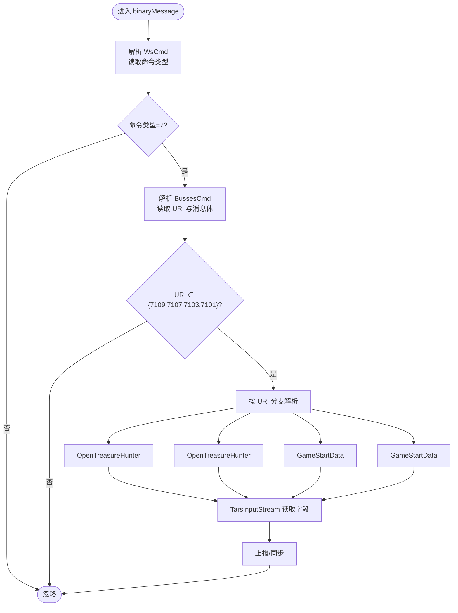
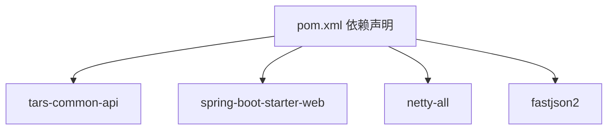

# 实体模型设计

<cite>
**本文引用的文件**
- [GameStartData.java](file://TigerTeeth/src/main/java/com/entity/GameStartData.java)
- [WsCmd.java](file://TigerTeeth/src/main/java/com/entity/WsCmd.java)
- [Wup.java](file://TigerTeeth/src/main/java/com/entity/Wup.java)
- [BussesCmd.java](file://TigerTeeth/src/main/java/com/entity/BussesCmd.java)
- [TreasureHunterInfo.java](file://TigerTeeth/src/main/java/com/entity/AccountedNotify/TreasureHunterInfo.java)
- [TreasureHunterInfoItem.java](file://TigerTeeth/src/main/java/com/entity/AccountedNotify/TreasureHunterInfoItem.java)
- [DirectSendTreasureBetSum.java](file://TigerTeeth/src/main/java/com/entity/AccountedNotify/DirectSendTreasureBetSum.java)
- [OpenTreasureHunter.java](file://TigerTeeth/src/main/java/com/entity/AccountedNotify/OpenTreasureHunter.java)
- [Proto.java](file://TigerTeeth/src/main/java/com/entity/AccountedNotify/Proto.java)
- [GameYqlyyWsClient.java](file://TigerTeeth/src/main/java/com/yqlyy/GameYqlyyWsClient.java)
- [application.yml](file://TigerTeeth/src/main/resources/application.yml)
- [Application.java](file://TigerTeeth/src/main/java/com/Application.java)
- [pom.xml](file://TigerTeeth/pom.xml)
</cite>

## 目录
1. [引言](#引言)
2. [项目结构](#项目结构)
3. [核心组件](#核心组件)
4. [架构总览](#架构总览)
5. [详细组件分析](#详细组件分析)
6. [依赖关系分析](#依赖关系分析)
7. [性能考量](#性能考量)
8. [故障排查指南](#故障排查指南)
9. [结论](#结论)
10. [附录](#附录)

## 引言
本文件围绕“实体模型设计”展开，系统性梳理游戏数据模型的设计思路与结构定义，重点覆盖以下方面：
- 游戏开始数据、通知消息结构、协议定义与数据传输对象（DTO）的字段语义与业务逻辑
- 实体之间的关系映射、继承层次与组合模式
- 数据验证规则、约束条件与业务规则的实现方式
- 实体模型的序列化与反序列化处理机制
- 模型演进历史、版本兼容性与迁移策略
- 实体模型在不同模块间的共享机制与数据一致性保障

## 项目结构
本仓库包含多个子工程，其中与实体模型直接相关的是 TigerTeeth 模块，其核心实体位于 com.entity 包及其子包 com.entity.AccountedNotify 下；同时，通信层通过 WebSocket 接收外部推送，解析后生成上述实体。

图表来源
- [GameStartData.java](file://TigerTeeth/src/main/java/com/entity/GameStartData.java#L1-L79)
- [WsCmd.java](file://TigerTeeth/src/main/java/com/entity/WsCmd.java#L1-L69)
- [Wup.java](file://TigerTeeth/src/main/java/com/entity/Wup.java#L1-L29)
- [BussesCmd.java](file://TigerTeeth/src/main/java/com/entity/BussesCmd.java#L1-L10)
- [TreasureHunterInfo.java](file://TigerTeeth/src/main/java/com/entity/AccountedNotify/TreasureHunterInfo.java#L1-L44)
- [TreasureHunterInfoItem.java](file://TigerTeeth/src/main/java/com/entity/AccountedNotify/TreasureHunterInfoItem.java#L1-L124)
- [OpenTreasureHunter.java](file://TigerTeeth/src/main/java/com/entity/AccountedNotify/OpenTreasureHunter.java#L1-L83)
- [GameYqlyyWsClient.java](file://TigerTeeth/src/main/java/com/yqlyy/GameYqlyyWsClient.java#L1-L200)
- [application.yml](file://TigerTeeth/src/main/resources/application.yml#L1-L31)
- [pom.xml](file://TigerTeeth/pom.xml#L1-L160)

章节来源
- [Application.java](file://TigerTeeth/src/main/java/com/Application.java#L1-L14)
- [application.yml](file://TigerTeeth/src/main/resources/application.yml#L1-L31)
- [pom.xml](file://TigerTeeth/pom.xml#L1-L160)

## 核心组件
本节对关键实体进行分层说明，涵盖字段含义、业务语义与典型用途。

- 游戏开始数据（GameStartData）
  - 字段：轮次标识、轮次索引起止时间、服务器时间、时间参数等
  - 业务语义：用于记录游戏轮次状态与时间窗口，支撑定时器与跨模块时间同步
  - 典型用途：接收外部推送后，将时间窗口同步至代理服务，确保各模块时间一致

- WebSocket 命令（WsCmd）
  - 字段：命令类型、数据载荷、请求 ID、追踪 ID、加密类型、时间戳、MD5 校验
  - 业务语义：承载二进制消息的元信息，用于后续解析与路由

- 业务命令（BussesCmd）
  - 字段：推送类型、URI、消息体
  - 业务语义：承载具体业务推送内容，如开宝箱、游戏开始等事件

- Tars 协议封装（Wup）
  - 字段：版本号、包类型、消息类型、请求 ID、服务名、函数名、缓冲区、上下文、状态、数据等
  - 业务语义：作为 RPC/协议封装载体，支持上下文传递与协议扩展

- 开宝箱通知（OpenTreasureHunter）
  - 字段：旧轮次标识、旧轮次索引起止时间、服务器时间、宝箱内容列表
  - 业务语义：描述一次开宝箱事件的上下文与奖励明细，列表元素包含奖励项与协议对象

- 宝箱奖励项（TreasureHunterInfoItem）
  - 字段：概率、概率倍率、倍率、宝物 ID、权重、投注线索、标签、图标、名称、奖励汇总详情
  - 业务语义：单个奖励项的完整描述，支持读写序列化

- 奖励汇总详情（DirectSendTreasureBetSum）
  - 字段：协议对象、值数组
  - 业务语义：承载奖励的聚合统计信息，与奖励项关联

- 协议对象（Proto）
  - 字段：协议 ID、礼物用户 ID、投注线索
  - 业务语义：通用协议载体，用于奖励汇总详情中的协议字段

- 宝箱奖励集合（TreasureHunterInfo）
  - 字段：协议项、奖励列表
  - 业务语义：封装奖励集合的读写行为，支持从输入流读取

章节来源
- [GameStartData.java](file://TigerTeeth/src/main/java/com/entity/GameStartData.java#L1-L79)
- [WsCmd.java](file://TigerTeeth/src/main/java/com/entity/WsCmd.java#L1-L69)
- [BussesCmd.java](file://TigerTeeth/src/main/java/com/entity/BussesCmd.java#L1-L10)
- [Wup.java](file://TigerTeeth/src/main/java/com/entity/Wup.java#L1-L29)
- [OpenTreasureHunter.java](file://TigerTeeth/src/main/java/com/entity/AccountedNotify/OpenTreasureHunter.java#L1-L83)
- [TreasureHunterInfoItem.java](file://TigerTeeth/src/main/java/com/entity/AccountedNotify/TreasureHunterInfoItem.java#L1-L124)
- [DirectSendTreasureBetSum.java](file://TigerTeeth/src/main/java/com/entity/AccountedNotify/DirectSendTreasureBetSum.java#L1-L9)
- [Proto.java](file://TigerTeeth/src/main/java/com/entity/AccountedNotify/Proto.java#L1-L8)
- [TreasureHunterInfo.java](file://TigerTeeth/src/main/java/com/entity/AccountedNotify/TreasureHunterInfo.java#L1-L44)

## 架构总览
下图展示 WebSocket 接收、解析与业务处理的整体流程，以及实体模型在其中的角色。

图表来源
- [GameYqlyyWsClient.java](file://TigerTeeth/src/main/java/com/yqlyy/GameYqlyyWsClient.java#L51-L200)
- [BussesCmd.java](file://TigerTeeth/src/main/java/com/entity/BussesCmd.java#L1-L10)
- [WsCmd.java](file://TigerTeeth/src/main/java/com/entity/WsCmd.java#L1-L69)
- [OpenTreasureHunter.java](file://TigerTeeth/src/main/java/com/entity/AccountedNotify/OpenTreasureHunter.java#L1-L83)
- [GameStartData.java](file://TigerTeeth/src/main/java/com/entity/GameStartData.java#L1-L79)

## 详细组件分析

### 类关系与继承层次
- 继承与序列化
  - OpenTreasureHunter、TreasureHunterInfoItem、TreasureHunterInfo 均继承自 TarsStructBase，具备 readFrom/writeTo 的序列化能力
  - 这些类通过 TarsInputStream/TarsOutputStream 对字段进行有序读写，字段顺序与编号由协议定义决定

- 组合模式
  - OpenTreasureHunter 组合了 TreasureHunterInfoItem 列表与 Proto 列表，形成“容器+元素”的组合结构
  - TreasureHunterInfoItem 与 DirectSendTreasureBetSum 关联，后者通过 Proto 与值数组承载聚合统计

图表来源
- [OpenTreasureHunter.java](file://TigerTeeth/src/main/java/com/entity/AccountedNotify/OpenTreasureHunter.java#L1-L83)
- [TreasureHunterInfoItem.java](file://TigerTeeth/src/main/java/com/entity/AccountedNotify/TreasureHunterInfoItem.java#L1-L124)
- [DirectSendTreasureBetSum.java](file://TigerTeeth/src/main/java/com/entity/AccountedNotify/DirectSendTreasureBetSum.java#L1-L9)
- [Proto.java](file://TigerTeeth/src/main/java/com/entity/AccountedNotify/Proto.java#L1-L8)
- [TreasureHunterInfo.java](file://TigerTeeth/src/main/java/com/entity/AccountedNotify/TreasureHunterInfo.java#L1-L44)

章节来源
- [OpenTreasureHunter.java](file://TigerTeeth/src/main/java/com/entity/AccountedNotify/OpenTreasureHunter.java#L1-L83)
- [TreasureHunterInfoItem.java](file://TigerTeeth/src/main/java/com/entity/AccountedNotify/TreasureHunterInfoItem.java#L1-L124)
- [DirectSendTreasureBetSum.java](file://TigerTeeth/src/main/java/com/entity/AccountedNotify/DirectSendTreasureBetSum.java#L1-L9)
- [Proto.java](file://TigerTeeth/src/main/java/com/entity/AccountedNotify/Proto.java#L1-L8)
- [TreasureHunterInfo.java](file://TigerTeeth/src/main/java/com/entity/AccountedNotify/TreasureHunterInfo.java#L1-L44)

### 数据验证与约束
- 字段校验
  - 时间戳与轮次 ID：作为时间窗口与轮次标识，需满足单调递增与非负约束
  - URI 与命令类型：仅接受预定义值（如 7109、7107、7103、7101），否则丢弃
  - MD5 校验：WsCmd 中提供 sMD5 字段，可用于消息完整性校验（实际校验逻辑需结合上层实现）

- 业务规则
  - 开宝箱事件仅在 URI=7109 或 7103 时触发
  - 游戏开始事件仅在 URI=7107 或 7101 时触发
  - 宝箱奖励列表为空时跳过上报

章节来源
- [WsCmd.java](file://TigerTeeth/src/main/java/com/entity/WsCmd.java#L1-L69)
- [BussesCmd.java](file://TigerTeeth/src/main/java/com/entity/BussesCmd.java#L1-L10)
- [GameYqlyyWsClient.java](file://TigerTeeth/src/main/java/com/yqlyy/GameYqlyyWsClient.java#L51-L200)

### 序列化与反序列化机制
- 协议栈
  - 外部推送采用二进制协议，首层为 WsCmd，携带命令类型与数据载荷
  - 数据载荷进一步解析为 BussesCmd，其中包含 URI 与消息体
  - 根据 URI 将消息体解析为 GameStartData 或 OpenTreasureHunter 等实体
  - OpenTreasureHunter、TreasureHunterInfoItem 等实体基于 TarsInputStream/TarsOutputStream 进行字段级读写

- 字段编号与顺序
  - 读写过程严格依据字段编号与顺序，确保与协议定义一致
  - 示例：OpenTreasureHunter 读取字段编号 0（旧轮次 ID）、4（奖励列表数组）

图表来源
- [GameYqlyyWsClient.java](file://TigerTeeth/src/main/java/com/yqlyy/GameYqlyyWsClient.java#L51-L200)
- [WsCmd.java](file://TigerTeeth/src/main/java/com/entity/WsCmd.java#L1-L69)
- [BussesCmd.java](file://TigerTeeth/src/main/java/com/entity/BussesCmd.java#L1-L10)
- [OpenTreasureHunter.java](file://TigerTeeth/src/main/java/com/entity/AccountedNotify/OpenTreasureHunter.java#L73-L81)
- [GameStartData.java](file://TigerTeeth/src/main/java/com/entity/GameStartData.java#L1-L79)

章节来源
- [GameYqlyyWsClient.java](file://TigerTeeth/src/main/java/com/yqlyy/GameYqlyyWsClient.java#L51-L200)
- [OpenTreasureHunter.java](file://TigerTeeth/src/main/java/com/entity/AccountedNotify/OpenTreasureHunter.java#L73-L81)
- [TreasureHunterInfoItem.java](file://TigerTeeth/src/main/java/com/entity/AccountedNotify/TreasureHunterInfoItem.java#L110-L122)

### 模型演进、版本兼容与迁移
- 版本控制
  - Wup 中包含 iVersion 字段，用于标识协议版本，便于后续兼容处理
- 兼容策略
  - 新增字段建议保持向后兼容，读取时忽略未知编号字段
  - 对于字段类型变更，应通过版本号区分解析路径
- 迁移建议
  - 当字段编号或顺序调整时，通过 URI 与版本号双维度控制解析分支
  - 保留历史解析逻辑一段时间，确保平滑过渡

章节来源
- [Wup.java](file://TigerTeeth/src/main/java/com/entity/Wup.java#L1-L29)

### 模块共享与数据一致性
- 共享机制
  - WebSocket 客户端解析后的实体通过 HTTP 请求同步至代理服务，实现跨模块共享
  - 同步目标包括“开宝箱结果”与“游戏开始时间”
- 一致性保障
  - 通过请求 ID、追踪 ID 与时间戳进行关联与审计
  - 对外同步采用幂等接口，避免重复推送导致的数据不一致

章节来源
- [GameYqlyyWsClient.java](file://TigerTeeth/src/main/java/com/yqlyy/GameYqlyyWsClient.java#L103-L116)
- [GameYqlyyWsClient.java](file://TigerTeeth/src/main/java/com/yqlyy/GameYqlyyWsClient.java#L136-L147)

## 依赖关系分析
- 外部依赖
  - Tars 协议：com.qq.tars.* 用于二进制序列化与反序列化
  - Spring Boot：提供 Web 与配置管理
  - Netty/HTTP 客户端：用于网络通信与请求发送
- 内部耦合
  - WebSocket 客户端与实体模型强耦合，解析逻辑直接依赖实体类
  - 实体之间通过组合与关联形成清晰边界，降低跨模块耦合

图表来源
- [pom.xml](file://TigerTeeth/pom.xml#L26-L111)

章节来源
- [pom.xml](file://TigerTeeth/pom.xml#L26-L111)

## 性能考量
- 解析性能
  - 采用二进制协议与 Tars 流式读写，减少序列化开销
  - 避免不必要的对象复制，优先复用输入流
- 网络与同步
  - 批量上报时合并请求，降低网络往返次数
  - 设置合理的超时与重试策略，提升稳定性

## 故障排查指南
- 常见问题
  - 命令类型不匹配：确认命令类型是否为 7
  - URI 不受支持：检查 URI 是否在允许范围内
  - 字段编号不一致：核对协议定义与读取编号
  - MD5 校验失败：启用 sMD5 校验并比对计算结果
- 排查步骤
  - 打印原始二进制与解析后的实体字段
  - 核对时间戳与轮次 ID 的单调性
  - 检查跨模块同步接口的返回码与日志

章节来源
- [WsCmd.java](file://TigerTeeth/src/main/java/com/entity/WsCmd.java#L1-L69)
- [BussesCmd.java](file://TigerTeeth/src/main/java/com/entity/BussesCmd.java#L1-L10)
- [GameYqlyyWsClient.java](file://TigerTeeth/src/main/java/com/yqlyy/GameYqlyyWsClient.java#L51-L200)

## 结论
本实体模型以 Tars 协议为核心，围绕“游戏开始数据”“通知消息结构”“协议封装”与“开宝箱通知”构建了清晰的数据模型与处理链路。通过严格的字段编号与版本控制，实现了良好的兼容性与可演进性；通过 WebSocket 客户端与 HTTP 同步，保障了跨模块共享与一致性。建议在后续迭代中完善字段校验与错误处理，持续优化解析与同步性能。

## 附录
- 字段命名规范
  - 基础类型前缀：i（整型）、l（长整型）、s（字符串）、v（变长数组）
  - 结构体与数组：使用驼峰命名，避免缩写
- 协议编号参考
  - 7109：开宝箱事件
  - 7107：游戏开始事件（第一种）
  - 7103：开宝箱事件（另一种）
  - 7101：游戏开始事件（另一种）