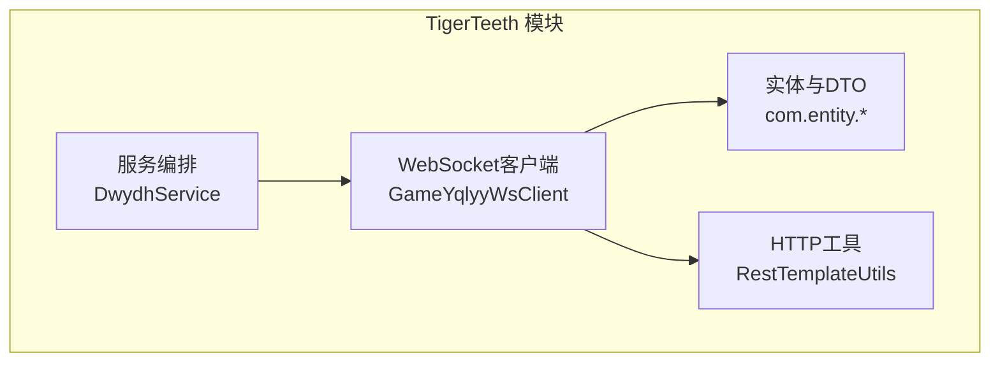
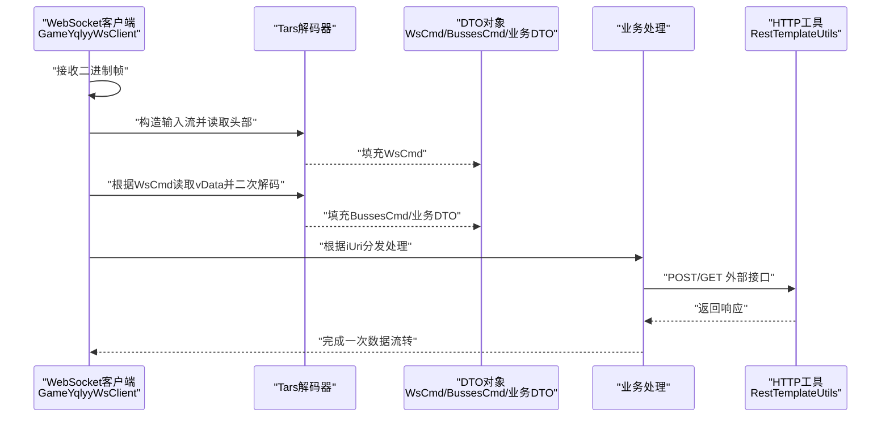
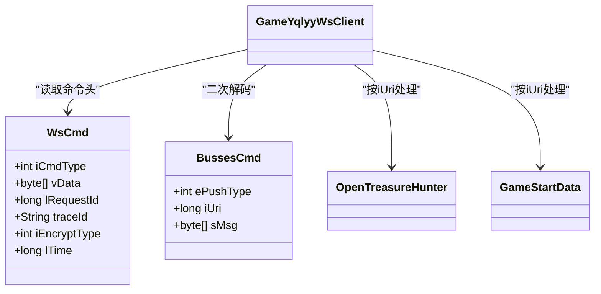
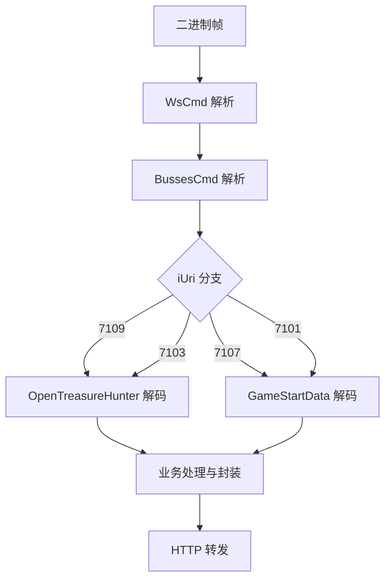
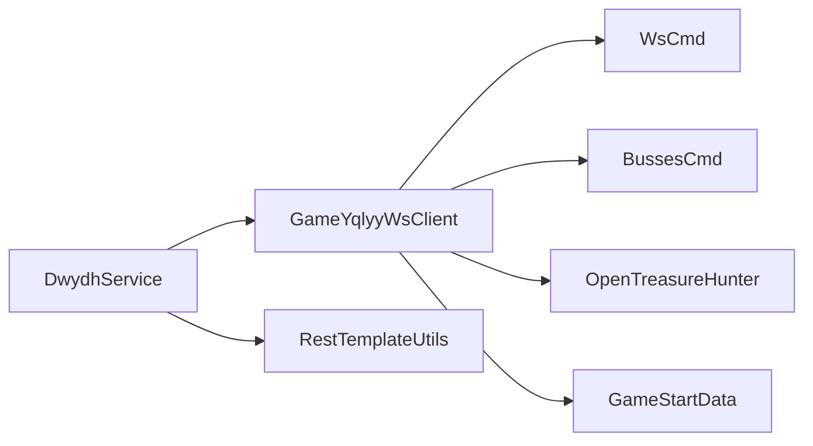

# 数据传输对象

<cite>
**本文引用的文件**
- [BussesCmd.java](file://TigerTeeth/src/main/java/com/entity/BussesCmd.java)
- [WsCmd.java](file://TigerTeeth/src/main/java/com/entity/WsCmd.java)
- [GameStartData.java](file://TigerTeeth/src/main/java/com/entity/GameStartData.java)
- [Wup.java](file://TigerTeeth/src/main/java/com/entity/Wup.java)
- [OpenTreasureHunter.java](file://TigerTeeth/src/main/java/com/entity/AccountedNotify/OpenTreasureHunter.java)
- [TreasureHunterInfo.java](file://TigerTeeth/src/main/java/com/entity/AccountedNotify/TreasureHunterInfo.java)
- [TreasureHunterInfoItem.java](file://TigerTeeth/src/main/java/com/entity/AccountedNotify/TreasureHunterInfoItem.java)
- [DirectSendTreasureBetSum.java](file://TigerTeeth/src/main/java/com/entity/AccountedNotify/DirectSendTreasureBetSum.java)
- [Proto.java](file://TigerTeeth/src/main/java/com/entity/AccountedNotify/Proto.java)
- [GameYqlyyWsClient.java](file://TigerTeeth/src/main/java/com/yqlyy/GameYqlyyWsClient.java)
- [DwydhService.java](file://TigerTeeth/src/main/java/com/dwydh/DwydhService.java)
- [RestTemplateUtils.java（TigerTeeth）](file://TigerTeeth/src/main/java/com/commom/RestTemplateUtils.java)
- [application.yml](file://TigerTeeth/src/main/resources/application.yml)
</cite>

## 目录
1. [引言](#引言)
2. [项目结构](#项目结构)
3. [核心组件](#核心组件)
4. [架构总览](#架构总览)
5. [组件详解](#组件详解)
6. [依赖关系分析](#依赖关系分析)
7. [性能考量](#性能考量)
8. [故障排查指南](#故障排查指南)
9. [结论](#结论)
10. [附录](#附录)

## 引言
本文件围绕“数据传输对象”（DTO）在系统中的设计与应用展开，重点剖析 BussesCmd 类的结构、字段映射与业务封装，并结合 WebSocket 接收、解析、转发流程，说明 DTO 在 API 接口、服务调用与数据持久化之外的“跨进程/跨模块数据封装与安全传递”角色。同时，对比 DTO 与实体模型的差异与联系，总结在不同层次间的数据映射机制与最佳实践。

## 项目结构
该仓库包含多个子工程，其中与 DTO 直接相关的是 TigerTeeth 模块。其核心路径如下：
- 实体与 DTO：com.entity 包含 BussesCmd、WsCmd、GameStartData、Wup 以及 AccountedNotify 子包下的多类 DTO/模型
- 业务接入层：com.yqlyy 的 WebSocket 客户端负责接收二进制帧并解析为 DTO
- 服务编排：com.dwydh 的 DwydhService 调度客户端执行上报与心跳
- HTTP 工具：com.commom 的 RestTemplateUtils 封装 HTTP 请求，用于将 DTO 转换后的数据对外转发

**图表来源**
- [GameYqlyyWsClient.java](file://TigerTeeth/src/main/java/com/yqlyy/GameYqlyyWsClient.java#L1-L328)
- [DwydhService.java](file://TigerTeeth/src/main/java/com/dwydh/DwydhService.java#L1-L39)
- [RestTemplateUtils.java（TigerTeeth）](file://TigerTeeth/src/main/java/com/commom/RestTemplateUtils.java#L1-L31)

**章节来源**
- [application.yml](file://TigerTeeth/src/main/resources/application.yml#L1-L31)

## 核心组件
本节聚焦于与 DTO 相关的核心类及其职责：
- BussesCmd：承载来自 WebSocket 的二进制消息片段，包含推送类型、URI 与消息体
- WsCmd：封装 WebSocket 协议层命令头信息（如命令类型、数据体、时间戳等）
- GameStartData：封装游戏开始相关的时间与轮次信息
- Wup：封装 RPC/协议层的包头与上下文字段
- AccountedNotify 子包：包含 OpenTreasureHunter、TreasureHunterInfo、TreasureHunterInfoItem、DirectSendTreasureBetSum、Proto 等，用于描述开宝箱/开奖结果等业务数据

这些类共同构成系统中的“数据传输对象”，用于在不同网络层、协议层与业务层之间传递结构化数据。

**章节来源**
- [BussesCmd.java](file://TigerTeeth/src/main/java/com/entity/BussesCmd.java#L1-L10)
- [WsCmd.java](file://TigerTeeth/src/main/java/com/entity/WsCmd.java#L1-L69)
- [GameStartData.java](file://TigerTeeth/src/main/java/com/entity/GameStartData.java#L1-L79)
- [Wup.java](file://TigerTeeth/src/main/java/com/entity/Wup.java#L1-L29)
- [OpenTreasureHunter.java](file://TigerTeeth/src/main/java/com/entity/AccountedNotify/OpenTreasureHunter.java#L1-L83)
- [TreasureHunterInfo.java](file://TigerTeeth/src/main/java/com/entity/AccountedNotify/TreasureHunterInfo.java#L1-L44)
- [TreasureHunterInfoItem.java](file://TigerTeeth/src/main/java/com/entity/AccountedNotify/TreasureHunterInfoItem.java#L1-L124)
- [DirectSendTreasureBetSum.java](file://TigerTeeth/src/main/java/com/entity/AccountedNotify/DirectSendTreasureBetSum.java#L1-L9)
- [Proto.java](file://TigerTeeth/src/main/java/com/entity/AccountedNotify/Proto.java#L1-L8)

## 架构总览
下图展示了从 WebSocket 接收原始二进制帧到解析为 DTO，再到业务处理与外部 HTTP 转发的整体流程。该流程体现了 DTO 在“解码—封装—转换—转发”的关键作用。

**图表来源**
- [GameYqlyyWsClient.java](file://TigerTeeth/src/main/java/com/yqlyy/GameYqlyyWsClient.java#L52-L219)
- [WsCmd.java](file://TigerTeeth/src/main/java/com/entity/WsCmd.java#L1-L69)
- [BussesCmd.java](file://TigerTeeth/src/main/java/com/entity/BussesCmd.java#L1-L10)
- [RestTemplateUtils.java（TigerTeeth）](file://TigerTeeth/src/main/java/com/commom/RestTemplateUtils.java#L1-L31)

## 组件详解

### BussesCmd 类：设计目的与应用场景
- 设计目的
  - 承载来自 WebSocket 的二进制消息片段，作为“中间层 DTO”参与协议解码与业务分发
  - 通过字段 ePushType、iUri、sMsg 映射底层协议的关键元信息与负载
- 字段映射
  - ePushType：推送类型标识，用于区分推送策略或业务域
  - iUri：业务 URI，用于路由到具体业务处理器（如 7109、7107、7103、7101）
  - sMsg：消息体字节数组，承载后续 Tars 解码所需的业务数据
- 业务封装
  - 与 WsCmd 配合，先解析命令头，再按 iUri 选择对应的业务 DTO（如 OpenTreasureHunter、GameStartData）进行二次解码
  - 在 GameYqlyyWsClient 中被实例化并填充，随后驱动业务分支逻辑

**图表来源**
- [BussesCmd.java](file://TigerTeeth/src/main/java/com/entity/BussesCmd.java#L1-L10)
- [WsCmd.java](file://TigerTeeth/src/main/java/com/entity/WsCmd.java#L1-L69)
- [OpenTreasureHunter.java](file://TigerTeeth/src/main/java/com/entity/AccountedNotify/OpenTreasureHunter.java#L1-L83)
- [GameStartData.java](file://TigerTeeth/src/main/java/com/entity/GameStartData.java#L1-L79)
- [GameYqlyyWsClient.java](file://TigerTeeth/src/main/java/com/yqlyy/GameYqlyyWsClient.java#L52-L219)

**章节来源**
- [BussesCmd.java](file://TigerTeeth/src/main/java/com/entity/BussesCmd.java#L1-L10)
- [GameYqlyyWsClient.java](file://TigerTeeth/src/main/java/com/yqlyy/GameYqlyyWsClient.java#L52-L219)

### DTO 模式在系统架构中的作用
- 数据封装
  - 将底层协议（Tars/二进制）与上层业务逻辑解耦，以结构化的 DTO 表达业务语义
- 数据转换
  - 在 WebSocket 层（WsCmd/BussesCmd）与业务层（OpenTreasureHunter/GameStartData）之间进行字段映射与类型转换
- 安全传递
  - 通过 DTO 限定对外暴露的字段集合，避免直接暴露内部实体细节；在 HTTP 转发前可进行序列化与校验

### DTO 与实体模型的区别与联系
- 区别
  - DTO 更关注“跨边界传输”的结构与契约，字段通常更精简，便于序列化与网络传输
  - 实体模型更贴近数据库/领域模型，包含业务行为与状态
- 联系
  - DTO 可由实体模型派生或映射而来；在某些场景下，二者可能同名但职责不同（例如业务 DTO 仅用于传输）

### 不同层次间的数据映射机制
- WebSocket 接收层 → DTO 层
  - 使用 TarsInputStream 逐字段读取，填充 WsCmd 与 BussesCmd
- DTO 层 → 业务处理层
  - 根据 iUri 判定业务 DTO（如 OpenTreasureHunter、GameStartData），再次解码并组装业务对象
- 业务处理层 → 外部接口层
  - 将业务 DTO 转换为 JSON 或其他格式，借助 RestTemplateUtils 发送 HTTP 请求

**图表来源**
- [GameYqlyyWsClient.java](file://TigerTeeth/src/main/java/com/yqlyy/GameYqlyyWsClient.java#L52-L219)
- [OpenTreasureHunter.java](file://TigerTeeth/src/main/java/com/entity/AccountedNotify/OpenTreasureHunter.java#L73-L81)
- [GameStartData.java](file://TigerTeeth/src/main/java/com/entity/GameStartData.java#L12-L76)

**章节来源**
- [GameYqlyyWsClient.java](file://TigerTeeth/src/main/java/com/yqlyy/GameYqlyyWsClient.java#L52-L219)

### 在 API 接口、服务调用与数据持久化中的使用方式
- API 接口
  - 通过 RestTemplateUtils 将 DTO 转换为 JSON 并 POST/GET 到下游服务，实现跨服务的数据传递
- 服务调用
  - DwydhService 调度 GameYqlyyWsClient 定时上报，形成“服务-客户端-外部接口”的链路
- 数据持久化
  - 当前代码未直接展示持久化逻辑；若需持久化，可在业务处理阶段将 DTO 映射为实体模型后写入存储

**章节来源**
- [DwydhService.java](file://TigerTeeth/src/main/java/com/dwydh/DwydhService.java#L21-L36)
- [RestTemplateUtils.java（TigerTeeth）](file://TigerTeeth/src/main/java/com/commom/RestTemplateUtils.java#L19-L29)

## 依赖关系分析
- 组件耦合
  - GameYqlyyWsClient 依赖 WsCmd、BussesCmd 与 AccountedNotify 下的业务 DTO 进行解码与分发
  - DwydhService 依赖 GameYqlyyWsClient 与 RestTemplateUtils
- 外部依赖
  - Tars 协议栈用于二进制解码
  - Spring RestTemplate 用于 HTTP 调用

**图表来源**
- [GameYqlyyWsClient.java](file://TigerTeeth/src/main/java/com/yqlyy/GameYqlyyWsClient.java#L1-L328)
- [DwydhService.java](file://TigerTeeth/src/main/java/com/dwydh/DwydhService.java#L1-L39)
- [RestTemplateUtils.java（TigerTeeth）](file://TigerTeeth/src/main/java/com/commom/RestTemplateUtils.java#L1-L31)

**章节来源**
- [GameYqlyyWsClient.java](file://TigerTeeth/src/main/java/com/yqlyy/GameYqlyyWsClient.java#L1-L328)
- [DwydhService.java](file://TigerTeeth/src/main/java/com/dwydh/DwydhService.java#L1-L39)

## 性能考量
- 二进制解码
  - 使用 TarsInputStream 逐字段读取，减少不必要的拷贝与解析成本
- 缓冲区大小
  - WebSocket 客户端设置了默认最大二进制消息缓冲区，避免内存溢出
- 线程与调度
  - 使用线程池执行长周期任务，避免阻塞主线程
- HTTP 调用
  - 使用 RestTemplate 进行异步/非阻塞调用，注意超时与重试策略

**章节来源**
- [GameYqlyyWsClient.java](file://TigerTeeth/src/main/java/com/yqlyy/GameYqlyyWsClient.java#L250-L272)
- [DwydhService.java](file://TigerTeeth/src/main/java/com/dwydh/DwydhService.java#L21-L36)
- [application.yml](file://TigerTeeth/src/main/resources/application.yml#L16-L31)

## 故障排查指南
- WebSocket 连接异常
  - 检查 onOpen/onError 回调日志，确认 URL 与握手参数
- 二进制解码失败
  - 核对 iCmdType 与 iUri 是否匹配预期；确认字段索引与类型一致
- HTTP 转发异常
  - 检查 RestTemplateUtils 的 URL 与请求体格式；关注 RestClientException

**章节来源**
- [GameYqlyyWsClient.java](file://TigerTeeth/src/main/java/com/yqlyy/GameYqlyyWsClient.java#L240-L249)
- [RestTemplateUtils.java（TigerTeeth）](file://TigerTeeth/src/main/java/com/commom/RestTemplateUtils.java#L19-L29)

## 结论
BussesCmd 作为 WebSocket 二进制帧到业务 DTO 的桥梁，承担了协议解码与业务路由的关键职责。通过 DTO 模式，系统实现了“解耦—封装—转换—安全传递”的数据流转闭环。建议在后续演进中：
- 明确 DTO 与实体的边界，避免混用
- 在 DTO 层引入校验与序列化规范，提升可维护性
- 对热点路径进行性能压测与优化，确保高并发下的稳定性

## 附录
- 关键流程路径参考
  - [WebSocket 接收与解析](file://TigerTeeth/src/main/java/com/yqlyy/GameYqlyyWsClient.java#L52-L219)
  - [DTO 封装与业务分发](file://TigerTeeth/src/main/java/com/entity/BussesCmd.java#L1-L10)
  - [HTTP 转发工具](file://TigerTeeth/src/main/java/com/commom/RestTemplateUtils.java#L19-L29)