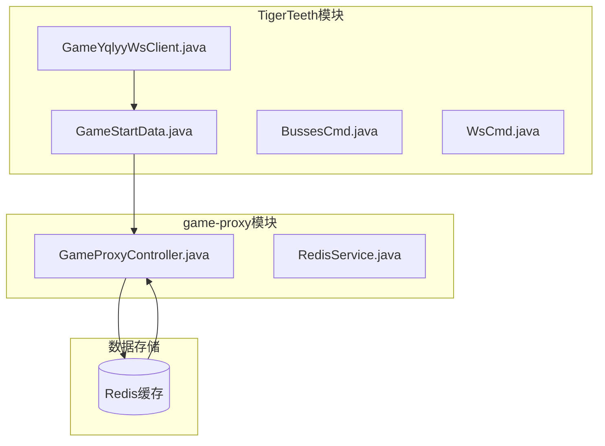
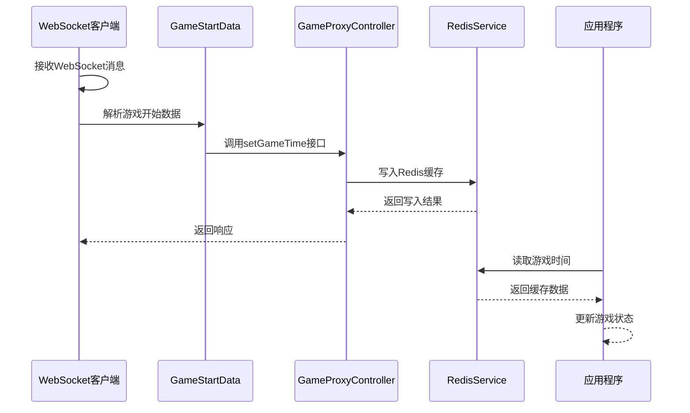
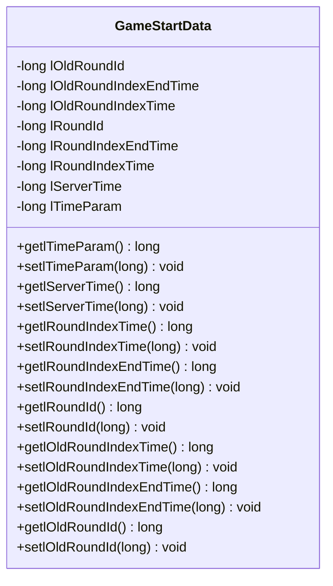
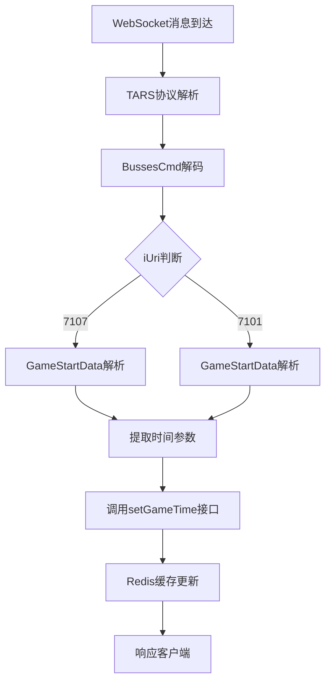
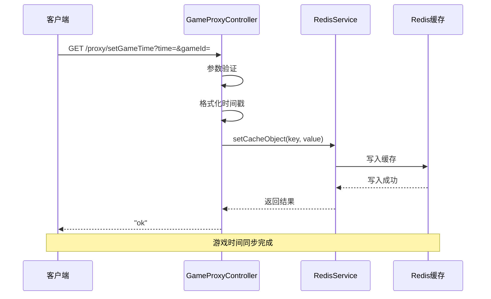
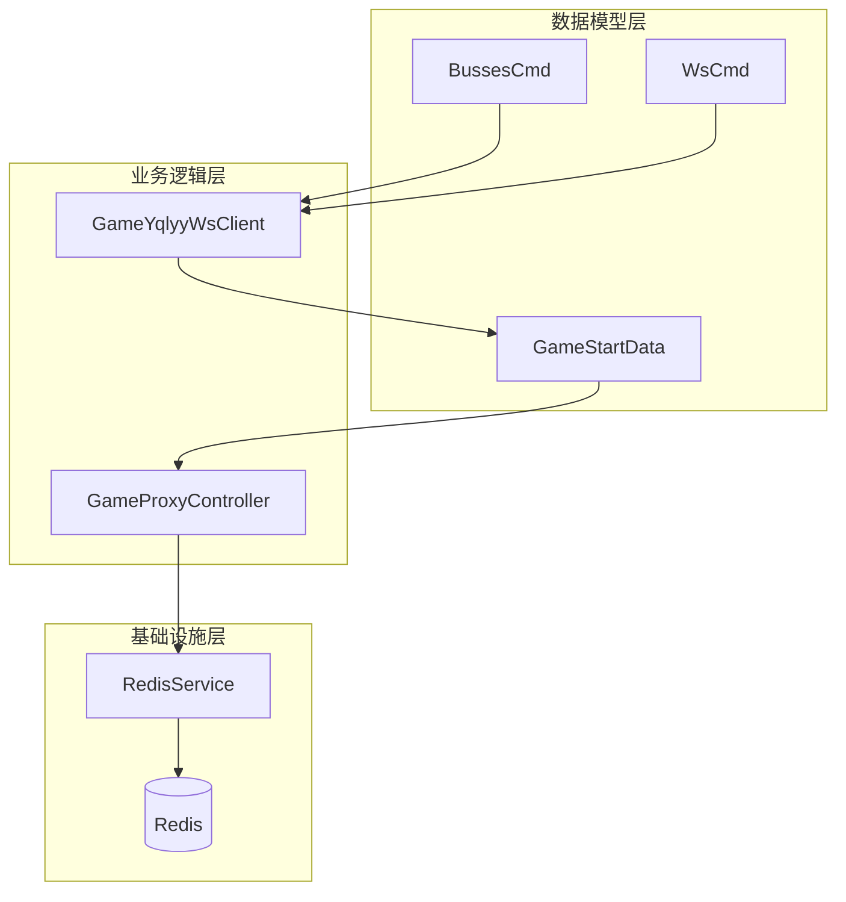

# 游戏数据模型

<cite>
**本文档引用的文件**
- [GameStartData.java](file://TigerTeeth/src/main/java/com/entity/GameStartData.java)
- [GameYqlyyWsClient.java](file://TigerTeeth/src/main/java/com/yqlyy/GameYqlyyWsClient.java)
- [GameProxyController.java](file://game-proxy/src/main/java/com/game/controller/GameProxyController.java)
- [RedisService.java](file://game-proxy/src/main/java/com/game/redis/RedisService.java)
- [BussesCmd.java](file://TigerTeeth/src/main/java/com/entity/BussesCmd.java)
- [WsCmd.java](file://TigerTeeth/src/main/java/com/entity/WsCmd.java)
- [TreasureHunterInfo.java](file://TigerTeeth/src/main/java/com/entity/AccountedNotify/TreasureHunterInfo.java)
</cite>

## 目录
1. [简介](#简介)
2. [项目结构](#项目结构)
3. [核心组件](#核心组件)
4. [架构概览](#架构概览)
5. [详细组件分析](#详细组件分析)
6. [依赖关系分析](#依赖关系分析)
7. [性能考量](#性能考量)
8. [故障排除指南](#故障排除指南)
9. [结论](#结论)

## 简介

本文档深入解析游戏数据模型中的GameStartData类，这是一个关键的游戏状态管理类，负责存储和传输游戏轮次信息、时间参数和服务器时间同步数据。该类在游戏状态监控和时间同步机制中发挥着核心作用，确保各个游戏模块能够准确获取和处理游戏开始时间、轮次状态等关键信息。

## 项目结构

游戏数据模型位于TigerTeeth模块的entity包中，与WebSocket客户端和游戏代理服务共同构成了完整的游戏数据处理链路：

**图表来源**
- [GameStartData.java](file://TigerTeeth/src/main/java/com/entity/GameStartData.java#L1-L79)
- [GameYqlyyWsClient.java](file://TigerTeeth/src/main/java/com/yqlyy/GameYqlyyWsClient.java#L119-L147)
- [GameProxyController.java](file://game-proxy/src/main/java/com/game/controller/GameProxyController.java#L326-L337)

**章节来源**
- [GameStartData.java](file://TigerTeeth/src/main/java/com/entity/GameStartData.java#L1-L79)
- [GameYqlyyWsClient.java](file://TigerTeeth/src/main/java/com/yqlyy/GameYqlyyWsClient.java#L1-L218)

## 核心组件

GameStartData类是一个简单的数据传输对象(POJO)，包含以下核心字段：

### 主要字段分类

| 字段类别 | 字段名称 | 数据类型 | 描述 |
|---------|----------|----------|------|
| 轮次标识 | lRoundId | long | 当前游戏轮次ID |
| 轮次索引 | lRoundIndexTime | long | 当前轮次开始时间戳 |
| 轮次结束 | lRoundIndexEndTime | long | 当前轮次结束时间戳 |
| 旧轮次标识 | lOldRoundId | long | 上一个游戏轮次ID |
| 旧轮次索引 | lOldRoundIndexTime | long | 上一轮次开始时间戳 |
| 旧轮次结束 | lOldRoundIndexEndTime | long | 上一轮次结束时间戳 |
| 服务器时间 | lServerTime | long | 服务器当前时间戳 |
| 时间参数 | lTimeParam | long | 游戏时间相关参数 |

**章节来源**
- [GameStartData.java](file://TigerTeeth/src/main/java/com/entity/GameStartData.java#L3-L10)

## 架构概览

整个游戏数据模型采用分层架构设计，实现了从数据采集到存储再到应用的完整流程：

**图表来源**
- [GameYqlyyWsClient.java](file://TigerTeeth/src/main/java/com/yqlyy/GameYqlyyWsClient.java#L119-L147)
- [GameProxyController.java](file://game-proxy/src/main/java/com/game/controller/GameProxyController.java#L326-L337)
- [RedisService.java](file://game-proxy/src/main/java/com/game/redis/RedisService.java#L30-L44)

## 详细组件分析

### GameStartData类设计分析

#### 类结构图

**图表来源**
- [GameStartData.java](file://TigerTeeth/src/main/java/com/entity/GameStartData.java#L3-L78)

#### 字段业务逻辑详解

##### 轮次管理字段
- **lRoundId**: 当前游戏轮次的唯一标识符，用于区分不同的游戏轮次
- **lOldRoundId**: 上一个游戏轮次的标识符，支持轮次切换追踪
- **lRoundIndexTime**: 当前轮次开始时间戳，精确到毫秒
- **lOldRoundIndexTime**: 上一轮次开始时间戳
- **lRoundIndexEndTime**: 当前轮次结束时间戳
- **lOldRoundIndexEndTime**: 上一轮次结束时间戳

##### 时间同步字段
- **lServerTime**: 服务器当前时间戳，用于客户端与服务器时间同步
- **lTimeParam**: 游戏特定的时间参数，可能包含游戏配置或调整参数

**章节来源**
- [GameStartData.java](file://TigerTeeth/src/main/java/com/entity/GameStartData.java#L3-L78)

### WebSocket数据处理流程

#### 数据接收与解析

**图表来源**
- [GameYqlyyWsClient.java](file://TigerTeeth/src/main/java/com/yqlyy/GameYqlyyWsClient.java#L119-L147)

**章节来源**
- [GameYqlyyWsClient.java](file://TigerTeeth/src/main/java/com/yqlyy/GameYqlyyWsClient.java#L50-L218)

### 游戏代理服务集成

#### 时间同步接口实现

**图表来源**
- [GameProxyController.java](file://game-proxy/src/main/java/com/game/controller/GameProxyController.java#L326-L337)
- [RedisService.java](file://game-proxy/src/main/java/com/game/redis/RedisService.java#L30-L44)

**章节来源**
- [GameProxyController.java](file://game-proxy/src/main/java/com/game/controller/GameProxyController.java#L326-L337)

## 依赖关系分析

### 组件间依赖关系

**图表来源**
- [GameStartData.java](file://TigerTeeth/src/main/java/com/entity/GameStartData.java#L1-L79)
- [GameYqlyyWsClient.java](file://TigerTeeth/src/main/java/com/yqlyy/GameYqlyyWsClient.java#L1-L218)
- [GameProxyController.java](file://game-proxy/src/main/java/com/game/controller/GameProxyController.java#L1-L436)

### 关键依赖特性

1. **低耦合设计**: GameStartData不依赖具体业务逻辑，仅作为数据载体
2. **可扩展性**: 支持新增字段而不影响现有功能
3. **线程安全**: Redis缓存操作保证并发安全性
4. **容错性**: 完善的异常处理和参数验证机制

**章节来源**
- [RedisService.java](file://game-proxy/src/main/java/com/game/redis/RedisService.java#L1-L244)

## 性能考量

### 时间复杂度分析

- **数据读取**: O(1) - Redis键值访问
- **数据写入**: O(1) - Redis缓存写入
- **内存占用**: O(n) - n为活跃游戏数量
- **网络延迟**: O(1) - 内部服务调用

### 优化建议

1. **缓存策略**: 合理设置Redis过期时间，避免内存泄漏
2. **批量处理**: 对于大量游戏同时进行时，考虑批量时间同步
3. **连接池**: 使用连接池管理Redis连接，提高并发性能
4. **监控指标**: 添加性能监控，及时发现性能瓶颈

## 故障排除指南

### 常见问题及解决方案

#### 时间同步失败
- **症状**: 游戏开始时间无法正确显示
- **原因**: Redis连接异常或参数格式错误
- **解决**: 检查Redis服务状态，验证时间戳格式

#### WebSocket消息解析错误
- **症状**: GameStartData字段值异常
- **原因**: TARS协议解析失败或字段索引错误
- **解决**: 验证消息格式，检查字段映射关系

#### 缓存数据过期
- **症状**: 获取游戏时间返回null
- **原因**: 缓存过期或被清理
- **解决**: 检查缓存配置，适当延长过期时间

**章节来源**
- [GameYqlyyWsClient.java](file://TigerTeeth/src/main/java/com/yqlyy/GameYqlyyWsClient.java#L135-L147)
- [GameProxyController.java](file://game-proxy/src/main/java/com/game/controller/GameProxyController.java#L326-L337)

## 结论

GameStartData类作为游戏数据模型的核心组件，通过其精心设计的字段结构和完整的生命周期管理，为游戏状态监控和时间同步提供了可靠的数据基础。该类的设计体现了以下优势：

1. **清晰的职责分离**: 专注于数据存储，不承担业务逻辑
2. **强健的扩展性**: 支持未来功能扩展而不破坏现有接口
3. **高效的性能表现**: 基于Redis的快速数据访问
4. **完善的错误处理**: 提供可靠的异常处理机制

通过WebSocket客户端、游戏代理服务和Redis缓存的协同工作，GameStartData实现了游戏开始时间的准确计算和状态跟踪，为整个游戏系统的稳定运行提供了重要保障。