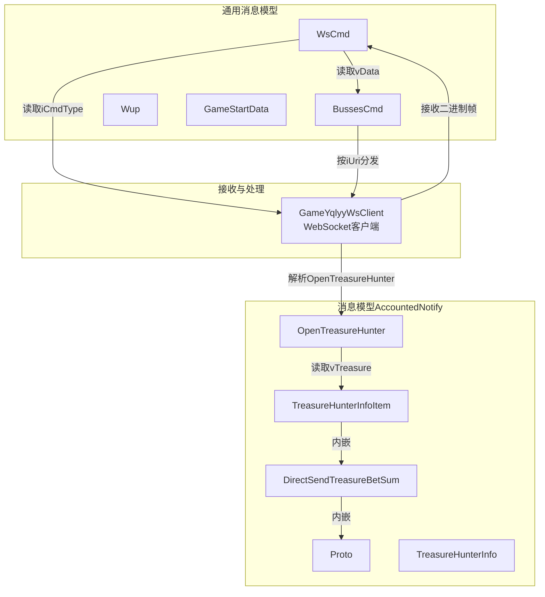
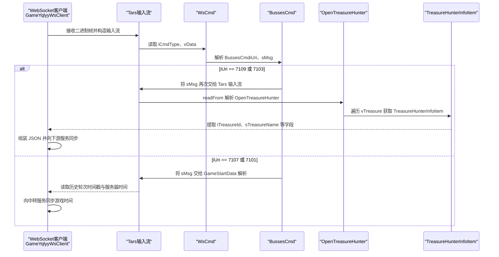
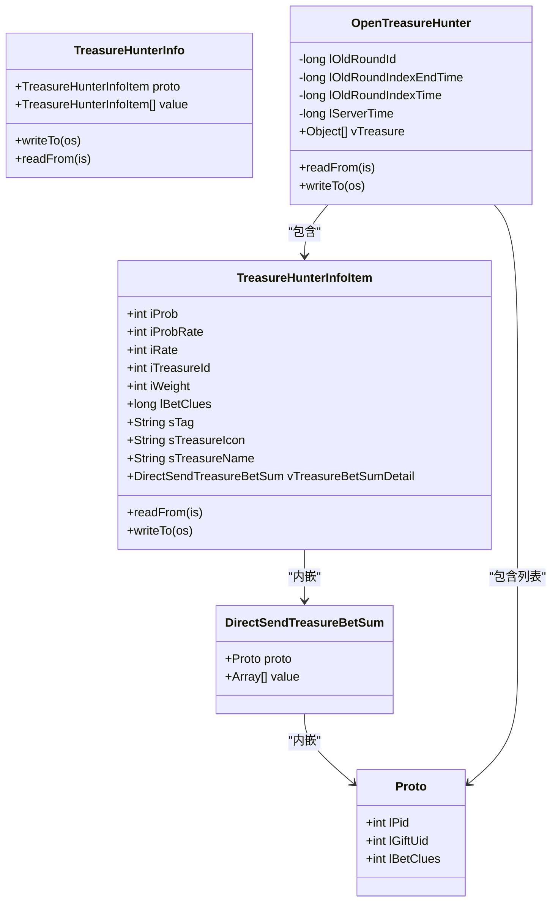
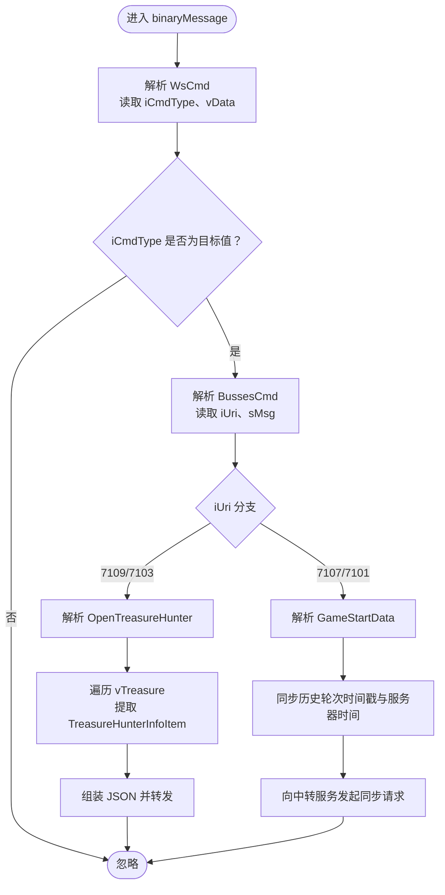
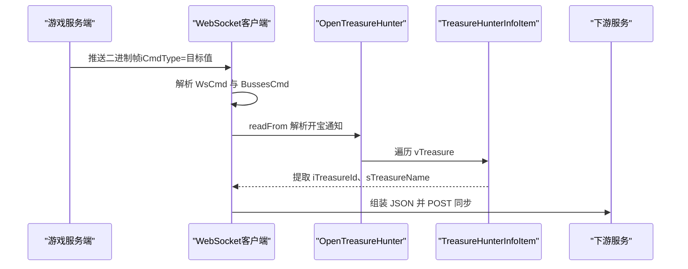
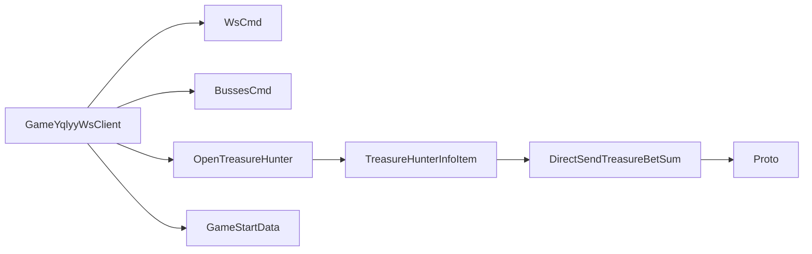

# 通知消息结构

<cite>
**本文引用的文件**
- [DirectSendTreasureBetSum.java](file://TigerTeeth/src/main/java/com/entity/AccountedNotify/DirectSendTreasureBetSum.java)
- [Proto.java](file://TigerTeeth/src/main/java/com/entity/AccountedNotify/Proto.java)
- [TreasureHunterInfo.java](file://TigerTeeth/src/main/java/com/entity/AccountedNotify/TreasureHunterInfo.java)
- [TreasureHunterInfoItem.java](file://TigerTeeth/src/main/java/com/entity/AccountedNotify/TreasureHunterInfoItem.java)
- [OpenTreasureHunter.java](file://TigerTeeth/src/main/java/com/entity/AccountedNotify/OpenTreasureHunter.java)
- [WsCmd.java](file://TigerTeeth/src/main/java/com/entity/WsCmd.java)
- [BussesCmd.java](file://TigerTeeth/src/main/java/com/entity/BussesCmd.java)
- [Wup.java](file://TigerTeeth/src/main/java/com/entity/Wup.java)
- [GameStartData.java](file://TigerTeeth/src/main/java/com/entity/GameStartData.java)
- [GameYqlyyWsClient.java](file://TigerTeeth/src/main/java/com/yqlyy/GameYqlyyWsClient.java)
</cite>

## 目录
1. [简介](#简介)
2. [项目结构](#项目结构)
3. [核心组件](#核心组件)
4. [架构总览](#架构总览)
5. [详细组件分析](#详细组件分析)
6. [依赖关系分析](#依赖关系分析)
7. [性能考虑](#性能考虑)
8. [故障排查指南](#故障排查指南)
9. [结论](#结论)
10. [附录](#附录)

## 简介
本文件围绕“通知消息结构”主题，系统梳理并解释 AccountedNotify 包下的消息模型与业务含义，重点覆盖以下类的设计目的与数据结构：
- DirectSendTreasureBetSum：直接发送的宝藏投注总额通知载体
- Proto：协议字段封装（包含 lPid、lGiftUid、lBetClues）
- TreasureHunterInfo：宝藏猎人信息集合与协议字段封装
- TreasureHunterInfoItem：单个宝藏猎人条目，包含概率、权重、名称、图标、投注线索等字段，并内嵌 DirectSendTreasureBetSum
- OpenTreasureHunter：开宝通知聚合体，承载历史轮次时间戳、当前服务器时间及宝藏列表

同时，结合 WebSocket 接收端对消息的解析与转发逻辑，阐明消息格式规范、序列化方式（Tars）、消息路由机制，以及在游戏状态变更时的触发条件与处理流程，帮助读者理解跨模块数据通信与状态同步。

## 项目结构
AccountedNotify 包位于 TigerTeeth 工程中，负责定义与解析来自游戏服务端的各类通知消息，尤其是与“宝藏猎人”玩法相关的消息结构。消息在 WebSocket 接收端被解析后，会根据 iUri 字段分发到不同处理分支，进而触发跨模块的数据同步。

图表来源
- [DirectSendTreasureBetSum.java](file://TigerTeeth/src/main/java/com/entity/AccountedNotify/DirectSendTreasureBetSum.java#L1-L9)
- [Proto.java](file://TigerTeeth/src/main/java/com/entity/AccountedNotify/Proto.java#L1-L8)
- [TreasureHunterInfo.java](file://TigerTeeth/src/main/java/com/entity/AccountedNotify/TreasureHunterInfo.java#L1-L44)
- [TreasureHunterInfoItem.java](file://TigerTeeth/src/main/java/com/entity/AccountedNotify/TreasureHunterInfoItem.java#L1-L124)
- [OpenTreasureHunter.java](file://TigerTeeth/src/main/java/com/entity/AccountedNotify/OpenTreasureHunter.java#L1-L83)
- [WsCmd.java](file://TigerTeeth/src/main/java/com/entity/WsCmd.java#L1-L69)
- [BussesCmd.java](file://TigerTeeth/src/main/java/com/entity/BussesCmd.java#L1-L10)
- [Wup.java](file://TigerTeeth/src/main/java/com/entity/Wup.java#L1-L29)
- [GameStartData.java](file://TigerTeeth/src/main/java/com/entity/GameStartData.java#L1-L79)
- [GameYqlyyWsClient.java](file://TigerTeeth/src/main/java/com/yqlyy/GameYqlyyWsClient.java#L1-L328)

章节来源
- [DirectSendTreasureBetSum.java](file://TigerTeeth/src/main/java/com/entity/AccountedNotify/DirectSendTreasureBetSum.java#L1-L9)
- [Proto.java](file://TigerTeeth/src/main/java/com/entity/AccountedNotify/Proto.java#L1-L8)
- [TreasureHunterInfo.java](file://TigerTeeth/src/main/java/com/entity/AccountedNotify/TreasureHunterInfo.java#L1-L44)
- [TreasureHunterInfoItem.java](file://TigerTeeth/src/main/java/com/entity/AccountedNotify/TreasureHunterInfoItem.java#L1-L124)
- [OpenTreasureHunter.java](file://TigerTeeth/src/main/java/com/entity/AccountedNotify/OpenTreasureHunter.java#L1-L83)
- [WsCmd.java](file://TigerTeeth/src/main/java/com/entity/WsCmd.java#L1-L69)
- [BussesCmd.java](file://TigerTeeth/src/main/java/com/entity/BussesCmd.java#L1-L10)
- [Wup.java](file://TigerTeeth/src/main/java/com/entity/Wup.java#L1-L29)
- [GameStartData.java](file://TigerTeeth/src/main/java/com/entity/GameStartData.java#L1-L79)
- [GameYqlyyWsClient.java](file://TigerTeeth/src/main/java/com/yqlyy/GameYqlyyWsClient.java#L1-L328)

## 核心组件
本节聚焦 AccountedNotify 包内的关键类及其职责与字段语义，帮助快速建立整体认知。

- DirectSendTreasureBetSum
  - 设计目的：作为“直接发送”的通知载体，封装协议与值数组，用于向下游模块推送宝藏投注总额等实时数据。
  - 关键字段：proto（协议封装）、value（数组值，具体元素类型由上层约定）。
  - 业务含义：当需要以“直接发送”形式推送某类通知时，使用该结构承载协议头与数据体。

- Proto
  - 设计目的：提供统一的协议字段封装，便于在不同通知类型中复用。
  - 关键字段：lPid（协议标识）、lGiftUid（礼物用户标识）、lBetClues（投注线索）。
  - 业务含义：用于标识消息来源、目标用户与关联的投注线索，支撑后续统计与结算。

- TreasureHunterInfo
  - 设计目的：承载宝藏猎人信息集合，继承 Tars 结构基类，支持序列化与反序列化。
  - 关键字段：proto（协议字段封装）、value（宝藏猎人条目列表）。
  - 业务含义：作为集合容器，便于批量传输多个宝藏猎人条目；writeTo/readFrom 方法预留扩展点。

- TreasureHunterInfoItem
  - 设计目的：描述单个宝藏猎人条目，包含概率、权重、名称、图标、投注线索等字段，并内嵌 DirectSendTreasureBetSum。
  - 关键字段：iProb（概率）、iProbRate（概率倍率）、iRate（比率）、iTreasureId（宝藏ID）、iWeight（权重）、lBetClues（投注线索）、sTag（标签）、sTreasureIcon（宝藏图标）、sTreasureName（宝藏名称）、vTreasureBetSumDetail（内嵌的直接发送结构）。
  - 业务含义：描述单个宝藏的属性与关联的投注总额详情，用于前端展示与统计。

- OpenTreasureHunter
  - 设计目的：开宝通知聚合体，承载历史轮次时间戳、当前服务器时间及宝藏列表。
  - 关键字段：lOldRoundId（历史轮次ID）、lOldRoundIndexEndTime（历史轮次结束时间）、lOldRoundIndexTime（历史轮次开始时间）、lServerTime（服务器时间）、vTreasure（宝藏列表，元素类型为对象数组，包含 TreasureHunterInfoItem 与 Proto 列表）。
  - 业务含义：在开宝事件发生时，推送包含历史轮次信息与当前宝藏列表的通知，供下游模块进行状态同步与展示。

章节来源
- [DirectSendTreasureBetSum.java](file://TigerTeeth/src/main/java/com/entity/AccountedNotify/DirectSendTreasureBetSum.java#L1-L9)
- [Proto.java](file://TigerTeeth/src/main/java/com/entity/AccountedNotify/Proto.java#L1-L8)
- [TreasureHunterInfo.java](file://TigerTeeth/src/main/java/com/entity/AccountedNotify/TreasureHunterInfo.java#L1-L44)
- [TreasureHunterInfoItem.java](file://TigerTeeth/src/main/java/com/entity/AccountedNotify/TreasureHunterInfoItem.java#L1-L124)
- [OpenTreasureHunter.java](file://TigerTeeth/src/main/java/com/entity/AccountedNotify/OpenTreasureHunter.java#L1-L83)

## 架构总览
下图展示了从 WebSocket 接收二进制帧到解析并分发通知的完整链路，以及与 AccountedNotify 消息模型的关系。

图表来源
- [GameYqlyyWsClient.java](file://TigerTeeth/src/main/java/com/yqlyy/GameYqlyyWsClient.java#L46-L219)
- [WsCmd.java](file://TigerTeeth/src/main/java/com/entity/WsCmd.java#L1-L69)
- [BussesCmd.java](file://TigerTeeth/src/main/java/com/entity/BussesCmd.java#L1-L10)
- [OpenTreasureHunter.java](file://TigerTeeth/src/main/java/com/entity/AccountedNotify/OpenTreasureHunter.java#L1-L83)
- [TreasureHunterInfoItem.java](file://TigerTeeth/src/main/java/com/entity/AccountedNotify/TreasureHunterInfoItem.java#L1-L124)
- [GameStartData.java](file://TigerTeeth/src/main/java/com/entity/GameStartData.java#L1-L79)

## 详细组件分析

### 类关系与数据结构

图表来源
- [DirectSendTreasureBetSum.java](file://TigerTeeth/src/main/java/com/entity/AccountedNotify/DirectSendTreasureBetSum.java#L1-L9)
- [Proto.java](file://TigerTeeth/src/main/java/com/entity/AccountedNotify/Proto.java#L1-L8)
- [TreasureHunterInfo.java](file://TigerTeeth/src/main/java/com/entity/AccountedNotify/TreasureHunterInfo.java#L1-L44)
- [TreasureHunterInfoItem.java](file://TigerTeeth/src/main/java/com/entity/AccountedNotify/TreasureHunterInfoItem.java#L1-L124)
- [OpenTreasureHunter.java](file://TigerTeeth/src/main/java/com/entity/AccountedNotify/OpenTreasureHunter.java#L1-L83)

章节来源
- [DirectSendTreasureBetSum.java](file://TigerTeeth/src/main/java/com/entity/AccountedNotify/DirectSendTreasureBetSum.java#L1-L9)
- [Proto.java](file://TigerTeeth/src/main/java/com/entity/AccountedNotify/Proto.java#L1-L8)
- [TreasureHunterInfo.java](file://TigerTeeth/src/main/java/com/entity/AccountedNotify/TreasureHunterInfo.java#L1-L44)
- [TreasureHunterInfoItem.java](file://TigerTeeth/src/main/java/com/entity/AccountedNotify/TreasureHunterInfoItem.java#L1-L124)
- [OpenTreasureHunter.java](file://TigerTeeth/src/main/java/com/entity/AccountedNotify/OpenTreasureHunter.java#L1-L83)

### 消息格式规范与序列化
- 协议与序列化
  - 使用 Tars（Tencent Remote Address Server）协议进行二进制序列化与反序列化。
  - 所有 AccountedNotify 下的消息类均继承 Tars 结构基类，具备 readFrom/writeTo 接口，用于从 Tars 输入流读取或写入字节流。
- WebSocket 接收与解析
  - 客户端接收二进制帧后，先用 Tars 输入流读取 WsCmd 的 iCmdType 与 vData。
  - 若 iCmdType 为特定值，则继续用 vData 构造新的 Tars 输入流，读取 BussesCmd 的 iUri 与 sMsg。
  - 根据 iUri 分支，分别解析 OpenTreasureHunter 或 GameStartData，并进一步提取宝藏列表或时间戳。

图表来源
- [GameYqlyyWsClient.java](file://TigerTeeth/src/main/java/com/yqlyy/GameYqlyyWsClient.java#L51-L219)
- [WsCmd.java](file://TigerTeeth/src/main/java/com/entity/WsCmd.java#L1-L69)
- [BussesCmd.java](file://TigerTeeth/src/main/java/com/entity/BussesCmd.java#L1-L10)
- [OpenTreasureHunter.java](file://TigerTeeth/src/main/java/com/entity/AccountedNotify/OpenTreasureHunter.java#L1-L83)
- [GameStartData.java](file://TigerTeeth/src/main/java/com/entity/GameStartData.java#L1-L79)

章节来源
- [GameYqlyyWsClient.java](file://TigerTeeth/src/main/java/com/yqlyy/GameYqlyyWsClient.java#L51-L219)
- [WsCmd.java](file://TigerTeeth/src/main/java/com/entity/WsCmd.java#L1-L69)
- [BussesCmd.java](file://TigerTeeth/src/main/java/com/entity/BussesCmd.java#L1-L10)
- [OpenTreasureHunter.java](file://TigerTeeth/src/main/java/com/entity/AccountedNotify/OpenTreasureHunter.java#L1-L83)
- [GameStartData.java](file://TigerTeeth/src/main/java/com/entity/GameStartData.java#L1-L79)

### 通知触发条件与处理流程
- 触发条件
  - 当游戏服务端产生“开宝”或“游戏开始”等事件时，会通过 WebSocket 推送相应通知。
  - iUri 字段用于区分不同通知类型：如 7109/7103 对应开宝通知，7107/7101 对应游戏开始时间同步。
- 处理流程
  - 客户端在 binaryMessage 中解析出 iUri 后，分别构造对应的消息对象（OpenTreasureHunter 或 GameStartData），读取其中的关键字段。
  - 对于开宝通知，遍历 vTreasure 列表，提取宝藏 ID 与名称，组装 JSON 并向下游服务同步。
  - 对于游戏开始通知，读取历史轮次时间戳与服务器时间，向中转服务发起同步请求。

图表来源
- [GameYqlyyWsClient.java](file://TigerTeeth/src/main/java/com/yqlyy/GameYqlyyWsClient.java#L76-L119)
- [OpenTreasureHunter.java](file://TigerTeeth/src/main/java/com/entity/AccountedNotify/OpenTreasureHunter.java#L1-L83)
- [TreasureHunterInfoItem.java](file://TigerTeeth/src/main/java/com/entity/AccountedNotify/TreasureHunterInfoItem.java#L1-L124)

章节来源
- [GameYqlyyWsClient.java](file://TigerTeeth/src/main/java/com/yqlyy/GameYqlyyWsClient.java#L76-L119)
- [OpenTreasureHunter.java](file://TigerTeeth/src/main/java/com/entity/AccountedNotify/OpenTreasureHunter.java#L1-L83)
- [TreasureHunterInfoItem.java](file://TigerTeeth/src/main/java/com/entity/AccountedNotify/TreasureHunterInfoItem.java#L1-L124)

## 依赖关系分析
- 组件耦合
  - GameYqlyyWsClient 依赖 WsCmd、BussesCmd、OpenTreasureHunter、GameStartData 等消息模型进行解析与分发。
  - OpenTreasureHunter 依赖 TreasureHunterInfoItem 与 Proto，形成“集合-条目-协议”的层级关系。
  - TreasureHunterInfoItem 内嵌 DirectSendTreasureBetSum，后者再内嵌 Proto，体现“明细-汇总-协议”的数据组织方式。
- 外部依赖
  - Tars 协议库用于二进制序列化与反序列化。
  - WebSocket 客户端用于接收二进制帧并驱动解析流程。
- 潜在循环依赖
  - 当前结构为单向依赖（解析器依赖模型），无明显循环依赖风险。

图表来源
- [GameYqlyyWsClient.java](file://TigerTeeth/src/main/java/com/yqlyy/GameYqlyyWsClient.java#L1-L328)
- [WsCmd.java](file://TigerTeeth/src/main/java/com/entity/WsCmd.java#L1-L69)
- [BussesCmd.java](file://TigerTeeth/src/main/java/com/entity/BussesCmd.java#L1-L10)
- [OpenTreasureHunter.java](file://TigerTeeth/src/main/java/com/entity/AccountedNotify/OpenTreasureHunter.java#L1-L83)
- [TreasureHunterInfoItem.java](file://TigerTeeth/src/main/java/com/entity/AccountedNotify/TreasureHunterInfoItem.java#L1-L124)
- [DirectSendTreasureBetSum.java](file://TigerTeeth/src/main/java/com/entity/AccountedNotify/DirectSendTreasureBetSum.java#L1-L9)
- [Proto.java](file://TigerTeeth/src/main/java/com/entity/AccountedNotify/Proto.java#L1-L8)

章节来源
- [GameYqlyyWsClient.java](file://TigerTeeth/src/main/java/com/yqlyy/GameYqlyyWsClient.java#L1-L328)
- [WsCmd.java](file://TigerTeeth/src/main/java/com/entity/WsCmd.java#L1-L69)
- [BussesCmd.java](file://TigerTeeth/src/main/java/com/entity/BussesCmd.java#L1-L10)
- [OpenTreasureHunter.java](file://TigerTeeth/src/main/java/com/entity/AccountedNotify/OpenTreasureHunter.java#L1-L83)
- [TreasureHunterInfoItem.java](file://TigerTeeth/src/main/java/com/entity/AccountedNotify/TreasureHunterInfoItem.java#L1-L124)
- [DirectSendTreasureBetSum.java](file://TigerTeeth/src/main/java/com/entity/AccountedNotify/DirectSendTreasureBetSum.java#L1-L9)
- [Proto.java](file://TigerTeeth/src/main/java/com/entity/AccountedNotify/Proto.java#L1-L8)

## 性能考虑
- 二进制序列化
  - 使用 Tars 二进制协议，相比文本协议具有更小的体积与更高的解析效率，适合高频通知场景。
- 流式解析
  - 采用 TarsInputStream 逐字段读取，避免一次性加载整个消息体，降低内存占用。
- 异步与线程池
  - 客户端初始化时通过线程池定时上报与维护连接，有助于提升稳定性与吞吐能力。
- 建议
  - 在高并发场景下，建议对 JSON 组装与网络请求进行限流与重试策略配置，避免下游服务压力过大。
  - 对于 vTreasure 列表较大的情况，建议分批处理与异步转发，减少主线程阻塞。

## 故障排查指南
- WebSocket 连接问题
  - 现象：无法建立或频繁断开连接。
  - 排查：检查 wsUrl、握手参数与服务端白名单；确认 onOpen/onError 回调日志。
- 消息解析异常
  - 现象：iCmdType 不匹配或 iUri 未命中分支。
  - 排查：确认二进制帧是否完整；核对 Tars 字段索引与顺序；检查 readFrom 调用是否正确。
- 数据缺失或为空
  - 现象：vTreasure 为空或字段为默认值。
  - 排查：确认服务端推送是否包含有效数据；检查 readFrom 中字段读取顺序与索引；验证客户端是否正确遍历集合。
- 转发失败
  - 现象：下游服务返回异常或超时。
  - 排查：检查目标 URL 与网络连通性；增加重试与熔断策略；记录请求与响应日志以便定位。

章节来源
- [GameYqlyyWsClient.java](file://TigerTeeth/src/main/java/com/yqlyy/GameYqlyyWsClient.java#L240-L290)
- [OpenTreasureHunter.java](file://TigerTeeth/src/main/java/com/entity/AccountedNotify/OpenTreasureHunter.java#L72-L81)
- [TreasureHunterInfoItem.java](file://TigerTeeth/src/main/java/com/entity/AccountedNotify/TreasureHunterInfoItem.java#L110-L122)

## 结论
AccountedNotify 包下的消息结构清晰地划分了“协议封装—集合—条目—明细”的层次，配合 Tars 二进制序列化与 WebSocket 接收端的分发逻辑，实现了对“宝藏猎人”相关通知的高效解析与跨模块同步。通过 iUri 分支与字段读取，系统能够在游戏状态变更时准确触发相应的处理流程，确保前后端与中转服务之间的状态一致性。

## 附录
- 字段速查
  - DirectSendTreasureBetSum：proto（协议封装）、value（数组值）
  - Proto：lPid（协议标识）、lGiftUid（礼物用户标识）、lBetClues（投注线索）
  - TreasureHunterInfo：proto（协议字段封装）、value（宝藏猎人条目列表）
  - TreasureHunterInfoItem：iProb/iProbRate/iRate/iTreasureId/iWeight/lBetClues/sTag/sTreasureIcon/sTreasureName/vTreasureBetSumDetail
  - OpenTreasureHunter：lOldRoundId/lOldRoundIndexEndTime/lOldRoundIndexTime/lServerTime/vTreasure（含 TreasureHunterInfoItem 与 Proto 列表）