# 域名管理工具

<cite>
**本文档引用的文件**
- [DomainNameUtil.java](file://TigerTeeth/src/main/java/com/utils/DomainNameUtil.java)
- [DomainNameUtil.java](file://bettaFish/src/main/java/com/utils/DomainNameUtil.java)
- [DomainNameUtil.java](file://game-cnydh/src/main/java/com/utils/DomainNameUtil.java)
- [DomainNameUtil.java](file://game-lf/src/main/java/com/utils/DomainNameUtil.java)
- [DomainNameUtil.java](file://game-proxy/src/main/java/com/game/utils/DomainNameUtil.java)
- [GameYqlyyWsClient.java](file://TigerTeeth/src/main/java/com/yqlyy/GameYqlyyWsClient.java)
- [GameProxyController.java](file://game-proxy/src/main/java/com/game/controller/GameProxyController.java)
- [CnydhService.java](file://game-cnydh/src/main/java/com/cnydh/cnydh/CnydhService.java)
- [DhsgService.java](file://game-proxy/src/main/java/com/game/douyu/dahsg/DhsgService.java)
- [BwhdSocketClient.java](file://game-proxy/src/main/java/com/game/gcbwz/BwhdSocketClient.java)
- [application.yml](file://game-proxy/src/main/resources/application.yml)
- [pom.xml](file://TigerTeeth/pom.xml)
</cite>

## 目录
1. [简介](#简介)
2. [项目结构](#项目结构)
3. [核心组件](#核心组件)
4. [架构概览](#架构概览)
5. [详细组件分析](#详细组件分析)
6. [依赖关系分析](#依赖关系分析)
7. [性能考虑](#性能考虑)
8. [故障排除指南](#故障排除指南)
9. [结论](#结论)

## 简介

域名管理工具是本项目中用于统一管理多个域名配置的核心组件。该工具通过静态常量数组的形式维护域名列表，为各个游戏模块提供统一的域名访问策略。主要功能包括：

- **域名列表管理**：集中维护多个域名配置
- **域名验证机制**：确保域名格式的有效性
- **域名选择策略**：支持轮询和随机选择等策略
- **多环境适配**：支持开发、测试、生产等不同环境的域名配置

## 项目结构

该项目采用多模块架构，每个游戏模块都有独立的DomainNameUtil工具类，但都遵循相同的命名约定和使用模式。

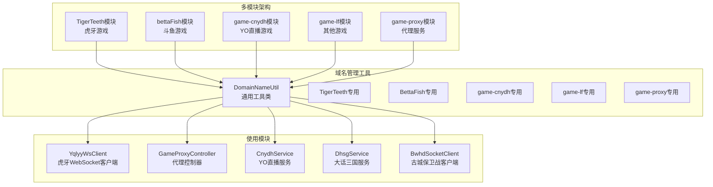

**图表来源**
- [DomainNameUtil.java](file://TigerTeeth/src/main/java/com/utils/DomainNameUtil.java#L1-L16)
- [GameYqlyyWsClient.java](file://TigerTeeth/src/main/java/com/yqlyy/GameYqlyyWsClient.java#L102-L114)
- [GameProxyController.java](file://game-proxy/src/main/java/com/game/controller/GameProxyController.java#L395-L407)

**章节来源**
- [DomainNameUtil.java](file://TigerTeeth/src/main/java/com/utils/DomainNameUtil.java#L1-L16)
- [DomainNameUtil.java](file://game-proxy/src/main/java/com/game/utils/DomainNameUtil.java#L1-L16)

## 核心组件

### DomainNameUtil工具类设计

DomainNameUtil是一个静态工具类，采用final static修饰符定义域名数组，确保线程安全和不可变性。每个模块的工具类都遵循相同的设计模式，但包含不同的域名配置。

#### 基础架构设计

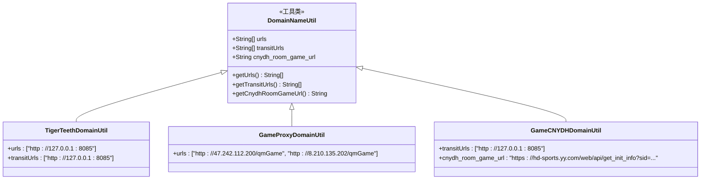

**图表来源**
- [DomainNameUtil.java](file://TigerTeeth/src/main/java/com/utils/DomainNameUtil.java#L3-L15)
- [DomainNameUtil.java](file://game-proxy/src/main/java/com/game/utils/DomainNameUtil.java#L3-L15)
- [DomainNameUtil.java](file://game-cnydh/src/main/java/com/utils/DomainNameUtil.java#L3-L11)

#### 域名数组维护策略

每个模块根据其业务需求维护不同的域名数组：

1. **urls数组**：主要业务域名，用于正常的游戏数据交互
2. **transitUrls数组**：中转服务器域名，用于时间同步等特殊功能
3. **cnydh_room_game_url**：特定游戏的房间信息获取地址

**章节来源**
- [DomainNameUtil.java](file://TigerTeeth/src/main/java/com/utils/DomainNameUtil.java#L4-L13)
- [DomainNameUtil.java](file://game-proxy/src/main/java/com/game/utils/DomainNameUtil.java#L4-L12)
- [DomainNameUtil.java](file://game-cnydh/src/main/java/com/utils/DomainNameUtil.java#L5-L10)

## 架构概览

### 多域名管理架构

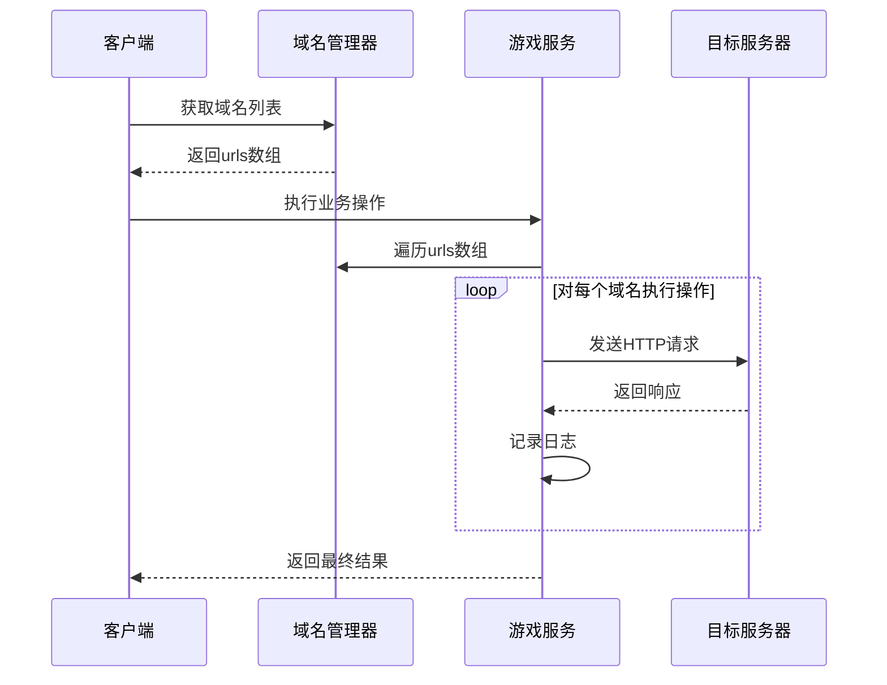

**图表来源**
- [GameYqlyyWsClient.java](file://TigerTeeth/src/main/java/com/yqlyy/GameYqlyyWsClient.java#L102-L114)
- [DhsgService.java](file://game-proxy/src/main/java/com/game/douyu/dahsg/DhsgService.java#L96-L105)

### 域名验证和选择机制

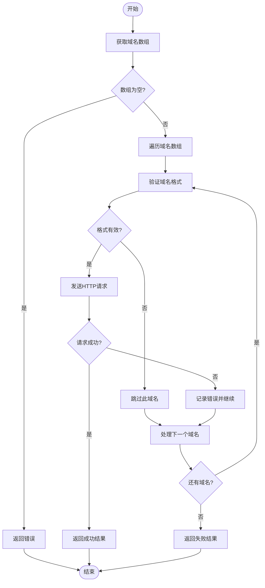

**图表来源**
- [GameYqlyyWsClient.java](file://TigerTeeth/src/main/java/com/yqlyy/GameYqlyyWsClient.java#L103-L114)
- [CnydhService.java](file://game-cnydh/src/main/java/com/cnydh/cnydh/CnydhService.java#L113-L123)

**章节来源**
- [GameYqlyyWsClient.java](file://TigerTeeth/src/main/java/com/yqlyy/GameYqlyyWsClient.java#L102-L114)
- [CnydhService.java](file://game-cnydh/src/main/java/com/cnydh/cnydh/CnydhService.java#L113-L123)

## 详细组件分析

### 虎牙游戏模块（TigerTeeth）

#### 域名配置特点

虎牙游戏模块采用了最完整的域名配置方案，包含本地开发环境和生产环境的双重配置：

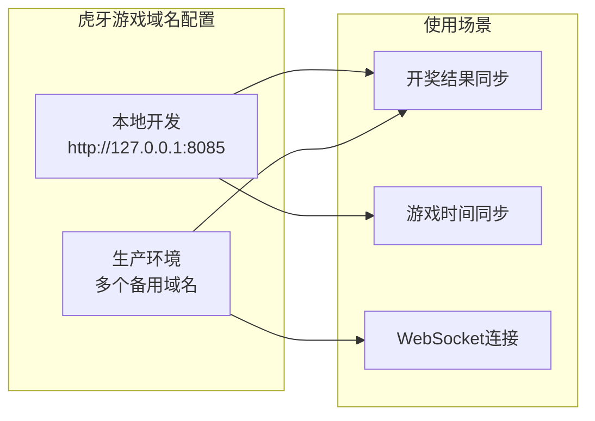

**图表来源**
- [DomainNameUtil.java](file://TigerTeeth/src/main/java/com/utils/DomainNameUtil.java#L4-L13)
- [GameYqlyyWsClient.java](file://TigerTeeth/src/main/java/com/yqlyy/GameYqlyyWsClient.java#L102-L114)

#### 核心使用流程

虎牙游戏模块展示了域名管理工具的最佳实践：

1. **多域名遍历**：对urls数组中的每个域名执行相同的操作
2. **异常处理**：每个域名请求都有独立的异常处理机制
3. **日志记录**：详细的日志记录便于问题排查
4. **资源清理**：及时关闭连接和清理资源

**章节来源**
- [GameYqlyyWsClient.java](file://TigerTeeth/src/main/java/com/yqlyy/GameYqlyyWsClient.java#L102-L114)
- [GameYqlyyWsClient.java](file://TigerTeeth/src/main/java/com/yqlyy/GameYqlyyWsClient.java#L136-L147)

### 代理服务模块（game-proxy）

#### 域名配置策略

代理服务模块专注于提供稳定的代理服务，域名配置相对简洁：

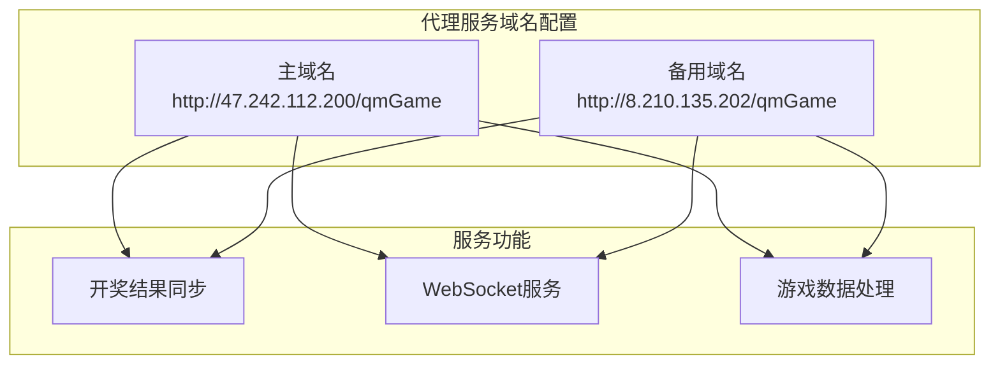

**图表来源**
- [DomainNameUtil.java](file://game-proxy/src/main/java/com/game/utils/DomainNameUtil.java#L4-L12)
- [GameProxyController.java](file://game-proxy/src/main/java/com/game/controller/GameProxyController.java#L395-L407)

#### API接口集成

代理服务模块提供了完整的API接口来处理各种游戏的开奖结果同步：

**章节来源**
- [GameProxyController.java](file://game-proxy/src/main/java/com/game/controller/GameProxyController.java#L395-L407)
- [DhsgService.java](file://game-proxy/src/main/java/com/game/douyu/dahsg/DhsgService.java#L96-L105)

### YO直播模块（game-cnydh）

#### 特殊域名配置

YO直播模块采用了独特的域名配置方式，包含了专门的房间信息获取URL：

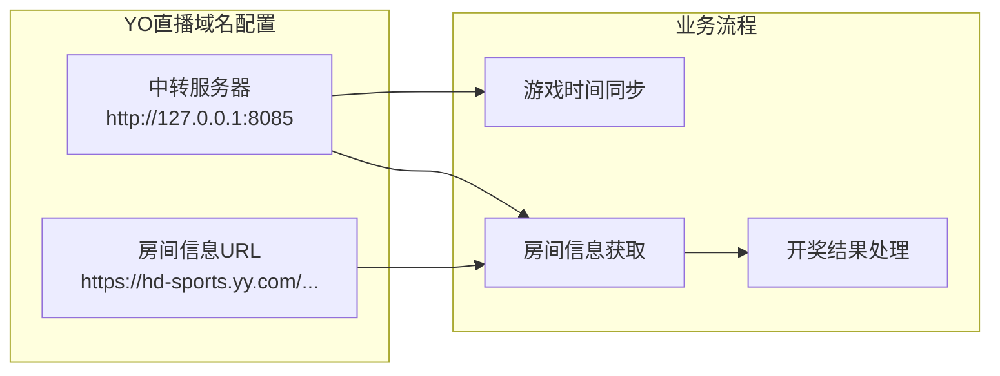

**图表来源**
- [DomainNameUtil.java](file://game-cnydh/src/main/java/com/utils/DomainNameUtil.java#L5-L10)
- [CnydhService.java](file://game-cnydh/src/main/java/com/cnydh/cnydh/CnydhService.java#L101-L123)

**章节来源**
- [CnydhService.java](file://game-cnydh/src/main/java/com/cnydh/cnydh/CnydhService.java#L55-L65)
- [CnydhService.java](file://game-cnydh/src/main/java/com/cnydh/cnydh/CnydhService.java#L113-L123)

### 其他模块对比分析

#### bettaFish模块

bettaFish模块的DomainNameUtil相对简单，主要用于注释说明：

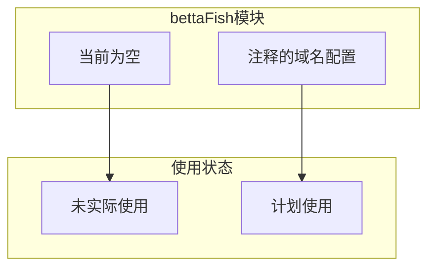

**图表来源**
- [DomainNameUtil.java](file://bettaFish/src/main/java/com/utils/DomainNameUtil.java#L4-L8)

#### game-lf模块

game-lf模块专注于中转服务器配置：

**章节来源**
- [DomainNameUtil.java](file://game-lf/src/main/java/com/utils/DomainNameUtil.java#L5-L7)

## 依赖关系分析

### 模块间依赖关系

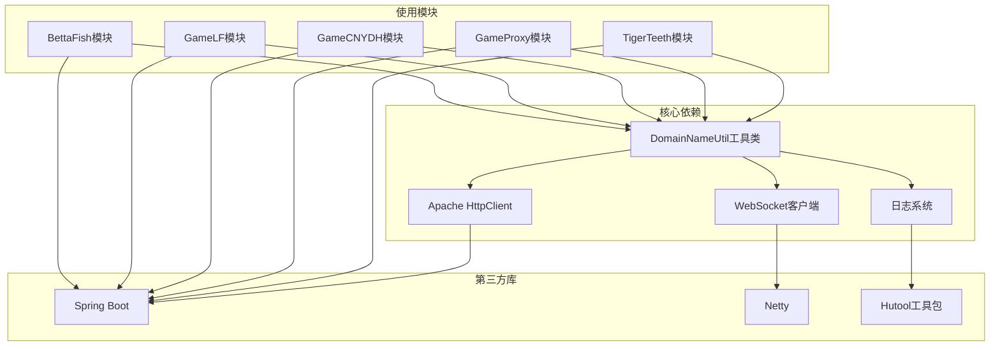

**图表来源**
- [pom.xml](file://TigerTeeth/pom.xml#L26-L111)
- [GameYqlyyWsClient.java](file://TigerTeeth/src/main/java/com/yqlyy/GameYqlyyWsClient.java#L102-L114)

### 依赖注入和配置管理

每个模块都通过Spring Boot框架进行依赖注入和配置管理：

**章节来源**
- [pom.xml](file://TigerTeeth/pom.xml#L1-L160)

## 性能考虑

### 域名访问优化策略

1. **并发处理**：多个域名可以并行访问，提高整体响应速度
2. **异常隔离**：单个域名失败不影响其他域名的处理
3. **资源复用**：HTTP连接和WebSocket连接的合理复用
4. **缓存策略**：域名配置的缓存避免重复解析

### 性能监控指标

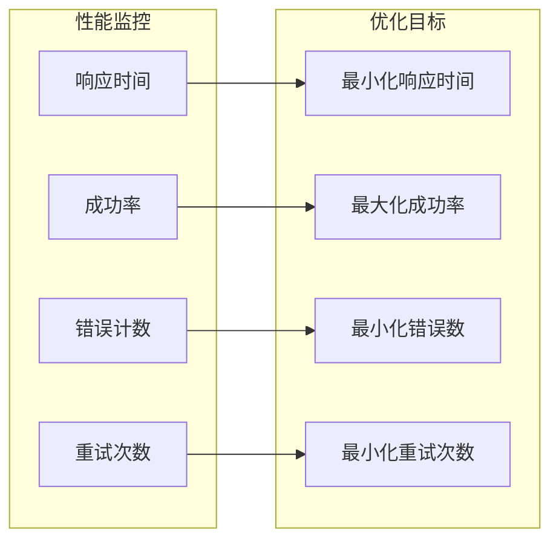

## 故障排除指南

### 常见问题及解决方案

#### 域名访问失败

**问题现象**：
- HTTP请求超时
- 连接被拒绝
- DNS解析失败

**排查步骤**：
1. 检查域名格式是否正确
2. 验证网络连通性
3. 确认目标服务器状态
4. 查看防火墙设置

**解决方案**：
- 使用备用域名替换
- 实施重试机制
- 添加健康检查
- 记录详细的错误日志

#### 异常处理最佳实践

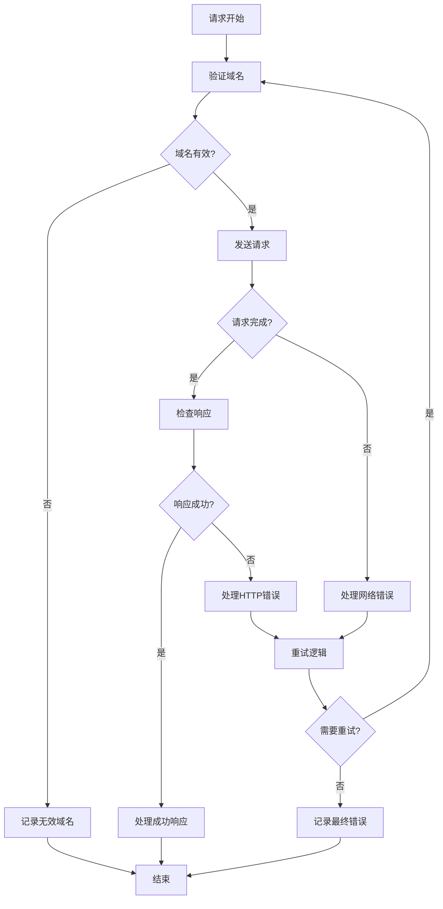

**图表来源**
- [GameYqlyyWsClient.java](file://TigerTeeth/src/main/java/com/yqlyy/GameYqlyyWsClient.java#L109-L113)

**章节来源**
- [GameYqlyyWsClient.java](file://TigerTeeth/src/main/java/com/yqlyy/GameYqlyyWsClient.java#L109-L113)
- [CnydhService.java](file://game-cnydh/src/main/java/com/cnydh/cnydh/CnydhService.java#L118-L122)

### 日志记录和调试

建议在域名管理中实施以下日志记录策略：

1. **成功日志**：记录域名访问的成功响应
2. **失败日志**：记录域名访问的失败原因
3. **性能日志**：记录响应时间和处理时长
4. **异常日志**：记录异常堆栈和上下文信息

## 结论

域名管理工具作为本项目的核心基础设施，通过统一的域名配置管理和多域名访问策略，为各个游戏模块提供了稳定可靠的服务支持。主要优势包括：

1. **统一管理**：集中管理所有域名配置，便于维护和更新
2. **高可用性**：多域名备份机制确保服务的连续性
3. **灵活扩展**：支持不同模块的特殊需求和配置要求
4. **易于维护**：清晰的代码结构和完善的注释说明

通过合理的域名配置策略和异常处理机制，该工具能够有效提升系统的稳定性和可靠性，在多域名环境下提供优质的用户体验。

建议在未来的发展中：
- 继续完善域名健康检查机制
- 增加动态域名配置更新功能
- 优化域名选择算法以适应不同的业务场景
- 加强监控和告警机制的建设