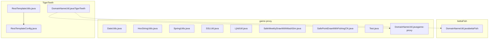
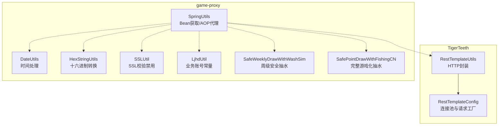
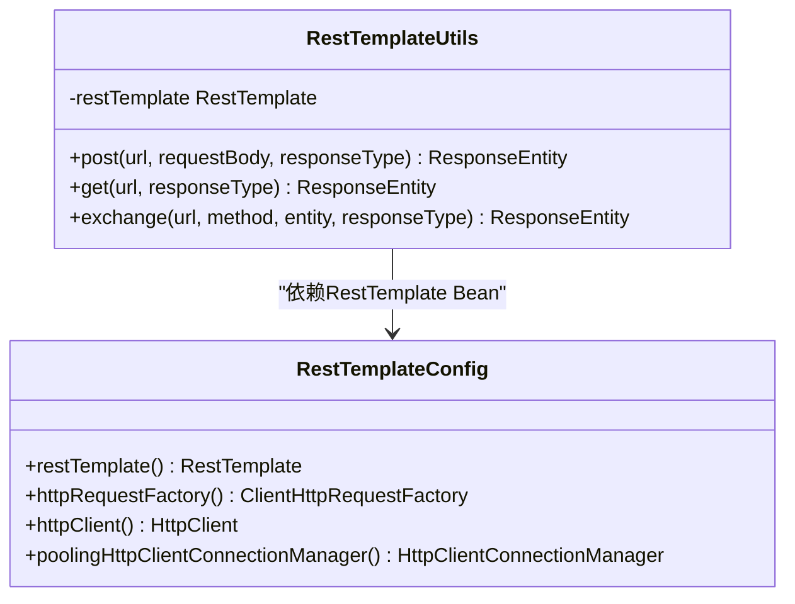
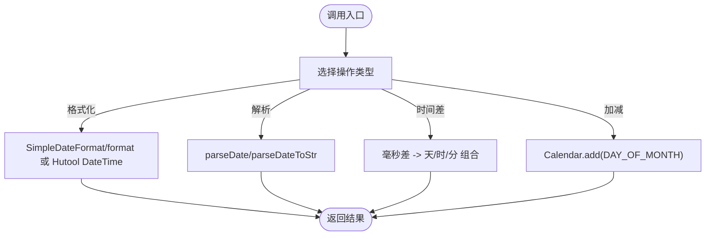
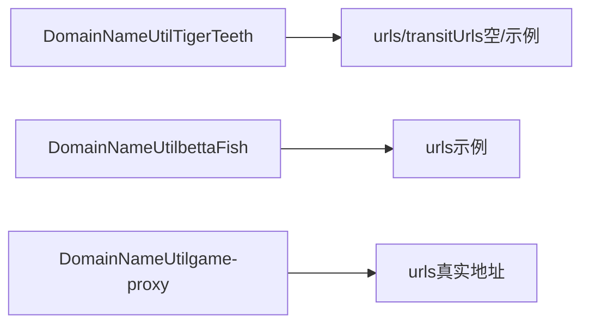
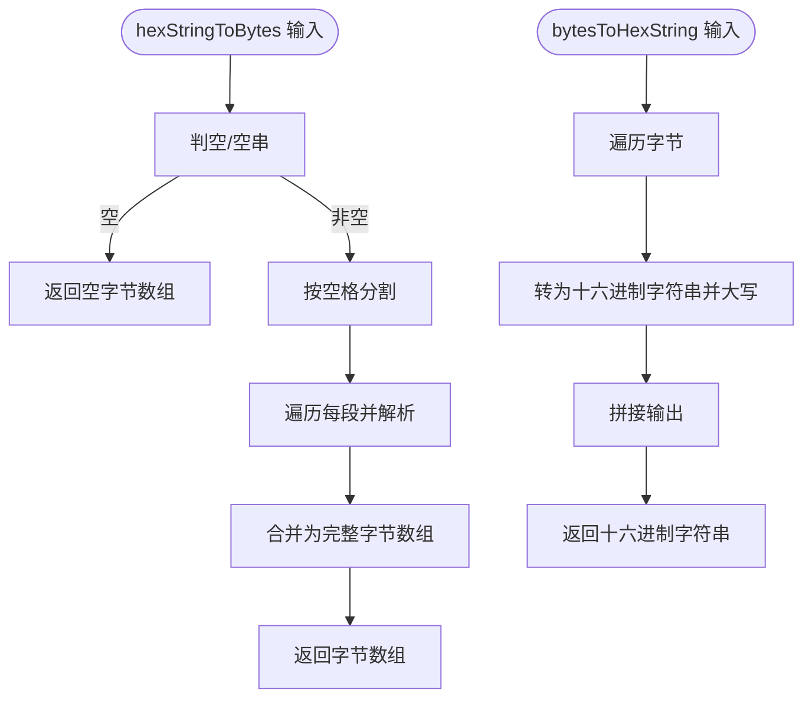
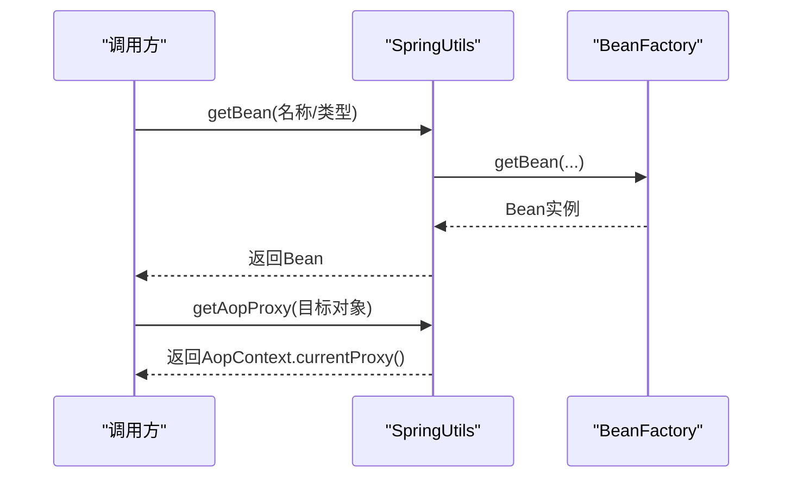
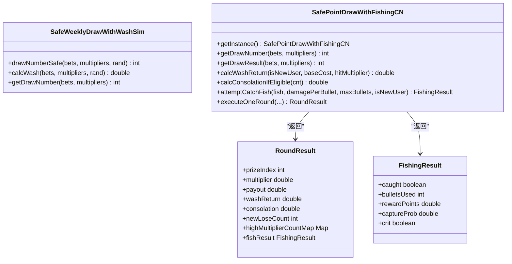
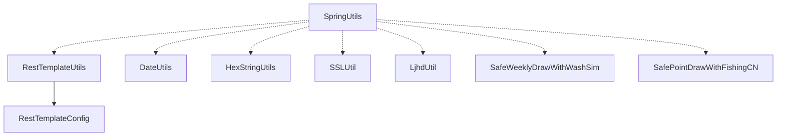

# 工具类库

<cite>
**本文引用的文件**
- [RestTemplateConfig.java](file://TigerTeeth/src/main/java/com/commom/RestTemplateConfig.java)
- [RestTemplateUtils.java](file://TigerTeeth/src/main/java/com/commom/RestTemplateUtils.java)
- [DomainNameUtil.java（TigerTeeth）](file://TigerTeeth/src/main/java/com/utils/DomainNameUtil.java)
- [DomainNameUtil.java（bettaFish）](file://bettaFish/src/main/java/com/utils/DomainNameUtil.java)
- [DomainNameUtil.java（game-proxy）](file://game-proxy/src/main/java/com/game/utils/DomainNameUtil.java)
- [DateUtils.java](file://game-proxy/src/main/java/com/game/utils/DateUtils.java)
- [HexStringUtils.java](file://game-proxy/src/main/java/com/game/utils/HexStringUtils.java)
- [SpringUtils.java](file://game-proxy/src/main/java/com/game/utils/SpringUtils.java)
- [SSLUtil.java](file://game-proxy/src/main/java/com/game/utils/SSLUtil.java)
- [LjhdUtil.java](file://game-proxy/src/main/java/com/game/utils/LjhdUtil.java)
- [SafePointDrawWithFishingCN.java](file://game-proxy/src/main/java/com/game/utils/SafePointDrawWithFishingCN.java)
- [SafeWeeklyDrawWithWashSim.java](file://game-proxy/src/main/java/com/game/utils/SafeWeeklyDrawWithWashSim.java)
- [Test.java](file://game-proxy/src/main/java/com/game/utils/Test.java)
</cite>

## 目录
1. [简介](#简介)
2. [项目结构](#项目结构)
3. [核心组件](#核心组件)
4. [架构总览](#架构总览)
5. [详细组件分析](#详细组件分析)
6. [依赖分析](#依赖分析)
7. [性能考量](#性能考量)
8. [故障排查指南](#故障排查指南)
9. [结论](#结论)
10. [附录](#附录)

## 简介
本文件系统性梳理并说明工具类库中的公共工具能力，覆盖以下主题：
- 配置管理与HTTP客户端工具：RestTemplateConfig、RestTemplateUtils
- 时间处理工具：DateUtils
- 域名管理工具：DomainNameUtil（多模块版本）
- 十六进制字符串处理工具：HexStringUtils
- Spring集成工具：SpringUtils
- 安全与证书工具：SSLUtil
- 游戏业务辅助工具：LjhdUtil
- 抽奖与水洗模拟工具：SafeWeeklyDrawWithWashSim、SafePointDrawWithFishingCN
- 示例与验证：Test

文档目标是帮助读者快速理解各工具类的职责、API、使用方式、最佳实践、性能与扩展建议，并提供排障与测试指引。

## 项目结构
工具类库分布在多个子模块中，按功能域划分：
- TigerTeeth：HTTP客户端配置与封装
- bettaFish：域名常量
- game-proxy：通用工具集（时间、十六进制、Spring、安全、业务辅助、抽奖模拟等）

图表来源
- [RestTemplateConfig.java](file://TigerTeeth/src/main/java/com/commom/RestTemplateConfig.java#L34-L131)
- [RestTemplateUtils.java](file://TigerTeeth/src/main/java/com/commom/RestTemplateUtils.java#L14-L30)
- [DomainNameUtil.java（TigerTeeth）](file://TigerTeeth/src/main/java/com/utils/DomainNameUtil.java#L3-L15)
- [DomainNameUtil.java（bettaFish）](file://bettaFish/src/main/java/com/utils/DomainNameUtil.java#L3-L9)
- [DomainNameUtil.java（game-proxy）](file://game-proxy/src/main/java/com/game/utils/DomainNameUtil.java#L3-L15)
- [DateUtils.java](file://game-proxy/src/main/java/com/game/utils/DateUtils.java#L18-L196)
- [HexStringUtils.java](file://game-proxy/src/main/java/com/game/utils/HexStringUtils.java#L6-L69)
- [SpringUtils.java](file://game-proxy/src/main/java/com/game/utils/SpringUtils.java#L16-L102)
- [SSLUtil.java](file://game-proxy/src/main/java/com/game/utils/SSLUtil.java#L6-L21)
- [SafeWeeklyDrawWithWashSim.java](file://game-proxy/src/main/java/com/game/utils/SafeWeeklyDrawWithWashSim.java#L5-L132)
- [SafePointDrawWithFishingCN.java](file://game-proxy/src/main/java/com/game/utils/SafePointDrawWithFishingCN.java#L18-L315)
- [Test.java](file://game-proxy/src/main/java/com/game/utils/Test.java#L5-L14)

章节来源
- [RestTemplateConfig.java](file://TigerTeeth/src/main/java/com/commom/RestTemplateConfig.java#L34-L131)
- [RestTemplateUtils.java](file://TigerTeeth/src/main/java/com/commom/RestTemplateUtils.java#L14-L30)
- [DomainNameUtil.java（TigerTeeth）](file://TigerTeeth/src/main/java/com/utils/DomainNameUtil.java#L3-L15)
- [DomainNameUtil.java（bettaFish）](file://bettaFish/src/main/java/com/utils/DomainNameUtil.java#L3-L9)
- [DomainNameUtil.java（game-proxy）](file://game-proxy/src/main/java/com/game/utils/DomainNameUtil.java#L3-L15)
- [DateUtils.java](file://game-proxy/src/main/java/com/game/utils/DateUtils.java#L18-L196)
- [HexStringUtils.java](file://game-proxy/src/main/java/com/game/utils/HexStringUtils.java#L6-L69)
- [SpringUtils.java](file://game-proxy/src/main/java/com/game/utils/SpringUtils.java#L16-L102)
- [SSLUtil.java](file://game-proxy/src/main/java/com/game/utils/SSLUtil.java#L6-L21)
- [SafeWeeklyDrawWithWashSim.java](file://game-proxy/src/main/java/com/game/utils/SafeWeeklyDrawWithWashSim.java#L5-L132)
- [SafePointDrawWithFishingCN.java](file://game-proxy/src/main/java/com/game/utils/SafePointDrawWithFishingCN.java#L18-L315)
- [Test.java](file://game-proxy/src/main/java/com/game/utils/Test.java#L5-L14)

## 核心组件
- 配置与HTTP客户端：通过RestTemplateConfig提供线程安全的连接池与请求工厂，RestTemplateUtils提供简洁的HTTP调用封装。
- 时间处理：DateUtils提供常用日期格式化、解析、服务器启动时间获取、时间差计算、日期加减等。
- 域名管理：DomainNameUtil在不同模块中维护可用URL数组，便于集中管理上游服务地址。
- 十六进制处理：HexStringUtils提供十六进制字符串与字节数组互转，支持带空格的十六进制输入。
- Spring集成：SpringUtils提供静态方法从非Spring管理环境获取Bean、判断Bean特性、获取AOP代理等。
- 安全工具：SSLUtil提供禁用SSL校验的便捷方法，适用于测试场景。
- 业务辅助：LjhdUtil集中存放部分业务账号信息，便于统一维护。
- 抽奖与水洗模拟：SafeWeeklyDrawWithWashSim与SafePointDrawWithFishingCN提供可配置的概率与水洗返还策略，支持单例与每日上限控制。

章节来源
- [RestTemplateConfig.java](file://TigerTeeth/src/main/java/com/commom/RestTemplateConfig.java#L34-L131)
- [RestTemplateUtils.java](file://TigerTeeth/src/main/java/com/commom/RestTemplateUtils.java#L14-L30)
- [DateUtils.java](file://game-proxy/src/main/java/com/game/utils/DateUtils.java#L18-L196)
- [DomainNameUtil.java（game-proxy）](file://game-proxy/src/main/java/com/game/utils/DomainNameUtil.java#L3-L15)
- [HexStringUtils.java](file://game-proxy/src/main/java/com/game/utils/HexStringUtils.java#L6-L69)
- [SpringUtils.java](file://game-proxy/src/main/java/com/game/utils/SpringUtils.java#L16-L102)
- [SSLUtil.java](file://game-proxy/src/main/java/com/game/utils/SSLUtil.java#L6-L21)
- [LjhdUtil.java](file://game-proxy/src/main/java/com/game/utils/LjhdUtil.java#L6-L9)
- [SafeWeeklyDrawWithWashSim.java](file://game-proxy/src/main/java/com/game/utils/SafeWeeklyDrawWithWashSim.java#L5-L132)
- [SafePointDrawWithFishingCN.java](file://game-proxy/src/main/java/com/game/utils/SafePointDrawWithFishingCN.java#L18-L315)

## 架构总览
工具类库采用“按功能域分包”的组织方式，核心HTTP客户端由TigerTeeth提供，game-proxy模块集中沉淀通用工具。SpringUtils作为横切能力贯穿各模块，便于在任意上下文中获取Bean。

图表来源
- [RestTemplateConfig.java](file://TigerTeeth/src/main/java/com/commom/RestTemplateConfig.java#L34-L131)
- [RestTemplateUtils.java](file://TigerTeeth/src/main/java/com/commom/RestTemplateUtils.java#L14-L30)
- [SpringUtils.java](file://game-proxy/src/main/java/com/game/utils/SpringUtils.java#L16-L102)
- [DateUtils.java](file://game-proxy/src/main/java/com/game/utils/DateUtils.java#L18-L196)
- [HexStringUtils.java](file://game-proxy/src/main/java/com/game/utils/HexStringUtils.java#L6-L69)
- [SSLUtil.java](file://game-proxy/src/main/java/com/game/utils/SSLUtil.java#L6-L21)
- [LjhdUtil.java](file://game-proxy/src/main/java/com/game/utils/LjhdUtil.java#L6-L9)
- [SafeWeeklyDrawWithWashSim.java](file://game-proxy/src/main/java/com/game/utils/SafeWeeklyDrawWithWashSim.java#L5-L132)
- [SafePointDrawWithFishingCN.java](file://game-proxy/src/main/java/com/game/utils/SafePointDrawWithFishingCN.java#L18-L315)

## 详细组件分析

### 配置与HTTP客户端工具
- RestTemplateConfig
  - 职责：基于Apache HttpClient构建连接池、请求配置与默认头，暴露RestTemplate与ClientHttpRequestFactory Bean。
  - 关键点：支持最大连接数、每路由最大连接数、连接超时、套接字超时、连接请求超时、过期连接检查、空闲校验间隔等参数化配置。
  - 使用方式：在Spring容器中自动装配RestTemplate，供RestTemplateUtils使用。
- RestTemplateUtils
  - 职责：对RestTemplate进行轻量封装，提供GET、POST、自定义方法的响应实体调用。
  - 使用方式：注入RestTemplateUtils，在业务层直接发起HTTP请求，简化调用链路。

图表来源
- [RestTemplateConfig.java](file://TigerTeeth/src/main/java/com/commom/RestTemplateConfig.java#L34-L131)
- [RestTemplateUtils.java](file://TigerTeeth/src/main/java/com/commom/RestTemplateUtils.java#L14-L30)

章节来源
- [RestTemplateConfig.java](file://TigerTeeth/src/main/java/com/commom/RestTemplateConfig.java#L34-L131)
- [RestTemplateUtils.java](file://TigerTeeth/src/main/java/com/commom/RestTemplateUtils.java#L14-L30)

### 时间处理工具（DateUtils）
- 职责：提供常用日期格式常量、当前时间获取、日期格式化/解析、服务器启动时间、时间差计算、LocalDate/LocalDateTime到Date转换、日期加减等。
- 设计要点：继承Apache Commons Lang的DateUtils，复用成熟的解析规则；使用Hutool DateTime进行格式化，兼顾易用性与一致性。
- 性能考量：解析使用预置的多种pattern，减少重复构造；格式化使用缓存友好方式；时间差计算为纯数学运算，开销极小。

图表来源
- [DateUtils.java](file://game-proxy/src/main/java/com/game/utils/DateUtils.java#L45-L195)

章节来源
- [DateUtils.java](file://game-proxy/src/main/java/com/game/utils/DateUtils.java#L18-L196)

### 域名管理工具（DomainNameUtil）
- 职责：集中维护上游服务URL数组，便于在不同模块间共享与切换。
- 版本差异：TigerTeeth与bettaFish版本仅包含空数组或少量注释，game-proxy版本包含实际可用地址，体现模块化演进与差异化配置。

图表来源
- [DomainNameUtil.java（TigerTeeth）](file://TigerTeeth/src/main/java/com/utils/DomainNameUtil.java#L3-L15)
- [DomainNameUtil.java（bettaFish）](file://bettaFish/src/main/java/com/utils/DomainNameUtil.java#L3-L9)
- [DomainNameUtil.java（game-proxy）](file://game-proxy/src/main/java/com/game/utils/DomainNameUtil.java#L3-L15)

章节来源
- [DomainNameUtil.java（TigerTeeth）](file://TigerTeeth/src/main/java/com/utils/DomainNameUtil.java#L3-L15)
- [DomainNameUtil.java（bettaFish）](file://bettaFish/src/main/java/com/utils/DomainNameUtil.java#L3-L9)
- [DomainNameUtil.java（game-proxy）](file://game-proxy/src/main/java/com/game/utils/DomainNameUtil.java#L3-L15)

### 十六进制字符串处理工具（HexStringUtils）
- 职责：将十六进制字符串转换为字节数组，或将字节数组转换为十六进制字符串；支持带空格的输入。
- 实现要点：统一转为大写，逐段解析，拼接输出；提供字符到字节的映射表。
- 使用建议：输入需为合法十六进制字符集合；注意空串与null的边界处理。

图表来源
- [HexStringUtils.java](file://game-proxy/src/main/java/com/game/utils/HexStringUtils.java#L15-L66)

章节来源
- [HexStringUtils.java](file://game-proxy/src/main/java/com/game/utils/HexStringUtils.java#L6-L69)
- [Test.java](file://game-proxy/src/main/java/com/game/utils/Test.java#L5-L14)

### Spring集成工具（SpringUtils）
- 职责：在非Spring管理环境中获取Bean、判断Bean特性、获取AOP代理对象。
- 使用方式：实现BeanFactoryPostProcessor，静态持有BeanFactory；通过getBean(name/class)、containsBean、isSingleton、getType、getAliases、getAopProxy等方法访问容器。
- 注意事项：仅在需要跨上下文获取Bean时使用；避免滥用导致耦合度上升。

图表来源
- [SpringUtils.java](file://game-proxy/src/main/java/com/game/utils/SpringUtils.java#L35-L101)

章节来源
- [SpringUtils.java](file://game-proxy/src/main/java/com/game/utils/SpringUtils.java#L16-L102)

### 安全与证书工具（SSLUtil）
- 职责：禁用SSL证书校验与主机名校验，便于测试环境快速连通。
- 使用场景：本地联调、内网测试；生产环境严禁使用。
- 风险提示：会降低HTTPS安全性，仅在受控环境下启用。

章节来源
- [SSLUtil.java](file://game-proxy/src/main/java/com/game/utils/SSLUtil.java#L6-L21)

### 业务辅助工具（LjhdUtil）
- 职责：集中存放部分业务账号相关常量（如token、uid、rid等），便于统一维护与替换。
- 使用建议：实际应用中应通过安全渠道动态获取，避免硬编码。

章节来源
- [LjhdUtil.java](file://game-proxy/src/main/java/com/game/utils/LjhdUtil.java#L6-L9)

### 抽奖与水洗模拟工具
- SafeWeeklyDrawWithWashSim
  - 功能：提供周级安全抽水与水洗返还算法，权重随倍率与投注金额调整，降低高倍率命中概率。
  - API：drawNumberSafe、calcWash、getDrawNumber。
- SafePointDrawWithFishingCN
  - 功能：完整版抽水模型，包含水洗返还、补偿、捕鱼游戏化、每日高倍上限、强随机扰动、单例状态等。
  - API：getInstance、getDrawNumber、getDrawResult、calcWashReturn、calcConsolationIfEligible、attemptCatchFish、executeOneRound、RoundResult、FishingResult。
  - 设计：内部维护每日计数器与最后更新日，确保跨调用状态一致；提供静态main用于演示。

图表来源
- [SafeWeeklyDrawWithWashSim.java](file://game-proxy/src/main/java/com/game/utils/SafeWeeklyDrawWithWashSim.java#L13-L108)
- [SafePointDrawWithFishingCN.java](file://game-proxy/src/main/java/com/game/utils/SafePointDrawWithFishingCN.java#L23-L299)

章节来源
- [SafeWeeklyDrawWithWashSim.java](file://game-proxy/src/main/java/com/game/utils/SafeWeeklyDrawWithWashSim.java#L5-L132)
- [SafePointDrawWithFishingCN.java](file://game-proxy/src/main/java/com/game/utils/SafePointDrawWithFishingCN.java#L18-L315)

## 依赖分析
- 组件内聚与耦合
  - RestTemplateUtils依赖RestTemplateConfig提供的RestTemplate Bean，形成清晰的基础设施与业务封装分离。
  - SpringUtils为横切能力，被多个工具类间接依赖，提升可访问性但需谨慎使用。
  - 抽奖工具相互独立，SafePointDrawWithFishingCN内部聚合了更多状态与复杂逻辑，耦合度相对较高。
- 外部依赖
  - Apache HttpClient（连接池与请求配置）
  - Hutool（时间格式化）
  - Spring（Bean生命周期与AOP）

图表来源
- [RestTemplateConfig.java](file://TigerTeeth/src/main/java/com/commom/RestTemplateConfig.java#L34-L131)
- [RestTemplateUtils.java](file://TigerTeeth/src/main/java/com/commom/RestTemplateUtils.java#L14-L30)
- [SpringUtils.java](file://game-proxy/src/main/java/com/game/utils/SpringUtils.java#L16-L102)
- [DateUtils.java](file://game-proxy/src/main/java/com/game/utils/DateUtils.java#L18-L196)
- [HexStringUtils.java](file://game-proxy/src/main/java/com/game/utils/HexStringUtils.java#L6-L69)
- [SSLUtil.java](file://game-proxy/src/main/java/com/game/utils/SSLUtil.java#L6-L21)
- [LjhdUtil.java](file://game-proxy/src/main/java/com/game/utils/LjhdUtil.java#L6-L9)
- [SafeWeeklyDrawWithWashSim.java](file://game-proxy/src/main/java/com/game/utils/SafeWeeklyDrawWithWashSim.java#L5-L132)
- [SafePointDrawWithFishingCN.java](file://game-proxy/src/main/java/com/game/utils/SafePointDrawWithFishingCN.java#L18-L315)

## 性能考量
- HTTP客户端
  - 连接池参数（最大连接、每路由最大连接、空闲校验间隔）直接影响吞吐与资源占用；建议结合QPS与RT设定合理阈值。
  - Keep-Alive与重试策略平衡稳定性与资源消耗。
- 时间处理
  - 解析使用预置pattern，避免重复构造；格式化尽量复用工具类方法。
- 十六进制转换
  - 字符到字节映射为O(1)，整体复杂度O(n)；注意输入长度与内存分配。
- 抽奖算法
  - 权重计算与归一化为O(n)，n通常较小；水洗与补偿逻辑为O(1)或O(n)视实现而定。
  - SafePointDrawWithFishingCN使用单例与每日计数器，避免重复初始化与跨天状态错乱。

[本节为通用性能讨论，不直接分析具体文件]

## 故障排查指南
- HTTP请求失败
  - 检查连接池参数与超时设置是否合理；确认默认头与UA设置是否符合目标服务要求。
  - 参考：[RestTemplateConfig.java](file://TigerTeeth/src/main/java/com/commom/RestTemplateConfig.java#L84-L129)
- Bean无法获取
  - 确认SpringUtils是否正确注册并持有BeanFactory；检查Bean名称与类型是否匹配。
  - 参考：[SpringUtils.java](file://game-proxy/src/main/java/com/game/utils/SpringUtils.java#L22-L49)
- 十六进制转换异常
  - 输入必须为合法十六进制字符且长度为偶数；空串返回空数组。
  - 参考：[HexStringUtils.java](file://game-proxy/src/main/java/com/game/utils/HexStringUtils.java#L15-L29)
- 时间解析失败
  - 确认传入格式与预置pattern匹配；必要时显式指定格式。
  - 参考：[DateUtils.java](file://game-proxy/src/main/java/com/game/utils/DateUtils.java#L105-L114)
- 抽奖结果异常
  - 检查权重计算与归一化流程；核对每日上限与高倍率阈值配置。
  - 参考：[SafeWeeklyDrawWithWashSim.java](file://game-proxy/src/main/java/com/game/utils/SafeWeeklyDrawWithWashSim.java#L13-L53)、[SafePointDrawWithFishingCN.java](file://game-proxy/src/main/java/com/game/utils/SafePointDrawWithFishingCN.java#L89-L146)

章节来源
- [RestTemplateConfig.java](file://TigerTeeth/src/main/java/com/commom/RestTemplateConfig.java#L84-L129)
- [SpringUtils.java](file://game-proxy/src/main/java/com/game/utils/SpringUtils.java#L22-L49)
- [HexStringUtils.java](file://game-proxy/src/main/java/com/game/utils/HexStringUtils.java#L15-L29)
- [DateUtils.java](file://game-proxy/src/main/java/com/game/utils/DateUtils.java#L105-L114)
- [SafeWeeklyDrawWithWashSim.java](file://game-proxy/src/main/java/com/game/utils/SafeWeeklyDrawWithWashSim.java#L13-L53)
- [SafePointDrawWithFishingCN.java](file://game-proxy/src/main/java/com/game/utils/SafePointDrawWithFishingCN.java#L89-L146)

## 结论
该工具类库围绕HTTP、时间、域名、十六进制、Spring集成、安全、业务辅助与抽奖模拟等维度提供了实用工具，具备良好的模块化与可扩展性。建议在生产环境谨慎使用SSL禁用工具，严格管理配置项与Bean生命周期，结合测试用例保障行为一致性。

[本节为总结性内容，不直接分析具体文件]

## 附录

### API参考与最佳实践

- RestTemplateConfig
  - 关键Bean：RestTemplate、ClientHttpRequestFactory、HttpClient、HttpClientConnectionManager
  - 参数来源：配置文件中的连接池与超时参数
  - 最佳实践：根据并发与延迟调优maxTotal与defaultMaxPerRoute；合理设置socket与connect超时；开启空闲校验以回收失效连接

- RestTemplateUtils
  - 方法：post、get、exchange
  - 参数规范：url为字符串；requestBody可为任意对象（序列化由RestTemplate处理）；responseType为目标类型
  - 返回值：ResponseEntity<T>，包含状态码、头与响应体
  - 最佳实践：统一异常处理；对敏感接口使用HTTPS；在调用前校验URL与参数

- DateUtils
  - 常量：多种常用日期/时间格式
  - 方法：getNowDate、getDate、getTime、dateTimeNow、parseDate、timeDistance、toDate、datePath、dateTime、addDay
  - 最佳实践：优先使用静态常量；解析时明确格式；跨时区场景使用ZonedDateTime转换

- DomainNameUtil
  - 字段：urls、transitUrls
  - 最佳实践：按模块维护独立清单；在运行时选择可用地址；支持热切换与降级

- HexStringUtils
  - 方法：hexStringToBytes、bytesToHexString
  - 参数规范：十六进制字符串（允许空格）；字节数组
  - 返回值：字节数组或十六进制字符串
  - 最佳实践：输入校验；注意大小写与空格；避免在高频路径中重复构造

- SpringUtils
  - 方法：getBean(name/class)、containsBean、isSingleton、getType、getAliases、getAopProxy
  - 最佳实践：仅在必要时使用；避免过度依赖容器；优先通过构造注入获取Bean

- SSLUtil
  - 方法：disableSslVerification
  - 最佳实践：仅限测试环境；生产禁止使用；确保仅在受控网络内启用

- LjhdUtil
  - 字段：token、loginToken、uid、rid、SERVER_URL
  - 最佳实践：动态获取凭据；避免硬编码；定期轮换

- SafeWeeklyDrawWithWashSim
  - 方法：drawNumberSafe、calcWash、getDrawNumber
  - 最佳实践：权重与概率参数化；记录日志便于审计；结合业务风控阈值

- SafePointDrawWithFishingCN
  - 方法：getInstance、getDrawNumber、getDrawResult、calcWashReturn、calcConsolationIfEligible、attemptCatchFish、executeOneRound
  - 最佳实践：单例与每日上限确保公平性；强随机扰动提升不可预测性；记录RoundResult便于回溯

- Test
  - 用途：验证十六进制转换与解码流程
  - 最佳实践：作为回归用例保留；在新增转换逻辑时同步更新

章节来源
- [RestTemplateConfig.java](file://TigerTeeth/src/main/java/com/commom/RestTemplateConfig.java#L34-L131)
- [RestTemplateUtils.java](file://TigerTeeth/src/main/java/com/commom/RestTemplateUtils.java#L14-L30)
- [DateUtils.java](file://game-proxy/src/main/java/com/game/utils/DateUtils.java#L18-L196)
- [DomainNameUtil.java（game-proxy）](file://game-proxy/src/main/java/com/game/utils/DomainNameUtil.java#L3-L15)
- [HexStringUtils.java](file://game-proxy/src/main/java/com/game/utils/HexStringUtils.java#L6-L69)
- [SpringUtils.java](file://game-proxy/src/main/java/com/game/utils/SpringUtils.java#L16-L102)
- [SSLUtil.java](file://game-proxy/src/main/java/com/game/utils/SSLUtil.java#L6-L21)
- [LjhdUtil.java](file://game-proxy/src/main/java/com/game/utils/LjhdUtil.java#L6-L9)
- [SafeWeeklyDrawWithWashSim.java](file://game-proxy/src/main/java/com/game/utils/SafeWeeklyDrawWithWashSim.java#L13-L108)
- [SafePointDrawWithFishingCN.java](file://game-proxy/src/main/java/com/game/utils/SafePointDrawWithFishingCN.java#L23-L299)
- [Test.java](file://game-proxy/src/main/java/com/game/utils/Test.java#L5-L14)