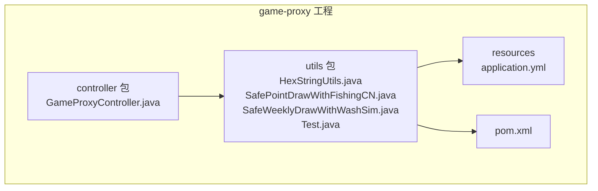
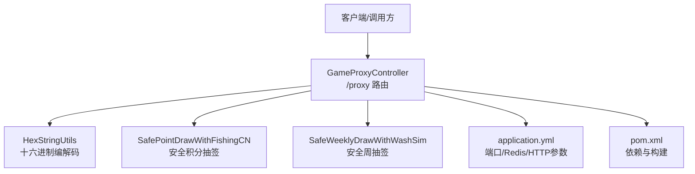
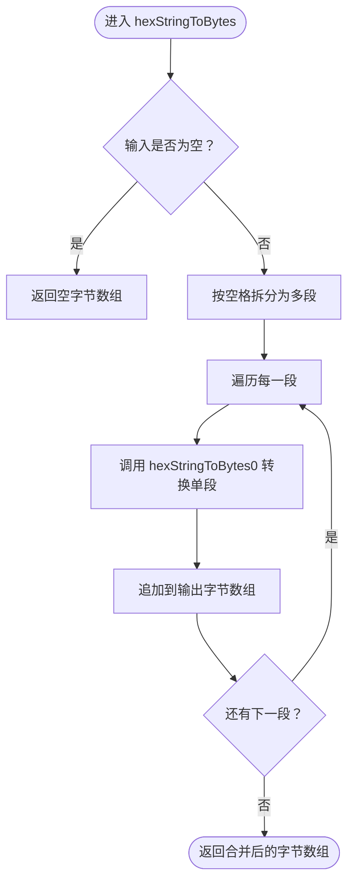
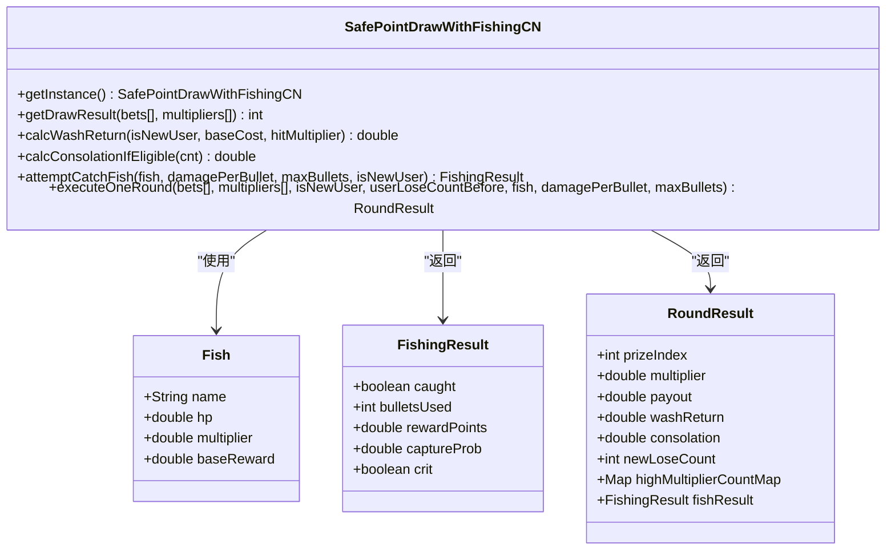
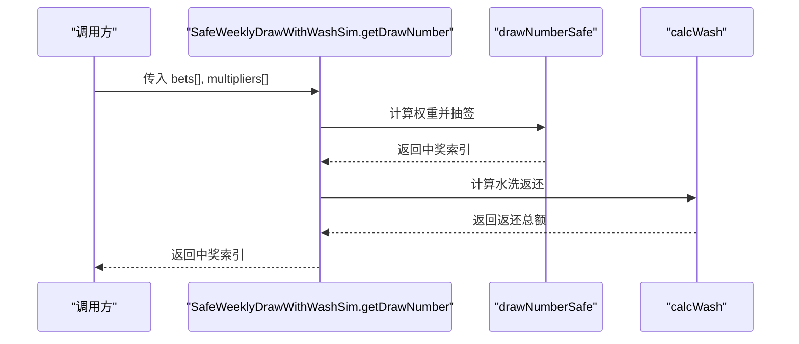
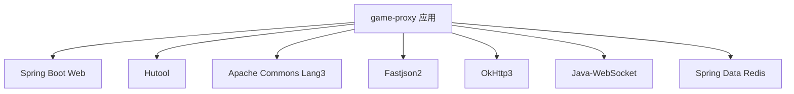

# 数据处理工具

<cite>
**本文引用的文件**
- [HexStringUtils.java](file://game-proxy/src/main/java/com/game/utils/HexStringUtils.java)
- [SafePointDrawWithFishingCN.java](file://game-proxy/src/main/java/com/game/utils/SafePointDrawWithFishingCN.java)
- [SafeWeeklyDrawWithWashSim.java](file://game-proxy/src/main/java/com/game/utils/SafeWeeklyDrawWithWashSim.java)
- [Test.java](file://game-proxy/src/main/java/com/game/utils/Test.java)
- [GameProxyController.java](file://game-proxy/src/main/java/com/game/controller/GameProxyController.java)
- [application.yml](file://game-proxy/src/main/resources/application.yml)
- [pom.xml](file://game-proxy/pom.xml)
</cite>

## 目录
1. [简介](#简介)
2. [项目结构](#项目结构)
3. [核心组件](#核心组件)
4. [架构总览](#架构总览)
5. [详细组件分析](#详细组件分析)
6. [依赖分析](#依赖分析)
7. [性能考量](#性能考量)
8. [故障排查指南](#故障排查指南)
9. [结论](#结论)
10. [附录](#附录)

## 简介
本技术文档聚焦于数据处理工具模块，系统性介绍以下能力：
- 十六进制字符串与字节序列互转的编码解码工具
- 安全积分抽签工具：支持下注平滑、强随机扰动、高倍每日上限、水洗返还、补偿机制与捕鱼游戏化
- 安全周抽签工具：面向每周场景的稳健抽签与水洗返还算法
- 提供API接口说明、参数规范、返回值格式与使用示例，帮助快速集成各类数据转换与安全抽签需求

## 项目结构
该模块位于 game-proxy 工程中，核心工具类集中在 utils 包，控制器位于 controller 包，配置文件为 application.yml，构建脚本为 pom.xml。

图表来源
- [GameProxyController.java](file://game-proxy/src/main/java/com/game/controller/GameProxyController.java#L1-L436)
- [HexStringUtils.java](file://game-proxy/src/main/java/com/game/utils/HexStringUtils.java#L1-L70)
- [SafePointDrawWithFishingCN.java](file://game-proxy/src/main/java/com/game/utils/SafePointDrawWithFishingCN.java#L1-L316)
- [SafeWeeklyDrawWithWashSim.java](file://game-proxy/src/main/java/com/game/utils/SafeWeeklyDrawWithWashSim.java#L1-L133)
- [application.yml](file://game-proxy/src/main/resources/application.yml#L1-L58)
- [pom.xml](file://game-proxy/pom.xml#L1-L163)

章节来源
- [application.yml](file://game-proxy/src/main/resources/application.yml#L1-L58)
- [pom.xml](file://game-proxy/pom.xml#L1-L163)

## 核心组件
- 十六进制字符串处理工具：提供十六进制字符串到字节数组的转换、字节数组到十六进制字符串的转换，支持带空格分隔的输入格式，并进行大小写规范化与校验。
- 安全积分抽签工具：基于下注平滑、高倍率压制、强随机扰动、每日高倍上限、水洗返还、补偿机制与捕鱼模块，形成完整的安全抽签闭环。
- 安全周抽签工具：面向每周场景的稳健抽签与水洗返还算法，通过倍率指数压制与下注权重因子控制高倍风险。
- 控制器与示例：提供自开测试接口与十六进制解码示例，便于快速验证与演示。

章节来源
- [HexStringUtils.java](file://game-proxy/src/main/java/com/game/utils/HexStringUtils.java#L1-L70)
- [SafePointDrawWithFishingCN.java](file://game-proxy/src/main/java/com/game/utils/SafePointDrawWithFishingCN.java#L1-L316)
- [SafeWeeklyDrawWithWashSim.java](file://game-proxy/src/main/java/com/game/utils/SafeWeeklyDrawWithWashSim.java#L1-L133)
- [Test.java](file://game-proxy/src/main/java/com/game/utils/Test.java#L1-L17)
- [GameProxyController.java](file://game-proxy/src/main/java/com/game/controller/GameProxyController.java#L416-L428)

## 架构总览
系统采用轻量级Spring Boot应用，控制器负责对外暴露HTTP接口，工具类提供数据处理与抽签算法，资源文件提供运行时配置。

图表来源
- [GameProxyController.java](file://game-proxy/src/main/java/com/game/controller/GameProxyController.java#L38-L436)
- [HexStringUtils.java](file://game-proxy/src/main/java/com/game/utils/HexStringUtils.java#L1-L70)
- [SafePointDrawWithFishingCN.java](file://game-proxy/src/main/java/com/game/utils/SafePointDrawWithFishingCN.java#L1-L316)
- [SafeWeeklyDrawWithWashSim.java](file://game-proxy/src/main/java/com/game/utils/SafeWeeklyDrawWithWashSim.java#L1-L133)
- [application.yml](file://game-proxy/src/main/resources/application.yml#L1-L58)
- [pom.xml](file://game-proxy/pom.xml#L1-L163)

## 详细组件分析

### 十六进制字符串处理工具（HexStringUtils）
- 功能概述
  - 支持将十六进制字符串转换为字节数组，输入可包含空格分隔，内部自动分割并拼接结果。
  - 支持将字节数组转换为十六进制字符串，统一转为大写并补齐不足两位的字节。
  - 内部通过字符映射表将十六进制字符映射为数值，确保输入合法。
- 关键方法与行为
  - hexStringToBytes：处理空字符串与空数组，按空格拆分后逐段转换，最终合并为字节数组。
  - bytesToHexString：遍历字节数组，将每个字节转换为两位十六进制字符串并拼接。
  - hexStringToBytes0：对单段十六进制字符串进行转换，包含大小写规范化与异常处理。
  - charToByte：根据预定义字符集查找十六进制字符对应的数值。
- 使用示例
  - 在测试类中演示了十六进制字符串解码为字节，再还原为字符串的过程，便于验证编码一致性。
- 复杂度与性能
  - 字符串到字节数组：O(n)，n为字符数量
  - 字节数组到字符串：O(n)，n为字节数组长度
- 错误处理
  - 输入为空或空字符串时返回空字节数组
  - 单段输入为空时抛出空指针异常，调用方需保证输入有效

图表来源
- [HexStringUtils.java](file://game-proxy/src/main/java/com/game/utils/HexStringUtils.java#L15-L29)
- [HexStringUtils.java](file://game-proxy/src/main/java/com/game/utils/HexStringUtils.java#L46-L66)

章节来源
- [HexStringUtils.java](file://game-proxy/src/main/java/com/game/utils/HexStringUtils.java#L1-L70)
- [Test.java](file://game-proxy/src/main/java/com/game/utils/Test.java#L6-L14)

### 安全积分抽签工具（SafePointDrawWithFishingCN）
- 功能概述
  - 提供完整的抽签闭环：抽签、水洗返还、补偿、捕鱼游戏化
  - 采用单例模式，每日重置高倍率计数器，防止高倍率过度集中
  - 通过下注平滑、强随机扰动、高倍每日上限等策略，提升公平性与抗预测性
- 核心算法与机制
  - 下注平滑：对不同下注额度采用平方根与对数组合，避免极端下注导致的概率失衡
  - 权重计算：基础权重+下注平滑+倍率衰减+高倍惩罚+新用户因子+每日上限抑制+强随机噪声
  - 水洗返还：根据用户等级与倍率动态计算返还概率与金额区间
  - 补偿机制：连续亏损达到阈值后发放补偿点数
  - 捕鱼模块：模拟射击游戏，计算命中概率、伤害累积、暴击与奖励
- 类与方法概览
  - 单例：getInstance
  - 抽签：getDrawResult、drawPrizeIndex1ToN
  - 水洗：calcWashReturn
  - 补偿：calcConsolationIfEligible
  - 捕鱼：attemptCatchFish、Fish、FishingResult
  - 一轮结果：executeOneRound、RoundResult
- 参数与返回值
  - getDrawResult(bets[], multipliers[])：返回中奖索引（从1开始）
  - calcWashReturn(isNewUser, baseCost, hitMultiplier)：返回返还点数
  - calcConsolationIfEligible(cnt)：返回补偿点数
  - attemptCatchFish(...)：返回FishingResult，包含是否捕获、子弹数、奖励点数、捕获概率、是否暴击
  - executeOneRound(...)：返回RoundResult，包含中奖索引、倍率、派彩、水洗返还、补偿、连输计数、高倍统计、捕鱼结果
- 使用示例
  - 控制器提供自开测试接口，直接调用工具类进行抽签并返回结果

图表来源
- [SafePointDrawWithFishingCN.java](file://game-proxy/src/main/java/com/game/utils/SafePointDrawWithFishingCN.java#L18-L316)

章节来源
- [SafePointDrawWithFishingCN.java](file://game-proxy/src/main/java/com/game/utils/SafePointDrawWithFishingCN.java#L1-L316)
- [GameProxyController.java](file://game-proxy/src/main/java/com/game/controller/GameProxyController.java#L416-L428)

### 安全周抽签工具（SafeWeeklyDrawWithWashSim）
- 功能概述
  - 面向每周场景的稳健抽签与水洗返还算法
  - 倍率越高概率越低（指数压制），下注越多权重再降低（自然风险控制）
  - 水洗返还：低倍率概率更高，限制最高返还比例
- 核心方法
  - drawNumberSafe：计算权重并进行随机抽签，返回奖项编号（从1开始）
  - calcWash：按倍率与下注情况计算水洗返还总额
  - getDrawNumber：对外可直接调用的兑换API，返回抽签结果并打印水洗返还
- 参数与返回值
  - drawNumberSafe(bets[], multipliers[], rand)：返回中奖索引（从1开始）
  - calcWash(bets[], multipliers[], rand)：返回水洗返还总额
  - getDrawNumber(bets[], multipliers[])：返回抽签结果并打印水洗返还

图表来源
- [SafeWeeklyDrawWithWashSim.java](file://game-proxy/src/main/java/com/game/utils/SafeWeeklyDrawWithWashSim.java#L99-L108)
- [SafeWeeklyDrawWithWashSim.java](file://game-proxy/src/main/java/com/game/utils/SafeWeeklyDrawWithWashSim.java#L13-L53)
- [SafeWeeklyDrawWithWashSim.java](file://game-proxy/src/main/java/com/game/utils/SafeWeeklyDrawWithWashSim.java#L62-L93)

章节来源
- [SafeWeeklyDrawWithWashSim.java](file://game-proxy/src/main/java/com/game/utils/SafeWeeklyDrawWithWashSim.java#L1-L133)

### API接口说明与使用示例

- 自开测试接口（安全积分抽签）
  - 路径：GET /proxy/selfOpening
  - 参数：
    - bets：double[]，各区间下注额
    - multipliers：double[]，对应倍率数组
  - 返回：
    - JSON对象，包含中奖索引（从1开始）与状态码
  - 示例：
    - GET /proxy/selfOpening?bets=0,0,0,0,0,0,0,100,50,30,10&multipliers=5,10,8,6,4,12,15,20,30,40,50
  - 实现参考：
    - [GameProxyController.java](file://game-proxy/src/main/java/com/game/controller/GameProxyController.java#L416-L428)

- 十六进制解码示例
  - 测试类展示了十六进制字符串解码为字节，再还原为字符串的流程
  - 参考：
    - [Test.java](file://game-proxy/src/main/java/com/game/utils/Test.java#L6-L14)

章节来源
- [GameProxyController.java](file://game-proxy/src/main/java/com/game/controller/GameProxyController.java#L416-L428)
- [Test.java](file://game-proxy/src/main/java/com/game/utils/Test.java#L6-L14)

## 依赖分析
- 运行时依赖
  - Spring Boot Web：提供REST控制器与HTTP通信能力
  - Hutool：提供日期、JSON等常用工具
  - Apache Commons Lang3：提供字符串与日期处理工具
  - Fastjson2：提供高性能JSON解析
  - OkHttp3：提供HTTP客户端能力
  - Java-WebSocket：提供WebSocket客户端能力
  - Spring Boot Starter Data Redis：提供Redis缓存能力
- 构建与打包
  - Maven插件：编译、资源过滤、打包
  - Java版本：1.8

图表来源
- [pom.xml](file://game-proxy/pom.xml#L26-L100)

章节来源
- [pom.xml](file://game-proxy/pom.xml#L1-L163)

## 性能考量
- 十六进制编解码
  - 时间复杂度线性，适合大批量数据处理；注意输入格式与空格分隔的处理
- 抽签算法
  - 权重计算包含平方根、对数与随机噪声，整体仍为线性复杂度；建议批量处理时复用Random实例
  - 高倍每日上限与强随机扰动增加少量计算开销，换取更好的公平性
- 水洗与补偿
  - 水洗返还按倍率与下注计算，补偿按连败阈值判断，均为常数级操作
- 捕鱼模块
  - 循环射击直到命中或子弹耗尽，期望线性但可能退化至线性对数级别

## 故障排查指南
- 十六进制解码失败
  - 检查输入是否包含非法字符或奇数字节
  - 确认大小写与空格分隔格式
  - 参考：
    - [HexStringUtils.java](file://game-proxy/src/main/java/com/game/utils/HexStringUtils.java#L46-L66)
- 抽签结果异常
  - 确认bets与multipliers长度一致且非空
  - 检查高倍每日上限是否触发极低概率
  - 参考：
    - [SafePointDrawWithFishingCN.java](file://game-proxy/src/main/java/com/game/utils/SafePointDrawWithFishingCN.java#L90-L146)
- 水洗返还未生效
  - 检查倍率与下注是否满足水洗条件
  - 参考：
    - [SafeWeeklyDrawWithWashSim.java](file://game-proxy/src/main/java/com/game/utils/SafeWeeklyDrawWithWashSim.java#L62-L93)
- 控制器接口异常
  - 查看日志输出与异常栈，确认参数传递与类型匹配
  - 参考：
    - [GameProxyController.java](file://game-proxy/src/main/java/com/game/controller/GameProxyController.java#L416-L428)

章节来源
- [HexStringUtils.java](file://game-proxy/src/main/java/com/game/utils/HexStringUtils.java#L46-L66)
- [SafePointDrawWithFishingCN.java](file://game-proxy/src/main/java/com/game/utils/SafePointDrawWithFishingCN.java#L90-L146)
- [SafeWeeklyDrawWithWashSim.java](file://game-proxy/src/main/java/com/game/utils/SafeWeeklyDrawWithWashSim.java#L62-L93)
- [GameProxyController.java](file://game-proxy/src/main/java/com/game/controller/GameProxyController.java#L416-L428)

## 结论
本数据处理工具模块提供了完善的十六进制编解码与安全抽签能力，结合下注平滑、强随机扰动、高倍每日上限、水洗返还与补偿机制，能够有效提升系统的公平性与用户体验。通过清晰的API与示例，开发者可以快速集成并扩展到实际业务场景中。

## 附录
- 配置项参考
  - 服务器端口、上下文路径、Redis连接、HTTP客户端参数等
  - 参考：
    - [application.yml](file://game-proxy/src/main/resources/application.yml#L1-L58)
- 依赖版本参考
  - Spring Boot、Hutool、Fastjson2、OkHttp3、WebSocket等
  - 参考：
    - [pom.xml](file://game-proxy/pom.xml#L1-L163)