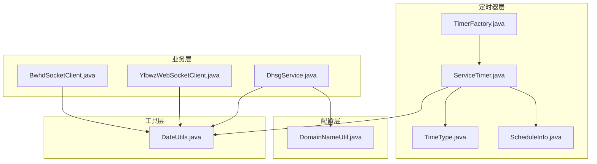
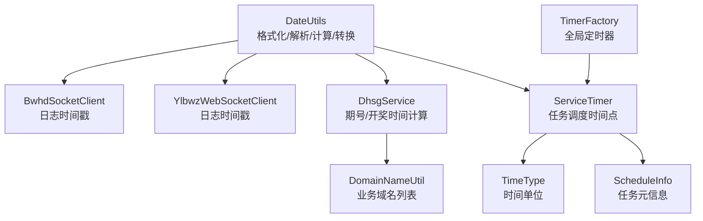
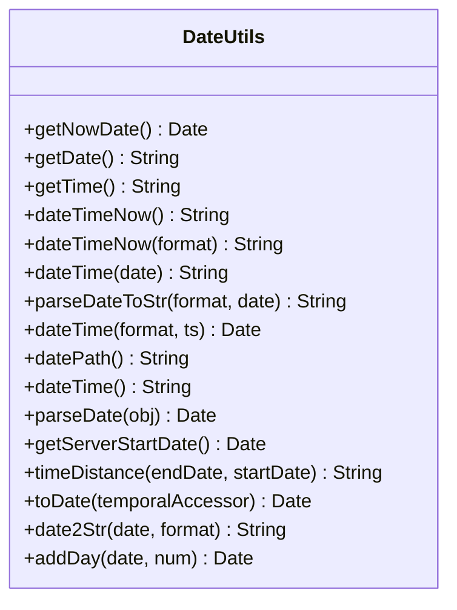
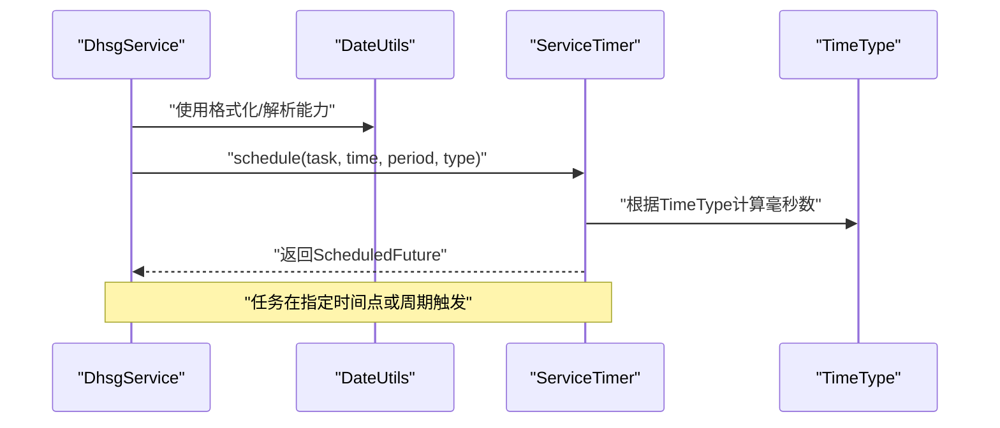
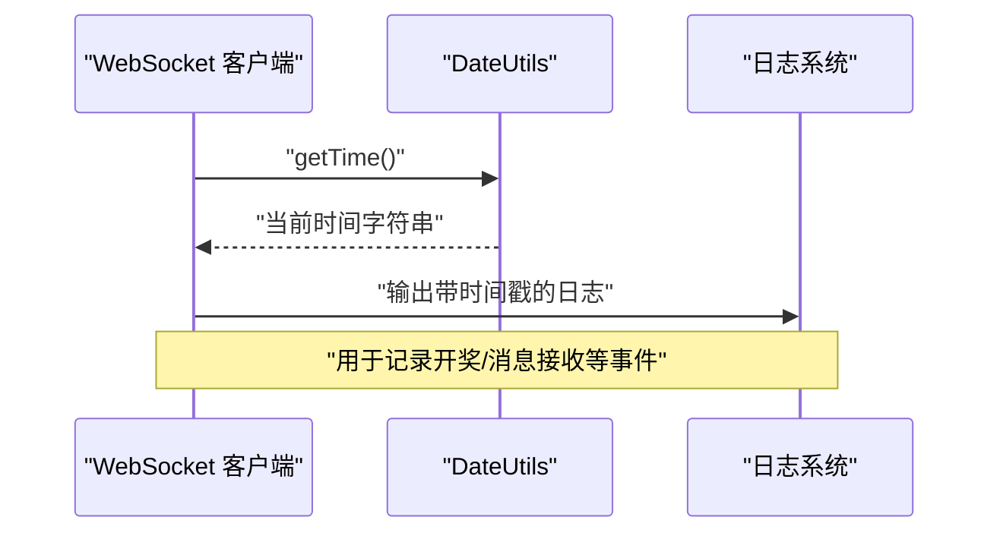
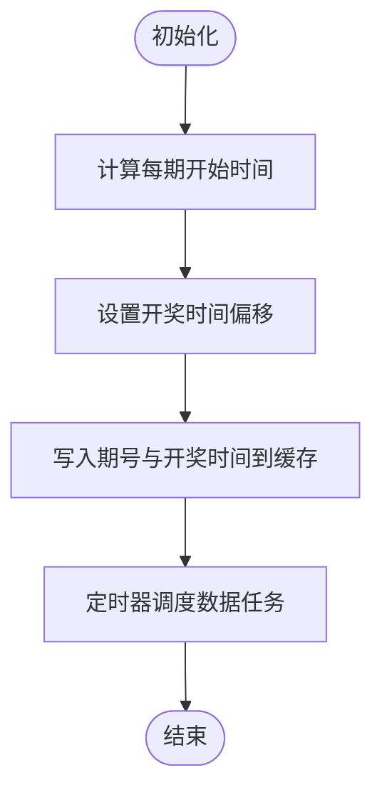
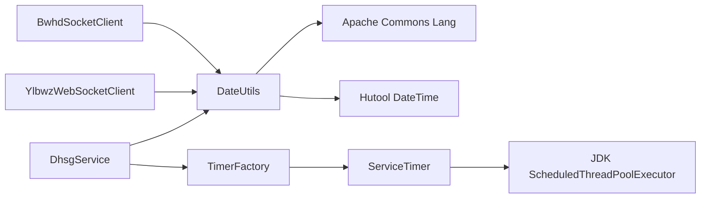

# 时间处理工具

<cite>
**本文引用的文件**
- [DateUtils.java](file://game-proxy/src/main/java/com/game/utils/DateUtils.java)
- [BwhdSocketClient.java](file://game-proxy/src/main/java/com/game/gcbwz/BwhdSocketClient.java)
- [YlbwzWebSocketClient.java](file://game-proxy/src/main/java/com/game/ylbwz/YlbwzWebSocketClient.java)
- [ServiceTimer.java](file://game-proxy/src/main/java/com/game/timer/ServiceTimer.java)
- [ScheduleInfo.java](file://game-proxy/src/main/java/com/game/timer/ScheduleInfo.java)
- [TimeType.java](file://game-proxy/src/main/java/com/game/timer/TimeType.java)
- [TimerFactory.java](file://game-proxy/src/main/java/com/game/timer/TimerFactory.java)
- [DhsgService.java](file://game-proxy/src/main/java/com/game/douyu/dahsg/DhsgService.java)
- [DomainNameUtil.java](file://game-proxy/src/main/java/com/game/utils/DomainNameUtil.java)
</cite>

## 目录
1. [简介](#简介)
2. [项目结构](#项目结构)
3. [核心组件](#核心组件)
4. [架构总览](#架构总览)
5. [详细组件分析](#详细组件分析)
6. [依赖关系分析](#依赖关系分析)
7. [性能考量](#性能考量)
8. [故障排查指南](#故障排查指南)
9. [结论](#结论)
10. [附录](#附录)

## 简介
本文件面向“时间处理工具”主题，聚焦于项目中的 DateUtils 时间工具类，系统性阐述其在日期格式化、解析、计算与转换方面的功能与实现原理，并结合实际业务场景给出 API 接口说明、参数规范、返回值格式、使用示例与最佳实践建议。同时，通过与定时器模块、WebSocket 客户端及业务服务的交互关系，帮助读者建立从“时间工具”到“业务执行”的完整认知。

## 项目结构
围绕时间处理工具的相关模块分布如下：
- 工具层：com.game.utils.DateUtils 提供统一的时间格式化、解析、计算与转换能力
- 定时器层：com.game.timer.ServiceTimer、TimerFactory、TimeType、ScheduleInfo 提供基于时间的任务调度
- 业务层：com.game.gcbwz.BwhdSocketClient、com.game.ylbwz.YlbwzWebSocketClient、com.game.douyu.dahsg.DhsgService 等在运行时使用时间工具进行日志记录、开奖时间设置与周期任务调度
- 配置层：com.game.utils.DomainNameUtil 提供业务域名列表，常与时间工具配合用于跨节点同步

图表来源
- [DateUtils.java](file://game-proxy/src/main/java/com/game/utils/DateUtils.java#L1-L197)
- [ServiceTimer.java](file://game-proxy/src/main/java/com/game/timer/ServiceTimer.java#L1-L164)
- [TimerFactory.java](file://game-proxy/src/main/java/com/game/timer/TimerFactory.java#L1-L11)
- [TimeType.java](file://game-proxy/src/main/java/com/game/timer/TimeType.java#L1-L24)
- [ScheduleInfo.java](file://game-proxy/src/main/java/com/game/timer/ScheduleInfo.java#L1-L66)
- [BwhdSocketClient.java](file://game-proxy/src/main/java/com/game/gcbwz/BwhdSocketClient.java#L35-L88)
- [YlbwzWebSocketClient.java](file://game-proxy/src/main/java/com/game/ylbwz/YlbwzWebSocketClient.java#L80-L193)
- [DhsgService.java](file://game-proxy/src/main/java/com/game/douyu/dahsg/DhsgService.java#L1-L129)
- [DomainNameUtil.java](file://game-proxy/src/main/java/com/game/utils/DomainNameUtil.java#L1-L16)

章节来源
- [DateUtils.java](file://game-proxy/src/main/java/com/game/utils/DateUtils.java#L1-L197)
- [ServiceTimer.java](file://game-proxy/src/main/java/com/game/timer/ServiceTimer.java#L1-L164)
- [TimerFactory.java](file://game-proxy/src/main/java/com/game/timer/TimerFactory.java#L1-L11)
- [TimeType.java](file://game-proxy/src/main/java/com/game/timer/TimeType.java#L1-L24)
- [ScheduleInfo.java](file://game-proxy/src/main/java/com/game/timer/ScheduleInfo.java#L1-L66)
- [BwhdSocketClient.java](file://game-proxy/src/main/java/com/game/gcbwz/BwhdSocketClient.java#L35-L88)
- [YlbwzWebSocketClient.java](file://game-proxy/src/main/java/com/game/ylbwz/YlbwzWebSocketClient.java#L80-L193)
- [DhsgService.java](file://game-proxy/src/main/java/com/game/douyu/dahsg/DhsgService.java#L1-L129)
- [DomainNameUtil.java](file://game-proxy/src/main/java/com/game/utils/DomainNameUtil.java#L1-L16)

## 核心组件
- DateUtils：继承自 Apache Commons Lang 的日期工具类，扩展了常用格式常量、时间格式化/解析、日期路径生成、服务器启动时间获取、时间差计算、LocalDate/LocalDateTime 到 Date 的转换、日期加减等能力
- 定时器模块：ServiceTimer 基于 ScheduledThreadPoolExecutor 实现可追踪的任务调度；TimerFactory 提供全局单例；TimeType 定义时间单位；ScheduleInfo 记录任务元信息
- 业务客户端：BwhdSocketClient、YlbwzWebSocketClient 在消息回调中使用 DateUtils 输出带时间戳的日志
- 业务服务：DhsgService 使用时间工具与 Hutool 工具进行期号与开奖时间的偏移计算，并结合定时器模块进行周期性任务调度

章节来源
- [DateUtils.java](file://game-proxy/src/main/java/com/game/utils/DateUtils.java#L18-L196)
- [ServiceTimer.java](file://game-proxy/src/main/java/com/game/timer/ServiceTimer.java#L16-L163)
- [TimerFactory.java](file://game-proxy/src/main/java/com/game/timer/TimerFactory.java#L3-L9)
- [TimeType.java](file://game-proxy/src/main/java/com/game/timer/TimeType.java#L3-L12)
- [ScheduleInfo.java](file://game-proxy/src/main/java/com/game/timer/ScheduleInfo.java#L5-L64)
- [BwhdSocketClient.java](file://game-proxy/src/main/java/com/game/gcbwz/BwhdSocketClient.java#L35-L88)
- [YlbwzWebSocketClient.java](file://game-proxy/src/main/java/com/game/ylbwz/YlbwzWebSocketClient.java#L80-L193)
- [DhsgService.java](file://game-proxy/src/main/java/com/game/douyu/dahsg/DhsgService.java#L40-L69)

## 架构总览
下图展示了时间工具在系统中的调用关系与职责边界：

图表来源
- [DateUtils.java](file://game-proxy/src/main/java/com/game/utils/DateUtils.java#L45-L196)
- [BwhdSocketClient.java](file://game-proxy/src/main/java/com/game/gcbwz/BwhdSocketClient.java#L40-L58)
- [YlbwzWebSocketClient.java](file://game-proxy/src/main/java/com/game/ylbwz/YlbwzWebSocketClient.java#L83-L103)
- [DhsgService.java](file://game-proxy/src/main/java/com/game/douyu/dahsg/DhsgService.java#L46-L69)
- [ServiceTimer.java](file://game-proxy/src/main/java/com/game/timer/ServiceTimer.java#L26-L99)
- [TimerFactory.java](file://game-proxy/src/main/java/com/game/timer/TimerFactory.java#L5-L9)
- [TimeType.java](file://game-proxy/src/main/java/com/game/timer/TimeType.java#L3-L12)
- [ScheduleInfo.java](file://game-proxy/src/main/java/com/game/timer/ScheduleInfo.java#L7-L12)
- [DomainNameUtil.java](file://game-proxy/src/main/java/com/game/utils/DomainNameUtil.java#L3-L12)

## 详细组件分析

### DateUtils 类详解
- 继承与扩展：继承自 Apache Commons Lang 的日期工具类，复用其解析能力，并新增格式常量与便捷方法
- 格式常量：提供多种常用日期/时间格式常量，便于统一管理与复用
- 格式化与解析：
  - 当前日期/时间字符串：支持默认格式与自定义格式输出
  - 字符串转日期：支持多模式解析，兼容多种分隔符与时间粒度
  - 日期转字符串：基于 Hutool 的 DateTime 对象进行格式化
- 路径与日期：
  - 日期路径：按“年/月/日”生成路径字符串
  - 日期编号：按“年月日”生成纯数字日期字符串
- 时间差计算：以天/小时/分钟形式输出两个时间点之间的差值
- 时区与转换：
  - 支持将 LocalDate/LocalDateTime 转换为 Date，默认使用系统时区
- 日期运算：提供按天数增减日期的方法
- 服务器启动时间：通过 JVM RuntimeMXBean 获取进程启动时间

图表来源
- [DateUtils.java](file://game-proxy/src/main/java/com/game/utils/DateUtils.java#L45-L196)

章节来源
- [DateUtils.java](file://game-proxy/src/main/java/com/game/utils/DateUtils.java#L18-L196)

### 定时器模块与时间工具的协作
- 任务调度：ServiceTimer 提供基于固定延迟、绝对时间、周期间隔的调度能力，并将任务元信息保存在 ScheduleInfo 中
- 时间单位：TimeType 定义毫秒、秒、分钟、小时、天、周、月、年等单位，便于将用户输入转换为毫秒级延迟
- 与时间工具的结合：
  - ServiceTimer 内部使用 System.currentTimeMillis() 作为当前时间基准
  - 通过 DateUtils 的格式化能力输出任务执行时间的日志
  - 业务服务（如 DhsgService）使用 Hutool 的偏移函数计算开奖时间，再交由定时器调度

图表来源
- [DhsgService.java](file://game-proxy/src/main/java/com/game/douyu/dahsg/DhsgService.java#L46-L69)
- [ServiceTimer.java](file://game-proxy/src/main/java/com/game/timer/ServiceTimer.java#L83-L99)
- [TimeType.java](file://game-proxy/src/main/java/com/game/timer/TimeType.java#L3-L12)
- [DateUtils.java](file://game-proxy/src/main/java/com/game/utils/DateUtils.java#L66-L76)

章节来源
- [ServiceTimer.java](file://game-proxy/src/main/java/com/game/timer/ServiceTimer.java#L26-L99)
- [TimeType.java](file://game-proxy/src/main/java/com/game/timer/TimeType.java#L3-L12)
- [ScheduleInfo.java](file://game-proxy/src/main/java/com/game/timer/ScheduleInfo.java#L7-L12)
- [TimerFactory.java](file://game-proxy/src/main/java/com/game/timer/TimerFactory.java#L5-L9)
- [DhsgService.java](file://game-proxy/src/main/java/com/game/douyu/dahsg/DhsgService.java#L46-L69)

### WebSocket 客户端中的时间使用
- BwhdSocketClient 与 YlbwzWebSocketClient 在消息回调中使用 DateUtils.getTime() 输出带时间戳的日志，便于定位事件发生时刻
- 两者均在“开奖”等关键节点记录当前系统毫秒时间，用于后续统计与对账

图表来源
- [BwhdSocketClient.java](file://game-proxy/src/main/java/com/game/gcbwz/BwhdSocketClient.java#L40-L58)
- [YlbwzWebSocketClient.java](file://game-proxy/src/main/java/com/game/ylbwz/YlbwzWebSocketClient.java#L83-L103)
- [DateUtils.java](file://game-proxy/src/main/java/com/game/utils/DateUtils.java#L58-L60)

章节来源
- [BwhdSocketClient.java](file://game-proxy/src/main/java/com/game/gcbwz/BwhdSocketClient.java#L35-L88)
- [YlbwzWebSocketClient.java](file://game-proxy/src/main/java/com/game/ylbwz/YlbwzWebSocketClient.java#L80-L193)
- [DateUtils.java](file://game-proxy/src/main/java/com/game/utils/DateUtils.java#L58-L60)

### 业务服务中的时间计算与调度
- DhsgService 在初始化时计算每期开始时间与开奖时间，并将期号与开奖时间写入缓存
- 使用 Hutool 的偏移函数进行秒级偏移，随后通过定时器工厂调度具体的数据任务
- 该流程体现了“业务时间规则 → 时间偏移 → 定时调度 → 业务执行”的闭环

图表来源
- [DhsgService.java](file://game-proxy/src/main/java/com/game/douyu/dahsg/DhsgService.java#L46-L69)
- [TimerFactory.java](file://game-proxy/src/main/java/com/game/timer/TimerFactory.java#L5-L9)
- [ServiceTimer.java](file://game-proxy/src/main/java/com/game/timer/ServiceTimer.java#L69-L81)

章节来源
- [DhsgService.java](file://game-proxy/src/main/java/com/game/douyu/dahsg/DhsgService.java#L46-L69)
- [TimerFactory.java](file://game-proxy/src/main/java/com/game/timer/TimerFactory.java#L5-L9)
- [ServiceTimer.java](file://game-proxy/src/main/java/com/game/timer/ServiceTimer.java#L69-L81)

## 依赖关系分析
- DateUtils 依赖 Apache Commons Lang 的解析能力与 Hutool 的 DateTime 对象进行格式化
- 定时器模块依赖 JDK 的 ScheduledThreadPoolExecutor，通过 TimerFactory 提供全局单例
- 业务客户端与服务通过时间工具进行日志与调度，形成松耦合的协作关系

图表来源
- [DateUtils.java](file://game-proxy/src/main/java/com/game/utils/DateUtils.java#L3-L11)
- [ServiceTimer.java](file://game-proxy/src/main/java/com/game/timer/ServiceTimer.java#L16-L24)
- [TimerFactory.java](file://game-proxy/src/main/java/com/game/timer/TimerFactory.java#L5-L9)
- [BwhdSocketClient.java](file://game-proxy/src/main/java/com/game/gcbwz/BwhdSocketClient.java#L40-L58)
- [YlbwzWebSocketClient.java](file://game-proxy/src/main/java/com/game/ylbwz/YlbwzWebSocketClient.java#L83-L103)
- [DhsgService.java](file://game-proxy/src/main/java/com/game/douyu/dahsg/DhsgService.java#L46-L69)

章节来源
- [DateUtils.java](file://game-proxy/src/main/java/com/game/utils/DateUtils.java#L3-L11)
- [ServiceTimer.java](file://game-proxy/src/main/java/com/game/timer/ServiceTimer.java#L16-L24)
- [TimerFactory.java](file://game-proxy/src/main/java/com/game/timer/TimerFactory.java#L5-L9)
- [BwhdSocketClient.java](file://game-proxy/src/main/java/com/game/gcbwz/BwhdSocketClient.java#L40-L58)
- [YlbwzWebSocketClient.java](file://game-proxy/src/main/java/com/game/ylbwz/YlbwzWebSocketClient.java#L83-L103)
- [DhsgService.java](file://game-proxy/src/main/java/com/game/douyu/dahsg/DhsgService.java#L46-L69)

## 性能考量
- 格式化与解析：频繁的 SimpleDateFormat 创建与解析会带来开销，建议在高并发场景下复用格式化器或采用线程安全的方案
- 本地时间与系统时区：LocalDate/LocalDateTime 转 Date 默认使用系统时区，需确保部署环境时区一致，避免跨时区业务误差
- 定时器调度：合理设置调度周期与任务数量，避免过多任务导致线程池拥塞
- 日志输出：在高频事件中输出带时间戳日志会增加 I/O 压力，建议按需采样或异步化

## 故障排查指南
- 解析失败：当传入字符串不符合预设格式时，解析方法会抛出运行时异常或返回空值，应检查输入格式与分隔符
- 时间差显示异常：若传入时间顺序错误，可能导致负数差值，应在调用前校验时间先后
- 时区问题：若业务涉及跨时区，需明确使用 UTC 或目标时区，避免默认系统时区带来的偏差
- 定时任务未执行：检查任务是否被取消或完成，以及调度时间是否正确转换为毫秒

章节来源
- [DateUtils.java](file://game-proxy/src/main/java/com/game/utils/DateUtils.java#L78-L84)
- [ServiceTimer.java](file://game-proxy/src/main/java/com/game/timer/ServiceTimer.java#L101-L113)

## 结论
DateUtils 作为统一的时间处理入口，覆盖了格式化、解析、计算与转换等核心需求，并与定时器模块、WebSocket 客户端及业务服务形成清晰的协作关系。通过标准化时间格式与统一的调度机制，系统在日志记录、开奖时间管理与周期任务执行方面具备良好的一致性与可维护性。建议在高并发与跨时区场景下进一步优化格式化器与时区策略，并完善异常处理与监控告警。

## 附录

### API 接口说明与使用示例

- 获取当前时间
  - 方法：getNowDate()
  - 返回：当前时间的 Date 对象
  - 使用场景：需要获取当前系统时间点时使用
  - 示例参考：[DateUtils.java](file://game-proxy/src/main/java/com/game/utils/DateUtils.java#L45-L47)

- 获取当前日期字符串
  - 方法：getDate()
  - 返回：默认格式 yyyy-MM-dd 的日期字符串
  - 使用场景：日常日期标识与缓存键拼接
  - 示例参考：[DateUtils.java](file://game-proxy/src/main/java/com/game/utils/DateUtils.java#L54-L56)

- 获取当前时间字符串
  - 方法：getTime()
  - 返回：默认格式 yyyy-MM-dd HH:mm:ss 的时间字符串
  - 使用场景：日志输出与事件标记
  - 示例参考：[DateUtils.java](file://game-proxy/src/main/java/com/game/utils/DateUtils.java#L58-L60)

- 格式化当前时间
  - 方法：dateTimeNow()、dateTimeNow(format)
  - 返回：按指定格式格式化的当前时间字符串
  - 使用场景：灵活格式化输出
  - 示例参考：[DateUtils.java](file://game-proxy/src/main/java/com/game/utils/DateUtils.java#L62-L68)

- 日期格式化
  - 方法：dateTime(date)、parseDateToStr(format, date)
  - 返回：按指定格式格式化的日期字符串
  - 使用场景：将 Date 对象按固定格式输出
  - 示例参考：[DateUtils.java](file://game-proxy/src/main/java/com/game/utils/DateUtils.java#L70-L76)

- 字符串解析为日期
  - 方法：dateTime(format, ts)
  - 返回：解析后的 Date 对象
  - 异常：解析失败抛出运行时异常
  - 使用场景：将字符串按指定格式解析为日期
  - 示例参考：[DateUtils.java](file://game-proxy/src/main/java/com/game/utils/DateUtils.java#L78-L84)

- 多模式解析
  - 方法：parseDate(obj)
  - 返回：解析后的 Date 对象，失败返回 null
  - 使用场景：兼容多种输入格式
  - 示例参考：[DateUtils.java](file://game-proxy/src/main/java/com/game/utils/DateUtils.java#L105-L114)

- 日期路径与日期编号
  - 方法：datePath()、dateTime()
  - 返回：按“年/月/日”或“年月日”格式的字符串
  - 使用场景：目录组织与文件命名
  - 示例参考：[DateUtils.java](file://game-proxy/src/main/java/com/game/utils/DateUtils.java#L89-L100)

- 服务器启动时间
  - 方法：getServerStartDate()
  - 返回：JVM 启动时间对应的 Date 对象
  - 使用场景：系统运行时长统计
  - 示例参考：[DateUtils.java](file://game-proxy/src/main/java/com/game/utils/DateUtils.java#L119-L122)

- 时间差计算
  - 方法：timeDistance(endDate, startDate)
  - 返回：形如“X天Y小时Z分钟”的字符串
  - 使用场景：统计耗时与周期
  - 示例参考：[DateUtils.java](file://game-proxy/src/main/java/com/game/utils/DateUtils.java#L131-L147)

- 日期加减
  - 方法：addDay(date, num)
  - 返回：加减若干天后的 Date 对象
  - 使用场景：业务日期偏移
  - 示例参考：[DateUtils.java](file://game-proxy/src/main/java/com/game/utils/DateUtils.java#L190-L195)

- 本地时间到 Date 的转换
  - 方法：toDate(LocalDate)、toDate(LocalDateTime)
  - 返回：对应 Date 对象（默认系统时区）
  - 使用场景：与旧版 API 兼容
  - 示例参考：[DateUtils.java](file://game-proxy/src/main/java/com/game/utils/DateUtils.java#L160-L164)

- 日期转字符串（Hutool）
  - 方法：date2Str(date, format)
  - 返回：按指定格式格式化的字符串
  - 使用场景：统一格式化输出
  - 示例参考：[DateUtils.java](file://game-proxy/src/main/java/com/game/utils/DateUtils.java#L178-L181)

- 定时器调度（与时间工具结合）
  - 方法：ServiceTimer.schedule(...)
  - 参数：任务、延迟/绝对时间、周期、时间单位
  - 使用场景：周期性任务与定时执行
  - 示例参考：[ServiceTimer.java](file://game-proxy/src/main/java/com/game/timer/ServiceTimer.java#L26-L99)

- 业务服务中的时间计算
  - 方法：DhsgService.gameInfo()、luckMonster()
  - 使用场景：期号与开奖时间的计算与调度
  - 示例参考：[DhsgService.java](file://game-proxy/src/main/java/com/game/douyu/dahsg/DhsgService.java#L46-L69)