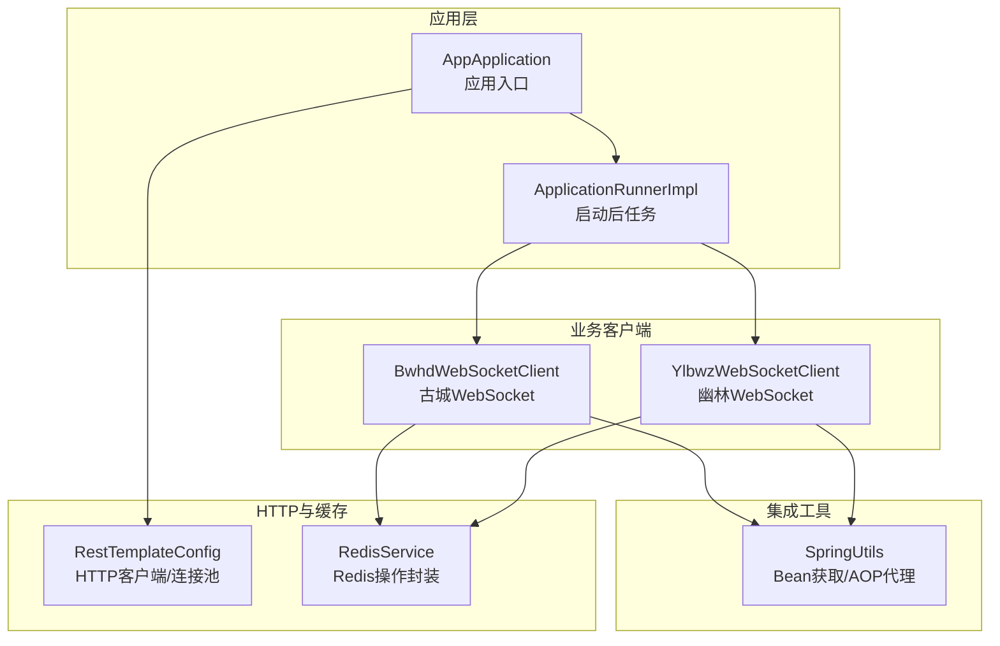
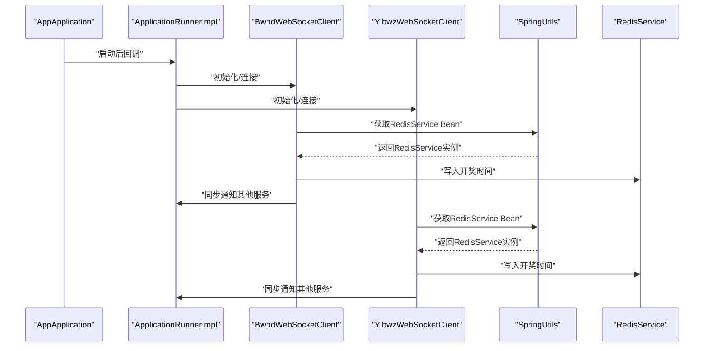
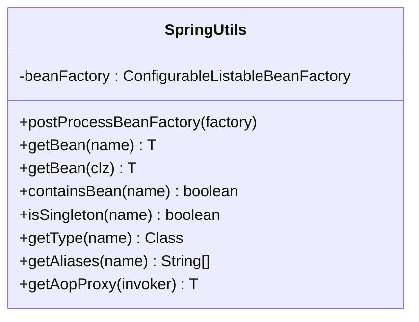
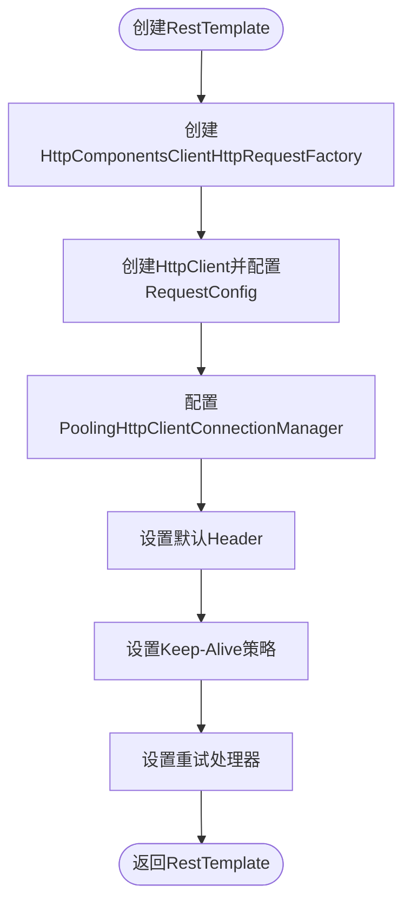
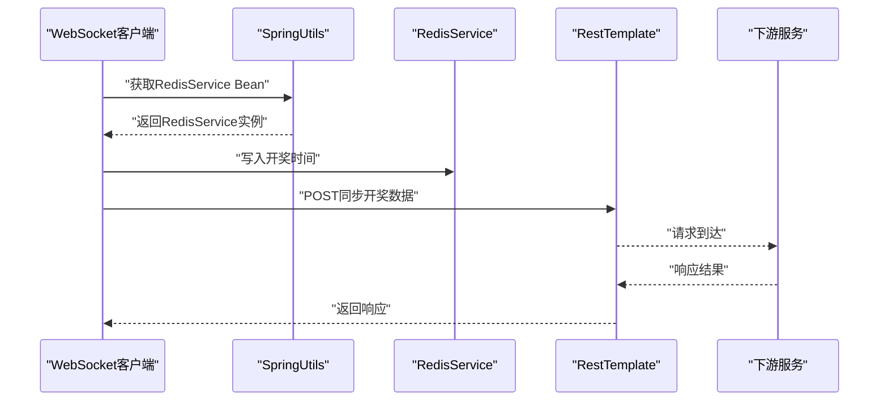
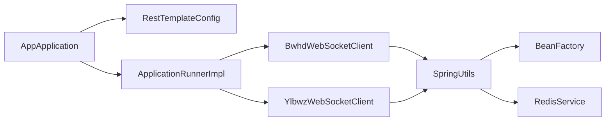

# 框架集成工具

<cite>
**本文引用的文件**
- [SpringUtils.java](file://game-proxy/src/main/java/com/game/utils/SpringUtils.java)
- [AppApplication.java](file://game-proxy/src/main/java/com/game/AppApplication.java)
- [ApplicationRunnerImpl.java](file://game-proxy/src/main/java/com/game/listener/ApplicationRunnerImpl.java)
- [RestTemplateConfig.java](file://game-proxy/src/main/java/com/game/commom/RestTemplateConfig.java)
- [RedisService.java](file://game-proxy/src/main/java/com/game/redis/RedisService.java)
- [BwhdWebSocketClient.java](file://game-proxy/src/main/java/com/game/gcbwz/BwhdWebSocketClient.java)
- [YlbwzWebSocketClient.java](file://game-proxy/src/main/java/com/game/ylbwz/YlbwzWebSocketClient.java)
- [application.yml](file://game-proxy/src/main/resources/application.yml)
- [pom.xml](file://game-proxy/pom.xml)
</cite>

## 目录
1. [简介](#简介)
2. [项目结构](#项目结构)
3. [核心组件](#核心组件)
4. [架构总览](#架构总览)
5. [组件详解](#组件详解)
6. [依赖关系分析](#依赖关系分析)
7. [性能考量](#性能考量)
8. [故障排查指南](#故障排查指南)
9. [结论](#结论)
10. [附录](#附录)

## 简介
本文件面向“框架集成工具”的技术文档，聚焦于 SpringUtils 在非 Spring 管理环境中的 Bean 获取与 AOP 代理获取能力，系统阐述 Spring 上下文的获取、Bean 的注入与管理机制、容器初始化与配置管理、以及在项目中的实际使用场景与最佳实践。文档同时给出 API 接口说明、参数规范与调用流程图示，帮助读者在多模块、多线程、异步通信场景中正确使用 Spring 框架。

## 项目结构
该工程采用 Spring Boot 标准目录结构，核心模块包含：
- 应用入口与启动配置：AppApplication
- 启动后任务执行：ApplicationRunnerImpl
- HTTP 客户端与连接池配置：RestTemplateConfig
- Redis 服务封装：RedisService
- WebSocket 客户端与业务处理：BwhdWebSocketClient、YlbwzWebSocketClient
- 框架集成工具：SpringUtils（在非 Spring 管理环境中获取 Bean/AOP 代理）
- 配置文件：application.yml
- 依赖管理：pom.xml

图表来源
- [AppApplication.java](file://game-proxy/src/main/java/com/game/AppApplication.java#L15-L32)
- [ApplicationRunnerImpl.java](file://game-proxy/src/main/java/com/game/listener/ApplicationRunnerImpl.java#L33-L145)
- [RestTemplateConfig.java](file://game-proxy/src/main/java/com/game/commom/RestTemplateConfig.java#L33-L131)
- [RedisService.java](file://game-proxy/src/main/java/com/game/redis/RedisService.java#L18-L200)
- [BwhdWebSocketClient.java](file://game-proxy/src/main/java/com/game/gcbwz/BwhdWebSocketClient.java#L16-L192)
- [YlbwzWebSocketClient.java](file://game-proxy/src/main/java/com/game/ylbwz/YlbwzWebSocketClient.java#L50-L193)
- [SpringUtils.java](file://game-proxy/src/main/java/com/game/utils/SpringUtils.java#L15-L102)

章节来源
- [AppApplication.java](file://game-proxy/src/main/java/com/game/AppApplication.java#L15-L32)
- [application.yml](file://game-proxy/src/main/resources/application.yml#L1-L58)

## 核心组件
- SpringUtils：实现 BeanFactoryPostProcessor，在 Spring 容器启动阶段捕获可配置的 Bean 工厂，提供静态方法在非 Spring 管理环境中获取 Bean 实例、判断 Bean 类型与作用域、查询别名、以及获取当前 AOP 代理对象。
- RestTemplateConfig：基于 Apache HttpClient 的连接池配置，统一对外 HTTP 请求工厂与 RestTemplate Bean，支持超时、重试、长连接策略。
- RedisService：对 RedisTemplate 的常用操作进行封装，提供键值、列表、集合、哈希等缓存读写能力。
- WebSocket 客户端：BwhdWebSocketClient 与 YlbwzWebSocketClient 在连接建立后接收开奖消息，写入 Redis 并向其他服务同步通知。
- ApplicationRunnerImpl：应用启动后执行的任务编排，负责调度各业务客户端的初始化与定时任务。

章节来源
- [SpringUtils.java](file://game-proxy/src/main/java/com/game/utils/SpringUtils.java#L15-L102)
- [RestTemplateConfig.java](file://game-proxy/src/main/java/com/game/commom/RestTemplateConfig.java#L33-L131)
- [RedisService.java](file://game-proxy/src/main/java/com/game/redis/RedisService.java#L18-L200)
- [BwhdWebSocketClient.java](file://game-proxy/src/main/java/com/game/gcbwz/BwhdWebSocketClient.java#L50-L192)
- [YlbwzWebSocketClient.java](file://game-proxy/src/main/java/com/game/ylbwz/YlbwzWebSocketClient.java#L50-L193)
- [ApplicationRunnerImpl.java](file://game-proxy/src/main/java/com/game/listener/ApplicationRunnerImpl.java#L33-L145)

## 架构总览
SpringUtils 作为“桥接器”，在非 Spring 管理的线程或外部组件中，通过静态方法访问 Spring 容器中的 Bean；RestTemplateConfig 与 RedisService 分别承担网络与存储职责；WebSocket 客户端在业务线程中消费实时数据并写入缓存，形成“实时数据 → 缓存 → 同步通知”的闭环。

图表来源
- [AppApplication.java](file://game-proxy/src/main/java/com/game/AppApplication.java#L24-L31)
- [ApplicationRunnerImpl.java](file://game-proxy/src/main/java/com/game/listener/ApplicationRunnerImpl.java#L64-L145)
- [BwhdWebSocketClient.java](file://game-proxy/src/main/java/com/game/gcbwz/BwhdWebSocketClient.java#L50-L192)
- [YlbwzWebSocketClient.java](file://game-proxy/src/main/java/com/game/ylbwz/YlbwzWebSocketClient.java#L50-L193)
- [SpringUtils.java](file://game-proxy/src/main/java/com/game/utils/SpringUtils.java#L34-L37)
- [RedisService.java](file://game-proxy/src/main/java/com/game/redis/RedisService.java#L95-L98)

## 组件详解

### SpringUtils 组件分析
- 设计原理
  - 实现 BeanFactoryPostProcessor，在容器刷新阶段注入 ConfigurableListableBeanFactory，保存为静态字段，供后续静态方法使用。
  - 提供泛型 getBean(name/class)、containsBean、isSingleton、getType、getAliases、getAopProxy 等方法，覆盖常见 Bean 查询与 AOP 场景。
- 关键点
  - 静态持有 beanFactory，避免在非 Spring 环境中无法访问 ApplicationContext。
  - getAopProxy 使用 AopContext.currentProxy 获取当前调用的 AOP 代理对象，便于自调用场景下的事务/拦截生效。
- 使用建议
  - 仅在需要在工具类、线程、或非 Spring 生命周期对象中获取 Bean 时使用。
  - 避免在静态块或类加载早期调用 getBean，确保容器已初始化。

图表来源
- [SpringUtils.java](file://game-proxy/src/main/java/com/game/utils/SpringUtils.java#L15-L102)

章节来源
- [SpringUtils.java](file://game-proxy/src/main/java/com/game/utils/SpringUtils.java#L15-L102)

### RestTemplateConfig 组件分析
- 设计原理
  - 基于 Apache HttpClient 的连接池管理，统一配置超时、重试、Keep-Alive 策略。
  - 将 HttpClient 注入 HttpComponentsClientHttpRequestFactory，再由 RestTemplate 使用，实现高性能 HTTP 调用。
- 关键点
  - 通过 application.yml 中 http.* 配置项动态注入连接池参数。
  - 默认添加通用 Header，提升兼容性。
- 性能特性
  - 连接池复用、长连接保持、失败重试，适合高并发与弱网环境。

图表来源
- [RestTemplateConfig.java](file://game-proxy/src/main/java/com/game/commom/RestTemplateConfig.java#L62-L129)
- [application.yml](file://game-proxy/src/main/resources/application.yml#L43-L57)

章节来源
- [RestTemplateConfig.java](file://game-proxy/src/main/java/com/game/commom/RestTemplateConfig.java#L33-L131)
- [application.yml](file://game-proxy/src/main/resources/application.yml#L43-L57)

### RedisService 组件分析
- 设计原理
  - 对 RedisTemplate 进行分装，提供键值、列表、集合、哈希等常用操作，统一过期时间与序列化策略。
- 关键点
  - 泛型方法支持多种数据类型缓存与读取。
  - 提供批量删除与存在性判断，便于清理与校验。
- 使用建议
  - 在写入缓存前明确 key 命名规范与过期时间。
  - 对热点数据设置合理 TTL，避免内存膨胀。

章节来源
- [RedisService.java](file://game-proxy/src/main/java/com/game/redis/RedisService.java#L18-L200)

### WebSocket 客户端组件分析
- 设计原理
  - 通过 WebSocket 接收实时开奖数据，解析后写入 Redis，并向其他服务同步通知。
  - 在构造函数中通过 SpringUtils 获取 RedisService，保证在非 Spring 环境中也能获得 Bean。
- 关键点
  - 连接失败自动重连，持续发送心跳与订阅消息。
  - 使用 RestTemplate 将开奖数据同步至多个下游服务地址。
- 使用建议
  - 在生产环境开启连接池与超时控制，避免资源泄露。
  - 对异常日志分级记录，便于问题定位。

图表来源
- [BwhdWebSocketClient.java](file://game-proxy/src/main/java/com/game/gcbwz/BwhdWebSocketClient.java#L50-L192)
- [YlbwzWebSocketClient.java](file://game-proxy/src/main/java/com/game/ylbwz/YlbwzWebSocketClient.java#L50-L193)
- [SpringUtils.java](file://game-proxy/src/main/java/com/game/utils/SpringUtils.java#L34-L37)
- [RedisService.java](file://game-proxy/src/main/java/com/game/redis/RedisService.java#L95-L98)

章节来源
- [BwhdWebSocketClient.java](file://game-proxy/src/main/java/com/game/gcbwz/BwhdWebSocketClient.java#L50-L192)
- [YlbwzWebSocketClient.java](file://game-proxy/src/main/java/com/game/ylbwz/YlbwzWebSocketClient.java#L50-L193)
- [SpringUtils.java](file://game-proxy/src/main/java/com/game/utils/SpringUtils.java#L34-L37)
- [RedisService.java](file://game-proxy/src/main/java/com/game/redis/RedisService.java#L95-L98)

### ApplicationRunnerImpl 组件分析
- 设计原理
  - 实现 ApplicationRunner，在应用启动完成后执行业务初始化逻辑，如启动 WebSocket 客户端、定时任务等。
  - 通过 @Resource 注入线程池与业务服务，实现异步与解耦。
- 关键点
  - 通过 @Value 读取配置项，如会话与手机号等参数。
  - 提供注释化的初始化开关，便于按需启用/禁用业务模块。
- 使用建议
  - 将耗时初始化放入线程池执行，避免阻塞主进程。
  - 对异常进行分类处理与重试，保障系统稳定性。

章节来源
- [ApplicationRunnerImpl.java](file://game-proxy/src/main/java/com/game/listener/ApplicationRunnerImpl.java#L33-L145)

## 依赖关系分析
- SpringUtils 与 Spring 容器生命周期绑定，通过 BeanFactoryPostProcessor 注入 Bean 工厂。
- WebSocket 客户端在构造阶段依赖 SpringUtils 获取 RedisService。
- RestTemplateConfig 依赖 application.yml 中的 HTTP 参数，统一对外 HTTP 访问。
- AppApplication 作为启动入口，负责应用上下文初始化与日志输出。

图表来源
- [SpringUtils.java](file://game-proxy/src/main/java/com/game/utils/SpringUtils.java#L15-L102)
- [BwhdWebSocketClient.java](file://game-proxy/src/main/java/com/game/gcbwz/BwhdWebSocketClient.java#L50-L56)
- [YlbwzWebSocketClient.java](file://game-proxy/src/main/java/com/game/ylbwz/YlbwzWebSocketClient.java#L55-L58)
- [RestTemplateConfig.java](file://game-proxy/src/main/java/com/game/commom/RestTemplateConfig.java#L33-L131)
- [AppApplication.java](file://game-proxy/src/main/java/com/game/AppApplication.java#L15-L32)
- [ApplicationRunnerImpl.java](file://game-proxy/src/main/java/com/game/listener/ApplicationRunnerImpl.java#L33-L145)

章节来源
- [pom.xml](file://game-proxy/pom.xml#L26-L101)

## 性能考量
- 连接池与超时
  - 通过 application.yml 中的 http.* 参数控制连接池大小、并发与超时，建议根据业务 QPS 与网络状况调整。
- AOP 与事务
  - 使用 SpringUtils.getAopProxy 获取代理对象，确保自调用场景下的事务与拦截生效。
- 缓存与同步
  - Redis 写入与 HTTP 同步应考虑异步化与限流，避免阻塞 WebSocket 主循环。
- 线程模型
  - 启动后任务与 WebSocket 连接建议使用线程池隔离，防止相互影响。

## 故障排查指南
- Bean 获取失败
  - 确认 SpringUtils 的 postProcessBeanFactory 是否在容器初始化阶段执行。
  - 检查 Bean 名称与类型是否正确，必要时使用 containsBean/isSingleton/type/aliases 辅助诊断。
- AOP 未生效
  - 确保在目标对象内部通过 getAopProxy 获取代理后再调用方法，避免 self-invocation 导致拦截失效。
- WebSocket 连接异常
  - 查看 onFailure 回调日志，确认重连逻辑是否触发；检查网络与服务端地址。
- HTTP 请求失败
  - 检查 application.yml 中的超时与连接池配置，结合 RestTemplateConfig 的默认 Header 与 Keep-Alive 策略进行优化。

章节来源
- [SpringUtils.java](file://game-proxy/src/main/java/com/game/utils/SpringUtils.java#L34-L101)
- [BwhdWebSocketClient.java](file://game-proxy/src/main/java/com/game/gcbwz/BwhdWebSocketClient.java#L69-L72)
- [YlbwzWebSocketClient.java](file://game-proxy/src/main/java/com/game/ylbwz/YlbwzWebSocketClient.java#L135-L138)
- [RestTemplateConfig.java](file://game-proxy/src/main/java/com/game/commom/RestTemplateConfig.java#L84-L129)

## 结论
SpringUtils 为在非 Spring 管理环境中获取 Bean 与 AOP 代理提供了简洁可靠的方案；配合 RestTemplateConfig 与 RedisService，构建了高性能、可扩展的实时数据处理链路。通过 ApplicationRunnerImpl 的启动任务编排，系统实现了模块化初始化与异步化执行。建议在生产环境中结合连接池、超时与重试策略，以及完善的日志与监控体系，确保系统的稳定性与可观测性。

## 附录

### API 接口说明与参数规范
- SpringUtils
  - getBean(name: String): 返回指定名称的 Bean 实例
  - getBean(clz: Class<T>): 返回指定类型的 Bean 实例
  - containsBean(name: String): 是否存在指定名称的 Bean
  - isSingleton(name: String): 指定名称的 Bean 是否为 singleton
  - getType(name: String): 获取 Bean 的类型
  - getAliases(name: String): 获取 Bean 的别名数组
  - getAopProxy(invoker: T): 获取当前调用的 AOP 代理对象
- RedisService
  - setCacheObject(key: String, value: T, timeout?: Long, unit?: TimeUnit)
  - getCacheObject(key: String): T
  - expire(key: String, timeout: Long, unit?: TimeUnit): boolean
  - deleteObject(keyOrCollection: String|Collection): boolean
  - setCacheList/setCacheSet/setCacheMap 等：批量缓存操作
- RestTemplateConfig
  - restTemplate(): RestTemplate Bean
  - httpRequestFactory(): ClientHttpRequestFactory
  - httpClient(): HttpClient
  - poolingHttpClientConnectionManager(): HttpClientConnectionManager

章节来源
- [SpringUtils.java](file://game-proxy/src/main/java/com/game/utils/SpringUtils.java#L34-L101)
- [RedisService.java](file://game-proxy/src/main/java/com/game/redis/RedisService.java#L30-L200)
- [RestTemplateConfig.java](file://game-proxy/src/main/java/com/game/commom/RestTemplateConfig.java#L62-L129)