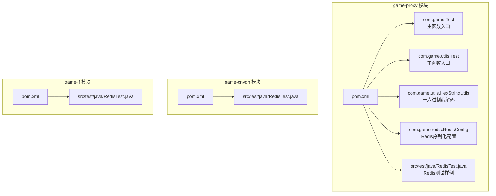
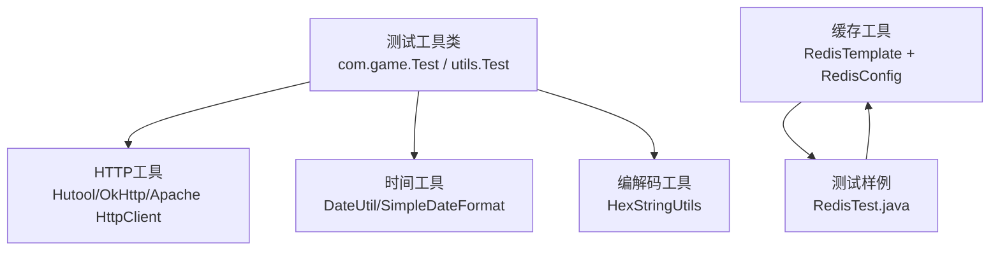
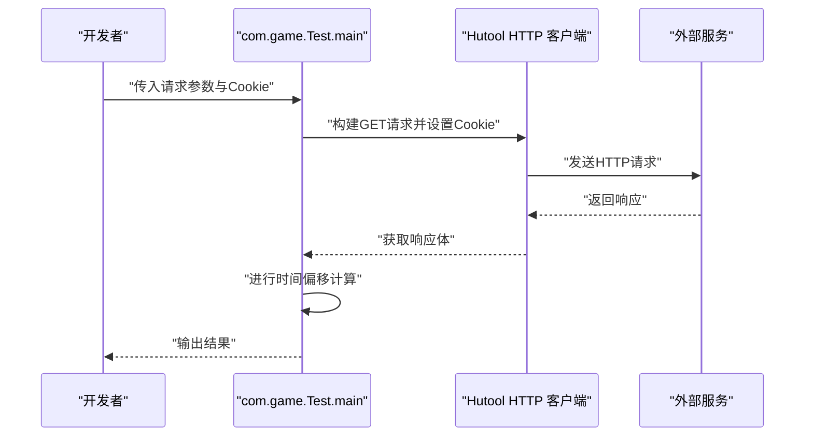
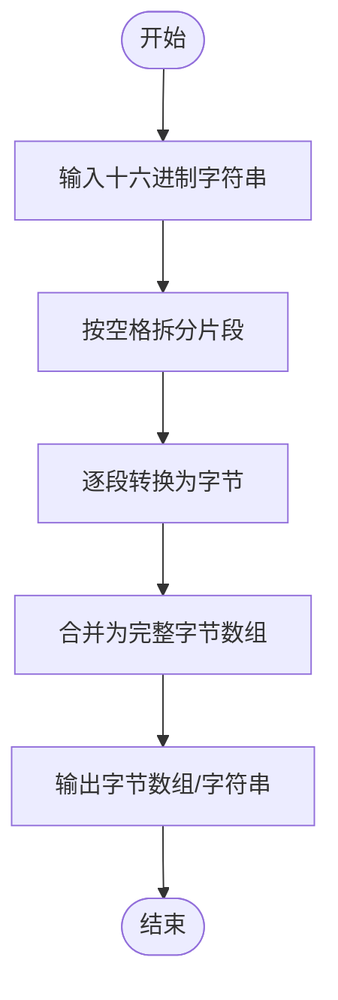
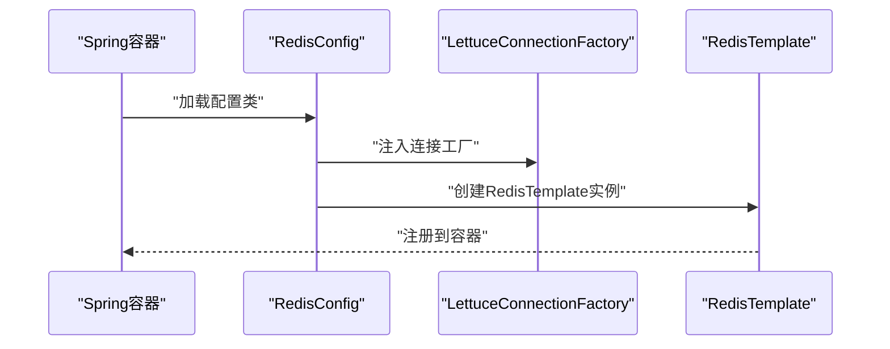
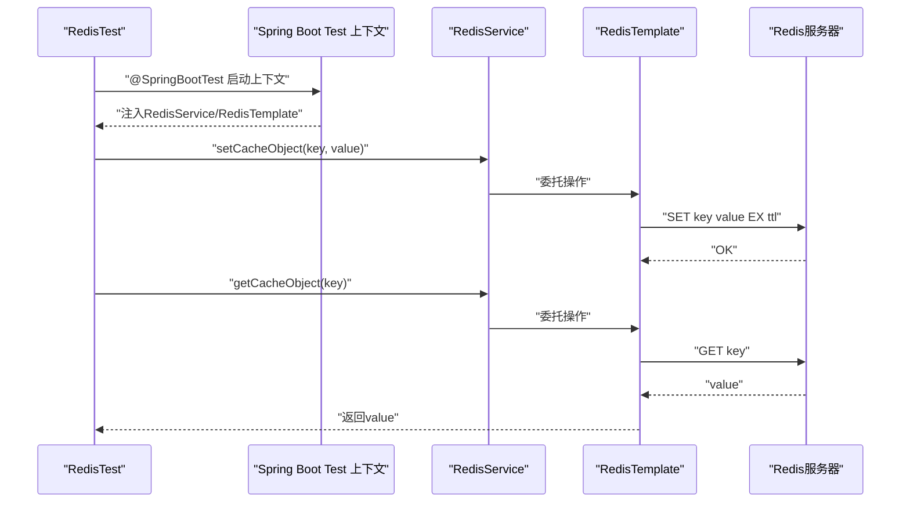
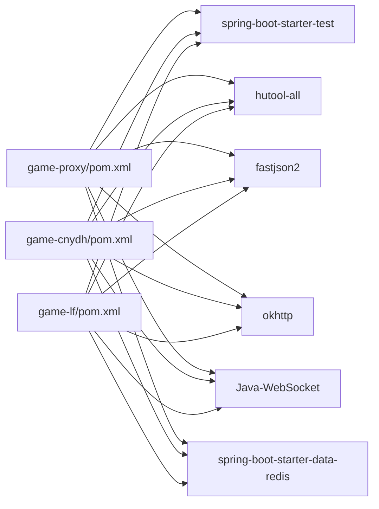

# 测试工具

<cite>
**本文引用的文件**
- [game-proxy/pom.xml](file://game-proxy/pom.xml)
- [game-cnydh/pom.xml](file://game-cnydh/pom.xml)
- [game-lf/pom.xml](file://game-lf/pom.xml)
- [game-proxy/src/main/java/com/game/Test.java](file://game-proxy/src/main/java/com/game/Test.java)
- [game-proxy/src/main/java/com/game/utils/Test.java](file://game-proxy/src/main/java/com/game/utils/Test.java)
- [game-proxy/src/main/java/com/game/utils/HexStringUtils.java](file://game-proxy/src/main/java/com/game/utils/HexStringUtils.java)
- [game-proxy/src/main/java/com/game/redis/RedisConfig.java](file://game-proxy/src/main/java/com/game/redis/RedisConfig.java)
- [game-proxy/src/test/java/RedisTest.java](file://game-proxy/src/test/java/RedisTest.java)
- [game-cnydh/src/test/java/RedisTest.java](file://game-cnydh/src/test/java/RedisTest.java)
- [game-lf/src/test/java/RedisTest.java](file://game-lf/src/test/java/RedisTest.java)
</cite>

## 目录
1. [简介](#简介)
2. [项目结构](#项目结构)
3. [核心组件](#核心组件)
4. [架构总览](#架构总览)
5. [组件详解](#组件详解)
6. [依赖关系分析](#依赖关系分析)
7. [性能考量](#性能考量)
8. [故障排查指南](#故障排查指南)
9. [结论](#结论)
10. [附录](#附录)

## 简介
本文件面向“测试工具”的技术文档目标，系统梳理并说明仓库中与测试相关的工具类、测试用例与基础设施。重点覆盖以下方面：
- 测试工具类的功能与使用方法
- 测试辅助能力（如HTTP请求、日期时间偏移、十六进制编解码等）
- 单元测试与集成测试支持能力与使用场景
- API接口说明、参数规范与最佳实践
- 具体使用示例与提升开发效率与代码质量的建议

## 项目结构
围绕测试主题，本仓库主要由以下部分构成：
- 多模块Maven工程，包含游戏代理、CNYDH、LF等子模块，均引入了Spring Boot测试与常用HTTP工具依赖
- 测试工具类与测试用例集中在game-proxy模块，辅以Redis配置与测试样例
- 各模块的pom.xml统一引入spring-boot-starter-test、hutool、fastjson2、okhttp、websocket等测试与网络相关依赖

图表来源
- [game-proxy/pom.xml](file://game-proxy/pom.xml#L26-L101)
- [game-cnydh/pom.xml](file://game-cnydh/pom.xml#L26-L97)
- [game-lf/pom.xml](file://game-lf/pom.xml#L26-L97)

章节来源
- [game-proxy/pom.xml](file://game-proxy/pom.xml#L1-L163)
- [game-cnydh/pom.xml](file://game-cnydh/pom.xml#L1-L159)
- [game-lf/pom.xml](file://game-lf/pom.xml#L1-L160)

## 核心组件
- 测试工具类与入口
  - com.game.Test：提供HTTP请求、时间计算等测试辅助逻辑的主函数入口
  - com.game.utils.Test：提供十六进制字符串与字节互转的测试辅助逻辑的主函数入口
- 编解码工具
  - com.game.utils.HexStringUtils：提供十六进制字符串与字节数组之间的转换能力
- Redis测试支撑
  - com.game.redis.RedisConfig：提供RedisTemplate的序列化配置，确保键值对正确序列化与反序列化
  - 各模块的RedisTest.java：演示基于Spring Boot Test的Redis读写与过期时间设置等集成测试样例

章节来源
- [game-proxy/src/main/java/com/game/Test.java](file://game-proxy/src/main/java/com/game/Test.java#L15-L52)
- [game-proxy/src/main/java/com/game/utils/Test.java](file://game-proxy/src/main/java/com/game/utils/Test.java#L1-L17)
- [game-proxy/src/main/java/com/game/utils/HexStringUtils.java](file://game-proxy/src/main/java/com/game/utils/HexStringUtils.java#L1-L70)
- [game-proxy/src/main/java/com/game/redis/RedisConfig.java](file://game-proxy/src/main/java/com/game/redis/RedisConfig.java#L1-L29)
- [game-proxy/src/test/java/RedisTest.java](file://game-proxy/src/test/java/RedisTest.java#L1-L95)
- [game-cnydh/src/test/java/RedisTest.java](file://game-cnydh/src/test/java/RedisTest.java#L1-L95)
- [game-lf/src/test/java/RedisTest.java](file://game-lf/src/test/java/RedisTest.java#L1-L95)

## 架构总览
从测试视角看，系统采用“工具类 + 配置 + 测试样例”的分层设计：
- 工具层：提供HTTP请求、时间处理、十六进制编解码等能力
- 基础设施层：通过Redis配置保证缓存访问的一致性与稳定性
- 测试层：通过注解驱动的Spring Boot测试样例验证工具链与外部依赖

图表来源
- [game-proxy/src/main/java/com/game/Test.java](file://game-proxy/src/main/java/com/game/Test.java#L3-L13)
- [game-proxy/src/main/java/com/game/utils/HexStringUtils.java](file://game-proxy/src/main/java/com/game/utils/HexStringUtils.java#L1-L70)
- [game-proxy/src/main/java/com/game/redis/RedisConfig.java](file://game-proxy/src/main/java/com/game/redis/RedisConfig.java#L27-L29)
- [game-proxy/src/test/java/RedisTest.java](file://game-proxy/src/test/java/RedisTest.java#L12-L35)

## 组件详解

### 组件A：测试工具类 com.game.Test
- 功能概述
  - 提供HTTP请求执行能力（示例中包含GET请求与会话Cookie设置）
  - 提供日期时间偏移计算，便于模拟未来或过去的时间点
- 使用场景
  - 快速验证外部服务接口响应
  - 模拟定时任务触发时间点，校验业务逻辑在特定时间窗口的行为
- 关键流程（HTTP请求与时间计算）

图表来源
- [game-proxy/src/main/java/com/game/Test.java](file://game-proxy/src/main/java/com/game/Test.java#L18-L48)

章节来源
- [game-proxy/src/main/java/com/game/Test.java](file://game-proxy/src/main/java/com/game/Test.java#L15-L52)

### 组件B：测试工具类 com.game.utils.Test
- 功能概述
  - 提供十六进制字符串与字节数组之间的转换，便于调试二进制数据或协议报文
- 使用场景
  - 解析或构造十六进制格式的报文数据
  - 调试网络通信或协议解析问题
- 关键流程（十六进制编解码）

图表来源
- [game-proxy/src/main/java/com/game/utils/Test.java](file://game-proxy/src/main/java/com/game/utils/Test.java#L5-L14)
- [game-proxy/src/main/java/com/game/utils/HexStringUtils.java](file://game-proxy/src/main/java/com/game/utils/HexStringUtils.java#L15-L29)

章节来源
- [game-proxy/src/main/java/com/game/utils/Test.java](file://game-proxy/src/main/java/com/game/utils/Test.java#L1-L17)
- [game-proxy/src/main/java/com/game/utils/HexStringUtils.java](file://game-proxy/src/main/java/com/game/utils/HexStringUtils.java#L1-L70)

### 组件C：Redis测试支撑 com.game.redis.RedisConfig
- 功能概述
  - 配置RedisTemplate的序列化策略，确保键为String、值为Object时的正确序列化与反序列化
- 使用场景
  - 在集成测试中稳定地读写Redis缓存，避免因序列化不一致导致的异常
- 关键流程（RedisTemplate Bean装配）

图表来源
- [game-proxy/src/main/java/com/game/redis/RedisConfig.java](file://game-proxy/src/main/java/com/game/redis/RedisConfig.java#L27-L29)

章节来源
- [game-proxy/src/main/java/com/game/redis/RedisConfig.java](file://game-proxy/src/main/java/com/game/redis/RedisConfig.java#L1-L29)

### 组件D：Redis测试样例各模块的RedisTest.java
- 功能概述
  - 展示基于Spring Boot Test的Redis读写、过期时间设置、哈希存储等典型用法
  - 通过注解启用测试上下文，自动装配RedisTemplate与自定义RedisService
- 使用场景
  - 单元测试：验证缓存读写与过期策略
  - 集成测试：验证与真实Redis的交互
- 关键流程（Redis读写与过期）

图表来源
- [game-proxy/src/test/java/RedisTest.java](file://game-proxy/src/test/java/RedisTest.java#L12-L35)
- [game-proxy/src/test/java/RedisTest.java](file://game-proxy/src/test/java/RedisTest.java#L50-L66)
- [game-proxy/src/test/java/RedisTest.java](file://game-proxy/src/test/java/RedisTest.java#L75-L88)

章节来源
- [game-proxy/src/test/java/RedisTest.java](file://game-proxy/src/test/java/RedisTest.java#L1-L95)
- [game-cnydh/src/test/java/RedisTest.java](file://game-cnydh/src/test/java/RedisTest.java#L1-L95)
- [game-lf/src/test/java/RedisTest.java](file://game-lf/src/test/java/RedisTest.java#L1-L95)

## 依赖关系分析
- Maven依赖
  - spring-boot-starter-test：提供JUnit、Mockito、AssertJ等测试能力
  - hutool：提供HTTP请求、日期时间等便捷工具
  - fastjson2：JSON解析与生成
  - okhttp：HTTP客户端（可选）
  - Java-WebSocket：WebSocket客户端（可选）
  - spring-boot-starter-data-redis：Redis访问与连接池
- 模块间关系
  - game-proxy作为核心模块，提供测试工具与Redis配置；game-cnydh与game-lf作为独立模块，复用相同测试依赖与Redis测试样例

图表来源
- [game-proxy/pom.xml](file://game-proxy/pom.xml#L26-L101)
- [game-cnydh/pom.xml](file://game-cnydh/pom.xml#L26-L97)
- [game-lf/pom.xml](file://game-lf/pom.xml#L26-L97)

章节来源
- [game-proxy/pom.xml](file://game-proxy/pom.xml#L1-L163)
- [game-cnydh/pom.xml](file://game-cnydh/pom.xml#L1-L159)
- [game-lf/pom.xml](file://game-lf/pom.xml#L1-L160)

## 性能考量
- HTTP请求
  - 使用Hutool或OkHttp进行HTTP调用时，建议复用连接与线程池，避免频繁创建连接带来的开销
  - 对于批量请求，考虑并发控制与超时设置，防止阻塞
- Redis访问
  - 合理设置过期时间，避免缓存无限增长
  - 使用Pipeline或事务减少网络往返次数（在支持范围内）
- 时间计算
  - 使用DateUtil进行时间偏移，避免手动换算导致的误差与性能损耗

## 故障排查指南
- Redis序列化异常
  - 现象：读取缓存时报错或返回乱码
  - 排查：确认RedisConfig中是否正确配置了StringRedisSerializer与GenericJackson2JsonRedisSerializer
  - 参考路径：[RedisConfig](file://game-proxy/src/main/java/com/game/redis/RedisConfig.java#L27-L29)
- 测试未启动Spring上下文
  - 现象：@Autowired失败
  - 排查：确认测试类使用了@SpringBootTest并指定了正确的应用入口类
  - 参考路径：[RedisTest](file://game-proxy/src/test/java/RedisTest.java#L12-L35)
- 十六进制转换异常
  - 现象：转换抛出空指针或非法字符
  - 排查：检查输入字符串格式，确保仅包含合法十六进制字符且长度为偶数
  - 参考路径：[HexStringUtils](file://game-proxy/src/main/java/com/game/utils/HexStringUtils.java#L15-L29)

章节来源
- [game-proxy/src/main/java/com/game/redis/RedisConfig.java](file://game-proxy/src/main/java/com/game/redis/RedisConfig.java#L1-L29)
- [game-proxy/src/test/java/RedisTest.java](file://game-proxy/src/test/java/RedisTest.java#L12-L35)
- [game-proxy/src/main/java/com/game/utils/HexStringUtils.java](file://game-proxy/src/main/java/com/game/utils/HexStringUtils.java#L15-L29)

## 结论
本仓库的测试工具以“轻量、实用”为核心设计原则，结合HTTP工具、时间工具与十六进制编解码工具，形成一套可快速验证外部接口与协议解析的测试能力；同时通过Redis配置与测试样例，提供稳定的缓存访问与验证手段。建议在实际开发中：
- 将测试工具类与测试样例纳入CI流程，确保关键路径持续受检
- 对HTTP与Redis访问增加重试与降级策略，提升稳定性
- 在团队内推广测试样例模板，统一测试风格与断言规范

## 附录
- API与参数规范（以路径引用代替具体代码）
  - HTTP请求工具
    - 入口类：[com.game.Test](file://game-proxy/src/main/java/com/game/Test.java#L15-L52)
    - 参数要点：请求URL、Cookie、超时、重试策略（建议）
  - 十六进制编解码
    - 工具类：[com.game.utils.HexStringUtils](file://game-proxy/src/main/java/com/game/utils/HexStringUtils.java#L1-L70)
    - 输入：十六进制字符串（允许空格分隔）
    - 输出：字节数组或拼接后的十六进制字符串
  - Redis配置
    - 配置类：[com.game.redis.RedisConfig](file://game-proxy/src/main/java/com/game/redis/RedisConfig.java#L1-L29)
    - 关键点：Key使用String序列化，Value使用JSON序列化
  - Redis测试样例
    - 示例类：[game-proxy RedisTest](file://game-proxy/src/test/java/RedisTest.java#L1-L95)，[game-cnydh RedisTest](file://game-cnydh/src/test/java/RedisTest.java#L1-L95)，[game-lf RedisTest](file://game-lf/src/test/java/RedisTest.java#L1-L95)
    - 场景：字符串、哈希、过期时间设置与读取
- 最佳实践
  - 使用@SpringBootTest标注测试类，确保Spring上下文可用
  - 对外部依赖（HTTP/Redis）设置合理超时与重试
  - 将测试工具类与测试样例文档化，便于团队复用与维护