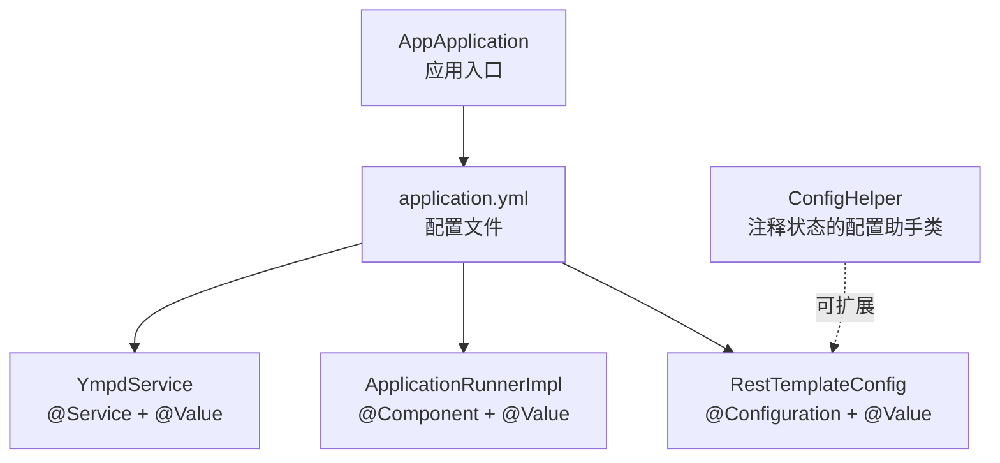
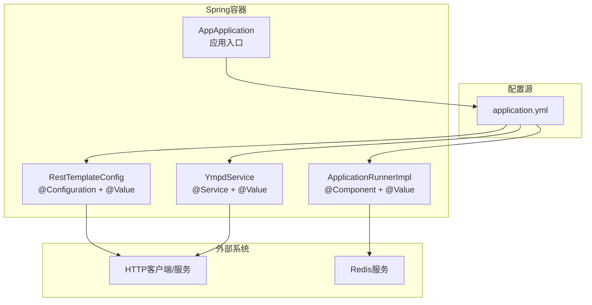
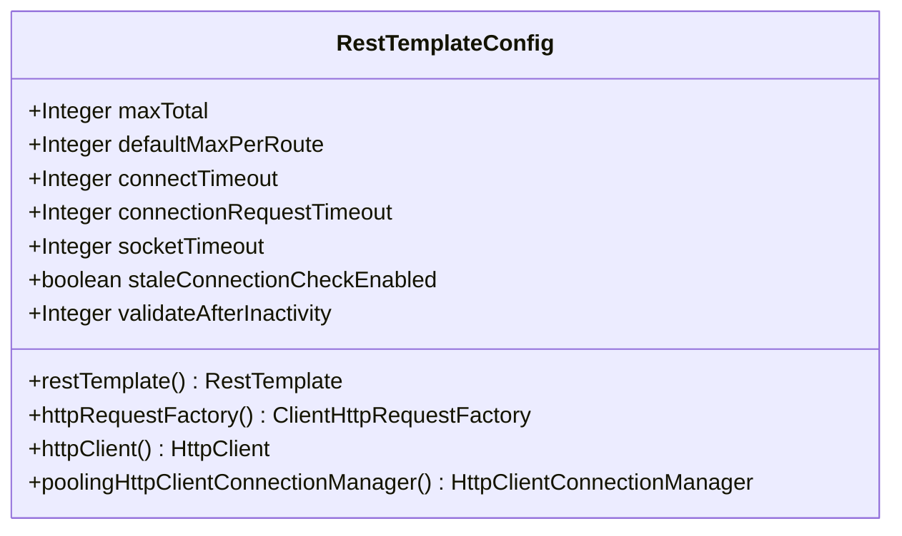
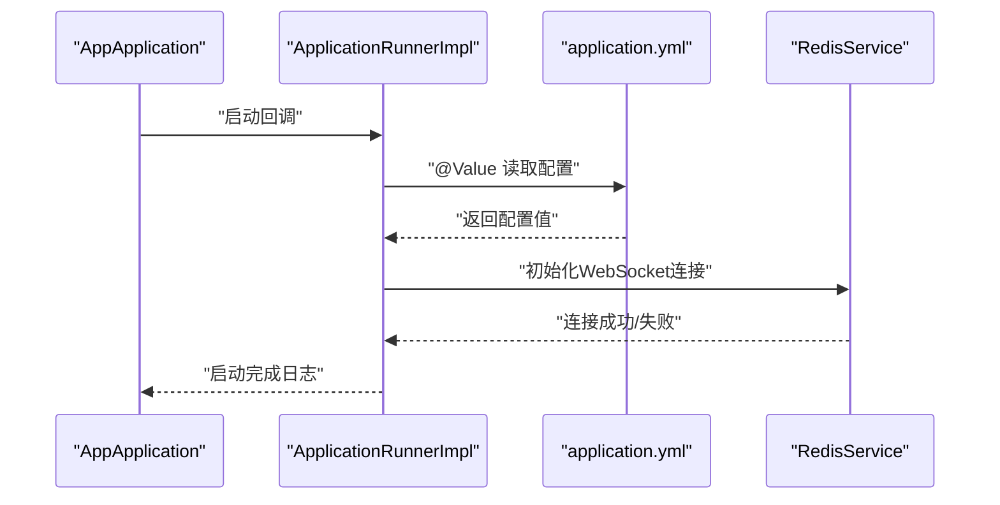
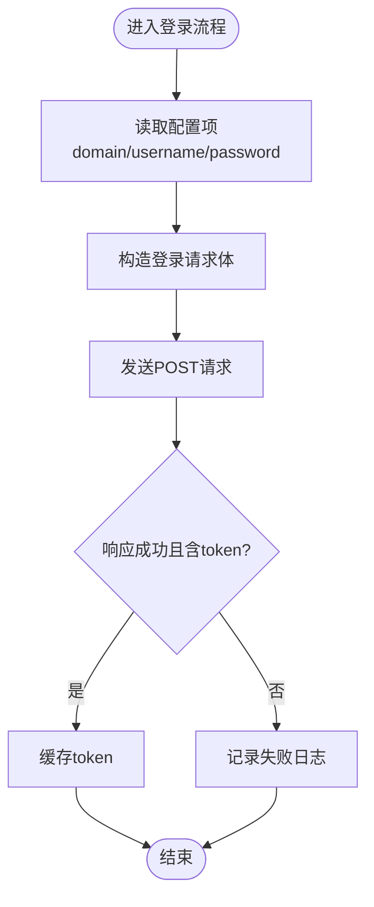
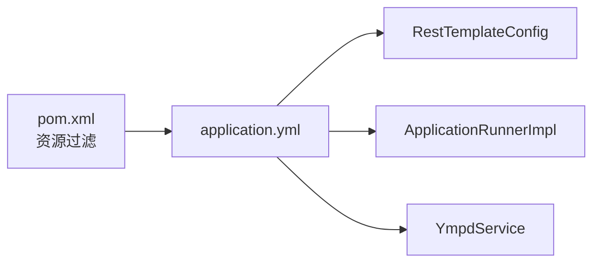

# 配置管理工具

<cite>
**本文引用的文件**
- [ConfigHelper.java](file://game-proxy/src/main/java/com/game/utils/ConfigHelper.java)
- [application.yml](file://game-proxy/src/main/resources/application.yml)
- [RestTemplateConfig.java](file://game-proxy/src/main/java/com/game/commom/RestTemplateConfig.java)
- [ApplicationRunnerImpl.java](file://game-proxy/src/main/java/com/game/listener/ApplicationRunnerImpl.java)
- [YmpdService.java](file://game-proxy/src/main/java/com/game/ympd/YmpdService.java)
- [AppApplication.java](file://game-proxy/src/main/java/com/game/AppApplication.java)
- [pom.xml](file://game-proxy/pom.xml)
</cite>

## 目录
1. [简介](#简介)
2. [项目结构](#项目结构)
3. [核心组件](#核心组件)
4. [架构总览](#架构总览)
5. [详细组件分析](#详细组件分析)
6. [依赖分析](#依赖分析)
7. [性能考虑](#性能考虑)
8. [故障排查指南](#故障排查指南)
9. [结论](#结论)
10. [附录](#附录)

## 简介
本技术文档围绕配置管理工具展开，重点介绍ConfigHelper配置助手类的功能与使用方法，系统性说明配置文件的加载机制、配置项的读取与设置方式、配置变更的监听与通知机制。同时，结合代码库中的实际实现，解释配置管理的设计原理与实现细节（如配置文件解析、验证与缓存策略），并提供API接口说明、参数规范与返回值格式，以及具体使用示例与最佳实践，帮助开发者在不同业务场景下正确、安全地使用配置管理能力。

## 项目结构
该仓库包含多个子模块，其中与配置管理直接相关的核心文件位于game-proxy模块中：
- 配置文件：application.yml（YAML格式）
- 配置读取示例：RestTemplateConfig、ApplicationRunnerImpl、YmpdService等
- 配置辅助类：ConfigHelper（当前处于注释状态，未启用）

图表来源
- [application.yml](file://game-proxy/src/main/resources/application.yml#L1-L58)
- [RestTemplateConfig.java](file://game-proxy/src/main/java/com/game/commom/RestTemplateConfig.java#L34-L54)
- [ApplicationRunnerImpl.java](file://game-proxy/src/main/java/com/game/listener/ApplicationRunnerImpl.java#L37-L47)
- [YmpdService.java](file://game-proxy/src/main/java/com/game/ympd/YmpdService.java#L21-L26)
- [ConfigHelper.java](file://game-proxy/src/main/java/com/game/utils/ConfigHelper.java#L1-L22)
- [AppApplication.java](file://game-proxy/src/main/java/com/game/AppApplication.java#L24-L31)

章节来源
- [application.yml](file://game-proxy/src/main/resources/application.yml#L1-L58)
- [pom.xml](file://game-proxy/pom.xml#L105-L110)

## 核心组件
- 配置文件加载与解析
  - Spring Boot通过资源过滤机制加载application.yml，支持占位符与环境变量替换。
  - Maven资源插件开启过滤，允许在构建阶段进行占位符替换。
- 配置读取与注入
  - 使用@Component、@Service、@Configuration等注解的类中，通过@Value读取配置项。
  - 支持基本类型、字符串、布尔值等常见类型注入。
- 配置变更监听与通知
  - 当前代码库未实现配置动态刷新或监听机制；建议采用Spring Cloud Config或自定义监听方案。
- 缓存策略
  - @Value注入的配置默认缓存在Spring容器中，随应用启动加载，运行期不自动刷新。

章节来源
- [application.yml](file://game-proxy/src/main/resources/application.yml#L1-L58)
- [RestTemplateConfig.java](file://game-proxy/src/main/java/com/game/commom/RestTemplateConfig.java#L34-L54)
- [ApplicationRunnerImpl.java](file://game-proxy/src/main/java/com/game/listener/ApplicationRunnerImpl.java#L37-L47)
- [YmpdService.java](file://game-proxy/src/main/java/com/game/ympd/YmpdService.java#L21-L26)
- [pom.xml](file://game-proxy/pom.xml#L105-L110)

## 架构总览
下图展示了配置管理在系统中的位置与交互关系：

图表来源
- [application.yml](file://game-proxy/src/main/resources/application.yml#L1-L58)
- [RestTemplateConfig.java](file://game-proxy/src/main/java/com/game/commom/RestTemplateConfig.java#L34-L54)
- [ApplicationRunnerImpl.java](file://game-proxy/src/main/java/com/game/listener/ApplicationRunnerImpl.java#L37-L47)
- [YmpdService.java](file://game-proxy/src/main/java/com/game/ympd/YmpdService.java#L21-L26)
- [AppApplication.java](file://game-proxy/src/main/java/com/game/AppApplication.java#L24-L31)

## 详细组件分析

### ConfigHelper配置助手类
- 当前状态
  - ConfigHelper类以注释形式存在，未启用@Component、@Value等注解，因此不会被Spring扫描与实例化。
- 设计建议（基于现有代码风格）
  - 若需实现配置助手类，建议：
    - 使用@Component或@Configuration类，结合@Value读取配置项。
    - 将读取到的配置封装为静态字段或受管Bean，便于全局访问。
    - 在@PostConstruct中完成初始化与校验。
    - 如需动态刷新，结合@RefreshScope或自定义监听器。
- 适用场景
  - 统一读取与缓存关键配置，避免分散注入带来的重复代码。
  - 提供类型安全的配置访问方法，增强可维护性。

章节来源
- [ConfigHelper.java](file://game-proxy/src/main/java/com/game/utils/ConfigHelper.java#L1-L22)

### RestTemplateConfig配置读取
- 功能概述
  - 通过@Value读取application.yml中的HTTP连接池与超时配置，构建RestTemplate与底层HttpClient。
- 关键点
  - 配置项：http.maxTotal、http.defaultMaxPerRoute、http.connectTimeout、http.connectionRequestTimeout、http.socketTimeout、http.staleConnectionCheckEnabled、http.validateAfterInactivity。
  - 注入后用于设置连接池大小、路由并发限制、超时策略等。
- 复杂度与性能
  - 初始化复杂度主要集中在连接池与请求配置构建，属于O(1)初始化成本。
  - 性能优化建议：根据业务QPS调整连接池大小与超时参数，避免过度占用资源。

图表来源
- [RestTemplateConfig.java](file://game-proxy/src/main/java/com/game/commom/RestTemplateConfig.java#L34-L54)
- [RestTemplateConfig.java](file://game-proxy/src/main/java/com/game/commom/RestTemplateConfig.java#L62-L129)

章节来源
- [RestTemplateConfig.java](file://game-proxy/src/main/java/com/game/commom/RestTemplateConfig.java#L34-L54)
- [RestTemplateConfig.java](file://game-proxy/src/main/java/com/game/commom/RestTemplateConfig.java#L62-L129)
- [application.yml](file://game-proxy/src/main/resources/application.yml#L44-L57)

### ApplicationRunnerImpl配置读取
- 功能概述
  - 启动时通过@Value读取manxiang.session与manxiang.phone相关配置，用于初始化各业务模块。
- 关键点
  - 配置项：manxiang.session.gcbwz、manxiang.session.ylbwz、manxiang.phone.ylbwz（注意：配置文件中手机号键名为ylbwz，代码中存在重复键名引用）。
  - 与RedisService协作，启动WebSocket客户端连接。
- 复杂度与性能
  - 启动阶段一次性读取，初始化成本低；运行期仅按需使用。

图表来源
- [ApplicationRunnerImpl.java](file://game-proxy/src/main/java/com/game/listener/ApplicationRunnerImpl.java#L37-L47)
- [ApplicationRunnerImpl.java](file://game-proxy/src/main/java/com/game/listener/ApplicationRunnerImpl.java#L147-L163)
- [application.yml](file://game-proxy/src/main/resources/application.yml#L31-L41)

章节来源
- [ApplicationRunnerImpl.java](file://game-proxy/src/main/java/com/game/listener/ApplicationRunnerImpl.java#L37-L47)
- [ApplicationRunnerImpl.java](file://game-proxy/src/main/java/com/game/listener/ApplicationRunnerImpl.java#L147-L163)
- [application.yml](file://game-proxy/src/main/resources/application.yml#L31-L41)

### YmpdService配置读取
- 功能概述
  - 通过@Value读取ympd.domain、ympd.userName、ympd.password，用于登录与后续接口调用。
- 关键点
  - 配置项：ympd.domain、ympd.userName、ympd.password。
  - 登录成功后缓存token，供其他服务复用。
- 复杂度与性能
  - 登录流程为O(1)，token缓存减少重复登录开销。

图表来源
- [YmpdService.java](file://game-proxy/src/main/java/com/game/ympd/YmpdService.java#L21-L26)
- [YmpdService.java](file://game-proxy/src/main/java/com/game/ympd/YmpdService.java#L33-L56)

章节来源
- [YmpdService.java](file://game-proxy/src/main/java/com/game/ympd/YmpdService.java#L21-L26)
- [YmpdService.java](file://game-proxy/src/main/java/com/game/ympd/YmpdService.java#L33-L56)
- [application.yml](file://game-proxy/src/main/resources/application.yml#L38-L41)

### 配置文件解析与验证
- 解析机制
  - YAML键值对解析为Spring Environment中的属性，支持层级结构（如manxiang.session.gcbwz）。
- 验证策略
  - 当前代码库未见显式配置校验逻辑；建议在@PostConstruct中添加参数合法性检查与默认值处理。
- 缓存策略
  - @Value注入的配置在Spring容器中缓存，随应用启动加载，运行期不自动刷新。

章节来源
- [application.yml](file://game-proxy/src/main/resources/application.yml#L31-L41)
- [application.yml](file://game-proxy/src/main/resources/application.yml#L38-L41)
- [application.yml](file://game-proxy/src/main/resources/application.yml#L44-L57)

## 依赖分析
- 模块依赖
  - game-proxy模块通过Maven资源过滤启用占位符替换，确保配置文件在构建阶段完成变量替换。
- 组件耦合
  - RestTemplateConfig、ApplicationRunnerImpl、YmpdService均通过@Value依赖application.yml，形成松耦合的配置驱动设计。
- 循环依赖
  - 当前组件间不存在循环依赖风险。

图表来源
- [pom.xml](file://game-proxy/pom.xml#L105-L110)
- [application.yml](file://game-proxy/src/main/resources/application.yml#L1-L58)
- [RestTemplateConfig.java](file://game-proxy/src/main/java/com/game/commom/RestTemplateConfig.java#L34-L54)
- [ApplicationRunnerImpl.java](file://game-proxy/src/main/java/com/game/listener/ApplicationRunnerImpl.java#L37-L47)
- [YmpdService.java](file://game-proxy/src/main/java/com/game/ympd/YmpdService.java#L21-L26)

章节来源
- [pom.xml](file://game-proxy/pom.xml#L105-L110)

## 性能考虑
- 连接池与超时参数
  - 合理设置http.maxTotal、http.defaultMaxPerRoute、http.socketTimeout等参数，避免高并发下的连接争用与超时。
- 启动时初始化
  - @Value注入在启动阶段完成，避免运行期频繁I/O。
- 缓存与复用
  - 对于登录token等结果进行缓存，减少重复请求。

## 故障排查指南
- 配置读取失败
  - 检查application.yml键名拼写与层级是否匹配@Value注解。
  - 确认Maven资源过滤已启用，构建产物中占位符已被替换。
- 类型不匹配
  - @Value注入要求类型兼容，若出现转换异常，检查配置值类型与目标字段类型。
- 启动顺序问题
  - 若依赖Redis或网络服务，请在@PostConstruct中增加重试与降级逻辑。

章节来源
- [application.yml](file://game-proxy/src/main/resources/application.yml#L31-L41)
- [application.yml](file://game-proxy/src/main/resources/application.yml#L38-L41)
- [application.yml](file://game-proxy/src/main/resources/application.yml#L44-L57)
- [pom.xml](file://game-proxy/pom.xml#L105-L110)

## 结论
本项目采用Spring Boot标准的@Value配置注入方式，配合application.yml实现集中化配置管理。当前未实现配置动态刷新与统一监听机制，建议在生产环境中引入Spring Cloud Config或自定义监听器，以满足配置热更新与变更通知需求。通过合理的连接池与超时参数、启动时初始化与结果缓存，可有效提升系统性能与稳定性。

## 附录

### API接口说明（基于现有实现）
- RestTemplateConfig
  - 作用：提供RestTemplate与HttpClient的Bean，内部通过@Value读取HTTP连接池与超时配置。
  - 参数：无显式方法参数，依赖application.yml中的http.*配置。
  - 返回值：RestTemplate、ClientHttpRequestFactory、HttpClient、HttpClientConnectionManager。
- ApplicationRunnerImpl
  - 作用：应用启动时读取会话与手机号配置，初始化WebSocket连接。
  - 参数：无显式方法参数，依赖application.yml中的manxiang.*配置。
  - 返回值：void。
- YmpdService
  - 作用：读取ympd.*配置，执行登录并缓存token。
  - 参数：无显式方法参数，依赖application.yml中的ympd.*配置。
  - 返回值：登录成功后的token（通过getToken获取）。

章节来源
- [RestTemplateConfig.java](file://game-proxy/src/main/java/com/game/commom/RestTemplateConfig.java#L62-L129)
- [ApplicationRunnerImpl.java](file://game-proxy/src/main/java/com/game/listener/ApplicationRunnerImpl.java#L147-L163)
- [YmpdService.java](file://game-proxy/src/main/java/com/game/ympd/YmpdService.java#L79-L82)

### 使用示例与最佳实践
- 示例一：读取HTTP连接池配置
  - 在配置文件中设置http.maxTotal、http.defaultMaxPerRoute等键值。
  - 在类中使用@Value注入对应字段，用于初始化连接池。
- 示例二：读取业务配置
  - 在配置文件中设置ympd.domain、ympd.userName、ympd.password。
  - 在服务类中使用@Value注入，完成登录与token缓存。
- 示例三：启动时读取会话配置
  - 在配置文件中设置manxiang.session与manxiang.phone相关键值。
  - 在ApplicationRunnerImpl中使用@Value注入，初始化WebSocket客户端。
- 最佳实践
  - 明确配置键命名规范，避免同名键冲突。
  - 在@PostConstruct中进行参数校验与默认值处理。
  - 对关键配置进行分组管理，便于维护与审计。
  - 如需动态刷新，引入配置中心或自定义监听器。

章节来源
- [application.yml](file://game-proxy/src/main/resources/application.yml#L31-L41)
- [application.yml](file://game-proxy/src/main/resources/application.yml#L38-L41)
- [application.yml](file://game-proxy/src/main/resources/application.yml#L44-L57)
- [RestTemplateConfig.java](file://game-proxy/src/main/java/com/game/commom/RestTemplateConfig.java#L34-L54)
- [YmpdService.java](file://game-proxy/src/main/java/com/game/ympd/YmpdService.java#L21-L26)
- [ApplicationRunnerImpl.java](file://game-proxy/src/main/java/com/game/listener/ApplicationRunnerImpl.java#L37-L47)