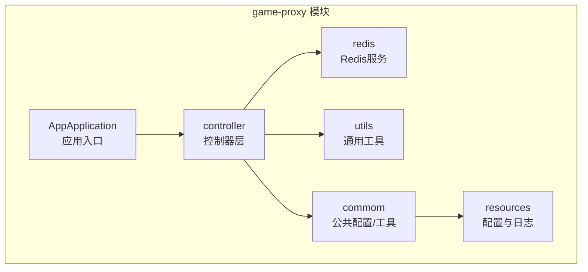
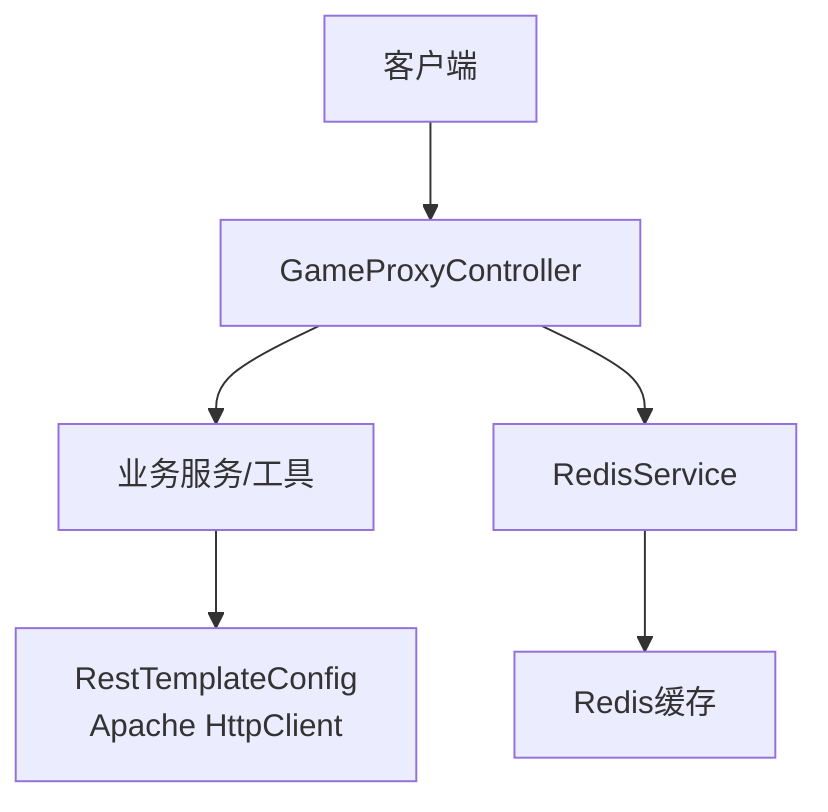
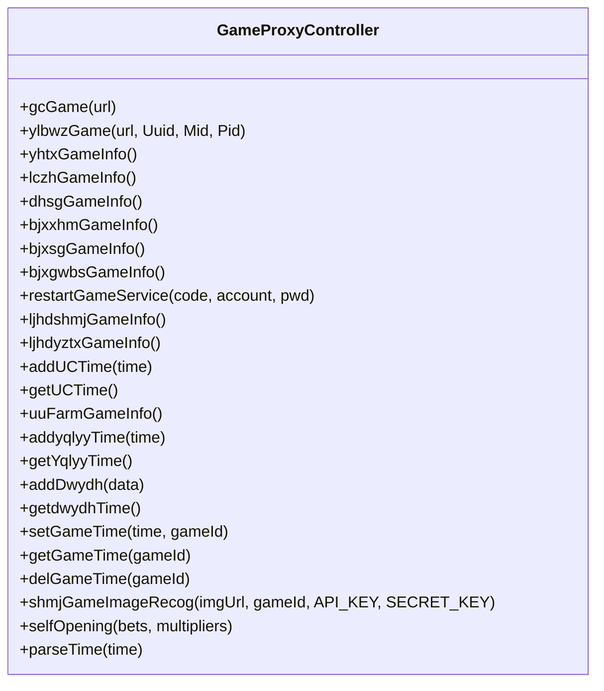
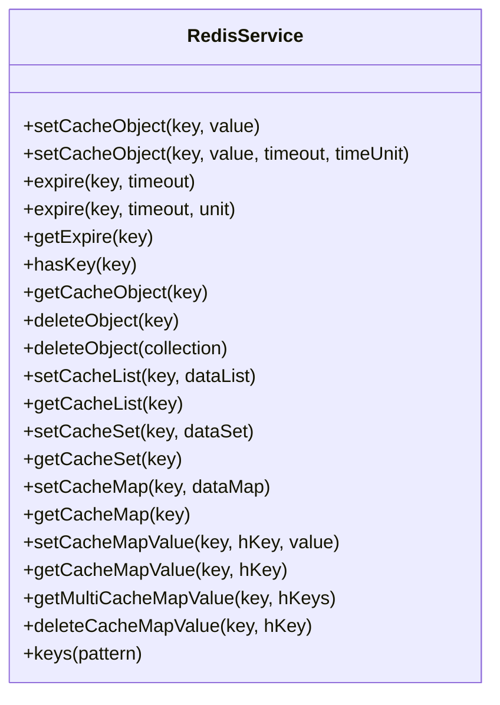
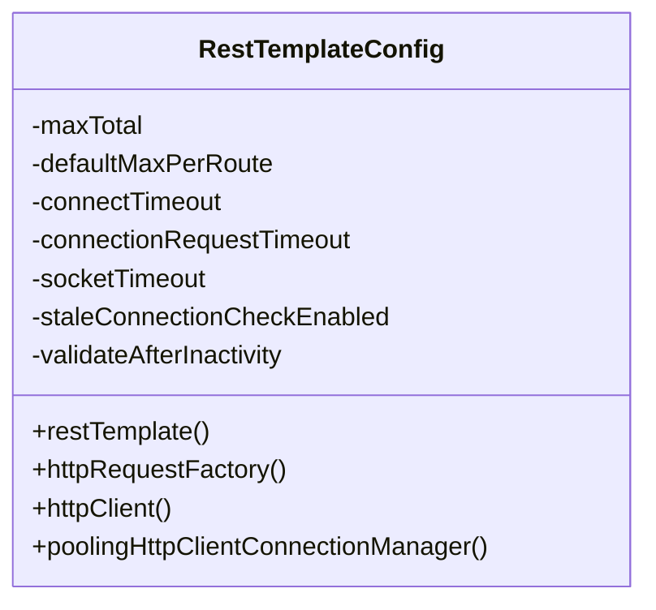
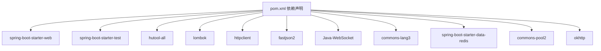

# 代码规范与约定

<cite>
**本文引用的文件**
- [AppApplication.java](file://game-proxy/src/main/java/com/game/AppApplication.java)
- [Constants.java](file://game-proxy/src/main/java/com/game/commom/Constants.java)
- [pom.xml](file://game-proxy/pom.xml)
- [application.yml](file://game-proxy/src/main/resources/application.yml)
- [logback.xml](file://game-proxy/src/main/resources/logback.xml)
- [GameProxyController.java](file://game-proxy/src/main/java/com/game/controller/GameProxyController.java)
- [SpringUtils.java](file://game-proxy/src/main/java/com/game/utils/SpringUtils.java)
- [RedisService.java](file://game-proxy/src/main/java/com/game/redis/RedisService.java)
- [RestTemplateConfig.java](file://game-proxy/src/main/java/com/game/commom/RestTemplateConfig.java)
- [DomainNameUtil.java](file://game-proxy/src/main/java/com/game/utils/DomainNameUtil.java)
- [BjhUtil.java](file://game-proxy/src/main/java/com/game/utils/BjhUtil.java)
- [RedisTest.java](file://game-proxy/src/test/java/RedisTest.java)
</cite>

## 目录
1. 引言
2. 项目结构
3. 核心组件
4. 架构总览
5. 详细组件分析
6. 依赖分析
7. 性能考虑
8. 故障排查指南
9. 结论
10. 附录

## 引言
本规范旨在为游戏代理系统提供统一、可执行的代码规范与开发约定，覆盖Java编码风格、注释规范、异常处理、日志记录、接口设计、常量与配置管理、单元测试与代码审查等方面。规范以现有代码库为基础，结合最佳实践，形成可落地的质量标准。

## 项目结构
项目采用多模块Maven结构，核心模块为game-proxy，包含控制器、业务服务、工具类、配置与资源文件。整体采用Spring Boot框架，集成Redis、HTTP客户端、WebSocket等能力。

图表来源
- [AppApplication.java](file://game-proxy/src/main/java/com/game/AppApplication.java#L1-L33)
- [GameProxyController.java](file://game-proxy/src/main/java/com/game/controller/GameProxyController.java#L1-L436)
- [RedisService.java](file://game-proxy/src/main/java/com/game/redis/RedisService.java#L1-L244)
- [RestTemplateConfig.java](file://game-proxy/src/main/java/com/game/commom/RestTemplateConfig.java#L1-L132)
- [application.yml](file://game-proxy/src/main/resources/application.yml#L1-L58)
- [logback.xml](file://game-proxy/src/main/resources/logback.xml#L1-L75)

章节来源
- [pom.xml](file://game-proxy/pom.xml#L1-L163)

## 核心组件
- 应用入口与启动：应用入口负责启动Spring Boot并输出访问信息，启用调度功能。
- 控制器层：集中暴露代理接口，封装HTTP转发、Redis读写、定时任务触发等。
- Redis服务：封装RedisTemplate常用操作，提供泛型支持与多种数据结构操作。
- HTTP客户端配置：基于Apache HttpClient的连接池与超时策略配置，统一RestTemplate工厂。
- 工具类：提供Spring上下文获取、域名列表、业务辅助等。

章节来源
- [AppApplication.java](file://game-proxy/src/main/java/com/game/AppApplication.java#L1-L33)
- [GameProxyController.java](file://game-proxy/src/main/java/com/game/controller/GameProxyController.java#L1-L436)
- [RedisService.java](file://game-proxy/src/main/java/com/game/redis/RedisService.java#L1-L244)
- [RestTemplateConfig.java](file://game-proxy/src/main/java/com/game/commom/RestTemplateConfig.java#L1-L132)
- [SpringUtils.java](file://game-proxy/src/main/java/com/game/utils/SpringUtils.java#L1-L103)
- [DomainNameUtil.java](file://game-proxy/src/main/java/com/game/utils/DomainNameUtil.java#L1-L16)

## 架构总览
系统采用“控制器-服务-存储”分层架构，控制器负责请求接入与参数校验，服务层负责业务编排，存储层通过Redis提供高性能缓存与会话管理。

图表来源
- [GameProxyController.java](file://game-proxy/src/main/java/com/game/controller/GameProxyController.java#L1-L436)
- [RedisService.java](file://game-proxy/src/main/java/com/game/redis/RedisService.java#L1-L244)
- [RestTemplateConfig.java](file://game-proxy/src/main/java/com/game/commom/RestTemplateConfig.java#L1-L132)

## 详细组件分析

### 控制器层规范
- 类命名：采用名词短语+Controller后缀，如GameProxyController。
- 方法命名：动宾结构，清晰表达意图，如gcGame、ylbwzGame、yhtxGameInfo等。
- 参数传递：优先使用@RequestParam/@RequestBody，避免魔法字符串；对敏感参数进行脱敏或限制长度。
- 返回值处理：统一返回String或JSON字符串，便于跨域与前端解析；必要时封装统一响应体。
- 注释规范：类注释包含作者、日期；方法注释包含功能、参数、返回值说明；示例见GameProxyController。

图表来源
- [GameProxyController.java](file://game-proxy/src/main/java/com/game/controller/GameProxyController.java#L1-L436)

章节来源
- [GameProxyController.java](file://game-proxy/src/main/java/com/game/controller/GameProxyController.java#L30-L436)

### Redis服务层规范
- 类命名：RedisService，职责单一，封装Redis常用操作。
- 泛型与异常：使用泛型提升类型安全；对异常进行捕获与日志记录，避免吞异常。
- 数据结构：提供String、List、Set、Hash等常见结构的读写封装，统一key命名规范。
- 超时与过期：支持设置过期时间，避免缓存无限增长。

图表来源
- [RedisService.java](file://game-proxy/src/main/java/com/game/redis/RedisService.java#L1-L244)

章节来源
- [RedisService.java](file://game-proxy/src/main/java/com/game/redis/RedisService.java#L13-L244)

### HTTP客户端与连接池配置
- 统一配置：RestTemplateConfig集中配置连接池、超时、重试与默认头。
- 连接池参数：最大连接数、路由并发、连接超时、套接字超时、空闲校验等。
- 默认头：User-Agent、Accept-Encoding、Accept-Language、Connection、Content-Type等。

图表来源
- [RestTemplateConfig.java](file://game-proxy/src/main/java/com/game/commom/RestTemplateConfig.java#L1-L132)

章节来源
- [RestTemplateConfig.java](file://game-proxy/src/main/java/com/game/commom/RestTemplateConfig.java#L27-L132)
- [application.yml](file://game-proxy/src/main/resources/application.yml#L44-L57)

### 工具类与常量
- SpringUtils：提供非Spring管理环境下获取Bean的能力，支持类型与名称获取、AOP代理获取。
- Constants：集中定义常量，如API地址等，建议按模块拆分并增加注释说明用途。
- DomainNameUtil：维护目标域名数组，便于批量推送或轮询。
- BjhUtil：业务辅助类，建议补充注释与职责说明。

章节来源
- [SpringUtils.java](file://game-proxy/src/main/java/com/game/utils/SpringUtils.java#L10-L103)
- [Constants.java](file://game-proxy/src/main/java/com/game/commom/Constants.java#L1-L14)
- [DomainNameUtil.java](file://game-proxy/src/main/java/com/game/utils/DomainNameUtil.java#L1-L16)
- [BjhUtil.java](file://game-proxy/src/main/java/com/game/utils/BjhUtil.java#L1-L10)

### 日志与配置
- 日志格式：包含时间、线程、级别、Logger名、方法与行号、消息。
- 日志级别：INFO用于常规业务日志，WARN用于限流与警告，ERROR用于异常。
- 配置文件：application.yml集中管理服务器端口、Redis连接、HTTP客户端参数、业务开关等。

章节来源
- [logback.xml](file://game-proxy/src/main/resources/logback.xml#L1-L75)
- [application.yml](file://game-proxy/src/main/resources/application.yml#L1-L58)

## 依赖分析
- Maven依赖：Spring Web、Test、Hutool、Lombok、HttpClient、Fastjson2、WebSocket、Commons Lang3、Redis Starter、OkHttp等。
- 插件：maven-resources-plugin、maven-compiler-plugin、spring-boot-maven-plugin。
- 版本与编码：统一UTF-8编码，JDK 1.8，Spring Boot 2.2.13。

图表来源
- [pom.xml](file://game-proxy/pom.xml#L26-L100)

章节来源
- [pom.xml](file://game-proxy/pom.xml#L11-L163)

## 性能考虑
- 连接池与超时：合理设置HTTP连接池大小与超时参数，避免阻塞与资源浪费。
- Redis缓存：对热点数据设置合理过期时间，避免内存膨胀；批量操作使用Pipeline或批量命令。
- 接口限流：对高频接口增加限流策略，防止下游压力过大。
- 日志级别：生产环境避免过多DEBUG/INFO日志，降低I/O开销。

## 故障排查指南
- 启动日志：关注应用启动完成后的访问URL与Swagger地址，确认端口与上下文路径。
- Redis连接：核对host、port、password、database、timeout等配置，确保Redis可用。
- HTTP异常：关注RestClientException与通用异常日志，定位上游接口问题。
- 图片识别：当识别结果为空时，检查输入URL与鉴权参数，查看限流与错误日志。

章节来源
- [AppApplication.java](file://game-proxy/src/main/java/com/game/AppApplication.java#L24-L31)
- [application.yml](file://game-proxy/src/main/resources/application.yml#L15-L31)
- [GameProxyController.java](file://game-proxy/src/main/java/com/game/controller/GameProxyController.java#L386-L407)

## 结论
本规范以现有代码库为基础，明确了命名、注释、异常、日志、接口设计、常量与配置、测试与审查等方面的约定。建议在后续迭代中逐步完善注释与测试覆盖率，并持续优化性能与稳定性。

## 附录

### Java编码规范
- 包命名：采用反向域名+功能层次，如com.game.controller。
- 类命名：采用名词或复合词，首字母大写；接口以形容词或名词结尾，如Service、Repository。
- 方法命名：动宾结构，清晰表达意图；布尔方法以is/has/can开头。
- 变量命名：驼峰命名，避免缩写；常量全大写，下划线分隔。
- 文件命名：与类名一致，按功能分包组织。

### 注释规范
- 类注释：包含类的功能描述、作者、创建日期。
- 方法注释：包含功能、参数说明、返回值说明、异常说明。
- 参数注释：明确参数含义、取值范围、是否必填。
- 返回值注释：说明返回值含义、格式、调用方注意事项。

### 异常处理最佳实践
- 自定义异常：针对特定业务场景定义异常类，便于区分与处理。
- 异常传播：在服务层捕获并转换为业务异常，向上抛出统一异常。
- 异常日志：记录异常堆栈与关键上下文，便于排查。

### 日志记录标准
- 格式：包含时间、线程、级别、Logger名、方法与行号、消息。
- 级别：INFO（常规）、WARN（警告）、ERROR（异常），避免DEBUG/INFO滥用。
- 输出：控制台与滚动文件分离，按级别过滤输出。

### 接口设计原则
- 方法签名：简洁明确，参数数量适中；必要时使用DTO。
- 参数传递：优先使用@RequestBody或@RequestParam，避免魔法字符串。
- 返回值：统一返回JSON字符串或封装响应体；错误时返回明确状态码与提示。

### 常量与配置管理
- 常量：集中定义于Constants类，按模块拆分；增加注释说明用途与来源。
- 配置：application.yml集中管理，区分环境；敏感信息建议加密或外部化。

### 单元测试规范与覆盖率
- 测试类：按模块与功能划分，使用@SpringBootTest加载上下文。
- 覆盖率：建议关键路径与边界条件达到较高覆盖率，逐步提升至目标阈值。
- 示例：参考RedisTest注释样例，演示Redis读写与序列化验证。

章节来源
- [RedisTest.java](file://game-proxy/src/test/java/RedisTest.java#L1-L95)

### 代码审查检查清单
- 命名与注释：类、方法、变量命名是否规范；注释是否完整。
- 异常处理：是否捕获并记录异常；是否向上抛出统一异常。
- 日志使用：日志级别是否恰当；是否包含关键上下文。
- 接口设计：方法签名是否清晰；参数与返回值是否一致。
- 配置与常量：是否集中管理；是否区分环境与敏感信息。
- 性能与安全：是否考虑限流与超时；是否避免硬编码敏感信息。
- 测试覆盖：是否具备单元测试；是否覆盖关键逻辑与边界条件。