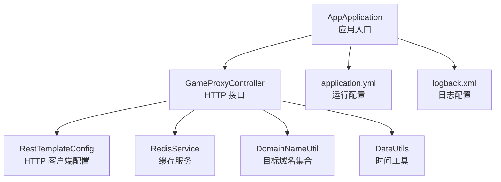
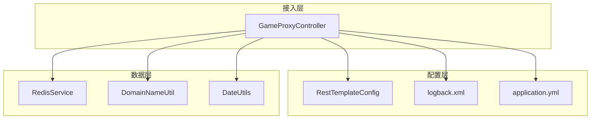
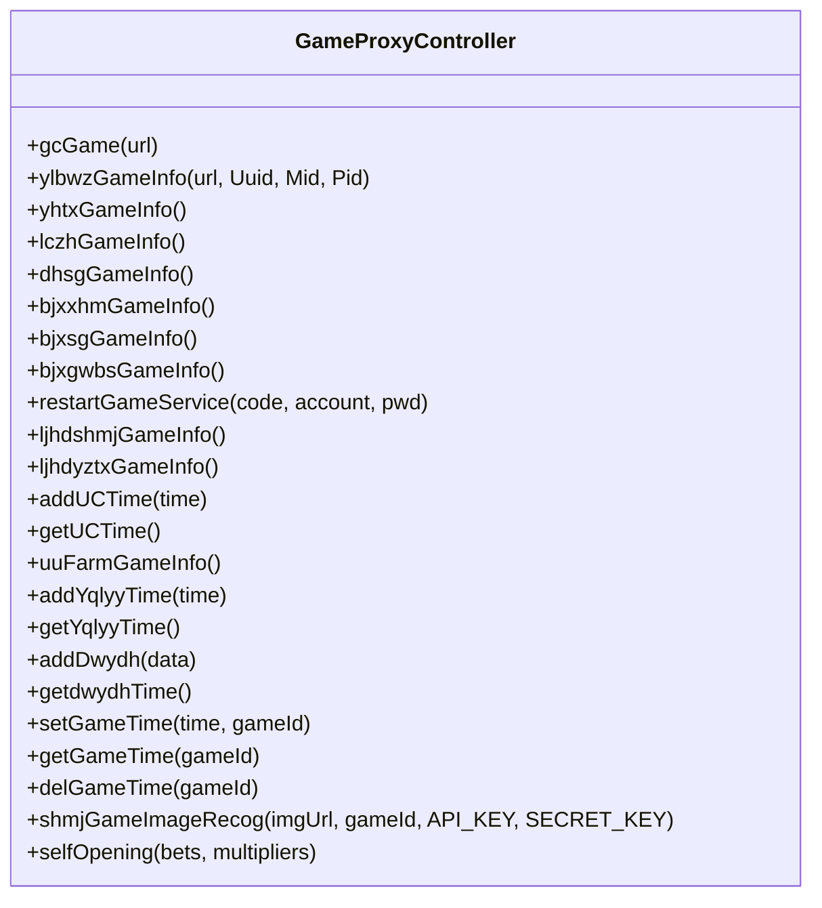
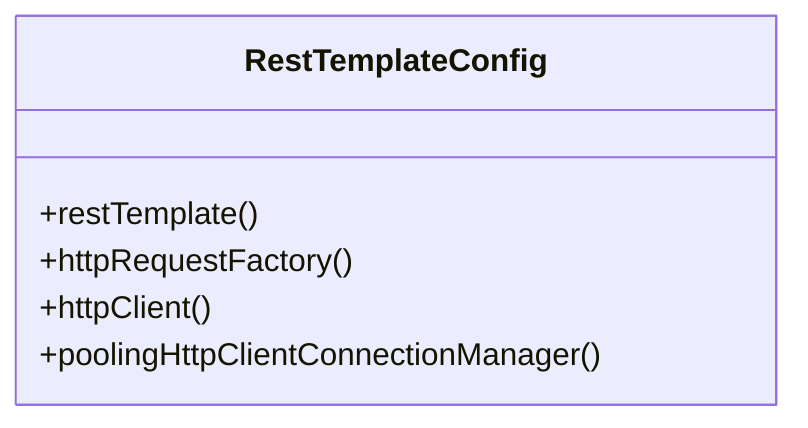
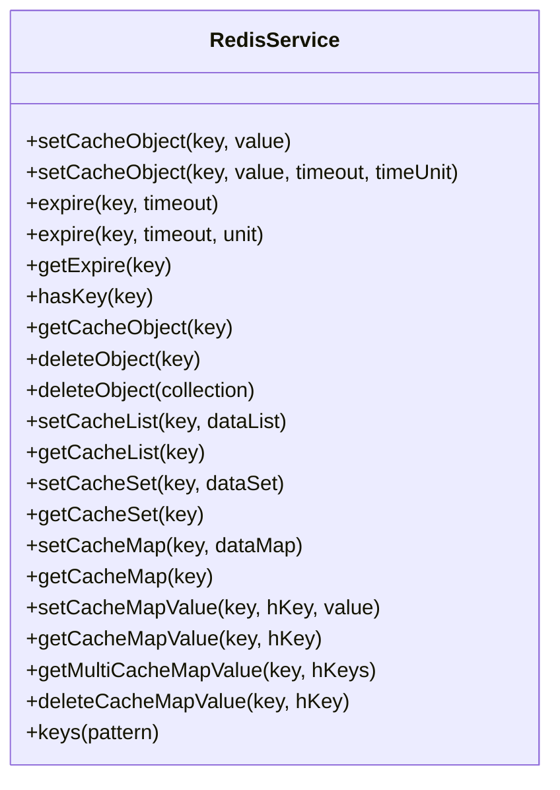
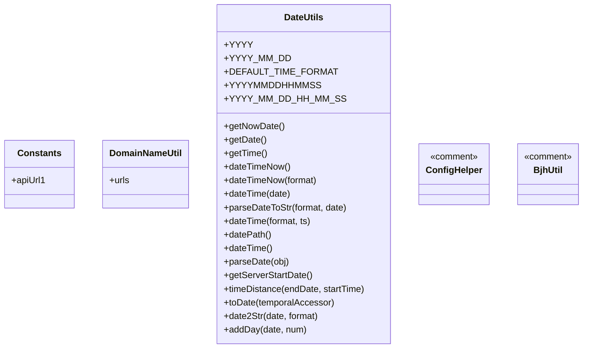
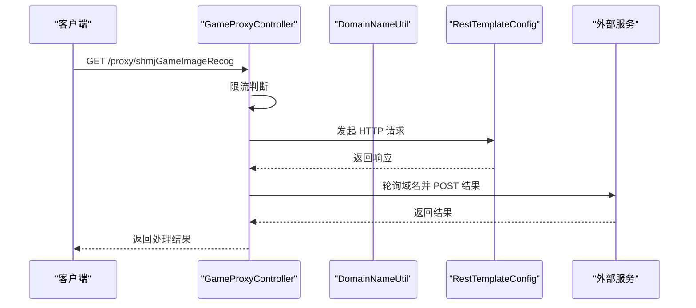
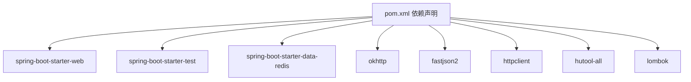

# 开发指南

<cite>
**本文引用的文件**
- [pom.xml](file://game-proxy/pom.xml)
- [AppApplication.java](file://game-proxy/src/main/java/com/game/AppApplication.java)
- [application.yml](file://game-proxy/src/main/resources/application.yml)
- [GameProxyController.java](file://game-proxy/src/main/java/com/game/controller/GameProxyController.java)
- [Constants.java](file://game-proxy/src/main/java/com/game/commom/Constants.java)
- [RestTemplateConfig.java](file://game-proxy/src/main/java/com/game/commom/RestTemplateConfig.java)
- [RedisService.java](file://game-proxy/src/main/java/com/game/redis/RedisService.java)
- [DomainNameUtil.java](file://game-proxy/src/main/java/com/game/utils/DomainNameUtil.java)
- [logback.xml](file://game-proxy/src/main/resources/logback.xml)
- [DateUtils.java](file://game-proxy/src/main/java/com/game/utils/DateUtils.java)
- [ConfigHelper.java](file://game-proxy/src/main/java/com/game/utils/ConfigHelper.java)
- [BjhUtil.java](file://game-proxy/src/main/java/com/game/utils/BjhUtil.java)
</cite>

## 目录
1. [简介](#简介)
2. [项目结构](#项目结构)
3. [核心组件](#核心组件)
4. [架构总览](#架构总览)
5. [详细组件分析](#详细组件分析)
6. [依赖分析](#依赖分析)
7. [性能考量](#性能考量)
8. [故障排查指南](#故障排查指南)
9. [结论](#结论)
10. [附录](#附录)

## 简介
本指南面向游戏代理系统的开发者，提供从开发环境搭建、代码规范与约定、新功能开发流程、代码评审标准、版本控制最佳实践、模块间依赖与接口约定、调试与问题定位方法，到贡献代码流程的完整说明。内容基于仓库现有代码进行提炼与总结，帮助团队统一开发标准，提升协作效率与系统稳定性。

## 项目结构
- 采用多模块 Maven 结构，game-proxy 为核心业务模块，包含控制器、通用配置、工具类、Redis 封装与定时任务相关组件。
- 使用 Spring Boot 启动应用，通过 RestTemplate 统一 HTTP 客户端配置，集成 Redis 实现缓存与状态存储。
- 配置文件集中于 application.yml，日志由 logback.xml 管理。

图表来源
- [AppApplication.java](file://game-proxy/src/main/java/com/game/AppApplication.java#L15-L32)
- [GameProxyController.java](file://game-proxy/src/main/java/com/game/controller/GameProxyController.java#L36-L39)
- [RestTemplateConfig.java](file://game-proxy/src/main/java/com/game/commom/RestTemplateConfig.java#L33-L131)
- [RedisService.java](file://game-proxy/src/main/java/com/game/redis/RedisService.java#L18-L243)
- [DomainNameUtil.java](file://game-proxy/src/main/java/com/game/utils/DomainNameUtil.java#L3-L15)
- [application.yml](file://game-proxy/src/main/resources/application.yml#L1-L58)
- [logback.xml](file://game-proxy/src/main/resources/logback.xml#L1-L75)

章节来源
- [AppApplication.java](file://game-proxy/src/main/java/com/game/AppApplication.java#L15-L32)
- [application.yml](file://game-proxy/src/main/resources/application.yml#L1-L58)

## 核心组件
- 应用入口与启动
  - 通过 Spring Boot 启动，启用调度能力，启动后输出访问地址与 Swagger 文档地址，便于本地联调。
- 控制器层
  - 提供游戏代理相关接口，包括通用代理、游戏信息查询、时间同步、图片识别、自开奖等。
- HTTP 客户端配置
  - 基于 Apache HttpClient 的连接池与超时策略配置，统一 RestTemplate 请求工厂。
- 缓存服务
  - 基于 RedisTemplate 的通用缓存封装，支持多种数据结构与过期策略。
- 工具与常量
  - 域名集合、时间工具、配置辅助等工具类，支撑业务逻辑。

章节来源
- [AppApplication.java](file://game-proxy/src/main/java/com/game/AppApplication.java#L15-L32)
- [GameProxyController.java](file://game-proxy/src/main/java/com/game/controller/GameProxyController.java#L36-L436)
- [RestTemplateConfig.java](file://game-proxy/src/main/java/com/game/commom/RestTemplateConfig.java#L33-L131)
- [RedisService.java](file://game-proxy/src/main/java/com/game/redis/RedisService.java#L18-L243)
- [DomainNameUtil.java](file://game-proxy/src/main/java/com/game/utils/DomainNameUtil.java#L3-L15)
- [DateUtils.java](file://game-proxy/src/main/java/com/game/utils/DateUtils.java#L18-L197)
- [ConfigHelper.java](file://game-proxy/src/main/java/com/game/utils/ConfigHelper.java#L1-L23)

## 架构总览
系统采用“控制器-服务-客户端-缓存”的分层架构：
- 控制器负责对外 HTTP 接口与参数校验；
- 通过 RestTemplateConfig 统一 HTTP 客户端行为；
- 通过 RedisService 进行数据缓存与状态持久化；
- 工具类提供通用能力（时间、域名、配置等）。

图表来源
- [GameProxyController.java](file://game-proxy/src/main/java/com/game/controller/GameProxyController.java#L36-L39)
- [RestTemplateConfig.java](file://game-proxy/src/main/java/com/game/commom/RestTemplateConfig.java#L33-L131)
- [RedisService.java](file://game-proxy/src/main/java/com/game/redis/RedisService.java#L18-L243)
- [DomainNameUtil.java](file://game-proxy/src/main/java/com/game/utils/DomainNameUtil.java#L3-L15)
- [DateUtils.java](file://game-proxy/src/main/java/com/game/utils/DateUtils.java#L18-L197)
- [application.yml](file://game-proxy/src/main/resources/application.yml#L1-L58)
- [logback.xml](file://game-proxy/src/main/resources/logback.xml#L1-L75)

## 详细组件分析

### 控制器组件分析
- 功能职责
  - 提供游戏代理转发、游戏信息查询、时间同步、图片识别、自开奖等接口。
- 关键点
  - 使用日志记录请求与响应，便于追踪；
  - 对外部请求使用 RestTemplate 统一处理；
  - 使用 RedisService 进行缓存读写；
  - 对部分接口增加限流保护（如图片识别接口）。

图表来源
- [GameProxyController.java](file://game-proxy/src/main/java/com/game/controller/GameProxyController.java#L36-L436)

章节来源
- [GameProxyController.java](file://game-proxy/src/main/java/com/game/controller/GameProxyController.java#L36-L436)

### HTTP 客户端配置组件分析
- 功能职责
  - 配置连接池大小、超时时间、Keep-Alive、重试策略与默认请求头。
- 关键点
  - 通过 application.yml 注入配置；
  - 统一 RestTemplate 的 ClientHttpRequestFactory；
  - 支持 HTTP/HTTPS 连接管理。

图表来源
- [RestTemplateConfig.java](file://game-proxy/src/main/java/com/game/commom/RestTemplateConfig.java#L33-L131)

章节来源
- [RestTemplateConfig.java](file://game-proxy/src/main/java/com/game/commom/RestTemplateConfig.java#L33-L131)
- [application.yml](file://game-proxy/src/main/resources/application.yml#L43-L58)

### 缓存服务组件分析
- 功能职责
  - 提供对象、列表、Set、Map、过期时间等通用缓存操作。
- 关键点
  - 基于 RedisTemplate 的多种操作封装；
  - 支持泛型与线程安全；
  - 提供批量删除与键模式匹配。

图表来源
- [RedisService.java](file://game-proxy/src/main/java/com/game/redis/RedisService.java#L18-L243)

章节来源
- [RedisService.java](file://game-proxy/src/main/java/com/game/redis/RedisService.java#L18-L243)
- [application.yml](file://game-proxy/src/main/resources/application.yml#L15-L31)

### 工具与常量组件分析
- 常量与域名
  - Constants 提供固定 API 地址常量；
  - DomainNameUtil 维护目标域名数组。
- 时间工具
  - DateUtils 提供日期格式化、时间差计算、服务器启动时间等常用方法。
- 配置辅助
  - ConfigHelper 展示了静态配置读取的思路（注释状态）。

图表来源
- [Constants.java](file://game-proxy/src/main/java/com/game/commom/Constants.java#L3-L13)
- [DomainNameUtil.java](file://game-proxy/src/main/java/com/game/utils/DomainNameUtil.java#L3-L15)
- [DateUtils.java](file://game-proxy/src/main/java/com/game/utils/DateUtils.java#L18-L197)
- [ConfigHelper.java](file://game-proxy/src/main/java/com/game/utils/ConfigHelper.java#L1-L23)
- [BjhUtil.java](file://game-proxy/src/main/java/com/game/utils/BjhUtil.java#L6-L9)

章节来源
- [Constants.java](file://game-proxy/src/main/java/com/game/commom/Constants.java#L3-L13)
- [DomainNameUtil.java](file://game-proxy/src/main/java/com/game/utils/DomainNameUtil.java#L3-L15)
- [DateUtils.java](file://game-proxy/src/main/java/com/game/utils/DateUtils.java#L18-L197)
- [ConfigHelper.java](file://game-proxy/src/main/java/com/game/utils/ConfigHelper.java#L1-L23)
- [BjhUtil.java](file://game-proxy/src/main/java/com/game/utils/BjhUtil.java#L6-L9)

### API 调用序列图（示例：图片识别）
展示控制器调用工具与外部服务的典型流程。

图表来源
- [GameProxyController.java](file://game-proxy/src/main/java/com/game/controller/GameProxyController.java#L360-L412)
- [RestTemplateConfig.java](file://game-proxy/src/main/java/com/game/commom/RestTemplateConfig.java#L62-L107)
- [DomainNameUtil.java](file://game-proxy/src/main/java/com/game/utils/DomainNameUtil.java#L3-L15)

## 依赖分析
- 依赖管理
  - 使用 Spring Boot Starter Web、Test、Redis、OkHttp、FastJSON2、Apache HttpClient、Hutool、Lombok 等。
- 构建与打包
  - Maven 插件配置编码、编译版本与资源过滤，Spring Boot 插件排除 Lombok。

图表来源
- [pom.xml](file://game-proxy/pom.xml#L26-L99)

章节来源
- [pom.xml](file://game-proxy/pom.xml#L11-L163)

## 性能考量
- HTTP 客户端连接池
  - 通过 application.yml 配置最大连接数、路由并发、超时时间与空闲校验，避免频繁创建连接带来的开销。
- Redis 缓存
  - 合理设置过期时间与键空间，避免内存膨胀；批量读写时优先使用管道或批处理。
- 接口限流
  - 图片识别接口已内置 5 秒内仅允许一次请求的限流逻辑，防止外部服务压力过大。
- 日志级别
  - 生产环境建议降低 INFO 级别日志量，必要时拆分不同模块日志，减少 IO 压力。

章节来源
- [application.yml](file://game-proxy/src/main/resources/application.yml#L43-L58)
- [GameProxyController.java](file://game-proxy/src/main/java/com/game/controller/GameProxyController.java#L357-L412)
- [logback.xml](file://game-proxy/src/main/resources/logback.xml#L60-L73)

## 故障排查指南
- 启动与访问
  - 启动后可在控制台看到本地与外网访问地址及 Swagger 文档地址，确认端口与上下文路径。
- 日志定位
  - 使用 logback.xml 输出到控制台与滚动文件，按级别区分 INFO 与 ERROR，结合方法名与行号快速定位。
- Redis 连接
  - 检查 application.yml 中 Redis 主机、端口、密码与超时配置，确认连接池参数合理。
- HTTP 请求
  - 若出现超时或连接异常，检查 application.yml 中超时与连接池配置，以及外部服务可达性。
- 接口异常
  - 对外部调用使用 try-catch 捕获 RestClientException 或通用异常，并记录详细日志以便回溯。

章节来源
- [AppApplication.java](file://game-proxy/src/main/java/com/game/AppApplication.java#L24-L31)
- [logback.xml](file://game-proxy/src/main/resources/logback.xml#L1-L75)
- [application.yml](file://game-proxy/src/main/resources/application.yml#L15-L58)
- [GameProxyController.java](file://game-proxy/src/main/java/com/game/controller/GameProxyController.java#L398-L407)

## 结论
本指南基于现有代码梳理了开发环境、代码规范、流程与最佳实践，建议在后续迭代中持续完善：
- 明确新增模块的目录结构与命名规范；
- 强化单元测试与集成测试覆盖；
- 规范分支策略与合并流程；
- 建立统一的接口契约与文档维护机制。

## 附录

### 开发环境搭建
- IDE 与插件
  - 推荐使用 IntelliJ IDEA，安装 Lombok、Spring Boot、Maven、YAML/JSON 支持插件。
- 导入项目
  - 打开根目录的 pom.xml，选择“Add as Maven Project”，等待依赖下载完成。
- 运行与验证
  - 运行 AppApplication，查看控制台输出的访问地址与 Swagger 文档地址，确认服务正常启动。

章节来源
- [AppApplication.java](file://game-proxy/src/main/java/com/game/AppApplication.java#L24-L31)
- [pom.xml](file://game-proxy/pom.xml#L11-L163)

### 代码规范与开发约定
- 命名规范
  - 类名使用帕斯卡命名，方法与变量使用驼峰命名；包名全小写。
- 注释标准
  - 控制器类与公共方法保留必要的注释，说明用途、参数与返回值。
- 异常处理
  - 对外部调用使用 try-catch 捕获异常并记录日志；对可预期异常进行分类处理。
- 日志记录
  - 使用 SLF4J 记录关键流程与错误信息，避免在生产环境输出敏感信息。

章节来源
- [GameProxyController.java](file://game-proxy/src/main/java/com/game/controller/GameProxyController.java#L30-L35)
- [GameProxyController.java](file://game-proxy/src/main/java/com/game/controller/GameProxyController.java#L398-L407)
- [logback.xml](file://game-proxy/src/main/resources/logback.xml#L1-L75)

### 新功能开发流程
- 需求分析
  - 明确接口职责、输入输出、异常场景与性能要求。
- 设计与评审
  - 设计控制器与服务边界，评审接口契约与数据模型。
- 实现
  - 在 controller 层定义接口，使用 RestTemplateConfig 发起外部请求，使用 RedisService 进行缓存，必要时引入工具类。
- 测试
  - 编写单元测试与集成测试，验证正常与异常路径。
- 上线
  - 更新配置文件与文档，灰度发布并监控日志与指标。

章节来源
- [GameProxyController.java](file://game-proxy/src/main/java/com/game/controller/GameProxyController.java#L36-L436)
- [RestTemplateConfig.java](file://game-proxy/src/main/java/com/game/commom/RestTemplateConfig.java#L33-L131)
- [RedisService.java](file://game-proxy/src/main/java/com/game/redis/RedisService.java#L18-L243)

### 代码评审标准与检查清单
- 代码质量
  - 方法长度适中、职责单一；变量命名清晰；无魔法数字与字符串。
- 安全性
  - 未在日志中输出敏感信息；对外请求添加超时与重试策略。
- 可维护性
  - 配置集中管理；日志分级明确；异常处理完备。
- 性能
  - 合理使用缓存与连接池；避免阻塞操作；关注 GC 与内存占用。

章节来源
- [application.yml](file://game-proxy/src/main/resources/application.yml#L15-L58)
- [logback.xml](file://game-proxy/src/main/resources/logback.xml#L60-L73)
- [GameProxyController.java](file://game-proxy/src/main/java/com/game/controller/GameProxyController.java#L398-L407)

### 版本控制最佳实践与分支管理策略
- 分支策略
  - develop：日常开发分支；release：预发布分支；master/main：稳定发布分支。
- 提交规范
  - 提交信息包含类型（feat/fix/docs/chore）、简要描述与关联 Issue 编号。
- 合并与审核
  - Pull Request 必须通过代码评审与自动化测试；合并前清理无用分支。

章节来源
- [pom.xml](file://game-proxy/pom.xml#L11-L163)

### 模块间依赖关系与接口约定
- 控制器依赖
  - 控制器依赖 RestTemplateConfig、RedisService、DomainNameUtil、DateUtils 等工具与配置。
- 接口约定
  - 控制器接口统一使用 @RestController 与 @RequestMapping，参数与返回值保持一致风格；对外异常统一捕获与记录。

章节来源
- [GameProxyController.java](file://game-proxy/src/main/java/com/game/controller/GameProxyController.java#L36-L39)
- [RestTemplateConfig.java](file://game-proxy/src/main/java/com/game/commom/RestTemplateConfig.java#L33-L131)
- [RedisService.java](file://game-proxy/src/main/java/com/game/redis/RedisService.java#L18-L243)
- [DomainNameUtil.java](file://game-proxy/src/main/java/com/game/utils/DomainNameUtil.java#L3-L15)

### 开发调试技巧与问题定位方法
- 本地联调
  - 通过启动类输出的访问地址与 Swagger 文档进行接口测试。
- 日志分析
  - 使用 logback.xml 的滚动文件与级别过滤，结合关键词搜索定位问题。
- Redis 调试
  - 使用 Redis 客户端查看缓存键值与过期时间，核对业务逻辑。
- HTTP 抓包
  - 使用抓包工具观察请求头与响应体，确认外部服务可达性与协议兼容性。

章节来源
- [AppApplication.java](file://game-proxy/src/main/java/com/game/AppApplication.java#L24-L31)
- [logback.xml](file://game-proxy/src/main/resources/logback.xml#L1-L75)
- [application.yml](file://game-proxy/src/main/resources/application.yml#L15-L58)

### 贡献代码流程与规范要求
- 创建分支
  - 基于 develop 创建功能分支，命名包含功能与编号。
- 提交与推送
  - 提交前运行构建与测试，推送前执行代码格式化与静态检查。
- 提交信息
  - 使用约定格式，简明扼要描述变更内容与影响范围。
- 评审与合并
  - 发起 PR，至少一名成员评审通过后方可合并至 develop。

章节来源
- [pom.xml](file://game-proxy/pom.xml#L11-L163)