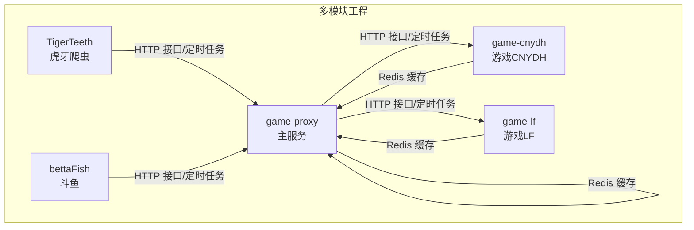
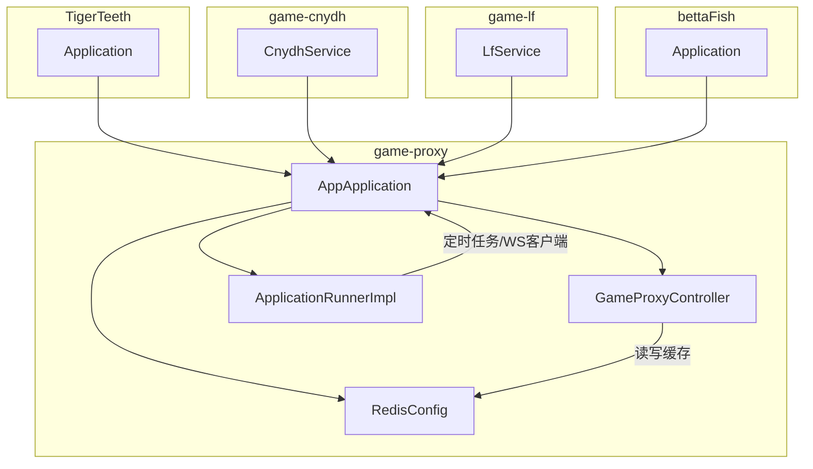
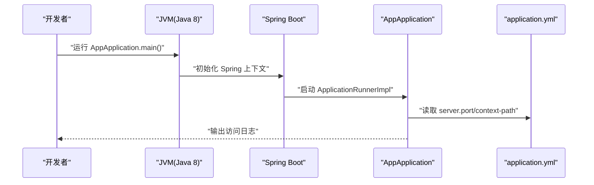
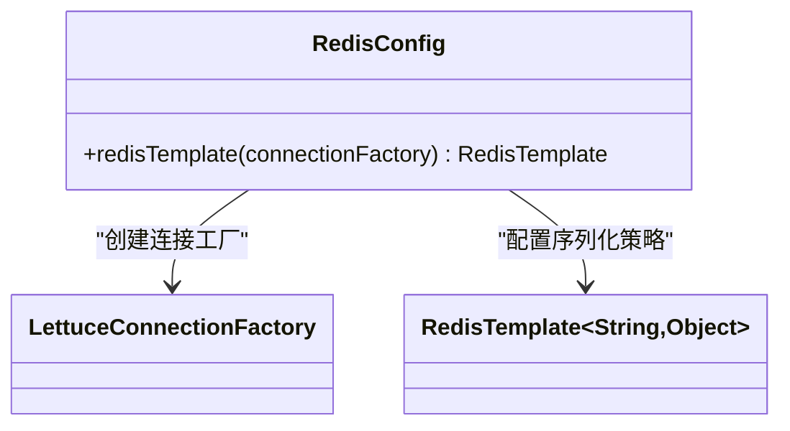
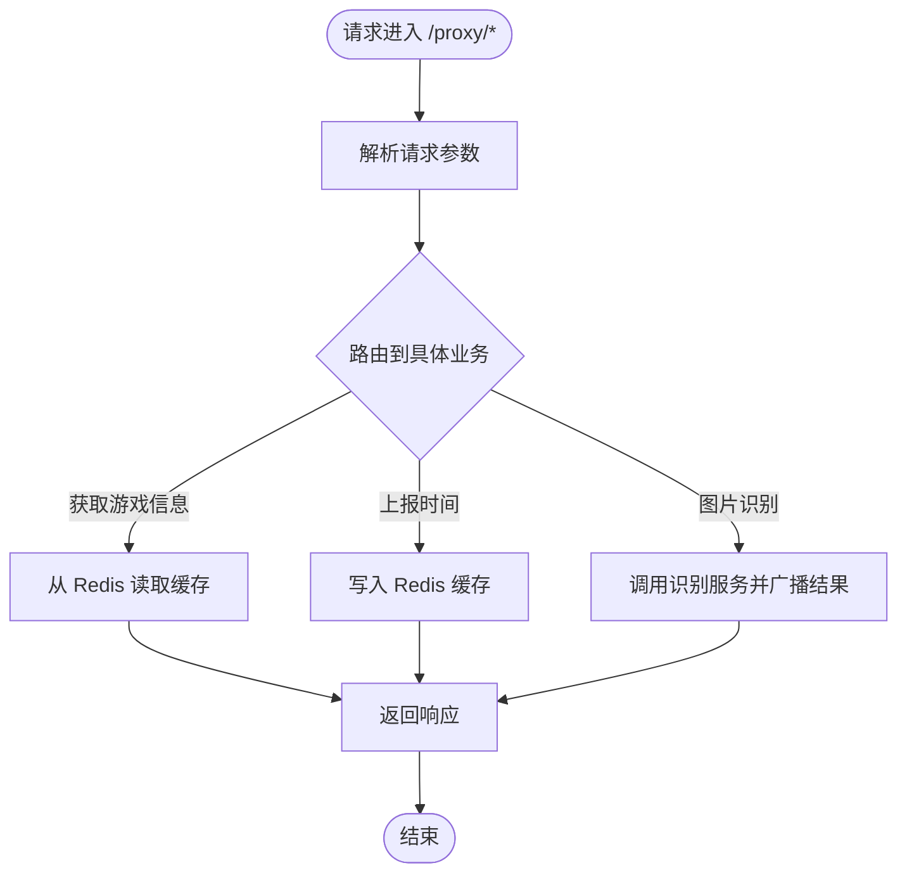
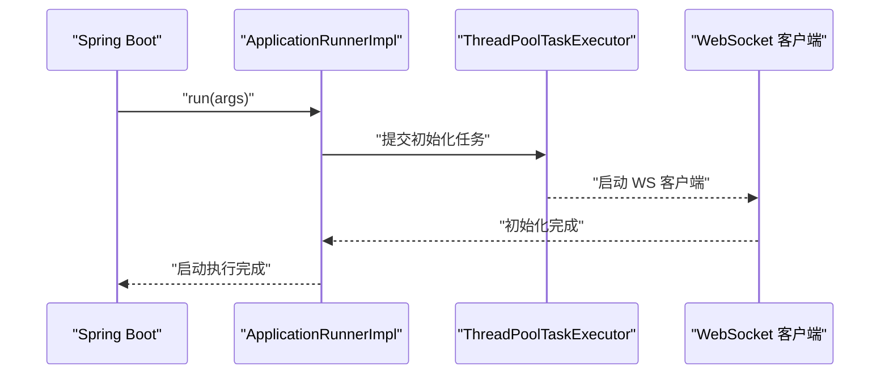
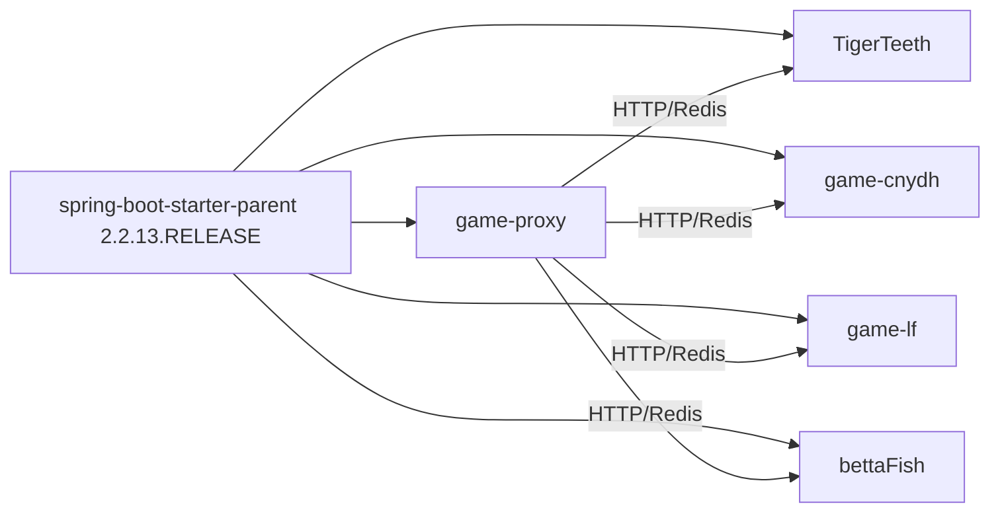

# 开发环境搭建

<cite>
**本文引用的文件**
- [game-proxy/pom.xml](file://game-proxy/pom.xml)
- [game-proxy/src/main/resources/application.yml](file://game-proxy/src/main/resources/application.yml)
- [game-proxy/src/main/java/com/game/AppApplication.java](file://game-proxy/src/main/java/com/game/AppApplication.java)
- [game-proxy/src/main/java/com/game/redis/RedisConfig.java](file://game-proxy/src/main/java/com/game/redis/RedisConfig.java)
- [game-proxy/src/main/java/com/game/controller/GameProxyController.java](file://game-proxy/src/main/java/com/game/controller/GameProxyController.java)
- [game-proxy/src/main/java/com/game/listener/ApplicationRunnerImpl.java](file://game-proxy/src/main/java/com/game/listener/ApplicationRunnerImpl.java)
- [TigerTeeth/pom.xml](file://TigerTeeth/pom.xml)
- [TigerTeeth/src/main/resources/application.yml](file://TigerTeeth/src/main/resources/application.yml)
- [TigerTeeth/src/main/java/com/Application.java](file://TigerTeeth/src/main/java/com/Application.java)
- [game-cnydh/pom.xml](file://game-cnydh/pom.xml)
- [game-lf/pom.xml](file://game-lf/pom.xml)
- [bettaFish/pom.xml](file://bettaFish/pom.xml)
- [bettaFish/src/main/resources/application.properties](file://bettaFish/src/main/resources/application.properties)
</cite>

## 目录
1. [简介](#简介)
2. [项目结构](#项目结构)
3. [核心组件](#核心组件)
4. [架构总览](#架构总览)
5. [详细组件分析](#详细组件分析)
6. [依赖分析](#依赖分析)
7. [性能注意事项](#性能注意事项)
8. [故障排查指南](#故障排查指南)
9. [结论](#结论)
10. [附录](#附录)

## 简介
本指南面向“游戏代理系统”的开发者，提供从零搭建开发环境的完整步骤与最佳实践，涵盖以下内容：
- JDK 8 的安装与配置、环境变量设置与版本验证
- IDE（IntelliJ IDEA 或 Eclipse）安装与必备插件（Lombok、Spring Boot）
- Maven 的配置与本地仓库设置
- 项目模块化结构与依赖关系（父 POM 与子模块继承）
- Git 克隆、Maven 依赖下载与项目导入流程
- Redis 服务的本地安装与配置
- 常见环境问题排查与解决方案
- 开发工具链的推荐配置与优化建议

## 项目结构
该仓库采用多模块 Maven 工程组织，核心模块如下：
- game-proxy：主服务模块，提供 HTTP 接口、定时任务、Redis 缓存、WebSocket 客户端等
- TigerTeeth：虎牙相关爬虫模块
- game-cnydh：游戏相关模块（包含定时任务与 Redis 使用）
- game-lf：游戏相关模块（包含定时任务与 Redis 使用）
- bettaFish：斗鱼相关模块

各模块均基于 Spring Boot 2.2.13.RELEASE 构建，Java 版本统一为 1.8。

图表来源
- [game-proxy/pom.xml](file://game-proxy/pom.xml#L1-L163)
- [TigerTeeth/pom.xml](file://TigerTeeth/pom.xml#L1-L160)
- [game-cnydh/pom.xml](file://game-cnydh/pom.xml#L1-L159)
- [game-lf/pom.xml](file://game-lf/pom.xml#L1-L160)
- [bettaFish/pom.xml](file://bettaFish/pom.xml#L1-L98)

章节来源
- [game-proxy/pom.xml](file://game-proxy/pom.xml#L1-L163)
- [TigerTeeth/pom.xml](file://TigerTeeth/pom.xml#L1-L160)
- [game-cnydh/pom.xml](file://game-cnydh/pom.xml#L1-L159)
- [game-lf/pom.xml](file://game-lf/pom.xml#L1-L160)
- [bettaFish/pom.xml](file://bettaFish/pom.xml#L1-L98)

## 核心组件
- 应用入口与启动
  - game-proxy 主应用入口位于 [AppApplication.java](file://game-proxy/src/main/java/com/game/AppApplication.java#L1-L33)，启用调度注解，启动后输出访问 URL 日志
  - TigerTeeth 应用入口位于 [Application.java](file://TigerTeeth/src/main/java/com/Application.java#L1-L14)
- 配置中心
  - game-proxy 默认配置位于 [application.yml](file://game-proxy/src/main/resources/application.yml#L1-L58)，包含服务器端口、上下文路径、Redis 连接、HTTP 连接池等
  - bettaFish 默认配置位于 [application.properties](file://bettaFish/src/main/resources/application.properties#L1-L1)
- Redis 集成
  - RedisConfig 定义了 Lettuce 连接工厂与 RedisTemplate 序列化策略，确保键值对以 JSON 存储
- 控制器与业务
  - GameProxyController 提供游戏代理相关接口，包括获取游戏信息、上报时间、图片识别等
  - ApplicationRunnerImpl 在应用启动时初始化部分 WebSocket 客户端与定时任务

章节来源
- [game-proxy/src/main/java/com/game/AppApplication.java](file://game-proxy/src/main/java/com/game/AppApplication.java#L1-L33)
- [TigerTeeth/src/main/java/com/Application.java](file://TigerTeeth/src/main/java/com/Application.java#L1-L14)
- [game-proxy/src/main/resources/application.yml](file://game-proxy/src/main/resources/application.yml#L1-L58)
- [bettaFish/src/main/resources/application.properties](file://bettaFish/src/main/resources/application.properties#L1-L1)
- [game-proxy/src/main/java/com/game/redis/RedisConfig.java](file://game-proxy/src/main/java/com/game/redis/RedisConfig.java#L1-L41)
- [game-proxy/src/main/java/com/game/controller/GameProxyController.java](file://game-proxy/src/main/java/com/game/controller/GameProxyController.java#L1-L436)
- [game-proxy/src/main/java/com/game/listener/ApplicationRunnerImpl.java](file://game-proxy/src/main/java/com/game/listener/ApplicationRunnerImpl.java#L1-L174)

## 架构总览
下图展示了模块间的依赖关系与交互：

图表来源
- [game-proxy/src/main/java/com/game/AppApplication.java](file://game-proxy/src/main/java/com/game/AppApplication.java#L1-L33)
- [game-proxy/src/main/java/com/game/controller/GameProxyController.java](file://game-proxy/src/main/java/com/game/controller/GameProxyController.java#L1-L436)
- [game-proxy/src/main/java/com/game/redis/RedisConfig.java](file://game-proxy/src/main/java/com/game/redis/RedisConfig.java#L1-L41)
- [game-proxy/src/main/java/com/game/listener/ApplicationRunnerImpl.java](file://game-proxy/src/main/java/com/game/listener/ApplicationRunnerImpl.java#L1-L174)
- [TigerTeeth/src/main/java/com/Application.java](file://TigerTeeth/src/main/java/com/Application.java#L1-L14)
- [game-cnydh/pom.xml](file://game-cnydh/pom.xml#L1-L159)
- [game-lf/pom.xml](file://game-lf/pom.xml#L1-L160)
- [bettaFish/pom.xml](file://bettaFish/pom.xml#L1-L98)

## 详细组件分析

### 组件一：应用启动与配置
- 启动类负责加载 Spring 上下文并输出访问日志，便于快速定位服务地址
- application.yml 中定义了端口、上下文路径、Redis 连接参数、HTTP 连接池参数等

图表来源
- [game-proxy/src/main/java/com/game/AppApplication.java](file://game-proxy/src/main/java/com/game/AppApplication.java#L24-L31)
- [game-proxy/src/main/resources/application.yml](file://game-proxy/src/main/resources/application.yml#L1-L58)

章节来源
- [game-proxy/src/main/java/com/game/AppApplication.java](file://game-proxy/src/main/java/com/game/AppApplication.java#L1-L33)
- [game-proxy/src/main/resources/application.yml](file://game-proxy/src/main/resources/application.yml#L1-L58)

### 组件二：Redis 配置与序列化
- 使用 Lettuce 连接池，RedisTemplate 自定义序列化策略，保证键值以字符串存储、值以 JSON 存储
- 适用于 game-proxy、game-cnydh、game-lf 等模块的缓存需求

图表来源
- [game-proxy/src/main/java/com/game/redis/RedisConfig.java](file://game-proxy/src/main/java/com/game/redis/RedisConfig.java#L1-L41)

章节来源
- [game-proxy/src/main/java/com/game/redis/RedisConfig.java](file://game-proxy/src/main/java/com/game/redis/RedisConfig.java#L1-L41)

### 组件三：控制器与业务逻辑
- GameProxyController 提供多种游戏代理接口，包括获取游戏信息、上报时间、图片识别等
- 控制器通过 RedisService 与 Redis 交互，实现缓存读写

图表来源
- [game-proxy/src/main/java/com/game/controller/GameProxyController.java](file://game-proxy/src/main/java/com/game/controller/GameProxyController.java#L1-L436)

章节来源
- [game-proxy/src/main/java/com/game/controller/GameProxyController.java](file://game-proxy/src/main/java/com/game/controller/GameProxyController.java#L1-L436)

### 组件四：启动监听与定时任务
- ApplicationRunnerImpl 在应用启动时初始化部分 WebSocket 客户端与定时任务
- 通过线程池并发执行多个服务初始化任务

图表来源
- [game-proxy/src/main/java/com/game/listener/ApplicationRunnerImpl.java](file://game-proxy/src/main/java/com/game/listener/ApplicationRunnerImpl.java#L64-L145)

章节来源
- [game-proxy/src/main/java/com/game/listener/ApplicationRunnerImpl.java](file://game-proxy/src/main/java/com/game/listener/ApplicationRunnerImpl.java#L1-L174)

## 依赖分析
- 父 POM 与继承关系
  - 所有模块均继承自 spring-boot-starter-parent 2.2.13.RELEASE，统一管理依赖版本与构建插件
  - Java 版本统一为 1.8，编码统一为 UTF-8
- 关键依赖
  - Spring Web、Spring Data Redis、Lombok、Apache HttpClient、Fastjson2、OkHttp、Hutool 等
- 模块间耦合
  - game-proxy 作为聚合模块，其他模块通过 HTTP 或 Redis 与其交互
  - TigerTeeth、game-cnydh、game-lf、bettaFish 作为独立子模块，可按需启用

图表来源
- [game-proxy/pom.xml](file://game-proxy/pom.xml#L19-L24)
- [TigerTeeth/pom.xml](file://TigerTeeth/pom.xml#L19-L23)
- [game-cnydh/pom.xml](file://game-cnydh/pom.xml#L19-L24)
- [game-lf/pom.xml](file://game-lf/pom.xml#L19-L24)
- [bettaFish/pom.xml](file://bettaFish/pom.xml#L12-L16)

章节来源
- [game-proxy/pom.xml](file://game-proxy/pom.xml#L1-L163)
- [TigerTeeth/pom.xml](file://TigerTeeth/pom.xml#L1-L160)
- [game-cnydh/pom.xml](file://game-cnydh/pom.xml#L1-L159)
- [game-lf/pom.xml](file://game-lf/pom.xml#L1-L160)
- [bettaFish/pom.xml](file://bettaFish/pom.xml#L1-L98)

## 性能注意事项
- Redis 连接池参数已配置，建议根据实际并发调整最大连接数与阻塞等待时间
- HTTP 连接池参数已在 application.yml 中集中配置，避免频繁创建连接
- 控制器中的图片识别接口设置了限流，防止短时间内重复调用
- 定时任务与 WebSocket 客户端使用线程池并发执行，注意监控线程池状态

## 故障排查指南
- 端口冲突
  - game-proxy 默认端口为 8085，TigerTeeth 为 8021，bettaFish 为 8015；若冲突，请在对应模块的配置文件中修改
- Redis 连接失败
  - 检查 application.yml 中的 host、port、password、database、timeout 等参数是否正确
  - 确认本地 Redis 服务已启动且可访问
- Lombok 插件未生效
  - IntelliJ IDEA 需启用“Annotation Processing”，并安装 Lombok 插件；Eclipse 需安装 Lombok 并添加 VM 参数
- Maven 依赖下载缓慢
  - 配置本地仓库目录，必要时使用镜像源加速
- 启动日志无输出
  - 检查 application.yml 中 server.port 与 context-path 是否正确，确认日志级别

章节来源
- [game-proxy/src/main/resources/application.yml](file://game-proxy/src/main/resources/application.yml#L1-L58)
- [TigerTeeth/src/main/resources/application.yml](file://TigerTeeth/src/main/resources/application.yml#L1-L31)
- [bettaFish/src/main/resources/application.properties](file://bettaFish/src/main/resources/application.properties#L1-L1)

## 结论
通过本指南，您可以完成从 JDK 8 到 IDE、Maven、Redis 的全链路环境搭建，并成功导入与运行多模块游戏代理系统。建议在开发过程中遵循统一的 Java 版本与依赖管理策略，合理配置 Redis 与 HTTP 连接池参数，确保系统稳定运行。

## 附录

### A. JDK 8 安装与配置
- 下载并安装 JDK 8（x64）
- 设置 JAVA_HOME、PATH 环境变量
- 验证：在命令行执行 java -version 与 javac -version

### B. IDE 安装与配置
- IntelliJ IDEA
  - 安装后启用 Annotation Processing，安装 Lombok 插件
  - 导入项目时选择根目录的 pom.xml
- Eclipse
  - 安装 Lombok 插件，启用注解处理
  - 使用 Maven 导入项目

### C. Maven 配置与本地仓库
- 配置本地仓库目录（settings.xml 中的 localRepository）
- 如需加速，可在 mirrors 节点配置镜像源
- 建议使用 Maven 3.6+ 版本

### D. 项目导入步骤
- Git 克隆仓库至本地
- 在 IDE 中打开根目录的 pom.xml
- 等待 Maven 下载依赖（首次可能较慢）
- 运行 game-proxy 的 AppApplication.main()

### E. Redis 本地安装与配置
- 下载并安装 Redis（Windows 可使用官方预编译版本或 WSL）
- 启动 Redis 服务，确保端口开放
- 在 application.yml 中校验 host、port、password、database、timeout 等参数

### F. 常见环境问题与解决方案
- 端口占用：修改 application.yml 中的 server.port
- Redis 连接失败：核对 host/port/password/database/timeout
- Lombok 插件未生效：检查 IDE 插件与 Annotation Processing
- Maven 依赖下载慢：配置本地仓库与镜像源
- 启动无日志：检查日志级别与配置文件