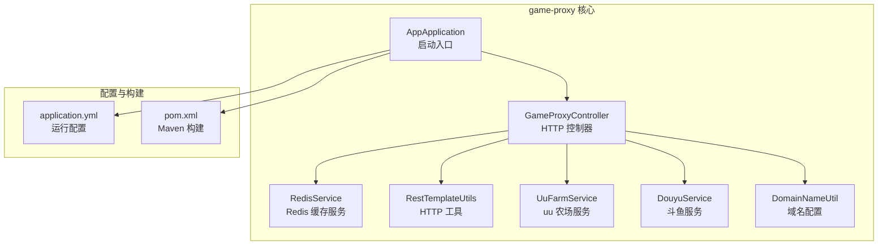
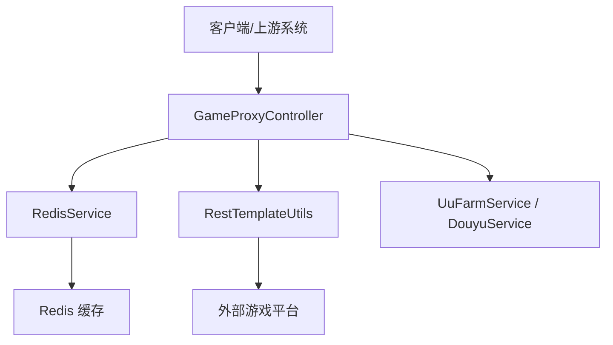
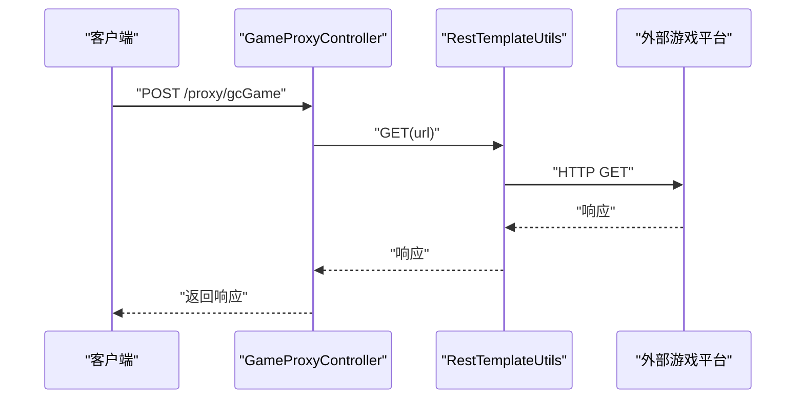
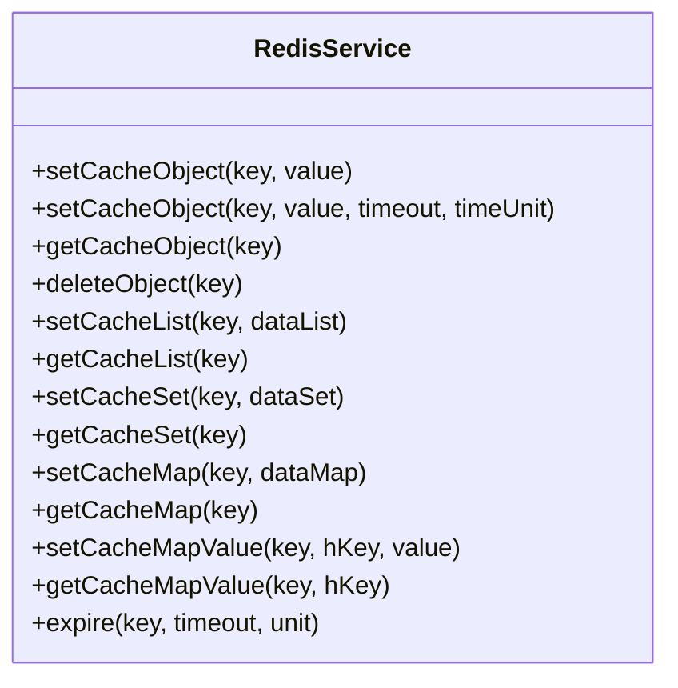
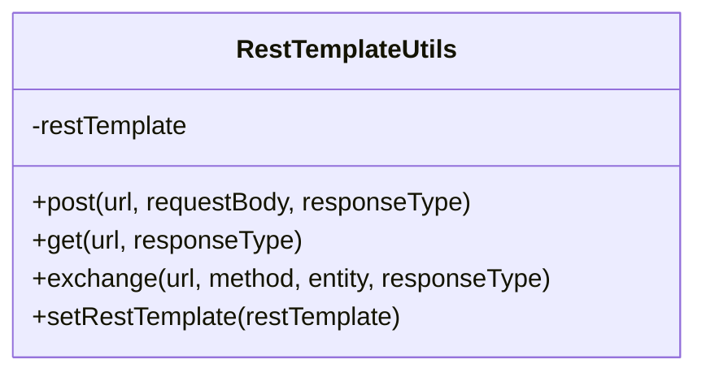
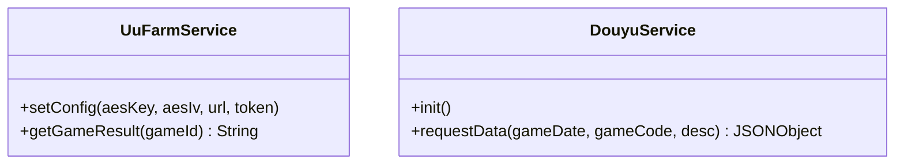
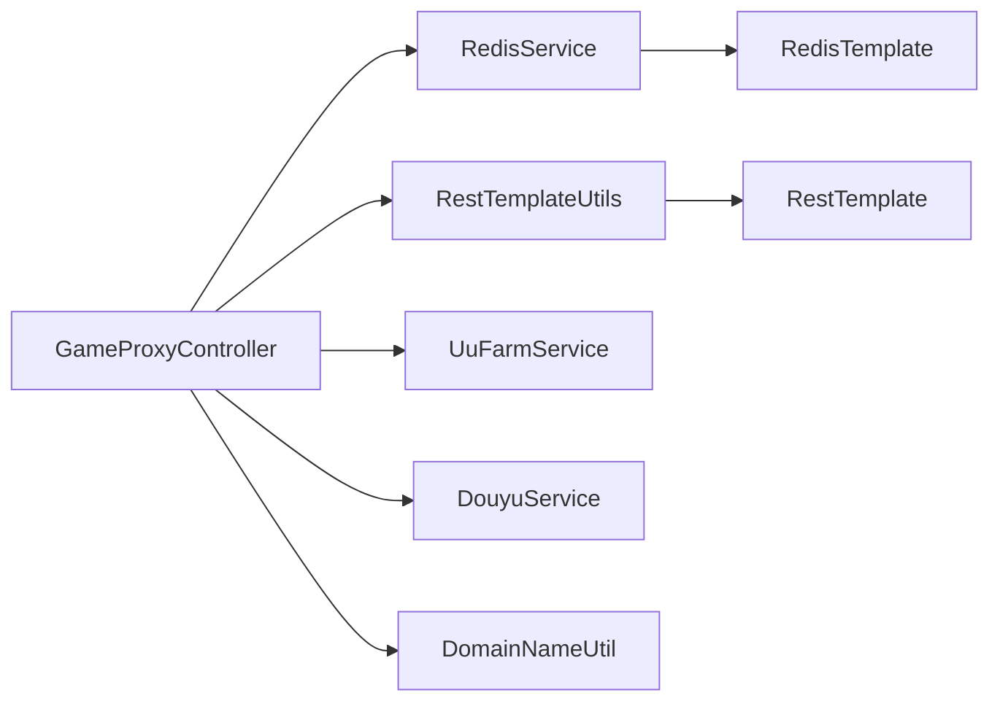

# 新功能开发流程

<cite>
**本文引用的文件**
- [AppApplication.java](file://game-proxy/src/main/java/com/game/AppApplication.java)
- [GameProxyController.java](file://game-proxy/src/main/java/com/game/controller/GameProxyController.java)
- [RedisService.java](file://game-proxy/src/main/java/com/game/redis/RedisService.java)
- [RestTemplateUtils.java](file://game-proxy/src/main/java/com/game/commom/RestTemplateUtils.java)
- [DomainNameUtil.java](file://game-proxy/src/main/java/com/game/utils/DomainNameUtil.java)
- [UuFarmService.java](file://game-proxy/src/main/java/com/game\uc/UuFarmService.java)
- [DouyuService.java](file://game-proxy/src/main/java/com/game/douyu/DouyuService.java)
- [application.yml](file://game-proxy/src/main/resources/application.yml)
- [pom.xml](file://game-proxy/pom.xml)
- [RedisTest.java](file://game-proxy/src/test/java/RedisTest.java)
- [Game1009HttpClient.java](file://game-lf/src/main/java/com/listener/Game1009HttpClient.java)
- [GameYqlyyWsClient.java](file://TigerTeeth/src/main/java/com/yqlyy/GameYqlyyWsClient.java)
</cite>

## 目录
1. [引言](#引言)
2. [项目结构](#项目结构)
3. [核心组件](#核心组件)
4. [架构总览](#架构总览)
5. [详细组件分析](#详细组件分析)
6. [依赖关系分析](#依赖关系分析)
7. [性能考量](#性能考量)
8. [故障排查指南](#故障排查指南)
9. [结论](#结论)
10. [附录](#附录)

## 引言
本文件面向“游戏代理系统”的新功能开发，提供从需求分析到上线运维的全流程规范。结合现有代码库，明确需求收集、技术可行性评估、风险分析、设计规范、编码标准、测试验证、CI/CD 流程、文档规范、版本与变更控制、回归与质量保障以及进度与风险管理方法，确保交付高质量、可维护、可扩展的功能。

## 项目结构
该仓库包含多个子模块，其中与“游戏代理系统”直接相关的是 game-proxy 模块，其核心由 Spring Boot 启动入口、控制器层、通用工具、Redis 缓存服务、第三方服务对接等组成。其他模块如 game-lf、TigerTeeth 等展示了定时任务、WebSocket 客户端与代理系统联动的实践案例。

图表来源
- [AppApplication.java](file://game-proxy/src/main/java/com/game/AppApplication.java#L15-L31)
- [GameProxyController.java](file://game-proxy/src/main/java/com/game/controller/GameProxyController.java#L36-L39)
- [RedisService.java](file://game-proxy/src/main/java/com/game/redis/RedisService.java#L18-L22)
- [RestTemplateUtils.java](file://game-proxy/src/main/java/com/game/commom/RestTemplateUtils.java#L13-L49)
- [UuFarmService.java](file://game-proxy/src/main/java/com/game\uc/UuFarmService.java#L20-L22)
- [DouyuService.java](file://game-proxy/src/main/java/com/game/douyu/DouyuService.java#L18-L25)
- [DomainNameUtil.java](file://game-proxy/src/main/java/com/game/utils/DomainNameUtil.java#L3-L15)
- [application.yml](file://game-proxy/src/main/resources/application.yml#L1-L58)
- [pom.xml](file://game-proxy/pom.xml#L1-L163)

章节来源
- [AppApplication.java](file://game-proxy/src/main/java/com/game/AppApplication.java#L15-L31)
- [pom.xml](file://game-proxy/pom.xml#L1-L163)

## 核心组件
- 启动入口与环境输出：负责应用启动、端口与路径输出、环境变量读取。
- 控制器层：统一对外提供代理接口，封装 HTTP 调用、Redis 缓存、定时任务触发、图片识别与自开测试等能力。
- 缓存服务：基于 Redis 的通用读写、过期、批量操作等能力。
- HTTP 工具：封装 RestTemplate 的 GET/POST/exchange 能力，便于统一调用。
- 第三方服务对接：如 uu 农场、斗鱼等外部接口的适配与调用。
- 配置中心：通过 application.yml 统一管理端口、Redis、HTTP 连接池、业务域等。

章节来源
- [GameProxyController.java](file://game-proxy/src/main/java/com/game/controller/GameProxyController.java#L36-L436)
- [RedisService.java](file://game-proxy/src/main/java/com/game/redis/RedisService.java#L18-L244)
- [RestTemplateUtils.java](file://game-proxy/src/main/java/com/game/commom/RestTemplateUtils.java#L13-L51)
- [UuFarmService.java](file://game-proxy/src/main/java/com/game\uc/UuFarmService.java#L20-L135)
- [DouyuService.java](file://game-proxy/src/main/java/com/game/douyu/DouyuService.java#L18-L60)
- [application.yml](file://game-proxy/src/main/resources/application.yml#L1-L58)

## 架构总览
系统采用“控制器-服务-缓存-外部接口”的分层架构，控制器负责对外暴露 HTTP 接口，服务层处理业务逻辑，缓存层提供高性能读写，外部接口通过 HTTP 工具进行统一调用。

图表来源
- [GameProxyController.java](file://game-proxy/src/main/java/com/game/controller/GameProxyController.java#L36-L39)
- [RedisService.java](file://game-proxy/src/main/java/com/game/redis/RedisService.java#L18-L22)
- [RestTemplateUtils.java](file://game-proxy/src/main/java/com/game/commom/RestTemplateUtils.java#L13-L49)
- [UuFarmService.java](file://game-proxy/src/main/java/com/game\uc/UuFarmService.java#L20-L22)
- [DouyuService.java](file://game-proxy/src/main/java/com/game/douyu/DouyuService.java#L18-L25)

## 详细组件分析

### 控制器层（GameProxyController）
- 职责：提供游戏代理、信息查询、时间同步、图片识别、自开测试等接口。
- 关键点：
  - 统一前缀 /proxy，按游戏维度划分接口。
  - 使用 RedisService 读写缓存，支持 TTL。
  - 使用 RestTemplateUtils 统一封装 HTTP 调用。
  - 部分接口对请求频率进行限流保护。
  - 与 DomainNameUtil 中的多域名配置配合，实现多活容灾。

图表来源
- [GameProxyController.java](file://game-proxy/src/main/java/com/game/controller/GameProxyController.java#L51-L58)
- [RestTemplateUtils.java](file://game-proxy/src/main/java/com/game/commom/RestTemplateUtils.java#L38-L44)

章节来源
- [GameProxyController.java](file://game-proxy/src/main/java/com/game/controller/GameProxyController.java#L36-L436)
- [DomainNameUtil.java](file://game-proxy/src/main/java/com/game/utils/DomainNameUtil.java#L3-L15)

### 缓存层（RedisService）
- 职责：提供对象、列表、集合、哈希等多类型缓存操作，支持过期时间设置与批量删除。
- 关键点：
  - 统一使用 RedisTemplate，避免分散实现。
  - 支持多种数据结构与常用操作，满足不同业务场景。

图表来源
- [RedisService.java](file://game-proxy/src/main/java/com/game/redis/RedisService.java#L18-L244)

章节来源
- [RedisService.java](file://game-proxy/src/main/java/com/game/redis/RedisService.java#L18-L244)

### HTTP 工具（RestTemplateUtils）
- 职责：封装 RestTemplate 的 GET/POST/exchange 方法，注入静态模板以便在非 Spring 环境下使用。
- 关键点：
  - 静态注入 RestTemplate，简化调用。
  - 统一异常处理由上层控制器捕获。

图表来源
- [RestTemplateUtils.java](file://game-proxy/src/main/java/com/game/commom/RestTemplateUtils.java#L13-L51)

章节来源
- [RestTemplateUtils.java](file://game-proxy/src/main/java/com/game/commom/RestTemplateUtils.java#L13-L51)

### 第三方服务对接（UuFarmService、DouyuService）
- UuFarmService：封装 uu 农场的加密请求、调用与解析流程，便于在控制器中复用。
- DouyuService：封装斗鱼接口请求参数与调用，配合线程池执行初始化任务。

图表来源
- [UuFarmService.java](file://game-proxy/src/main/java/com/game\uc/UuFarmService.java#L20-L135)
- [DouyuService.java](file://game-proxy/src/main/java/com/game/douyu/DouyuService.java#L18-L60)

章节来源
- [UuFarmService.java](file://game-proxy/src/main/java/com/game\uc/UuFarmService.java#L20-L135)
- [DouyuService.java](file://game-proxy/src/main/java/com/game/douyu/DouyuService.java#L18-L60)

### 配置与构建（application.yml、pom.xml）
- application.yml：集中管理 server 端口、context-path、Redis 连接、HTTP 连接池、业务域等。
- pom.xml：统一 Java 版本、Spring Boot 版本、依赖与插件配置，启用 spring-boot-maven-plugin。

章节来源
- [application.yml](file://game-proxy/src/main/resources/application.yml#L1-L58)
- [pom.xml](file://game-proxy/pom.xml#L1-L163)

## 依赖关系分析
- 控制器依赖 RedisService、RestTemplateUtils、第三方服务（UuFarmService、DouyuService）与域名配置。
- RedisService 依赖 RedisTemplate。
- RestTemplateUtils 依赖 RestTemplate。
- 第三方服务依赖 HTTP 客户端与加密工具。

图表来源
- [GameProxyController.java](file://game-proxy/src/main/java/com/game/controller/GameProxyController.java#L36-L84)
- [RedisService.java](file://game-proxy/src/main/java/com/game/redis/RedisService.java#L18-L22)
- [RestTemplateUtils.java](file://game-proxy/src/main/java/com/game/commom/RestTemplateUtils.java#L13-L49)
- [UuFarmService.java](file://game-proxy/src/main/java/com/game\uc/UuFarmService.java#L20-L22)
- [DouyuService.java](file://game-proxy/src/main/java/com/game/douyu/DouyuService.java#L18-L25)
- [DomainNameUtil.java](file://game-proxy/src/main/java/com/game/utils/DomainNameUtil.java#L3-L15)

章节来源
- [GameProxyController.java](file://game-proxy/src/main/java/com/game/controller/GameProxyController.java#L36-L84)
- [RedisService.java](file://game-proxy/src/main/java/com/game/redis/RedisService.java#L18-L22)
- [RestTemplateUtils.java](file://game-proxy/src/main/java/com/game/commom/RestTemplateUtils.java#L13-L49)
- [UuFarmService.java](file://game-proxy/src/main/java/com/game\uc/UuFarmService.java#L20-L22)
- [DouyuService.java](file://game-proxy/src/main/java/com/game/douyu/DouyuService.java#L18-L25)
- [DomainNameUtil.java](file://game-proxy/src/main/java/com/game/utils/DomainNameUtil.java#L3-L15)

## 性能考量
- HTTP 连接池：通过 application.yml 配置连接总数、并发、超时等参数，避免连接风暴。
- Redis 过期策略：针对临时数据设置 TTL，减少内存占用。
- 接口限流：控制器对高频接口进行限流，避免外部系统压力过大。
- 异步与线程池：第三方服务可通过线程池异步初始化与调度，提升吞吐。

章节来源
- [application.yml](file://game-proxy/src/main/resources/application.yml#L43-L58)
- [GameProxyController.java](file://game-proxy/src/main/java/com/game/controller/GameProxyController.java#L357-L412)
- [DouyuService.java](file://game-proxy/src/main/java/com/game/douyu/DouyuService.java#L27-L36)

## 故障排查指南
- 日志输出：启动时输出访问地址与 Swagger 地址，便于快速定位。
- Redis 连接：确认 host、port、password、pool 参数正确。
- HTTP 超时：调整连接超时、读取超时与连接池大小。
- 控制器异常：关注 RestClientException 与通用异常日志，定位上游接口问题。
- 单元测试：可参考 RedisTest 示例，验证缓存读写与序列化配置。

章节来源
- [AppApplication.java](file://game-proxy/src/main/java/com/game/AppApplication.java#L24-L31)
- [application.yml](file://game-proxy/src/main/resources/application.yml#L15-L58)
- [RedisTest.java](file://game-proxy/src/test/java/RedisTest.java#L12-L95)

## 结论
本流程以现有代码库为基础，明确了从需求到上线的全生命周期规范。通过统一的控制器、缓存与 HTTP 工具，结合清晰的配置与构建体系，能够高效、稳定地交付新功能，并具备良好的扩展性与可维护性。

## 附录

### 需求分析阶段工作内容
- 需求收集：明确代理目标游戏、接口范围、数据流转与依赖关系。
- 技术可行性评估：评估 Redis、HTTP 工具、第三方服务接入的成熟度与限制。
- 风险分析：识别网络延迟、外部接口稳定性、缓存一致性与并发风险。

### 设计阶段规范
- 架构设计：遵循“控制器-服务-缓存-外部接口”分层，保持高内聚低耦合。
- 接口设计：统一前缀与命名规范，明确请求/响应结构与错误码。
- 数据库设计：优先使用 Redis 缓存，必要时补充关系型数据库表结构与索引设计。

### 代码实现标准流程
- 分支创建：基于 develop 创建 feature 分支，命名清晰（如 feature/game-time-sync）。
- 代码编写：遵循现有风格（Lombok、Hutool、OkHttp、RestTemplate），统一异常处理。
- 本地测试：启动应用，验证接口、缓存读写、第三方调用与日志输出。
- 代码审查：重点检查接口幂等、缓存策略、异常处理与安全（如 AES 参数）。

### 测试验证要求
- 单元测试：覆盖 RedisService 常用操作、UuFarmService 加解密与解析逻辑。
- 集成测试：模拟控制器与外部接口交互，验证 HTTP 调用与缓存同步。
- 性能测试：压测控制器高频接口，验证连接池与限流策略有效性。

### 持续集成与部署
- 构建：使用 Maven 插件打包，过滤资源，设置编码与 Java 版本。
- 打包：生成可执行 JAR，包含依赖。
- 发布：将产物部署至目标服务器，配置 application.yml，启动并验证日志。

章节来源
- [pom.xml](file://game-proxy/pom.xml#L102-L160)
- [application.yml](file://game-proxy/src/main/resources/application.yml#L1-L58)

### 功能文档编写规范
- API 文档：基于控制器注释与实际接口，描述请求参数、响应结构与示例。
- 设计文档：说明架构图、数据流图、缓存策略与第三方对接方案。
- 技术说明：记录依赖版本、配置项含义、常见问题与排障步骤。

### 版本管理与变更控制
- 版本号：遵循语义化版本，主版本号用于破坏性变更，次版本号用于新增功能，修订号用于修复。
- 变更日志：记录每次变更的动机、影响范围与回滚策略。
- 合并策略：通过 Pull Request 进行代码审查，合并前完成测试与评审。

### 回归测试与质量保证
- 回归测试：每次发布前对核心接口与缓存链路进行回归验证。
- 质量门禁：强制通过单元测试与静态检查，禁止带缺陷进入主干。

### 开发进度跟踪与风险管理
- 进度跟踪：使用看板或任务管理工具，拆解需求为可验证的小迭代。
- 风险管理：定期评估外部依赖变化、容量与性能瓶颈，制定应急预案。

### 实践案例参考
- 来疯直播定时同步游戏开始时间：展示控制器与上游定时任务的联动。
- 虎牙 WebSocket 客户端同步时间：展示上游系统通过代理系统更新时间。

章节来源
- [Game1009HttpClient.java](file://game-lf/src/main/java/com/listener/Game1009HttpClient.java#L134-L186)
- [GameYqlyyWsClient.java](file://TigerTeeth/src/main/java/com/yqlyy/GameYqlyyWsClient.java#L136-L158)