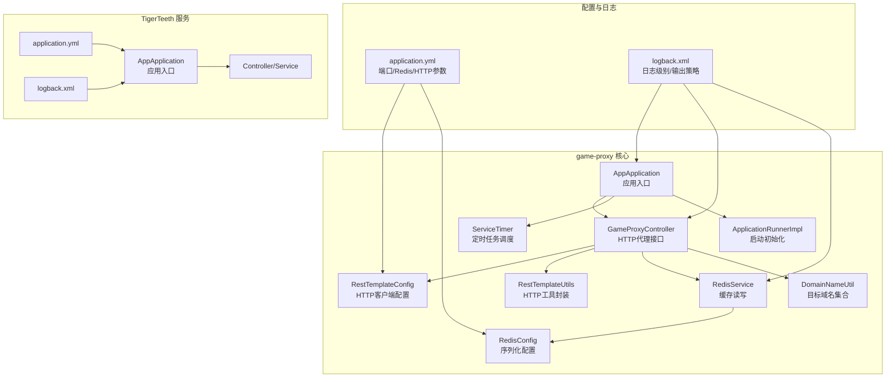
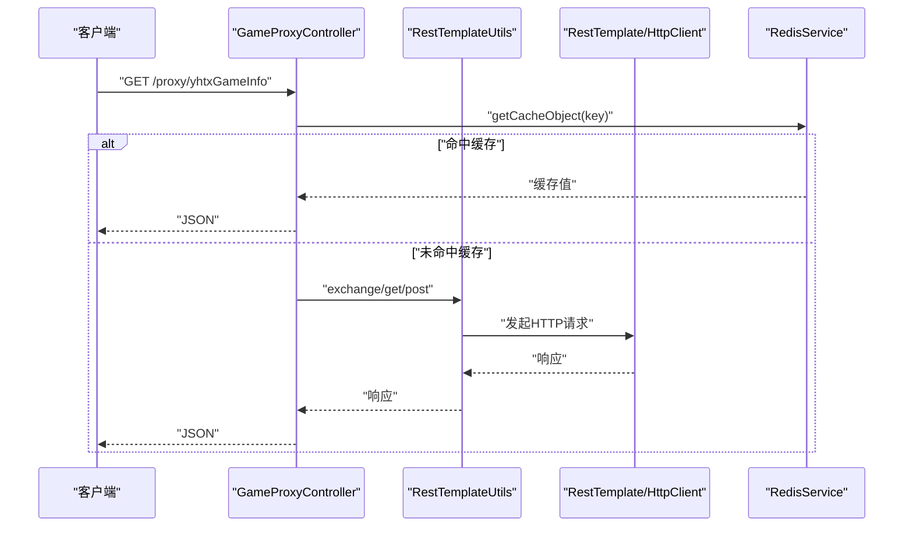
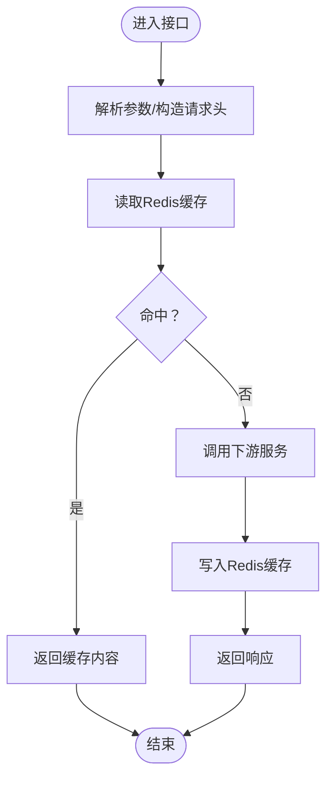
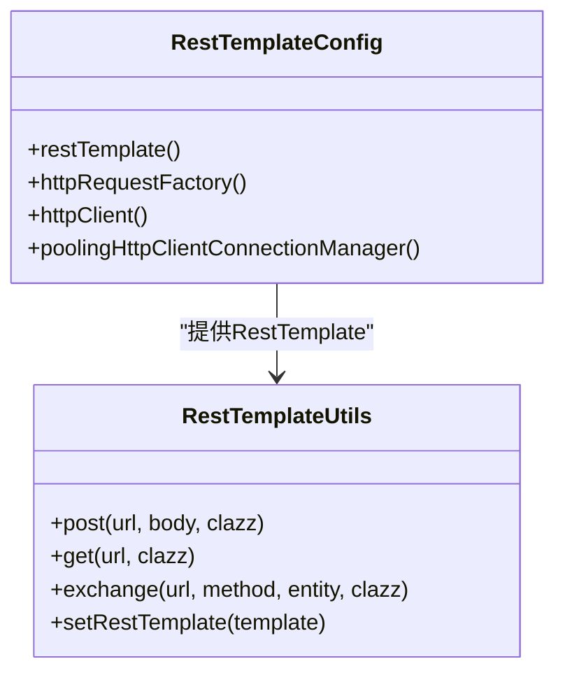
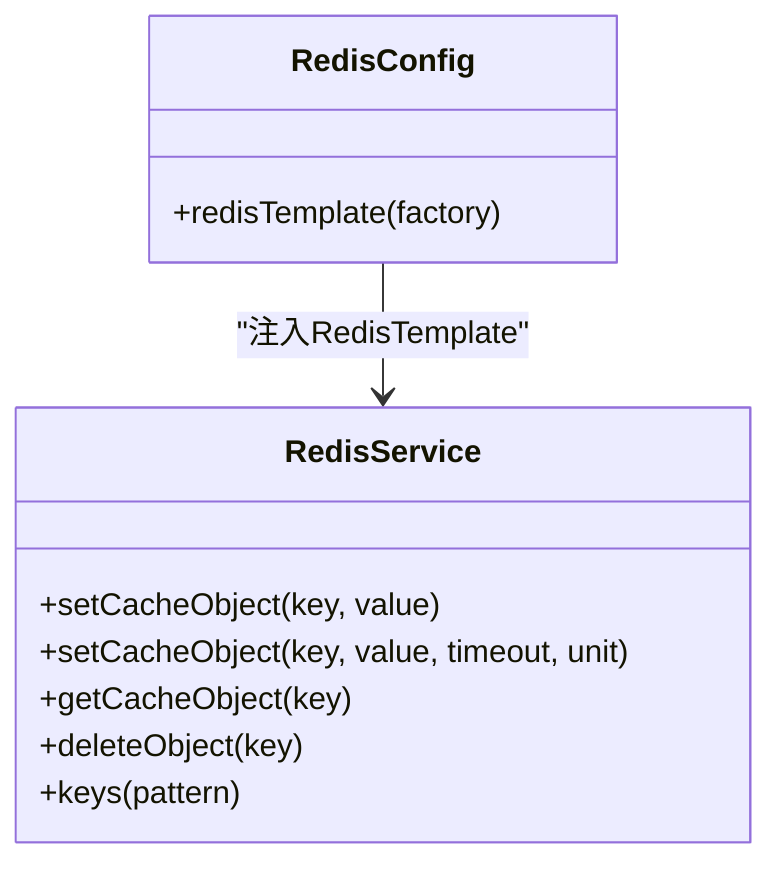
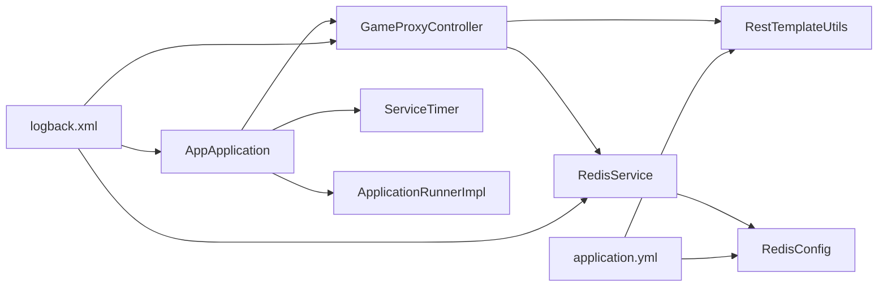

# 调试与问题定位

<cite>
**本文引用的文件**
- [game-proxy/src/main/resources/application.yml](file://game-proxy/src/main/resources/application.yml)
- [game-proxy/src/main/resources/logback.xml](file://game-proxy/src/main/resources/logback.xml)
- [game-proxy/src/main/java/com/game/AppApplication.java](file://game-proxy/src/main/java/com/game/AppApplication.java)
- [game-proxy/src/main/java/com/game/controller/GameProxyController.java](file://game-proxy/src/main/java/com/game/controller/GameProxyController.java)
- [game-proxy/src/main/java/com/game/redis/RedisConfig.java](file://game-proxy/src/main/java/com/game/redis/RedisConfig.java)
- [game-proxy/src/main/java/com/game/redis/RedisService.java](file://game-proxy/src/main/java/com/game/redis/RedisService.java)
- [game-proxy/src/main/java/com/game/timer/ServiceTimer.java](file://game-proxy/src/main/java/com/game/timer/ServiceTimer.java)
- [game-proxy/src/main/java/com/game/utils/SpringUtils.java](file://game-proxy/src/main/java/com/game/utils/SpringUtils.java)
- [game-proxy/src/main/java/com/game/commom/RestTemplateConfig.java](file://game-proxy/src/main/java/com/game/commom/RestTemplateConfig.java)
- [game-proxy/src/main/java/com/game/commom/RestTemplateUtils.java](file://game-proxy/src/main/java/com/game/commom/RestTemplateUtils.java)
- [game-proxy/src/main/java/com/game/utils/DomainNameUtil.java](file://game-proxy/src/main/java/com/game/utils/DomainNameUtil.java)
- [game-proxy/src/main/java/com/game/listener/ApplicationRunnerImpl.java](file://game-proxy/src/main/java/com/game/listener/ApplicationRunnerImpl.java)
- [TigerTeeth/src/main/resources/application.yml](file://TigerTeeth/src/main/resources/application.yml)
- [TigerTeeth/src/main/resources/logback.xml](file://TigerTeeth/src/main/resources/logback.xml)
</cite>

## 目录
1. [简介](#简介)
2. [项目结构](#项目结构)
3. [核心组件](#核心组件)
4. [架构总览](#架构总览)
5. [详细组件分析](#详细组件分析)
6. [依赖关系分析](#依赖关系分析)
7. [性能考量](#性能考量)
8. [故障排查指南](#故障排查指南)
9. [结论](#结论)
10. [附录](#附录)

## 简介
本指南面向游戏代理系统的开发与运维人员，围绕调试工具使用、日志分析、常见问题诊断、性能定位、异常追踪、监控指标采集以及生产应急流程进行系统化说明，并配套实用的命令与脚本示例，帮助快速定位与解决问题。

## 项目结构
本仓库包含多个子模块，其中与代理系统直接相关的模块为 game-proxy；TigerTeeth 作为另一个独立服务，二者共享部分通用组件与配置风格。下图展示与调试相关的关键文件与职责：

图表来源
- [game-proxy/src/main/java/com/game/AppApplication.java](file://game-proxy/src/main/java/com/game/AppApplication.java#L1-L33)
- [game-proxy/src/main/java/com/game/controller/GameProxyController.java](file://game-proxy/src/main/java/com/game/controller/GameProxyController.java#L1-L436)
- [game-proxy/src/main/java/com/game/commom/RestTemplateConfig.java](file://game-proxy/src/main/java/com/game/commom/RestTemplateConfig.java#L1-L132)
- [game-proxy/src/main/java/com/game/commom/RestTemplateUtils.java](file://game-proxy/src/main/java/com/game/commom/RestTemplateUtils.java#L1-L51)
- [game-proxy/src/main/java/com/game/redis/RedisService.java](file://game-proxy/src/main/java/com/game/redis/RedisService.java#L1-L244)
- [game-proxy/src/main/java/com/game/redis/RedisConfig.java](file://game-proxy/src/main/java/com/game/redis/RedisConfig.java#L1-L41)
- [game-proxy/src/main/java/com/game/timer/ServiceTimer.java](file://game-proxy/src/main/java/com/game/timer/ServiceTimer.java#L1-L164)
- [game-proxy/src/main/java/com/game/listener/ApplicationRunnerImpl.java](file://game-proxy/src/main/java/com/game/listener/ApplicationRunnerImpl.java#L1-L174)
- [game-proxy/src/main/java/com/game/utils/DomainNameUtil.java](file://game-proxy/src/main/java/com/game/utils/DomainNameUtil.java#L1-L16)
- [game-proxy/src/main/resources/application.yml](file://game-proxy/src/main/resources/application.yml#L1-L58)
- [game-proxy/src/main/resources/logback.xml](file://game-proxy/src/main/resources/logback.xml#L1-L75)
- [TigerTeeth/src/main/resources/application.yml](file://TigerTeeth/src/main/resources/application.yml#L1-L31)
- [TigerTeeth/src/main/resources/logback.xml](file://TigerTeeth/src/main/resources/logback.xml#L1-L75)

章节来源
- [game-proxy/src/main/resources/application.yml](file://game-proxy/src/main/resources/application.yml#L1-L58)
- [game-proxy/src/main/resources/logback.xml](file://game-proxy/src/main/resources/logback.xml#L1-L75)
- [game-proxy/src/main/java/com/game/AppApplication.java](file://game-proxy/src/main/java/com/game/AppApplication.java#L1-L33)
- [TigerTeeth/src/main/resources/application.yml](file://TigerTeeth/src/main/resources/application.yml#L1-L31)
- [TigerTeeth/src/main/resources/logback.xml](file://TigerTeeth/src/main/resources/logback.xml#L1-L75)

## 核心组件
- 应用入口与启动
  - 应用启动后打印本地与外网访问地址及文档地址，便于快速验证服务状态与端口映射。
- HTTP代理控制器
  - 提供多游戏信息查询与时间同步接口，内部通过 RestTemplate 发起下游请求，并使用 Redis 缓存结果。
- HTTP 客户端配置
  - 基于 Apache HttpClient 的连接池与超时策略，统一设置 Socket 超时、连接超时、并发上限等参数。
- Redis 缓存服务
  - 提供通用的键值、列表、集合、哈希等操作，支持过期时间设置与批量操作。
- 定时任务调度
  - 自定义调度器，支持一次性与周期性任务，内置清理逻辑避免任务表膨胀。
- 启动初始化
  - 在应用启动阶段可按需初始化 WebSocket 客户端或后台任务，便于联调与预热。
- 日志与配置
  - Logback 按 INFO/ERROR 分离落盘，控制台输出便于本地调试；application.yml 统一管理端口、Redis、HTTP 参数。

章节来源
- [game-proxy/src/main/java/com/game/AppApplication.java](file://game-proxy/src/main/java/com/game/AppApplication.java#L24-L31)
- [game-proxy/src/main/java/com/game/controller/GameProxyController.java](file://game-proxy/src/main/java/com/game/controller/GameProxyController.java#L41-L436)
- [game-proxy/src/main/java/com/game/commom/RestTemplateConfig.java](file://game-proxy/src/main/java/com/game/commom/RestTemplateConfig.java#L34-L132)
- [game-proxy/src/main/java/com/game/redis/RedisService.java](file://game-proxy/src/main/java/com/game/redis/RedisService.java#L20-L244)
- [game-proxy/src/main/java/com/game/timer/ServiceTimer.java](file://game-proxy/src/main/java/com/game/timer/ServiceTimer.java#L16-L164)
- [game-proxy/src/main/java/com/game/listener/ApplicationRunnerImpl.java](file://game-proxy/src/main/java/com/game/listener/ApplicationRunnerImpl.java#L64-L145)
- [game-proxy/src/main/resources/logback.xml](file://game-proxy/src/main/resources/logback.xml#L60-L74)
- [game-proxy/src/main/resources/application.yml](file://game-proxy/src/main/resources/application.yml#L1-L58)

## 架构总览
下图展示代理系统的关键交互路径：客户端请求经由控制器进入，控制器根据业务选择 Redis 或 HTTP 下游，最终返回响应。

图表来源
- [game-proxy/src/main/java/com/game/controller/GameProxyController.java](file://game-proxy/src/main/java/com/game/controller/GameProxyController.java#L82-L105)
- [game-proxy/src/main/java/com/game/commom/RestTemplateUtils.java](file://game-proxy/src/main/java/com/game/commom/RestTemplateUtils.java#L13-L51)
- [game-proxy/src/main/java/com/game/redis/RedisService.java](file://game-proxy/src/main/java/com/game/redis/RedisService.java#L95-L98)

## 详细组件分析

### 组件A：HTTP代理控制器（GameProxyController）
- 功能要点
  - 提供多游戏信息查询接口，统一从 Redis 读取；若无缓存则调用下游服务并回填缓存。
  - 提供时间同步接口，将解析后的时间写入 Redis，支持短期缓存。
  - 提供图片识别接口，对输入图片进行识别并同步结果至下游服务。
- 关键日志
  - 所有请求参数与响应均记录 INFO 级日志，便于回溯。
  - 异常场景记录 WARN/ERROR 级日志，便于定位失败原因。
- 断点建议
  - 在请求进入与响应返回处设置断点，观察参数与返回值。
  - 在 Redis 读写前后设置断点，确认缓存命中与写入时机。
  - 在 HTTP 调用前后设置断点，确认下游响应与异常传播。

图表来源
- [game-proxy/src/main/java/com/game/controller/GameProxyController.java](file://game-proxy/src/main/java/com/game/controller/GameProxyController.java#L41-L105)

章节来源
- [game-proxy/src/main/java/com/game/controller/GameProxyController.java](file://game-proxy/src/main/java/com/game/controller/GameProxyController.java#L41-L436)

### 组件B：HTTP 客户端配置（RestTemplateConfig/RestTemplateUtils）
- 功能要点
  - 统一配置连接池大小、并发上限、超时时间、Keep-Alive 策略与重试机制。
  - 提供静态工具方法封装 GET/POST/exchange，简化控制器调用。
- 调试要点
  - 通过 application.yml 调整超时与并发参数，观察下游稳定性变化。
  - 在异常分支增加断点，定位超时、连接失败、协议错误等问题。

图表来源
- [game-proxy/src/main/java/com/game/commom/RestTemplateConfig.java](file://game-proxy/src/main/java/com/game/commom/RestTemplateConfig.java#L34-L132)
- [game-proxy/src/main/java/com/game/commom/RestTemplateUtils.java](file://game-proxy/src/main/java/com/game/commom/RestTemplateUtils.java#L13-L51)

章节来源
- [game-proxy/src/main/java/com/game/commom/RestTemplateConfig.java](file://game-proxy/src/main/java/com/game/commom/RestTemplateConfig.java#L34-L132)
- [game-proxy/src/main/java/com/game/commom/RestTemplateUtils.java](file://game-proxy/src/main/java/com/game/commom/RestTemplateUtils.java#L13-L51)
- [game-proxy/src/main/resources/application.yml](file://game-proxy/src/main/resources/application.yml#L43-L58)

### 组件C：Redis 缓存服务（RedisService/RedisConfig）
- 功能要点
  - 提供通用的字符串、列表、集合、哈希等操作，支持过期时间设置。
  - RedisTemplate 使用 JSON 序列化，便于跨语言与可观测性。
- 调试要点
  - 在写入前检查 key 命中情况，确认过期策略是否符合预期。
  - 使用 keys/pattern 查看键空间，定位异常增长或误删。

图表来源
- [game-proxy/src/main/java/com/game/redis/RedisConfig.java](file://game-proxy/src/main/java/com/game/redis/RedisConfig.java#L27-L39)
- [game-proxy/src/main/java/com/game/redis/RedisService.java](file://game-proxy/src/main/java/com/game/redis/RedisService.java#L30-L107)

章节来源
- [game-proxy/src/main/java/com/game/redis/RedisConfig.java](file://game-proxy/src/main/java/com/game/redis/RedisConfig.java#L1-L41)
- [game-proxy/src/main/java/com/game/redis/RedisService.java](file://game-proxy/src/main/java/com/game/redis/RedisService.java#L1-L244)

### 组件D：定时任务调度（ServiceTimer）
- 功能要点
  - 基于 ScheduledThreadPoolExecutor 的扩展，支持一次性与固定周期任务。
  - 内置清理逻辑，定期移除已取消任务，防止内存泄漏。
- 调试要点
  - 观察任务表大小与清理频率，确认任务未堆积。
  - 在任务执行前后增加断点，定位执行耗时与异常。

章节来源
- [game-proxy/src/main/java/com/game/timer/ServiceTimer.java](file://game-proxy/src/main/java/com/game/timer/ServiceTimer.java#L16-L164)

### 组件E：启动初始化（ApplicationRunnerImpl）
- 功能要点
  - 应用启动后可初始化 WebSocket 客户端或后台任务，便于联调与预热。
- 调试要点
  - 在启动阶段打开必要的初始化代码，观察连接与心跳行为。
  - 若存在异常，可在异常捕获处设置断点，查看重试与恢复逻辑。

章节来源
- [game-proxy/src/main/java/com/game/listener/ApplicationRunnerImpl.java](file://game-proxy/src/main/java/com/game/listener/ApplicationRunnerImpl.java#L64-L145)

## 依赖关系分析
- 控制器依赖 Redis 与 HTTP 工具，形成“读缓存—调下游—写缓存”的闭环。
- 定时器与启动器分别负责周期性任务与应用生命周期内的初始化。
- 日志与配置贯穿所有组件，统一输出与参数管理。

图表来源
- [game-proxy/src/main/java/com/game/controller/GameProxyController.java](file://game-proxy/src/main/java/com/game/controller/GameProxyController.java#L1-L436)
- [game-proxy/src/main/java/com/game/commom/RestTemplateUtils.java](file://game-proxy/src/main/java/com/game/commom/RestTemplateUtils.java#L1-L51)
- [game-proxy/src/main/java/com/game/redis/RedisService.java](file://game-proxy/src/main/java/com/game/redis/RedisService.java#L1-L244)
- [game-proxy/src/main/java/com/game/redis/RedisConfig.java](file://game-proxy/src/main/java/com/game/redis/RedisConfig.java#L1-L41)
- [game-proxy/src/main/java/com/game/timer/ServiceTimer.java](file://game-proxy/src/main/java/com/game/timer/ServiceTimer.java#L1-L164)
- [game-proxy/src/main/java/com/game/listener/ApplicationRunnerImpl.java](file://game-proxy/src/main/java/com/game/listener/ApplicationRunnerImpl.java#L1-L174)
- [game-proxy/src/main/resources/application.yml](file://game-proxy/src/main/resources/application.yml#L1-L58)
- [game-proxy/src/main/resources/logback.xml](file://game-proxy/src/main/resources/logback.xml#L1-L75)

## 性能考量
- 连接池与超时
  - 通过 application.yml 调整连接池大小与超时参数，避免下游抖动导致的请求堆积。
- 缓存命中率
  - 使用 Redis keys/pattern 观察键空间，结合控制器日志确认缓存命中与写入时机。
- 定时任务
  - 关注任务表清理频率与执行耗时，避免任务堆积引发 CPU 占用升高。
- 日志级别
  - 生产环境建议提升根日志级别至 WARN/ERROR，减少 IO 压力；仅在调试时临时降级。

章节来源
- [game-proxy/src/main/resources/application.yml](file://game-proxy/src/main/resources/application.yml#L43-L58)
- [game-proxy/src/main/resources/logback.xml](file://game-proxy/src/main/resources/logback.xml#L60-L74)
- [game-proxy/src/main/java/com/game/timer/ServiceTimer.java](file://game-proxy/src/main/java/com/game/timer/ServiceTimer.java#L100-L113)

## 故障排查指南

### IDE 调试器与断点设置
- 启动参数
  - 在 VM Options 中添加 JVM 调试参数，启用远程调试端口。
- 断点位置
  - 控制器入口与出口、Redis 读写前后、HTTP 调用前后。
- 条件断点
  - 对特定 URL、错误码或异常类型设置条件断点，缩小排查范围。

### 远程调试
- 步骤
  - 在目标服务器启动应用并开启调试端口。
  - 在 IDE 中新建 Remote JVM Debug 配置，连接目标主机与端口。
  - 设置断点并复现问题，观察变量与调用栈。

### 日志分析与工具
- 日志配置
  - INFO/ERROR 分离落盘，控制台输出便于本地调试。
  - 通过 application.yml 调整日志级别与输出策略。
- 关键日志识别
  - 请求参数与响应体：用于核对上游输入与下游输出。
  - 异常堆栈：用于定位失败原因与传播路径。
- 日志工具
  - 使用 tail/less/awk/grep 等命令过滤关键字，结合时间戳定位问题窗口。

章节来源
- [game-proxy/src/main/resources/logback.xml](file://game-proxy/src/main/resources/logback.xml#L1-L75)
- [game-proxy/src/main/java/com/game/controller/GameProxyController.java](file://game-proxy/src/main/java/com/game/controller/GameProxyController.java#L52-L58)

### 常见问题诊断流程

- 网络连接问题
  - 现象：HTTP 请求超时、连接失败。
  - 排查：检查 application.yml 中超时与并发参数；使用 curl/Postman 验证下游可达性；查看控制器异常日志。
  - 复现：在 RestTemplateUtils 断点，模拟慢响应或不可达场景。
  
  图表来源
  - [game-proxy/src/main/java/com/game/commom/RestTemplateUtils.java](file://game-proxy/src/main/java/com/game/commom/RestTemplateUtils.java#L26-L44)
  - [game-proxy/src/main/resources/application.yml](file://game-proxy/src/main/resources/application.yml#L43-L58)

- Redis 连接失败
  - 现象：缓存读写异常、过期设置失败。
  - 排查：核对 application.yml 中 Redis 地址、密码、端口；使用 redis-cli 测试连通性；查看 RedisService 异常日志。
  - 复现：在 RedisService 断点，模拟连接中断或认证失败。
  
  图表来源
  - [game-proxy/src/main/resources/application.yml](file://game-proxy/src/main/resources/application.yml#L15-L31)
  - [game-proxy/src/main/java/com/game/redis/RedisService.java](file://game-proxy/src/main/java/com/game/redis/RedisService.java#L30-L44)

- 定时任务异常
  - 现象：任务未执行、重复执行、任务表膨胀。
  - 排查：查看 ServiceTimer 清理日志与任务表大小；在任务执行前后断点，确认异常传播。
  
  图表来源
  - [game-proxy/src/main/java/com/game/timer/ServiceTimer.java](file://game-proxy/src/main/java/com/game/timer/ServiceTimer.java#L100-L113)

- WebSocket 连接中断
  - 现象：心跳丢失、消息延迟。
  - 排查：确认启动初始化逻辑是否启用；在 WebSocket 客户端断点，观察连接与重连策略。
  
  图表来源
  - [game-proxy/src/main/java/com/game/listener/ApplicationRunnerImpl.java](file://game-proxy/src/main/java/com/game/listener/ApplicationRunnerImpl.java#L103-L142)

### 性能问题定位
- 内存泄漏检测
  - 观察定时任务表是否持续增长；确认清理逻辑是否生效。
- CPU 使用率分析
  - 结合任务执行耗时与 HTTP 调用耗时，定位热点路径。
- 数据库查询优化
  - 本项目主要使用 Redis 与 HTTP 调用，如涉及数据库，请关注慢查询日志与索引使用情况。

章节来源
- [game-proxy/src/main/java/com/game/timer/ServiceTimer.java](file://game-proxy/src/main/java/com/game/timer/ServiceTimer.java#L100-L113)

### 错误处理与异常追踪
- 堆栈分析
  - 在控制器与 HTTP 工具层设置断点，观察异常传播路径与上下文信息。
- 异常链追踪
  - 使用日志中的异常堆栈定位根因；在工具类中增加更细粒度的日志标记。

章节来源
- [game-proxy/src/main/java/com/game/controller/GameProxyController.java](file://game-proxy/src/main/java/com/game/controller/GameProxyController.java#L398-L407)

### 监控指标采集与分析
- 系统资源监控
  - 使用系统自带监控工具采集 CPU、内存、磁盘与网络；结合日志时间窗分析异常。
- 业务指标监控
  - 统计接口 QPS、成功率、P95/P99 延迟；在控制器中埋点记录关键指标。
- 日志驱动监控
  - 通过日志关键字统计与告警规则，实现业务异常的快速发现。

### 生产环境应急处理流程
- 快速止损
  - 降低日志级别、暂停高风险任务、回滚最近变更。
- 逐步恢复
  - 修复后先在预生产验证，再灰度发布。
- 复盘总结
  - 输出故障报告，沉淀排查手册与自动化脚本。

## 结论
通过统一的配置与日志体系、清晰的组件边界与调试断点策略，可以高效定位游戏代理系统中的网络、缓存、定时与 WebSocket 等问题。建议在开发与测试阶段充分使用 IDE 调试与远程调试，在生产阶段以日志与指标为核心进行观测与应急处置。

## 附录

### 调试工具与脚本使用指南
- curl 命令
  - 查询游戏信息：curl -i http://localhost:8085/gameProxy/proxy/yhtxGameInfo
  - 上报时间：curl "http://localhost:8085/gameProxy/proxy/addYqlyyTime?time=120"
- Postman 测试
  - 导入接口集合，设置环境变量（端口、路径），批量执行用例。
- 数据库/缓存查询工具
  - Redis：使用 redis-cli keys/ping/expire 等命令验证连通性与键空间。
  - HTTP：使用浏览器开发者工具或 Postman 观察请求与响应头。

### 关键配置与日志参考路径
- 端口与 HTTP 参数
  - [application.yml](file://game-proxy/src/main/resources/application.yml#L1-L58)
- 日志级别与输出策略
  - [logback.xml](file://game-proxy/src/main/resources/logback.xml#L60-L74)
- TigerTeeth 服务配置（对比参考）
  - [application.yml](file://TigerTeeth/src/main/resources/application.yml#L1-L31)
  - [logback.xml](file://TigerTeeth/src/main/resources/logback.xml#L1-L75)