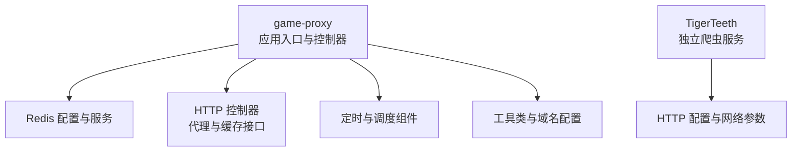
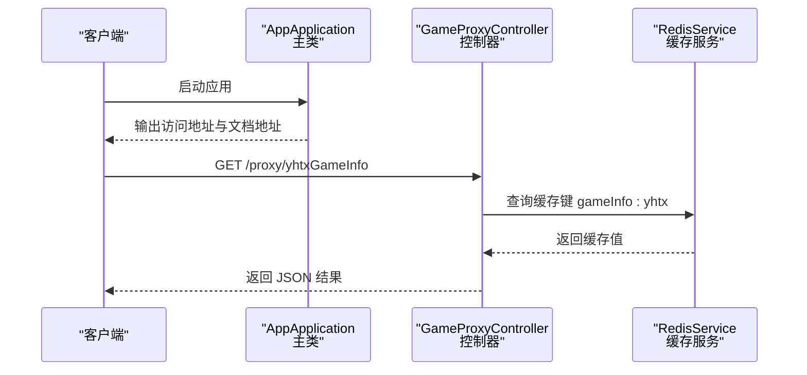
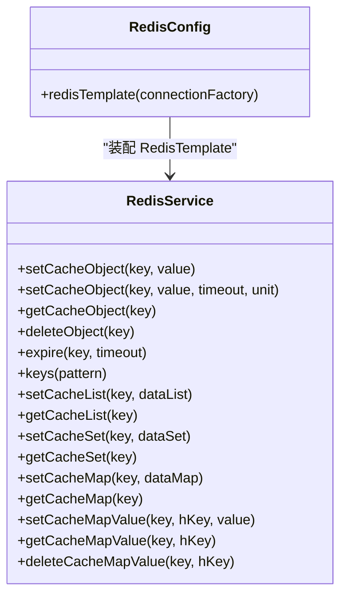
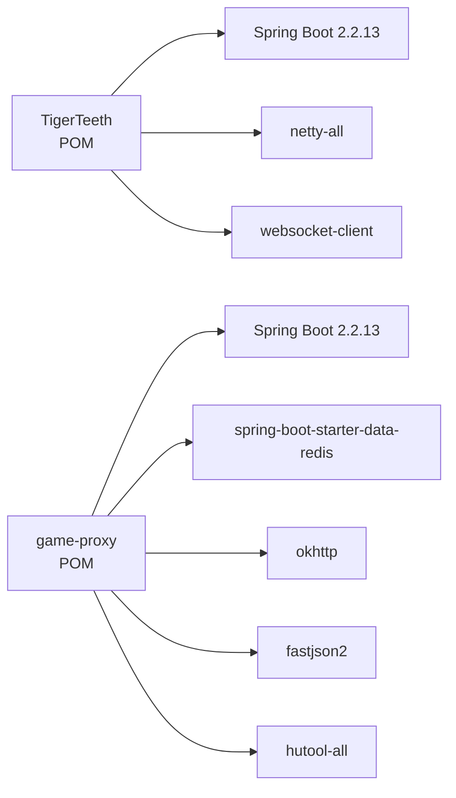

# 快速开始

<cite>
**本文引用的文件**
- [game-proxy/pom.xml](file://game-proxy/pom.xml)
- [game-proxy/src/main/resources/application.yml](file://game-proxy/src/main/resources/application.yml)
- [game-proxy/src/main/java/com/game/AppApplication.java](file://game-proxy/src/main/java/com/game/AppApplication.java)
- [game-proxy/src/main/java/com/game/controller/GameProxyController.java](file://game-proxy/src/main/java/com/game/controller/GameProxyController.java)
- [game-proxy/src/main/java/com/game/redis/RedisConfig.java](file://game-proxy/src/main/java/com/game/redis/RedisConfig.java)
- [game-proxy/src/main/java/com/game/redis/RedisService.java](file://game-proxy/src/main/java/com/game/redis/RedisService.java)
- [game-proxy/src/main/java/com/game/utils/DomainNameUtil.java](file://game-proxy/src/main/java/com/game/utils/DomainNameUtil.java)
- [TigerTeeth/pom.xml](file://TigerTeeth/pom.xml)
- [TigerTeeth/src/main/resources/application.yml](file://TigerTeeth/src/main/resources/application.yml)
- [TigerTeeth/src/main/java/com/Application.java](file://TigerTeeth/src/main/java/com/Application.java)
</cite>

## 目录
1. [简介](#简介)
2. [项目结构](#项目结构)
3. [核心组件](#核心组件)
4. [架构总览](#架构总览)
5. [详细组件分析](#详细组件分析)
6. [依赖关系分析](#依赖关系分析)
7. [性能与并发特性](#性能与并发特性)
8. [环境要求与安装](#环境要求与安装)
9. [构建与部署](#构建与部署)
10. [本地开发指南](#本地开发指南)
11. [基本使用示例](#基本使用示例)
12. [常见初始化问题与排障](#常见初始化问题与排障)
13. [结论](#结论)

## 简介
本指南面向新加入的开发者，帮助你在最短时间内完成环境准备、项目构建、服务启动与基础验证，理解系统的核心能力与常用接口。该代码库包含一个基于 Spring Boot 的游戏代理服务模块与若干爬虫/数据采集模块，其中游戏代理模块提供统一的 HTTP 接口，用于转发请求、读写 Redis 缓存、对接多款游戏服务，并内置定时任务与 WebSocket 客户端初始化逻辑。

## 项目结构
- game-proxy：游戏代理主模块，提供 HTTP 控制器、Redis 配置与服务、工具类与定时任务相关组件。
- TigerTeeth：虎牙相关爬虫模块，独立运行，提供 HTTP 服务与网络请求配置。
- 其他模块：bettaFish、game-cnydh、game-lf 等，当前快速开始不涉及其启动流程。

图表来源
- [game-proxy/src/main/java/com/game/AppApplication.java](file://game-proxy/src/main/java/com/game/AppApplication.java#L1-L33)
- [game-proxy/src/main/java/com/game/controller/GameProxyController.java](file://game-proxy/src/main/java/com/game/controller/GameProxyController.java#L1-L436)
- [game-proxy/src/main/java/com/game/redis/RedisConfig.java](file://game-proxy/src/main/java/com/game/redis/RedisConfig.java#L1-L41)
- [TigerTeeth/src/main/resources/application.yml](file://TigerTeeth/src/main/resources/application.yml#L1-L31)

章节来源
- [game-proxy/pom.xml](file://game-proxy/pom.xml#L1-L163)
- [TigerTeeth/pom.xml](file://TigerTeeth/pom.xml#L1-L160)

## 核心组件
- 应用入口与启动日志输出：通过主类启动 Spring Boot 应用，并在控制台输出访问地址与 Swagger 文档地址。
- Redis 配置与服务：使用 Lettuce 连接 Redis，采用 JSON 序列化存储对象，提供丰富的缓存操作方法。
- HTTP 控制器：提供游戏代理、缓存查询、时间同步、图片识别与自开奖等接口。
- 工具与域名配置：集中管理连接互动域名数组，便于批量推送开奖结果。

章节来源
- [game-proxy/src/main/java/com/game/AppApplication.java](file://game-proxy/src/main/java/com/game/AppApplication.java#L24-L31)
- [game-proxy/src/main/java/com/game/redis/RedisConfig.java](file://game-proxy/src/main/java/com/game/redis/RedisConfig.java#L27-L39)
- [game-proxy/src/main/java/com/game/redis/RedisService.java](file://game-proxy/src/main/java/com/game/redis/RedisService.java#L20-L243)
- [game-proxy/src/main/java/com/game/controller/GameProxyController.java](file://game-proxy/src/main/java/com/game/controller/GameProxyController.java#L36-L436)
- [game-proxy/src/main/java/com/game/utils/DomainNameUtil.java](file://game-proxy/src/main/java/com/game/utils/DomainNameUtil.java#L3-L15)

## 架构总览
下图展示了游戏代理模块的启动与请求处理路径，以及 Redis 缓存交互：

图表来源
- [game-proxy/src/main/java/com/game/AppApplication.java](file://game-proxy/src/main/java/com/game/AppApplication.java#L24-L31)
- [game-proxy/src/main/java/com/game/controller/GameProxyController.java](file://game-proxy/src/main/java/com/game/controller/GameProxyController.java#L88-L94)
- [game-proxy/src/main/java/com/game/redis/RedisService.java](file://game-proxy/src/main/java/com/game/redis/RedisService.java#L95-L98)

## 详细组件分析

### 控制器与接口
- 游戏代理接口：支持转发请求到目标 URL，返回原始响应。
- 缓存查询接口：按游戏标识从 Redis 读取缓存，如“银河探险”、“灵宠召唤”、“大话三国”等。
- 时间同步接口：支持上报与查询多款游戏的开赛时间，写入 Redis 并带过期策略。
- 图片识别与自开奖：提供图片识别与安全点位自开奖能力，部分接口带限流保护。
- 连接互动推送：将开奖结果同步至连接互动服务的多个域名实例。

```mermaid
flowchart TD
Start(["请求进入控制器"]) --> Type{"请求类型"}
Type --> |GET /proxy/yhtxGameInfo| ReadYHTX["读取 Redis 键 gameInfo:yhtx"]
Type --> |GET /proxy/lczhGameInfo| ReadLCZH["读取 Redis 键 gameInfo:lczh"]
Type --> |GET /proxy/dhsgGameInfo| ReadDHSG["读取 Redis 键 gameInfo:dhsg"]
Type --> |GET /proxy/bjxxhmGameInfo| ReadBJXXHM["读取 Redis 键 gameInfo:bjxxhm"]
Type --> |GET /proxy/bjxsgGameInfo| ReadBJXSG["读取 Redis 键 gameInfo:bjxsg"]
Type --> |GET /proxy/bjxgwbsGameInfo| ReadGWBS["读取 Redis 键 gameInfo:bjxgwbs"]
Type --> |GET /proxy/ljhdshmjGameInfo| ReadLJHD["读取 Redis 键 gameInfo:ljhdshmj"]
Type --> |GET /proxy/ljhdyztxGameInfo| ReadYZTX["读取 Redis 键 gameInfo:ljhdyztx"]
Type --> |GET /proxy/addUCTime| AddUC["写入 Redis 键 gameInfo:ucGameTime"]
Type --> |GET /proxy/getUCTime| GetUC["读取 Redis 键 gameInfo:ucGameTime"]
Type --> |GET /proxy/uuFarmGameInfo| UUFarm["调用 uuFarmService 获取结果"]
Type --> |GET /proxy/addYqlyyTime| AddYQ["写入 Redis 键 gameInfo:yqlyyTime"]
Type --> |GET /proxy/getYqlyyTime| GetYQ["读取 Redis 键 gameInfo:yqlyyTime"]
Type --> |POST /proxy/addDwydh| AddDWYDH["写入 Redis 键 gameInfo:GameTime:{gameId}"]
Type --> |GET /proxy/getdwydhTime| GetDWYDH["读取 Redis 键 gameInfo:dwydhGameTime"]
Type --> |GET /proxy/setGameTime| SetGT["写入 Redis 键 gameInfo:GameTime:{gameId}"]
Type --> |GET /proxy/getGameTime| GetGT["读取 Redis 键 gameInfo:GameTime:{gameId}"]
Type --> |GET /proxy/delGameTime| DelGT["删除 Redis 键 gameInfo:GameTime:{gameId}"]
Type --> |GET /proxy/shmjGameImageRecog| ImgRecog["图片识别并推送结果"]
Type --> |GET /proxy/selfOpening| SelfOpen["自开奖计算并返回结果"]
ReadYHTX --> End(["返回 JSON"])
ReadLCZH --> End
ReadDHSG --> End
ReadBJXXHM --> End
ReadBJXSG --> End
ReadGWBS --> End
ReadLJHD --> End
ReadYZTX --> End
AddUC --> End
GetUC --> End
UUFarm --> End
AddYQ --> End
GetYQ --> End
AddDWYDH --> End
GetDWYDH --> End
SetGT --> End
GetGT --> End
DelGT --> End
ImgRecog --> End
SelfOpen --> End
```

图表来源
- [game-proxy/src/main/java/com/game/controller/GameProxyController.java](file://game-proxy/src/main/java/com/game/controller/GameProxyController.java#L46-L436)

章节来源
- [game-proxy/src/main/java/com/game/controller/GameProxyController.java](file://game-proxy/src/main/java/com/game/controller/GameProxyController.java#L36-L436)

### Redis 配置与服务
- RedisTemplate 序列化：Key 使用字符串序列化，Value 使用 JSON 序列化，保证跨语言可读性与类型安全。
- 缓存操作：提供对象、列表、集合、哈希等多种缓存操作，支持设置过期时间与批量删除。

图表来源
- [game-proxy/src/main/java/com/game/redis/RedisConfig.java](file://game-proxy/src/main/java/com/game/redis/RedisConfig.java#L27-L39)
- [game-proxy/src/main/java/com/game/redis/RedisService.java](file://game-proxy/src/main/java/com/game/redis/RedisService.java#L20-L243)

章节来源
- [game-proxy/src/main/java/com/game/redis/RedisConfig.java](file://game-proxy/src/main/java/com/game/redis/RedisConfig.java#L10-L41)
- [game-proxy/src/main/java/com/game/redis/RedisService.java](file://game-proxy/src/main/java/com/game/redis/RedisService.java#L13-L243)

### 工具与域名配置
- 域名数组：集中维护连接互动服务的多个域名，便于批量推送开奖结果。

章节来源
- [game-proxy/src/main/java/com/game/utils/DomainNameUtil.java](file://game-proxy/src/main/java/com/game/utils/DomainNameUtil.java#L3-L15)

## 依赖关系分析
- game-proxy 模块依赖 Spring Web、Redis Starter、OkHttp、Fastjson2、Hutool 等。
- TigerTeeth 模块依赖 Spring Web、Netty、WebSocket 客户端、Hutool 等。
- 两者均使用 Spring Boot 2.2.13.RELEASE 与 Java 1.8。

图表来源
- [TigerTeeth/pom.xml](file://TigerTeeth/pom.xml#L11-L24)
- [game-proxy/pom.xml](file://game-proxy/pom.xml#L11-L24)

章节来源
- [TigerTeeth/pom.xml](file://TigerTeeth/pom.xml#L1-L160)
- [game-proxy/pom.xml](file://game-proxy/pom.xml#L1-L163)

## 性能与并发特性
- HTTP 连接池参数：最大连接数、每路由并发、连接超时、套接字超时等均有明确配置，有助于稳定高并发场景下的网络请求。
- Redis 连接池：Lettuce 默认连接池大小与阻塞等待时间可满足一般业务峰值。
- 控制器接口：部分接口存在限流保护（如图片识别接口），避免短时间重复调用导致资源压力。

章节来源
- [game-proxy/src/main/resources/application.yml](file://game-proxy/src/main/resources/application.yml#L43-L57)
- [TigerTeeth/src/main/resources/application.yml](file://TigerTeeth/src/main/resources/application.yml#L16-L31)

## 环境要求与安装
- Java 版本：1.8（Spring Boot 2.2.13 与 Java 8 兼容）
- Maven 版本：建议使用较新版本（如 3.6+）以获得更好的插件与依赖解析体验
- Redis：本地或远程 Redis 实例，端口与密码需与配置一致
- IDE：推荐 IntelliJ IDEA 或 VS Code（可选）

章节来源
- [TigerTeeth/pom.xml](file://TigerTeeth/pom.xml#L13-L13)
- [game-proxy/pom.xml](file://game-proxy/pom.xml#L13-L13)
- [game-proxy/src/main/resources/application.yml](file://game-proxy/src/main/resources/application.yml#L15-L31)

## 构建与部署
- 构建命令（在根目录执行）：
  - mvn clean install -pl game-proxy -am
  - mvn clean install -pl TigerTeeth -am
- 打包产物：
  - game-proxy：生成可执行 JAR，默认 finalName 为 game-proxy（可在 POM 中查看）
  - TigerTeeth：生成可执行 JAR，默认 finalName 为 game-hy（可在 POM 中查看）
- 运行方式：
  - java -jar game-proxy/target/game-proxy.jar
  - java -jar TigerTeeth/target/game-hy.jar

章节来源
- [game-proxy/pom.xml](file://game-proxy/pom.xml#L114-L153)
- [TigerTeeth/pom.xml](file://TigerTeeth/pom.xml#L114-L156)

## 本地开发指南
- 启动顺序建议：
  1) 启动 Redis（确保端口与密码正确）
  2) 启动 game-proxy（监听端口见 application.yml）
  3) 启动 TigerTeeth（监听端口见 application.yml）
- 开发调试：
  - 在 IDE 中直接运行主类即可启动应用
  - 修改 application.yml 后无需重启即可生效（Spring Boot DevTools 可选）
- 日志与访问：
  - 控制台会输出本地与外网访问地址及 Swagger 文档地址

章节来源
- [game-proxy/src/main/java/com/game/AppApplication.java](file://game-proxy/src/main/java/com/game/AppApplication.java#L24-L31)
- [game-proxy/src/main/resources/application.yml](file://game-proxy/src/main/resources/application.yml#L1-L58)
- [TigerTeeth/src/main/resources/application.yml](file://TigerTeeth/src/main/resources/application.yml#L1-L31)

## 基本使用示例
以下示例基于控制器提供的接口，请根据实际运行端口与上下文路径调整：
- 获取“银河探险”游戏信息
  - GET http://localhost:8085/gameProxy/proxy/yhtxGameInfo
- 写入“UU农场”开赛时间
  - GET http://localhost:8085/gameProxy/proxy/addUCTime?time=120
- 读取“UU农场”开赛时间
  - GET http://localhost:8085/gameProxy/proxy/getUCTime
- 写入“一千零一夜”开赛时间
  - GET http://localhost:8085/gameProxy/proxy/addYqlyyTime?time=120
- 读取“一千零一夜”开赛时间
  - GET http://localhost:8085/gameProxy/proxy/getYqlyyTime
- 写入通用游戏时间
  - GET http://localhost:8085/gameProxy/proxy/setGameTime?time=1700000000&gameId=1001
- 读取通用游戏时间
  - GET http://localhost:8085/gameProxy/proxy/getGameTime?gameId=1001
- 删除通用游戏时间
  - GET http://localhost:8085/gameProxy/proxy/delGameTime?gameId=1001
- 图片识别（深海秘境）
  - GET http://localhost:8085/gameProxy/proxy/shmjGameImageRecog?imgUrl=...&API_KEY=...&SECRET_KEY=...
- 自开奖
  - GET http://localhost:8085/gameProxy/proxy/selfOpening?bets=...&multipliers=...

章节来源
- [game-proxy/src/main/java/com/game/controller/GameProxyController.java](file://game-proxy/src/main/java/com/game/controller/GameProxyController.java#L88-L436)

## 常见初始化问题与排障
- 端口冲突
  - 现象：启动时报端口占用
  - 解决：修改 application.yml 中 server.port 为未占用端口
  - 参考位置：game-proxy 与 TigerTeeth 的 server.port
- Redis 连接失败
  - 现象：启动时报 Redis 连接异常
  - 解决：确认 host、port、password、database、timeout 配置正确；确保 Redis 服务已启动且可达
  - 参考位置：game-proxy 的 spring.redis.*
- 依赖下载超时
  - 现象：mvn install 下载依赖缓慢或超时
  - 解决：更换 Maven 仓库源（如阿里云镜像）、检查网络代理、升级 Maven 版本
- 控制台无访问地址
  - 现象：应用启动成功但未输出访问地址
  - 解决：确认主类已正确输出日志；检查日志级别与输出终端
- 图片识别接口限流
  - 现象：短时间内重复调用被拒绝
  - 解决：遵守接口限流策略，至少间隔 5 秒再调用

章节来源
- [game-proxy/src/main/resources/application.yml](file://game-proxy/src/main/resources/application.yml#L1-L58)
- [TigerTeeth/src/main/resources/application.yml](file://TigerTeeth/src/main/resources/application.yml#L1-L31)
- [game-proxy/src/main/java/com/game/AppApplication.java](file://game-proxy/src/main/java/com/game/AppApplication.java#L24-L31)
- [game-proxy/src/main/java/com/game/controller/GameProxyController.java](file://game-proxy/src/main/java/com/game/controller/GameProxyController.java#L368-L371)

## 结论
通过本快速开始指南，你可以在本地完成环境准备、项目构建与服务启动，并掌握游戏代理模块的核心接口与 Redis 缓存能力。建议在开发过程中结合日志输出与 Swagger 文档进行联调，遇到问题优先检查端口、Redis 连接与网络超时参数，逐步定位并解决。