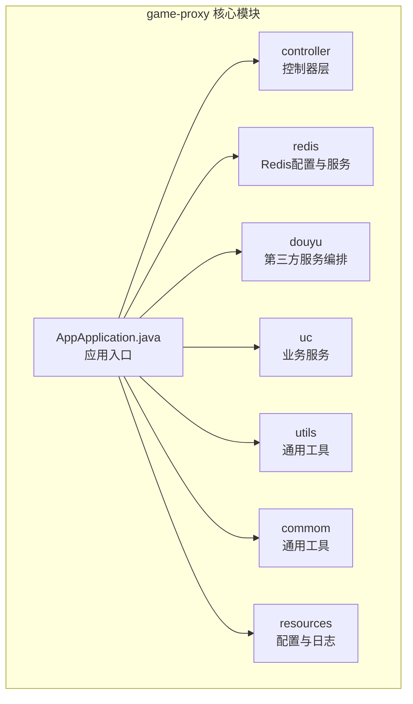
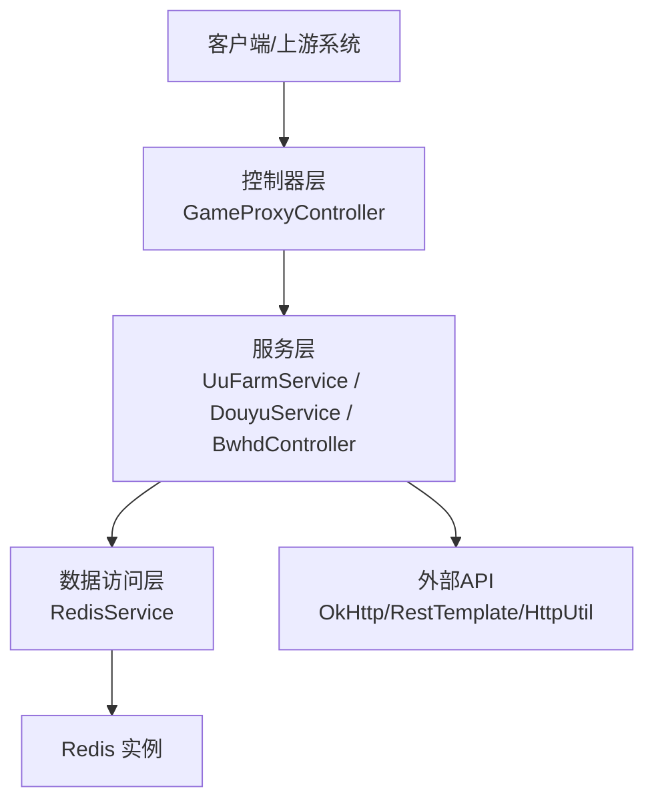
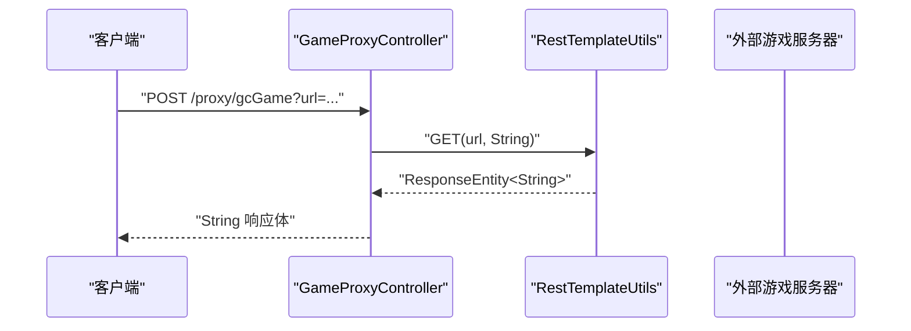
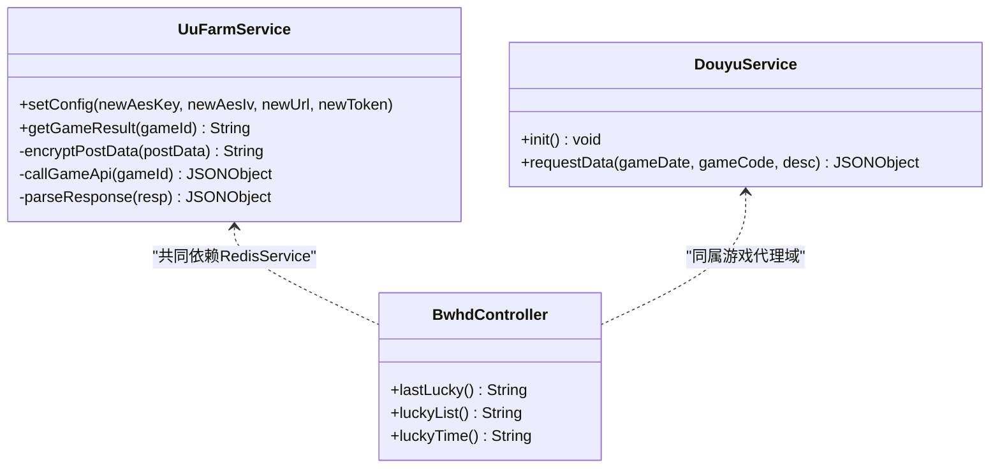
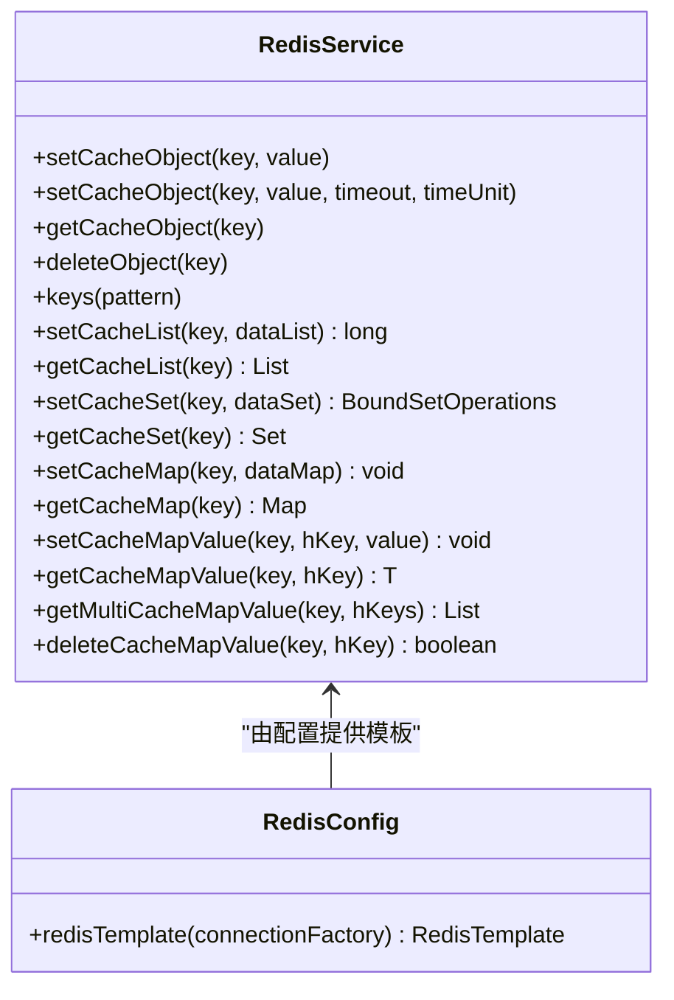
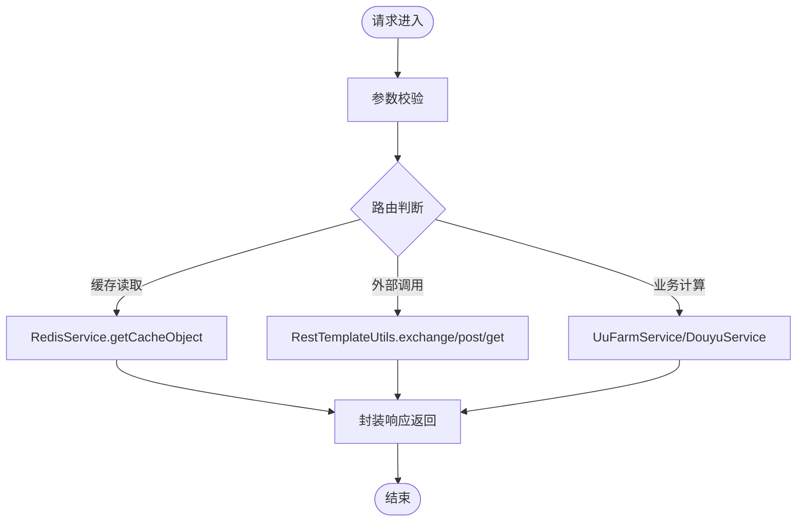
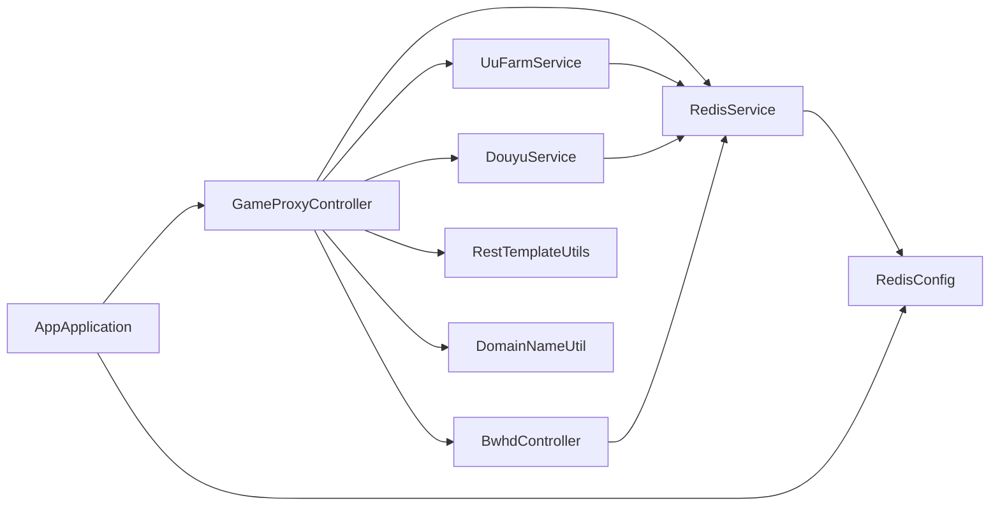

# 分层设计架构

<cite>
**本文引用的文件**
- [AppApplication.java](file://game-proxy/src/main/java/com/game/AppApplication.java)
- [GameProxyController.java](file://game-proxy/src/main/java/com/game/controller/GameProxyController.java)
- [RedisService.java](file://game-proxy/src/main/java/com/game/redis/RedisService.java)
- [RedisConfig.java](file://game-proxy/src/main/java/com/game/redis/RedisConfig.java)
- [DouyuService.java](file://game-proxy/src/main/java/com/game/douyu/DouyuService.java)
- [UuFarmService.java](file://game-proxy/src/main/java/com/game\uc/UuFarmService.java)
- [RestTemplateUtils.java](file://game-proxy/src/main/java/com/game/commom/RestTemplateUtils.java)
- [BwhdController.java](file://game-proxy/src/main/java/com/game/gcbwz/BwhdController.java)
- [SafePointDrawWithFishingCN.java](file://game-proxy/src/main/java/com/game/utils/SafePointDrawWithFishingCN.java)
- [DomainNameUtil.java](file://game-proxy/src/main/java/com/game/utils/DomainNameUtil.java)
- [SpringUtils.java](file://game-proxy/src/main/java/com/game/utils/SpringUtils.java)
- [SSLUtil.java](file://game-proxy/src/main/java/com/game/utils/SSLUtil.java)
- [application.yml](file://game-proxy/src/main/resources/application.yml)
- [pom.xml](file://game-proxy/pom.xml)
</cite>

## 目录
1. [引言](#引言)
2. [项目结构](#项目结构)
3. [核心组件](#核心组件)
4. [架构总览](#架构总览)
5. [详细组件分析](#详细组件分析)
6. [依赖关系分析](#依赖关系分析)
7. [性能考量](#性能考量)
8. [故障排查指南](#故障排查指南)
9. [结论](#结论)
10. [附录](#附录)

## 引言
本文件面向“游戏代理系统”的分层设计，围绕控制器层（Controller Layer）、服务层（Service Layer）、数据访问层（Data Access Layer）进行系统化说明，重点阐述：
- 控制器层职责：HTTP请求处理、参数校验、响应封装、跨域与安全策略执行
- 服务层职责：业务逻辑编排、服务间协调、外部API调用、定时任务与线程池调度
- 数据访问层职责：Redis缓存读写、序列化配置、连接池与超时策略
- 层间依赖与调用链路：典型请求如何在三层之间流转
- 分层优势、最佳实践与常见问题解决方案

## 项目结构
项目采用多模块聚合结构，game-proxy为核心模块，包含控制器、服务、工具、配置与资源文件。整体目录组织遵循按功能域划分的层次化布局。

图表来源
- [AppApplication.java](file://game-proxy/src/main/java/com/game/AppApplication.java#L1-L33)
- [application.yml](file://game-proxy/src/main/resources/application.yml#L1-L58)

章节来源
- [AppApplication.java](file://game-proxy/src/main/java/com/game/AppApplication.java#L1-L33)
- [application.yml](file://game-proxy/src/main/resources/application.yml#L1-L58)

## 核心组件
- 控制器层：集中于controller包，提供REST接口，负责参数接收、简单校验、调用服务层并封装响应
- 服务层：包含业务服务（如UU农场、斗鱼数据、古城/幽林数据等），承担复杂业务编排与外部调用
- 数据访问层：以Redis为核心，提供统一的缓存读写能力，并通过RedisConfig完成序列化与连接配置
- 工具与通用组件：RestTemplateUtils、DomainNameUtil、SpringUtils、SSLUtil等，支撑HTTP调用、域名管理、Spring上下文获取与SSL处理

章节来源
- [GameProxyController.java](file://game-proxy/src/main/java/com/game/controller/GameProxyController.java#L1-L436)
- [RedisService.java](file://game-proxy/src/main/java/com/game/redis/RedisService.java#L1-L244)
- [RedisConfig.java](file://game-proxy/src/main/java/com/game/redis/RedisConfig.java#L1-L41)
- [UuFarmService.java](file://game-proxy/src/main/java/com/game\uc/UuFarmService.java#L1-L135)
- [DouyuService.java](file://game-proxy/src/main/java/com/game/douyu/DouyuService.java#L1-L60)
- [RestTemplateUtils.java](file://game-proxy/src/main/java/com/game/commom/RestTemplateUtils.java#L1-L51)
- [DomainNameUtil.java](file://game-proxy/src/main/java/com/game/utils/DomainNameUtil.java#L1-L16)
- [SpringUtils.java](file://game-proxy/src/main/java/com/game/utils/SpringUtils.java#L1-L103)
- [SSLUtil.java](file://game-proxy/src/main/java/com/game/utils/SSLUtil.java#L1-L22)

## 架构总览
系统采用经典的三层架构：
- 表现层（控制器层）：接收HTTP请求，进行参数校验与响应封装
- 业务层（服务层）：编排业务流程、调用外部API、处理定时任务与线程池
- 数据访问层（Redis）：提供高性能缓存读写，支持多种数据结构

图表来源
- [GameProxyController.java](file://game-proxy/src/main/java/com/game/controller/GameProxyController.java#L1-L436)
- [UuFarmService.java](file://game-proxy/src/main/java/com/game\uc/UuFarmService.java#L1-L135)
- [DouyuService.java](file://game-proxy/src/main/java/com/game/douyu/DouyuService.java#L1-L60)
- [BwhdController.java](file://game-proxy/src/main/java/com/game/gcbwz/BwhdController.java#L1-L71)
- [RedisService.java](file://game-proxy/src/main/java/com/game/redis/RedisService.java#L1-L244)

## 详细组件分析

### 控制器层（Controller Layer）
职责与特性
- HTTP请求入口：基于Spring MVC注解提供REST接口，统一路径前缀与响应封装
- 参数处理：接收字符串、JSON、表单等参数，进行简单校验与转换
- 响应封装：直接返回字符串或JSON字符串，便于上游系统消费
- 跨域与安全：通过工具类与配置实现域名白名单与SSL策略

关键接口示例与调用链
- 游戏代理接口：转发上游请求至目标游戏服务器，设置必要头部后返回响应
- 缓存查询接口：从Redis读取游戏信息，支持多款游戏的实时状态
- 时间同步接口：接收上游上报的游戏时间，写入Redis并设置过期时间
- 图片识别与自开奖：集成图像识别与自开奖算法，触发跨节点同步

图表来源
- [GameProxyController.java](file://game-proxy/src/main/java/com/game/controller/GameProxyController.java#L51-L58)
- [RestTemplateUtils.java](file://game-proxy/src/main/java/com/game/commom/RestTemplateUtils.java#L38-L44)

章节来源
- [GameProxyController.java](file://game-proxy/src/main/java/com/game/controller/GameProxyController.java#L1-L436)
- [RestTemplateUtils.java](file://game-proxy/src/main/java/com/game/commom/RestTemplateUtils.java#L1-L51)

### 服务层（Service Layer）
职责与特性
- 业务编排：组合控制器层与数据访问层，完成复杂业务流程
- 外部API调用：使用OkHttp、RestTemplate、HttpUtil等发起HTTP请求
- 定时与异步：通过线程池与定时工厂执行后台任务
- 配置与安全：支持动态配置、AES加密、SSL禁用策略等

典型服务
- UU农场服务：对目标H5游戏接口进行AES加密请求，解析返回并格式化输出
- 斗鱼服务：初始化后台任务，拉取游戏数据并处理异常
- 古城/幽林服务：通过带Cookie的HTTP请求获取历史数据，结合Redis缓存开奖时间

图表来源
- [UuFarmService.java](file://game-proxy/src/main/java/com/game\uc/UuFarmService.java#L1-L135)
- [DouyuService.java](file://game-proxy/src/main/java/com/game/douyu/DouyuService.java#L1-L60)
- [BwhdController.java](file://game-proxy/src/main/java/com/game/gcbwz/BwhdController.java#L1-L71)

章节来源
- [UuFarmService.java](file://game-proxy/src/main/java/com/game\uc/UuFarmService.java#L1-L135)
- [DouyuService.java](file://game-proxy/src/main/java/com/game/douyu/DouyuService.java#L1-L60)
- [BwhdController.java](file://game-proxy/src/main/java/com/game/gcbwz/BwhdController.java#L1-L71)

### 数据访问层（Data Access Layer）
职责与特性
- 统一缓存接口：提供对象、列表、集合、哈希等多种数据结构的读写
- 序列化配置：使用JSON序列化提升可读性与跨语言兼容
- 过期与键管理：支持设置TTL、批量删除、键匹配等
- 连接与池化：通过RedisConfig配置连接工厂与序列化策略

图表来源
- [RedisService.java](file://game-proxy/src/main/java/com/game/redis/RedisService.java#L1-L244)
- [RedisConfig.java](file://game-proxy/src/main/java/com/game/redis/RedisConfig.java#L1-L41)

章节来源
- [RedisService.java](file://game-proxy/src/main/java/com/game/redis/RedisService.java#L1-L244)
- [RedisConfig.java](file://game-proxy/src/main/java/com/game/redis/RedisConfig.java#L1-L41)

### 外部API与工具链
- RestTemplateUtils：封装RestTemplate的GET/POST/EXCHANGE，统一异常处理
- DomainNameUtil：维护域名白名单，用于跨节点同步
- SpringUtils：在非Spring管理环境中获取Bean，支持AOP代理获取
- SSLUtil：禁用SSL校验，便于本地调试或不受信证书场景

图表来源
- [GameProxyController.java](file://game-proxy/src/main/java/com/game/controller/GameProxyController.java#L1-L436)
- [RestTemplateUtils.java](file://game-proxy/src/main/java/com/game/commom/RestTemplateUtils.java#L1-L51)
- [RedisService.java](file://game-proxy/src/main/java/com/game/redis/RedisService.java#L1-L244)

章节来源
- [RestTemplateUtils.java](file://game-proxy/src/main/java/com/game/commom/RestTemplateUtils.java#L1-L51)
- [DomainNameUtil.java](file://game-proxy/src/main/java/com/game/utils/DomainNameUtil.java#L1-L16)
- [SpringUtils.java](file://game-proxy/src/main/java/com/game/utils/SpringUtils.java#L1-L103)
- [SSLUtil.java](file://game-proxy/src/main/java/com/game/utils/SSLUtil.java#L1-L22)

## 依赖关系分析
- 控制器层依赖服务层与工具类（RedisService、RestTemplateUtils、DomainNameUtil等）
- 服务层依赖外部HTTP客户端（OkHttp、RestTemplate、HttpUtil）与RedisService
- RedisService依赖RedisConfig提供的RedisTemplate
- 应用入口通过Spring Boot启动，加载配置与组件

图表来源
- [GameProxyController.java](file://game-proxy/src/main/java/com/game/controller/GameProxyController.java#L1-L436)
- [UuFarmService.java](file://game-proxy/src/main/java/com/game\uc/UuFarmService.java#L1-L135)
- [DouyuService.java](file://game-proxy/src/main/java/com/game/douyu/DouyuService.java#L1-L60)
- [BwhdController.java](file://game-proxy/src/main/java/com/game/gcbwz/BwhdController.java#L1-L71)
- [RestTemplateUtils.java](file://game-proxy/src/main/java/com/game/commom/RestTemplateUtils.java#L1-L51)
- [RedisService.java](file://game-proxy/src/main/java/com/game/redis/RedisService.java#L1-L244)
- [RedisConfig.java](file://game-proxy/src/main/java/com/game/redis/RedisConfig.java#L1-L41)
- [AppApplication.java](file://game-proxy/src/main/java/com/game/AppApplication.java#L1-L33)

章节来源
- [pom.xml](file://game-proxy/pom.xml#L1-L163)
- [application.yml](file://game-proxy/src/main/resources/application.yml#L1-L58)

## 性能考量
- Redis序列化：使用JSON序列化提升可读性，建议在高频读写场景下评估二进制序列化以降低CPU开销
- 连接池配置：合理设置最大连接数、空闲连接与超时时间，避免阻塞与资源浪费
- 线程池与定时任务：服务层使用线程池执行后台任务，需关注任务队列长度与拒绝策略
- HTTP客户端：统一使用RestTemplate/OkHttp，设置合理的超时与重试策略，避免阻塞
- 缓存策略：为热点数据设置TTL，结合批量写入与键空间清理，防止内存膨胀

## 故障排查指南
- Redis连接失败：检查host/port/password/database与连接池配置，确认网络连通性
- HTTP调用异常：查看RestTemplate/OkHttp超时设置，定位上游接口状态码与响应体
- 缓存未命中：确认键命名规范与TTL设置，使用keys(pattern)排查键空间
- SSL相关问题：在开发环境可使用SSLUtil禁用校验，生产环境务必启用严格校验
- 日志与监控：通过AppApplication启动日志与各组件日志定位问题根因

章节来源
- [application.yml](file://game-proxy/src/main/resources/application.yml#L15-L58)
- [SSLUtil.java](file://game-proxy/src/main/java/com/game/utils/SSLUtil.java#L1-L22)
- [AppApplication.java](file://game-proxy/src/main/java/com/game/AppApplication.java#L24-L31)

## 结论
该系统通过清晰的三层分层设计实现了“表现层—业务层—数据访问层”的职责分离，控制器层专注请求与响应，服务层承载业务编排与外部交互，数据访问层提供高性能缓存能力。配合统一的工具与配置，系统具备良好的扩展性与可维护性。建议在生产环境中进一步完善超时与重试、熔断与降级、以及可观测性建设。

## 附录
- 配置要点：server.port/context-path、spring.redis、http连接池参数、域名与会话配置
- 依赖清单：Spring Web、Spring Data Redis、OkHttp、Fastjson2、Hutool、Lombok等

章节来源
- [application.yml](file://game-proxy/src/main/resources/application.yml#L1-L58)
- [pom.xml](file://game-proxy/pom.xml#L26-L100)