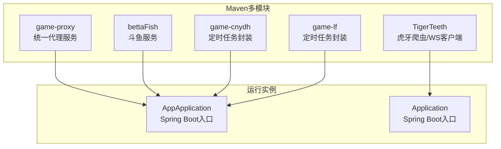
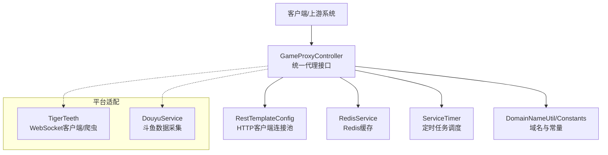
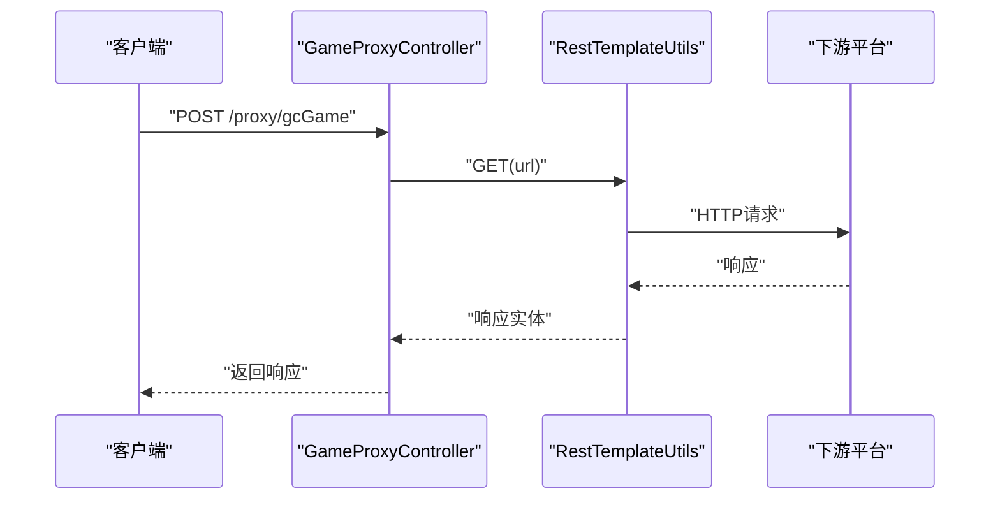
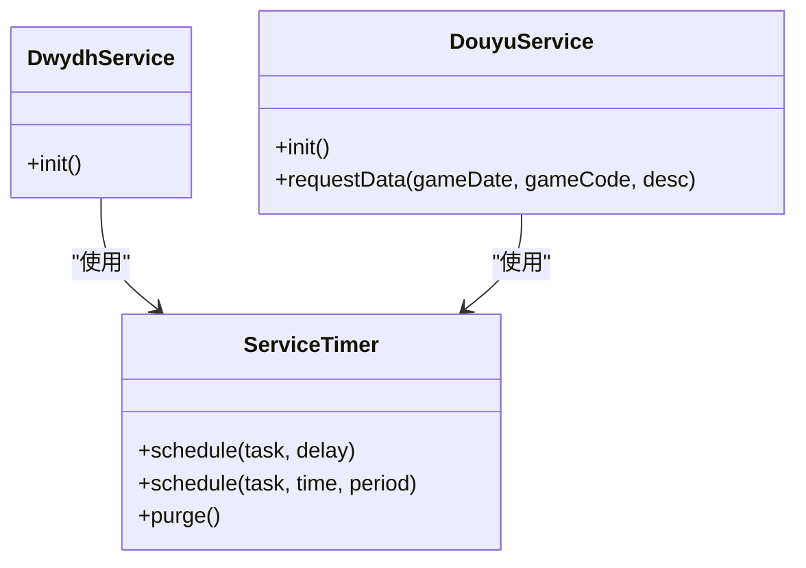
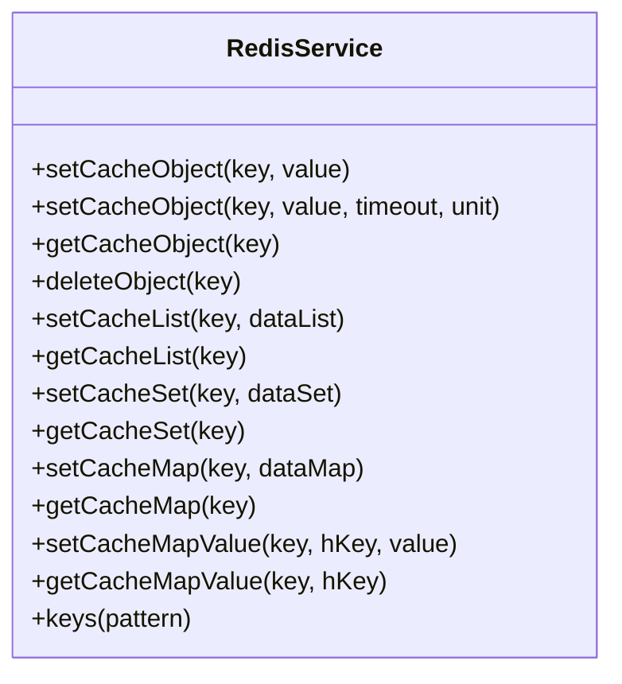
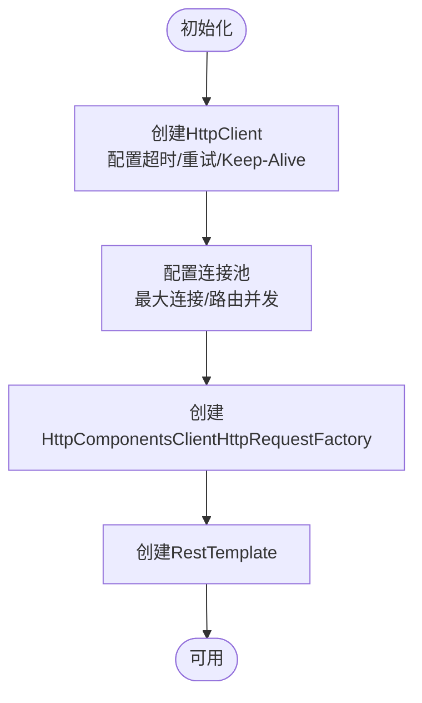
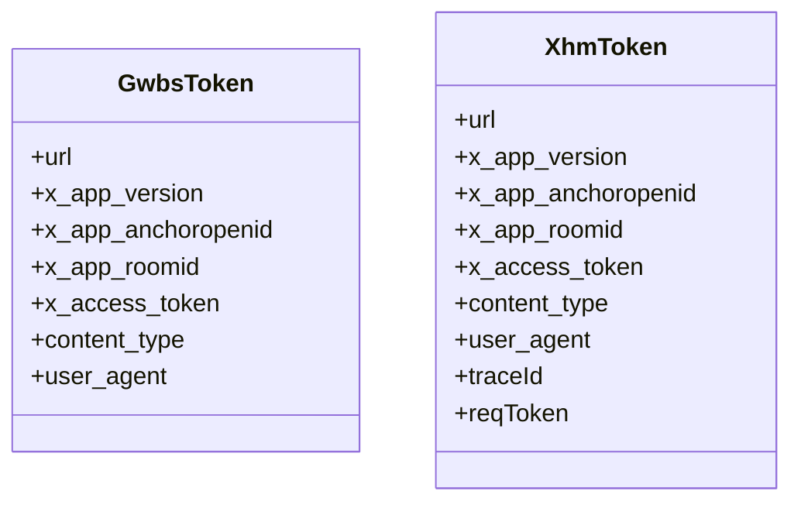
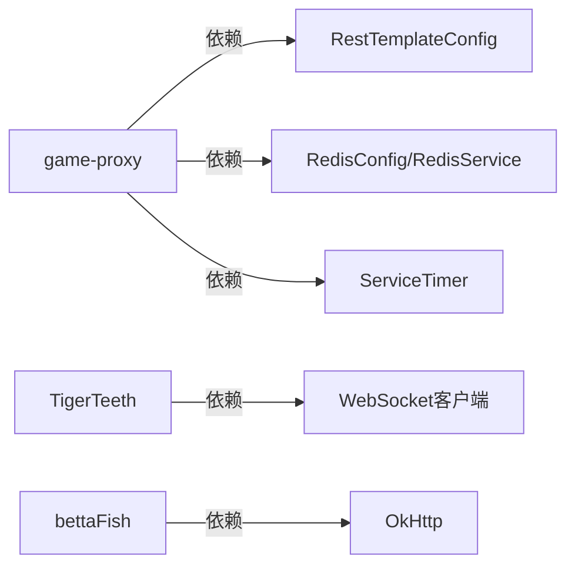

# 整体架构模式

<cite>
**本文引用的文件**
- [game-proxy/pom.xml](file://game-proxy/pom.xml)
- [TigerTeeth/pom.xml](file://TigerTeeth/pom.xml)
- [game-proxy/src/main/java/com/game/AppApplication.java](file://game-proxy/src/main/java/com/game/AppApplication.java)
- [TigerTeeth/src/main/java/com/Application.java](file://TigerTeeth/src/main/java/com/Application.java)
- [game-proxy/src/main/resources/application.yml](file://game-proxy/src/main/resources/application.yml)
- [TigerTeeth/src/main/resources/application.yml](file://TigerTeeth/src/main/resources/application.yml)
- [game-proxy/src/main/java/com/game/controller/GameProxyController.java](file://game-proxy/src/main/java/com/game/controller/GameProxyController.java)
- [game-proxy/src/main/java/com/game/commom/RestTemplateConfig.java](file://game-proxy/src/main/java/com/game/commom/RestTemplateConfig.java)
- [game-proxy/src/main/java/com/game/redis/RedisConfig.java](file://game-proxy/src/main/java/com/game/redis/RedisConfig.java)
- [game-proxy/src/main/java/com/game/redis/RedisService.java](file://game-proxy/src/main/java/com/game/redis/RedisService.java)
- [game-proxy/src/main/java/com/game/timer/ServiceTimer.java](file://game-proxy/src/main/java/com/game/timer/ServiceTimer.java)
- [game-proxy/src/main/java/com/game/utils/DomainNameUtil.java](file://game-proxy/src/main/java/com/game/utils/DomainNameUtil.java)
- [game-proxy/src/main/java/com/game/commom/Constants.java](file://game-proxy/src/main/java/com/game/commom/Constants.java)
- [game-proxy/src/main/java/com/game/douyu/DouyuService.java](file://game-proxy/src/main/java/com/game/douyu/DouyuService.java)
- [TigerTeeth/src/main/java/com/dwydh/DwydhService.java](file://TigerTeeth/src/main/java/com/dwydh/DwydhService.java)
- [TigerTeeth/src/main/java/com/yqlyy/GameYqlyyWsClient.java](file://TigerTeeth/src/main/java/com/yqlyy/GameYqlyyWsClient.java)
- [game-proxy/src/main/java/com/game/entity/GwbsToken.java](file://game-proxy/src/main/java/com/game/entity/GwbsToken.java)
- [game-proxy/src/main/java/com/game/entity/XhmToken.java](file://game-proxy/src/main/java/com/game/entity/XhmToken.java)
</cite>

## 目录
1. [引言](#引言)
2. [项目结构](#项目结构)
3. [核心组件](#核心组件)
4. [架构总览](#架构总览)
5. [详细组件分析](#详细组件分析)
6. [依赖分析](#依赖分析)
7. [性能考量](#性能考量)
8. [故障排查指南](#故障排查指南)
9. [结论](#结论)
10. [附录](#附录)

## 引言
本文件面向游戏代理系统，系统采用多模块的Maven工程组织，围绕Spring Boot微服务框架构建，结合表现层、业务层与数据访问层的分层设计，实现对多款游戏的代理与数据中转能力。系统通过统一的HTTP代理接口对外提供服务，内部通过定时调度、Redis缓存与HTTP客户端连接池实现高并发与低延迟的数据流转，并通过模块化拆分实现功能解耦与可扩展性。

## 项目结构
系统采用多模块Maven工程，每个子模块代表一个独立的功能域或平台适配，便于独立开发、测试与部署：
- game-proxy：统一代理服务，提供HTTP代理接口、定时任务、Redis缓存与通用HTTP客户端配置
- TigerTeeth：虎牙相关爬虫与WebSocket客户端，负责特定游戏数据采集与上报
- bettaFish：斗鱼相关服务与工具
- game-cnydh：部分游戏数据任务与定时器封装
- game-lf：另一套游戏服务与定时器封装

图表来源
- [game-proxy/pom.xml](file://game-proxy/pom.xml#L1-L163)
- [TigerTeeth/pom.xml](file://TigerTeeth/pom.xml#L1-L160)
- [game-proxy/src/main/java/com/game/AppApplication.java](file://game-proxy/src/main/java/com/game/AppApplication.java#L15-L32)
- [TigerTeeth/src/main/java/com/Application.java](file://TigerTeeth/src/main/java/com/Application.java#L6-L12)

章节来源
- [game-proxy/pom.xml](file://game-proxy/pom.xml#L1-L163)
- [TigerTeeth/pom.xml](file://TigerTeeth/pom.xml#L1-L160)

## 核心组件
- 表现层（Controller）：统一代理服务提供REST接口，集中处理外部请求转发、参数校验与响应返回
- 业务层（Service）：封装定时任务、HTTP请求、WebSocket客户端与游戏数据采集逻辑
- 数据访问层（Redis）：提供统一的Redis读写封装，支持多种数据结构与过期控制
- 基础设施（配置）：HTTP客户端连接池、Redis序列化配置、定时器工厂与常量定义

章节来源
- [game-proxy/src/main/java/com/game/controller/GameProxyController.java](file://game-proxy/src/main/java/com/game/controller/GameProxyController.java#L36-L436)
- [game-proxy/src/main/java/com/game/redis/RedisService.java](file://game-proxy/src/main/java/com/game/redis/RedisService.java#L18-L244)
- [game-proxy/src/main/java/com/game/commom/RestTemplateConfig.java](file://game-proxy/src/main/java/com/game/commom/RestTemplateConfig.java#L33-L132)
- [game-proxy/src/main/java/com/game/timer/ServiceTimer.java](file://game-proxy/src/main/java/com/game/timer/ServiceTimer.java#L15-L164)

## 架构总览
系统采用“统一代理 + 多平台适配”的微服务架构，核心思想是：
- 统一入口：game-proxy作为统一代理服务，暴露HTTP接口供外部调用
- 分层解耦：表现层仅做参数透传与简单校验，业务层负责具体平台协议与数据处理
- 数据中转：通过Redis缓存实现跨模块共享状态与临时数据
- 并发与稳定性：基于Apache HttpClient连接池与Spring Scheduling实现高并发与容错

图表来源
- [game-proxy/src/main/java/com/game/controller/GameProxyController.java](file://game-proxy/src/main/java/com/game/controller/GameProxyController.java#L36-L436)
- [game-proxy/src/main/java/com/game/commom/RestTemplateConfig.java](file://game-proxy/src/main/java/com/game/commom/RestTemplateConfig.java#L33-L132)
- [game-proxy/src/main/java/com/game/redis/RedisService.java](file://game-proxy/src/main/java/com/game/redis/RedisService.java#L18-L244)
- [game-proxy/src/main/java/com/game/timer/ServiceTimer.java](file://game-proxy/src/main/java/com/game/timer/ServiceTimer.java#L15-L164)
- [TigerTeeth/src/main/java/com/dwydh/DwydhService.java](file://TigerTeeth/src/main/java/com/dwydh/DwydhService.java#L12-L39)
- [game-proxy/src/main/java/com/game/douyu/DouyuService.java](file://game-proxy/src/main/java/com/game/douyu/DouyuService.java#L18-L60)

## 详细组件分析

### 控制器层：GameProxyController
- 职责：统一代理接口，负责接收外部请求、构造HTTP头、转发至下游平台并返回结果
- 关键点：
  - 支持古城、幽林保卫战等多平台代理接口
  - 通过Redis缓存提供游戏信息查询
  - 提供定时任务相关的接口，如设置/获取游戏时间、重启游戏服务等
  - 图片识别与自开奖接口，具备基础限流与异常处理

图表来源
- [game-proxy/src/main/java/com/game/controller/GameProxyController.java](file://game-proxy/src/main/java/com/game/controller/GameProxyController.java#L51-L58)
- [game-proxy/src/main/java/com/game/commom/RestTemplateConfig.java](file://game-proxy/src/main/java/com/game/commom/RestTemplateConfig.java#L62-L76)

章节来源
- [game-proxy/src/main/java/com/game/controller/GameProxyController.java](file://game-proxy/src/main/java/com/game/controller/GameProxyController.java#L36-L436)

### 业务层：定时与平台适配
- ServiceTimer：基于ScheduledThreadPoolExecutor的增强定时器，支持任务注册、周期调度与自动清理
- TigerTeeth：WebSocket客户端与定时上报逻辑，负责特定游戏数据的采集与上报
- DouyuService：封装斗鱼平台数据请求流程，统一参数组装与结果解析

图表来源
- [game-proxy/src/main/java/com/game/timer/ServiceTimer.java](file://game-proxy/src/main/java/com/game/timer/ServiceTimer.java#L15-L164)
- [TigerTeeth/src/main/java/com/dwydh/DwydhService.java](file://TigerTeeth/src/main/java/com/dwydh/DwydhService.java#L12-L39)
- [game-proxy/src/main/java/com/game/douyu/DouyuService.java](file://game-proxy/src/main/java/com/game/douyu/DouyuService.java#L18-L60)

章节来源
- [game-proxy/src/main/java/com/game/timer/ServiceTimer.java](file://game-proxy/src/main/java/com/game/timer/ServiceTimer.java#L15-L164)
- [TigerTeeth/src/main/java/com/dwydh/DwydhService.java](file://TigerTeeth/src/main/java/com/dwydh/DwydhService.java#L12-L39)
- [game-proxy/src/main/java/com/game/douyu/DouyuService.java](file://game-proxy/src/main/java/com/game/douyu/DouyuService.java#L18-L60)

### 数据访问层：Redis服务
- 职责：提供统一的Redis读写封装，支持String、List、Set、Hash等多种数据结构
- 特性：支持设置过期时间、批量操作、键空间匹配等，满足不同场景下的缓存需求

图表来源
- [game-proxy/src/main/java/com/game/redis/RedisService.java](file://game-proxy/src/main/java/com/game/redis/RedisService.java#L18-L244)

章节来源
- [game-proxy/src/main/java/com/game/redis/RedisService.java](file://game-proxy/src/main/java/com/game/redis/RedisService.java#L18-L244)

### 基础设施：HTTP客户端与配置
- RestTemplateConfig：基于Apache HttpClient的连接池配置，支持超时、重试、Keep-Alive与连接复用
- RedisConfig：配置RedisTemplate的序列化策略，确保键值存储一致性
- Constants/DomainNameUtil：集中管理平台域名与常量，便于维护与切换

图表来源
- [game-proxy/src/main/java/com/game/commom/RestTemplateConfig.java](file://game-proxy/src/main/java/com/game/commom/RestTemplateConfig.java#L84-L129)

章节来源
- [game-proxy/src/main/java/com/game/commom/RestTemplateConfig.java](file://game-proxy/src/main/java/com/game/commom/RestTemplateConfig.java#L33-L132)
- [game-proxy/src/main/java/com/game/redis/RedisConfig.java](file://game-proxy/src/main/java/com/game/redis/RedisConfig.java#L10-L41)
- [game-proxy/src/main/java/com/game/commom/Constants.java](file://game-proxy/src/main/java/com/game/commom/Constants.java#L3-L14)
- [game-proxy/src/main/java/com/game/utils/DomainNameUtil.java](file://game-proxy/src/main/java/com/game/utils/DomainNameUtil.java#L3-L16)

### 数据模型：Token实体
- GwbsToken/XhmToken：封装各平台所需的请求头与认证信息，便于统一管理与传递

图表来源
- [game-proxy/src/main/java/com/game/entity/GwbsToken.java](file://game-proxy/src/main/java/com/game/entity/GwbsToken.java#L11-L22)
- [game-proxy/src/main/java/com/game/entity/XhmToken.java](file://game-proxy/src/main/java/com/game/entity/XhmToken.java#L11-L25)

章节来源
- [game-proxy/src/main/java/com/game/entity/GwbsToken.java](file://game-proxy/src/main/java/com/game/entity/GwbsToken.java#L11-L22)
- [game-proxy/src/main/java/com/game/entity/XhmToken.java](file://game-proxy/src/main/java/com/game/entity/XhmToken.java#L11-L25)

## 依赖分析
- 模块间耦合：game-proxy作为统一入口，依赖Redis与HTTP客户端配置；TigerTeeth与bettaFish等模块相对独立，通过各自入口启动
- 外部依赖：Spring Boot Web、Redis、Apache HttpClient、OkHttp、WebSocket客户端等
- 配置维度：各模块拥有独立的application.yml，分别定义端口、上下文路径、Redis连接与HTTP超时参数

图表来源
- [game-proxy/src/main/java/com/game/commom/RestTemplateConfig.java](file://game-proxy/src/main/java/com/game/commom/RestTemplateConfig.java#L33-L132)
- [game-proxy/src/main/java/com/game/redis/RedisConfig.java](file://game-proxy/src/main/java/com/game/redis/RedisConfig.java#L10-L41)
- [game-proxy/src/main/java/com/game/timer/ServiceTimer.java](file://game-proxy/src/main/java/com/game/timer/ServiceTimer.java#L15-L164)
- [TigerTeeth/src/main/java/com/dwydh/DwydhService.java](file://TigerTeeth/src/main/java/com/dwydh/DwydhService.java#L12-L39)

章节来源
- [game-proxy/src/main/resources/application.yml](file://game-proxy/src/main/resources/application.yml#L1-L58)
- [TigerTeeth/src/main/resources/application.yml](file://TigerTeeth/src/main/resources/application.yml#L1-L31)

## 性能考量
- HTTP连接池：通过RestTemplateConfig配置连接池大小、路由并发、超时与重试策略，提升并发与稳定性
- Redis序列化：使用JSON序列化策略，兼顾可读性与跨语言兼容
- 定时任务：ServiceTimer统一管理任务生命周期，定期清理取消的任务，避免内存泄漏
- 缓存策略：针对高频查询与临时数据使用Redis缓存，减少重复请求与计算开销

章节来源
- [game-proxy/src/main/java/com/game/commom/RestTemplateConfig.java](file://game-proxy/src/main/java/com/game/commom/RestTemplateConfig.java#L84-L129)
- [game-proxy/src/main/java/com/game/redis/RedisConfig.java](file://game-proxy/src/main/java/com/game/redis/RedisConfig.java#L27-L39)
- [game-proxy/src/main/java/com/game/timer/ServiceTimer.java](file://game-proxy/src/main/java/com/game/timer/ServiceTimer.java#L101-L113)

## 故障排查指南
- 接口限流：图片识别接口具备5秒内限流保护，避免频繁调用导致下游压力过大
- 异常处理：控制器对下游HTTP请求进行异常捕获与日志记录，便于定位问题
- WebSocket与定时任务：平台适配模块通过线程池执行，异常需关注线程中断与资源回收
- 配置检查：确认各模块application.yml中的端口、上下文路径、Redis连接与HTTP超时参数正确

章节来源
- [game-proxy/src/main/java/com/game/controller/GameProxyController.java](file://game-proxy/src/main/java/com/game/controller/GameProxyController.java#L368-L407)
- [TigerTeeth/src/main/java/com/dwydh/DwydhService.java](file://TigerTeeth/src/main/java/com/dwydh/DwydhService.java#L21-L35)

## 结论
该系统通过多模块Maven工程与Spring Boot微服务框架，实现了统一代理、分层解耦与高并发稳定的数据流转。统一入口与Redis缓存提升了系统的可扩展性与可维护性，HTTP连接池与定时器增强了性能与可靠性。未来可在网关层引入鉴权与限流策略，并完善监控与链路追踪以进一步提升可观测性。

## 附录
- 启动入口：game-proxy使用AppApplication，TigerTeeth使用Application，分别负责各自模块的启动与日志输出
- 配置要点：各模块独立配置端口与上下文路径，避免冲突；HTTP与Redis参数按实际环境调整

章节来源
- [game-proxy/src/main/java/com/game/AppApplication.java](file://game-proxy/src/main/java/com/game/AppApplication.java#L17-L32)
- [TigerTeeth/src/main/java/com/Application.java](file://TigerTeeth/src/main/java/com/Application.java#L8-L12)
- [game-proxy/src/main/resources/application.yml](file://game-proxy/src/main/resources/application.yml#L1-L58)
- [TigerTeeth/src/main/resources/application.yml](file://TigerTeeth/src/main/resources/application.yml#L1-L31)