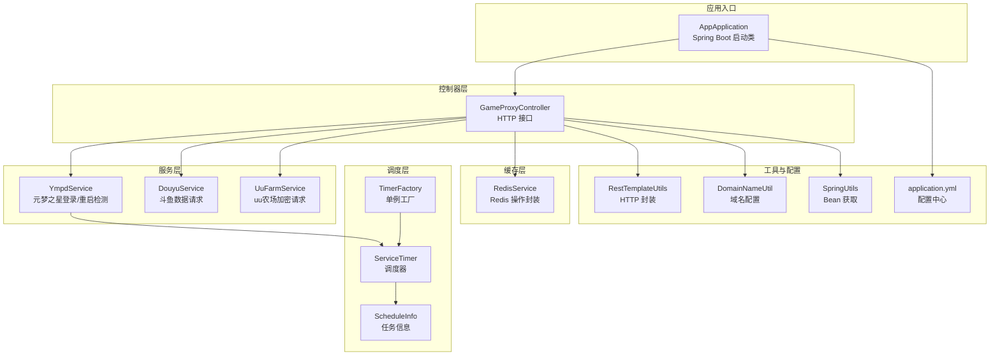
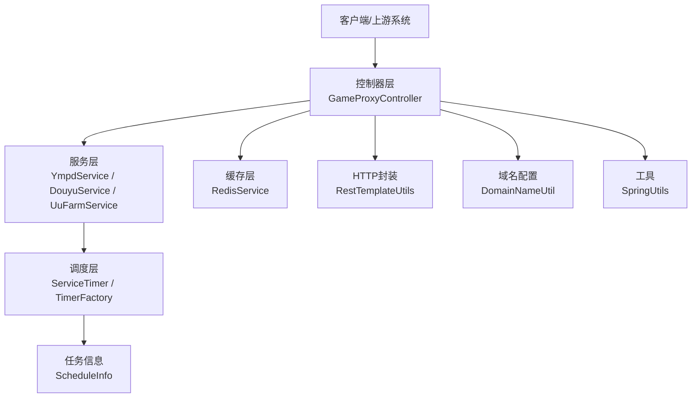
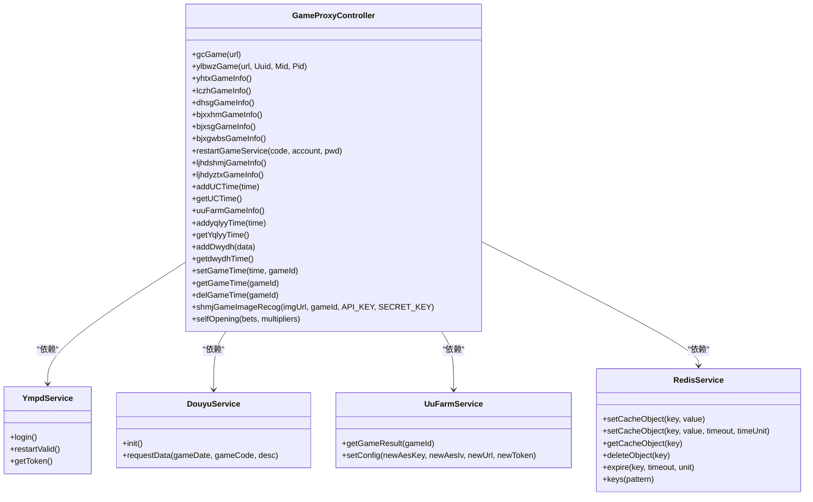
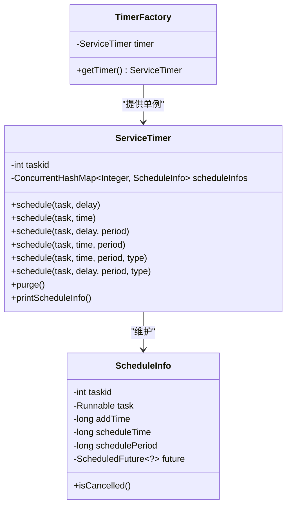
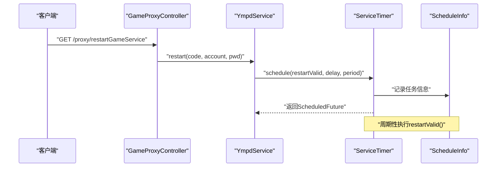
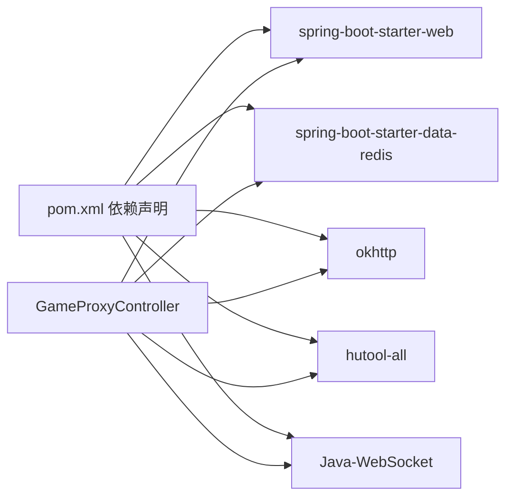

# 核心架构设计

<cite>
**本文档引用的文件**
- [AppApplication.java](file://game-proxy/src/main/java/com/game/AppApplication.java)
- [GameProxyController.java](file://game-proxy/src/main/java/com/game/controller/GameProxyController.java)
- [RedisService.java](file://game-proxy/src/main/java/com/game/redis/RedisService.java)
- [ServiceTimer.java](file://game-proxy/src/main/java/com/game/timer/ServiceTimer.java)
- [ScheduleInfo.java](file://game-proxy/src/main/java/com/game/timer/ScheduleInfo.java)
- [TimerFactory.java](file://game-proxy/src/main/java/com/game/timer/TimerFactory.java)
- [RestTemplateUtils.java](file://game-proxy/src/main/java/com/game/commom/RestTemplateUtils.java)
- [SpringUtils.java](file://game-proxy/src/main/java/com/game/utils/SpringUtils.java)
- [YmpdService.java](file://game-proxy/src/main/java/com/game/ympd/YmpdService.java)
- [DouyuService.java](file://game-proxy/src/main/java/com/game/douyu/DouyuService.java)
- [UuFarmService.java](file://game-proxy/src/main/java/com/game\uc/UuFarmService.java)
- [application.yml](file://game-proxy/src/main/resources/application.yml)
- [pom.xml](file://game-proxy/pom.xml)
- [DomainNameUtil.java](file://game-proxy/src/main/java/com/game/utils/DomainNameUtil.java)
</cite>

## 目录
1. [引言](#引言)
2. [项目结构](#项目结构)
3. [核心组件](#核心组件)
4. [架构总览](#架构总览)
5. [详细组件分析](#详细组件分析)
6. [依赖关系分析](#依赖关系分析)
7. [性能考量](#性能考量)
8. [故障排查指南](#故障排查指南)
9. [结论](#结论)
10. [附录](#附录)

## 引言
本文件面向游戏代理系统的核心架构设计，围绕微服务架构、分层架构与模块化设计展开，重点阐述控制器-服务-缓存三层结构及定时任务调度体系，总结设计模式的应用（代理、观察者、策略、工厂），并给出系统边界、组件关系与数据流向的可视化图示。同时，提供性能优化策略、可扩展性设计建议、跨模块通信机制、错误处理与容错设计说明。

## 项目结构
系统采用多模块工程组织，核心模块包括：
- 控制器层：统一对外HTTP接口，负责请求接入与响应输出
- 服务层：封装具体业务逻辑，如游戏数据拉取、登录鉴权、定时任务触发
- 缓存层：基于Redis的高性能读写与会话管理
- 定时调度层：自研线程池+调度器，支持一次性与周期性任务
- 工具与配置：RestTemplate封装、Spring上下文工具、域名配置等

图表来源
- [AppApplication.java](file://game-proxy/src/main/java/com/game/AppApplication.java#L15-L31)
- [GameProxyController.java](file://game-proxy/src/main/java/com/game/controller/GameProxyController.java#L36-L39)
- [YmpdService.java](file://game-proxy/src/main/java/com/game/ympd/YmpdService.java#L18-L31)
- [DouyuService.java](file://game-proxy/src/main/java/com/game/douyu/DouyuService.java#L18-L24)
- [UuFarmService.java](file://game-proxy/src/main/java/com/game\uc/UuFarmService.java#L20-L22)
- [RedisService.java](file://game-proxy/src/main/java/com/game/redis/RedisService.java#L18-L22)
- [ServiceTimer.java](file://game-proxy/src/main/java/com/game/timer/ServiceTimer.java#L16-L24)
- [ScheduleInfo.java](file://game-proxy/src/main/java/com/game/timer/ScheduleInfo.java#L5-L16)
- [TimerFactory.java](file://game-proxy/src/main/java/com/game/timer/TimerFactory.java#L3-L9)
- [RestTemplateUtils.java](file://game-proxy/src/main/java/com/game/commom/RestTemplateUtils.java#L13-L19)
- [SpringUtils.java](file://game-proxy/src/main/java/com/game/utils/SpringUtils.java#L15-L25)
- [application.yml](file://game-proxy/src/main/resources/application.yml#L1-L58)
- [DomainNameUtil.java](file://game-proxy/src/main/java/com/game/utils/DomainNameUtil.java#L3-L15)

章节来源
- [AppApplication.java](file://game-proxy/src/main/java/com/game/AppApplication.java#L15-L31)
- [application.yml](file://game-proxy/src/main/resources/application.yml#L1-L58)

## 核心组件
- 应用启动器：负责Spring Boot应用初始化、端口与路径输出
- 控制器：统一HTTP接口，聚合服务层能力，协调缓存与外部HTTP调用
- 服务层：封装业务域逻辑，如登录鉴权、数据拉取、定时任务触发
- 缓存服务：提供Redis读写、过期控制、集合操作等
- 调度器：自研线程池+调度器，支持一次性与周期性任务，并内置清理机制
- 工具与配置：HTTP封装、Bean获取、域名配置、全局配置

章节来源
- [GameProxyController.java](file://game-proxy/src/main/java/com/game/controller/GameProxyController.java#L36-L39)
- [RedisService.java](file://game-proxy/src/main/java/com/game/redis/RedisService.java#L18-L22)
- [ServiceTimer.java](file://game-proxy/src/main/java/com/game/timer/ServiceTimer.java#L16-L24)
- [TimerFactory.java](file://game-proxy/src/main/java/com/game/timer/TimerFactory.java#L3-L9)
- [RestTemplateUtils.java](file://game-proxy/src/main/java/com/game/commom/RestTemplateUtils.java#L13-L19)
- [SpringUtils.java](file://game-proxy/src/main/java/com/game/utils/SpringUtils.java#L15-L25)
- [application.yml](file://game-proxy/src/main/resources/application.yml#L1-L58)

## 架构总览
系统采用“控制器-服务-缓存”三层架构，结合自研定时调度器，形成清晰的职责分离与高内聚低耦合的设计。控制器负责请求接入与响应封装；服务层负责业务编排与外部调用；缓存层提供高性能数据存储与会话管理；调度器负责周期性任务的统一管理。

图表来源
- [GameProxyController.java](file://game-proxy/src/main/java/com/game/controller/GameProxyController.java#L36-L39)
- [YmpdService.java](file://game-proxy/src/main/java/com/game/ympd/YmpdService.java#L18-L31)
- [DouyuService.java](file://game-proxy/src/main/java/com/game/douyu/DouyuService.java#L18-L24)
- [UuFarmService.java](file://game-proxy/src/main/java/com/game\uc/UuFarmService.java#L20-L22)
- [RedisService.java](file://game-proxy/src/main/java/com/game/redis/RedisService.java#L18-L22)
- [ServiceTimer.java](file://game-proxy/src/main/java/com/game/timer/ServiceTimer.java#L16-L24)
- [TimerFactory.java](file://game-proxy/src/main/java/com/game/timer/TimerFactory.java#L3-L9)
- [RestTemplateUtils.java](file://game-proxy/src/main/java/com/game/commom/RestTemplateUtils.java#L13-L19)
- [SpringUtils.java](file://game-proxy/src/main/java/com/game/utils/SpringUtils.java#L15-L25)
- [DomainNameUtil.java](file://game-proxy/src/main/java/com/game/utils/DomainNameUtil.java#L3-L15)

## 详细组件分析

### 控制器-服务-缓存分层设计
- 控制器层：集中暴露HTTP接口，负责参数校验、头信息注入、响应封装与异常记录
- 服务层：封装业务域逻辑，如登录鉴权、数据拉取、定时任务触发
- 缓存层：提供统一的Redis操作接口，支持多种数据结构与过期控制

图表来源
- [GameProxyController.java](file://game-proxy/src/main/java/com/game/controller/GameProxyController.java#L36-L39)
- [YmpdService.java](file://game-proxy/src/main/java/com/game/ympd/YmpdService.java#L18-L31)
- [DouyuService.java](file://game-proxy/src/main/java/com/game/douyu/DouyuService.java#L18-L24)
- [UuFarmService.java](file://game-proxy/src/main/java/com/game\uc/UuFarmService.java#L20-L22)
- [RedisService.java](file://game-proxy/src/main/java/com/game/redis/RedisService.java#L18-L22)

章节来源
- [GameProxyController.java](file://game-proxy/src/main/java/com/game/controller/GameProxyController.java#L36-L39)
- [YmpdService.java](file://game-proxy/src/main/java/com/game/ympd/YmpdService.java#L18-L31)
- [DouyuService.java](file://game-proxy/src/main/java/com/game/douyu/DouyuService.java#L18-L24)
- [UuFarmService.java](file://game-proxy/src/main/java/com/game\uc/UuFarmService.java#L20-L22)
- [RedisService.java](file://game-proxy/src/main/java/com/game/redis/RedisService.java#L18-L22)

### 定时任务调度系统
- 自研调度器：基于ScheduledThreadPoolExecutor，支持一次性与固定频率任务
- 任务信息：记录任务ID、添加时间、计划执行时间、周期与Future句柄
- 工厂模式：提供单例调度器获取
- 清理机制：定期清理已取消或已完成的任务，避免内存泄漏

图表来源
- [ServiceTimer.java](file://game-proxy/src/main/java/com/game/timer/ServiceTimer.java#L16-L24)
- [ServiceTimer.java](file://game-proxy/src/main/java/com/game/timer/ServiceTimer.java#L26-L81)
- [ServiceTimer.java](file://game-proxy/src/main/java/com/game/timer/ServiceTimer.java#L101-L113)
- [ServiceTimer.java](file://game-proxy/src/main/java/com/game/timer/ServiceTimer.java#L116-L136)
- [ServiceTimer.java](file://game-proxy/src/main/java/com/game/timer/ServiceTimer.java#L138-L140)
- [ServiceTimer.java](file://game-proxy/src/main/java/com/game/timer/ServiceTimer.java#L142-L162)
- [ScheduleInfo.java](file://game-proxy/src/main/java/com/game/timer/ScheduleInfo.java#L5-L16)
- [ScheduleInfo.java](file://game-proxy/src/main/java/com/game/timer/ScheduleInfo.java#L18-L64)
- [TimerFactory.java](file://game-proxy/src/main/java/com/game/timer/TimerFactory.java#L3-L9)

章节来源
- [ServiceTimer.java](file://game-proxy/src/main/java/com/game/timer/ServiceTimer.java#L16-L164)
- [ScheduleInfo.java](file://game-proxy/src/main/java/com/game/timer/ScheduleInfo.java#L5-L66)
- [TimerFactory.java](file://game-proxy/src/main/java/com/game/timer/TimerFactory.java#L3-L11)

### 设计模式应用
- 工厂模式：TimerFactory提供单例调度器，简化调度器获取
- 代理模式：SpringUtils通过AopContext获取当前代理对象，便于内部方法调用
- 观察者模式：定时任务作为观察者，按周期扫描业务状态并触发重启
- 策略模式：不同游戏域采用不同服务策略（如UU农场、元梦之星、斗鱼），通过独立服务解耦

章节来源
- [TimerFactory.java](file://game-proxy/src/main/java/com/game/timer/TimerFactory.java#L3-L9)
- [SpringUtils.java](file://game-proxy/src/main/java/com/game/utils/SpringUtils.java#L93-L101)
- [YmpdService.java](file://game-proxy/src/main/java/com/game/ympd/YmpdService.java#L58-L77)
- [UuFarmService.java](file://game-proxy/src/main/java/com/game\uc/UuFarmService.java#L20-L22)
- [DouyuService.java](file://game-proxy/src/main/java/com/game/douyu/DouyuService.java#L18-L24)

### 数据流向图
以下序列图展示控制器到服务与缓存的典型数据流，以及定时任务的触发流程。

图表来源
- [GameProxyController.java](file://game-proxy/src/main/java/com/game/controller/GameProxyController.java#L158-L166)
- [YmpdService.java](file://game-proxy/src/main/java/com/game/ympd/YmpdService.java#L58-L77)
- [ServiceTimer.java](file://game-proxy/src/main/java/com/game/timer/ServiceTimer.java#L26-L81)
- [ScheduleInfo.java](file://game-proxy/src/main/java/com/game/timer/ScheduleInfo.java#L5-L16)

## 依赖关系分析
- 外部依赖：Spring Boot Web、Redis、OkHttp、Hutool、WebSocket等
- 内部模块：控制器、服务、缓存、调度、工具与配置
- 耦合与内聚：控制器对服务与缓存的依赖清晰；服务间通过调度器与工具解耦

图表来源
- [pom.xml](file://game-proxy/pom.xml#L26-L101)
- [GameProxyController.java](file://game-proxy/src/main/java/com/game/controller/GameProxyController.java#L36-L39)

章节来源
- [pom.xml](file://game-proxy/pom.xml#L26-L101)

## 性能考量
- 线程池与并发：定时调度器使用固定大小线程池，避免资源耗尽；HTTP客户端配置连接池与超时参数
- 缓存命中：通过Redis缓存游戏信息与时间戳，减少重复请求
- 限流与去抖：控制器对高频接口进行限流，避免重复调用
- 超时与重试：HTTP调用设置合理超时，异常时快速失败并记录日志

章节来源
- [ServiceTimer.java](file://game-proxy/src/main/java/com/game/timer/ServiceTimer.java#L21-L24)
- [application.yml](file://game-proxy/src/main/resources/application.yml#L43-L57)
- [GameProxyController.java](file://game-proxy/src/main/java/com/game/controller/GameProxyController.java#L360-L412)

## 故障排查指南
- 启动与端口：确认应用启动日志与端口输出，检查配置文件中的server.port与context-path
- Redis连接：核对host/port/password/database与连接池配置，确保Redis可用
- HTTP调用：检查RestTemplate封装与域名配置，关注超时与异常日志
- 定时任务：查看调度器清理日志与任务统计，确认任务未被提前取消
- 业务异常：针对UU农场、元梦之星、斗鱼等服务，检查登录与鉴权流程

章节来源
- [AppApplication.java](file://game-proxy/src/main/java/com/game/AppApplication.java#L24-L31)
- [application.yml](file://game-proxy/src/main/resources/application.yml#L15-L31)
- [RestTemplateUtils.java](file://game-proxy/src/main/java/com/game/commom/RestTemplateUtils.java#L13-L19)
- [ServiceTimer.java](file://game-proxy/src/main/java/com/game/timer/ServiceTimer.java#L101-L113)

## 结论
本系统通过清晰的分层架构与自研调度器，实现了控制器-服务-缓存的高效协同；通过工厂、代理、观察者与策略等设计模式，提升了系统的可扩展性与可维护性。配合合理的性能优化与容错设计，能够满足多游戏域代理场景下的稳定性与可扩展需求。

## 附录
- 系统边界：控制器对外提供HTTP接口，服务层负责业务编排，缓存层提供数据支撑，调度器负责周期性任务
- 跨模块通信：控制器通过RestTemplate封装与域名配置与外部系统通信；服务层通过调度器与工具进行内部协作
- 错误处理：控制器对HTTP异常进行捕获与记录；服务层对定时任务异常进行日志输出；缓存层对异常进行降级处理