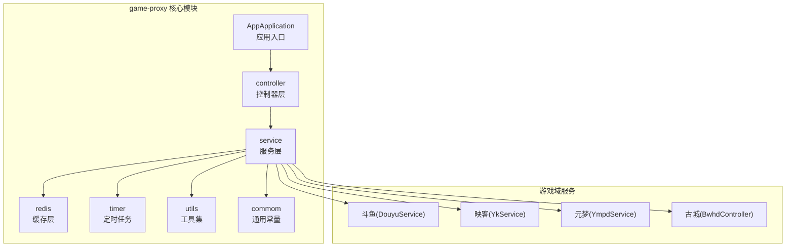
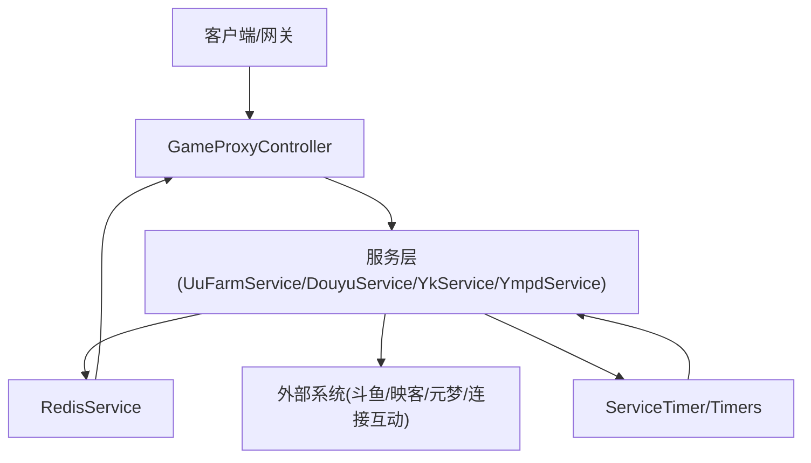
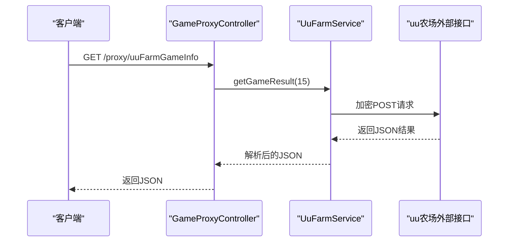
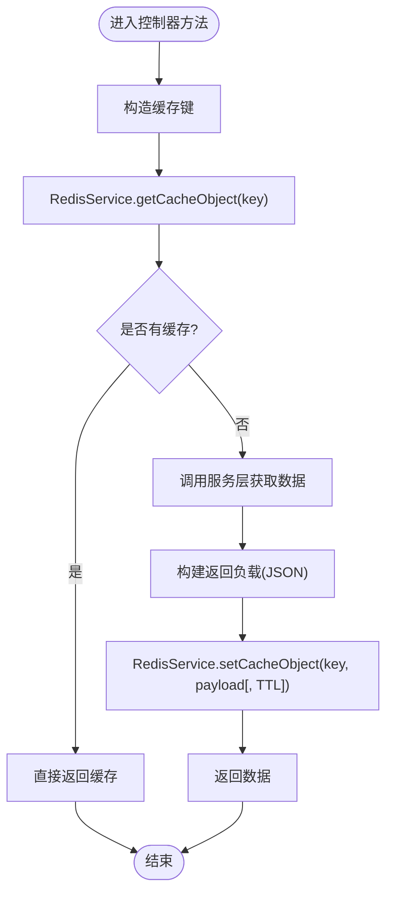
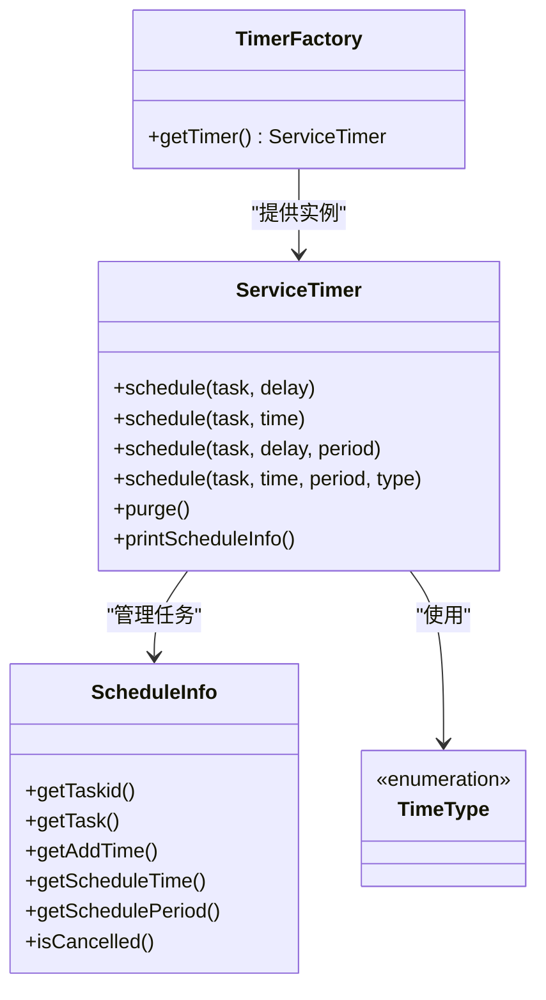
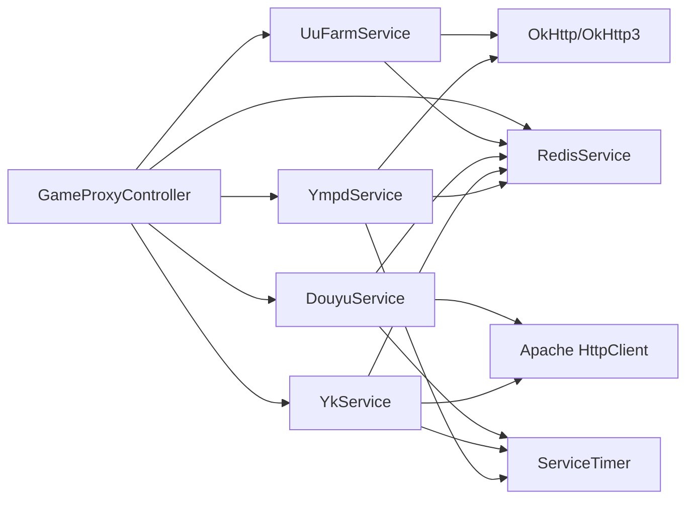

# 组件关系与集成

<cite>
**本文引用的文件**
- [AppApplication.java](file://game-proxy/src/main/java/com/game/AppApplication.java)
- [GameProxyController.java](file://game-proxy/src/main/java/com/game/controller/GameProxyController.java)
- [RedisService.java](file://game-proxy/src/main/java/com/game/redis/RedisService.java)
- [UuFarmService.java](file://game-proxy/src/main/java/com/game\uc/UuFarmService.java)
- [DouyuService.java](file://game-proxy/src/main/java/com/game/douyu/DouyuService.java)
- [YkService.java](file://game-proxy/src/main/java/com/game/yk/YkService.java)
- [YmpdService.java](file://game-proxy/src/main/java/com/game/ympd/YmpdService.java)
- [BwhdController.java](file://game-proxy/src/main/java/com/game/gcbwz/BwhdController.java)
- [ServiceTimer.java](file://game-proxy/src/main/java/com/game/timer/ServiceTimer.java)
- [TimerFactory.java](file://game-proxy/src/main/java/com/game/timer/TimerFactory.java)
- [ScheduleInfo.java](file://game-proxy/src/main/java/com/game/timer/ScheduleInfo.java)
- [TimeType.java](file://game-proxy/src/main/java/com/game/timer/TimeType.java)
- [Constants.java](file://game-proxy/src/main/java/com/game/commom/Constants.java)
- [DomainNameUtil.java](file://game-proxy/src/main/java/com/game/utils/DomainNameUtil.java)
- [application.yml](file://game-proxy/src/main/resources/application.yml)
- [pom.xml](file://game-proxy/pom.xml)
</cite>

## 目录
1. [简介](#简介)
2. [项目结构](#项目结构)
3. [核心组件](#核心组件)
4. [架构总览](#架构总览)
5. [详细组件分析](#详细组件分析)
6. [依赖分析](#依赖分析)
7. [性能考量](#性能考量)
8. [故障排查指南](#故障排查指南)
9. [结论](#结论)
10. [附录](#附录)

## 简介
本文件面向游戏代理系统，聚焦于组件关系与集成，系统通过控制器层对外提供统一入口，服务层负责业务编排与外部系统对接，缓存层提供高性能读写支持，定时任务模块保障周期性维护与健康检查。文档覆盖以下主题：
- 控制器与服务层调用关系
- 服务层与缓存层协作
- 定时任务与外部系统集成
- 通信协议与数据交换格式（REST/HTTP、WebSocket、缓存键规范）
- 生命周期管理（初始化顺序、依赖注入、资源清理）
- 系统集成点与扩展机制（插件化、配置中心、监控告警）

## 项目结构
系统采用多模块结构，game-proxy为核心应用模块，包含控制器、服务、定时任务、缓存、工具与各游戏域服务。各子模块按功能域划分，便于扩展与维护。

图表来源
- [AppApplication.java](file://game-proxy/src/main/java/com/game/AppApplication.java#L1-L33)
- [GameProxyController.java](file://game-proxy/src/main/java/com/game/controller/GameProxyController.java#L1-L436)
- [RedisService.java](file://game-proxy/src/main/java/com/game/redis/RedisService.java#L1-L244)
- [DouyuService.java](file://game-proxy/src/main/java/com/game/douyu/DouyuService.java#L1-L60)
- [YkService.java](file://game-proxy/src/main/java/com/game/yk/YkService.java#L1-L72)
- [YmpdService.java](file://game-proxy/src/main/java/com/game/ympd/YmpdService.java#L1-L83)
- [BwhdController.java](file://game-proxy/src/main/java/com/game/gcbwz/BwhdController.java#L1-L71)

章节来源
- [AppApplication.java](file://game-proxy/src/main/java/com/game/AppApplication.java#L1-L33)
- [application.yml](file://game-proxy/src/main/resources/application.yml#L1-L58)

## 核心组件
- 应用入口与调度
  - AppApplication：启用调度注解，启动后输出访问地址与Swagger地址，作为系统入口。
- 控制器层
  - GameProxyController：提供REST接口，封装外部游戏数据代理、缓存读取、时间同步、图片识别与自开奖等功能。
- 服务层
  - UuFarmService：uu农场加密请求与结果解析。
  - DouyuService：斗鱼数据拉取与初始化。
  - YkService：映客数据拉取与初始化。
  - YmpdService：元梦之星登录与健康检查。
  - BwhdController：古城历史数据与开奖时间查询。
- 缓存层
  - RedisService：统一的Redis操作封装，支持多种数据结构与过期策略。
- 定时任务
  - ServiceTimer：基于ScheduledThreadPoolExecutor的增强定时器，支持固定延迟、固定速率与周期类型转换。
  - TimerFactory：定时器工厂，提供全局定时器实例。
  - ScheduleInfo：定时任务元信息。
  - TimeType：时间单位枚举。
- 通信与配置
  - Constants：外部接口常量。
  - DomainNameUtil：连接互动域名列表。
  - application.yml：端口、Redis、HTTP连接池、业务配置等。

章节来源
- [AppApplication.java](file://game-proxy/src/main/java/com/game/AppApplication.java#L1-L33)
- [GameProxyController.java](file://game-proxy/src/main/java/com/game/controller/GameProxyController.java#L1-L436)
- [UuFarmService.java](file://game-proxy/src/main/java/com/game\uc/UuFarmService.java#L1-L135)
- [DouyuService.java](file://game-proxy/src/main/java/com/game/douyu/DouyuService.java#L1-L60)
- [YkService.java](file://game-proxy/src/main/java/com/game/yk/YkService.java#L1-L72)
- [YmpdService.java](file://game-proxy/src/main/java/com/game/ympd/YmpdService.java#L1-L83)
- [BwhdController.java](file://game-proxy/src/main/java/com/game/gcbwz/BwhdController.java#L1-L71)
- [RedisService.java](file://game-proxy/src/main/java/com/game/redis/RedisService.java#L1-L244)
- [ServiceTimer.java](file://game-proxy/src/main/java/com/game/timer/ServiceTimer.java#L1-L164)
- [TimerFactory.java](file://game-proxy/src/main/java/com/game/timer/TimerFactory.java)
- [ScheduleInfo.java](file://game-proxy/src/main/java/com/game/timer/ScheduleInfo.java)
- [TimeType.java](file://game-proxy/src/main/java/com/game/timer/TimeType.java)
- [Constants.java](file://game-proxy/src/main/java/com/game/commom/Constants.java#L1-L14)
- [DomainNameUtil.java](file://game-proxy/src/main/java/com/game/utils/DomainNameUtil.java#L1-L16)
- [application.yml](file://game-proxy/src/main/resources/application.yml#L1-L58)

## 架构总览
系统采用“控制器-服务-缓存-外部系统”的分层架构，控制器负责请求接入与参数校验，服务层编排业务逻辑并协调缓存与外部系统，定时任务负责周期性维护与健康检查。

图表来源
- [GameProxyController.java](file://game-proxy/src/main/java/com/game/controller/GameProxyController.java#L1-L436)
- [RedisService.java](file://game-proxy/src/main/java/com/game/redis/RedisService.java#L1-L244)
- [DouyuService.java](file://game-proxy/src/main/java/com/game/douyu/DouyuService.java#L1-L60)
- [YkService.java](file://game-proxy/src/main/java/com/game/yk/YkService.java#L1-L72)
- [YmpdService.java](file://game-proxy/src/main/java/com/game/ympd/YmpdService.java#L1-L83)
- [ServiceTimer.java](file://game-proxy/src/main/java/com/game/timer/ServiceTimer.java#L1-L164)

## 详细组件分析

### 控制器与服务层调用关系
- 控制器职责
  - 提供REST接口，处理参数与返回值，调用服务层执行业务。
  - 使用RedisService进行缓存读写，减少外部依赖压力。
  - 调用UuFarmService获取uu农场开奖结果。
  - 调用DomainNameUtil向连接互动同步开奖结果。
- 服务层职责
  - UuFarmService：加密请求、调用外部接口、解析结果。
  - DouyuService/YkService：封装外部数据请求与初始化流程。
  - YmpdService：登录获取token并定期健康检查。
  - BwhdController：古城历史数据与开奖时间查询。

图表来源
- [GameProxyController.java](file://game-proxy/src/main/java/com/game/controller/GameProxyController.java#L222-L225)
- [UuFarmService.java](file://game-proxy/src/main/java/com/game\uc/UuFarmService.java#L121-L131)

章节来源
- [GameProxyController.java](file://game-proxy/src/main/java/com/game/controller/GameProxyController.java#L1-L436)
- [UuFarmService.java](file://game-proxy/src/main/java/com/game\uc/UuFarmService.java#L1-L135)

### 服务层与缓存层协作
- 缓存键规范
  - 游戏信息键：gameInfo:{gameCode}
  - 游戏时间键：gameInfo:GameTime:{gameId}
  - 特定域键：如gameInfo:ucGameTime、gameInfo:yqlyyTime、gameInfo:dwydhGameTime
- 读写策略
  - 读：通过RedisService.getCacheObject(key)获取。
  - 写：通过RedisService.setCacheObject(key, value[, timeout, unit])设置。
  - 删除：通过RedisService.deleteObject(key)删除。
- 控制器示例
  - 读取游戏信息：/proxy/yhtxGameInfo、/proxy/lczhGameInfo、/proxy/dhsgGameInfo 等。
  - 写入游戏时间：/proxy/addUCTime、/proxy/addYqlyyTime、/proxy/addDwydh、/proxy/setGameTime。
  - 删除游戏时间：/proxy/delGameTime。

图表来源
- [GameProxyController.java](file://game-proxy/src/main/java/com/game/controller/GameProxyController.java#L90-L117)
- [GameProxyController.java](file://game-proxy/src/main/java/com/game/controller/GameProxyController.java#L184-L208)
- [GameProxyController.java](file://game-proxy/src/main/java/com/game/controller/GameProxyController.java#L231-L282)
- [RedisService.java](file://game-proxy/src/main/java/com/game/redis/RedisService.java#L95-L107)

章节来源
- [GameProxyController.java](file://game-proxy/src/main/java/com/game/controller/GameProxyController.java#L82-L117)
- [GameProxyController.java](file://game-proxy/src/main/java/com/game/controller/GameProxyController.java#L184-L208)
- [GameProxyController.java](file://game-proxy/src/main/java/com/game/controller/GameProxyController.java#L231-L282)
- [RedisService.java](file://game-proxy/src/main/java/com/game/redis/RedisService.java#L1-L244)

### 定时任务与外部系统集成
- 定时器实现
  - ServiceTimer继承ScheduledThreadPoolExecutor，提供统一的任务注册、周期转换与清理。
  - 支持固定延迟、固定速率与多种时间单位（毫秒至年）。
  - 定期清理取消的任务，避免内存泄漏。
- 外部系统集成
  - YmpdService：登录获取token，并周期性检查各游戏服务健康状态，必要时触发初始化。
  - YkService/DouyuService：通过线程池异步初始化各游戏服务。
- 工厂与元信息
  - TimerFactory：提供全局定时器实例。
  - ScheduleInfo：记录任务ID、添加时间、计划时间、周期等。
  - TimeType：时间单位枚举。

图表来源
- [ServiceTimer.java](file://game-proxy/src/main/java/com/game/timer/ServiceTimer.java#L1-L164)
- [TimerFactory.java](file://game-proxy/src/main/java/com/game/timer/TimerFactory.java)
- [ScheduleInfo.java](file://game-proxy/src/main/java/com/game/timer/ScheduleInfo.java)
- [TimeType.java](file://game-proxy/src/main/java/com/game/timer/TimeType.java)

章节来源
- [ServiceTimer.java](file://game-proxy/src/main/java/com/game/timer/ServiceTimer.java#L1-L164)
- [YmpdService.java](file://game-proxy/src/main/java/com/game/ympd/YmpdService.java#L58-L77)
- [YkService.java](file://game-proxy/src/main/java/com/game/yk/YkService.java#L31-L48)
- [DouyuService.java](file://game-proxy/src/main/java/com/game/douyu/DouyuService.java#L27-L36)

### 通信协议与数据交换格式
- RESTful API 设计
  - 控制器路径：/proxy 与 /gcbwz
  - 方法：GET/POST
  - 示例：
    - GET /proxy/uuFarmGameInfo
    - GET /proxy/yhtxGameInfo
    - GET /proxy/lczhGameInfo
    - GET /proxy/dhsgGameInfo
    - GET /proxy/bjxsgGameInfo
    - GET /proxy/bjxgwbsGameInfo
    - GET /proxy/ljhdshmjGameInfo
    - GET /proxy/ljhdyztxGameInfo
    - GET /proxy/getUCTime
    - GET /proxy/getYqlyyTime
    - GET /proxy/getdwydhTime
    - GET /proxy/getGameTime/{gameId}
    - GET /proxy/restartGameService?code=&account=&pwd=
    - POST /proxy/addDwydh
    - GET /proxy/shmjGameImageRecog
    - GET /proxy/selfOpening
    - GET /gcbwz/lastLucky
    - GET /gcbwz/luckyList
    - GET /gcbwz/luckyTime
- WebSocket
  - 系统包含WebSocket客户端类（如YlbwzWebSocketClient、BwhdWebSocketClient），用于与外部WebSocket服务交互，但当前未在控制器中直接暴露REST接口。
- 缓存数据结构
  - 字符串键值：存储JSON字符串或时间戳。
  - 示例键：gameInfo:yhtx、gameInfo:lczh、gameInfo:ucGameTime、gameInfo:yqlyyTime、gameInfo:GameTime:{gameId}、lottery_open_time_gc。
- 外部系统接口
  - 常量与域名：Constants.apiUrl1、DomainNameUtil.urls。
  - 映客/斗鱼/元梦等服务通过HTTP客户端发起请求。

章节来源
- [GameProxyController.java](file://game-proxy/src/main/java/com/game/controller/GameProxyController.java#L51-L436)
- [BwhdController.java](file://game-proxy/src/main/java/com/game/gcbwz/BwhdController.java#L28-L71)
- [Constants.java](file://game-proxy/src/main/java/com/game/commom/Constants.java#L1-L14)
- [DomainNameUtil.java](file://game-proxy/src/main/java/com/game/utils/DomainNameUtil.java#L1-L16)
- [RedisService.java](file://game-proxy/src/main/java/com/game/redis/RedisService.java#L95-L107)

### 生命周期管理
- 初始化顺序
  - 应用启动：AppApplication.main 启动Spring Boot应用，开启调度。
  - 服务初始化：YkService、DouyuService、YmpdService分别在线程池中执行init，完成外部系统初始化。
  - 定时任务：ServiceTimer在构造函数中启动清理任务，后续由TimerFactory提供统一实例。
- 依赖注入
  - 控制器通过@Resource/@Autowired注入服务与RedisService。
  - 服务内部通过@Autowired注入线程池与子服务。
- 资源清理
  - ServiceTimer.purge定期清理取消任务。
  - RedisService提供删除接口，控制器可按需清理缓存。

章节来源
- [AppApplication.java](file://game-proxy/src/main/java/com/game/AppApplication.java#L24-L31)
- [YkService.java](file://game-proxy/src/main/java/com/game/yk/YkService.java#L31-L48)
- [DouyuService.java](file://game-proxy/src/main/java/com/game/douyu/DouyuService.java#L27-L36)
- [YmpdService.java](file://game-proxy/src/main/java/com/game/ympd/YmpdService.java#L58-L77)
- [ServiceTimer.java](file://game-proxy/src/main/java/com/game/timer/ServiceTimer.java#L101-L113)
- [RedisService.java](file://game-proxy/src/main/java/com/game/redis/RedisService.java#L105-L107)

### 系统集成点与扩展机制
- 插件化设计
  - 各游戏域服务（YkService、DouyuService、YmpdService）可独立扩展新游戏或新接口。
  - 控制器通过统一的REST接口适配不同域服务。
- 配置中心
  - application.yml集中管理端口、Redis、HTTP连接池与业务配置（如session、用户名密码）。
- 监控告警
  - 控制器内置限流（如深海秘境图片识别5秒内仅一次）。
  - 定时任务输出线程池信息与健康检查日志。
  - 建议扩展：引入指标采集（Prometheus）、链路追踪（SkyWalking）与告警（AlertManager）。

章节来源
- [application.yml](file://game-proxy/src/main/resources/application.yml#L1-L58)
- [GameProxyController.java](file://game-proxy/src/main/java/com/game/controller/GameProxyController.java#L367-L371)
- [YmpdService.java](file://game-proxy/src/main/java/com/game/ympd/YmpdService.java#L58-L77)

## 依赖分析
- 组件耦合
  - 控制器依赖服务层与RedisService，服务层依赖定时器与外部系统。
  - 服务层之间存在组合关系（如YkService组合YkLczh1Service、YkYhtx1Service）。
- 外部依赖
  - Redis、HTTP客户端（OkHttp/OkHttp3、Apache HttpClient）、WebSocket客户端（Java-WebSocket）。
- 配置依赖
  - application.yml提供Redis、HTTP连接池、业务参数等配置。

图表来源
- [GameProxyController.java](file://game-proxy/src/main/java/com/game/controller/GameProxyController.java#L1-L436)
- [UuFarmService.java](file://game-proxy/src/main/java/com/game\uc/UuFarmService.java#L1-L135)
- [DouyuService.java](file://game-proxy/src/main/java/com/game/douyu/DouyuService.java#L1-L60)
- [YkService.java](file://game-proxy/src/main/java/com/game/yk/YkService.java#L1-L72)
- [YmpdService.java](file://game-proxy/src/main/java/com/game/ympd/YmpdService.java#L1-L83)
- [RedisService.java](file://game-proxy/src/main/java/com/game/redis/RedisService.java#L1-L244)
- [ServiceTimer.java](file://game-proxy/src/main/java/com/game/timer/ServiceTimer.java#L1-L164)

章节来源
- [pom.xml](file://game-proxy/pom.xml#L26-L100)

## 性能考量
- 缓存命中率
  - 控制器优先读取Redis缓存，减少外部请求压力；合理设置TTL避免陈旧数据。
- 并发与限流
  - 控制器对高频接口（如图片识别）进行限流，防止外部系统过载。
- 线程池与定时任务
  - ServiceTimer固定核心池大小，避免过多线程竞争；定期清理取消任务降低内存占用。
- HTTP连接池
  - application.yml配置连接池最大连接数、超时时间等，提升并发稳定性。

章节来源
- [GameProxyController.java](file://game-proxy/src/main/java/com/game/controller/GameProxyController.java#L367-L371)
- [ServiceTimer.java](file://game-proxy/src/main/java/com/game/timer/ServiceTimer.java#L21-L24)
- [application.yml](file://game-proxy/src/main/resources/application.yml#L43-L58)

## 故障排查指南
- 控制器异常
  - REST调用异常：检查外部接口可达性与参数格式。
  - 缓存异常：确认Redis连接与键空间。
- 服务层异常
  - uu农场加密/解密异常：核对AES配置与token有效性。
  - 外部系统返回异常：查看日志与状态码。
- 定时任务异常
  - 任务未执行：检查ServiceTimer是否正常运行与任务注册。
  - 健康检查未触发：确认YmpdService登录与定时任务调度。
- 配置问题
  - Redis连接失败：核对host/port/password/database。
  - HTTP超时：调整连接池与超时参数。

章节来源
- [UuFarmService.java](file://game-proxy/src/main/java/com/game\uc/UuFarmService.java#L88-L98)
- [YmpdService.java](file://game-proxy/src/main/java/com/game/ympd/YmpdService.java#L33-L56)
- [ServiceTimer.java](file://game-proxy/src/main/java/com/game/timer/ServiceTimer.java#L101-L113)
- [application.yml](file://game-proxy/src/main/resources/application.yml#L15-L31)

## 结论
本系统通过清晰的分层架构实现了控制器、服务、缓存与定时任务的协同工作，结合统一的REST接口与缓存策略，满足多游戏域数据代理与时间同步需求。建议后续完善监控体系与配置中心，进一步提升可观测性与可运维性。

## 附录
- 关键配置项
  - server.port/context-path：服务端口与上下文路径
  - spring.redis.*：Redis连接与池化配置
  - http.*：HTTP连接池与超时配置
  - manxiang.session.*：古城会话配置
  - ympd.*：元梦之星登录配置

章节来源
- [application.yml](file://game-proxy/src/main/resources/application.yml#L1-L58)