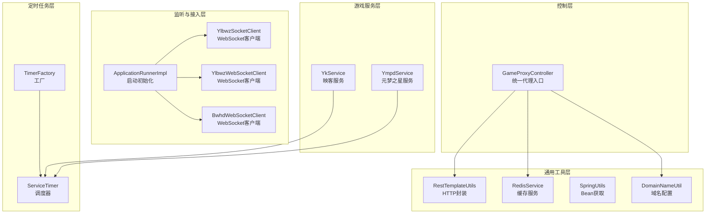
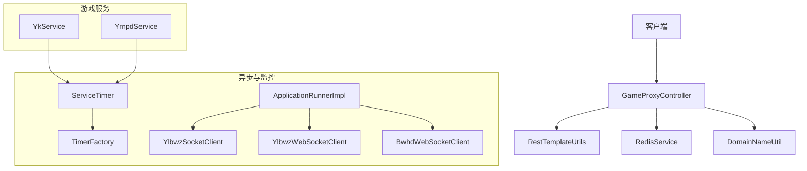
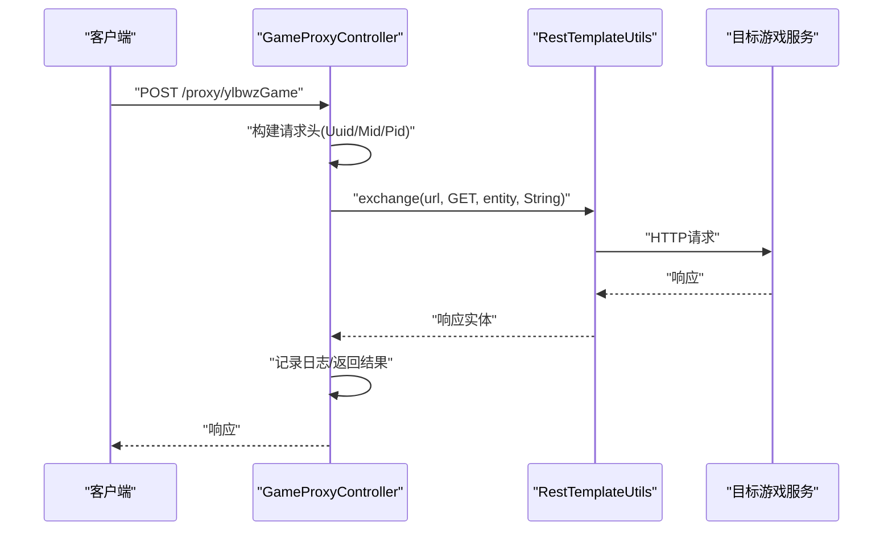
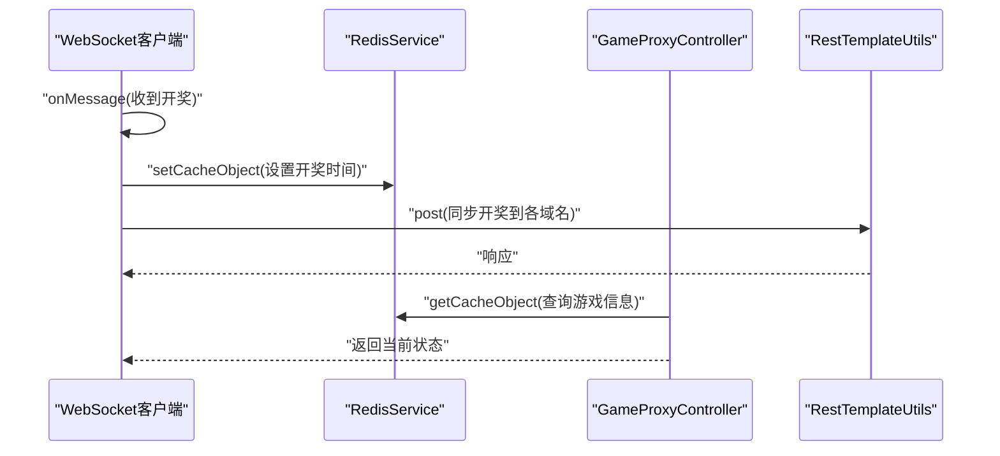
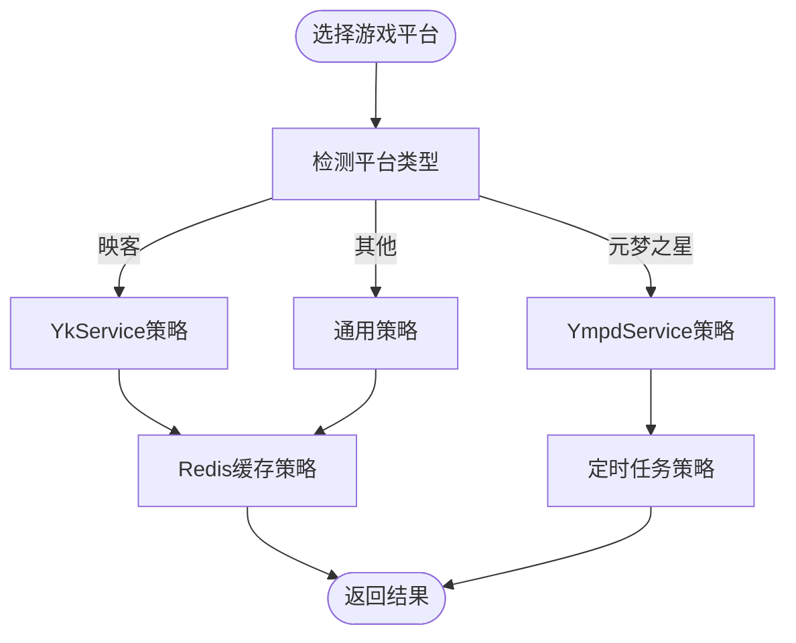
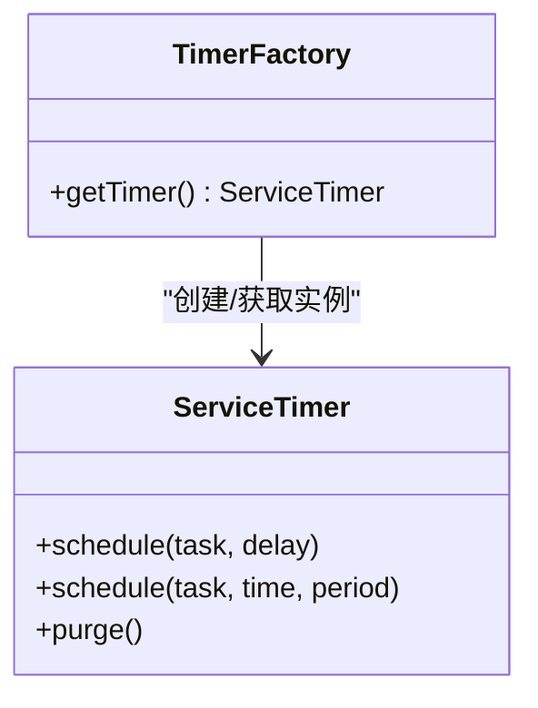
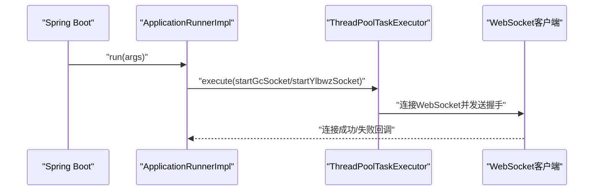
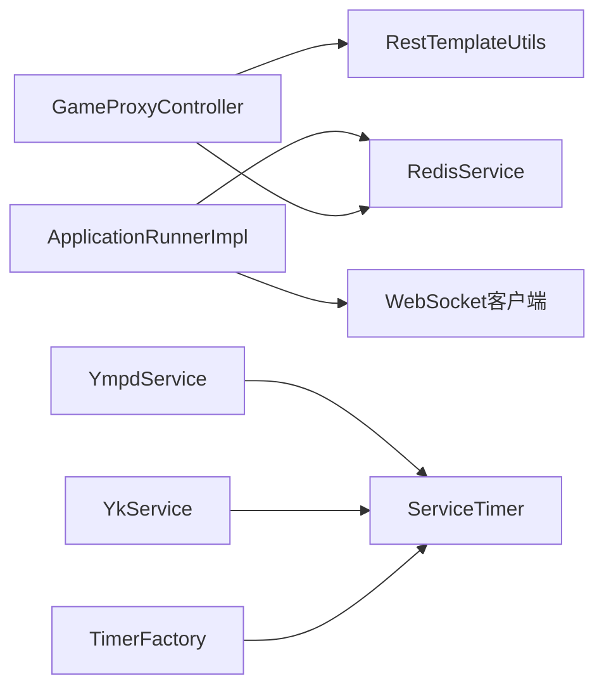

# 设计模式应用

<cite>
**本文引用的文件**
- [GameProxyController.java](file://game-proxy/src/main/java/com/game/controller/GameProxyController.java)
- [RestTemplateUtils.java](file://game-proxy/src/main/java/com/game/commom/RestTemplateUtils.java)
- [RedisService.java](file://game-proxy/src/main/java/com/game/redis/RedisService.java)
- [TimerFactory.java](file://game-proxy/src/main/java/com/game/timer/TimerFactory.java)
- [ServiceTimer.java](file://game-proxy/src/main/java/com/game/timer/ServiceTimer.java)
- [SpringUtils.java](file://game-proxy/src/main/java/com/game/utils/SpringUtils.java)
- [ApplicationRunnerImpl.java](file://game-proxy/src/main/java/com/game/listener/ApplicationRunnerImpl.java)
- [YkService.java](file://game-proxy/src/main/java/com/game/yk/YkService.java)
- [YmpdService.java](file://game-proxy/src/main/java/com/game/ympd/YmpdService.java)
- [YlbwzSocketClient.java](file://game-proxy/src/main/java/com/game/ylbwz/YlbwzSocketClient.java)
- [YlbwzWebSocketClient.java](file://game-proxy/src/main/java/com/game/ylbwz/YlbwzWebSocketClient.java)
- [BwhdWebSocketClient.java](file://game-proxy/src/main/java/com/game/gcbwz/BwhdWebSocketClient.java)
- [DomainNameUtil.java](file://game-proxy/src/main/java/com/game/utils/DomainNameUtil.java)
- [DwydhService.java](file://TigerTeeth/src/main/java/com/dwydh/DwydhService.java)
- [GameYqlyyWsClient.java](file://TigerTeeth/src/main/java/com/yqlyy/GameYqlyyWsClient.java)
</cite>

## 目录
1. [引言](#引言)
2. [项目结构](#项目结构)
3. [核心组件](#核心组件)
4. [架构总览](#架构总览)
5. [详细组件分析](#详细组件分析)
6. [依赖关系分析](#依赖关系分析)
7. [性能考量](#性能考量)
8. [故障排查指南](#故障排查指南)
9. [结论](#结论)
10. [附录](#附录)

## 引言
本文件聚焦于游戏代理系统中设计模式的实际应用，围绕以下目标展开：
- 代理模式：在统一API访问、请求转发、响应处理方面的实践
- 观察者模式：在游戏状态监控中的事件监听、状态变更通知与实时数据推送
- 策略模式：在不同游戏服务处理中的多平台适配、算法切换与扩展性设计
- 工厂模式：在定时任务创建中的任务实例化、配置管理与生命周期控制

通过对核心控制器、工具类、定时器与监听器的深入分析，结合序列图、类图与流程图，帮助读者快速理解系统如何通过设计模式提升可维护性与扩展性。

## 项目结构
系统采用按功能域划分的模块化组织方式，核心模块包括：
- 控制层：统一对外提供REST接口，封装各游戏服务的访问与转发
- 通用工具层：HTTP客户端封装、Redis缓存、Spring上下文工具
- 定时任务层：基于ScheduledThreadPoolExecutor的可管理调度器
- 监听与接入层：WebSocket客户端、应用启动初始化逻辑
- 游戏服务层：映客(YK)、元梦之星(YMPD)等第三方服务对接

图表来源
- [GameProxyController.java](file://game-proxy/src/main/java/com/game/controller/GameProxyController.java#L30-L436)
- [RestTemplateUtils.java](file://game-proxy/src/main/java/com/game/commom/RestTemplateUtils.java#L14-L51)
- [RedisService.java](file://game-proxy/src/main/java/com/game/redis/RedisService.java#L20-L244)
- [TimerFactory.java](file://game-proxy/src/main/java/com/game/timer/TimerFactory.java#L3-L11)
- [ServiceTimer.java](file://game-proxy/src/main/java/com/game/timer/ServiceTimer.java#L16-L164)
- [ApplicationRunnerImpl.java](file://game-proxy/src/main/java/com/game/listener/ApplicationRunnerImpl.java#L33-L174)
- [YkService.java](file://game-proxy/src/main/java/com/game/yk/YkService.java#L21-L72)
- [YmpdService.java](file://game-proxy/src/main/java/com/game/ympd/YmpdService.java#L20-L83)

章节来源
- [GameProxyController.java](file://game-proxy/src/main/java/com/game/controller/GameProxyController.java#L30-L436)
- [RestTemplateUtils.java](file://game-proxy/src/main/java/com/game/commom/RestTemplateUtils.java#L14-L51)
- [RedisService.java](file://game-proxy/src/main/java/com/game/redis/RedisService.java#L20-L244)
- [TimerFactory.java](file://game-proxy/src/main/java/com/game/timer/TimerFactory.java#L3-L11)
- [ServiceTimer.java](file://game-proxy/src/main/java/com/game/timer/ServiceTimer.java#L16-L164)
- [ApplicationRunnerImpl.java](file://game-proxy/src/main/java/com/game/listener/ApplicationRunnerImpl.java#L33-L174)
- [YkService.java](file://game-proxy/src/main/java/com/game/yk/YkService.java#L21-L72)
- [YmpdService.java](file://game-proxy/src/main/java/com/game/ympd/YmpdService.java#L20-L83)

## 核心组件
- 统一代理控制器：集中处理多游戏平台的请求转发、参数注入与响应聚合
- HTTP工具封装：统一封装GET/POST/Exchange，屏蔽底层RestTemplate细节
- 缓存服务：提供多种Redis操作，支撑游戏时间、开奖结果等状态存储
- 定时任务调度：基于线程池的可清理调度器，支持一次性与周期性任务
- 启动监听器：应用启动后初始化各游戏服务的WebSocket或轮询任务
- 游戏服务适配：映客与元梦之星服务分别负责不同平台的数据拉取与重启校验

章节来源
- [GameProxyController.java](file://game-proxy/src/main/java/com/game/controller/GameProxyController.java#L30-L436)
- [RestTemplateUtils.java](file://game-proxy/src/main/java/com/game/commom/RestTemplateUtils.java#L14-L51)
- [RedisService.java](file://game-proxy/src/main/java/com/game/redis/RedisService.java#L20-L244)
- [ServiceTimer.java](file://game-proxy/src/main/java/com/game/timer/ServiceTimer.java#L16-L164)
- [ApplicationRunnerImpl.java](file://game-proxy/src/main/java/com/game/listener/ApplicationRunnerImpl.java#L33-L174)
- [YkService.java](file://game-proxy/src/main/java/com/game/yk/YkService.java#L21-L72)
- [YmpdService.java](file://game-proxy/src/main/java/com/game/ympd/YmpdService.java#L20-L83)

## 架构总览
系统通过“控制器-工具-服务-监听”的分层结构实现高内聚低耦合的设计。控制器作为统一入口，利用HTTP工具与缓存服务完成跨平台数据聚合；定时任务与监听器负责异步初始化与状态监控；WebSocket客户端在收到上游开奖消息后进行实时同步。

图表来源
- [GameProxyController.java](file://game-proxy/src/main/java/com/game/controller/GameProxyController.java#L30-L436)
- [RestTemplateUtils.java](file://game-proxy/src/main/java/com/game/commom/RestTemplateUtils.java#L14-L51)
- [RedisService.java](file://game-proxy/src/main/java/com/game/redis/RedisService.java#L20-L244)
- [DomainNameUtil.java](file://game-proxy/src/main/java/com/game/utils/DomainNameUtil.java#L3-L16)
- [ServiceTimer.java](file://game-proxy/src/main/java/com/game/timer/ServiceTimer.java#L16-L164)
- [TimerFactory.java](file://game-proxy/src/main/java/com/game/timer/TimerFactory.java#L3-L11)
- [ApplicationRunnerImpl.java](file://game-proxy/src/main/java/com/game/listener/ApplicationRunnerImpl.java#L33-L174)
- [YkService.java](file://game-proxy/src/main/java/com/game/yk/YkService.java#L21-L72)
- [YmpdService.java](file://game-proxy/src/main/java/com/game/ympd/YmpdService.java#L20-L83)

## 详细组件分析

### 代理模式：统一API访问与请求转发
- 统一入口：控制器提供多条路径用于不同游戏平台的代理访问，如古城、幽林保卫战、UU农场等
- 请求封装：通过HTTP工具统一封装GET/POST/Exchange，隐藏底层RestTemplate配置
- 参数注入：针对特定平台注入必要头部或参数，确保下游服务鉴权与路由正确
- 响应聚合：将上游响应透传或二次加工后返回，同时记录日志便于追踪

图表来源
- [GameProxyController.java](file://game-proxy/src/main/java/com/game/controller/GameProxyController.java#L66-L81)
- [RestTemplateUtils.java](file://game-proxy/src/main/java/com/game/commom/RestTemplateUtils.java#L42-L44)

章节来源
- [GameProxyController.java](file://game-proxy/src/main/java/com/game/controller/GameProxyController.java#L45-L81)
- [RestTemplateUtils.java](file://game-proxy/src/main/java/com/game/commom/RestTemplateUtils.java#L14-L51)

### 观察者模式：游戏状态监控与实时推送
- 事件源：WebSocket客户端在收到上游开奖消息时触发
- 订阅方：控制器与监听器根据消息内容进行状态更新与通知
- 实时推送：将开奖结果同步至多个域名下的目标接口，实现跨节点一致性

图表来源
- [YlbwzSocketClient.java](file://game-proxy/src/main/java/com/game/ylbwz/YlbwzSocketClient.java#L37-L61)
- [YlbwzWebSocketClient.java](file://game-proxy/src/main/java/com/game/ylbwz/YlbwzWebSocketClient.java#L76-L88)
- [BwhdWebSocketClient.java](file://game-proxy/src/main/java/com/game/gcbwz/BwhdWebSocketClient.java#L74-L88)
- [RedisService.java](file://game-proxy/src/main/java/com/game/redis/RedisService.java#L95-L98)
- [DomainNameUtil.java](file://game-proxy/src/main/java/com/game/utils/DomainNameUtil.java#L3-L16)
- [GameProxyController.java](file://game-proxy/src/main/java/com/game/controller/GameProxyController.java#L90-L105)

章节来源
- [YlbwzSocketClient.java](file://game-proxy/src/main/java/com/game/ylbwz/YlbwzSocketClient.java#L37-L61)
- [YlbwzWebSocketClient.java](file://game-proxy/src/main/java/com/game/ylbwz/YlbwzWebSocketClient.java#L76-L88)
- [BwhdWebSocketClient.java](file://game-proxy/src/main/java/com/game/gcbwz/BwhdWebSocketClient.java#L74-L88)
- [RedisService.java](file://game-proxy/src/main/java/com/game/redis/RedisService.java#L20-L244)
- [DomainNameUtil.java](file://game-proxy/src/main/java/com/game/utils/DomainNameUtil.java#L3-L16)
- [GameProxyController.java](file://game-proxy/src/main/java/com/game/controller/GameProxyController.java#L90-L105)

### 策略模式：多游戏平台适配与扩展性设计
- 平台差异：不同游戏平台在鉴权、参数、域名等方面存在差异
- 统一抽象：通过控制器与工具类抽象出通用的访问与缓存策略
- 扩展点：新增平台只需在控制器中添加新路径，在工具类中补充必要的参数注入或缓存策略

图表来源
- [YkService.java](file://game-proxy/src/main/java/com/game/yk/YkService.java#L21-L72)
- [YmpdService.java](file://game-proxy/src/main/java/com/game/ympd/YmpdService.java#L20-L83)
- [RedisService.java](file://game-proxy/src/main/java/com/game/redis/RedisService.java#L20-L244)
- [ServiceTimer.java](file://game-proxy/src/main/java/com/game/timer/ServiceTimer.java#L16-L164)

章节来源
- [YkService.java](file://game-proxy/src/main/java/com/game/yk/YkService.java#L21-L72)
- [YmpdService.java](file://game-proxy/src/main/java/com/game/ympd/YmpdService.java#L20-L83)
- [RedisService.java](file://game-proxy/src/main/java/com/game/redis/RedisService.java#L20-L244)
- [ServiceTimer.java](file://game-proxy/src/main/java/com/game/timer/ServiceTimer.java#L16-L164)

### 工厂模式：定时任务创建与生命周期管理
- 工厂职责：提供全局唯一的调度器实例，避免重复创建与资源浪费
- 调度器能力：支持一次性与周期性任务，内置清理机制防止内存泄漏
- 生命周期：通过Spring容器管理线程池大小与任务注册，便于监控与运维

图表来源
- [TimerFactory.java](file://game-proxy/src/main/java/com/game/timer/TimerFactory.java#L3-L11)
- [ServiceTimer.java](file://game-proxy/src/main/java/com/game/timer/ServiceTimer.java#L16-L164)

章节来源
- [TimerFactory.java](file://game-proxy/src/main/java/com/game/timer/TimerFactory.java#L3-L11)
- [ServiceTimer.java](file://game-proxy/src/main/java/com/game/timer/ServiceTimer.java#L16-L164)

### 启动监听与异步初始化
- 启动阶段：应用启动后由监听器初始化各游戏服务的WebSocket或轮询任务
- 异步执行：通过线程池执行长时间任务，避免阻塞主线程
- 配置注入：从配置文件读取会话与手机号等参数，驱动WebSocket握手

图表来源
- [ApplicationRunnerImpl.java](file://game-proxy/src/main/java/com/game/listener/ApplicationRunnerImpl.java#L64-L145)
- [YlbwzSocketClient.java](file://game-proxy/src/main/java/com/game/ylbwz/YlbwzSocketClient.java#L37-L61)
- [BwhdWebSocketClient.java](file://game-proxy/src/main/java/com/game/gcbwz/BwhdWebSocketClient.java#L51-L56)

章节来源
- [ApplicationRunnerImpl.java](file://game-proxy/src/main/java/com/game/listener/ApplicationRunnerImpl.java#L33-L174)
- [YlbwzSocketClient.java](file://game-proxy/src/main/java/com/game/ylbwz/YlbwzSocketClient.java#L37-L61)
- [BwhdWebSocketClient.java](file://game-proxy/src/main/java/com/game/gcbwz/BwhdWebSocketClient.java#L51-L56)

### 其他相关组件
- HTTP工具：提供静态方法封装RestTemplate，简化控制器中的HTTP调用
- 缓存工具：提供多种Redis操作，支撑游戏时间、开奖结果等状态存储
- Spring工具：在非Spring管理环境中获取Bean，便于工具类中使用Spring组件
- 游戏服务：映客与元梦之星服务分别负责不同平台的数据拉取与重启校验

章节来源
- [RestTemplateUtils.java](file://game-proxy/src/main/java/com/game/commom/RestTemplateUtils.java#L14-L51)
- [RedisService.java](file://game-proxy/src/main/java/com/game/redis/RedisService.java#L20-L244)
- [SpringUtils.java](file://game-proxy/src/main/java/com/game/utils/SpringUtils.java#L16-L103)
- [YkService.java](file://game-proxy/src/main/java/com/game/yk/YkService.java#L21-L72)
- [YmpdService.java](file://game-proxy/src/main/java/com/game/ympd/YmpdService.java#L20-L83)

## 依赖关系分析
- 控制器依赖HTTP工具与缓存服务，形成稳定的外部交互面
- 定时任务通过工厂获取调度器，避免直接依赖具体实现
- 监听器依赖WebSocket客户端与Redis服务，负责异步初始化与状态更新
- 游戏服务依赖定时器与HTTP工具，实现数据拉取与健康检查

图表来源
- [GameProxyController.java](file://game-proxy/src/main/java/com/game/controller/GameProxyController.java#L30-L436)
- [RestTemplateUtils.java](file://game-proxy/src/main/java/com/game/commom/RestTemplateUtils.java#L14-L51)
- [RedisService.java](file://game-proxy/src/main/java/com/game/redis/RedisService.java#L20-L244)
- [TimerFactory.java](file://game-proxy/src/main/java/com/game/timer/TimerFactory.java#L3-L11)
- [ServiceTimer.java](file://game-proxy/src/main/java/com/game/timer/ServiceTimer.java#L16-L164)
- [ApplicationRunnerImpl.java](file://game-proxy/src/main/java/com/game/listener/ApplicationRunnerImpl.java#L33-L174)
- [YkService.java](file://game-proxy/src/main/java/com/game/yk/YkService.java#L21-L72)
- [YmpdService.java](file://game-proxy/src/main/java/com/game/ympd/YmpdService.java#L20-L83)

章节来源
- [GameProxyController.java](file://game-proxy/src/main/java/com/game/controller/GameProxyController.java#L30-L436)
- [TimerFactory.java](file://game-proxy/src/main/java/com/game/timer/TimerFactory.java#L3-L11)
- [ServiceTimer.java](file://game-proxy/src/main/java/com/game/timer/ServiceTimer.java#L16-L164)
- [ApplicationRunnerImpl.java](file://game-proxy/src/main/java/com/game/listener/ApplicationRunnerImpl.java#L33-L174)
- [YkService.java](file://game-proxy/src/main/java/com/game/yk/YkService.java#L21-L72)
- [YmpdService.java](file://game-proxy/src/main/java/com/game/ympd/YmpdService.java#L20-L83)

## 性能考量
- 线程池管理：定时任务与WebSocket初始化均通过线程池执行，避免阻塞主线程
- 缓存命中：通过Redis缓存游戏时间与开奖结果，减少重复请求
- 限流保护：控制器对高频接口进行限流，防止重复提交
- 调度清理：定时器内置清理机制，定期移除已完成或取消的任务，降低内存占用

## 故障排查指南
- 接口限流：当短时间内重复调用高频接口时，控制器会拒绝请求并记录警告日志
- WebSocket异常：监听器在启动WebSocket时捕获异常并重试，日志中记录错误信息
- HTTP异常：控制器在向多个域名同步开奖时捕获异常并记录错误，不影响主流程
- 定时任务异常：定时器在创建任务时捕获异常并记录日志，避免影响整体调度

章节来源
- [GameProxyController.java](file://game-proxy/src/main/java/com/game/controller/GameProxyController.java#L367-L412)
- [ApplicationRunnerImpl.java](file://game-proxy/src/main/java/com/game/listener/ApplicationRunnerImpl.java#L104-L142)
- [YlbwzSocketClient.java](file://game-proxy/src/main/java/com/game/ylbwz/YlbwzSocketClient.java#L49-L58)
- [ServiceTimer.java](file://game-proxy/src/main/java/com/game/timer/ServiceTimer.java#L37-L41)

## 结论
本系统通过代理模式实现了统一的API访问与请求转发，借助观察者模式完成了游戏状态的实时监控与推送，运用策略模式提升了多平台适配与扩展能力，并通过工厂模式与定时任务调度器保障了任务创建与生命周期管理的稳定性。整体架构清晰、职责明确，具备良好的可维护性与扩展性。

## 附录
- 代码片段路径示例（不展示具体代码内容）：
  - 统一代理控制器：[GameProxyController.java](file://game-proxy/src/main/java/com/game/controller/GameProxyController.java#L30-L436)
  - HTTP工具封装：[RestTemplateUtils.java](file://game-proxy/src/main/java/com/game/commom/RestTemplateUtils.java#L14-L51)
  - 缓存服务：[RedisService.java](file://game-proxy/src/main/java/com/game/redis/RedisService.java#L20-L244)
  - 定时任务工厂：[TimerFactory.java](file://game-proxy/src/main/java/com/game/timer/TimerFactory.java#L3-L11)
  - 调度器实现：[ServiceTimer.java](file://game-proxy/src/main/java/com/game/timer/ServiceTimer.java#L16-L164)
  - 启动监听器：[ApplicationRunnerImpl.java](file://game-proxy/src/main/java/com/game/listener/ApplicationRunnerImpl.java#L33-L174)
  - 映客服务：[YkService.java](file://game-proxy/src/main/java/com/game/yk/YkService.java#L21-L72)
  - 元梦之星服务：[YmpdService.java](file://game-proxy/src/main/java/com/game/ympd/YmpdService.java#L20-L83)
  - 幽林WebSocket客户端：[YlbwzSocketClient.java](file://game-proxy/src/main/java/com/game/ylbwz/YlbwzSocketClient.java#L37-L61)
  - 幽林WebSocket客户端（WebSocket版本）：[YlbwzWebSocketClient.java](file://game-proxy/src/main/java/com/game/ylbwz/YlbwzWebSocketClient.java#L76-L88)
  - 古城WebSocket客户端：[BwhdWebSocketClient.java](file://game-proxy/src/main/java/com/game/gcbwz/BwhdWebSocketClient.java#L74-L88)
  - 域名配置：[DomainNameUtil.java](file://game-proxy/src/main/java/com/game/utils/DomainNameUtil.java#L3-L16)
  - 虎牙WebSocket客户端（示例）：[GameYqlyyWsClient.java](file://TigerTeeth/src/main/java/com/yqlyy/GameYqlyyWsClient.java#L221-L224)
  - 宠物马拉松服务（示例）：[DwydhService.java](file://TigerTeeth/src/main/java/com/dwydh/DwydhService.java#L21-L36)