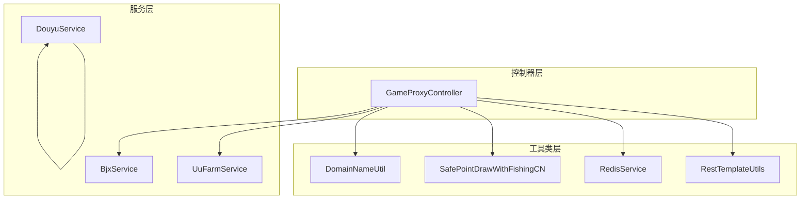
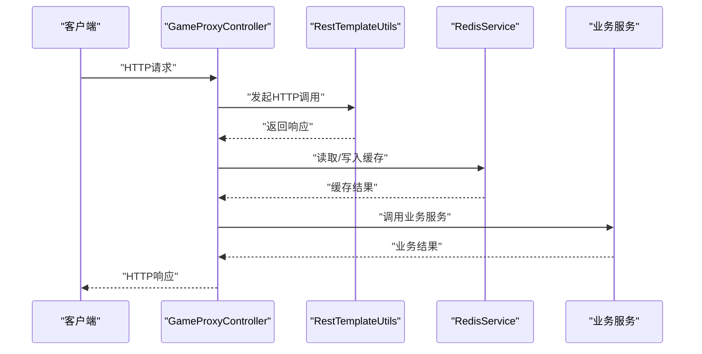
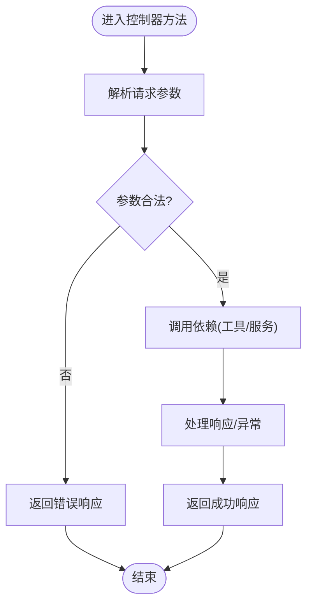
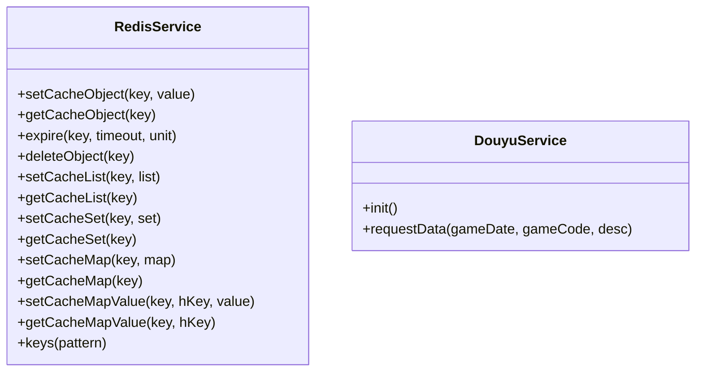
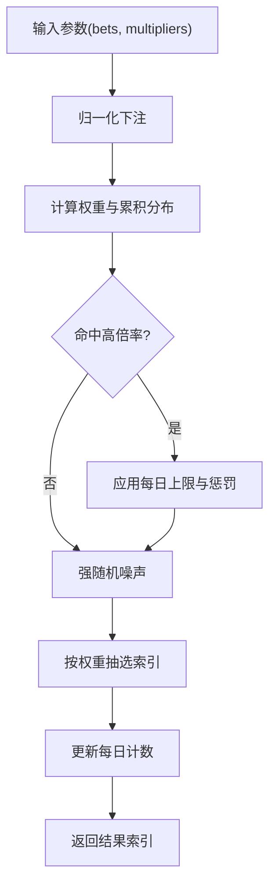
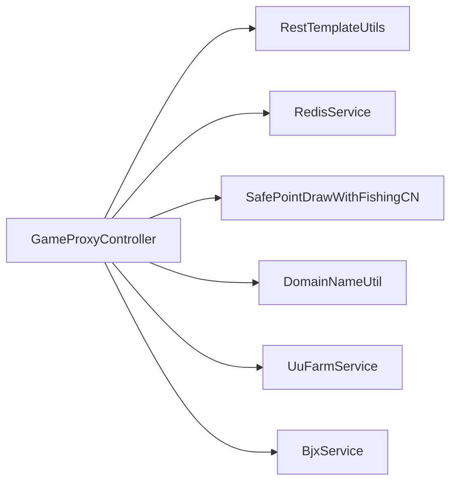

# 单元测试设计

<cite>
**本文引用的文件**
- [GameProxyController.java](file://game-proxy/src/main/java/com/game/controller/GameProxyController.java)
- [RedisService.java](file://game-proxy/src/main/java/com/game/redis/RedisService.java)
- [RestTemplateUtils.java](file://game-proxy/src/main/java/com/game/commom/RestTemplateUtils.java)
- [SafePointDrawWithFishingCN.java](file://game-proxy/src/main/java/com/game/utils/SafePointDrawWithFishingCN.java)
- [DomainNameUtil.java](file://game-proxy/src/main/java/com/game/utils/DomainNameUtil.java)
- [DouyuService.java](file://game-proxy/src/main/java/com/game/douyu/DouyuService.java)
- [RedisTest.java](file://game-proxy/src/test/java/RedisTest.java)
- [pom.xml](file://game-proxy/pom.xml)
</cite>

## 目录
1. [引言](#引言)
2. [项目结构](#项目结构)
3. [核心组件](#核心组件)
4. [架构总览](#架构总览)
5. [详细组件分析](#详细组件分析)
6. [依赖分析](#依赖分析)
7. [性能考量](#性能考量)
8. [故障排查指南](#故障排查指南)
9. [结论](#结论)
10. [附录](#附录)

## 引言
本设计文档面向游戏代理系统的单元测试，围绕测试金字塔理论，系统性地规划控制器层、服务层与工具类的测试策略，明确Mock对象与测试替身的选择原则，提供可复用的测试用例模板与最佳实践，并给出测试数据准备与清理机制、异常与边界条件验证方法、测试覆盖率计算与质量标准，以及测试驱动开发（TDD）实施建议。

## 项目结构
游戏代理系统采用Spring Boot工程组织，核心模块包括：
- 控制器层：对外提供HTTP接口，负责参数校验、请求转发与响应封装
- 服务层：业务处理与调度，如定时任务、第三方接口调用
- 工具类层：通用算法与工具方法，如随机抽选、时间处理、网络请求封装
- 数据访问层：基于RedisTemplate的Redis服务封装

图表来源
- [GameProxyController.java](file://game-proxy/src/main/java/com/game/controller/GameProxyController.java#L36-L436)
- [RedisService.java](file://game-proxy/src/main/java/com/game/redis/RedisService.java#L18-L244)
- [RestTemplateUtils.java](file://game-proxy/src/main/java/com/game/commom/RestTemplateUtils.java#L13-L51)
- [SafePointDrawWithFishingCN.java](file://game-proxy/src/main/java/com/game/utils/SafePointDrawWithFishingCN.java#L18-L316)
- [DomainNameUtil.java](file://game-proxy/src/main/java/com/game/utils/DomainNameUtil.java#L3-L16)
- [DouyuService.java](file://game-proxy/src/main/java/com/game/douyu/DouyuService.java#L18-L60)

章节来源
- [GameProxyController.java](file://game-proxy/src/main/java/com/game/controller/GameProxyController.java#L36-L436)
- [pom.xml](file://game-proxy/pom.xml#L26-L101)

## 核心组件
- 控制器层：集中于GameProxyController，提供游戏信息查询、时间管理、图片识别、自开奖等功能接口
- 服务层：RedisService封装Redis操作；RestTemplateUtils封装HTTP请求；工具类包含随机抽选算法与域名常量
- 业务服务：UuFarmService、BjxService、DouyuService等，承担具体业务逻辑

章节来源
- [GameProxyController.java](file://game-proxy/src/main/java/com/game/controller/GameProxyController.java#L36-L436)
- [RedisService.java](file://game-proxy/src/main/java/com/game/redis/RedisService.java#L18-L244)
- [RestTemplateUtils.java](file://game-proxy/src/main/java/com/game/commom/RestTemplateUtils.java#L13-L51)
- [SafePointDrawWithFishingCN.java](file://game-proxy/src/main/java/com/game/utils/SafePointDrawWithFishingCN.java#L18-L316)
- [DomainNameUtil.java](file://game-proxy/src/main/java/com/game/utils/DomainNameUtil.java#L3-L16)
- [DouyuService.java](file://game-proxy/src/main/java/com/game/douyu/DouyuService.java#L18-L60)

## 架构总览
控制器通过工具类与服务层协作，完成外部请求转发、缓存读写与业务计算。测试金字塔从下至上为：
- 单元测试：工具类与纯函数方法
- 集成测试：控制器与服务交互（Mock外部依赖）
- 端到端测试：真实环境下的HTTP集成验证

图表来源
- [GameProxyController.java](file://game-proxy/src/main/java/com/game/controller/GameProxyController.java#L51-L81)
- [RestTemplateUtils.java](file://game-proxy/src/main/java/com/game/commom/RestTemplateUtils.java#L26-L44)
- [RedisService.java](file://game-proxy/src/main/java/com/game/redis/RedisService.java#L95-L107)

## 详细组件分析

### 控制器层测试策略
- 接口覆盖：针对每个HTTP端点，验证请求参数、响应内容与异常分支
- Mock外部依赖：使用Mock对象替换RestTemplateUtils与RedisService，隔离网络与缓存
- 限流与边界：验证限流逻辑与非法输入处理
- 示例端点：
  - 游戏信息查询：ylbwzGameInfo、lczhGameInfo、dhsgGameInfo等
  - 时间管理：addUCTime、getYqlyyTime、setGameTime等
  - 图片识别：shmjGameImageRecog
  - 自开奖：selfOpening

图表来源
- [GameProxyController.java](file://game-proxy/src/main/java/com/game/controller/GameProxyController.java#L51-L81)
- [GameProxyController.java](file://game-proxy/src/main/java/com/game/controller/GameProxyController.java#L360-L412)

章节来源
- [GameProxyController.java](file://game-proxy/src/main/java/com/game/controller/GameProxyController.java#L51-L81)
- [GameProxyController.java](file://game-proxy/src/main/java/com/game/controller/GameProxyController.java#L183-L208)
- [GameProxyController.java](file://game-proxy/src/main/java/com/game/controller/GameProxyController.java#L230-L282)
- [GameProxyController.java](file://game-proxy/src/main/java/com/game/controller/GameProxyController.java#L360-L412)
- [GameProxyController.java](file://game-proxy/src/main/java/com/game/controller/GameProxyController.java#L416-L428)

### 服务层测试策略
- RedisService：验证缓存读写、过期设置、删除、集合与哈希操作
- DouyuService：验证异步初始化与参数构造逻辑
- 测试替身选择：
  - RedisService：使用内存或本地Mock实现，避免真实Redis依赖
  - DouyuService：Mock线程池与子服务，确保可控执行

图表来源
- [RedisService.java](file://game-proxy/src/main/java/com/game/redis/RedisService.java#L24-L243)
- [DouyuService.java](file://game-proxy/src/main/java/com/game/douyu/DouyuService.java#L27-L57)

章节来源
- [RedisService.java](file://game-proxy/src/main/java/com/game/redis/RedisService.java#L24-L243)
- [DouyuService.java](file://game-proxy/src/main/java/com/game/douyu/DouyuService.java#L27-L57)

### 工具类测试策略
- SafePointDrawWithFishingCN：核心随机抽选算法，需覆盖权重计算、每日上限、水洗返还、补偿与捕鱼模块
- DomainNameUtil：静态域名数组，验证遍历与拼接逻辑
- RestTemplateUtils：静态HTTP封装，需Mock静态依赖或使用测试替身

图表来源
- [SafePointDrawWithFishingCN.java](file://game-proxy/src/main/java/com/game/utils/SafePointDrawWithFishingCN.java#L89-L146)

章节来源
- [SafePointDrawWithFishingCN.java](file://game-proxy/src/main/java/com/game/utils/SafePointDrawWithFishingCN.java#L89-L146)
- [DomainNameUtil.java](file://game-proxy/src/main/java/com/game/utils/DomainNameUtil.java#L3-L16)
- [RestTemplateUtils.java](file://game-proxy/src/main/java/com/game/commom/RestTemplateUtils.java#L13-L51)

### Mock对象与测试替身选择原则
- 优先使用接口Mock，便于替换与隔离
- 对静态工具类（如RestTemplateUtils）建议通过可注入的客户端或工厂进行解耦，以便在测试中注入替身
- 对于Redis操作，使用内存数据库或Mock实现，避免真实依赖
- 对于线程池与定时任务，使用可控的测试执行器或禁用实际调度

章节来源
- [RestTemplateUtils.java](file://game-proxy/src/main/java/com/game/commom/RestTemplateUtils.java#L13-L51)
- [RedisService.java](file://game-proxy/src/main/java/com/game/redis/RedisService.java#L18-L244)
- [DouyuService.java](file://game-proxy/src/main/java/com/game/douyu/DouyuService.java#L27-L36)

### 测试用例编写模板与最佳实践
- 模板结构
  - 准备阶段：构造输入参数、Mock依赖、设置期望行为
  - 执行阶段：调用目标方法
  - 断言阶段：验证返回值、副作用、异常抛出
  - 清理阶段：恢复状态、释放资源
- 最佳实践
  - 使用参数化测试覆盖边界与异常场景
  - 保持测试独立性，避免共享状态
  - 使用领域特定断言（如JSON字段、时间范围、权重分布）

章节来源
- [RedisTest.java](file://game-proxy/src/test/java/RedisTest.java#L37-L92)

### 测试数据准备与清理机制
- 准备：构造最小化输入集，覆盖正常、边界与异常三类
- 清理：在测试结束后删除临时键、重置静态状态、关闭Mock
- 建议：使用测试容器或内存数据库，确保可重复执行

章节来源
- [RedisService.java](file://game-proxy/src/main/java/com/game/redis/RedisService.java#L105-L117)
- [RedisTest.java](file://game-proxy/src/test/java/RedisTest.java#L37-L92)

### 异常与边界条件验证
- 参数边界：时间戳长度、数值范围、字符串格式
- 限流与并发：验证限流窗口内的重复请求处理
- 网络异常：模拟HTTP失败与超时
- 缓存异常：模拟Redis不可用或键不存在

章节来源
- [GameProxyController.java](file://game-proxy/src/main/java/com/game/controller/GameProxyController.java#L360-L412)
- [GameProxyController.java](file://game-proxy/src/main/java/com/game/controller/GameProxyController.java#L306-L322)

### 测试覆盖率与质量标准
- 覆盖率指标：语句覆盖率、分支覆盖率、方法覆盖率、类覆盖率
- 质量标准：核心算法与关键路径覆盖率不低于80%，公共工具类不低于90%
- 工具：结合Maven插件与JaCoCo生成报告，持续监控回归

章节来源
- [pom.xml](file://game-proxy/pom.xml#L101-L163)

### 测试驱动开发（TDD）实施指南
- 红-绿-重构循环：先编写失败测试，再实现最小功能，最后重构
- 从简单到复杂：先测试纯函数与工具类，再逐步引入控制器与服务
- 用例驱动设计：通过测试暴露设计缺陷，指导接口演进
- 持续集成：在CI中运行单元测试与覆盖率检查

## 依赖分析
控制器与工具类之间存在直接依赖，服务层作为外部依赖被控制器间接使用。测试时应通过Mock或替身隔离这些依赖，确保单元测试的稳定性与可重复性。

图表来源
- [GameProxyController.java](file://game-proxy/src/main/java/com/game/controller/GameProxyController.java#L36-L436)
- [RestTemplateUtils.java](file://game-proxy/src/main/java/com/game/commom/RestTemplateUtils.java#L13-L51)
- [RedisService.java](file://game-proxy/src/main/java/com/game/redis/RedisService.java#L18-L244)
- [SafePointDrawWithFishingCN.java](file://game-proxy/src/main/java/com/game/utils/SafePointDrawWithFishingCN.java#L18-L316)
- [DomainNameUtil.java](file://game-proxy/src/main/java/com/game/utils/DomainNameUtil.java#L3-L16)

章节来源
- [GameProxyController.java](file://game-proxy/src/main/java/com/game/controller/GameProxyController.java#L36-L436)

## 性能考量
- 单元测试应避免真实网络与数据库IO，使用Mock与内存实现
- 对高成本操作（如随机抽选）进行统计性断言而非精确值断言
- 控制并发与限流逻辑的测试，确保在高负载下仍满足性能要求

## 故障排查指南
- 日志定位：利用控制器与工具类的日志输出快速定位问题
- 异常链路：重点检查HTTP异常、Redis异常与业务异常的处理分支
- 回归验证：对修复的缺陷补充针对性测试用例，防止再次出现

章节来源
- [GameProxyController.java](file://game-proxy/src/main/java/com/game/controller/GameProxyController.java#L398-L407)
- [RedisService.java](file://game-proxy/src/main/java/com/game/redis/RedisService.java#L95-L98)

## 结论
通过测试金字塔与严格的Mock策略，游戏代理系统的单元测试能够高效覆盖核心逻辑，保障代码质量与可维护性。建议优先完善工具类与控制器的单元测试，逐步扩展到服务层与端到端测试，配合持续集成与覆盖率监控，形成完善的质量保障体系。

## 附录
- 测试用例模板示例（路径参考）
  - RedisService读写测试：[RedisTest.java](file://game-proxy/src/test/java/RedisTest.java#L37-L92)
  - 工具类边界测试：[SafePointDrawWithFishingCN.java](file://game-proxy/src/main/java/com/game/utils/SafePointDrawWithFishingCN.java#L89-L146)
  - 控制器限流测试：[GameProxyController.java](file://game-proxy/src/main/java/com/game/controller/GameProxyController.java#L360-L412)