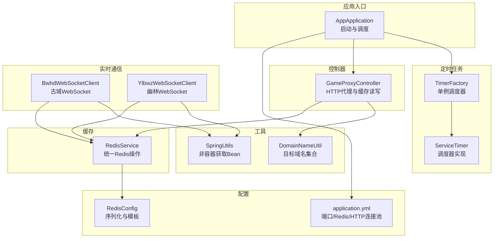
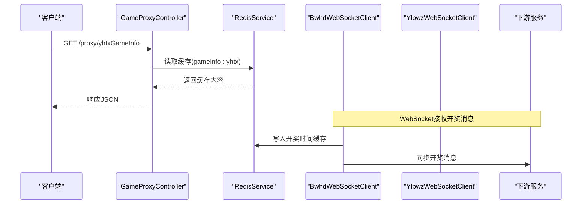
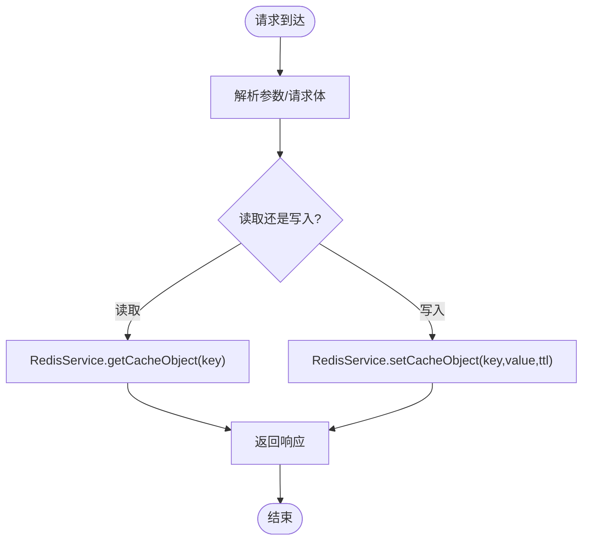
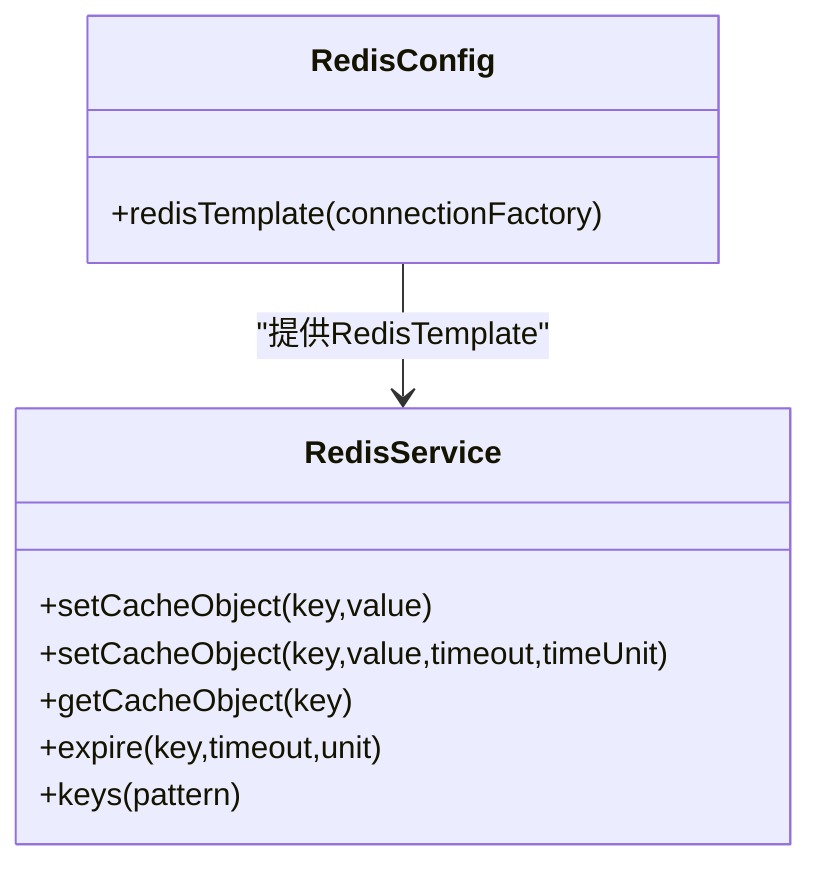
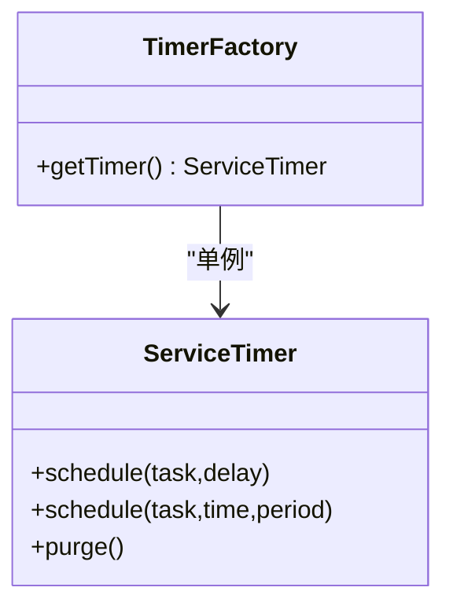
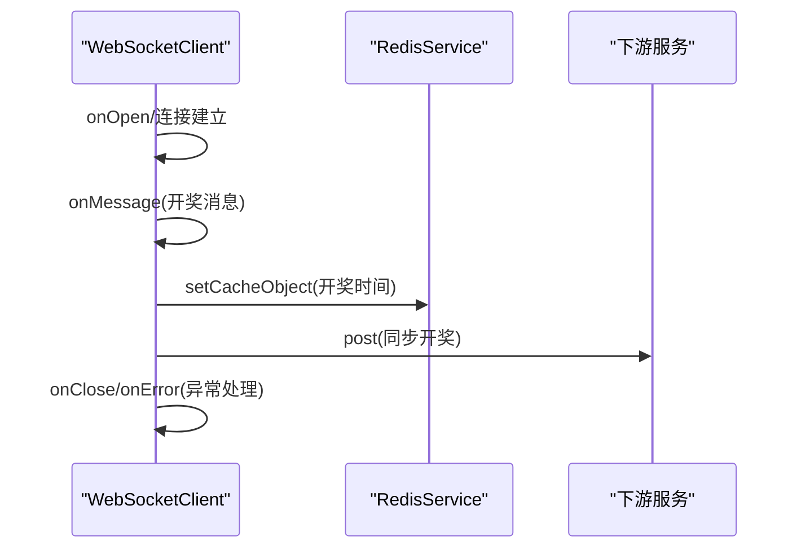
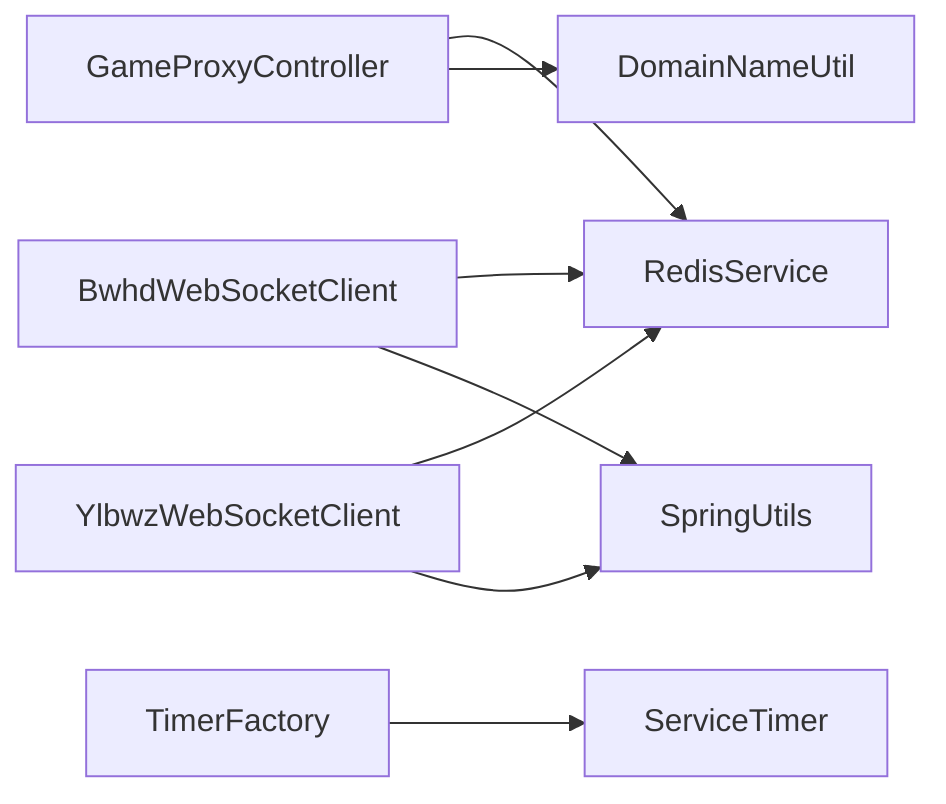

# 性能测试方法

<cite>
**本文引用的文件**
- [AppApplication.java](file://game-proxy/src/main/java/com/game/AppApplication.java)
- [application.yml](file://game-proxy/src/main/resources/application.yml)
- [RedisConfig.java](file://game-proxy/src/main/java/com/game/redis/RedisConfig.java)
- [RedisService.java](file://game-proxy/src/main/java/com/game/redis/RedisService.java)
- [GameProxyController.java](file://game-proxy/src/main/java/com/game/controller/GameProxyController.java)
- [BwhdWebSocketClient.java](file://game-proxy/src/main/java/com/game/gcbwz/BwhdWebSocketClient.java)
- [YlbwzWebSocketClient.java](file://game-proxy/src/main/java/com/game/ylbwz/YlbwzWebSocketClient.java)
- [ServiceTimer.java](file://game-proxy/src/main/java/com/game/timer/ServiceTimer.java)
- [TimerFactory.java](file://game-proxy/src/main/java/com/game/timer/TimerFactory.java)
- [SpringUtils.java](file://game-proxy/src/main/java/com/game/utils/SpringUtils.java)
- [DomainNameUtil.java](file://game-proxy/src/main/java/com/game/utils/DomainNameUtil.java)
- [RedisTest.java](file://game-proxy/src/test/java/RedisTest.java)
</cite>

## 目录
1. [引言](#引言)
2. [项目结构](#项目结构)
3. [核心组件](#核心组件)
4. [架构总览](#架构总览)
5. [详细组件分析](#详细组件分析)
6. [依赖分析](#依赖分析)
7. [性能考量](#性能考量)
8. [故障排查指南](#故障排查指南)
9. [结论](#结论)
10. [附录](#附录)

## 引言
本文件面向游戏代理系统，提供一套系统化的性能测试方法论，覆盖目标设定、指标定义、负载设计、Redis专项测试、定时任务性能评估、WebSocket实时传输测试、基准与回归策略、监控与分析方法以及优化建议。文档基于仓库现有实现进行分析，确保测试方案可落地、可量化、可复现。

## 项目结构
系统采用Spring Boot微服务架构，主要模块包括：
- 控制器层：对外提供HTTP代理接口，集中于控制器类
- 业务与工具层：包含定时任务调度、WebSocket客户端、Redis访问封装、通用工具类
- 配置层：应用配置与Redis连接配置
- 测试层：基础Redis功能测试样例

图表来源
- [AppApplication.java](file://game-proxy/src/main/java/com/game/AppApplication.java#L15-L32)
- [application.yml](file://game-proxy/src/main/resources/application.yml#L1-L58)
- [RedisConfig.java](file://game-proxy/src/main/java/com/game/redis/RedisConfig.java#L27-L39)
- [RedisService.java](file://game-proxy/src/main/java/com/game/redis/RedisService.java#L20-L243)
- [GameProxyController.java](file://game-proxy/src/main/java/com/game/controller/GameProxyController.java#L36-L435)
- [TimerFactory.java](file://game-proxy/src/main/java/com/game/timer/TimerFactory.java#L3-L10)
- [ServiceTimer.java](file://game-proxy/src/main/java/com/game/timer/ServiceTimer.java#L16-L163)
- [BwhdWebSocketClient.java](file://game-proxy/src/main/java/com/game/gcbwz/BwhdWebSocketClient.java#L27-L191)
- [YlbwzWebSocketClient.java](file://game-proxy/src/main/java/com/game/ylbwz/YlbwzWebSocketClient.java#L29-L192)
- [SpringUtils.java](file://game-proxy/src/main/java/com/game/utils/SpringUtils.java#L15-L102)
- [DomainNameUtil.java](file://game-proxy/src/main/java/com/game/utils/DomainNameUtil.java#L3-L15)

章节来源
- [AppApplication.java](file://game-proxy/src/main/java/com/game/AppApplication.java#L15-L32)
- [application.yml](file://game-proxy/src/main/resources/application.yml#L1-L58)

## 核心组件
- 应用入口与调度：应用启动类启用调度注解，便于定时任务运行
- HTTP代理控制器：提供多游戏信息查询与缓存写入接口，承载高并发请求
- Redis服务：统一封装多种数据结构操作，支撑高频读写
- 定时任务调度器：基于线程池的调度器，支持一次性与周期性任务
- WebSocket客户端：连接外部游戏服务器，接收开奖消息并同步至下游
- 工具类：提供Spring上下文Bean获取与域名集合常量

章节来源
- [AppApplication.java](file://game-proxy/src/main/java/com/game/AppApplication.java#L15-L32)
- [GameProxyController.java](file://game-proxy/src/main/java/com/game/controller/GameProxyController.java#L36-L435)
- [RedisService.java](file://game-proxy/src/main/java/com/game/redis/RedisService.java#L20-L243)
- [ServiceTimer.java](file://game-proxy/src/main/java/com/game/timer/ServiceTimer.java#L16-L163)
- [BwhdWebSocketClient.java](file://game-proxy/src/main/java/com/game/gcbwz/BwhdWebSocketClient.java#L27-L191)
- [YlbwzWebSocketClient.java](file://game-proxy/src/main/java/com/game/ylbwz/YlbwzWebSocketClient.java#L29-L192)
- [SpringUtils.java](file://game-proxy/src/main/java/com/game/utils/SpringUtils.java#L15-L102)
- [DomainNameUtil.java](file://game-proxy/src/main/java/com/game/utils/DomainNameUtil.java#L3-L15)

## 架构总览
系统通过控制器承接外部HTTP请求，利用Redis进行数据缓存与状态同步；定时任务负责周期性维护；WebSocket客户端与外部游戏服务交互，回传开奖信息并触发下游同步。

图表来源
- [GameProxyController.java](file://game-proxy/src/main/java/com/game/controller/GameProxyController.java#L86-L105)
- [RedisService.java](file://game-proxy/src/main/java/com/game/redis/RedisService.java#L95-L98)
- [BwhdWebSocketClient.java](file://game-proxy/src/main/java/com/game/gcbwz/BwhdWebSocketClient.java#L74-L102)
- [YlbwzWebSocketClient.java](file://game-proxy/src/main/java/com/game/ylbwz/YlbwzWebSocketClient.java#L77-L105)

## 详细组件分析

### HTTP代理与缓存读写性能
- 接口特性：控制器提供多GET/POST接口，用于读取与写入游戏信息缓存
- 关键路径：请求进入控制器后直接调用RedisService进行读写
- 并发控制：控制器未内置限流，需结合网关或线程池配置进行压测

图表来源
- [GameProxyController.java](file://game-proxy/src/main/java/com/game/controller/GameProxyController.java#L86-L105)
- [RedisService.java](file://game-proxy/src/main/java/com/game/redis/RedisService.java#L30-L44)

章节来源
- [GameProxyController.java](file://game-proxy/src/main/java/com/game/controller/GameProxyController.java#L36-L435)
- [RedisService.java](file://game-proxy/src/main/java/com/game/redis/RedisService.java#L20-L243)

### Redis性能专项测试
- 序列化配置：Key使用字符串序列化，Value使用JSON序列化，减少跨语言/跨服务兼容问题
- 连接池配置：最大活跃连接数、最大空闲、最小空闲等参数影响并发能力
- 数据结构选择：针对高频读写场景优先使用String/ValueOperations，必要时使用Hash/List/Set
- 命中率测试：通过压测统计命中率、过期策略有效性与内存占用
- 内存优化验证：观察LRU淘汰、过期键清理、序列化体积对内存的影响

图表来源
- [RedisConfig.java](file://game-proxy/src/main/java/com/game/redis/RedisConfig.java#L27-L39)
- [RedisService.java](file://game-proxy/src/main/java/com/game/redis/RedisService.java#L20-L243)

章节来源
- [RedisConfig.java](file://game-proxy/src/main/java/com/game/redis/RedisConfig.java#L10-L40)
- [RedisService.java](file://game-proxy/src/main/java/com/game/redis/RedisService.java#L20-L243)
- [application.yml](file://game-proxy/src/main/resources/application.yml#L15-L31)
- [RedisTest.java](file://game-proxy/src/test/java/RedisTest.java#L12-L94)

### 定时任务性能测试与瓶颈分析
- 调度器实现：基于ScheduledThreadPoolExecutor，支持一次性与固定频率任务
- 任务清理：定期清理已取消任务，避免内存泄漏
- 瓶颈点：线程池大小、任务执行耗时、任务堆积导致的延迟放大
- 测试策略：构造长耗时任务、突发任务提交、任务取消与恢复，评估延迟与吞吐

图表来源
- [TimerFactory.java](file://game-proxy/src/main/java/com/game/timer/TimerFactory.java#L3-L10)
- [ServiceTimer.java](file://game-proxy/src/main/java/com/game/timer/ServiceTimer.java#L16-L163)

章节来源
- [TimerFactory.java](file://game-proxy/src/main/java/com/game/timer/TimerFactory.java#L3-L10)
- [ServiceTimer.java](file://game-proxy/src/main/java/com/game/timer/ServiceTimer.java#L16-L163)

### WebSocket连接与实时数据传输测试
- 连接管理：客户端封装连接、消息处理、关闭与错误回调
- 实时同步：收到开奖消息后写入Redis并同步至下游服务
- 测试要点：连接稳定性、断线重连、消息乱序与丢失、批量消息处理效率

图表来源
- [BwhdWebSocketClient.java](file://game-proxy/src/main/java/com/game/gcbwz/BwhdWebSocketClient.java#L63-L131)
- [YlbwzWebSocketClient.java](file://game-proxy/src/main/java/com/game/ylbwz/YlbwzWebSocketClient.java#L66-L138)

章节来源
- [BwhdWebSocketClient.java](file://game-proxy/src/main/java/com/game/gcbwz/BwhdWebSocketClient.java#L27-L191)
- [YlbwzWebSocketClient.java](file://game-proxy/src/main/java/com/game/ylbwz/YlbwzWebSocketClient.java#L29-L192)
- [SpringUtils.java](file://game-proxy/src/main/java/com/game/utils/SpringUtils.java#L15-L102)
- [DomainNameUtil.java](file://game-proxy/src/main/java/com/game/utils/DomainNameUtil.java#L3-L15)

## 依赖分析
- 控制器依赖RedisService与工具类，耦合度适中
- WebSocket客户端通过SpringUtils获取RedisService，存在非容器环境依赖风险
- 定时任务通过单例工厂获取调度器，集中管理任务生命周期

图表来源
- [GameProxyController.java](file://game-proxy/src/main/java/com/game/controller/GameProxyController.java#L36-L435)
- [RedisService.java](file://game-proxy/src/main/java/com/game/redis/RedisService.java#L20-L243)
- [BwhdWebSocketClient.java](file://game-proxy/src/main/java/com/game/gcbwz/BwhdWebSocketClient.java#L53-L57)
- [YlbwzWebSocketClient.java](file://game-proxy/src/main/java/com/game/ylbwz/YlbwzWebSocketClient.java#L57-L58)
- [SpringUtils.java](file://game-proxy/src/main/java/com/game/utils/SpringUtils.java#L15-L102)
- [TimerFactory.java](file://game-proxy/src/main/java/com/game/timer/TimerFactory.java#L3-L10)
- [ServiceTimer.java](file://game-proxy/src/main/java/com/game/timer/ServiceTimer.java#L16-L163)

章节来源
- [GameProxyController.java](file://game-proxy/src/main/java/com/game/controller/GameProxyController.java#L36-L435)
- [BwhdWebSocketClient.java](file://game-proxy/src/main/java/com/game/gcbwz/BwhdWebSocketClient.java#L53-L57)
- [YlbwzWebSocketClient.java](file://game-proxy/src/main/java/com/game/ylbwz/YlbwzWebSocketClient.java#L57-L58)
- [TimerFactory.java](file://game-proxy/src/main/java/com/game/timer/TimerFactory.java#L3-L10)

## 性能考量
- 响应时间：关注控制器接口与Redis读写延迟，结合HTTP连接池参数优化
- 吞吐量：评估控制器并发处理能力与Redis连接池容量上限
- 并发能力：分析定时任务线程池大小与WebSocket客户端并发连接数
- 缓存命中率：通过压测统计命中率，调整TTL与预热策略
- 内存使用：监控Redis内存增长趋势，评估序列化体积与过期策略
- 网络与I/O：关注HTTP客户端超时、WebSocket心跳与断线重连策略

## 故障排查指南
- Redis连接异常：检查连接池配置与密码、网络连通性
- 定时任务堆积：查看调度器清理日志与任务数量，调整线程池大小
- WebSocket断线：确认握手参数、心跳机制与重连逻辑
- 控制器限流：若出现大量拒绝请求，需在网关或应用层增加限流策略

章节来源
- [application.yml](file://game-proxy/src/main/resources/application.yml#L15-L57)
- [ServiceTimer.java](file://game-proxy/src/main/java/com/game/timer/ServiceTimer.java#L101-L113)
- [BwhdWebSocketClient.java](file://game-proxy/src/main/java/com/game/gcbwz/BwhdWebSocketClient.java#L134-L171)
- [YlbwzWebSocketClient.java](file://game-proxy/src/main/java/com/game/ylbwz/YlbwzWebSocketClient.java#L160-L179)

## 结论
通过明确性能目标与指标、分层设计负载场景、专项测试Redis与WebSocket、结合定时任务与控制器的并发瓶颈分析，可构建完整的性能测试体系。建议持续开展基准测试与回归测试，配合监控与告警，保障系统在高并发场景下的稳定性与可扩展性。

## 附录
- 性能测试流程建议
  - 基准测试：确定系统在稳定状态下的基线指标
  - 负载测试：逐步提升并发与数据规模，记录响应时间与错误率
  - 压力测试：突破系统极限，定位瓶颈与失效点
  - 回归测试：每次变更后重复关键场景，确保性能不退化
- 监控与分析
  - 使用应用与中间件监控采集CPU、内存、线程、连接数、Redis命中率等指标
  - 分析慢请求与异常堆栈，定位热点接口与慢查询
- 优化建议
  - 合理设置Redis连接池与序列化策略
  - 优化定时任务执行粒度与线程池大小
  - 在控制器层引入必要的限流与熔断
  - 对WebSocket客户端增加心跳与指数退避重连