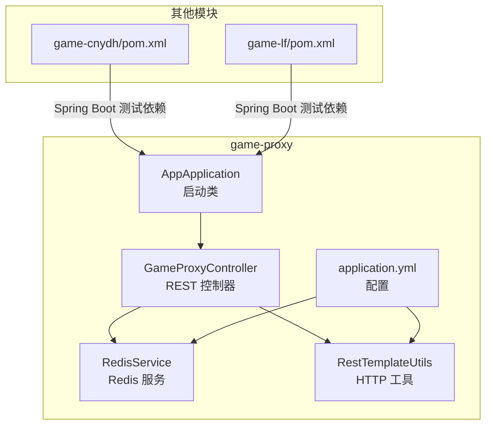
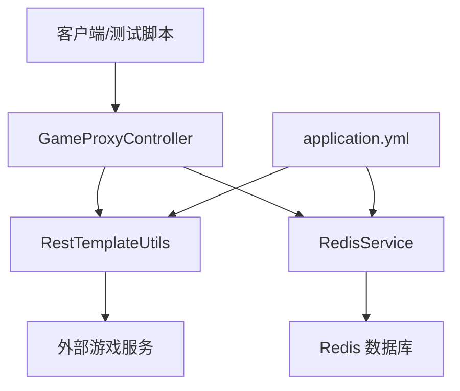
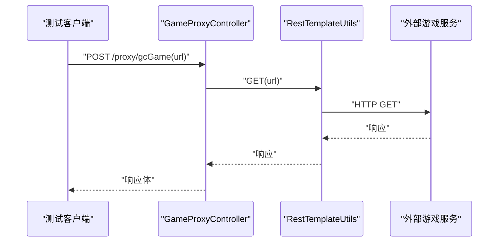
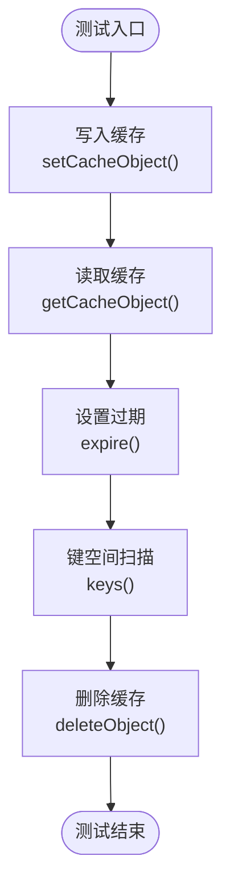
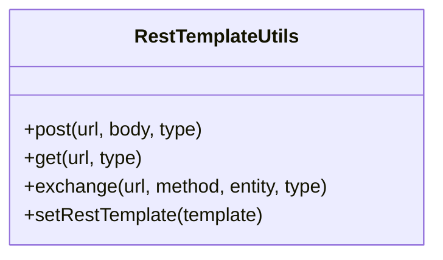
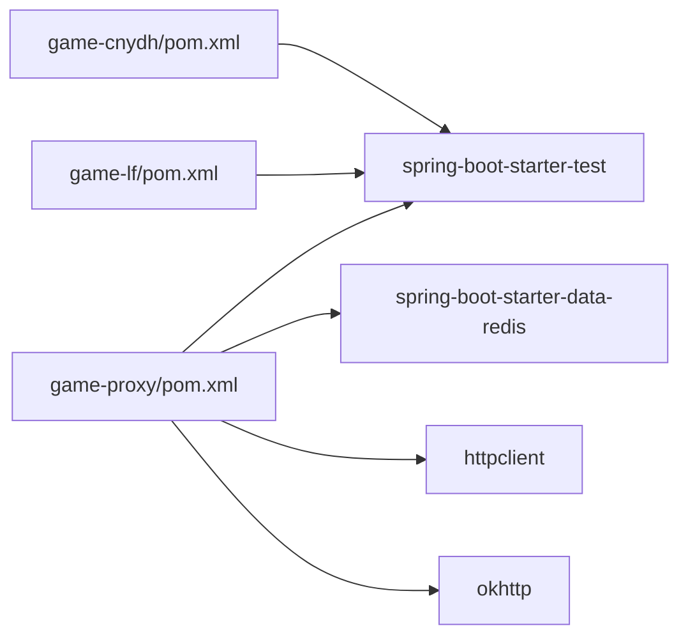

# 测试工具使用

<cite>
**本文引用的文件**
- [game-proxy/pom.xml](file://game-proxy/pom.xml)
- [game-proxy/src/test/java/RedisTest.java](file://game-proxy/src/test/java/RedisTest.java)
- [game-proxy/src/main/java/com/game/AppApplication.java](file://game-proxy/src/main/java/com/game/AppApplication.java)
- [game-proxy/src/main/java/com/game/controller/GameProxyController.java](file://game-proxy/src/main/java/com/game/controller/GameProxyController.java)
- [game-proxy/src/main/java/com/game/redis/RedisService.java](file://game-proxy/src/main/java/com/game/redis/RedisService.java)
- [game-proxy/src/main/java/com/game/commom/RestTemplateUtils.java](file://game-proxy/src/main/java/com/game/commom/RestTemplateUtils.java)
- [game-proxy/src/main/resources/application.yml](file://game-proxy/src/main/resources/application.yml)
- [game-cnydh/pom.xml](file://game-cnydh/pom.xml)
- [game-cnydh/src/test/java/RedisTest.java](file://game-cnydh/src/test/java/RedisTest.java)
- [game-lf/pom.xml](file://game-lf/pom.xml)
- [game-lf/src/test/java/RedisTest.java](file://game-lf/src/test/java/RedisTest.java)
</cite>

## 目录
1. [简介](#简介)
2. [项目结构](#项目结构)
3. [核心组件](#核心组件)
4. [架构总览](#架构总览)
5. [详细组件分析](#详细组件分析)
6. [依赖分析](#依赖分析)
7. [性能考量](#性能考量)
8. [故障排查指南](#故障排查指南)
9. [结论](#结论)
10. [附录](#附录)

## 简介
本指南面向游戏代理系统（game-proxy）的测试工具使用，围绕以下目标展开：
- JUnit 5 测试框架的配置与使用：测试注解与断言方法的应用
- Mockito Mock 框架的使用技巧与测试替身创建
- Spring Boot Test 的集成测试配置与测试环境搭建
- Testcontainers 容器化测试的实施与 Docker 配置建议
- 性能测试工具（JMeter、Gatling）的使用与测试场景设计
- 代码覆盖率工具 JaCoCo 的配置与报告生成
- 测试数据管理与数据库测试的实施方法
- 持续集成工具（Jenkins、GitHub Actions）的测试自动化配置
- 测试报告生成与测试结果分析工具的使用

本仓库已具备基础的 Spring Boot 测试依赖与 Redis 访问能力，可作为集成测试与数据库测试的良好起点。

## 项目结构
- 核心模块：game-proxy 提供代理控制器、Redis 服务与 HTTP 客户端工具
- 其他模块：game-cnydh、game-lf、bettaFish、TigerTeeth 为独立业务模块，均包含基础 Spring Boot 依赖
- 测试现状：各模块存在 Redis 测试示例（注释状态），未发现显式的 JUnit 5 或 Mockito 使用

**图表来源**
- [game-proxy/src/main/java/com/game/AppApplication.java](file://game-proxy/src/main/java/com/game/AppApplication.java#L15-L31)
- [game-proxy/src/main/java/com/game/controller/GameProxyController.java](file://game-proxy/src/main/java/com/game/controller/GameProxyController.java#L36-L39)
- [game-proxy/src/main/java/com/game/redis/RedisService.java](file://game-proxy/src/main/java/com/game/redis/RedisService.java#L18-L22)
- [game-proxy/src/main/java/com/game/commom/RestTemplateUtils.java](file://game-proxy/src/main/java/com/game/commom/RestTemplateUtils.java#L13-L49)
- [game-proxy/src/main/resources/application.yml](file://game-proxy/src/main/resources/application.yml#L1-L58)
- [game-cnydh/pom.xml](file://game-cnydh/pom.xml#L26-L35)
- [game-lf/pom.xml](file://game-lf/pom.xml#L26-L35)

**章节来源**
- [game-proxy/pom.xml](file://game-proxy/pom.xml#L26-L35)
- [game-proxy/src/main/resources/application.yml](file://game-proxy/src/main/resources/application.yml#L1-L58)
- [game-proxy/src/main/java/com/game/AppApplication.java](file://game-proxy/src/main/java/com/game/AppApplication.java#L15-L31)

## 核心组件
- 启动类与环境：启动类负责输出访问地址与日志，便于本地联调与测试验证
- 控制器层：提供代理接口与游戏时间维护接口，便于构造 HTTP 集成测试
- Redis 服务：封装 Redis 基本读写、过期与键空间操作，支撑缓存型测试场景
- HTTP 工具：封装 RestTemplate 的 GET/POST/exchange，便于模拟外部服务交互

**章节来源**
- [game-proxy/src/main/java/com/game/AppApplication.java](file://game-proxy/src/main/java/com/game/AppApplication.java#L24-L31)
- [game-proxy/src/main/java/com/game/controller/GameProxyController.java](file://game-proxy/src/main/java/com/game/controller/GameProxyController.java#L51-L58)
- [game-proxy/src/main/java/com/game/redis/RedisService.java](file://game-proxy/src/main/java/com/game/redis/RedisService.java#L30-L98)
- [game-proxy/src/main/java/com/game/commom/RestTemplateUtils.java](file://game-proxy/src/main/java/com/game/commom/RestTemplateUtils.java#L26-L44)

## 架构总览
下图展示控制器、服务与外部依赖之间的交互关系，以及测试关注点（HTTP、Redis、配置）：

**图表来源**
- [game-proxy/src/main/java/com/game/controller/GameProxyController.java](file://game-proxy/src/main/java/com/game/controller/GameProxyController.java#L51-L81)
- [game-proxy/src/main/java/com/game/commom/RestTemplateUtils.java](file://game-proxy/src/main/java/com/game/commom/RestTemplateUtils.java#L26-L44)
- [game-proxy/src/main/java/com/game/redis/RedisService.java](file://game-proxy/src/main/java/com/game/redis/RedisService.java#L30-L98)
- [game-proxy/src/main/resources/application.yml](file://game-proxy/src/main/resources/application.yml#L15-L57)

## 详细组件分析

### 控制器层测试要点
- 接口覆盖：对代理接口与游戏时间维护接口进行集成测试，验证请求参数、响应内容与异常分支
- 场景设计：
  - 正常路径：构造合法 URL 与必要头参数，校验响应体与日志
  - 异常路径：模拟网络异常或外部服务不可达，验证容错与日志记录
- 断言建议：使用断言校验响应状态码、响应体结构与关键字段

**图表来源**
- [game-proxy/src/main/java/com/game/controller/GameProxyController.java](file://game-proxy/src/main/java/com/game/controller/GameProxyController.java#L51-L58)
- [game-proxy/src/main/java/com/game/commom/RestTemplateUtils.java](file://game-proxy/src/main/java/com/game/commom/RestTemplateUtils.java#L38-L44)

**章节来源**
- [game-proxy/src/main/java/com/game/controller/GameProxyController.java](file://game-proxy/src/main/java/com/game/controller/GameProxyController.java#L51-L58)

### Redis 服务测试要点
- 缓存读写：验证字符串、Hash、List、Set、Map 等类型的存取与过期
- 键空间操作：验证 keys 模式匹配与批量删除
- 集成测试：结合控制器接口，验证时间缓存的设置、查询与清理

**图表来源**
- [game-proxy/src/main/java/com/game/redis/RedisService.java](file://game-proxy/src/main/java/com/game/redis/RedisService.java#L30-L98)
- [game-proxy/src/main/java/com/game/redis/RedisService.java](file://game-proxy/src/main/java/com/game/redis/RedisService.java#L240-L242)

**章节来源**
- [game-proxy/src/main/java/com/game/redis/RedisService.java](file://game-proxy/src/main/java/com/game/redis/RedisService.java#L30-L242)
- [game-proxy/src/test/java/RedisTest.java](file://game-proxy/src/test/java/RedisTest.java#L37-L92)

### HTTP 工具测试要点
- 方法覆盖：对 GET、POST、exchange 进行单元测试，确保参数传递与响应封装正确
- 异常处理：模拟网络异常，验证异常捕获与日志输出

**图表来源**
- [game-proxy/src/main/java/com/game/commom/RestTemplateUtils.java](file://game-proxy/src/main/java/com/game/commom/RestTemplateUtils.java#L13-L49)

**章节来源**
- [game-proxy/src/main/java/com/game/commom/RestTemplateUtils.java](file://game-proxy/src/main/java/com/game/commom/RestTemplateUtils.java#L26-L49)

### 配置与环境
- Redis 连接：通过 application.yml 配置主机、端口、密码与连接池参数
- HTTP 客户端：配置连接超时、读取超时与并发参数
- 启动信息：启动类输出访问地址，便于本地联调

**章节来源**
- [game-proxy/src/main/resources/application.yml](file://game-proxy/src/main/resources/application.yml#L15-L57)
- [game-proxy/src/main/java/com/game/AppApplication.java](file://game-proxy/src/main/java/com/game/AppApplication.java#L24-L31)

## 依赖分析
- 测试依赖：game-proxy、game-cnydh、game-lf 均引入了 spring-boot-starter-test，具备 JUnit 5 与 Spring Boot Test 基础能力
- Redis 依赖：spring-boot-starter-data-redis，支持 Redis 集成测试
- HTTP 客户端：Apache HttpClient 与 OkHttp，配合 RestTemplateUtils 使用

**图表来源**
- [game-proxy/pom.xml](file://game-proxy/pom.xml#L26-L35)
- [game-proxy/pom.xml](file://game-proxy/pom.xml#L75-L99)
- [game-cnydh/pom.xml](file://game-cnydh/pom.xml#L26-L35)
- [game-lf/pom.xml](file://game-lf/pom.xml#L26-L35)

**章节来源**
- [game-proxy/pom.xml](file://game-proxy/pom.xml#L26-L35)
- [game-proxy/pom.xml](file://game-proxy/pom.xml#L75-L99)
- [game-cnydh/pom.xml](file://game-cnydh/pom.xml#L26-L35)
- [game-lf/pom.xml](file://game-lf/pom.xml#L26-L35)

## 性能考量
- 接口限流：控制器中对特定接口设置了 5 秒内的调用限制，测试时需考虑该约束
- HTTP 超时：application.yml 中配置了连接与读取超时，测试场景需覆盖慢响应与超时情形
- Redis 连接池：合理设置最大连接与空闲连接，避免高并发下的连接争用

**章节来源**
- [game-proxy/src/main/java/com/game/controller/GameProxyController.java](file://game-proxy/src/main/java/com/game/controller/GameProxyController.java#L367-L371)
- [game-proxy/src/main/resources/application.yml](file://game-proxy/src/main/resources/application.yml#L44-L57)

## 故障排查指南
- Redis 连接失败：检查 application.yml 中的主机、端口与密码配置
- HTTP 调用异常：确认外部服务可达性与超时配置，查看控制器日志中的异常信息
- 缓存键缺失：核对 RedisService 的键命名策略与过期时间设置

**章节来源**
- [game-proxy/src/main/resources/application.yml](file://game-proxy/src/main/resources/application.yml#L15-L22)
- [game-proxy/src/main/java/com/game/controller/GameProxyController.java](file://game-proxy/src/main/java/com/game/controller/GameProxyController.java#L398-L407)

## 结论
本仓库已具备 Spring Boot 测试与 Redis 集成的基础能力，建议在此基础上补充：
- 显式启用 JUnit 5 与 Mockito 的测试类，覆盖控制器与服务层
- 使用 Testcontainers 管理 Redis 与外部服务的测试环境
- 引入性能测试工具（JMeter/Gatling）设计并发与稳定性场景
- 配置 JaCoCo 生成覆盖率报告，完善测试闭环

## 附录

### JUnit 5 与 Mockito 快速上手
- 添加依赖：在模块的 pom.xml 中引入 JUnit Jupiter 与 Mockito（若尚未存在）
- 创建测试类：位于 test/java 下，使用 @Test、@BeforeEach、@AfterEach 管理生命周期
- Mock 替身：使用 @Mock/@InjectMocks 创建替身，@Spy 用于部分替身
- 断言方法：使用 Assertions 类提供的断言方法，结合 @DisplayName 为用例命名

**章节来源**
- [game-proxy/pom.xml](file://game-proxy/pom.xml#L26-L35)

### Spring Boot Test 集成测试配置
- 启动类：使用 @SpringBootTest 指向启动类，加载完整上下文
- Web 环境：使用 @WebMvcTest 或 @AutoConfigureTestDatabase 控制测试范围
- 测试配置：通过 application.yml 或 @TestPropertySource 注入测试属性

**章节来源**
- [game-proxy/src/main/java/com/game/AppApplication.java](file://game-proxy/src/main/java/com/game/AppApplication.java#L15-L22)
- [game-proxy/src/main/resources/application.yml](file://game-proxy/src/main/resources/application.yml#L12-L14)

### Testcontainers 容器化测试
- Redis 容器：使用 Testcontainers 启动 Redis，注入测试配置
- 外部服务：通过容器暴露端口映射，测试控制器对外部服务的调用
- Docker 配置：编写 docker-compose.yml，统一管理测试依赖的容器

[本节为通用实践指导，不直接分析具体源文件]

### 性能测试工具使用
- JMeter：录制代理接口请求，设计并发线程组，添加断言与聚合报告
- Gatling：基于 Scala DSL 编写场景，模拟高并发与真实用户行为
- 场景设计：覆盖正常路径、异常路径与限流场景，结合控制器限流逻辑

[本节为通用实践指导，不直接分析具体源文件]

### 代码覆盖率 JaCoCo 配置
- 插件配置：在根 pom.xml 或模块 pom.xml 中添加 JaCoCo 插件
- 报告生成：执行测试后生成 HTML/Cobertura 报告，结合 CI 展示覆盖率趋势

[本节为通用实践指导，不直接分析具体源文件]

### 测试数据管理与数据库测试
- Redis 测试：使用 RedisService 编写缓存读写测试，注意键空间与过期时间
- 外部服务：通过替身或 Mock 服务模拟外部接口，保证测试稳定
- 数据一致性：在事务边界明确的场景下，使用隔离的测试数据库或内存数据库

**章节来源**
- [game-proxy/src/main/java/com/game/redis/RedisService.java](file://game-proxy/src/main/java/com/game/redis/RedisService.java#L30-L242)

### 持续集成与测试自动化
- Jenkins：配置 Maven 构建任务，执行测试与覆盖率收集，发布报告
- GitHub Actions：在工作流中执行测试、上传覆盖率与触发通知

[本节为通用实践指导，不直接分析具体源文件]