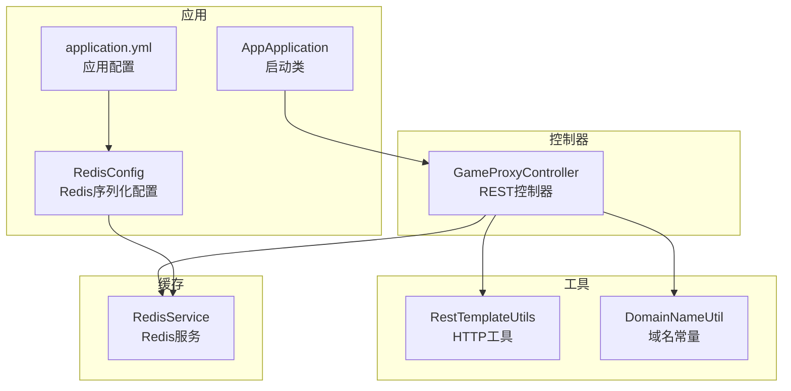
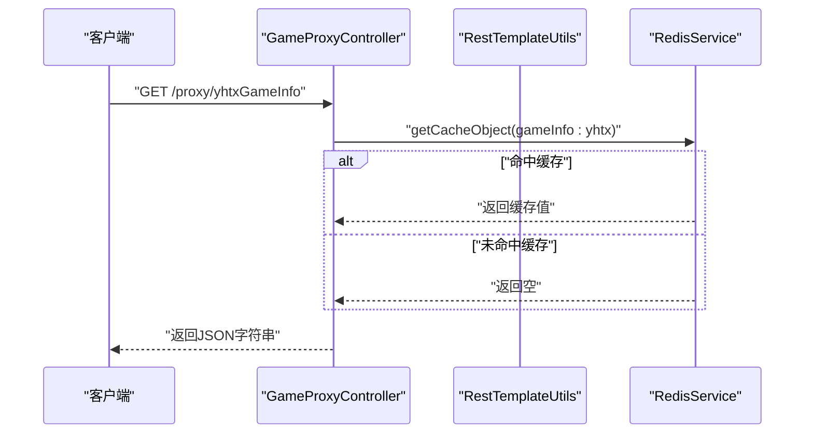
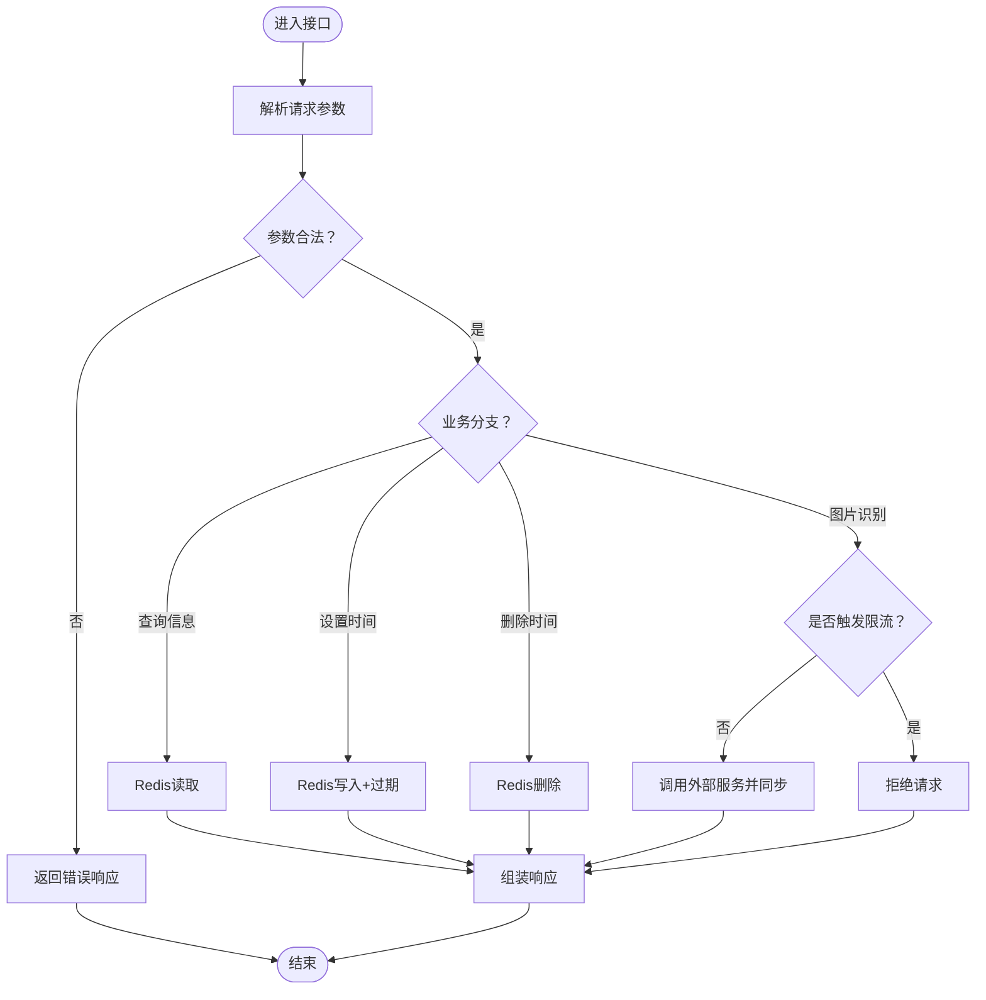
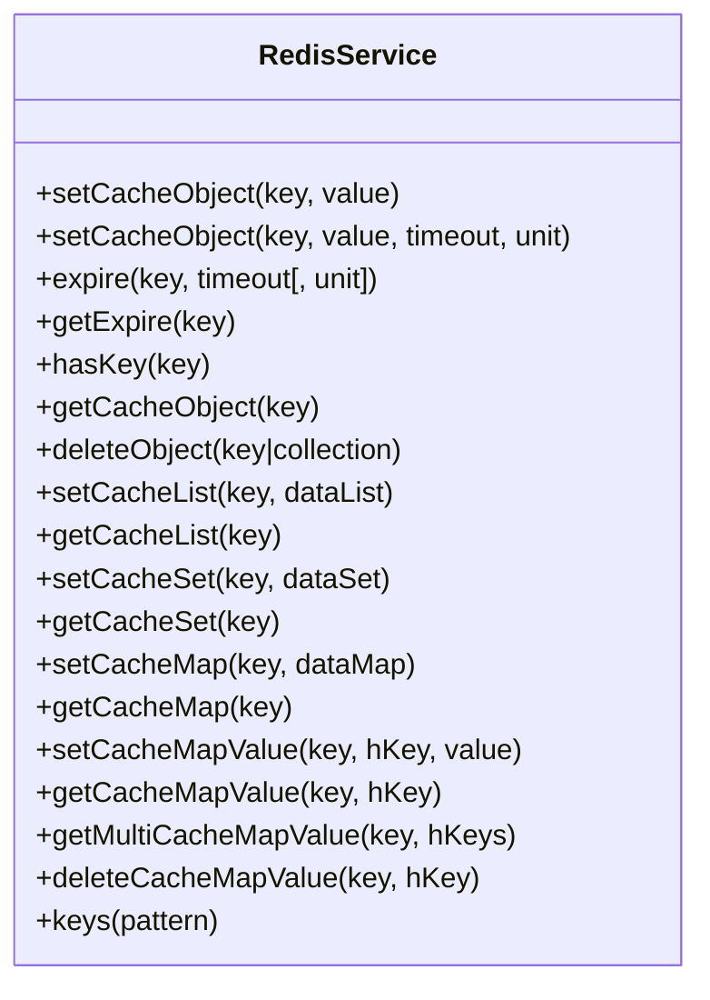
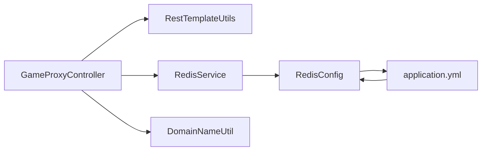

# 测试策略

<cite>
**本文引用的文件**
- [game-proxy/pom.xml](file://game-proxy/pom.xml)
- [game-proxy/src/main/java/com/game/AppApplication.java](file://game-proxy/src/main/java/com/game/AppApplication.java)
- [game-proxy/src/main/java/com/game/controller/GameProxyController.java](file://game-proxy/src/main/java/com/game/controller/GameProxyController.java)
- [game-proxy/src/main/java/com/game/redis/RedisService.java](file://game-proxy/src/main/java/com/game/redis/RedisService.java)
- [game-proxy/src/main/java/com/game/redis/RedisConfig.java](file://game-proxy/src/main/java/com/game/redis/RedisConfig.java)
- [game-proxy/src/main/java/com/game/commom/RestTemplateUtils.java](file://game-proxy/src/main/java/com/game/commom/RestTemplateUtils.java)
- [game-proxy/src/main/java/com/game/utils/DomainNameUtil.java](file://game-proxy/src/main/java/com/game/utils/DomainNameUtil.java)
- [game-proxy/src/main/resources/application.yml](file://game-proxy/src/main/resources/application.yml)
- [game-proxy/src/test/java/RedisTest.java](file://game-proxy/src/test/java/RedisTest.java)
- [game-cnydh/src/test/java/RedisTest.java](file://game-cnydh/src/test/java/RedisTest.java)
- [game-lf/src/test/java/RedisTest.java](file://game-lf/src/test/java/RedisTest.java)
</cite>

## 目录
1. [引言](#引言)
2. [项目结构](#项目结构)
3. [核心组件](#核心组件)
4. [架构总览](#架构总览)
5. [详细组件分析](#详细组件分析)
6. [依赖分析](#依赖分析)
7. [性能考量](#性能考量)
8. [故障排查指南](#故障排查指南)
9. [结论](#结论)
10. [附录](#附录)

## 引言
本测试策略面向“游戏代理系统”，目标是建立覆盖单元测试、集成测试、性能测试与持续集成的完整测试体系。重点围绕以下方面展开：
- 单元测试：针对控制器、工具类与Redis服务的职责边界进行隔离测试，确保业务逻辑正确性与边界条件处理。
- 集成测试：验证控制器与外部HTTP服务、Redis之间的协作流程，覆盖典型业务场景与异常路径。
- 性能测试：基于基准测试策略评估接口吞吐与延迟，结合线程模型与连接池配置制定压测方案。
- 测试用例编写：明确测试数据准备、Mock对象使用与断言策略，提升可维护性与稳定性。
- Redis测试：强调序列化配置、键空间管理与测试后清理，避免跨用例污染。
- 测试环境与工具：给出本地与CI环境搭建建议及常用工具使用方法。
- 质量门禁：设定覆盖率与质量门槛，保障交付质量。

## 项目结构
游戏代理系统采用Spring Boot工程组织，核心模块与测试分布如下：
- 控制器层：对外提供REST接口，负责参数校验、调用工具类与Redis服务。
- 工具类层：封装HTTP客户端与域名常量，降低重复代码与耦合。
- Redis层：提供统一的缓存读写与过期控制能力。
- 配置层：应用配置与Redis序列化配置。
- 测试层：当前存在Redis测试桩（注释掉），其余模块暂未见显式单元/集成测试。

图表来源
- [game-proxy/src/main/java/com/game/AppApplication.java](file://game-proxy/src/main/java/com/game/AppApplication.java#L1-L33)
- [game-proxy/src/main/java/com/game/controller/GameProxyController.java](file://game-proxy/src/main/java/com/game/controller/GameProxyController.java#L1-L436)
- [game-proxy/src/main/java/com/game/redis/RedisConfig.java](file://game-proxy/src/main/java/com/game/redis/RedisConfig.java#L1-L41)
- [game-proxy/src/main/java/com/game/commom/RestTemplateUtils.java](file://game-proxy/src/main/java/com/game/commom/RestTemplateUtils.java#L1-L51)
- [game-proxy/src/main/java/com/game/utils/DomainNameUtil.java](file://game-proxy/src/main/java/com/game/utils/DomainNameUtil.java#L1-L16)
- [game-proxy/src/main/resources/application.yml](file://game-proxy/src/main/resources/application.yml#L1-L58)

章节来源
- [game-proxy/src/main/java/com/game/AppApplication.java](file://game-proxy/src/main/java/com/game/AppApplication.java#L1-L33)
- [game-proxy/src/main/resources/application.yml](file://game-proxy/src/main/resources/application.yml#L1-L58)

## 核心组件
- 控制器：提供游戏信息查询、时间缓存设置与删除、图片识别与自开奖等接口，内部依赖Redis服务与HTTP工具。
- Redis服务：封装String/List/Set/Hash等数据类型的缓存操作，并提供过期时间设置与批量键查询。
- Redis配置：定义键值序列化策略，确保JSON序列化与反序列化一致性。
- HTTP工具：封装RestTemplate的GET/POST/EXCHANGE方法，便于控制器调用外部服务。
- 域名常量：集中管理需要同步开奖结果的目标域名数组。

章节来源
- [game-proxy/src/main/java/com/game/controller/GameProxyController.java](file://game-proxy/src/main/java/com/game/controller/GameProxyController.java#L1-L436)
- [game-proxy/src/main/java/com/game/redis/RedisService.java](file://game-proxy/src/main/java/com/game/redis/RedisService.java#L1-L244)
- [game-proxy/src/main/java/com/game/redis/RedisConfig.java](file://game-proxy/src/main/java/com/game/redis/RedisConfig.java#L1-L41)
- [game-proxy/src/main/java/com/game/commom/RestTemplateUtils.java](file://game-proxy/src/main/java/com/game/commom/RestTemplateUtils.java#L1-L51)
- [game-proxy/src/main/java/com/game/utils/DomainNameUtil.java](file://game-proxy/src/main/java/com/game/utils/DomainNameUtil.java#L1-L16)

## 架构总览
控制器通过HTTP工具访问外部服务，同时读写Redis缓存。应用配置文件提供Redis连接参数与HTTP连接池参数，Redis配置类定义序列化策略。

图表来源
- [game-proxy/src/main/java/com/game/controller/GameProxyController.java](file://game-proxy/src/main/java/com/game/controller/GameProxyController.java#L90-L94)
- [game-proxy/src/main/java/com/game/redis/RedisService.java](file://game-proxy/src/main/java/com/game/redis/RedisService.java#L95-L98)

## 详细组件分析

### 控制器测试策略
- 测试目标：验证各接口的请求参数处理、HTTP调用、Redis读写与异常分支。
- 设计原则：
  - 使用Mock框架对HTTP工具与Redis服务进行隔离，确保测试不依赖真实外部系统。
  - 针对限流逻辑（如图片识别接口）编写边界测试，覆盖短时间多次请求的拒绝行为。
  - 对时间转换与缓存过期逻辑进行参数化测试，覆盖多种输入格式与时区影响。
- 典型场景：
  - 查询游戏信息：验证Redis命中/未命中分支。
  - 设置/删除游戏时间：验证缓存键命名规则与过期时间设置。
  - 图片识别：验证限流阈值、错误日志与外部服务同步。
  - 自开奖：验证随机算法的确定性与返回结构。

图表来源
- [game-proxy/src/main/java/com/game/controller/GameProxyController.java](file://game-proxy/src/main/java/com/game/controller/GameProxyController.java#L306-L322)
- [game-proxy/src/main/java/com/game/controller/GameProxyController.java](file://game-proxy/src/main/java/com/game/controller/GameProxyController.java#L360-L412)

章节来源
- [game-proxy/src/main/java/com/game/controller/GameProxyController.java](file://game-proxy/src/main/java/com/game/controller/GameProxyController.java#L1-L436)

### Redis服务测试策略
- 测试目标：验证RedisService的各类缓存操作、过期设置与键查询功能。
- 设计原则：
  - 使用真实的Redis实例或内存Redis（如测试容器）执行集成测试，确保序列化策略生效。
  - 针对不同数据类型（String/List/Set/Hash）分别编写用例，覆盖增删改查与过期时间。
  - 在测试前后清理键空间，避免跨用例污染。
- 典型场景：
  - 字符串缓存：设置/读取/过期/删除。
  - Hash缓存：单字段写入、批量写入、多字段读取、删除特定字段。
  - 批量键查询：按模式匹配返回键集合。
  - 过期时间：设置相对/绝对时间单位，验证过期行为。

图表来源
- [game-proxy/src/main/java/com/game/redis/RedisService.java](file://game-proxy/src/main/java/com/game/redis/RedisService.java#L1-L244)

章节来源
- [game-proxy/src/main/java/com/game/redis/RedisService.java](file://game-proxy/src/main/java/com/game/redis/RedisService.java#L1-L244)
- [game-proxy/src/main/java/com/game/redis/RedisConfig.java](file://game-proxy/src/main/java/com/game/redis/RedisConfig.java#L1-L41)

### HTTP工具测试策略
- 测试目标：验证HTTP工具的GET/POST/EXCHANGE封装，确保异常处理与响应封装正确。
- 设计原则：
  - 使用Mock或Fake服务器模拟外部服务，覆盖正常响应与异常情况。
  - 验证请求头传递、超时与重试策略（如适用）。
- 典型场景：
  - GET请求：验证URL与响应类型映射。
  - POST请求：验证请求体与响应封装。
  - EXCHANGE请求：验证方法、头信息与响应封装。

章节来源
- [game-proxy/src/main/java/com/game/commom/RestTemplateUtils.java](file://game-proxy/src/main/java/com/game/commom/RestTemplateUtils.java#L1-L51)

### 集成测试场景设计
- 场景一：查询游戏信息
  - 步骤：向控制器发送GET请求，Redis中存在/不存在对应键。
  - 断言：返回值结构与内容正确。
- 场景二：设置游戏时间
  - 步骤：向控制器发送GET请求，携带时间参数；随后查询缓存。
  - 断言：缓存键存在且值符合预期，过期时间设置正确。
- 场景三：图片识别与同步
  - 步骤：短时间内多次调用识别接口；触发限流后再次调用。
  - 断言：限流返回值、日志输出与外部服务同步请求均符合预期。
- 场景四：自开奖
  - 步骤：调用自开奖接口，传入投注与倍率数组。
  - 断言：返回JSON包含ID与状态码字段。

章节来源
- [game-proxy/src/main/java/com/game/controller/GameProxyController.java](file://game-proxy/src/main/java/com/game/controller/GameProxyController.java#L360-L412)
- [game-proxy/src/main/java/com/game/controller/GameProxyController.java](file://game-proxy/src/main/java/com/game/controller/GameProxyController.java#L417-L428)

## 依赖分析
- 组件耦合：
  - 控制器依赖HTTP工具与Redis服务，属于高内聚低耦合设计。
  - Redis服务依赖RedisTemplate，序列化策略由Redis配置统一管理。
- 外部依赖：
  - Redis连接参数与连接池配置来自应用配置文件。
  - HTTP连接池参数同样来自应用配置文件。
- 潜在风险：
  - Redis序列化策略需保证跨服务一致，避免键值乱码。
  - 控制器对域名常量的硬编码可能带来扩展性问题，建议抽象为配置项。

图表来源
- [game-proxy/src/main/java/com/game/controller/GameProxyController.java](file://game-proxy/src/main/java/com/game/controller/GameProxyController.java#L1-L436)
- [game-proxy/src/main/java/com/game/redis/RedisConfig.java](file://game-proxy/src/main/java/com/game/redis/RedisConfig.java#L1-L41)
- [game-proxy/src/main/resources/application.yml](file://game-proxy/src/main/resources/application.yml#L1-L58)
- [game-proxy/src/main/java/com/game/utils/DomainNameUtil.java](file://game-proxy/src/main/java/com/game/utils/DomainNameUtil.java#L1-L16)

章节来源
- [game-proxy/src/main/resources/application.yml](file://game-proxy/src/main/resources/application.yml#L1-L58)
- [game-proxy/src/main/java/com/game/redis/RedisConfig.java](file://game-proxy/src/main/java/com/game/redis/RedisConfig.java#L1-L41)

## 性能考量
- 基准测试策略：
  - 接口层面：对高频接口（如查询游戏信息、图片识别）进行并发压力测试，记录吞吐与P95/P99延迟。
  - 缓存层面：验证Redis读写延迟与过期策略对性能的影响。
  - 外部依赖：评估HTTP客户端连接池与超时参数对整体性能的作用。
- 线程模型与连接池：
  - 应用配置文件中已提供Redis与HTTP连接池参数，建议在压测中逐步调整这些参数以观察性能拐点。
- 性能优化建议：
  - 合理设置Redis过期时间，避免大量键同时过期导致抖动。
  - 对热点接口增加本地缓存或限流保护，防止突发流量冲击。

章节来源
- [game-proxy/src/main/resources/application.yml](file://game-proxy/src/main/resources/application.yml#L15-L57)

## 故障排查指南
- Redis相关问题：
  - 序列化异常：确认Redis配置中的键值序列化策略与业务对象一致。
  - 键空间污染：在测试结束后执行键清理，避免影响后续用例。
- HTTP调用异常：
  - 检查超时与重试策略，定位网络波动或外部服务不可用。
- 控制器异常：
  - 关注限流逻辑与参数校验，确保错误日志清晰可追踪。

章节来源
- [game-proxy/src/main/java/com/game/redis/RedisConfig.java](file://game-proxy/src/main/java/com/game/redis/RedisConfig.java#L1-L41)
- [game-proxy/src/test/java/RedisTest.java](file://game-proxy/src/test/java/RedisTest.java#L1-L95)

## 结论
通过构建以控制器为核心、Redis与HTTP工具为支撑的测试体系，可以有效保障游戏代理系统的稳定性与性能。建议优先补齐单元测试与集成测试覆盖，完善Redis测试的清理机制，并在CI中引入性能回归与覆盖率检查，形成持续改进的质量闭环。

## 附录

### 测试用例编写指南
- 测试数据准备：
  - 使用参数化测试覆盖边界值与异常输入，如时间格式、非法键名等。
  - 准备固定JSON样例作为期望响应，便于断言。
- Mock对象使用：
  - 使用Mock框架对HTTP工具与Redis服务进行隔离，确保测试独立可控。
- 断言策略：
  - 对响应体结构与字段进行精确断言，对异常路径断言错误码与日志级别。

### Redis测试的特殊考虑与数据清理
- 序列化配置：确保RedisTemplate的键值序列化策略与业务对象一致，避免反序列化失败。
- 键空间管理：在测试前后清理相关键，避免跨用例污染。
- 测试容器：建议使用内存Redis或Docker容器运行Redis，便于快速初始化与销毁。

章节来源
- [game-proxy/src/main/java/com/game/redis/RedisConfig.java](file://game-proxy/src/main/java/com/game/redis/RedisConfig.java#L1-L41)
- [game-proxy/src/test/java/RedisTest.java](file://game-proxy/src/test/java/RedisTest.java#L1-L95)
- [game-cnydh/src/test/java/RedisTest.java](file://game-cnydh/src/test/java/RedisTest.java#L1-L95)
- [game-lf/src/test/java/RedisTest.java](file://game-lf/src/test/java/RedisTest.java#L1-L95)

### 测试环境搭建与工具使用
- 本地环境：
  - 启动Redis实例，确保连接参数与应用配置一致。
  - 运行Spring Boot应用，访问控制器接口进行手动验证。
- CI环境：
  - 使用Docker Compose拉起Redis与应用服务，执行Maven测试命令。
  - 集成覆盖率工具（如JaCoCo）与静态分析工具，形成质量门禁。

章节来源
- [game-proxy/src/main/resources/application.yml](file://game-proxy/src/main/resources/application.yml#L15-L57)
- [game-proxy/pom.xml](file://game-proxy/pom.xml#L33-L35)

### 持续集成与自动化测试配置建议
- Maven插件：
  - 使用Spring Boot Maven插件打包与运行。
  - 使用编译插件与资源过滤插件保证构建一致性。
- 测试执行：
  - 在CI中执行单元测试与集成测试，失败即阻断发布。
  - 引入覆盖率报告，设定最低覆盖率阈值（如80%）。

章节来源
- [game-proxy/pom.xml](file://game-proxy/pom.xml#L112-L142)

### 测试覆盖率要求与质量门禁标准
- 覆盖率指标：
  - 行覆盖率与分支覆盖率均不低于80%，关键路径不低于90%。
- 质量门禁：
  - 未达覆盖率阈值或存在阻断性缺陷时禁止合并与发布。
  - 对Redis与HTTP工具的关键路径必须有测试覆盖。