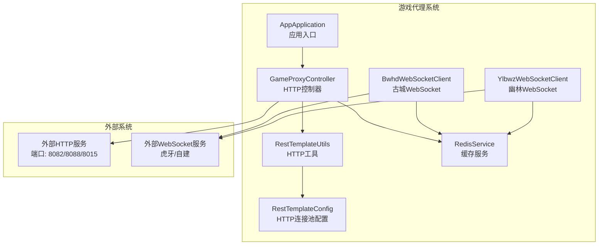
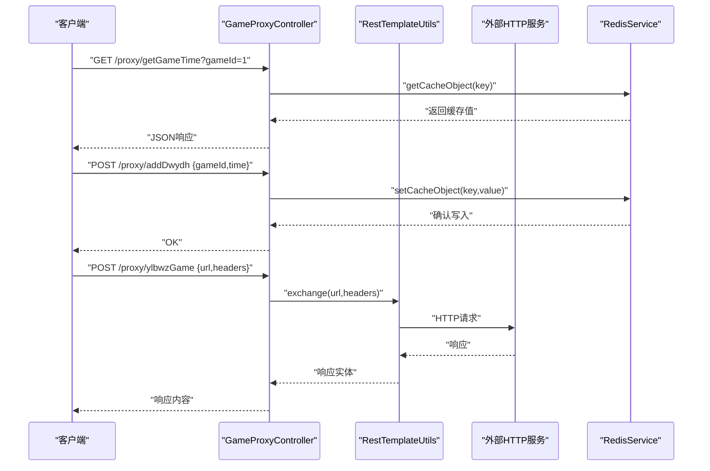
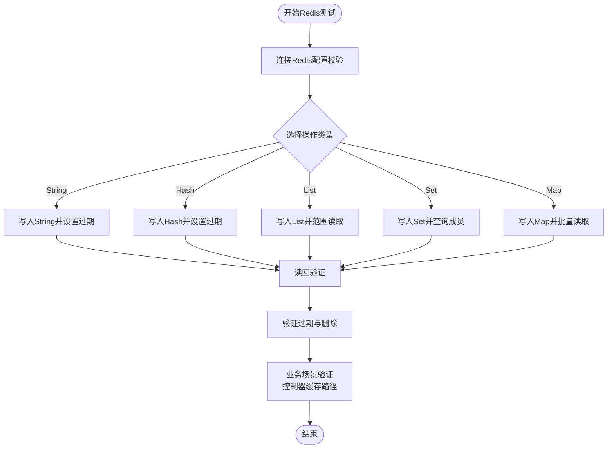
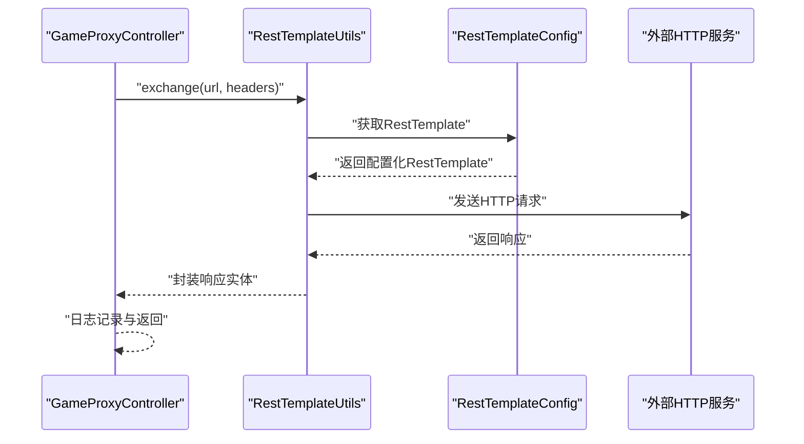
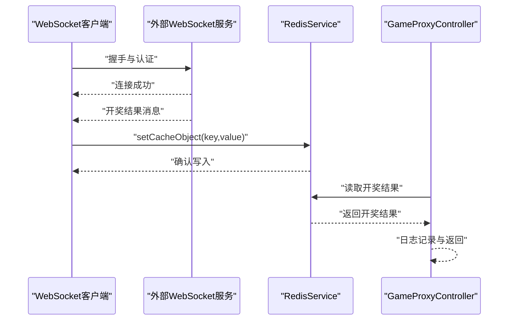
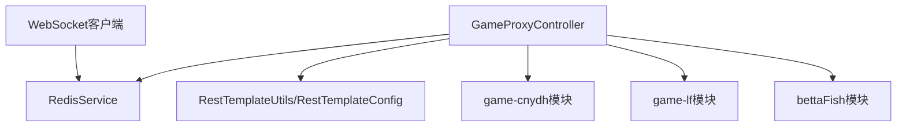
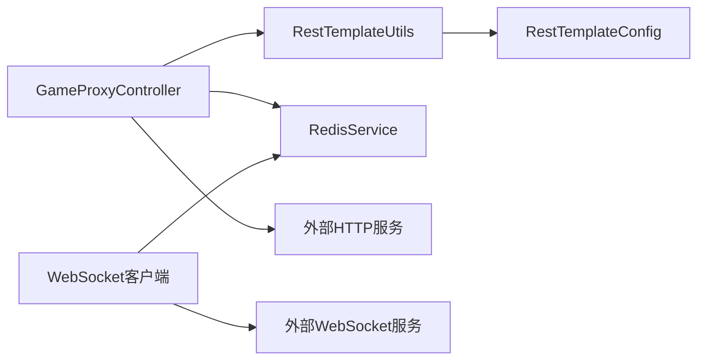

# 集成测试方案

<cite>
**本文档引用的文件**
- [AppApplication.java](file://game-proxy/src/main/java/com/game/AppApplication.java)
- [GameProxyController.java](file://game-proxy/src/main/java/com/game/controller/GameProxyController.java)
- [RedisService.java](file://game-proxy/src/main/java/com/game/redis/RedisService.java)
- [RedisTest.java](file://game-proxy/src/test/java/RedisTest.java)
- [RestTemplateConfig.java](file://game-proxy/src/main/java/com/game/commom/RestTemplateConfig.java)
- [RestTemplateUtils.java](file://game-proxy/src/main/java/com/game/commom/RestTemplateUtils.java)
- [application.yml](file://game-proxy/src/main/resources/application.yml)
- [pom.xml](file://game-proxy/pom.xml)
- [BwhdWebSocketClient.java](file://game-proxy/src/main/java/com/game/gcbwz/BwhdWebSocketClient.java)
- [YlbwzWebSocketClient.java](file://game-proxy/src/main/java/com/game/ylbwz/YlbwzWebSocketClient.java)
- [TestYlbwzWebsocketClient.java](file://game-proxy/src/main/java/com/game/ylbwz/TestYlbwzWebsocketClient.java)
- [TestBwhdWebsocketClient.java](file://game-proxy/src/main/java/com/game/gcbwz/TestBwhdWebsocketClient.java)
- [GameYqlyyWsClient.java](file://TigerTeeth/src/main/java/com/yqlyy/GameYqlyyWsClient.java)
- [TigerTeeth application.yml](file://TigerTeeth/src/main/resources/application.yml)
- [game-cnydh application.yml](file://game-cnydh/src/main/resources/application.yml)
- [game-lf application.yml](file://game-lf/src/main/resources/application.yml)
- [bettaFish application.properties](file://bettaFish/src/main/resources/application.properties)
</cite>

## 目录
1. [引言](#引言)
2. [项目结构](#项目结构)
3. [核心组件](#核心组件)
4. [架构总览](#架构总览)
5. [详细组件分析](#详细组件分析)
6. [依赖关系分析](#依赖关系分析)
7. [性能考量](#性能考量)
8. [故障排除指南](#故障排除指南)
9. [结论](#结论)
10. [附录](#附录)

## 引言
本方案面向游戏代理系统，提供一套完整的系统级集成测试设计与实施路径。重点覆盖以下方面：
- Redis集成测试：验证缓存读写、过期策略、数据一致性与并发行为
- 多模块协作测试：控制器、HTTP客户端、WebSocket客户端与缓存服务的协同验证
- 外部依赖集成测试：WebSocket连接稳定性、HTTP客户端超时与重试机制
- 数据库与缓存集成测试：通过真实配置连接Redis，验证数据持久化与一致性
- 端到端测试流程：从控制器入口到外部服务的完整链路验证
- 测试环境搭建：本地与CI环境的Redis、HTTP服务端口与配置准备
- 测试数据模拟与隔离：使用独立命名空间与随机后缀，避免交叉污染
- 自动化执行与持续集成：基于Maven与Spring Boot的测试执行与流水线建议

## 项目结构
游戏代理系统由一个主应用与多个业务模块组成，采用Spring Boot微服务风格组织。核心模块包括：
- 主应用与控制器层：对外提供HTTP代理接口，集中处理游戏时间与开奖结果的缓存
- 通用HTTP客户端：基于Apache HttpClient的连接池配置与RestTemplate封装
- Redis服务：统一的缓存访问抽象，支持多种数据结构与过期控制
- WebSocket客户端：与外部游戏服务进行实时通信，接收开奖结果并写入缓存
- 其他业务模块：提供独立的HTTP服务端口，供代理系统进行跨模块调用或作为外部目标

图表来源
- [AppApplication.java](file://game-proxy/src/main/java/com/game/AppApplication.java#L15-L31)
- [GameProxyController.java](file://game-proxy/src/main/java/com/game/controller/GameProxyController.java#L36-L39)
- [RestTemplateUtils.java](file://game-proxy/src/main/java/com/game/commom/RestTemplateUtils.java#L13-L49)
- [RestTemplateConfig.java](file://game-proxy/src/main/java/com/game/commom/RestTemplateConfig.java#L33-L129)
- [RedisService.java](file://game-proxy/src/main/java/com/game/redis/RedisService.java#L18-L243)
- [BwhdWebSocketClient.java](file://game-proxy/src/main/java/com/game/gcbwz/BwhdWebSocketClient.java#L23-L87)
- [YlbwzWebSocketClient.java](file://game-proxy/src/main/java/com/game/ylbwz/YlbwzWebSocketClient.java)

章节来源
- [AppApplication.java](file://game-proxy/src/main/java/com/game/AppApplication.java#L15-L31)
- [application.yml](file://game-proxy/src/main/resources/application.yml#L1-L58)

## 核心组件
- 应用入口与调度：启用定时任务，负责应用启动与日志输出
- 控制器层：提供HTTP代理接口，集中处理游戏时间与开奖结果的缓存读写
- HTTP客户端：统一的连接池配置与RestTemplate封装，支持超时、重试与Keep-Alive
- Redis服务：提供多种数据结构的缓存操作与过期控制，支撑业务状态与临时数据
- WebSocket客户端：与外部游戏服务建立长连接，接收开奖结果并写入缓存
- 外部服务端口：各业务模块独立端口，便于跨模块调用与外部集成

章节来源
- [AppApplication.java](file://game-proxy/src/main/java/com/game/AppApplication.java#L15-L31)
- [GameProxyController.java](file://game-proxy/src/main/java/com/game/controller/GameProxyController.java#L36-L435)
- [RestTemplateConfig.java](file://game-proxy/src/main/java/com/game/commom/RestTemplateConfig.java#L33-L129)
- [RestTemplateUtils.java](file://game-proxy/src/main/java/com/game/commom/RestTemplateUtils.java#L13-L50)
- [RedisService.java](file://game-proxy/src/main/java/com/game/redis/RedisService.java#L18-L243)

## 架构总览
系统通过控制器统一接入，HTTP客户端负责与外部服务交互，Redis作为共享缓存承载游戏时间与开奖结果等状态数据。WebSocket客户端负责实时接收开奖结果并写入缓存，形成“请求-缓存-通知”的闭环。

图表来源
- [GameProxyController.java](file://game-proxy/src/main/java/com/game/controller/GameProxyController.java#L66-L81)
- [RestTemplateUtils.java](file://game-proxy/src/main/java/com/game/commom/RestTemplateUtils.java#L26-L44)
- [RedisService.java](file://game-proxy/src/main/java/com/game/redis/RedisService.java#L95-L98)

## 详细组件分析

### Redis集成测试设计
目标：验证Redis连接、序列化、过期策略、并发读写与数据一致性。
- 连接与配置：通过application.yml中的Redis配置连接本地实例，验证密码、端口与数据库选择
- 数据结构测试：覆盖String、Hash、List、Set、ZSet等常用结构的读写与过期
- 并发与一致性：模拟多线程写入，验证缓存键的原子性更新与过期时间的正确性
- 业务场景验证：控制器中对游戏时间与开奖结果的缓存读写路径

图表来源
- [RedisService.java](file://game-proxy/src/main/java/com/game/redis/RedisService.java#L30-L242)
- [application.yml](file://game-proxy/src/main/resources/application.yml#L15-L31)
- [RedisTest.java](file://game-proxy/src/test/java/RedisTest.java#L37-L92)

章节来源
- [RedisService.java](file://game-proxy/src/main/java/com/game/redis/RedisService.java#L18-L243)
- [application.yml](file://game-proxy/src/main/resources/application.yml#L15-L31)
- [RedisTest.java](file://game-proxy/src/test/java/RedisTest.java#L12-L94)

### HTTP客户端集成测试设计
目标：验证HTTP连接池、超时、重试与Keep-Alive策略，确保与外部服务稳定交互。
- 连接池配置：校验最大连接数、路由并发、连接超时、套接字超时、空闲检测等参数
- 请求行为：GET/POST/Exchange三种调用路径，验证头部传递与响应解析
- 异常处理：网络异常、超时、重试策略的有效性
- 业务场景：控制器中对多个外部服务的调用路径

图表来源
- [RestTemplateUtils.java](file://game-proxy/src/main/java/com/game/commom/RestTemplateUtils.java#L26-L44)
- [RestTemplateConfig.java](file://game-proxy/src/main/java/com/game/commom/RestTemplateConfig.java#L62-L107)
- [GameProxyController.java](file://game-proxy/src/main/java/com/game/controller/GameProxyController.java#L66-L81)

章节来源
- [RestTemplateConfig.java](file://game-proxy/src/main/java/com/game/commom/RestTemplateConfig.java#L33-L129)
- [RestTemplateUtils.java](file://game-proxy/src/main/java/com/game/commom/RestTemplateUtils.java#L13-L50)
- [GameProxyController.java](file://game-proxy/src/main/java/com/game/controller/GameProxyController.java#L51-L81)

### WebSocket客户端集成测试设计
目标：验证WebSocket连接、心跳、消息接收与异常恢复，确保开奖结果能及时写入缓存。
- 连接与心跳：验证握手成功、心跳维持与断线重连
- 消息处理：解析开奖结果消息，写入Redis并转发至业务模块
- 业务联动：与控制器的缓存读写路径联动，验证端到端一致性

图表来源
- [BwhdWebSocketClient.java](file://game-proxy/src/main/java/com/game/gcbwz/BwhdWebSocketClient.java#L64-L87)
- [YlbwzWebSocketClient.java](file://game-proxy/src/main/java/com/game/ylbwz/YlbwzWebSocketClient.java)
- [RedisService.java](file://game-proxy/src/main/java/com/game/redis/RedisService.java#L95-L98)

章节来源
- [BwhdWebSocketClient.java](file://game-proxy/src/main/java/com/game/gcbwz/BwhdWebSocketClient.java#L23-L87)
- [YlbwzWebSocketClient.java](file://game-proxy/src/main/java/com/game/ylbwz/YlbwzWebSocketClient.java)
- [TestYlbwzWebsocketClient.java](file://game-proxy/src/main/java/com/game/ylbwz/TestYlbwzWebsocketClient.java#L4-L16)
- [TestBwhdWebsocketClient.java](file://game-proxy/src/main/java/com/game/gcbwz/TestBwhdWebsocketClient.java#L4-L14)
- [GameYqlyyWsClient.java](file://TigerTeeth/src/main/java/com/yqlyy/GameYqlyyWsClient.java#L29-L59)

### 多模块协作测试场景
目标：验证控制器与HTTP/Redis/WebSocket的协同工作，以及跨模块调用的一致性。
- 场景一：控制器写入Redis，其他模块读取并转发
- 场景二：WebSocket接收开奖结果，控制器读取并同步到业务模块
- 场景三：HTTP客户端调用外部服务，控制器转发响应

图表来源
- [GameProxyController.java](file://game-proxy/src/main/java/com/game/controller/GameProxyController.java#L36-L435)
- [RedisService.java](file://game-proxy/src/main/java/com/game/redis/RedisService.java#L18-L243)
- [RestTemplateConfig.java](file://game-proxy/src/main/java/com/game/commom/RestTemplateConfig.java#L33-L129)
- [BwhdWebSocketClient.java](file://game-proxy/src/main/java/com/game/gcbwz/BwhdWebSocketClient.java#L23-L87)

章节来源
- [GameProxyController.java](file://game-proxy/src/main/java/com/game/controller/GameProxyController.java#L36-L435)
- [application.yml](file://game-cnydh/src/main/resources/application.yml#L1-L1)
- [application.yml](file://game-lf/src/main/resources/application.yml#L1-L1)
- [bettaFish application.properties](file://bettaFish/src/main/resources/application.properties#L1-L1)

## 依赖关系分析
- 组件耦合：控制器依赖HTTP工具与Redis服务；HTTP工具依赖连接池配置；WebSocket客户端依赖Redis服务与工具类
- 外部依赖：Redis、外部HTTP服务、外部WebSocket服务
- 配置依赖：application.yml中的Redis与HTTP参数影响测试行为

图表来源
- [GameProxyController.java](file://game-proxy/src/main/java/com/game/controller/GameProxyController.java#L36-L435)
- [RestTemplateUtils.java](file://game-proxy/src/main/java/com/game/commom/RestTemplateUtils.java#L13-L50)
- [RestTemplateConfig.java](file://game-proxy/src/main/java/com/game/commom/RestTemplateConfig.java#L33-L129)
- [RedisService.java](file://game-proxy/src/main/java/com/game/redis/RedisService.java#L18-L243)
- [BwhdWebSocketClient.java](file://game-proxy/src/main/java/com/game/gcbwz/BwhdWebSocketClient.java#L23-L87)

章节来源
- [pom.xml](file://game-proxy/pom.xml#L26-L100)
- [application.yml](file://game-proxy/src/main/resources/application.yml#L15-L57)

## 性能考量
- 连接池参数：合理设置最大连接数、路由并发与空闲检测，避免资源耗尽
- 超时策略：区分连接超时、请求超时与套接字超时，结合业务特性调整
- 缓存过期：为临时数据设置合适的过期时间，避免内存泄漏
- 并发控制：在高并发场景下，注意Redis与HTTP客户端的并发限制

## 故障排除指南
- Redis连接失败：检查host/port/password/database与防火墙设置
- HTTP超时或异常：检查超时参数、重试策略与外部服务可用性
- WebSocket断线：验证心跳机制与自动重连逻辑
- 缓存不一致：核对键名规范、过期时间与并发写入策略

章节来源
- [application.yml](file://game-proxy/src/main/resources/application.yml#L15-L57)
- [RestTemplateConfig.java](file://game-proxy/src/main/java/com/game/commom/RestTemplateConfig.java#L84-L129)
- [BwhdWebSocketClient.java](file://game-proxy/src/main/java/com/game/gcbwz/BwhdWebSocketClient.java#L64-L87)

## 结论
通过本集成测试方案，可以系统性地验证游戏代理系统在Redis、HTTP与WebSocket三个维度上的功能与可靠性，并确保多模块协作与外部依赖的稳定性。建议在开发与CI环境中持续运行这些测试，以保障系统质量与交付效率。

## 附录

### 端到端测试流程
- 启动Redis与各业务模块HTTP服务
- 启动游戏代理应用
- 发起HTTP请求写入缓存或触发WebSocket消息
- 校验Redis中的数据与控制器的响应
- 验证外部服务的回调与日志记录

### 测试环境搭建指南
- Redis：使用application.yml中的配置连接本地实例，确保密码与端口正确
- HTTP服务：启动game-cnydh、game-lf、bettaFish等模块，确保端口未被占用
- WebSocket：使用提供的测试客户端或外部服务进行连接验证

### 测试数据模拟与隔离策略
- 使用独立的Redis数据库与命名空间，避免与其他环境冲突
- 在测试中使用随机后缀或时间戳作为键名的一部分
- 对于HTTP与WebSocket，使用本地或沙箱环境的目标地址

### 自动化执行与持续集成配置建议
- Maven测试：使用Maven命令执行测试，确保依赖与插件配置正确
- CI流水线：在CI中预热Redis与外部服务，执行集成测试套件
- 报告与监控：生成测试报告并监控失败率与性能指标

章节来源
- [pom.xml](file://game-proxy/pom.xml#L102-L160)
- [application.yml](file://game-proxy/src/main/resources/application.yml#L1-L58)
- [TigerTeeth application.yml](file://TigerTeeth/src/main/resources/application.yml#L1-L31)
- [game-cnydh application.yml](file://game-cnydh/src/main/resources/application.yml#L1-L1)
- [game-lf application.yml](file://game-lf/src/main/resources/application.yml#L1-L1)
- [bettaFish application.properties](file://bettaFish/src/main/resources/application.properties#L1-L1)