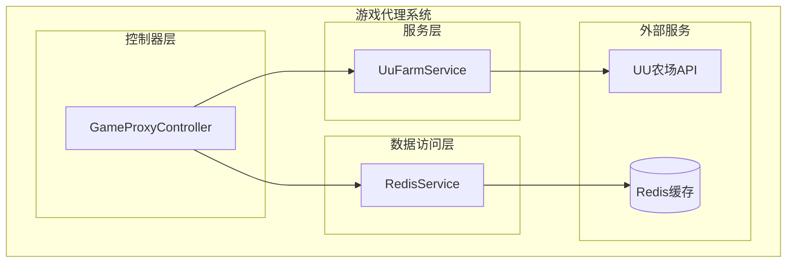
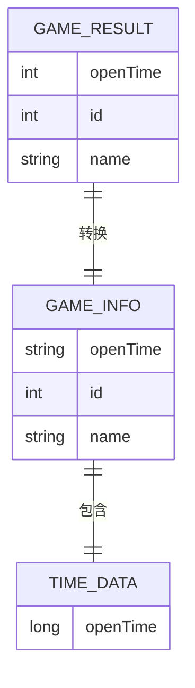
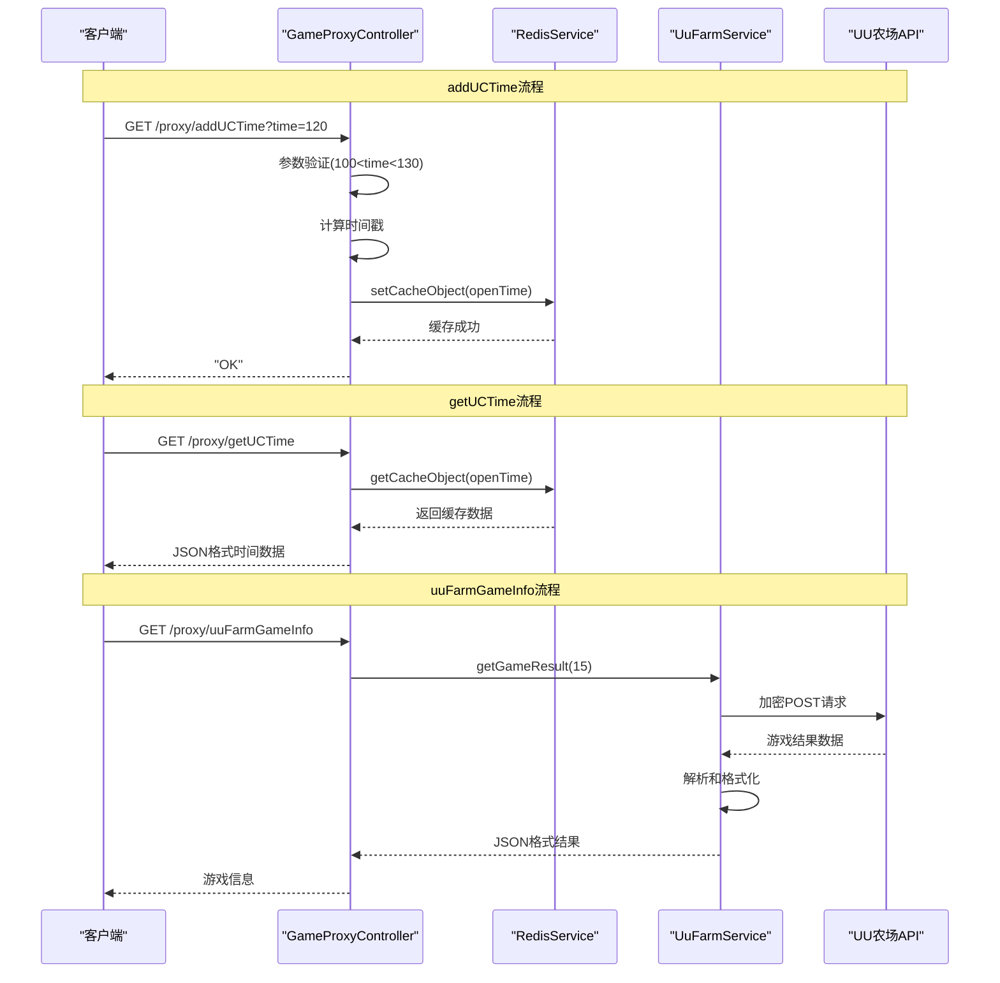
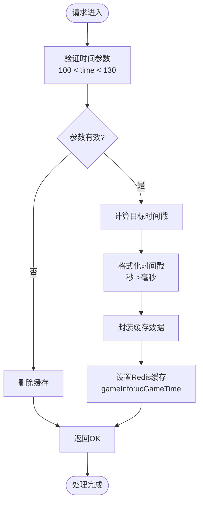
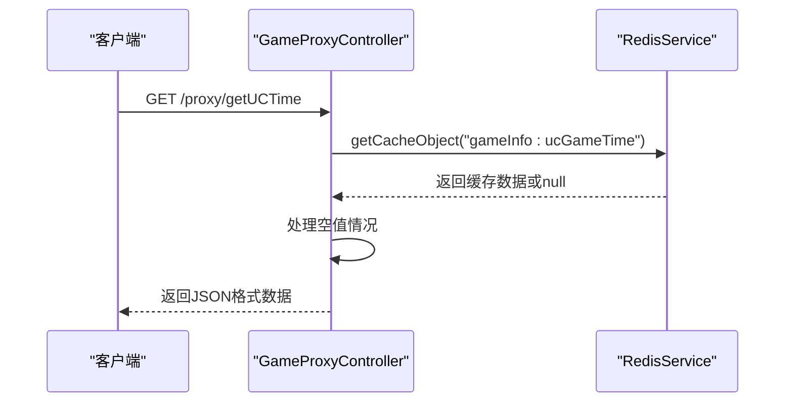
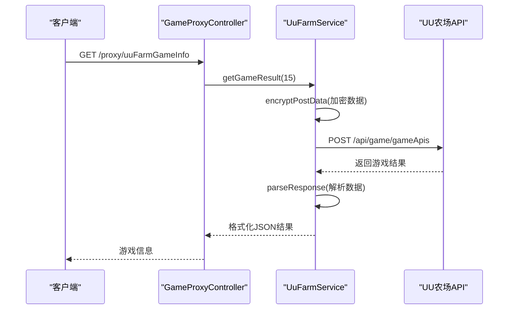
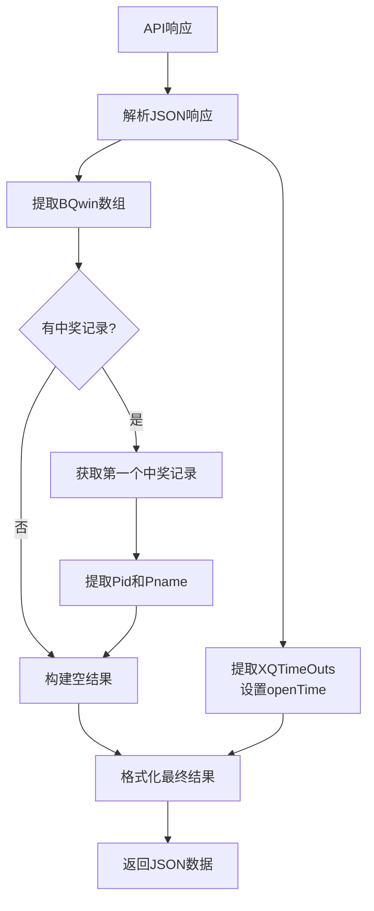
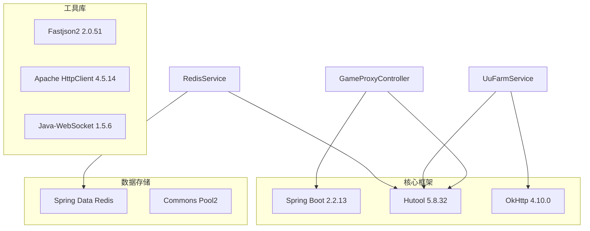
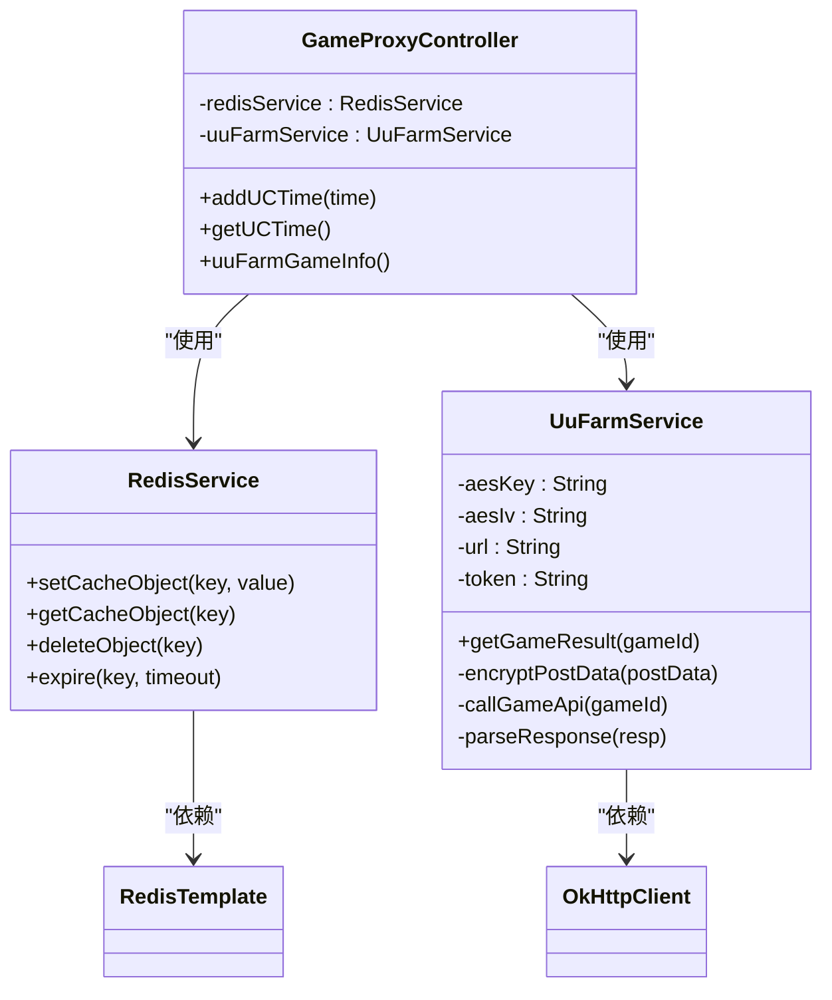

# UU农场接口

<cite>
**本文档引用的文件**
- [GameProxyController.java](file://game-proxy/src/main/java/com/game/controller/GameProxyController.java)
- [UuFarmService.java](file://game-proxy/src/main/java/com/game\uc/UuFarmService.java)
- [RedisService.java](file://game-proxy/src/main/java/com/game/redis/RedisService.java)
- [application.yml](file://game-proxy/src/main/resources/application.yml)
- [pom.xml](file://game-proxy/pom.xml)
</cite>

## 目录
1. [简介](#简介)
2. [项目结构](#项目结构)
3. [核心组件](#核心组件)
4. [架构概览](#架构概览)
5. [详细组件分析](#详细组件分析)
6. [依赖关系分析](#依赖关系分析)
7. [性能考虑](#性能考虑)
8. [故障排除指南](#故障排除指南)
9. [结论](#结论)

## 简介

UU农场接口是游戏代理系统中的重要组成部分，主要负责与UU农场游戏进行数据交互。该接口集成了三个核心功能：
- `/addUCTime` - UU农场时间上报功能
- `/getUCTime` - UU农场游戏时间查询功能  
- `/uuFarmGameInfo` - UU农场游戏结果查询功能

这些接口通过Redis缓存机制实现实时数据同步，为游戏数据同步提供了可靠的技术支持。

## 项目结构

游戏代理系统采用Spring Boot框架构建，UU农场接口位于game-proxy模块中：

**图表来源**
- [GameProxyController.java](file://game-proxy/src/main/java/com/game/controller/GameProxyController.java#L37-L39)
- [UuFarmService.java](file://game-proxy/src/main/java/com/game\uc/UuFarmService.java#L20-L22)
- [RedisService.java](file://game-proxy/src/main/java/com/game/redis/RedisService.java#L18-L22)

**章节来源**
- [GameProxyController.java](file://game-proxy/src/main/java/com/game/controller/GameProxyController.java#L1-L436)
- [application.yml](file://game-proxy/src/main/resources/application.yml#L1-L58)

## 核心组件

### 接口路由映射

系统为UU农场接口提供了清晰的RESTful路由设计：

| 接口名称 | HTTP方法 | 路由路径 | 功能描述 |
|---------|---------|---------|---------|
| addUCTime | GET | `/proxy/addUCTime` | 上报UU农场游戏时间 |
| getUCTime | GET | `/proxy/getUCTime` | 查询UU农场游戏时间 |
| uuFarmGameInfo | GET | `/proxy/uuFarmGameInfo` | 获取UU农场游戏结果 |

### 数据模型

UU农场接口使用统一的JSON数据格式：

**图表来源**
- [GameProxyController.java](file://game-proxy/src/main/java/com/game/controller/GameProxyController.java#L184-L208)
- [UuFarmService.java](file://game-proxy/src/main/java/com/game\uc/UuFarmService.java#L100-L117)

**章节来源**
- [GameProxyController.java](file://game-proxy/src/main/java/com/game/controller/GameProxyController.java#L183-L225)

## 架构概览

UU农场接口采用分层架构设计，实现了业务逻辑与数据存储的分离：

**图表来源**
- [GameProxyController.java](file://game-proxy/src/main/java/com/game/controller/GameProxyController.java#L184-L225)
- [UuFarmService.java](file://game-proxy/src/main/java/com/game\uc/UuFarmService.java#L64-L98)

## 详细组件分析

### addUCTime接口实现

addUCTime接口负责处理UU农场的时间上报功能，具有严格的时间范围验证和智能缓存策略：

#### 核心处理流程

**图表来源**
- [GameProxyController.java](file://game-proxy/src/main/java/com/game/controller/GameProxyController.java#L184-L208)

#### 时间验证逻辑

接口实现了精确的时间范围控制：
- **有效范围**: 101-129秒（排除边界值）
- **异常处理**: 超出范围或小于等于20秒时清除缓存
- **时间计算**: 基于当前时间偏移指定秒数

#### 缓存机制

- **缓存键**: `gameInfo:ucGameTime`
- **数据格式**: 包含`openTime`字段的JSON对象
- **缓存策略**: 自动过期机制，确保数据时效性

**章节来源**
- [GameProxyController.java](file://game-proxy/src/main/java/com/game/controller/GameProxyController.java#L184-L208)
- [RedisService.java](file://game-proxy/src/main/java/com/game/redis/RedisService.java#L30-L44)

### getUCTime接口实现

getUCTime接口提供UU农场游戏时间的查询功能，基于Redis缓存实现高效的数据访问：

#### 查询流程

**图表来源**
- [GameProxyController.java](file://game-proxy/src/main/java/com/game/controller/GameProxyController.java#L212-L217)

#### 数据处理

- **缓存读取**: 直接从Redis获取缓存数据
- **空值处理**: 返回原始缓存内容，不进行额外处理
- **数据格式**: 保持与缓存一致的JSON格式

**章节来源**
- [GameProxyController.java](file://game-proxy/src/main/java/com/game/controller/GameProxyController.java#L212-L217)
- [RedisService.java](file://game-proxy/src/main/java/com/game/redis/RedisService.java#L95-L98)

### uuFarmGameInfo接口实现

uuFarmGameInfo接口负责获取UU农场的游戏结果，实现了完整的数据集成和格式化处理：

#### 数据获取流程

**图表来源**
- [GameProxyController.java](file://game-proxy/src/main/java/com/game/controller/GameProxyController.java#L222-L225)
- [UuFarmService.java](file://game-proxy/src/main/java/com/game\uc/UuFarmService.java#L121-L131)

#### 加密通信机制

接口使用AES-CBC加密确保数据传输安全：

- **加密算法**: AES/CBC/PKCS5Padding
- **密钥长度**: 128位
- **初始化向量**: 16字节
- **编码方式**: Base64

#### 数据解析逻辑

**图表来源**
- [UuFarmService.java](file://game-proxy/src/main/java/com/game\uc/UuFarmService.java#L100-L117)

**章节来源**
- [UuFarmService.java](file://game-proxy/src/main/java/com/game\uc/UuFarmService.java#L24-L44)
- [UuFarmService.java](file://game-proxy/src/main/java/com/game\uc/UuFarmService.java#L64-L98)
- [UuFarmService.java](file://game-proxy/src/main/java/com/game\uc/UuFarmService.java#L100-L131)

## 依赖关系分析

### 技术栈依赖

**图表来源**
- [pom.xml](file://game-proxy/pom.xml#L26-L99)

### 组件耦合关系

**图表来源**
- [GameProxyController.java](file://game-proxy/src/main/java/com/game/controller/GameProxyController.java#L41-L42)
- [UuFarmService.java](file://game-proxy/src/main/java/com/game\uc/UuFarmService.java#L22-L35)
- [RedisService.java](file://game-proxy/src/main/java/com/game/redis/RedisService.java#L21-L22)

**章节来源**
- [pom.xml](file://game-proxy/pom.xml#L1-L163)

## 性能考虑

### 缓存策略优化

1. **Redis连接池配置**
   - 最大连接数: 20
   - 最大空闲连接: 5
   - 最小空闲连接: 0

2. **数据缓存策略**
   - 自动过期机制确保数据新鲜度
   - JSON格式存储减少序列化开销
   - 批量操作支持高并发场景

### 网络通信优化

1. **HTTP客户端配置**
   - 连接超时: 18秒
   - Socket超时: 30秒
   - 连接池复用连接

2. **加密性能优化**
   - AES-CBC加密算法选择平衡安全性与性能
   - Base64编码避免二进制数据传输问题

## 故障排除指南

### 常见问题及解决方案

#### Redis连接问题
- **症状**: 缓存操作失败
- **原因**: Redis服务器不可达或认证失败
- **解决**: 检查Redis配置和网络连通性

#### 加密解密异常
- **症状**: UU农场API调用失败
- **原因**: 密钥配置错误或网络问题
- **解决**: 验证AES密钥和令牌配置

#### 时间参数验证失败
- **症状**: addUCTime接口返回OK但无缓存数据
- **原因**: 时间参数超出有效范围
- **解决**: 确保时间参数在101-129范围内

**章节来源**
- [GameProxyController.java](file://game-proxy/src/main/java/com/game/controller/GameProxyController.java#L184-L208)
- [UuFarmService.java](file://game-proxy/src/main/java/com/game\uc/UuFarmService.java#L88-L97)

## 结论

UU农场接口通过精心设计的架构和实现，为游戏数据同步提供了可靠的技术支撑。其核心特点包括：

1. **安全的数据传输**: 采用AES-CBC加密确保通信安全
2. **高效的缓存机制**: 基于Redis的高性能数据存储
3. **灵活的业务逻辑**: 支持多种时间格式和数据处理需求
4. **完善的错误处理**: 提供全面的异常处理和日志记录

这些特性使得UU农场接口能够稳定地支持游戏数据的实时同步，在实际业务场景中发挥着重要作用。