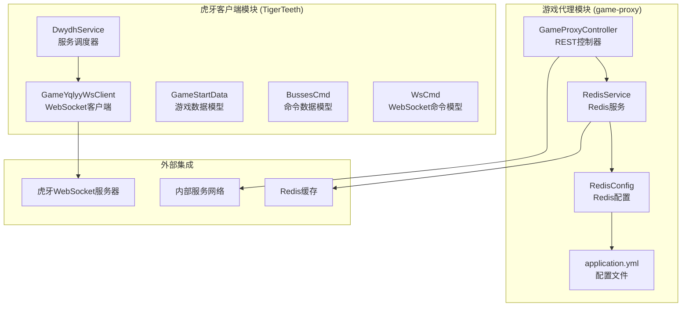
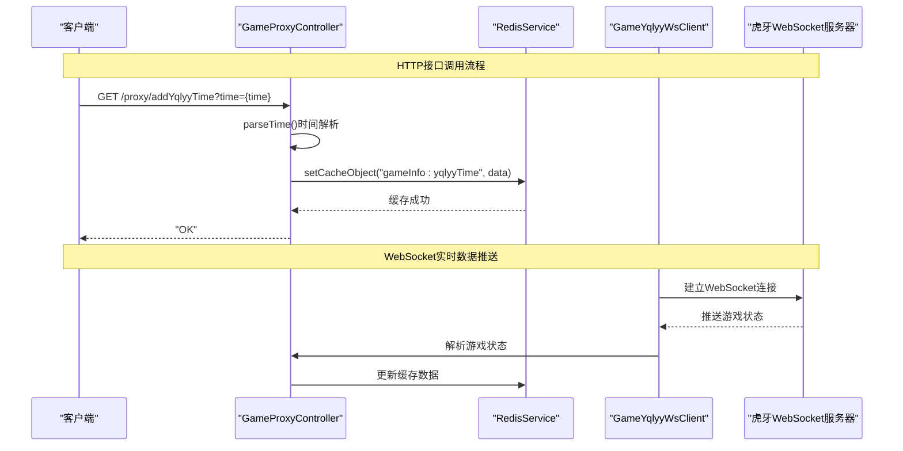
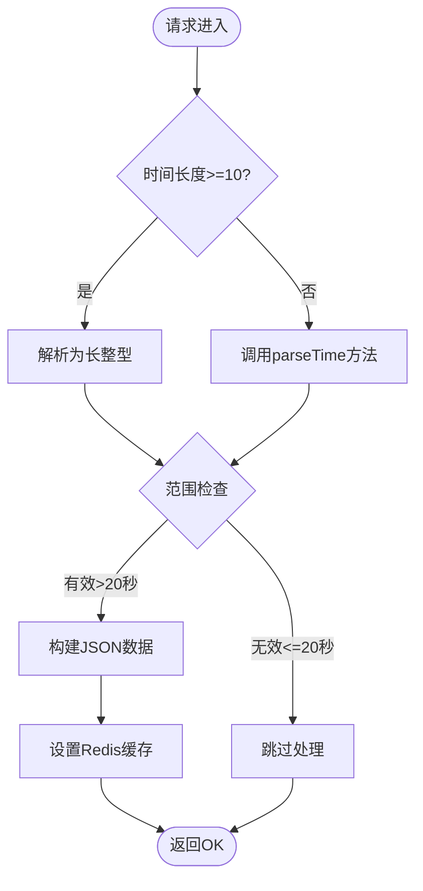
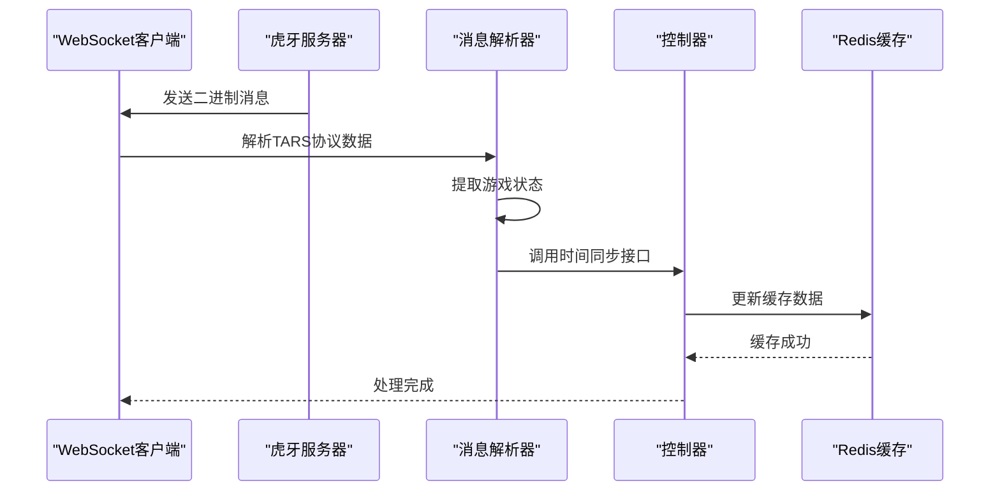
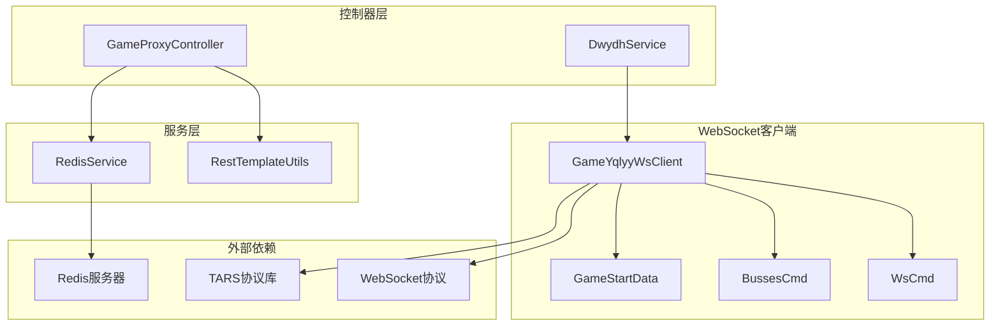

# 一千零一夜接口

<cite>
**本文档引用的文件**
- [GameProxyController.java](file://game-proxy/src/main/java/com/game/controller/GameProxyController.java)
- [RedisService.java](file://game-proxy/src/main/java/com/game/redis/RedisService.java)
- [RedisConfig.java](file://game-proxy/src/main/java/com/game/redis/RedisConfig.java)
- [application.yml](file://game-proxy/src/main/resources/application.yml)
- [GameYqlyyWsClient.java](file://TigerTeeth/src/main/java/com/yqlyy/GameYqlyyWsClient.java)
- [DwydhService.java](file://TigerTeeth/src/main/java/com/dwydh/DwydhService.java)
- [GameStartData.java](file://TigerTeeth/src/main/java/com/entity/GameStartData.java)
- [BussesCmd.java](file://TigerTeeth/src/main/java/com/entity/BussesCmd.java)
- [WsCmd.java](file://TigerTeeth/src/main/java/com/entity/WsCmd.java)
</cite>

## 目录
1. [简介](#简介)
2. [项目结构](#项目结构)
3. [核心组件](#核心组件)
4. [架构概览](#架构概览)
5. [详细组件分析](#详细组件分析)
6. [依赖关系分析](#依赖关系分析)
7. [性能考虑](#性能考虑)
8. [故障排除指南](#故障排除指南)
9. [结论](#结论)

## 简介

"一千零一夜"接口是游戏管理系统中的核心组件，专门用于处理与"一千零一夜"游戏相关的定时任务和时间管理功能。该接口通过HTTP RESTful API提供时间数据的存储和获取能力，并集成了Redis缓存机制来优化性能。

该系统主要包含两个核心接口：
- `/addYqlyyTime` - 用于保存游戏时间数据
- `/getYqlyyTime` - 用于获取当前游戏时间数据

系统还集成了WebSocket客户端来实时接收游戏状态更新，并通过Redis进行数据缓存管理。

## 项目结构

基于代码库分析，"一千零一夜"接口涉及以下关键模块：



**图表来源**
- [GameProxyController.java](file://game-proxy/src/main/java/com/game/controller/GameProxyController.java#L1-L436)
- [RedisService.java](file://game-proxy/src/main/java/com/game/redis/RedisService.java#L1-L244)
- [GameYqlyyWsClient.java](file://TigerTeeth/src/main/java/com/yqlyy/GameYqlyyWsClient.java#L1-L328)

**章节来源**
- [GameProxyController.java](file://game-proxy/src/main/java/com/game/controller/GameProxyController.java#L1-L436)
- [RedisService.java](file://game-proxy/src/main/java/com/game/redis/RedisService.java#L1-L244)
- [GameYqlyyWsClient.java](file://TigerTeeth/src/main/java/com/yqlyy/GameYqlyyWsClient.java#L1-L328)

## 核心组件

### REST控制器组件

GameProxyController是系统的核心控制器，负责处理所有HTTP请求并协调各个服务组件的工作。

**主要功能特性：**
- 提供RESTful API接口
- 集成Redis缓存管理
- 实现时间格式转换逻辑
- 支持多种时间格式输入

**章节来源**
- [GameProxyController.java](file://game-proxy/src/main/java/com/game/controller/GameProxyController.java#L30-L436)

### Redis缓存服务

RedisService提供了完整的Redis操作封装，包括数据存储、读取、过期时间管理和键值操作。

**核心功能：**
- 基本对象缓存（String、Integer、实体类）
- 带过期时间的缓存设置
- 键值对的有效时间管理
- 批量操作支持

**章节来源**
- [RedisService.java](file://game-proxy/src/main/java/com/game/redis/RedisService.java#L1-L244)

### WebSocket客户端

GameYqlyyWsClient实现了与虎牙WebSocket服务器的连接和通信，用于实时接收游戏状态更新。

**主要功能：**
- WebSocket连接管理
- 二进制消息处理
- 游戏状态监听
- 自动重连机制

**章节来源**
- [GameYqlyyWsClient.java](file://TigerTeeth/src/main/java/com/yqlyy/GameYqlyyWsClient.java#L1-L328)

## 架构概览

系统采用分层架构设计，将业务逻辑、数据访问和外部集成分离：



**图表来源**
- [GameProxyController.java](file://game-proxy/src/main/java/com/game/controller/GameProxyController.java#L230-L282)
- [GameYqlyyWsClient.java](file://TigerTeeth/src/main/java/com/yqlyy/GameYqlyyWsClient.java#L221-L290)

## 详细组件分析

### addYqlyyTime接口实现

addYqlyyTime接口负责处理游戏时间数据的保存逻辑，支持多种时间格式输入。

#### 接口定义

**URL:** `/proxy/addYqlyyTime`
**方法:** GET
**参数:** `time` (String类型)

#### 时间格式处理逻辑

系统支持三种主要的时间格式：

1. **数字格式 (秒)**: 直接解析为秒数
2. **分钟:秒格式**: 支持MM:SS格式
3. **小时:分钟:秒格式**: 支持HH:MM:SS格式



**图表来源**
- [GameProxyController.java](file://game-proxy/src/main/java/com/game/controller/GameProxyController.java#L231-L274)

#### parseTime静态方法详解

parseTime方法实现了灵活的时间格式转换功能：

**支持的输入格式：**
- `"300"` → 300秒
- `"5:30"` → 5分钟30秒 = 330秒  
- `"1:10:30"` → 1小时10分钟30秒 = 4230秒

**处理流程：**
1. 检查输入是否包含冒号
2. 如果包含冒号，按冒号分割
3. 根据分割数量判断格式类型
4. 计算总秒数
5. 返回转换结果

**章节来源**
- [GameProxyController.java](file://game-proxy/src/main/java/com/game/controller/GameProxyController.java#L306-L322)

### getYqlyyTime接口实现

getYqlyyTime接口提供当前游戏时间数据的查询功能。

#### 接口定义

**URL:** `/proxy/getYqlyyTime`
**方法:** GET

#### 数据结构

返回的JSON数据包含以下字段：
- `openTime`: 开奖时间戳（毫秒级）

**章节来源**
- [GameProxyController.java](file://game-proxy/src/main/java/com/game/controller/GameProxyController.java#L278-L282)

### Redis缓存机制

系统使用Redis作为缓存层，实现高性能的数据存储和访问。

#### 缓存键值命名规范

- **主键:** `gameInfo:yqlyyTime`
- **用途:** 存储"一千零一夜"游戏的当前时间数据

#### 过期时间设置

- **默认过期时间:** 10秒
- **设置方式:** 使用`setCacheObject(key, value, timeout, TimeUnit.SECONDS)`方法

#### 缓存数据格式

```json
{
  "openTime": 1700000000000
}
```

**章节来源**
- [RedisService.java](file://game-proxy/src/main/java/com/game/redis/RedisService.java#L24-L44)

### WebSocket实时数据处理

GameYqlyyWsClient负责与虎牙WebSocket服务器建立连接，实时接收游戏状态更新。

#### 连接管理

- **WebSocket URL:** `wss://3b258d37-ws.va.huya.com/...`
- **自动重连:** 连接断开后自动重新连接
- **心跳检测:** 定期发送Pong消息维持连接

#### 消息处理流程



**图表来源**
- [GameYqlyyWsClient.java](file://TigerTeeth/src/main/java/com/yqlyy/GameYqlyyWsClient.java#L51-L219)

**章节来源**
- [GameYqlyyWsClient.java](file://TigerTeeth/src/main/java/com/yqlyy/GameYqlyyWsClient.java#L1-L328)

## 依赖关系分析

系统各组件之间的依赖关系如下：



**图表来源**
- [GameProxyController.java](file://game-proxy/src/main/java/com/game/controller/GameProxyController.java#L1-L436)
- [GameYqlyyWsClient.java](file://TigerTeeth/src/main/java/com/yqlyy/GameYqlyyWsClient.java#L1-L328)

**章节来源**
- [GameProxyController.java](file://game-proxy/src/main/java/com/game/controller/GameProxyController.java#L1-L436)
- [GameYqlyyWsClient.java](file://TigerTeeth/src/main/java/com/yqlyy/GameYqlyyWsClient.java#L1-L328)

## 性能考虑

### 缓存策略优化

1. **过期时间设置**: 10秒的过期时间平衡了数据新鲜度和缓存效率
2. **序列化优化**: 使用JSON序列化减少内存占用
3. **连接池配置**: Redis连接池最大20个连接，满足高并发需求

### WebSocket性能优化

1. **消息缓冲区**: 默认65536字节，支持大数据包传输
2. **异步发送**: 设置异步发送超时时间为20秒
3. **空闲超时**: 30秒空闲超时，及时释放资源

### 时间处理优化

1. **快速路径**: 数字格式直接解析，避免字符串分割开销
2. **边界检查**: 提前验证时间范围，减少无效计算
3. **原子操作**: Redis操作保证数据一致性

## 故障排除指南

### 常见问题及解决方案

#### 1. Redis连接失败

**症状:** 控制台出现连接异常日志
**原因:** Redis服务器不可达或认证失败
**解决方案:**
- 检查Redis服务器状态
- 验证密码配置
- 确认网络连接

#### 2. WebSocket连接中断

**症状:** 日志显示连接断开
**原因:** 网络不稳定或服务器主动断开
**解决方案:**
- 检查网络连接稳定性
- 查看防火墙设置
- 增加重连间隔

#### 3. 时间格式解析错误

**症状:** parseTime方法抛出异常
**原因:** 输入格式不符合预期
**解决方案:**
- 验证输入格式为支持的格式之一
- 检查数值范围是否合理
- 添加适当的错误处理逻辑

#### 4. 缓存数据过期

**症状:** 获取到的数据为空
**原因:** 缓存数据已过期
**解决方案:**
- 检查Redis配置的过期时间
- 确认数据更新频率
- 调整过期时间设置

**章节来源**
- [RedisService.java](file://game-proxy/src/main/java/com/game/redis/RedisService.java#L1-L244)
- [GameYqlyyWsClient.java](file://TigerTeeth/src/main/java/com/yqlyy/GameYqlyyWsClient.java#L240-L272)

## 结论

"一千零一夜"接口系统通过精心设计的架构实现了高效的游戏时间管理功能。系统的主要优势包括：

1. **灵活的时间格式支持**: 支持多种时间格式输入，适应不同的数据源
2. **高性能缓存机制**: Redis缓存确保了数据访问的低延迟
3. **实时数据同步**: WebSocket客户端实现实时游戏状态监控
4. **健壮的错误处理**: 完善的异常处理和重试机制保证系统稳定性

该系统为游戏运营提供了可靠的时间管理基础设施，能够满足高并发场景下的性能要求，并为后续的功能扩展奠定了良好的基础。