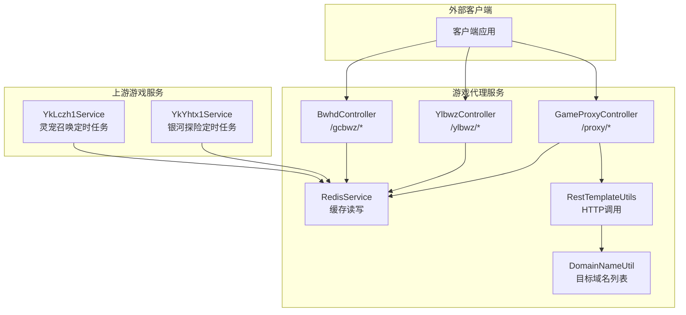
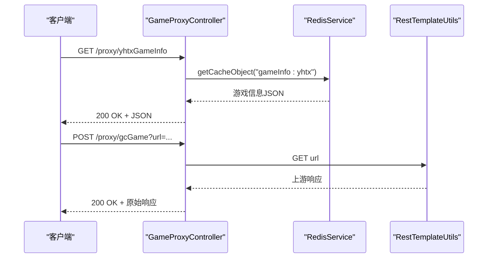
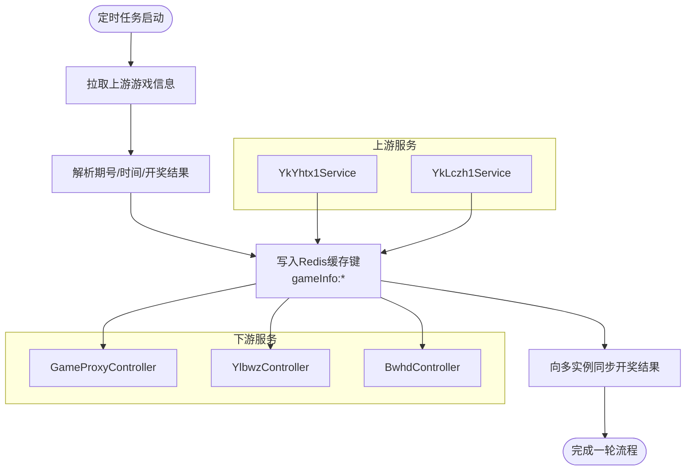

# 核心API接口规范

<cite>
**本文档引用的文件**
- [GameProxyController.java](file://game-proxy/src/main/java/com/game/controller/GameProxyController.java)
- [YlbwzController.java](file://game-proxy/src/main/java/com/game/ylbwz/YlbwzController.java)
- [BwhdController.java](file://game-proxy/src/main/java/com/game/gcbwz/BwhdController.java)
- [YkLczh1Service.java](file://game-proxy/src/main/java/com/game/yk/lczh/YkLczh1Service.java)
- [YkYhtx1Service.java](file://game-proxy/src/main/java/com/game/yk/yhtx/YkYhtx1Service.java)
- [RestTemplateUtils.java](file://game-proxy/src/main/java/com/game/commom/RestTemplateUtils.java)
- [RedisService.java](file://game-proxy/src/main/java/com/game/redis/RedisService.java)
- [application.yml](file://game-proxy/src/main/resources/application.yml)
- [DomainNameUtil.java](file://game-proxy/src/main/java/com/game/utils/DomainNameUtil.java)
- [Constants.java](file://game-proxy/src/main/java/com/game/commom/Constants.java)
</cite>

## 目录
1. [简介](#简介)
2. [项目结构](#项目结构)
3. [核心组件](#核心组件)
4. [架构总览](#架构总览)
5. [详细组件分析](#详细组件分析)
6. [依赖关系分析](#依赖关系分析)
7. [性能考量](#性能考量)
8. [故障排除指南](#故障排除指南)
9. [结论](#结论)
10. [附录](#附录)

## 简介
本文件为游戏代理系统的API接口规范，重点覆盖以下核心RESTful接口：
- /proxy/gcGame：古城游戏代理转发
- /proxy/ylbwzGame：幽林保卫战游戏代理
- /proxy/yhtxGameInfo：银河探险游戏信息查询
- /proxy/lczhGameInfo：灵宠召唤游戏信息查询
- /ylbwz/lastLucky、/ylbwz/luckyList、/ylbwz/luckyTime：幽林历史数据与开奖时间查询
- /gcbwz/lastLucky、/gcbwz/luckyList、/gcbwz/luckyTime：古城历史数据与开奖时间查询

文档涵盖每个接口的HTTP方法、URL路径、请求参数、响应格式、业务逻辑、调用示例、参数验证规则、错误码说明、接口间关系与数据流转，并提供完整的API文档模板与使用指南。

## 项目结构
该系统采用Spring Boot微服务架构，核心控制器位于game-proxy模块，负责对外提供代理与查询接口，内部通过Redis缓存游戏信息，通过RestTemplate进行跨服务HTTP调用。



图表来源
- [GameProxyController.java](file://game-proxy/src/main/java/com/game/controller/GameProxyController.java#L36-L436)
- [YlbwzController.java](file://game-proxy/src/main/java/com/game/ylbwz/YlbwzController.java#L18-L74)
- [BwhdController.java](file://game-proxy/src/main/java/com/game/gcbwz/BwhdController.java#L18-L71)
- [YkLczh1Service.java](file://game-proxy/src/main/java/com/game/yk/lczh/YkLczh1Service.java#L24-L126)
- [YkYhtx1Service.java](file://game-proxy/src/main/java/com/game/yk/yhtx/YkYhtx1Service.java#L31-L134)
- [RestTemplateUtils.java](file://game-proxy/src/main/java/com/game/commom/RestTemplateUtils.java#L13-L51)
- [RedisService.java](file://game-proxy/src/main/java/com/game/redis/RedisService.java#L20-L244)
- [DomainNameUtil.java](file://game-proxy/src/main/java/com/game/utils/DomainNameUtil.java#L3-L16)

章节来源
- [application.yml](file://game-proxy/src/main/resources/application.yml#L1-L58)

## 核心组件
- GameProxyController：提供游戏代理与信息查询接口，包括古城、幽林、UU农场、一千零一夜、宠物马拉松等游戏的时间与开奖结果同步。
- YlbwzController：提供幽林保卫战的历史数据与开奖时间查询，内部处理登录状态校验。
- BwhdController：提供古城保卫战的历史数据与开奖时间查询。
- YkYhtx1Service / YkLczh1Service：定时拉取上游游戏信息并写入Redis，供代理层查询。
- RestTemplateUtils：统一的HTTP客户端封装，支持GET、POST、exchange。
- RedisService：Redis操作封装，提供缓存读写、过期设置、批量操作等。
- DomainNameUtil：目标域名数组，用于向多实例同步开奖结果。
- Constants：常量定义，如上游API地址。

章节来源
- [GameProxyController.java](file://game-proxy/src/main/java/com/game/controller/GameProxyController.java#L36-L436)
- [YlbwzController.java](file://game-proxy/src/main/java/com/game/ylbwz/YlbwzController.java#L18-L74)
- [BwhdController.java](file://game-proxy/src/main/java/com/game/gcbwz/BwhdController.java#L18-L71)
- [YkLczh1Service.java](file://game-proxy/src/main/java/com/game/yk/lczh/YkLczh1Service.java#L24-L126)
- [YkYhtx1Service.java](file://game-proxy/src/main/java/com/game/yk/yhtx/YkYhtx1Service.java#L31-L134)
- [RestTemplateUtils.java](file://game-proxy/src/main/java/com/game/commom/RestTemplateUtils.java#L13-L51)
- [RedisService.java](file://game-proxy/src/main/java/com/game/redis/RedisService.java#L20-L244)
- [DomainNameUtil.java](file://game-proxy/src/main/java/com/game/utils/DomainNameUtil.java#L3-L16)
- [Constants.java](file://game-proxy/src/main/java/com/game/commom/Constants.java#L3-L14)

## 架构总览
系统通过GameProxyController对外暴露统一入口，内部通过Redis缓存上游游戏信息，定时任务服务从上游拉取数据并写入缓存。代理接口直接读取缓存或转发上游请求，实现低延迟与高可用。



图表来源
- [GameProxyController.java](file://game-proxy/src/main/java/com/game/controller/GameProxyController.java#L51-L58)
- [GameProxyController.java](file://game-proxy/src/main/java/com/game/controller/GameProxyController.java#L90-L94)
- [RestTemplateUtils.java](file://game-proxy/src/main/java/com/game/commom/RestTemplateUtils.java#L38-L44)
- [RedisService.java](file://game-proxy/src/main/java/com/game/redis/RedisService.java#L95-L98)

## 详细组件分析

### 接口清单与规范

#### 1) 古城游戏代理 /proxy/gcGame
- 方法：POST
- 路径：/proxy/gcGame
- 请求参数：
  - url：上游目标URL（字符串）
- 响应格式：字符串（上游原始响应）
- 业务逻辑：
  - 记录请求日志
  - 使用RestTemplateUtils.get(url, String.class)发起GET请求
  - 返回上游响应内容
- 参数验证规则：
  - url必须为有效的HTTP(S)地址
- 错误处理：
  - 网络异常由RestTemplate抛出，建议上层捕获并返回标准错误码
- 调用示例：
  - curl -X POST "http://localhost:8085/gameProxy/proxy/gcGame" -d "url=http://upstream.example.com/api"

章节来源
- [GameProxyController.java](file://game-proxy/src/main/java/com/game/controller/GameProxyController.java#L51-L58)
- [RestTemplateUtils.java](file://game-proxy/src/main/java/com/game/commom/RestTemplateUtils.java#L38-L44)

#### 2) 幽林保卫战游戏代理 /proxy/ylbwzGame
- 方法：POST
- 路径：/proxy/ylbwzGame
- 请求参数：
  - url：上游目标URL（字符串）
  - Uuid：用户标识（字符串）
  - Mid：媒体标识（字符串）
  - Pid：产品标识（字符串）
- 响应格式：字符串（上游原始响应）
- 业务逻辑：
  - 记录请求日志
  - 设置请求头：Uuid、Mid、Pid、Clienttime、Dfid
  - 使用RestTemplateUtils.exchange(url, GET, headers, String.class)发起请求
  - 返回上游响应内容
- 参数验证规则：
  - url必须为有效的HTTP(S)地址
  - Uuid/Mid/Pid非空
- 错误处理：
  - 网络异常由RestTemplate抛出，建议上层捕获并返回标准错误码
- 调用示例：
  - curl -X POST "http://localhost:8085/gameProxy/proxy/ylbwzGame" -d "url=http://upstream.example.com/api&Uuid=...&Mid=...&Pid=..."

章节来源
- [GameProxyController.java](file://game-proxy/src/main/java/com/game/controller/GameProxyController.java#L66-L81)
- [RestTemplateUtils.java](file://game-proxy/src/main/java/com/game/commom/RestTemplateUtils.java#L42-L44)

#### 3) 银河探险游戏信息 /proxy/yhtxGameInfo
- 方法：GET
- 路径：/proxy/yhtxGameInfo
- 请求参数：无
- 响应格式：字符串（JSON）
- 业务逻辑：
  - 从Redis读取键"gameInfo:yhtx"的缓存值
  - 返回缓存内容
- 参数验证规则：无
- 错误处理：
  - 未命中返回null或空字符串，需上层判断
- 调用示例：
  - curl "http://localhost:8085/gameProxy/proxy/yhtxGameInfo"

章节来源
- [GameProxyController.java](file://game-proxy/src/main/java/com/game/controller/GameProxyController.java#L90-L94)
- [RedisService.java](file://game-proxy/src/main/java/com/game/redis/RedisService.java#L95-L98)

#### 4) 灵宠召唤游戏信息 /proxy/lczhGameInfo
- 方法：GET
- 路径：/proxy/lczhGameInfo
- 请求参数：无
- 响应格式：字符串（JSON）
- 业务逻辑：
  - 从Redis读取键"gameInfo:lczh"的缓存值
  - 返回缓存内容
- 参数验证规则：无
- 错误处理：
  - 未命中返回null或空字符串，需上层判断
- 调用示例：
  - curl "http://localhost:8085/gameProxy/proxy/lczhGameInfo"

章节来源
- [GameProxyController.java](file://game-proxy/src/main/java/com/game/controller/GameProxyController.java#L101-L105)
- [RedisService.java](file://game-proxy/src/main/java/com/game/redis/RedisService.java#L95-L98)

#### 5) 大话三国游戏信息 /proxy/dhsgGameInfo
- 方法：GET
- 路径：/proxy/dhsgGameInfo
- 请求参数：无
- 响应格式：字符串（JSON）
- 业务逻辑：
  - 从Redis读取键"gameInfo:dhsg"的缓存值
  - 返回缓存内容
- 参数验证规则：无
- 错误处理：
  - 未命中返回null或空字符串，需上层判断
- 调用示例：
  - curl "http://localhost:8085/gameProxy/proxy/dhsgGameInfo"

章节来源
- [GameProxyController.java](file://game-proxy/src/main/java/com/game/controller/GameProxyController.java#L113-L117)
- [RedisService.java](file://game-proxy/src/main/java/com/game/redis/RedisService.java#L95-L98)

#### 6) 小红帽游戏信息 /proxy/bjxxhmGameInfo
- 方法：GET
- 路径：/proxy/bjxxhmGameInfo
- 请求参数：无
- 响应格式：字符串（JSON）
- 业务逻辑：
  - 从Redis读取键"gameInfo:bjxxhm"的缓存值
  - 返回缓存内容
- 参数验证规则：无
- 错误处理：
  - 未命中返回null或空字符串，需上层判断
- 调用示例：
  - curl "http://localhost:8085/gameProxy/proxy/bjxxhmGameInfo"

章节来源
- [GameProxyController.java](file://game-proxy/src/main/java/com/game/controller/GameProxyController.java#L124-L128)
- [RedisService.java](file://game-proxy/src/main/java/com/game/redis/RedisService.java#L95-L98)

#### 7) 三国游戏信息 /proxy/bjxsgGameInfo
- 方法：GET
- 路径：/proxy/bjxsgGameInfo
- 请求参数：无
- 响应格式：字符串（JSON）
- 业务逻辑：
  - 从Redis读取键"gameInfo:bjxsg"的缓存值
  - 返回缓存内容
- 参数验证规则：无
- 错误处理：
  - 未命中返回null或空字符串，需上层判断
- 调用示例：
  - curl "http://localhost:8085/gameProxy/proxy/bjxsgGameInfo"

章节来源
- [GameProxyController.java](file://game-proxy/src/main/java/com/game/controller/GameProxyController.java#L138-L142)
- [RedisService.java](file://game-proxy/src/main/java/com/game/redis/RedisService.java#L95-L98)

#### 8) 怪物捕手游戏信息 /proxy/bjxgwbsGameInfo
- 方法：GET
- 路径：/proxy/bjxgwbsGameInfo
- 请求参数：无
- 响应格式：字符串（JSON）
- 业务逻辑：
  - 从Redis读取键"gameInfo:bjxgwbs"的缓存值
  - 返回缓存内容
- 参数验证规则：无
- 错误处理：
  - 未命中返回null或空字符串，需上层判断
- 调用示例：
  - curl "http://localhost:8085/gameProxy/proxy/bjxgwbsGameInfo"

章节来源
- [GameProxyController.java](file://game-proxy/src/main/java/com/game/controller/GameProxyController.java#L149-L153)
- [RedisService.java](file://game-proxy/src/main/java/com/game/redis/RedisService.java#L95-L98)

#### 9) 幽林历史数据（最近一期）/ylbwz/lastLucky
- 方法：GET
- 路径：/ylbwz/lastLucky
- 请求参数：无
- 响应格式：字符串（JSON对象）
- 业务逻辑：
  - 调用getList()获取历史数据
  - 若响应包含"登录已失效"，执行登录后再获取
  - 解析第一条记录并返回
- 参数验证规则：无
- 错误处理：
  - 登录失败或网络异常需上层捕获
- 调用示例：
  - curl "http://localhost:8085/gameProxy/ylbwz/lastLucky"

章节来源
- [YlbwzController.java](file://game-proxy/src/main/java/com/game/ylbwz/YlbwzController.java#L29-L42)

#### 10) 幽林历史数据（全部）/ylbwz/luckyList
- 方法：GET
- 路径：/ylbwz/luckyList
- 请求参数：无
- 响应格式：字符串（JSON数组）
- 业务逻辑：
  - 调用getList()获取历史数据
  - 若响应包含"登录已失效"，执行登录后再获取
  - 返回完整列表
- 参数验证规则：无
- 错误处理：
  - 登录失败或网络异常需上层捕获
- 调用示例：
  - curl "http://localhost:8085/gameProxy/ylbwz/luckyList"

章节来源
- [YlbwzController.java](file://game-proxy/src/main/java/com/game/ylbwz/YlbwzController.java#L44-L54)

#### 11) 幽林开奖时间 /ylbwz/luckyTime
- 方法：GET
- 路径：/ylbwz/luckyTime
- 请求参数：无
- 响应格式：字符串（数字）
- 业务逻辑：
  - 从Redis读取键"lottery_open_time_ylbwz"的缓存值
  - 返回时间戳
- 参数验证规则：无
- 错误处理：
  - 未命中返回null或空字符串，需上层判断
- 调用示例：
  - curl "http://localhost:8085/gameProxy/ylbwz/luckyTime"

章节来源
- [YlbwzController.java](file://game-proxy/src/main/java/com/game/ylbwz/YlbwzController.java#L66-L72)
- [RedisService.java](file://game-proxy/src/main/java/com/game/redis/RedisService.java#L95-L98)

#### 12) 古城历史数据（最近一期）/gcbwz/lastLucky
- 方法：GET
- 路径：/gcbwz/lastLucky
- 请求参数：无
- 响应格式：字符串（JSON对象）
- 业务逻辑：
  - 调用getList()获取历史数据
  - 若响应包含"登录已失效"，重新获取
  - 解析第一条记录并返回
- 参数验证规则：无
- 错误处理：
  - 登录失败或网络异常需上层捕获
- 调用示例：
  - curl "http://localhost:8085/gameProxy/gcbwz/lastLucky"

章节来源
- [BwhdController.java](file://game-proxy/src/main/java/com/game/gcbwz/BwhdController.java#L28-L41)

#### 13) 古城历史数据（全部）/gcbwz/luckyList
- 方法：GET
- 路径：/gcbwz/luckyList
- 请求参数：无
- 响应格式：字符串（JSON数组）
- 业务逻辑：
  - 调用getList()获取历史数据
  - 若响应包含"登录已失效"，重新获取
  - 返回完整列表
- 参数验证规则：无
- 错误处理：
  - 登录失败或网络异常需上层捕获
- 调用示例：
  - curl "http://localhost:8085/gameProxy/gcbwz/luckyList"

章节来源
- [BwhdController.java](file://game-proxy/src/main/java/com/game/gcbwz/BwhdController.java#L43-L53)

#### 14) 古城开奖时间 /gcbwz/luckyTime
- 方法：GET
- 路径：/gcbwz/luckyTime
- 请求参数：无
- 响应格式：字符串（数字）
- 业务逻辑：
  - 从Redis读取键"lottery_open_time_gc"的缓存值
  - 返回时间戳
- 参数验证规则：无
- 错误处理：
  - 未命中返回null或空字符串，需上层判断
- 调用示例：
  - curl "http://localhost:8085/gameProxy/gcbwz/luckyTime"

章节来源
- [BwhdController.java](file://game-proxy/src/main/java/com/game/gcbwz/BwhdController.java#L63-L69)
- [RedisService.java](file://game-proxy/src/main/java/com/game/redis/RedisService.java#L95-L98)

### 接口关系与数据流转



图表来源
- [YkYhtx1Service.java](file://game-proxy/src/main/java/com/game/yk/yhtx/YkYhtx1Service.java#L49-L77)
- [YkLczh1Service.java](file://game-proxy/src/main/java/com/game/yk/lczh/YkLczh1Service.java#L42-L70)
- [GameProxyController.java](file://game-proxy/src/main/java/com/game/controller/GameProxyController.java#L90-L105)
- [YlbwzController.java](file://game-proxy/src/main/java/com/game/ylbwz/YlbwzController.java#L29-L54)
- [BwhdController.java](file://game-proxy/src/main/java/com/game/gcbwz/BwhdController.java#L28-L53)

## 依赖关系分析

```mermaid
classDiagram
class GameProxyController {
+gcGame(url)
+ylbwzGame(url, Uuid, Mid, Pid)
+yhtxGameInfo()
+lczhGameInfo()
+dhsgGameInfo()
+bjxxhmGameInfo()
+bjxsgGameInfo()
+bjxgwbsGameInfo()
}
class YlbwzController {
+lastLucky()
+luckyList()
+luckyTime()
}
class BwhdController {
+lastLucky()
+luckyList()
+luckyTime()
}
class YkYhtx1Service {
+init()
+gameInfo()
+luckMonster(times)
}
class YkLczh1Service {
+init()
+gameInfo()
+luckMonster(times)
}
class RestTemplateUtils {
+get(url, responseType)
+post(url, body, responseType)
+exchange(url, method, entity, responseType)
}
class RedisService {
+getCacheObject(key)
+setCacheObject(key, value)
+setCacheObject(key, value, timeout, unit)
+deleteObject(key)
}
GameProxyController --> RestTemplateUtils : "HTTP调用"
GameProxyController --> RedisService : "读写缓存"
YlbwzController --> RedisService : "读取开奖时间"
BwhdController --> RedisService : "读取开奖时间"
YkYhtx1Service --> RedisService : "写入gameInfo : yhtx"
YkLczh1Service --> RedisService : "写入gameInfo : lczh"
```

图表来源
- [GameProxyController.java](file://game-proxy/src/main/java/com/game/controller/GameProxyController.java#L36-L436)
- [YlbwzController.java](file://game-proxy/src/main/java/com/game/ylbwz/YlbwzController.java#L18-L74)
- [BwhdController.java](file://game-proxy/src/main/java/com/game/gcbwz/BwhdController.java#L18-L71)
- [YkLczh1Service.java](file://game-proxy/src/main/java/com/game/yk/lczh/YkLczh1Service.java#L24-L126)
- [YkYhtx1Service.java](file://game-proxy/src/main/java/com/game/yk/yhtx/YkYhtx1Service.java#L31-L134)
- [RestTemplateUtils.java](file://game-proxy/src/main/java/com/game/commom/RestTemplateUtils.java#L13-L51)
- [RedisService.java](file://game-proxy/src/main/java/com/game/redis/RedisService.java#L20-L244)

章节来源
- [DomainNameUtil.java](file://game-proxy/src/main/java/com/game/utils/DomainNameUtil.java#L3-L16)
- [Constants.java](file://game-proxy/src/main/java/com/game/commom/Constants.java#L3-L14)

## 性能考量
- Redis缓存：通过RedisService读写缓存，减少上游调用频率，提升响应速度。
- 定时任务：YkYhtx1Service与YkLczh1Service定时拉取上游数据，避免实时请求带来的压力。
- HTTP客户端：RestTemplateUtils统一封装，便于配置连接池与超时参数。
- 限流策略：图像识别接口对短时间内的重复调用进行限流，防止接口滥用。

章节来源
- [GameProxyController.java](file://game-proxy/src/main/java/com/game/controller/GameProxyController.java#L360-L412)
- [RedisService.java](file://game-proxy/src/main/java/com/game/redis/RedisService.java#L30-L44)
- [YkYhtx1Service.java](file://game-proxy/src/main/java/com/game/yk/yhtx/YkYhtx1Service.java#L49-L77)
- [YkLczh1Service.java](file://game-proxy/src/main/java/com/game/yk/lczh/YkLczh1Service.java#L42-L70)

## 故障排除指南
- 通用错误码建议：
  - 400：请求参数缺失或格式不正确
  - 401：鉴权失败（如涉及）
  - 404：资源不存在
  - 500：服务器内部错误
  - 503：上游服务不可用或超时
- 常见问题定位：
  - Redis未命中：检查上游定时任务是否正常运行，确认缓存键是否存在
  - 登录失效：幽林/古城控制器会在检测到登录失效时自动重试，若仍失败，检查会话配置
  - 网络异常：检查RestTemplate超时配置与上游可达性
- 日志与监控：
  - 控制器层记录请求与响应日志，便于追踪问题
  - RedisService提供keys等辅助方法，可用于调试

章节来源
- [GameProxyController.java](file://game-proxy/src/main/java/com/game/controller/GameProxyController.java#L360-L412)
- [YlbwzController.java](file://game-proxy/src/main/java/com/game/ylbwz/YlbwzController.java#L34-L37)
- [BwhdController.java](file://game-proxy/src/main/java/com/game/gcbwz/BwhdController.java#L33-L35)

## 结论
本API接口规范覆盖了游戏代理的核心能力，包括代理转发、信息查询与定时同步。通过Redis缓存与定时任务，系统实现了低延迟与高可用。建议在生产环境中完善鉴权、限流与监控体系，并持续优化上游对接与缓存策略。

## 附录

### API文档模板与使用指南

- 服务基础信息
  - 基础URL：http://localhost:8085/gameProxy
  - 默认超时：参考application.yml中的HTTP超时配置
- 请求头设置
  - Content-Type：application/json（适用于需要JSON体的接口）
  - 自定义头：/proxy/ylbwzGame接口需要设置Uuid、Mid、Pid、Clienttime、Dfid
- 认证机制
  - 当前接口未内置认证，如需启用，请在网关或控制器层增加鉴权逻辑
- 安全考虑
  - 限制IP访问白名单
  - 启用HTTPS
  - 对敏感参数进行脱敏与审计
- 错误码对照
  - 400：参数错误
  - 401：未授权
  - 404：资源不存在
  - 500：服务器内部错误
  - 503：上游服务不可用

章节来源
- [application.yml](file://game-proxy/src/main/resources/application.yml#L1-L58)
- [GameProxyController.java](file://game-proxy/src/main/java/com/game/controller/GameProxyController.java#L69-L75)