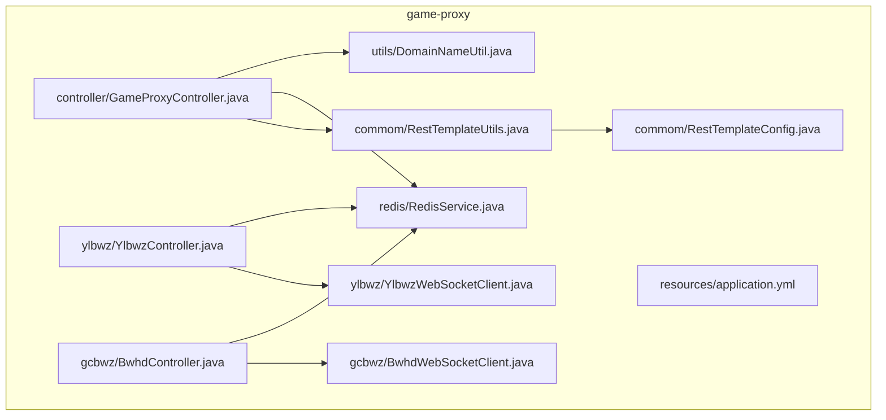
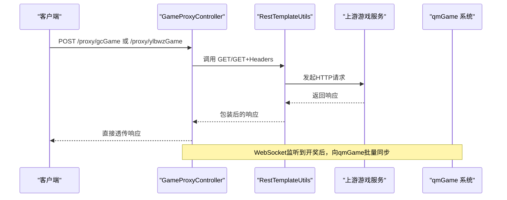
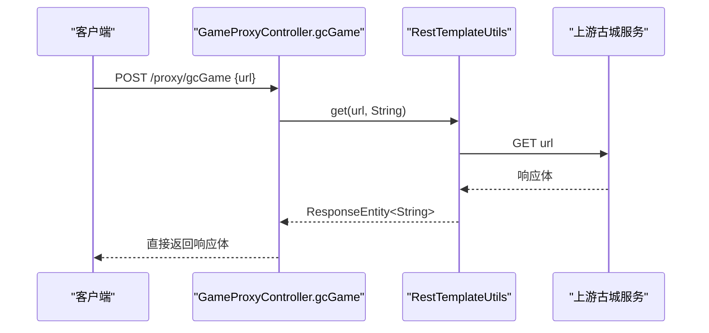
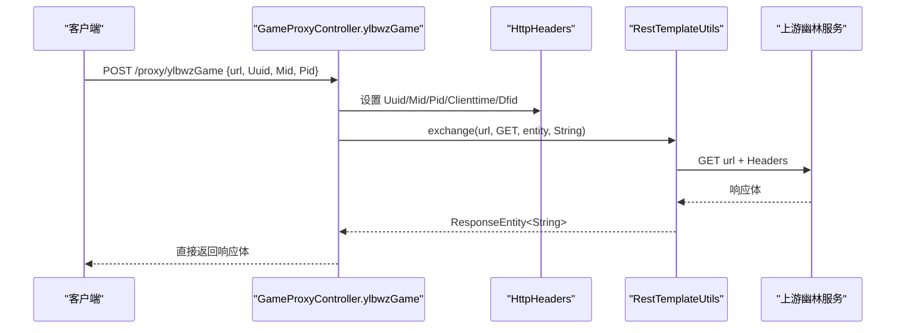
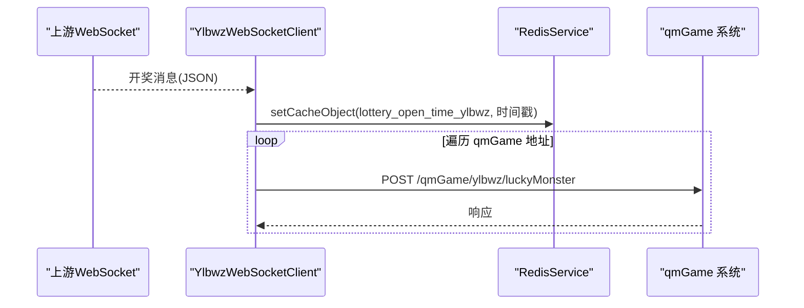
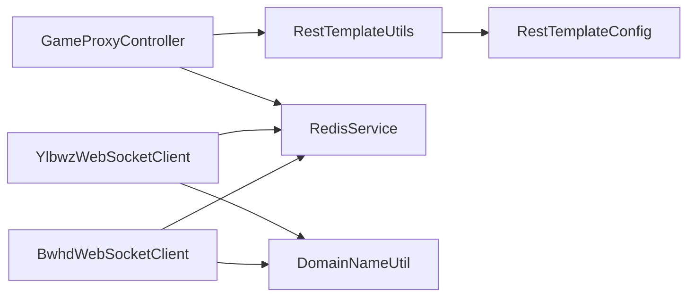

# 游戏代理接口

<cite>
**本文引用的文件**
- [GameProxyController.java](file://game-proxy/src/main/java/com/game/controller/GameProxyController.java)
- [YlbwzController.java](file://game-proxy/src/main/java/com/game/ylbwz/YlbwzController.java)
- [BwhdController.java](file://game-proxy/src/main/java/com/game/gcbwz/BwhdController.java)
- [RestTemplateUtils.java](file://game-proxy/src/main/java/com/game/commom/RestTemplateUtils.java)
- [RestTemplateConfig.java](file://game-proxy/src/main/java/com/game/commom/RestTemplateConfig.java)
- [RedisService.java](file://game-proxy/src/main/java/com/game/redis/RedisService.java)
- [YlbwzWebSocketClient.java](file://game-proxy/src/main/java/com/game/ylbwz/YlbwzWebSocketClient.java)
- [BwhdWebSocketClient.java](file://game-proxy/src/main/java/com/game/gcbwz/BwhdWebSocketClient.java)
- [DomainNameUtil.java](file://game-proxy/src/main/java/com/game/utils/DomainNameUtil.java)
- [application.yml](file://game-proxy/src/main/resources/application.yml)
- [pom.xml](file://game-proxy/pom.xml)
</cite>

## 目录
1. [简介](#简介)
2. [项目结构](#项目结构)
3. [核心组件](#核心组件)
4. [架构总览](#架构总览)
5. [详细组件分析](#详细组件分析)
6. [依赖关系分析](#依赖关系分析)
7. [性能考量](#性能考量)
8. [故障排查指南](#故障排查指南)
9. [结论](#结论)
10. [附录](#附录)

## 简介
本技术文档聚焦于游戏代理接口中的两个核心代理端点：
- /proxy/gcGame：古城游戏代理
- /proxy/ylbwzGame：幽林保卫战游戏代理

文档将深入解析这两个接口的实现原理、请求与响应处理、错误处理机制、安全与性能优化策略，并提供完整调用示例与排障建议。

## 项目结构
该模块位于 game-proxy 子工程中，采用 Spring Boot Web 控制器 + Apache HttpClient 连接池 + Redis 缓存的架构设计。关键目录与职责如下：
- controller：对外暴露 REST 接口，负责参数解析、请求转发与响应返回
- commom：封装 RestTemplate 的工具类与连接池配置
- redis：Redis 读写封装，用于缓存游戏时间与状态
- gcbwz/ylbwz：游戏相关控制器与 WebSocket 客户端，用于对接上游游戏服务
- utils：域名常量与通用工具
- resources：应用配置与日志配置

图表来源
- [GameProxyController.java](file://game-proxy/src/main/java/com/game/controller/GameProxyController.java#L1-L436)
- [RestTemplateUtils.java](file://game-proxy/src/main/java/com/game/commom/RestTemplateUtils.java#L1-L51)
- [RestTemplateConfig.java](file://game-proxy/src/main/java/com/game/commom/RestTemplateConfig.java#L1-L132)
- [RedisService.java](file://game-proxy/src/main/java/com/game/redis/RedisService.java#L1-L244)
- [YlbwzController.java](file://game-proxy/src/main/java/com/game/ylbwz/YlbwzController.java#L1-L74)
- [BwhdController.java](file://game-proxy/src/main/java/com/game/gcbwz/BwhdController.java#L1-L71)
- [YlbwzWebSocketClient.java](file://game-proxy/src/main/java/com/game/ylbwz/YlbwzWebSocketClient.java#L1-L193)
- [BwhdWebSocketClient.java](file://game-proxy/src/main/java/com/game/gcbwz/BwhdWebSocketClient.java#L1-L192)
- [DomainNameUtil.java](file://game-proxy/src/main/java/com/game/utils/DomainNameUtil.java#L1-L16)
- [application.yml](file://game-proxy/src/main/resources/application.yml#L1-L58)

章节来源
- [GameProxyController.java](file://game-proxy/src/main/java/com/game/controller/GameProxyController.java#L1-L436)
- [application.yml](file://game-proxy/src/main/resources/application.yml#L1-L58)

## 核心组件
- GameProxyController：对外提供 /proxy/gcGame 与 /proxy/ylbwzGame 两个代理接口，内部通过 RestTemplateUtils 转发请求并返回响应。
- RestTemplateUtils：封装 GET/POST/exchange 方法，统一 RestTemplate 使用。
- RestTemplateConfig：基于 Apache HttpClient 的连接池配置，支持超时、重试、Keep-Alive 等。
- RedisService：Redis 操作封装，用于缓存游戏时间与状态。
- YlbwzController/BwhdController：游戏历史数据查询与开奖时间查询接口。
- YlbwzWebSocketClient/BwhdWebSocketClient：连接上游 WebSocket，接收开奖消息并同步至下游 qmGame 系统。
- DomainNameUtil：下游 qmGame 系统地址数组，用于批量同步开奖数据。

章节来源
- [GameProxyController.java](file://game-proxy/src/main/java/com/game/controller/GameProxyController.java#L41-L81)
- [RestTemplateUtils.java](file://game-proxy/src/main/java/com/game/commom/RestTemplateUtils.java#L1-L51)
- [RestTemplateConfig.java](file://game-proxy/src/main/java/com/game/commom/RestTemplateConfig.java#L1-L132)
- [RedisService.java](file://game-proxy/src/main/java/com/game/redis/RedisService.java#L1-L244)
- [YlbwzController.java](file://game-proxy/src/main/java/com/game/ylbwz/YlbwzController.java#L1-L74)
- [BwhdController.java](file://game-proxy/src/main/java/com/game/gcbwz/BwhdController.java#L1-L71)
- [YlbwzWebSocketClient.java](file://game-proxy/src/main/java/com/game/ylbwz/YlbwzWebSocketClient.java#L1-L193)
- [BwhdWebSocketClient.java](file://game-proxy/src/main/java/com/game/gcbwz/BwhdWebSocketClient.java#L1-L192)
- [DomainNameUtil.java](file://game-proxy/src/main/java/com/game/utils/DomainNameUtil.java#L1-L16)

## 架构总览
下图展示了代理接口的请求链路与组件交互：

图表来源
- [GameProxyController.java](file://game-proxy/src/main/java/com/game/controller/GameProxyController.java#L51-L81)
- [RestTemplateUtils.java](file://game-proxy/src/main/java/com/game/commom/RestTemplateUtils.java#L38-L44)
- [YlbwzWebSocketClient.java](file://game-proxy/src/main/java/com/game/ylbwz/YlbwzWebSocketClient.java#L77-L98)
- [BwhdWebSocketClient.java](file://game-proxy/src/main/java/com/game/gcbwz/BwhdWebSocketClient.java#L74-L94)

## 详细组件分析

### /proxy/gcGame 接口（古城游戏代理）
- 接口路径：/proxy/gcGame
- 请求方法：POST
- 参数：url（字符串，上游游戏服务的完整 URL）
- 实现要点：
  - 记录请求与响应日志
  - 通过 RestTemplateUtils.get(url, String.class) 发起 GET 请求
  - 直接返回上游响应内容
- URL 参数处理：
  - 该接口直接透传 url 参数，不做额外解析或拼接
- 响应数据格式：
  - 返回上游服务的原始响应文本
- 错误处理机制：
  - 由 RestTemplate 抛出 RestClientException 异常，上层未显式捕获，需由全局异常处理或调用方自行处理

图表来源
- [GameProxyController.java](file://game-proxy/src/main/java/com/game/controller/GameProxyController.java#L51-L58)
- [RestTemplateUtils.java](file://game-proxy/src/main/java/com/game/commom/RestTemplateUtils.java#L38-L40)

章节来源
- [GameProxyController.java](file://game-proxy/src/main/java/com/game/controller/GameProxyController.java#L51-L58)
- [RestTemplateUtils.java](file://game-proxy/src/main/java/com/game/commom/RestTemplateUtils.java#L38-L40)

### /proxy/ylbwzGame 接口（幽林保卫战游戏代理）
- 接口路径：/proxy/ylbwzGame
- 请求方法：POST
- 参数：
  - url（字符串，上游游戏服务的完整 URL）
  - Uuid（字符串，用户标识）
  - Mid（字符串，模块标识）
  - Pid（字符串，平台标识）
- 实现要点：
  - 记录请求与响应日志
  - 构造 HttpHeaders，设置 Uuid、Mid、Pid、Clienttime、Dfid 等头部字段
  - 通过 RestTemplateUtils.exchange(url, HttpMethod.GET, entity, String.class) 发起带头部的 GET 请求
  - 直接返回上游响应内容
- 特殊头部参数说明：
  - Uuid：用户唯一标识
  - Mid：模块标识
  - Pid：平台标识
  - Clienttime：毫秒时间戳字符串
  - Dfid：固定占位符 "-"
- 响应数据格式：
  - 返回上游服务的原始响应文本
- 错误处理机制：
  - 由 RestTemplate 抛出 RestClientException 异常，上层未显式捕获，需由全局异常处理或调用方自行处理

图表来源
- [GameProxyController.java](file://game-proxy/src/main/java/com/game/controller/GameProxyController.java#L66-L81)
- [RestTemplateUtils.java](file://game-proxy/src/main/java/com/game/commom/RestTemplateUtils.java#L42-L44)

章节来源
- [GameProxyController.java](file://game-proxy/src/main/java/com/game/controller/GameProxyController.java#L66-L81)
- [RestTemplateUtils.java](file://game-proxy/src/main/java/com/game/commom/RestTemplateUtils.java#L42-L44)

### 上游 WebSocket 与开奖同步
- 幽林保卫战：
  - YlbwzWebSocketClient：连接上游 WebSocket，接收开奖消息，设置 Redis 中的开奖时间，并向多个 qmGame 地址同步开奖数据
- 古城保卫战：
  - BwhdWebSocketClient：连接上游 WebSocket，接收开奖消息，设置 Redis 中的开奖时间，并向多个 qmGame 地址同步开奖数据
- 同步目标：
  - 通过 DomainNameUtil.urls 数组遍历，向每个 qmGame 地址发送 POST 请求，携带开奖 JSON

图表来源
- [YlbwzWebSocketClient.java](file://game-proxy/src/main/java/com/game/ylbwz/YlbwzWebSocketClient.java#L77-L98)
- [DomainNameUtil.java](file://game-proxy/src/main/java/com/game/utils/DomainNameUtil.java#L4-L12)

章节来源
- [YlbwzWebSocketClient.java](file://game-proxy/src/main/java/com/game/ylbwz/YlbwzWebSocketClient.java#L77-L98)
- [BwhdWebSocketClient.java](file://game-proxy/src/main/java/com/game/gcbwz/BwhdWebSocketClient.java#L74-L94)
- [DomainNameUtil.java](file://game-proxy/src/main/java/com/game/utils/DomainNameUtil.java#L4-L12)

### 游戏历史数据与开奖时间查询
- 幽林保卫战：
  - /ylbwz/lastLucky：获取最近一条历史数据，若登录失效则尝试重新登录
  - /ylbwz/luckyList：获取历史数据列表
  - /ylbwz/luckyTime：从 Redis 获取开奖时间
- 古城保卫战：
  - /gcbwz/lastLucky：获取最近一条历史数据
  - /gcbwz/luckyList：获取历史数据列表
  - /gcbwz/luckyTime：从 Redis 获取开奖时间

章节来源
- [YlbwzController.java](file://game-proxy/src/main/java/com/game/ylbwz/YlbwzController.java#L29-L72)
- [BwhdController.java](file://game-proxy/src/main/java/com/game/gcbwz/BwhdController.java#L28-L69)

## 依赖关系分析
- 组件耦合：
  - GameProxyController 依赖 RestTemplateUtils 与 RedisService
  - WebSocket 客户端依赖 RedisService 与 DomainNameUtil
  - 控制器依赖 RedisService 读取缓存
- 外部依赖：
  - Apache HttpClient 连接池（RestTemplateConfig）
  - Redis 缓存
  - 上游游戏服务（古城/幽林）

图表来源
- [GameProxyController.java](file://game-proxy/src/main/java/com/game/controller/GameProxyController.java#L1-L436)
- [RestTemplateUtils.java](file://game-proxy/src/main/java/com/game/commom/RestTemplateUtils.java#L1-L51)
- [RestTemplateConfig.java](file://game-proxy/src/main/java/com/game/commom/RestTemplateConfig.java#L1-L132)
- [RedisService.java](file://game-proxy/src/main/java/com/game/redis/RedisService.java#L1-L244)
- [YlbwzWebSocketClient.java](file://game-proxy/src/main/java/com/game/ylbwz/YlbwzWebSocketClient.java#L1-L193)
- [BwhdWebSocketClient.java](file://game-proxy/src/main/java/com/game/gcbwz/BwhdWebSocketClient.java#L1-L192)
- [DomainNameUtil.java](file://game-proxy/src/main/java/com/game/utils/DomainNameUtil.java#L1-L16)

章节来源
- [pom.xml](file://game-proxy/pom.xml#L26-L101)

## 性能考量
- 连接池配置：
  - 最大连接数、默认路由并发、连接超时、套接字超时、连接请求超时、空闲校验与验证间隔均在 application.yml 中配置
  - RestTemplateConfig 基于 HttpClientBuilder 创建连接池，启用 Keep-Alive 与重试策略
- Redis 缓存：
  - 用于存储开奖时间与游戏状态，减少重复请求
- 限流与幂等：
  - 图片识别接口存在 5 秒内仅允许一次请求的限流逻辑，避免频繁触发
- 建议优化：
  - 对高频代理接口增加熔断与降级策略
  - 对上游请求增加超时与重试配置
  - 对响应体进行必要的压缩或分页处理（如上游支持）

章节来源
- [application.yml](file://game-proxy/src/main/resources/application.yml#L43-L57)
- [RestTemplateConfig.java](file://game-proxy/src/main/java/com/game/commom/RestTemplateConfig.java#L84-L129)
- [GameProxyController.java](file://game-proxy/src/main/java/com/game/controller/GameProxyController.java#L368-L371)

## 故障排查指南
- 代理接口无响应或超时：
  - 检查上游服务可达性与网络连通性
  - 查看 RestTemplate 超时配置与连接池状态
- 响应为空或异常：
  - 检查上游服务返回状态码与响应体
  - 关注 RestClientException 异常信息
- 幽林/古城开奖不同步：
  - 检查 WebSocket 连接状态与 onMessage 回调
  - 确认 Redis 中开奖时间键是否存在
  - 核对 DomainNameUtil.urls 是否正确
- 登录失效：
  - 幽林/古城控制器在获取历史数据时检测到“登录已失效”，会尝试重新登录并重试

章节来源
- [YlbwzController.java](file://game-proxy/src/main/java/com/game/ylbwz/YlbwzController.java#L34-L37)
- [BwhdController.java](file://game-proxy/src/main/java/com/game/gcbwz/BwhdController.java#L33-L35)
- [YlbwzWebSocketClient.java](file://game-proxy/src/main/java/com/game/ylbwz/YlbwzWebSocketClient.java#L186-L190)
- [BwhdWebSocketClient.java](file://game-proxy/src/main/java/com/game/gcbwz/BwhdWebSocketClient.java#L179-L185)

## 结论
- /proxy/gcGame 与 /proxy/ylbwzGame 两个代理接口分别针对古城与幽林游戏提供透明转发能力，ylbwzGame 在请求头中注入认证与时间戳信息，确保上游服务的身份校验。
- 通过 RestTemplateConfig 与连接池配置，系统具备良好的网络性能与稳定性。
- WebSocket 客户端负责实时监听上游开奖并同步至下游 qmGame 系统，配合 Redis 缓存实现高效的状态管理。
- 建议在生产环境中进一步完善异常处理、限流与监控告警，以提升系统的可靠性与可观测性。

## 附录

### 接口调用示例（不含具体代码）
- /proxy/gcGame
  - 请求：POST /proxy/gcGame
  - 请求体：{ "url": "上游游戏服务完整URL" }
  - 响应：直接透传上游响应文本
- /proxy/ylbwzGame
  - 请求：POST /proxy/ylbwzGame
  - 请求体：{ "url": "上游游戏服务完整URL", "Uuid": "用户标识", "Mid": "模块标识", "Pid": "平台标识" }
  - 响应：直接透传上游响应文本

章节来源
- [GameProxyController.java](file://game-proxy/src/main/java/com/game/controller/GameProxyController.java#L51-L81)

### 配置项参考
- 服务器端口与上下文路径：见 application.yml 中 server.port 与 server.servlet.context-path
- Redis 连接与池配置：见 application.yml 中 spring.redis.* 与 lettuce.pool.*
- HTTP 客户端连接池与超时：见 application.yml 中 http.* 与 RestTemplateConfig 中连接池构建
- 幽林/古城 Session 与手机号：见 application.yml 中 manxiang.session.*

章节来源
- [application.yml](file://game-proxy/src/main/resources/application.yml#L1-L58)
- [RestTemplateConfig.java](file://game-proxy/src/main/java/com/game/commom/RestTemplateConfig.java#L35-L129)