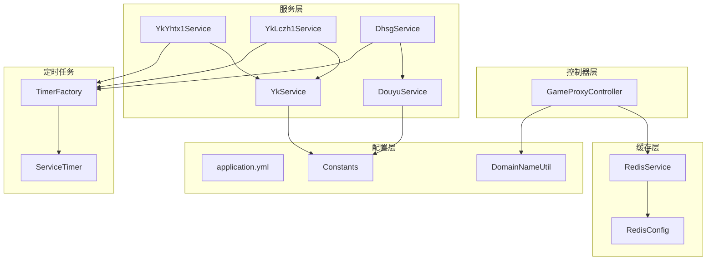
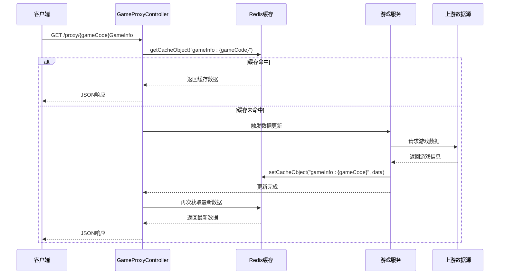
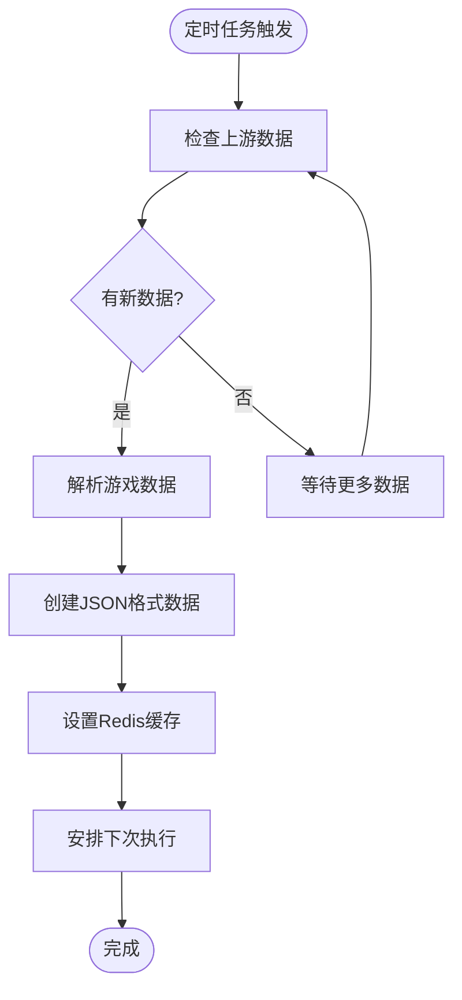
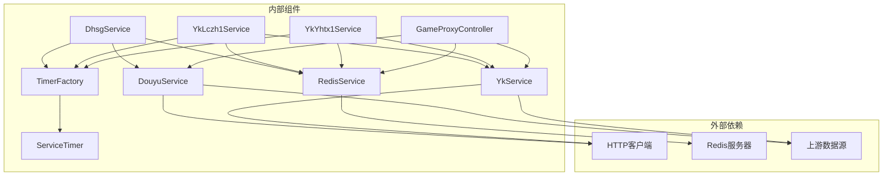

# 游戏信息查询接口

<cite>
**本文档引用的文件**
- [GameProxyController.java](file://game-proxy/src/main/java/com/game/controller/GameProxyController.java)
- [RedisService.java](file://game-proxy/src/main/java/com/game/redis/RedisService.java)
- [RedisConfig.java](file://game-proxy/src/main/java/com/game/redis/RedisConfig.java)
- [YkYhtx1Service.java](file://game-proxy/src/main/java/com/game/yk/yhtx/YkYhtx1Service.java)
- [YkLczh1Service.java](file://game-proxy/src/main/java/com/game/yk/lczh/YkLczh1Service.java)
- [DhsgService.java](file://game-proxy/src/main/java/com/game/douyu/dahsg/DhsgService.java)
- [DouyuService.java](file://game-proxy/src/main/java/com/game/douyu/DouyuService.java)
- [YkService.java](file://game-proxy/src/main/java/com/game/yk/YkService.java)
- [DomainNameUtil.java](file://game-proxy/src/main/java/com/game/utils/DomainNameUtil.java)
- [Constants.java](file://game-proxy/src/main/java/com/game/commom/Constants.java)
- [TimerFactory.java](file://game-proxy/src/main/java/com/game/timer/TimerFactory.java)
- [ServiceTimer.java](file://game-proxy/src/main/java/com/game/timer/ServiceTimer.java)
- [application.yml](file://game-proxy/src/main/resources/application.yml)
</cite>

## 目录
1. [简介](#简介)
2. [项目结构](#项目结构)
3. [核心组件](#核心组件)
4. [架构概览](#架构概览)
5. [详细组件分析](#详细组件分析)
6. [依赖关系分析](#依赖关系分析)
7. [性能考虑](#性能考虑)
8. [故障排除指南](#故障排除指南)
9. [结论](#结论)

## 简介

本文档详细介绍了游戏信息查询接口系统，重点涵盖/getGameInfo系列接口。该系统通过Redis缓存机制为多个游戏平台提供实时游戏信息查询服务，包括银河探险、灵宠召唤、大话三国、小红帽、三国、怪物捕手、深海迷境和宇宙探险等游戏。

系统采用Spring Boot框架构建，通过定时任务机制从上游数据源获取游戏信息，并将其缓存到Redis中，供前端客户端快速查询。每个游戏都有对应的缓存键值，格式为"gameInfo:{gameCode}"。

## 项目结构

游戏信息查询接口系统主要由以下模块组成：



**图表来源**
- [GameProxyController.java](file://game-proxy/src/main/java/com/game/controller/GameProxyController.java#L36-L436)
- [RedisService.java](file://game-proxy/src/main/java/com/game/redis/RedisService.java#L18-L244)
- [YkYhtx1Service.java](file://game-proxy/src/main/java/com/game/yk/yhtx/YkYhtx1Service.java#L29-L134)
- [YkLczh1Service.java](file://game-proxy/src/main/java/com/game/yk/lczh/YkLczh1Service.java#L22-L126)
- [DhsgService.java](file://game-proxy/src/main/java/com/game/douyu/dahsg/DhsgService.java#L25-L129)

**章节来源**
- [GameProxyController.java](file://game-proxy/src/main/java/com/game/controller/GameProxyController.java#L36-L436)
- [application.yml](file://game-proxy/src/main/resources/application.yml#L1-L58)

## 核心组件

### 控制器组件

GameProxyController是系统的入口点，负责处理所有HTTP请求。它包含了8个/getGameInfo系列接口，每个接口都对应一个特定的游戏平台。

### 缓存组件

RedisService提供了完整的Redis操作功能，包括：
- 基本对象缓存（String、Integer、实体类）
- 列表缓存操作
- 集合缓存操作
- 哈希缓存操作
- 键值管理

### 游戏服务组件

系统集成了多个游戏服务，每个游戏都有专门的服务类来处理数据获取和缓存更新。

**章节来源**
- [RedisService.java](file://game-proxy/src/main/java/com/game/redis/RedisService.java#L18-L244)
- [RedisConfig.java](file://game-proxy/src/main/java/com/game/redis/RedisConfig.java#L11-L41)

## 架构概览

系统采用分层架构设计，通过定时任务机制实现数据的异步更新和缓存管理：



**图表来源**
- [GameProxyController.java](file://game-proxy/src/main/java/com/game/controller/GameProxyController.java#L90-L181)
- [YkYhtx1Service.java](file://game-proxy/src/main/java/com/game/yk/yhtx/YkYhtx1Service.java#L49-L77)
- [YkLczh1Service.java](file://game-proxy/src/main/java/com/game/yk/lczh/YkLczh1Service.java#L42-L70)

## 详细组件分析

### 接口命名规则和游戏平台对应关系

系统中的/getGameInfo系列接口遵循统一的命名规则：`/{gamePlatform}GameInfo`，其中gamePlatform对应不同的游戏平台：

| 接口路径 | 游戏平台 | 缓存键值 | 对应服务 |
|---------|---------|---------|---------|
| /yhtxGameInfo | 银河探险 | gameInfo:yhtx | YkYhtx1Service |
| /lczhGameInfo | 灵宠召唤 | gameInfo:lczh | YkLczh1Service |
| /dhsgGameInfo | 大话三国 | gameInfo:dhsg | DhsgService |
| /bjxxhmGameInfo | 小红帽 | gameInfo:bjxxhm | 本地缓存 |
| /bjxsgGameInfo | 三国 | gameInfo:bjxsg | 本地缓存 |
| /bjxgwbsGameInfo | 怪物捕手 | gameInfo:bjxgwbs | 本地缓存 |
| /ljhdshmjGameInfo | 深海迷境 | gameInfo:ljhdshmj | 本地缓存 |
| /ljhdyztxGameInfo | 宇宙探险 | gameInfo:ljhdyztx | 本地缓存 |

### Redis缓存机制

#### 缓存键值命名规范

系统采用统一的缓存键值命名规范：`gameInfo:{gameCode}`，其中gameCode代表不同的游戏标识符。

#### 数据格式

缓存中的数据格式为JSON字符串，包含以下字段：
- `openTime`: 游戏开放时间（毫秒级时间戳）

#### 缓存更新策略

1. **定时更新**: 各游戏服务通过定时任务定期更新缓存
2. **条件更新**: 当检测到新的游戏期号时触发更新
3. **手动更新**: 通过专用接口进行数据更新



**图表来源**
- [YkYhtx1Service.java](file://game-proxy/src/main/java/com/game/yk/yhtx/YkYhtx1Service.java#L49-L77)
- [YkLczh1Service.java](file://game-proxy/src/main/java/com/game/yk/lczh/YkLczh1Service.java#L42-L70)
- [DhsgService.java](file://game-proxy/src/main/java/com/game/douyu/dahsg/DhsgService.java#L46-L69)

**章节来源**
- [GameProxyController.java](file://game-proxy/src/main/java/com/game/controller/GameProxyController.java#L90-L181)
- [RedisService.java](file://game-proxy/src/main/java/com/game/redis/RedisService.java#L30-L44)

### 接口调用示例

#### 基本查询接口

**银河探险信息查询**
```
GET /proxy/yhtxGameInfo
响应: {"openTime": 1700000000000}
```

**灵宠召唤信息查询**
```
GET /proxy/lczhGameInfo
响应: {"openTime": 1700000000000}
```

**大话三国信息查询**
```
GET /proxy/dhsgGameInfo
响应: {"openTime": 1700000000000}
```

#### 特殊游戏接口

**小红帽游戏时间管理**
```
POST /proxy/addUCTime?time=150
响应: "OK"

GET /proxy/getUCTime
响应: {"openTime": 1700000000000}
```

**深海迷境图片识别**
```
GET /proxy/shmjGameImageRecog?imgUrl=xxx.jpg&gameId=1&API_KEY=xxx&SECRET_KEY=xxx
响应: "ok"
```

### 响应数据结构说明

所有/getGameInfo系列接口的响应数据结构均为统一的JSON格式：

```json
{
  "openTime": 1700000000000
}
```

字段说明：
- `openTime`: 游戏开放时间，采用毫秒级Unix时间戳格式

**章节来源**
- [GameProxyController.java](file://game-proxy/src/main/java/com/game/controller/GameProxyController.java#L90-L181)

## 依赖关系分析

系统各组件之间的依赖关系如下：



**图表来源**
- [GameProxyController.java](file://game-proxy/src/main/java/com/game/controller/GameProxyController.java#L41-L83)
- [YkYhtx1Service.java](file://game-proxy/src/main/java/com/game/yk/yhtx/YkYhtx1Service.java#L36-L39)
- [YkLczh1Service.java](file://game-proxy/src/main/java/com/game/yk/lczh/YkLczh1Service.java#L30-L33)
- [DhsgService.java](file://game-proxy/src/main/java/com/game/douyu/dahsg/DhsgService.java#33-L36)

**章节来源**
- [TimerFactory.java](file://game-proxy/src/main/java/com/game/timer/TimerFactory.java#L3-L11)
- [ServiceTimer.java](file://game-proxy/src/main/java/com/game/timer/ServiceTimer.java#L16-L164)

## 性能考虑

### 缓存命中率优化

1. **合理的缓存过期时间**: 不同游戏的缓存过期时间根据游戏特性设置
2. **批量查询支持**: 支持同时查询多个游戏的信息
3. **缓存预热**: 在系统启动时预加载常用游戏数据

### Redis配置优化

系统采用JSON序列化方式存储数据，确保数据的可读性和兼容性：

- **Key序列化**: StringRedisSerializer
- **Value序列化**: GenericJackson2JsonRedisSerializer
- **HashKey序列化**: StringRedisSerializer
- **HashValue序列化**: GenericJackson2JsonRedisSerializer

### 定时任务调度

系统使用定时任务框架实现精确的时间控制：

- **线程池大小**: 12个线程
- **任务清理**: 每5分钟自动清理已完成的任务
- **精确调度**: 支持毫秒级精度的定时执行

**章节来源**
- [RedisConfig.java](file://game-proxy/src/main/java/com/game/redis/RedisConfig.java#L27-L39)
- [ServiceTimer.java](file://game-proxy/src/main/java/com/game/timer/ServiceTimer.java#L21-L24)

## 故障排除指南

### 常见问题及解决方案

#### Redis连接问题

**症状**: 接口调用返回空数据或连接超时
**解决方案**:
1. 检查Redis服务器状态
2. 验证连接配置参数
3. 查看Redis连接池配置

#### 数据更新延迟

**症状**: 查询到的游戏信息不是最新的
**解决方案**:
1. 检查定时任务是否正常运行
2. 验证上游数据源的可用性
3. 确认缓存更新逻辑

#### 接口响应慢

**症状**: 接口响应时间过长
**解决方案**:
1. 优化Redis查询性能
2. 检查网络连接状况
3. 分析系统资源使用情况

### 日志监控

系统提供了详细的日志记录，包括：
- 接口调用日志
- Redis操作日志  
- 定时任务执行日志
- 错误异常日志

**章节来源**
- [GameProxyController.java](file://game-proxy/src/main/java/com/game/controller/GameProxyController.java#L5-L28)

## 结论

游戏信息查询接口系统通过Redis缓存机制实现了高效的游戏信息查询服务。系统具有以下特点：

1. **统一的接口设计**: 所有游戏都提供一致的查询接口
2. **高效的缓存机制**: 通过Redis实现快速的数据访问
3. **灵活的扩展性**: 新增游戏只需添加相应的服务类和缓存键值
4. **稳定的性能表现**: 通过定时任务和缓存策略保证系统的稳定性

该系统为游戏平台提供了可靠的信息查询服务，能够满足高并发场景下的性能需求。通过合理的缓存策略和定时任务机制，系统能够在保证数据准确性的同时提供最佳的用户体验。