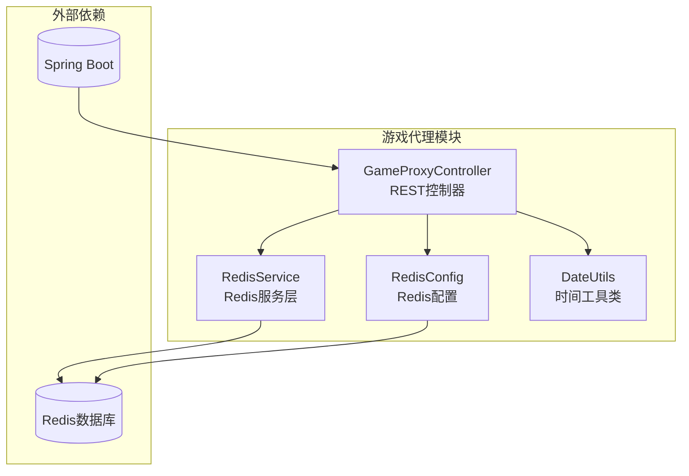
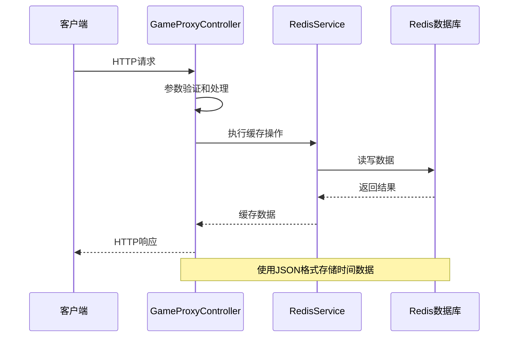
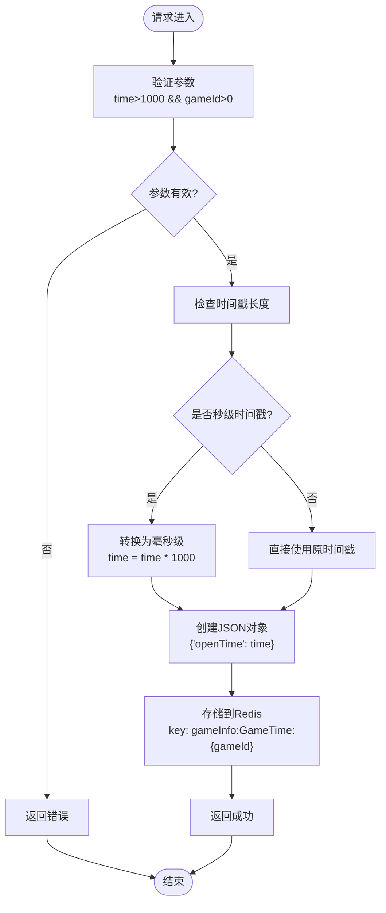
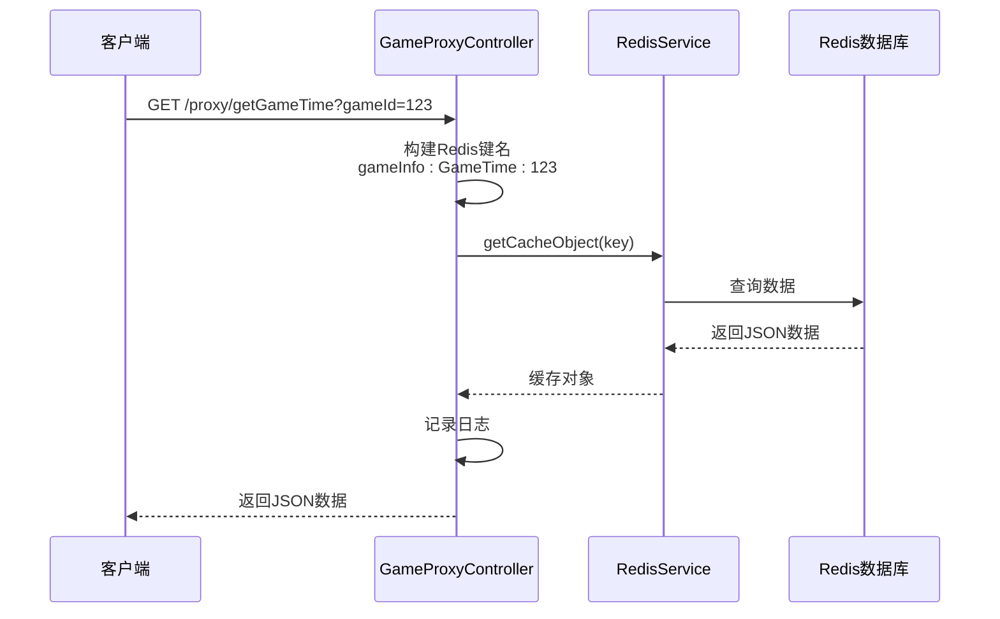
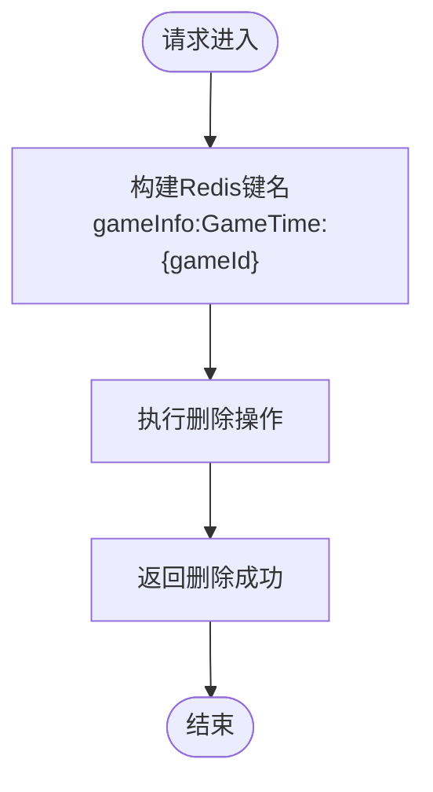
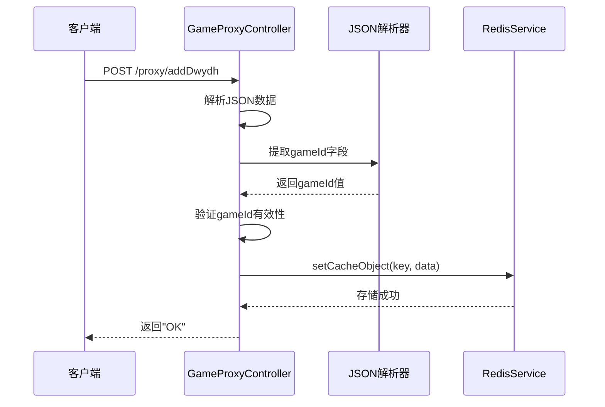
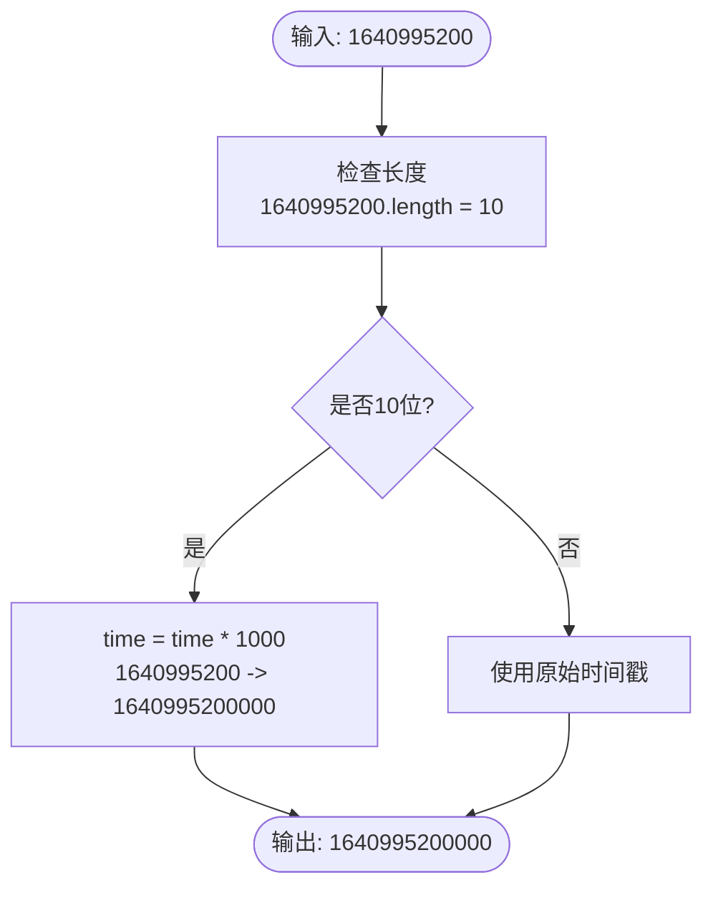
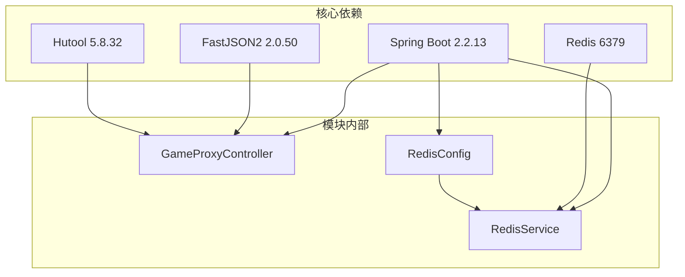

# 游戏时间管理接口

<cite>
**本文档引用的文件**
- [GameProxyController.java](file://game-proxy/src/main/java/com/game/controller/GameProxyController.java)
- [RedisService.java](file://game-proxy/src/main/java/com/game/redis/RedisService.java)
- [RedisConfig.java](file://game-proxy/src/main/java/com/game/redis/RedisConfig.java)
- [application.yml](file://game-proxy/src/main/resources/application.yml)
- [DateUtils.java](file://game-proxy/src/main/java/com/game/utils/DateUtils.java)
- [pom.xml](file://game-proxy/pom.xml)
</cite>

## 目录
1. [简介](#简介)
2. [项目结构](#项目结构)
3. [核心组件](#核心组件)
4. [架构概览](#架构概览)
5. [详细组件分析](#详细组件分析)
6. [依赖关系分析](#依赖关系分析)
7. [性能考虑](#性能考虑)
8. [故障排除指南](#故障排除指南)
9. [结论](#结论)

## 简介

本文档详细介绍了游戏时间管理接口的技术实现，重点涵盖以下三个核心接口：
- `/proxy/setGameTime` - 设置游戏开始时间
- `/proxy/getGameTime` - 查询游戏时间信息  
- `/proxy/delGameTime` - 删除游戏时间记录

同时详细说明了宠物马拉松游戏时间设置接口 `/proxy/addDwydh` 的实现方法。文档提供了完整的数据格式规范、时间戳转换逻辑、Redis缓存策略以及业务应用场景说明。

## 项目结构

游戏时间管理功能位于 `game-proxy` 模块中，采用Spring Boot框架构建，主要包含以下核心组件：



**图表来源**
- [GameProxyController.java](file://game-proxy/src/main/java/com/game/controller/GameProxyController.java#L30-L436)
- [RedisService.java](file://game-proxy/src/main/java/com/game/redis/RedisService.java#L13-L244)
- [RedisConfig.java](file://game-proxy/src/main/java/com/game/redis/RedisConfig.java#L10-L41)

**章节来源**
- [GameProxyController.java](file://game-proxy/src/main/java/com/game/controller/GameProxyController.java#L1-L50)
- [pom.xml](file://game-proxy/pom.xml#L1-L163)

## 核心组件

### REST控制器层

`GameProxyController` 是游戏时间管理的核心控制器，负责处理所有HTTP请求并协调业务逻辑执行。

### Redis服务层

`RedisService` 提供统一的Redis访问接口，封装了常用的缓存操作，包括：
- 缓存对象设置和获取
- 数据过期时间管理
- 键值操作和集合操作

### Redis配置层

`RedisConfig` 配置Redis连接和序列化策略，确保数据正确存储和读取。

**章节来源**
- [GameProxyController.java](file://game-proxy/src/main/java/com/game/controller/GameProxyController.java#L30-L436)
- [RedisService.java](file://game-proxy/src/main/java/com/game/redis/RedisService.java#L13-L244)
- [RedisConfig.java](file://game-proxy/src/main/java/com/game/redis/RedisConfig.java#L10-L41)

## 架构概览

游戏时间管理采用分层架构设计，实现了清晰的关注点分离：



**图表来源**
- [GameProxyController.java](file://game-proxy/src/main/java/com/game/controller/GameProxyController.java#L325-L354)
- [RedisService.java](file://game-proxy/src/main/java/com/game/redis/RedisService.java#L24-L107)

## 详细组件分析

### setGameTime 接口实现

#### 接口定义
- **URL**: `/proxy/setGameTime`
- **方法**: GET
- **参数**:
  - `time`: 游戏开始时间戳（支持秒级和毫秒级）
  - `gameId`: 游戏标识符（必须大于0）

#### 实现逻辑



**图表来源**
- [GameProxyController.java](file://game-proxy/src/main/java/com/game/controller/GameProxyController.java#L326-L337)

#### 时间戳处理机制

接口支持两种时间戳格式：

1. **秒级时间戳处理**：
   - 检测时间戳长度是否为10位
   - 自动转换为毫秒级格式（乘以1000）

2. **毫秒级时间戳处理**：
   - 直接使用传入的时间戳
   - 不进行任何转换

#### Redis存储策略

- **键名格式**: `gameInfo:GameTime:{gameId}`
- **存储内容**: JSON格式的开放时间数据
- **数据结构**: `{"openTime": 时间戳}`

**章节来源**
- [GameProxyController.java](file://game-proxy/src/main/java/com/game/controller/GameProxyController.java#L326-L337)

### getGameTime 接口实现

#### 接口定义
- **URL**: `/proxy/getGameTime`
- **方法**: GET
- **参数**: `gameId` - 游戏标识符

#### 实现逻辑



**图表来源**
- [GameProxyController.java](file://game-proxy/src/main/java/com/game/controller/GameProxyController.java#L341-L346)

#### 功能特性
- 支持实时查询任意游戏的开始时间
- 自动记录查询日志便于监控
- 返回完整的JSON格式数据

**章节来源**
- [GameProxyController.java](file://game-proxy/src/main/java/com/game/controller/GameProxyController.java#L341-L346)

### delGameTime 接口实现

#### 接口定义
- **URL**: `/proxy/delGameTime`
- **方法**: GET
- **参数**: `gameId` - 游戏标识符

#### 实现逻辑



**图表来源**
- [GameProxyController.java](file://game-proxy/src/main/java/com/game/controller/GameProxyController.java#L350-L354)

#### 功能特性
- 支持删除指定游戏的时间记录
- 删除操作不可逆
- 返回标准的确认响应

**章节来源**
- [GameProxyController.java](file://game-proxy/src/main/java/com/game/controller/GameProxyController.java#L350-L354)

### addDwydh 接口实现

#### 接口定义
- **URL**: `/proxy/addDwydh`
- **方法**: POST
- **参数**: JSON格式的请求体

#### 数据格式规范

**请求体JSON结构**:
```json
{
  "gameId": "12345",
  "openTime": 1640995200000,
  "otherFields": "..."
}
```

**字段说明**:
- `gameId`: 必填，游戏唯一标识符
- `openTime`: 必填，游戏开始时间戳（毫秒级）
- 其他字段: 可选的业务相关数据

#### 实现逻辑



**图表来源**
- [GameProxyController.java](file://game-proxy/src/main/java/com/game/controller/GameProxyController.java#L290-L297)

#### 处理流程
1. 接收POST请求的JSON数据
2. 解析JSON并提取 `gameId` 字段
3. 验证数据的有效性
4. 使用 `gameId` 作为键存储完整JSON数据
5. 返回标准响应

**章节来源**
- [GameProxyController.java](file://game-proxy/src/main/java/com/game/controller/GameProxyController.java#L290-L297)

### 时间格式转换详解

#### 秒级时间戳转换

当传入的时间戳为10位数字时，系统自动将其转换为毫秒级格式：



**图表来源**
- [GameProxyController.java](file://game-proxy/src/main/java/com/game/controller/GameProxyController.java#L330-L332)

#### 毫秒级时间戳处理

对于13位或更长的时间戳，系统直接使用原值，不进行转换。

#### 时间格式转换工具

系统还提供了 `parseTime` 方法来处理多种时间格式：

```mermaid
flowchart TD
Input([输入: "HH:mm:ss"]) --> ContainsColon{"包含冒号?"}
ContainsColon --> |是| SplitTime["按冒号分割"]
SplitTime --> CheckFormat{"格式类型"}
CheckFormat --> |HH:mm:ss| ParseHMS["解析时:分:秒"]
CheckFormat --> |HH:mm| ParseHM["解析时:分"]
ParseHMS --> CalculateSeconds["计算总秒数"]
ParseHM --> CalculateSeconds
ContainsColon --> |否| ParseAsSeconds["直接解析为秒数"]
CalculateSeconds --> Output([输出: 秒数])
ParseAsSeconds --> Output
```

**图表来源**
- [GameProxyController.java](file://game-proxy/src/main/java/com/game/controller/GameProxyController.java#L306-L322)

**章节来源**
- [GameProxyController.java](file://game-proxy/src/main/java/com/game/controller/GameProxyController.java#L306-L337)

## 依赖关系分析

### 外部依赖

游戏时间管理模块依赖以下关键组件：



**图表来源**
- [pom.xml](file://game-proxy/pom.xml#L26-L100)
- [application.yml](file://game-proxy/src/main/resources/application.yml#L15-L31)

### Redis配置详解

系统使用Lettuce连接池管理Redis连接：

- **连接池配置**:
  - 最大活跃连接: 20
  - 最大空闲连接: 5
  - 最小空闲连接: 0

- **序列化策略**:
  - Key序列化: StringRedisSerializer
  - Value序列化: GenericJackson2JsonRedisSerializer
  - Hash Key序列化: StringRedisSerializer
  - Hash Value序列化: GenericJackson2JsonRedisSerializer

**章节来源**
- [pom.xml](file://game-proxy/pom.xml#L26-L100)
- [RedisConfig.java](file://game-proxy/src/main/java/com/game/redis/RedisConfig.java#L27-L39)
- [application.yml](file://game-proxy/src/main/resources/application.yml#L15-L31)

## 性能考虑

### Redis性能优化

1. **连接池管理**: 合理配置连接池大小，避免连接争用
2. **序列化优化**: 使用JSON序列化减少存储空间
3. **键命名规范**: 统一的键命名模式便于管理和维护

### 缓存策略

- **setGameTime**: 无过期时间限制，适合长期存储
- **其他临时数据**: 可根据业务需求设置合适的过期时间

### 并发处理

系统采用Spring Boot的并发模型，能够有效处理高并发请求场景。

## 故障排除指南

### 常见问题及解决方案

#### Redis连接失败
**症状**: 接口调用报错，无法连接到Redis
**原因**: Redis服务未启动或配置错误
**解决方案**: 
1. 检查Redis服务状态
2. 验证 `application.yml` 中的Redis配置
3. 确认网络连接正常

#### 参数验证失败
**症状**: `setGameTime` 返回错误
**原因**: `time` 或 `gameId` 参数无效
**解决方案**:
1. 确保 `time` 大于1000
2. 确保 `gameId` 大于0
3. 检查时间戳格式是否正确

#### JSON解析错误
**症状**: `addDwydh` 接口返回异常
**原因**: 请求体不是有效的JSON格式
**解决方案**:
1. 确保请求体为合法JSON格式
2. 验证 `gameId` 字段存在且有效
3. 检查JSON语法是否正确

**章节来源**
- [GameProxyController.java](file://game-proxy/src/main/java/com/game/controller/GameProxyController.java#L326-L354)
- [RedisService.java](file://game-proxy/src/main/java/com/game/redis/RedisService.java#L24-L107)

## 结论

游戏时间管理接口提供了完整的游戏时间生命周期管理功能，包括时间设置、查询和删除操作。系统采用Redis作为数据存储，具有以下优势：

1. **高性能**: Redis内存存储提供快速的数据访问
2. **简单易用**: RESTful API设计简洁直观
3. **可扩展性**: 模块化设计便于功能扩展
4. **可靠性**: 完善的错误处理和日志记录机制

通过合理的时间戳处理机制和灵活的JSON数据格式，系统能够满足不同游戏场景的时间管理需求。建议在生产环境中结合具体的业务场景调整Redis配置和缓存策略，以获得最佳的性能表现。